# Design a Distributed Key-Value Store -- High-Level Design

## Table of Contents
- [2.1 System Architecture Overview](#21-system-architecture-overview)
- [2.2 Core Components](#22-core-components)
- [2.3 Consistent Hashing with Virtual Nodes](#23-consistent-hashing-with-virtual-nodes)
- [2.4 Data Replication and Preference List](#24-data-replication-and-preference-list)
- [2.5 Quorum Reads and Writes](#25-quorum-reads-and-writes)
- [2.6 Write Path -- Coordinator to Disk](#26-write-path----coordinator-to-disk)
- [2.7 Read Path -- Coordinator to Merge](#27-read-path----coordinator-to-merge)
- [2.8 Storage Engine -- LSM Tree](#28-storage-engine----lsm-tree)
- [2.9 Conflict Resolution -- Vector Clocks](#29-conflict-resolution----vector-clocks)
- [2.10 Membership and Failure Detection -- Gossip Protocol](#210-membership-and-failure-detection----gossip-protocol)
- [2.11 Complete Architecture Diagram](#211-complete-architecture-diagram)

---

## 2.1 System Architecture Overview

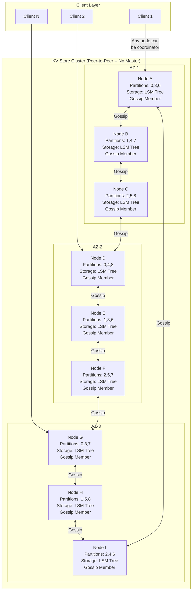

### Architecture Principles -- The Dynamo Approach

This design is fundamentally different from a distributed cache:

1. **Peer-to-peer, no master**: Every node is equal. Any node can coordinate any request.
   There is no leader/follower distinction. This eliminates single points of failure.
   Contrast with Redis Cluster (has leaders) or a cache (uses ZooKeeper for coordination).

2. **Data is persistent and durable**: Every write goes to a Write-Ahead Log (WAL) and is
   flushed to SSD via LSM trees. The data survives power loss, node crashes, and even disk
   failures (via replication). A cache loses data on restart; a KV store must not.

3. **Replication is for durability, not just failover**: In a cache, a replica is a hot
   standby. Here, all N replicas are active -- reads can go to any of them. Replication
   ensures that losing any single node (or even two nodes) loses zero data.

4. **Consistency is tunable per-request**: The client chooses the trade-off between
   consistency and latency on every single operation. This is the R/W/N quorum model.

5. **Conflicts are expected and handled**: Unlike a cache (where stale data is merely
   inconvenient), conflicts in a persistent store mean data loss. Vector clocks and read
   repair are essential, not optional.

---

## 2.2 Core Components

| Component | Responsibility | Key Design Decisions |
|-----------|---------------|---------------------|
| **Client Library** | Connects to any node. Can be topology-aware (smart client) or use a load balancer (thin client). Passes consistency level per request. | Smart clients cache the hash ring and route directly to the coordinator for the key's partition, reducing hops. |
| **Coordinator Node** | The node that receives a client request. Determines the preference list (N replicas) for the key and orchestrates the quorum. Any node can coordinate any request. | The coordinator is NOT a special role -- it is whichever node the client contacts. This is Dynamo's "zero-hop" routing. |
| **Storage Engine (LSM Tree)** | Each node stores data using a Log-Structured Merge Tree: memtable (in-memory) + SSTables (on-disk). Writes are append-only for high throughput. | LSM trees are write-optimized. Reads use Bloom filters to skip SSTables that do not contain the key. |
| **Replication Manager** | Manages the preference list for each key. Ensures writes reach N replicas. Handles hinted handoff when a replica is temporarily down. | Replicas are chosen as N consecutive distinct physical nodes on the hash ring. Cross-AZ placement is preferred. |
| **Gossip Protocol** | Every node periodically exchanges membership state with random peers. Detects node failures (Phi Accrual Failure Detector). Propagates ring changes. | Gossip is decentralized -- no ZooKeeper needed. Every node eventually learns about every other node. |
| **Anti-Entropy Manager** | Runs Merkle tree comparisons in the background to detect and repair divergent replicas. Handles permanent failures. | Merkle trees efficiently find divergent key ranges without comparing every key-value pair. |
| **Compaction Engine** | Merges SSTables to reclaim space, remove tombstones (after grace period), and reduce read amplification. | Compaction runs in the background. Strategies: Size-Tiered (write-optimized) or Leveled (read-optimized). |
| **Failure Detector** | Uses Phi Accrual Failure Detector to probabilistically determine if a node is alive or dead. Better than simple heartbeat timeouts. | Phi value is a continuous suspicion level, not a binary alive/dead. Threshold is configurable. |

---

## 2.3 Consistent Hashing with Virtual Nodes

### Why Consistent Hashing?

Traditional modular hashing (`hash(key) % N`) is catastrophic when nodes change:
if N changes from 10 to 11, almost ALL keys remap. Consistent hashing ensures only
~K/N keys move when a node is added or removed (K = total keys, N = total nodes).

### The Hash Ring

```
Consistent Hash Ring (0 to 2^128 - 1):

                         0 / 2^128
                           |
                     Node A (vnode 1)
                      /         \
              Node I           Node B
             (vnode 2)        (vnode 1)
                |                 |
            Node H             Node C
           (vnode 3)          (vnode 1)
                |                 |
              Node G           Node D
             (vnode 1)        (vnode 2)
                      \         /
                     Node F  Node E
                    (vnode 1)(vnode 2)

  Each PHYSICAL node has multiple VIRTUAL nodes (vnodes) on the ring.
  A key is hashed and assigned to the first node clockwise from its hash position.
  
  Example: hash("user:1001") = 0x3FA2...
           Falls between Node B (vnode 1) and Node C (vnode 1)
           Assigned to Node C (first node clockwise)
```

### Virtual Nodes (vnodes)

Without virtual nodes, the ring is unbalanced -- nodes with larger arcs own more keys.
Virtual nodes solve this by placing each physical node at multiple positions on the ring.

```
Without virtual nodes (3 physical nodes):

  Ring: [---A-----------B---C--------------]
  Node A: owns 40% of ring  (unfair!)
  Node B: owns 10% of ring
  Node C: owns 50% of ring

With virtual nodes (3 physical nodes, 4 vnodes each):

  Ring: [A1-B2-C1-A3-B1-C4-A2-B3-C3-A4-B4-C2]
  Node A: owns 33.2% of ring  (fair)
  Node B: owns 33.1% of ring  (fair)
  Node C: owns 33.7% of ring  (fair)

Standard: 256 vnodes per physical node
  -> 9 physical nodes = 2304 vnodes on the ring
  -> Maximum imbalance: < 5% deviation from ideal
  -> When a node leaves, its load is spread evenly across all remaining nodes
```

### Node Addition with Consistent Hashing

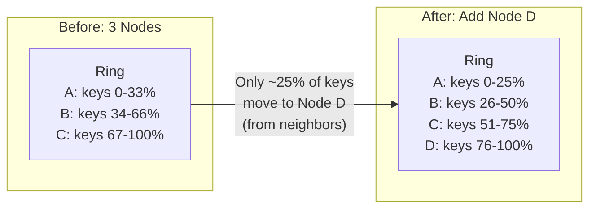

```
What happens when Node D joins:

  Before (3 nodes, each ~33% of keys):
    Node A: 333M keys
    Node B: 333M keys  
    Node C: 334M keys
    
  After (4 nodes):
    Node A: 250M keys  (gave ~83M to D)
    Node B: 250M keys  (gave ~83M to D)
    Node C: 250M keys  (gave ~84M to D)
    Node D: 250M keys  (received from A, B, C)
    
  Key insight: ONLY keys that hash to D's vnodes move.
  The other 75% of keys do NOT move. Zero-downtime rebalancing.
```

---

## 2.4 Data Replication and Preference List

### Preference List

For each key, the system maintains a **preference list** of N nodes responsible for that key.
This is the cornerstone of Dynamo's replication strategy.

```
Preference List Construction:

  1. Hash the key to find its position on the ring
  2. Walk clockwise from that position
  3. Collect the first N DISTINCT PHYSICAL nodes
     (skip vnodes belonging to already-collected physical nodes)
  4. This ordered list is the preference list
  
  Example with N=3:
  
  Ring position of hash("user:1001"):
                    |
    ...-[A-vnode3]-[B-vnode1]-[B-vnode4]-[C-vnode2]-[D-vnode1]-...
                    ^          skip!       ^          ^
                    |          (B already   |          |
                    |          collected)   |          |
                    B          ---         C          D
  
  Preference list for "user:1001": [B, C, D]
    - B is the "coordinator" (first in list)
    - C and D are replication targets
    - All three store a complete copy of the value
```

### Replication Flow

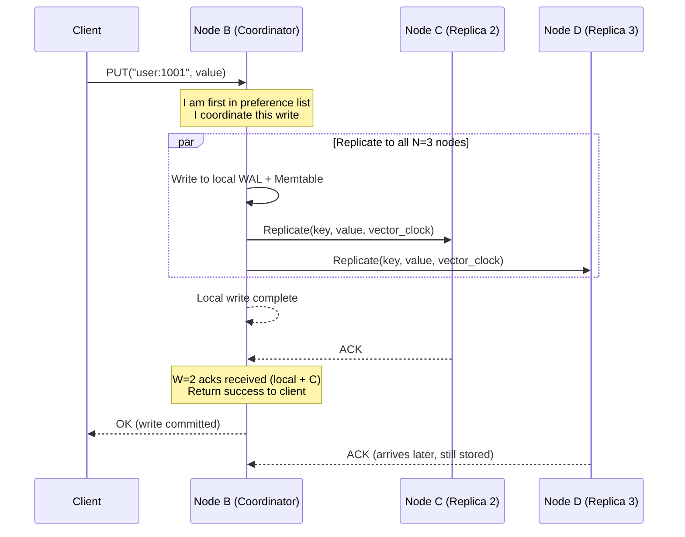

### Cross-AZ Replication Placement

```
For N=3, we want replicas in 3 different AZs for maximum durability:

  Rack/AZ-aware placement:
  
  AZ-1: [Node A, Node B, Node C]
  AZ-2: [Node D, Node E, Node F]  
  AZ-3: [Node G, Node H, Node I]
  
  For key "user:1001" with preference list [B, E, G]:
    Replica 1: Node B (AZ-1)   -- if AZ-1 goes down...
    Replica 2: Node E (AZ-2)   -- AZ-2 still has the data
    Replica 3: Node G (AZ-3)   -- AZ-3 also has it
    
  Can survive: any 1 AZ failure, any 2 node failures (if in different AZs)
  
  This is NOT random -- the hash ring construction ensures cross-AZ placement
  by interleaving vnodes from different AZs.
```

---

## 2.5 Quorum Reads and Writes

### The Quorum Model: R + W > N

The quorum model is the heart of tunable consistency. It is based on a simple mathematical
insight: if you write to W nodes and read from R nodes, and R + W > N, then at least one
node in the read set must have the latest write.

```
The Pigeonhole Principle applied to distributed systems:

  N = 3 replicas: [Node B, Node C, Node D]
  
  CASE 1: W=2, R=2 (standard quorum)
    Write goes to:  B, C      (W=2 nodes have the new value)
    Read goes to:   C, D      (R=2 nodes respond)
    Overlap:        C          (has the latest value!)
    R + W = 4 > 3 = N         (guaranteed overlap)
  
  CASE 2: W=1, R=1 (eventual consistency)
    Write goes to:  B          (only 1 node has new value)
    Read goes to:   D          (might read stale!)
    Overlap:        NONE       (no guarantee)
    R + W = 2 <= 3 = N        (no guaranteed overlap)
  
  CASE 3: W=3, R=1 (write-all, read-any)
    Write goes to:  B, C, D   (all nodes have new value)
    Read goes to:   D          (guaranteed to have latest)
    R + W = 4 > 3 = N         (guaranteed overlap)
    Trade-off: writes are slow (wait for all), reads are fast
```

### Quorum Write Flow

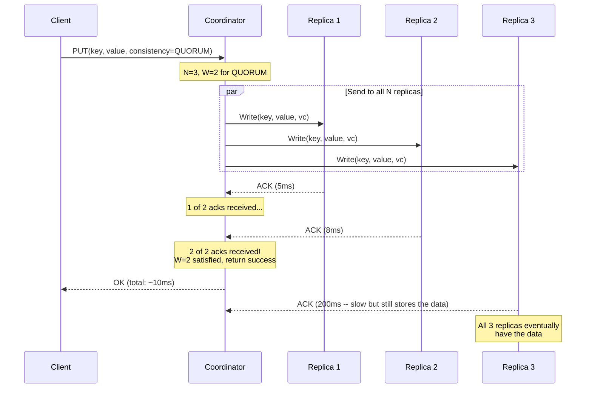

### Quorum Read Flow with Conflict

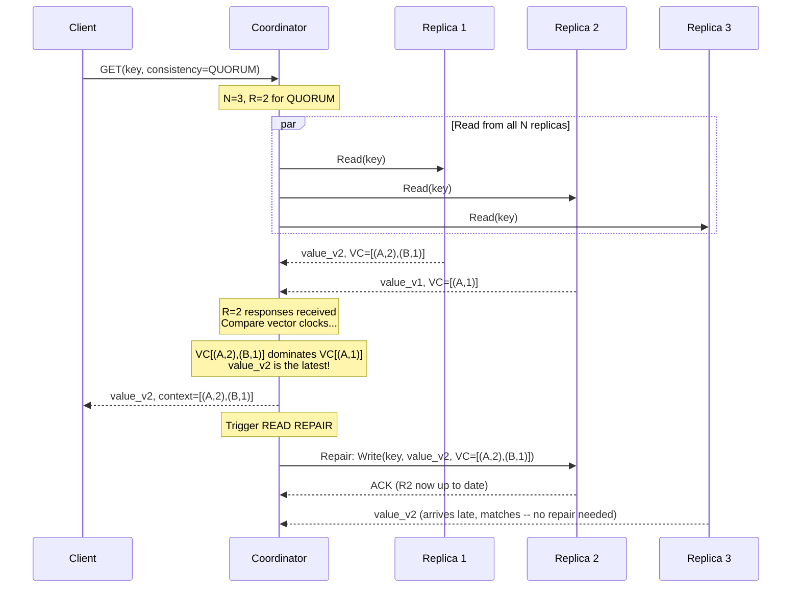

---

## 2.6 Write Path -- Coordinator to Disk

### End-to-End Write Path

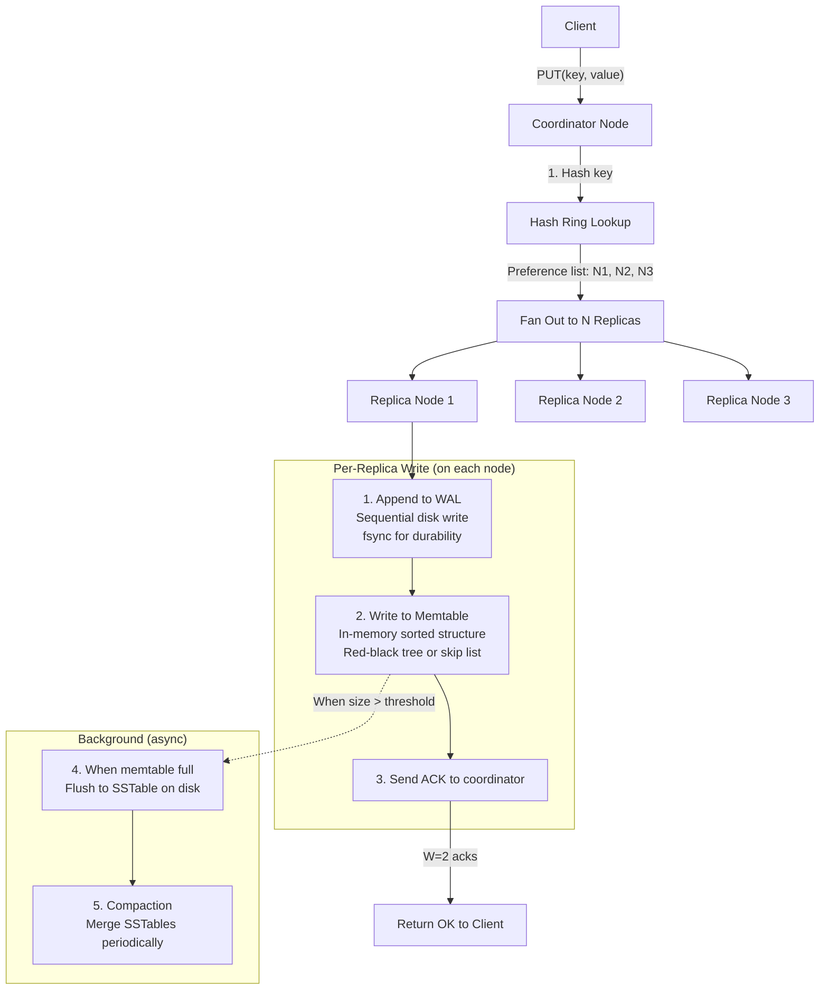

### Detailed Per-Node Write Sequence

```
What happens when a single node receives a write:

Step 1: COMMIT LOG (Write-Ahead Log)
  +--------------------------------------------------------------+
  | The value is appended to the commit log (sequential write).  |
  | This is an append-only file on disk.                         |
  | fsync() is called to guarantee durability.                   |
  | If the node crashes after this point, the write is safe.     |
  |                                                              |
  | WAL entry format:                                            |
  | [checksum][timestamp][key_len][key][value_len][value][vc]    |
  +--------------------------------------------------------------+
  Cost: ~0.5ms (sequential SSD write + fsync)

Step 2: MEMTABLE (In-Memory)
  +--------------------------------------------------------------+
  | The value is inserted into the memtable (sorted in-memory    |
  | data structure -- typically a skip list or red-black tree).  |
  | The memtable serves as a write buffer.                       |
  | Reads check the memtable FIRST (most recent data is here).  |
  +--------------------------------------------------------------+
  Cost: ~0.01ms (in-memory tree insert)

Step 3: ACK TO COORDINATOR
  +--------------------------------------------------------------+
  | Send acknowledgement back to the coordinator.                |
  | The write is complete from this node's perspective.          |
  | The data is durable (WAL) and queryable (memtable).         |
  +--------------------------------------------------------------+
  Cost: ~0.1ms (network)

Step 4: MEMTABLE FLUSH (Background, async)
  +--------------------------------------------------------------+
  | When the memtable reaches a threshold (e.g., 64 MB):        |
  | 1. The current memtable is frozen (becomes immutable)        |
  | 2. A new empty memtable is created for incoming writes       |
  | 3. The frozen memtable is written to disk as an SSTable      |
  | 4. The corresponding WAL entries can be discarded            |
  +--------------------------------------------------------------+
  Cost: ~100ms (background, does not block writes)

Step 5: COMPACTION (Background, async)
  +--------------------------------------------------------------+
  | SSTables accumulate over time. Compaction merges them:       |
  | 1. Merge overlapping SSTables into larger ones               |
  | 2. Discard overwritten values (keep only latest)             |
  | 3. Remove tombstones past grace period                       |
  | 4. Rebuild Bloom filters and index blocks                    |
  +--------------------------------------------------------------+
  Cost: minutes (background, rate-limited to not starve reads)
```

---

## 2.7 Read Path -- Coordinator to Merge

### End-to-End Read Path

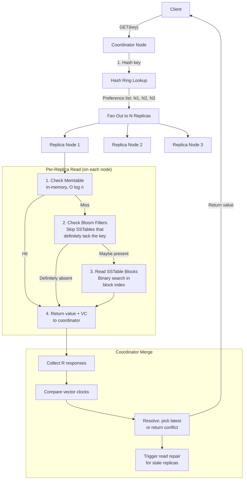

### Per-Node Read Sequence (LSM Tree Lookup)

```
What happens when a single node receives a read for key K:

Step 1: CHECK MEMTABLE
  +--------------------------------------------------------------+
  | Search the active memtable (skip list / red-black tree).     |
  | O(log n) lookup where n = entries in memtable (~1M).         |
  | If found: return immediately (fastest path).                 |
  | Also check the immutable memtable (being flushed).           |
  +--------------------------------------------------------------+
  Cost: ~0.01ms

Step 2: CHECK BLOOM FILTERS (per SSTable)
  +--------------------------------------------------------------+
  | For each SSTable (newest to oldest):                         |
  |   Query the Bloom filter: "Does this SSTable contain K?"     |
  |   - If NO (definite): skip this SSTable entirely             |
  |   - If YES (probable): proceed to read the SSTable           |
  |                                                              |
  | Bloom filter: ~10 bits per key, < 1% false positive rate     |
  | With 100 SSTables, Bloom filters save ~99 disk reads!        |
  +--------------------------------------------------------------+
  Cost: ~0.001ms per Bloom filter check (in memory)

Step 3: READ SSTABLE
  +--------------------------------------------------------------+
  | 1. Check the SSTable's index block (sparse index of keys)    |
  |    Binary search for the block containing K                  |
  | 2. Read the data block from disk (4-64 KB)                   |
  |    If cached in block cache: ~0.01ms                         |
  |    If on SSD: ~0.1-1ms                                       |
  | 3. Search within the block for key K                         |
  | 4. Decompress block if compressed (LZ4: ~0.01ms)             |
  +--------------------------------------------------------------+
  Cost: ~0.1ms (cached) to ~1ms (SSD read)

Step 4: RETURN TO COORDINATOR
  +--------------------------------------------------------------+
  | Return: {key, value, vector_clock, timestamp}                |
  | Or: KEY_NOT_FOUND if not in any SSTable                      |
  +--------------------------------------------------------------+

Read path optimization summary:
  Best case (memtable hit):     ~0.01ms
  Typical (block cache hit):    ~0.1ms  
  Worst case (SSD read):        ~1-3ms
  Bloom filters prevent:        ~99% of unnecessary disk reads
```

### Read Repair

```
Read Repair is a passive anti-entropy mechanism triggered during normal reads:

  Coordinator reads from R1, R2, R3 for key "user:1001":
  
    R1 responds: value_v3, VC=[(A,3),(B,1)]    <- latest
    R2 responds: value_v2, VC=[(A,2),(B,1)]    <- stale!
    R3 responds: value_v3, VC=[(A,3),(B,1)]    <- latest
    
  Coordinator determines v3 dominates v2 (A:3 > A:2, B:1 = B:1).
  
  1. Returns value_v3 to the client immediately
  2. Sends repair write to R2: "Update to value_v3 with VC=[(A,3),(B,1)]"
  3. R2 is now consistent with R1 and R3
  
  This "heals" stale replicas opportunistically during reads.
  It is NOT a replacement for anti-entropy (Merkle trees) -- it only
  repairs keys that are actually read. Unread stale keys remain stale
  until anti-entropy catches them.
```

---

## 2.8 Storage Engine -- LSM Tree

### LSM Tree Architecture

The Log-Structured Merge Tree is the storage engine that makes high write throughput
possible. It converts random writes into sequential writes.

```
LSM Tree Structure:

  ┌──────────────────────────────────────────────────────┐
  │                    MEMORY                              │
  │  ┌─────────────────────────────────────────────┐      │
  │  │  Active Memtable (64 MB)                    │      │
  │  │  Sorted skip list / red-black tree          │      │
  │  │  All writes go here first                   │      │
  │  │  Key1 -> Val1, Key5 -> Val5, Key3 -> Val3   │      │
  │  └─────────────────────────────────────────────┘      │
  │  ┌─────────────────────────────────────────────┐      │
  │  │  Immutable Memtable (being flushed to disk) │      │
  │  └─────────────────────────────────────────────┘      │
  ├──────────────────────────────────────────────────────┤
  │                    DISK                                │
  │                                                        │
  │  Level 0 (L0): Recently flushed, may overlap           │
  │  ┌──────┐ ┌──────┐ ┌──────┐ ┌──────┐                 │
  │  │SST-1 │ │SST-2 │ │SST-3 │ │SST-4 │  (4 files)     │
  │  └──────┘ └──────┘ └──────┘ └──────┘                 │
  │                    ↓ compaction                        │
  │  Level 1 (L1): Non-overlapping, sorted                 │
  │  ┌──────────┐ ┌──────────┐ ┌──────────┐              │
  │  │ SST-A    │ │ SST-B    │ │ SST-C    │ (10 MB each) │
  │  │ keys a-f │ │ keys g-m │ │ keys n-z │              │
  │  └──────────┘ └──────────┘ └──────────┘              │
  │                    ↓ compaction                        │
  │  Level 2 (L2): 10x larger than L1                      │
  │  ┌───┐┌───┐┌───┐┌───┐┌───┐┌───┐┌───┐┌───┐┌───┐┌───┐│
  │  │   ││   ││   ││   ││   ││   ││   ││   ││   ││   ││
  │  └───┘└───┘└───┘└───┘└───┘└───┘└───┘└───┘└───┘└───┘│
  │  (each 10 MB, non-overlapping, sorted, ~30 files)     │
  │                    ↓ compaction                        │
  │  Level 3 (L3): 10x larger than L2                      │
  │  (hundreds of files, each 10 MB)                       │
  │                                                        │
  └──────────────────────────────────────────────────────┘

  Why this design?
  - WRITES are always sequential (append to WAL, insert to memtable)
  - No random disk writes = SSD-friendly, high throughput
  - READS check memtable first, then L0, L1, L2... (newest to oldest)
  - Bloom filters skip levels that do not contain the key
```

### SSTable File Format

```
SSTable (Sorted String Table) internal structure:

+================================================================+
| DATA BLOCKS (4 KB each, sorted by key)                         |
|  +----------------------------------------------------------+  |
|  | Block 1: [key1|val1|vc1] [key2|val2|vc2] ... [keyN|valN] |  |
|  +----------------------------------------------------------+  |
|  | Block 2: [key101|val101] [key102|val102] ...              |  |
|  +----------------------------------------------------------+  |
|  | ...                                                       |  |
|  | Block K: [keyM|valM|vcM] ...                              |  |
|  +----------------------------------------------------------+  |
+================================================================+
| INDEX BLOCK (sparse index: one entry per data block)           |
|  +----------------------------------------------------------+  |
|  | key1  -> offset 0     (first key of block 1)             |  |
|  | key101 -> offset 4096  (first key of block 2)            |  |
|  | key201 -> offset 8192  (first key of block 3)            |  |
|  | ...                                                       |  |
|  +----------------------------------------------------------+  |
+================================================================+
| BLOOM FILTER (bit array, ~10 bits per key)                     |
|  +----------------------------------------------------------+  |
|  | [01001010110010100101011001010010...]                      |  |
|  | Size: ~1.2 MB for 1M keys (< 1% false positive)          |  |
|  +----------------------------------------------------------+  |
+================================================================+
| METADATA (min key, max key, entry count, compression, etc.)    |
+================================================================+
| FOOTER (offsets to index block, bloom filter, metadata)        |
+================================================================+
```

### Compaction Strategies

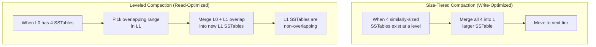

```
Compaction Strategy Comparison:

+----------------------+---------------------------+---------------------------+
| Aspect               | Size-Tiered               | Leveled                   |
+----------------------+---------------------------+---------------------------+
| Write amplification  | Low (good for writes)     | High (10-30x)             |
| Read amplification   | High (many files to check)| Low (1 file per level)    |
| Space amplification  | High (temporary duplication)| Low (bounded)            |
| Best for             | Write-heavy workloads     | Read-heavy workloads      |
| Used by              | Cassandra (default)       | RocksDB, LevelDB          |
| Disk space during    | 2x temporarily            | ~10% overhead             |
| compaction           |                           |                           |
+----------------------+---------------------------+---------------------------+
```

---

## 2.9 Conflict Resolution -- Vector Clocks

### Why Vector Clocks?

Wall clocks are unreliable in distributed systems -- nodes have clock skew, NTP can jump,
and even with synchronized clocks, two events at the "same time" are actually concurrent.
Vector clocks provide a way to track causal ordering without relying on physical time.

```
Vector Clock Basics:

  Each node maintains a counter. When it processes a write, it increments its counter.
  
  Node A writes key K:  VC = {A:1}
  Node B writes key K:  VC = {B:1}
  
  Ordering rules:
    VC1 > VC2  (VC1 happened after VC2) iff:
      Every counter in VC1 >= corresponding counter in VC2
      AND at least one counter in VC1 > corresponding counter in VC2
    
    If neither VC1 > VC2 nor VC2 > VC1 -> CONCURRENT
    
  Example:
    {A:2, B:1} > {A:1, B:1}      -- A advanced (causal successor)
    {A:1, B:2} > {A:1, B:1}      -- B advanced (causal successor)
    {A:2, B:1} || {A:1, B:2}     -- CONCURRENT (neither dominates)
```

### Vector Clock Evolution Example

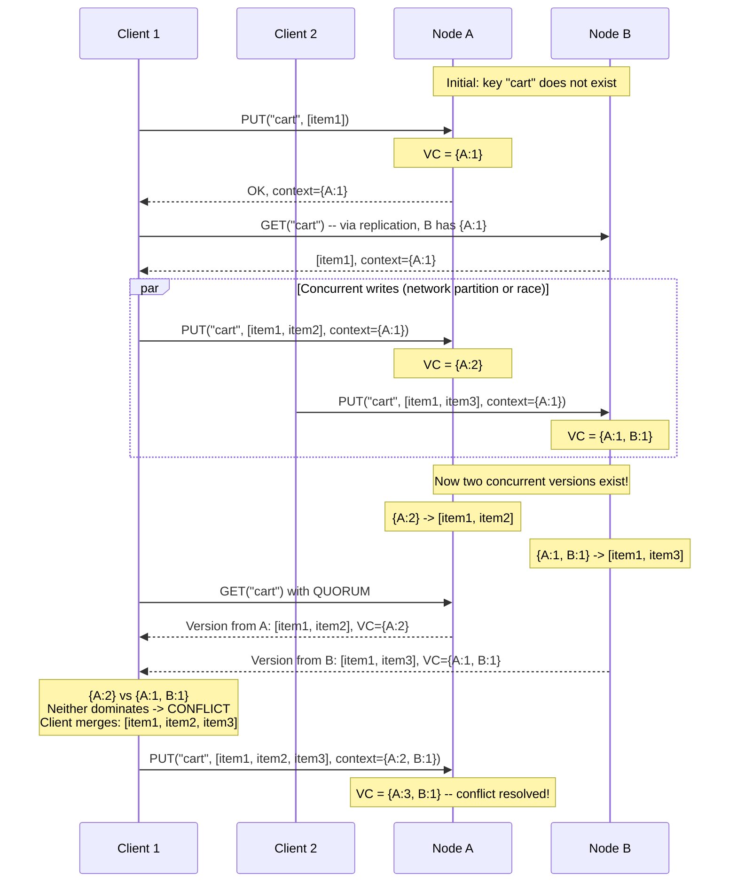

### Vector Clock Pruning

Vector clocks can grow unbounded if many nodes coordinate writes to the same key.
Dynamo addresses this with pruning:

```
Problem: VC = {A:45, B:12, C:33, D:7, E:19, F:2, G:88, H:3, ...}
  -> Too many entries! Each GET/PUT must transmit and compare this.

Solution: Timestamp-based pruning
  - Each (node, counter) entry has a timestamp of when it was last updated
  - When the VC exceeds a threshold (e.g., 10 entries):
    1. Find the OLDEST entry (by timestamp)
    2. Remove it
  - This loses some causal information and may create false conflicts
  - But false conflicts are SAFE (they just mean more merges, not data loss)

Example:
  VC = {A:45 (10am), B:12 (9am), C:33 (11am), ...11 entries...}
  Prune oldest: remove B:12 (oldest timestamp)
  VC = {A:45, C:33, ...10 entries...}
  
  If B later writes, we cannot tell if it happened before or after B:12.
  This causes a "false conflict" -- the client may need to merge unnecessarily.
  Trade-off: bounded VC size vs slightly more conflicts.
```

### Last-Write-Wins (LWW) Alternative

```
Cassandra uses LWW instead of vector clocks:

  Every write has a wall-clock timestamp (microsecond precision).
  On conflict, the value with the HIGHEST timestamp wins.
  
  Advantages:
    + Simple -- no vector clock storage or comparison
    + No conflicts ever returned to the client
    + Bounded metadata size (just one timestamp)
    
  Disadvantages:
    - LOSES DATA silently if clocks are skewed
    - Cannot detect concurrent writes (just picks one)
    - Requires well-synchronized clocks (NTP is imperfect)
    
  Example of LWW data loss:
    Node A clock: 10:00:00.000 (accurate)
    Node B clock: 10:00:00.050 (50ms ahead due to NTP skew)
    
    Client 1 writes to A at real time 10:00:00.010:
      timestamp = 10:00:00.010
      value = "important_data"
      
    Client 2 writes to B at real time 10:00:00.005:
      timestamp = 10:00:00.055  (B's clock is ahead!)
      value = "less_important_data"
      
    LWW picks: "less_important_data" (higher timestamp)
    But "important_data" was written LATER in real time!
    
  Cassandra accepts this trade-off for simplicity.
  Dynamo/Riak use vector clocks to avoid it.
```

---

## 2.10 Membership and Failure Detection -- Gossip Protocol

### Gossip Protocol

Gossip is a decentralized protocol where nodes periodically exchange state with random peers.
It is how nodes discover each other, learn the ring topology, and detect failures -- without
any central coordinator like ZooKeeper.

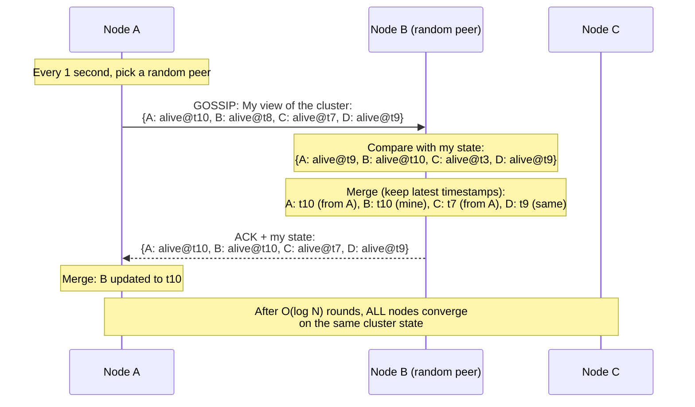

### Gossip Convergence

```
How fast does gossip spread information?

  With N nodes and each node gossiping once per second:
  
  Round 1: 1 node knows the update
  Round 2: ~2 nodes know (1 told 1 random peer)
  Round 3: ~4 nodes know (2 told 2 random peers)
  Round k: ~2^k nodes know
  
  To reach all N nodes: k = log2(N) rounds
  
  For 9 nodes:  log2(9) = ~4 rounds = ~4 seconds
  For 100 nodes: log2(100) = ~7 rounds = ~7 seconds
  For 1000 nodes: log2(1000) = ~10 rounds = ~10 seconds
  
  Gossip is O(log N) convergence -- incredibly efficient.
  
  Bandwidth per node per second:
    1 gossip message = cluster state = ~100 bytes per node
    With 100 nodes: ~10 KB per gossip round
    1 gossip per second = 10 KB/sec = negligible
```

### Phi Accrual Failure Detector

Simple heartbeat timeout (e.g., "if no heartbeat in 5 seconds, node is dead") is too
brittle -- a slow network looks like a dead node. The Phi Accrual Failure Detector uses
probability to make better decisions.

```
Phi Accrual Failure Detector:

  Instead of binary alive/dead, it computes a suspicion level PHI:
  
    phi = -log10(P(alive | time_since_last_heartbeat))
    
  phi = 1  -> P(alive) = 10%   (probably dead)
  phi = 2  -> P(alive) = 1%    (very likely dead)
  phi = 3  -> P(alive) = 0.1%  (almost certainly dead)
  
  The detector maintains a sliding window of inter-heartbeat arrival times.
  It models the distribution and computes how "surprising" the current silence is.
  
  Threshold: typically phi >= 8 means "declare dead"
    (P(alive) = 10^-8 = 0.00000001 -- extremely unlikely to be alive)
  
  Advantages over simple timeout:
    - Adapts to network conditions (slow networks get more leeway)
    - No magic timeout value to tune
    - Gradual suspicion (can route away before declaration)
    
  Example:
    Normal heartbeat interval: ~1 second (std dev: 0.1s)
    
    At 2 seconds silence:  phi = 3  -> suspicious, maybe slow
    At 5 seconds silence:  phi = 8  -> almost certainly dead
    At 10 seconds silence: phi = 15 -> definitely dead, trigger failover
```

---

## 2.11 Complete Architecture Diagram

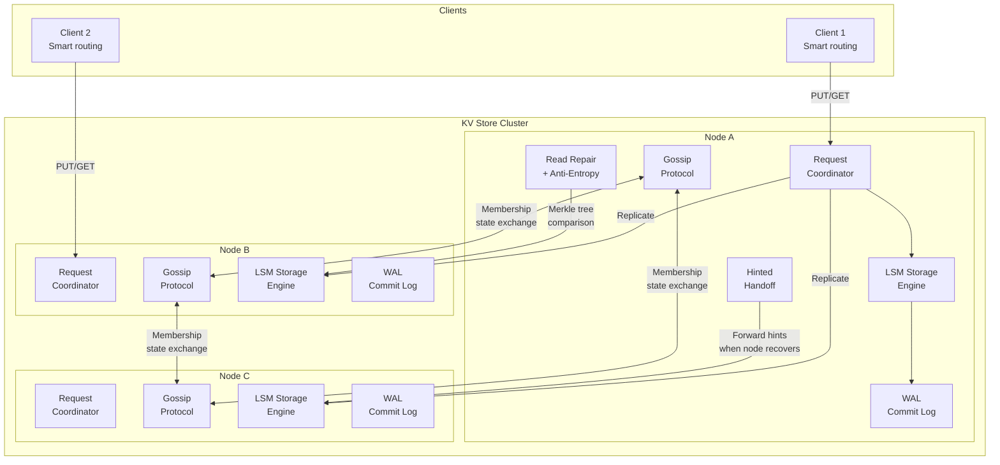

### How It All Fits Together

```
The Dynamo Approach -- Summary of Mechanisms:

+---------------------------+----------------------------------------------+
| Problem                   | Solution                                     |
+---------------------------+----------------------------------------------+
| Partitioning              | Consistent hashing with virtual nodes        |
| Replication               | N replicas on consecutive ring nodes         |
| Write consistency         | W quorum (wait for W of N acks)              |
| Read consistency          | R quorum (read from R of N, merge results)   |
| Strong consistency        | R + W > N (guaranteed read-write overlap)     |
| Conflict detection        | Vector clocks (causal ordering)              |
| Conflict resolution       | Client-side merge or LWW                     |
| Stale replica repair      | Read repair (during reads)                   |
| Permanent failure repair  | Anti-entropy (Merkle trees, background)      |
| Temporary failure         | Sloppy quorum + hinted handoff               |
| Node failure detection    | Phi Accrual Failure Detector (via gossip)    |
| Membership management     | Gossip protocol (decentralized)              |
| Storage engine            | LSM tree (write-optimized)                   |
| Fast read despite LSM     | Bloom filters + block cache                  |
| Disk space reclamation    | Compaction (size-tiered or leveled)           |
| Deletion without resurrect| Tombstones with grace period                 |
+---------------------------+----------------------------------------------+
```

---

*This document presents the high-level design of a Dynamo-style distributed key-value store.
The architecture is peer-to-peer with no single point of failure, uses consistent hashing
for partitioning, quorum-based reads/writes for tunable consistency, vector clocks for
conflict detection, gossip for membership, and LSM trees for high write throughput. Every
mechanism addresses a specific distributed systems challenge -- this is what makes the Dynamo
paper one of the most influential in the field.*
