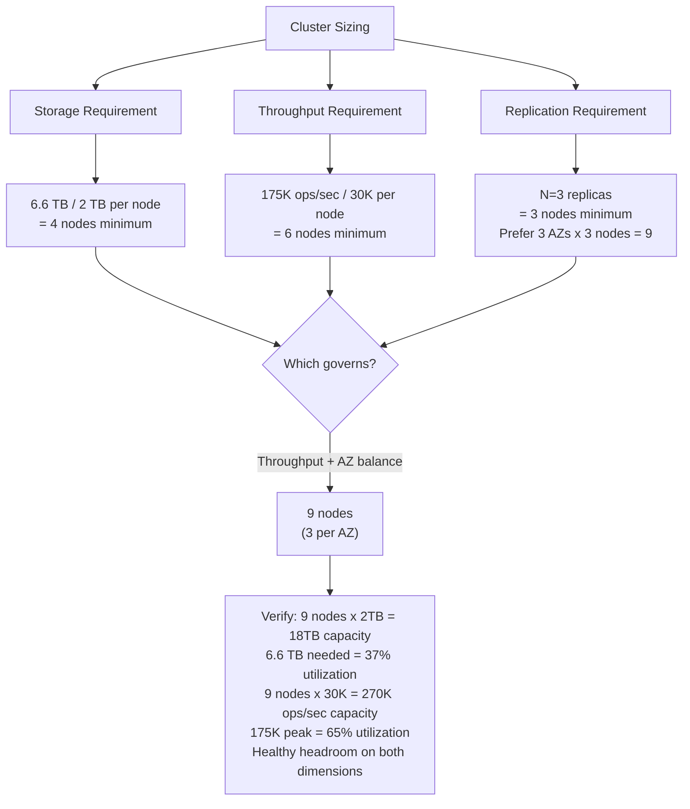
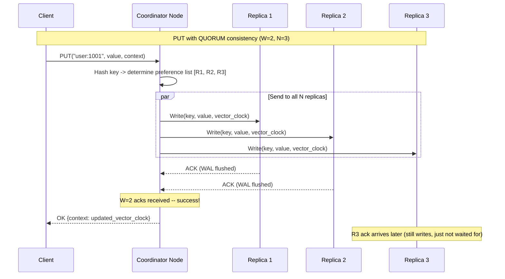

# Design a Distributed Key-Value Store -- Requirements and Estimation

## Table of Contents
- [1.1 Problem Statement](#11-problem-statement)
- [1.2 Functional Requirements](#12-functional-requirements)
- [1.3 Non-Functional Requirements](#13-non-functional-requirements)
- [1.4 Out of Scope](#14-out-of-scope)
- [1.5 Back-of-Envelope Estimation](#15-back-of-envelope-estimation)
- [1.6 API Design](#16-api-design)
- [1.7 Data Model](#17-data-model)
- [1.8 Error Handling Contract](#18-error-handling-contract)

---

## 1.1 Problem Statement

Design a distributed, persistent key-value store that provides high availability, partition
tolerance, tunable consistency, and durability guarantees. The system must store data on
disk (not just in memory), survive node and network failures without data loss, and scale
horizontally to handle hundreds of thousands of operations per second. Think of it as a
simplified DynamoDB, Cassandra, or Riak.

**Why this is THE classic distributed systems interview question:**
- It tests every fundamental distributed systems concept: consistent hashing, replication,
  quorums, vector clocks, gossip protocols, Merkle trees, LSM trees
- It is directly modeled on the Amazon Dynamo paper (2007), one of the most influential
  papers in distributed systems history
- It forces you to reason about the CAP theorem with concrete trade-offs
- It distinguishes candidates who understand theory from those who can apply it
- Every major tech company uses some form of distributed key-value store internally

**Real-world context:**
Amazon built DynamoDB to power its shopping cart during Black Friday -- where even seconds
of downtime cost millions. Apache Cassandra powers Netflix's entire backend, handling
millions of writes per second across globally distributed datacenters. LinkedIn's Voldemort,
Riak, and etcd are all variations of the same Dynamo-inspired architecture. Understanding
this design means understanding the backbone of modern distributed systems.

**What makes this DIFFERENT from designing a distributed cache?**
A key-value store is fundamentally different from a cache in critical ways:

| Aspect | Distributed Cache (Redis/Memcached) | Distributed KV Store (Dynamo/Cassandra) |
|--------|-------------------------------------|----------------------------------------|
| **Durability** | Volatile -- data loss is acceptable | Persistent -- data must survive crashes |
| **Source of truth** | No -- the database is the source | Yes -- this IS the database |
| **Storage medium** | Memory only | Disk + memory (LSM tree) |
| **Consistency** | Typically eventual, simple | Tunable (R + W > N for strong) |
| **Conflict resolution** | Last-write-wins, simple | Vector clocks, read repair, anti-entropy |
| **Failure handling** | Rehash to other nodes, lose data | Hinted handoff, Merkle tree sync |
| **Eviction** | LRU/LFU when memory full | No eviction -- data is permanent |
| **Replication purpose** | Hot standby for failover | Durability + availability + read scaling |
| **Node communication** | Minimal (via ZooKeeper) | Gossip protocol for membership |

---

## 1.2 Functional Requirements

| # | Requirement | Description | Example |
|---|-------------|-------------|---------|
| FR-1 | **PUT(key, value)** | Store a key-value pair durably. Upsert semantics. | `PUT("user:1001", {name:"Alice"})` |
| FR-2 | **GET(key)** | Retrieve the value associated with a key. Return not-found on absence. | `GET("user:1001")` returns `{name:"Alice"}` or `NOT_FOUND` |
| FR-3 | **DELETE(key)** | Mark a key as deleted (tombstone). Eventually reclaimed via compaction. | `DELETE("user:1001")` returns `OK` |
| FR-4 | **Tunable consistency** | Client specifies consistency level per request (ONE, QUORUM, ALL). | `GET("user:1001", consistency=QUORUM)` |
| FR-5 | **Automatic replication** | Each key is replicated to N nodes for durability and availability. | N=3 means each key exists on 3 nodes |
| FR-6 | **Conflict resolution** | Handle concurrent writes to the same key (vector clocks + LWW). | Two concurrent PUTs to same key resolved on next read |
| FR-7 | **Range queries** | Support key-range scans within a partition (optional, Cassandra-style). | `SCAN("user:1000", "user:2000")` returns range |

### Detailed Requirement Breakdown

#### FR-1: PUT Operation (Write Path)
The PUT path is the most complex operation because it must guarantee durability:
- The coordinator receives the write and determines the N replicas from the preference list
- The write is sent to all N replicas concurrently
- The coordinator waits for W acknowledgements before returning success to the client
- Each replica appends the write to its commit log (WAL) and memtable
- Writes are always append-only -- no in-place updates on disk
- A vector clock is attached to track the causal history of the value

#### FR-2: GET Operation (Read Path)
The GET path must handle divergent replicas:
- The coordinator sends read requests to all N replicas
- It waits for R responses (R is the read quorum)
- If all R responses agree, return the value immediately
- If responses diverge, perform conflict resolution:
  - Use vector clocks to determine causal ordering
  - If concurrent (no causal relation), return all versions to the client or use LWW
- Trigger read repair: send the latest version back to stale replicas

#### FR-3: DELETE Operation
Deletes are NOT immediate physical removal. They work via tombstones:
- A DELETE writes a special tombstone marker with a timestamp
- The tombstone is replicated just like a normal write (W quorum)
- The tombstone exists for a grace period (default: 10 days in Cassandra)
- During compaction, tombstoned data is physically removed after the grace period
- Why tombstones? Without them, a deleted key would "resurrect" when a stale
  replica that never saw the DELETE replicates its old value back

```
DELETE timeline:

  t=0   PUT("user:1001", {name:"Alice"})     <- stored on 3 replicas
  t=5   DELETE("user:1001")                   <- tombstone written to 3 replicas
  t=5   Replica C was down, misses the DELETE
  t=10  Replica C comes back online
        Without tombstone: Replica C has Alice, syncs it back -> RESURRECTION!
        With tombstone: Read repair sees tombstone is newer -> correct deletion
  t=15  Compaction: tombstone grace period expires -> physically removed
```

#### FR-4: Tunable Consistency
The system allows per-request consistency tuning via quorum parameters:

| Level | Reads (R) | Writes (W) | Guarantee | Use Case |
|-------|-----------|------------|-----------|----------|
| ONE | 1 | 1 | Eventual (fastest) | Analytics, logging, non-critical reads |
| QUORUM | ceil(N/2)+1 | ceil(N/2)+1 | Strong (R+W > N) | Most read/write workloads |
| ALL | N | N | Strongest (linearizable) | Financial transactions, inventory |
| LOCAL_QUORUM | Quorum within DC | Quorum within DC | Strong within DC | Multi-DC deployments |

```
With N=3 replicas:

  QUORUM means R=2, W=2:  R + W = 4 > 3 = N  -> guaranteed overlap
  
  Replicas:   [A] [B] [C]
  Write W=2:   W   W   -     <- wrote to A and B
  Read  R=2:   R   -   R     <- reads A and C
                ^             <- at least one node (A) has the latest write
                              
  This is the PIGEONHOLE PRINCIPLE applied to distributed systems!
```

#### FR-5: Automatic Replication
Every key is stored on N consecutive nodes on the consistent hash ring:
- The first node is determined by hashing the key
- The next N-1 distinct physical nodes clockwise on the ring form the "preference list"
- Virtual nodes are skipped -- we need N distinct physical machines
- Replicas are placed across failure domains (different racks, different AZs)

#### FR-6: Conflict Resolution
When multiple writers update the same key concurrently (network partition, node lag):

```
Conflict scenario:

  Client A:  PUT("cart", [item1])  at time t=1, sees version [A:1]
  Client B:  PUT("cart", [item2])  at time t=1, sees version [B:1]
  
  Neither A nor B knows about the other's write (concurrent).
  
  Vector clocks:
    Version from A: {A:1}  value=[item1]
    Version from B: {B:1}  value=[item2]
    
  These are CONCURRENT (neither dominates the other).
  
  Resolution strategies:
    1. Return both to client -> client merges: [item1, item2]  (Dynamo/Riak)
    2. Last-Write-Wins (LWW): pick the one with higher timestamp (Cassandra)
    3. Application-specific merge function (CRDTs)
```

#### FR-7: Range Queries (Optional)
While pure key-value stores only support point lookups, Cassandra-style designs
support range queries within a partition (using a clustering key):
- Keys are partitioned by a partition key (consistent hash)
- Within a partition, data is sorted by clustering columns
- Range scans within a single partition are efficient (sequential disk reads)
- Cross-partition range scans require scatter-gather (expensive)

---

## 1.3 Non-Functional Requirements

### Performance

| Requirement | Target | Rationale |
|-------------|--------|-----------|
| **Read latency (QUORUM)** | < 5 ms p50, < 20 ms p99 | Disk I/O involved, but Bloom filters + cache help |
| **Write latency (QUORUM)** | < 5 ms p50, < 15 ms p99 | Append-only writes are fast; waiting for W acks |
| **Throughput** | > 100K ops/sec per node | LSM tree + append-only IO enables high write throughput |
| **Cluster throughput** | > 1M ops/sec total | Linear scaling with added nodes |
| **Bloom filter false positive** | < 1% | Minimizes unnecessary disk reads on GET miss |

#### Latency Breakdown (Target -- QUORUM Read)

```
End-to-end GET latency budget (p50 target: < 5ms):

  Client -> Coordinator:      ~0.5 ms  (network hop)
  Coordinator routing:        ~0.01 ms (hash ring lookup)
  Coordinator -> Replicas:    ~0.5 ms  (parallel network to N nodes)
  Per-replica processing:
    Bloom filter check:       ~0.01 ms (in-memory bit array check)
    Memtable lookup:          ~0.05 ms (in-memory skip list or tree)
    Block cache hit:          ~0.1 ms  (if data cached in memory)
    SSTable disk read (miss): ~1-3 ms  (SSD random read)
  Wait for R=2 responses:     ~1.5 ms  (wait for 2nd fastest reply)
  Conflict resolution:        ~0.01 ms (vector clock comparison)
  Coordinator -> Client:      ~0.5 ms  (network hop)
  ─────────────────────────────────────
  Total (cache hit):          ~2.5 ms  (well within 5ms budget)
  Total (cache miss):         ~4.5 ms  (still within 5ms budget)

p99 adds:
  SSTable on spinning disk:   +5-10 ms
  Cross-AZ network hop:       +1-2 ms
  Compaction interference:    +2-5 ms
  ─────────────────────────────────────
  Worst case:                 ~15-20 ms (within 20ms budget)
```

### Durability and Availability

| Requirement | Target | Rationale |
|-------------|--------|-----------|
| **Durability** | 99.999999% (8 nines) | Data is replicated to N=3 nodes across AZs |
| **Availability** | 99.99% (52 min/year) | Sloppy quorum + hinted handoff keep writes flowing |
| **Replication factor** | N=3 (configurable) | 3 independent copies on 3 physical machines |
| **Failover** | Automatic, < 30 seconds | Gossip detects failure; preference list has successors |
| **Data loss window** | 0 for committed writes | WAL flush before ack means committed = durable |

#### Durability Math

```
With N=3 replicas on independent machines:

  Single node failure probability per year: 5% (reasonable for commodity hardware)
  
  P(all 3 replicas fail simultaneously) = 0.05^3 = 0.000125 = 0.0125%
  
  But replicas are in different failure domains (different racks / AZs):
    P(rack failure): 1% per year
    P(3 different racks fail simultaneously): 0.01^3 = 0.000001 = 0.0001%
    
  Durability = 1 - P(all replicas lost) = 99.9999%
  
  With repair within 1 hour (re-replication from surviving copies):
    P(2nd failure within 1 hour of first): ~0.0006%
    P(3rd failure within 1 hour of second): ~0.0000004%
    Effective durability: ~99.99999999% (10 nines)
    
  This is why even N=3 provides exceptional durability.
```

### Scalability

| Requirement | Target | Rationale |
|-------------|--------|-----------|
| **Max data size** | Petabytes across cluster | Each node holds ~1-2 TB; add nodes linearly |
| **Max key size** | 256 bytes | Keep hashing fast, partition keys concise |
| **Max value size** | 1 MB (configurable) | Large values degrade replication; use blob store for bigger |
| **Cluster size** | 3 to 1000+ nodes | From small teams to hyperscale |
| **Scale-out** | Add node, automatic rebalance | Consistent hashing moves only K/N keys |
| **Multi-datacenter** | Active-active replication | Async replication across DCs |

---

## 1.4 Out of Scope

| Feature | Reason for Exclusion | Where It Fits |
|---------|---------------------|---------------|
| SQL queries / joins | This is a KV store, not a relational DB | Mention as an extension (add secondary indexes) |
| Multi-key transactions | Requires 2PC/Paxos across partitions, destroys throughput | Mention that DynamoDB added transactions in 2018 |
| Full-text search | Orthogonal to KV storage | Pair with Elasticsearch for search |
| Time-series optimizations | Different access pattern | Mention Cassandra time-series data model |
| Automatic resharding | Complex operational concern | Cover manual add-node with consistent hashing |
| Encryption at rest | Important but orthogonal | Mention as an extension |
| Access control / auth | Production necessity but separate concern | Mention as operational |

---

## 1.5 Back-of-Envelope Estimation

### Traffic Estimation

| Metric | Calculation | Result |
|--------|-------------|--------|
| Daily active users | Given | 50M |
| Avg KV ops per user per day | Reads + writes | 100 |
| Total ops per day | 50M x 100 | 5B ops/day |
| Ops per second (avg) | 5B / 86,400 | ~58K ops/sec |
| Peak ops per second | 3x average | **~175K ops/sec** |
| Read:Write ratio | Typical workload | 70:30 |
| Peak reads/sec | 175K x 0.7 | 122K |
| Peak writes/sec | 175K x 0.3 | 53K |

#### Traffic Pattern Visualization

```
Ops/sec
175K |                          .---.
     |                        .'     '.         Peak: 175K
150K |                       /         \
     |                      /           \
125K |                     /             \
     |                    /               \
100K |                   /                 \
     |                 .'                   '.
 75K |              .--                       '--.
     |           .-'                               '-.      Avg: 58K
 58K |. . . . . / . . . . . . . . . . . . . . . . . .\ . . . . . 
     |       .-'                                       '-.
 25K |    .-'                                             '-.
     |.--'                                                   '--.
   0 +----+----+----+----+----+----+----+----+----+----+----+----
     0    2    4    6    8   10   12   14   16   18   20   22   24
                          Hour of Day (UTC)
```

### Storage Estimation

| Metric | Calculation | Result |
|--------|-------------|--------|
| Total unique keys | Given | 1B (1 billion) |
| Avg key size | | 64 bytes |
| Avg value size | | 512 bytes |
| Per-entry overhead (metadata, bloom, index) | | ~150 bytes |
| Storage per entry | 64 + 512 + 150 | 726 bytes |
| Total raw storage | 1B x 726 B | ~726 GB |
| With write amplification (LSM compaction, ~3x) | 726 x 3 | ~2.2 TB |
| With N=3 replication | 2.2 x 3 | **~6.6 TB total** |

#### Per-Entry Storage Breakdown

```
Single KV Pair On-Disk Layout (in SSTable):

+------------------------------------------------------------------+
| Component              | Bytes | Notes                            |
+------------------------------------------------------------------+
| Key (average)          |    64 | Partition key, variable length   |
| Value (average)        |   512 | Serialized data, variable length |
| Key length prefix      |     2 | uint16 varint                    |
| Value length prefix    |     4 | uint32 varint                    |
| Timestamp              |     8 | int64 microseconds               |
| Tombstone flag         |     1 | bool: is this a delete marker    |
| Vector clock           |    48 | List of (nodeID, counter) pairs  |
| Checksum (CRC32)       |     4 | Data integrity per entry         |
| Bloom filter contrib   |    ~8 | ~10 bits per key in bloom filter |
| SSTable index entry    |   ~24 | Sparse index: key + offset       |
| Block index overhead   |   ~16 | Per-block index for binary search|
| Compression overhead   |   ~40 | LZ4/Snappy metadata              |
+------------------------------------------------------------------+
| Total overhead         |  ~155 | (excluding key and value)        |
| Total per entry        |  ~731 | 64 + 512 + 155                   |
+------------------------------------------------------------------+

Note: On-disk size is SMALLER than in-memory due to compression.
      Typical compression ratio: 2:1 to 4:1 with LZ4.
      But write amplification (compaction) increases total disk IO.
```

### Cluster Sizing

| Metric | Calculation | Result |
|--------|-------------|--------|
| Disk per node | Typical SSD server | 2 TB usable |
| Nodes for storage (with replication) | 6.6 TB / 2 TB | ~4 nodes |
| Replication factor | N=3 | 3 |
| Minimum nodes for N=3 | Must have 3+ distinct nodes | 3 nodes minimum |
| Throughput per node | Conservative | 30K ops/sec per node |
| Nodes for throughput | 175K / 30K | ~6 nodes |
| **Recommended cluster size** | max(storage, throughput, replication) | **9 nodes** |
| Rationale for 9 | 3 AZs x 3 nodes each | Balanced across failure domains |

#### Sizing Decision Tree



### Network Bandwidth

| Metric | Calculation | Result |
|--------|-------------|--------|
| Avg request + response size | ~700 bytes | 700 B |
| Client bandwidth at peak | 175K ops/sec x 700 B | ~122 MB/sec |
| Replication traffic | Each write replicated to N-1=2 peers | 53K x 700 x 2 = ~74 MB/sec |
| Anti-entropy (Merkle) | Background, ~5% of traffic | ~10 MB/sec |
| Total cluster bandwidth | 122 + 74 + 10 | ~206 MB/sec |
| Per-node bandwidth | 206 / 9 | ~23 MB/sec per node |
| NIC capacity | 10 Gbps = 1.25 GB/sec | Plenty of headroom |

### Estimation Summary

```
+----------------------------------------------------------------+
|              ESTIMATION SUMMARY                                 |
+----------------------------------------------------------------+
|                                                                 |
|  Traffic:     175K peak ops/sec (70% reads, 30% writes)        |
|  Storage:     6.6 TB total (1B keys, N=3 replication)          |
|  Cluster:     9 nodes (3 AZs x 3 nodes)                       |
|  Per node:    ~2 TB SSD, 32+ GB RAM, 30K ops/sec              |
|  Network:     ~23 MB/sec per node (10 Gbps NIC)               |
|  Bottleneck:  Throughput (65% utilization at peak)             |
|                                                                 |
|  Key difference from cache:                                     |
|    - Disk I/O is the bottleneck (not memory)                   |
|    - Write amplification from LSM compaction                   |
|    - Replication is for DURABILITY, not just failover          |
|    - 3x storage overhead from N=3 replication                  |
|                                                                 |
+----------------------------------------------------------------+
```

---

## 1.6 API Design

### Core Operations

```
// --- Write Operations -------------------------------------------

PUT(key: bytes, value: bytes, context: VectorClock, options: WriteOptions) 
  -> {status: OK | ERROR, context: VectorClock}
  
  // Store a key-value pair. Upsert semantics.
  // context: the vector clock from the most recent GET (for conflict detection).
  //   - If this is a new key, context is empty.
  //   - If updating, pass the context from the previous GET.
  // options.consistency: ONE | QUORUM | ALL
  // options.ttl: optional time-to-live (for auto-expiring data)
  //
  // Returns the new vector clock for this version.

DELETE(key: bytes, context: VectorClock, options: WriteOptions)
  -> {status: OK | ERROR}
  
  // Write a tombstone for the key.
  // Requires context from a previous GET to prevent deleting unseen versions.
  // The tombstone is replicated and kept for a grace period before GC.

// --- Read Operations --------------------------------------------

GET(key: bytes, options: ReadOptions) 
  -> {value: bytes, context: VectorClock} | NOT_FOUND | CONFLICT{values: list}
  
  // Retrieve the value for a key.
  // options.consistency: ONE | QUORUM | ALL
  // If consistency=QUORUM and replicas disagree:
  //   - If one version dominates (vector clock), return it + trigger read repair.
  //   - If versions are concurrent, return CONFLICT with all versions
  //     (application resolves) or use LWW (system resolves).

// --- Batch Operations -------------------------------------------

BATCH_PUT(entries: [{key, value, context}], options: WriteOptions)
  -> {results: [{key, status, context}]}
  
  // Batch write. Each key is independently coordinated.
  // Partial failures are possible (some succeed, some fail).

BATCH_GET(keys: [bytes], options: ReadOptions)
  -> {results: [{key, value, context}]}
  
  // Batch read. Keys may be on different partitions.
  // Coordinator fans out to relevant nodes in parallel.

// --- Administrative Operations ----------------------------------

LIST_KEYS(partition: int, prefix: bytes, limit: int)
  -> {keys: [bytes], continuation_token: bytes}
  
  // List keys in a partition. Used for debugging and maintenance.
  // NOT for production hot-path queries.

REPAIR(key: bytes) -> {status: OK, replicas_repaired: int}
  // Force a read repair on a specific key. Used by operators.
```

### API Request/Response Flow



### Consistency Level Semantics

```
N=3, and the client can choose per-request:

+----------------+-----+-----+-----------------------------+-------------------+
| Consistency    |  R  |  W  | Guarantee                   | Trade-off         |
+----------------+-----+-----+-----------------------------+-------------------+
| ONE            |  1  |  1  | Eventual, lowest latency    | May read stale    |
| QUORUM         |  2  |  2  | Strong (R+W=4 > N=3)       | Balanced           |
| ALL            |  3  |  3  | Linearizable                | Highest latency   |
| LOCAL_QUORUM   |  2* |  2* | Strong within datacenter    | For multi-DC      |
+----------------+-----+-----+-----------------------------+-------------------+

Common combinations and what they mean:
  W=1, R=1  : Fastest, but may lose writes on failure
  W=2, R=2  : Standard quorum, strong consistency (Dynamo default)
  W=3, R=1  : Write-heavy consistency (writes are slow, reads are fast)
  W=1, R=3  : Read-heavy consistency (writes are fast, reads are slow)
  W=ALL, R=1: Writes guaranteed on all replicas, reads from any
```

---

## 1.7 Data Model

### Key-Value Entry Structure

```
+-------------------------------------------------------------------+
| Field             | Type          | Size     | Description         |
+-------------------------------------------------------------------+
| key               | bytes         | 1-256 B  | Partition key       |
| value             | bytes         | 1 B-1 MB | Opaque blob         |
| vector_clock      | [(node,cnt)]  | ~48 B    | Causal history      |
| timestamp         | int64         | 8 B      | Wall clock (LWW)    |
| tombstone         | bool          | 1 B      | Deletion marker     |
| checksum          | uint32        | 4 B      | CRC32 for integrity |
| ttl_expiry        | int64         | 8 B      | 0 = no expiry       |
+-------------------------------------------------------------------+
```

### Vector Clock Structure

```
A vector clock tracks the causal history of a value:

  VectorClock = [(node_id, counter), ...]
  
  Example evolution:
  
  1. Client writes to Node A:
     VC = [(A, 1)]
     
  2. Client reads from A, writes to Node B:
     VC = [(A, 1), (B, 1)]
     
  3. Another client writes to Node A (without seeing step 2):
     VC = [(A, 2)]
     
  Now we have two concurrent versions:
     Version 1: [(A, 1), (B, 1)]  -- knows about A:1 and B:1
     Version 2: [(A, 2)]          -- knows about A:2 but not B:1
     
  Neither dominates the other -> CONFLICT (concurrent writes).
  
  Domination rule:
    VC1 dominates VC2 iff every counter in VC2 <= corresponding counter in VC1
    [(A,2), (B,1)] dominates [(A,1), (B,1)]  -- A advanced from 1 to 2
    [(A,1), (B,1)] vs [(A,2)] -- neither dominates (B missing in second)
```

---

## 1.8 Error Handling Contract

### Error Taxonomy

```
Error Hierarchy:

KVStoreException (base)
  |
  +-- KeyNotFoundException           -- Key does not exist (GET/DELETE)
  |
  +-- WriteFailedException           -- Could not achieve W quorum
  |     |
  |     +-- InsufficientReplicasException  -- Fewer than W nodes available
  |     +-- WriteTimeoutException          -- W acks not received in time
  |
  +-- ReadFailedException            -- Could not achieve R quorum
  |     |
  |     +-- ReadTimeoutException     -- R responses not received in time
  |
  +-- ConflictException              -- Concurrent writes detected
  |     |                               (vector clocks diverged)
  |     +-- values: list of conflicting versions
  |     +-- contexts: list of vector clocks
  |
  +-- ValueTooLargeException         -- Value exceeds 1 MB limit
  |
  +-- UnavailableException           -- Not enough live replicas for
                                        requested consistency level
```

### Retry Policy

```
Retryable errors:
  - WriteTimeoutException  -> retry to same coordinator (idempotent with VC)
  - ReadTimeoutException   -> retry with lower consistency (QUORUM -> ONE)
  - UnavailableException   -> retry after backoff (node may recover)

Non-retryable errors:
  - KeyNotFoundException     -> return to application (expected case)
  - ConflictException        -> return to application (must resolve)
  - ValueTooLargeException   -> application must reduce value size
  - InsufficientReplicasException -> operational alert (cluster degraded)

Consistency downgrade pattern (graceful degradation):
  1. Try GET(key, consistency=QUORUM)
  2. If UnavailableException -> GET(key, consistency=ONE)
  3. Log the downgrade for monitoring
  4. Return value with a "degraded consistency" flag
```

---

*This document defines the requirements envelope for a distributed key-value store:
175K peak ops/sec, 6.6 TB across 9 nodes, tunable consistency via quorum parameters,
99.99% availability with 99.999999% durability. Unlike a cache, this system is the
source of truth -- every write is durable, every conflict is tracked, and data survives
any single point of failure.*
