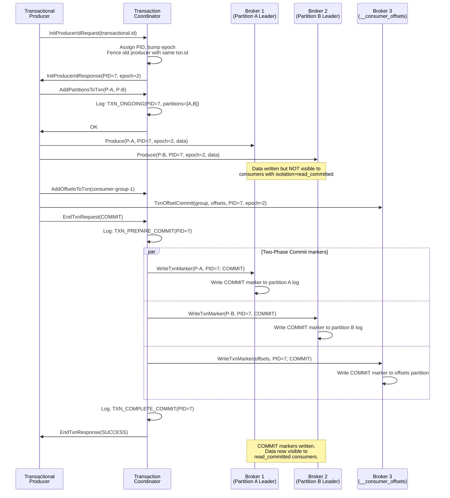
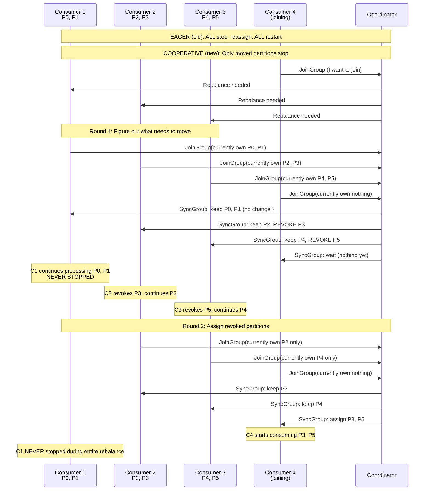
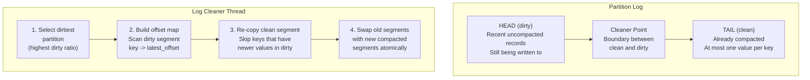
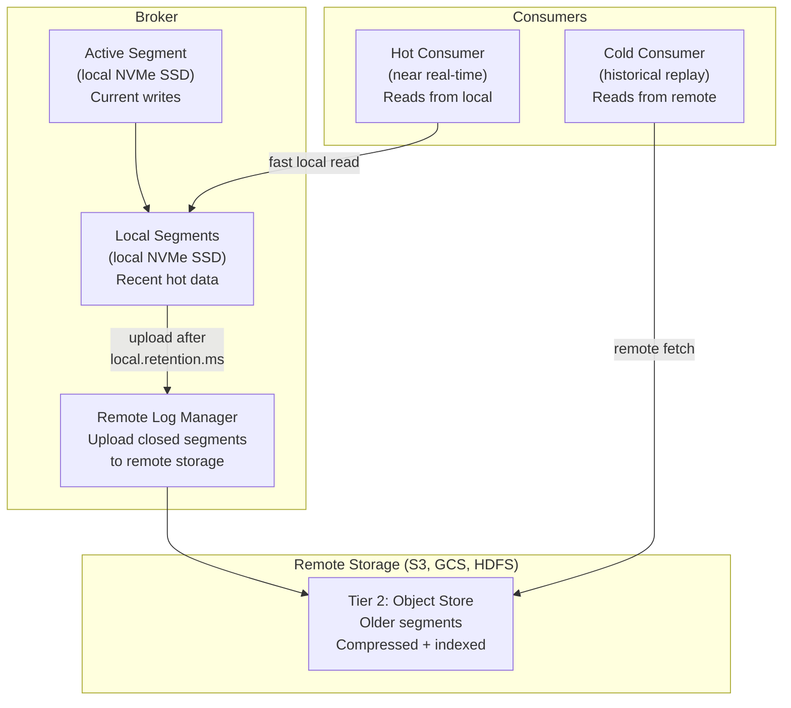

# Design a Distributed Message Queue (like Kafka) - Deep Dive & Scaling

## Deep Dive 1: Exactly-Once Semantics (EOS)

Exactly-once is the holy grail of message delivery. It means every message is
processed exactly once, with no losses and no duplicates, even across failures.
Kafka achieves this through two complementary mechanisms: the **idempotent producer**
and the **transactional API**.

### 1.1 The Idempotent Producer

```
Problem: Without idempotency, producer retries cause duplicates.

  Producer sends M1 -> Leader writes (offset 42) -> ACK lost -> retry -> 
  Leader writes AGAIN (offset 43) -> DUPLICATE

Solution: Give each producer a unique ID and sequence number.

  Producer ID (PID): Assigned by broker on producer init
  Sequence Number:   Per-partition, monotonically increasing per PID

  First send:  PID=7, Partition=3, Seq=100, Data="order-456"
               Broker writes at offset 42, records (PID=7, Seq=100)
  
  Retry:       PID=7, Partition=3, Seq=100, Data="order-456"  (SAME seq!)
               Broker sees: "I already have PID=7, Seq=100"
               Broker returns: SUCCESS with offset=42 (idempotent dedup)
               NO duplicate written

Broker deduplication state (per partition):
+-------+-------------------+---------------+
| PID   | Last Sequence Num | Last Offset   |
+-------+-------------------+---------------+
| 7     | 100               | 42            |
| 12    | 55                | 38            |
| 23    | 201               | 41            |
+-------+-------------------+---------------+

This state is stored in a .snapshot file per partition and replicated.

Sequence number validation:
  If incoming_seq == last_seq + 1:  ACCEPT (expected next message)
  If incoming_seq <= last_seq:      DUPLICATE (already seen, return success)
  If incoming_seq > last_seq + 1:   OUT_OF_ORDER_SEQUENCE error (gap detected)
```

### 1.2 Idempotent Producer Configuration

```
enable.idempotence = true  (default since Kafka 3.0)

Automatically sets:
  acks = all                 (required for dedup to be meaningful)
  retries = Integer.MAX      (keep retrying, dedup handles duplicates)
  max.in.flight.requests.per.connection = 5  (safe with idempotency)

Why max.in.flight = 5 is safe with idempotency:
  Without idempotency:
    Request 1 (seq=1) sent -> fails
    Request 2 (seq=2) sent -> succeeds (arrives at broker as offset N)
    Request 1 retried (seq=1) -> succeeds (arrives at broker as offset N+1)
    Result: seq=2 is at offset N, seq=1 is at offset N+1 -> REORDERED!
  
  With idempotency:
    Broker validates sequence numbers:
    If seq=2 arrives but seq=1 hasn't -> REJECT (out of order)
    Request 1 retry arrives -> ACCEPT
    Request 2 retried -> ACCEPT
    Result: Correct order maintained even with in-flight retries
    
  Kafka guarantees ordering within a partition for up to 5 in-flight
  requests when idempotency is enabled. This is hard-coded in the protocol.
```

### 1.3 The Transactional API

```
Problem: Idempotent producer only prevents duplicates for a SINGLE 
produce call. What about:
  1. Producing to MULTIPLE partitions atomically?
  2. Consume-transform-produce pipelines (exactly-once stream processing)?

Solution: Transactions that span multiple partitions.

Transactional Producer:
  transactional.id = "order-processor-1"  // stable across restarts
  
  producer.initTransactions();  // register with transaction coordinator
  
  try {
      producer.beginTransaction();
      
      // Consume from input topic
      records = consumer.poll(Duration.ofMillis(100));
      
      for (record : records) {
          // Process and produce to output topic
          result = transform(record);
          producer.send(new ProducerRecord("output-topic", result));
      }
      
      // Commit consumer offsets as part of the transaction
      producer.sendOffsetsToTransaction(
          offsets,           // consumer offsets to commit
          consumerGroupId    // consumer group
      );
      
      producer.commitTransaction();  // ATOMIC: all-or-nothing
      
  } catch (Exception e) {
      producer.abortTransaction();   // rollback everything
  }
```

### 1.4 Transaction Protocol Deep Dive



### 1.5 Read Committed vs. Read Uncommitted

```
Consumer isolation levels:

isolation.level = read_uncommitted (DEFAULT):
  - Consumer sees ALL messages, including those in in-progress transactions
  - Highest throughput, no transactional overhead
  - May see messages that are later ABORTED
  
isolation.level = read_committed:
  - Consumer only sees messages from COMMITTED transactions
  - Also sees all non-transactional messages
  - Broker tracks Last Stable Offset (LSO):
    LSO = offset of first message in an open transaction
  - Consumer can read up to min(HW, LSO), not beyond
  
  Impact on latency:
  - Long-running transactions BLOCK read_committed consumers
  - transaction.timeout.ms (default 60s) bounds this
  - Keep transactions SHORT (< 1 second ideally)

How the broker filters:
  Partition log:
  [msg1] [txn-msg2 PID=7] [msg3] [txn-msg4 PID=7] [COMMIT PID=7] [msg5]
  
  read_uncommitted: returns msg1, txn-msg2, msg3, txn-msg4, msg5 (all)
  read_committed:   buffers txn-msg2, returns msg1, msg3,
                    then sees COMMIT marker -> releases txn-msg2, txn-msg4, msg5
  
  ABORTED transaction:
  [msg1] [txn-msg2 PID=7] [msg3] [ABORT PID=7] [msg4]
  
  read_committed: returns msg1, msg3, msg4 (txn-msg2 is DISCARDED)
  Uses .txnindex file to efficiently skip aborted messages
```

### 1.6 Exactly-Once Summary

```
+--------------------------------+--------------------------------------------+
| Mechanism                      | What It Solves                             |
+--------------------------------+--------------------------------------------+
| Idempotent Producer            | Duplicate messages from producer retries   |
| (PID + sequence number)        | within a single partition                  |
+--------------------------------+--------------------------------------------+
| Transactional API              | Atomic writes across multiple partitions   |
| (2PC with txn coordinator)     | + consumer offset commits                  |
+--------------------------------+--------------------------------------------+
| read_committed isolation       | Consumer only sees committed data          |
+--------------------------------+--------------------------------------------+
| Combined = EOS                 | Exactly-once end-to-end for                |
|                                | consume-transform-produce pipelines        |
+--------------------------------+--------------------------------------------+

Important caveat:
  Exactly-once is WITHIN Kafka. If your consumer writes to an external
  system (database, API), you need ADDITIONAL mechanisms:
  
  Option 1: Idempotent consumer writes (use message offset as dedup key)
  Option 2: Outbox pattern (write to DB + offset in same transaction)
  Option 3: Two-phase commit with external system (complex, rarely used)
```

---

## Deep Dive 2: Consumer Rebalancing Protocol

### 2.1 Why Rebalancing Is Hard

```
Rebalancing = redistributing partitions among consumers in a group.

Triggered by:
  1. Consumer joins the group (scale up)
  2. Consumer leaves the group (scale down, crash, timeout)
  3. Topic partition count changes
  4. Consumer subscription changes

The problem with EAGER rebalancing (pre-Kafka 2.4):

  Timeline:
  T=0:  3 consumers happily processing
        C1: [P0, P1]  C2: [P2, P3]  C3: [P4, P5]
  
  T=1:  C4 joins the group -> rebalance triggered
  
  T=2:  ALL consumers REVOKE ALL partitions (STOP processing)
        C1: []  C2: []  C3: []  C4: []
        
  T=3:  Leader reassigns partitions
        C1: [P0, P1]  C2: [P2]  C3: [P3, P4]  C4: [P5]
  
  T=4:  All consumers resume processing

  The "stop-the-world" pause at T=2 means:
    - Zero throughput for SECONDS (or longer for slow rebalances)
    - All consumers stop, even if their partitions didn't change
    - C1 kept P0 and P1 but STILL had to stop and restart
    
  This is unacceptable for latency-sensitive workloads.
```

### 2.2 Cooperative (Incremental) Rebalancing



### 2.3 Rebalancing Comparison

```
+--------------------+-------------------+----------------------------+
| Aspect             | Eager Rebalance   | Cooperative Rebalance      |
+--------------------+-------------------+----------------------------+
| Consumer pause     | ALL consumers     | Only consumers losing      |
|                    | stop ALL partitions| specific partitions        |
+--------------------+-------------------+----------------------------+
| Rebalance rounds   | 1 round           | 2 rounds (revoke + assign) |
+--------------------+-------------------+----------------------------+
| Downtime           | Total (all stop)  | Partial (only moved parts) |
+--------------------+-------------------+----------------------------+
| Partition movement | May move ALL       | Minimizes movement         |
|                    | partitions         | (sticky + cooperative)     |
+--------------------+-------------------+----------------------------+
| Throughput impact  | Severe drop to 0   | Minimal (most continue)    |
+--------------------+-------------------+----------------------------+
| Complexity         | Simple             | More complex protocol      |
+--------------------+-------------------+----------------------------+
| Configuration      | partition.assignment| partition.assignment       |
|                    | .strategy=range    | .strategy=cooperative-     |
|                    | or roundrobin      | sticky                     |
+--------------------+-------------------+----------------------------+

Recommendation: Use CooperativeSticky for all production consumer groups.
```

### 2.4 Static Group Membership

```
Problem: Container orchestration (Kubernetes) frequently restarts consumers.
         Each restart triggers a rebalance, even if the same consumer comes back.

Solution: Static group membership (group.instance.id)

  consumer.config:
    group.instance.id = "order-processor-pod-3"  // stable across restarts
    session.timeout.ms = 300000                   // 5 minutes

  Behavior:
    1. Consumer crashes -> coordinator waits session.timeout.ms before rebalancing
    2. Consumer restarts with SAME group.instance.id -> rejoins silently
    3. Gets back its SAME partitions, no rebalance triggered
    4. Only if timeout expires does rebalance happen

  Perfect for Kubernetes rolling deployments:
    Pod restart takes 30 seconds, session timeout is 5 minutes
    -> Pod comes back, gets same partitions, zero rebalance
```

---

## Deep Dive 3: Log Compaction Implementation

### 3.1 What Log Compaction Does

```
Log compaction ensures the log contains at least the LAST known value
for each message key within a partition.

Use case: A topic represents a changelog for a database table.
  Key = primary key, Value = current row value.
  After compaction, the topic is a SNAPSHOT of the entire table.

Before compaction:
  Offset  Key    Value
  0       K1     V1
  1       K2     V2
  2       K1     V3      <- K1 updated
  3       K3     V4
  4       K2     V5      <- K2 updated
  5       K1     null     <- K1 DELETED (tombstone)
  6       K4     V6
  7       K3     V7      <- K3 updated

After compaction:
  Offset  Key    Value
  4       K2     V5      <- latest for K2
  5       K1     null     <- tombstone (retained temporarily)
  6       K4     V6      <- latest for K4
  7       K3     V7      <- latest for K3

Key observations:
  1. Offsets are NOT contiguous after compaction (0,1,2,3 are gone)
  2. Offset 5 (tombstone) is retained for delete.retention.ms
     then removed (so downstream consumers learn about the delete)
  3. The TAIL of the log (recent, uncompacted) is never compacted
     (min.compaction.lag.ms protects recent data)
  4. Original ordering is preserved for remaining records
```

### 3.2 Compaction Architecture



### 3.3 Compaction Algorithm Details

```
Step 1: Select partition to compact
  dirty_ratio = size(dirty_portion) / size(total_log)
  Pick partition with highest dirty_ratio
  Only compact if dirty_ratio > min.cleanable.dirty.ratio (default 0.5)

Step 2: Build offset map (in-memory)
  Scan the DIRTY portion of the log.
  For each record: map[key_hash] = offset
  
  Memory budget: log.cleaner.dedupe.buffer.size (default 128MB)
  If too many keys to fit: compact in multiple passes
  
  Uses a 16-byte entry per key:
    [key_hash (8 bytes)][offset (8 bytes)]
  
  128MB / 16 bytes = 8 million unique keys per pass

Step 3: Re-copy clean segments
  For each record in CLEAN portion:
    If offset_map contains this key AND mapped offset > this record's offset:
      SKIP (newer value exists in dirty portion)
    Else:
      COPY to new segment file
      
Step 4: Swap segments
  Rename new compacted files to replace old segment files.
  Update indexes.
  This is atomic at the filesystem level.

Step 5: Handle tombstones
  Records with null value = tombstone (deletion marker)
  Tombstones kept for delete.retention.ms (default 24h)
  Then removed in next compaction pass
  
  Why keep tombstones temporarily?
  A consumer that is behind needs to SEE the delete.
  If tombstone removed immediately, consumer would never know
  the key was deleted.
```

### 3.4 Compaction Guarantees

```
What log compaction GUARANTEES:
  1. Any consumer starting from offset 0 will see AT LEAST the final
     value for every key (may see older values too, until compacted)
  2. Ordering of messages is PRESERVED (no reordering)
  3. Offsets are NEVER reused (compacted messages keep their offset)
  4. Messages in the HEAD (dirty) portion are never compacted
     (only closed segments are eligible)

What log compaction does NOT guarantee:
  1. When compaction happens (it's asynchronous, best-effort)
  2. That there is EXACTLY one value per key at any point
     (dirty portion may have duplicates not yet compacted)
  3. That compaction completes before retention deletes old data
     (use cleanup.policy=compact, NOT delete,compact for pure changelogs)

Common configurations for compacted topics:
  cleanup.policy = compact
  min.compaction.lag.ms = 0          // compact as soon as possible
  delete.retention.ms = 86400000     // keep tombstones 24h
  min.cleanable.dirty.ratio = 0.1    // compact aggressively
  segment.ms = 3600000               // roll segments every hour
```

---

## Deep Dive 4: Zero-Copy and the sendfile Optimization

### 4.1 Traditional Data Transfer vs. Zero-Copy

```
Traditional read + send (4 copies, 4 context switches):

  1. read() syscall: disk -> kernel read buffer         (DMA copy)
  2. read() returns:  kernel buffer -> user buffer       (CPU copy)
  3. write() syscall: user buffer -> kernel socket buffer (CPU copy)
  4. NIC DMA:         kernel socket buffer -> NIC         (DMA copy)
  
  Total: 4 data copies, 4 context switches (user<->kernel)

Zero-copy with sendfile() (2 copies, 2 context switches):

  1. sendfile() syscall: disk -> kernel read buffer      (DMA copy)
  2. NIC DMA:            kernel buffer -> NIC             (DMA copy)
                         (kernel buffer descriptor passed to socket,
                          no data copied to user space at all)
  
  Total: 2 data copies, 2 context switches

With DMA scatter-gather (Linux 2.4+):
  Even the kernel buffer to socket buffer copy is eliminated.
  Data goes disk -> kernel buffer -> NIC with just DMA.

This is why Kafka uses the SAME binary format on disk and wire:
  No serialization/deserialization needed.
  The bytes on disk ARE the bytes sent to the consumer.
  Just sendfile() from the log segment to the network socket.

Performance impact:
  Without zero-copy:  ~400 MB/sec per broker (CPU-bound on copies)
  With zero-copy:     ~2+ GB/sec per broker (limited by disk/network)
  
  For consumers reading recent data (in page cache):
  sendfile() from page cache -> NIC = pure memory-to-NIC DMA
  This is why Kafka consumer throughput can exceed disk read speed.
```

---

## Deep Dive 5: Tiered Storage

### 5.1 The Storage Cost Problem

```
Traditional Kafka: ALL data on local broker disks.

  Problem at scale:
    1M msgs/sec x 1KB x 86400 sec = 86 TB/day (raw)
    With RF=3: 259 TB/day
    30-day retention: 7.8 PB
    
    That's a LOT of expensive NVMe SSDs.
    
  But access pattern is:
    Hot data (last few hours):  Read frequently, low latency needed
    Warm data (last few days):  Read occasionally
    Cold data (weeks old):      Rarely read (compliance, replay)
    
  Paying NVMe prices for cold data is wasteful.

Solution: Tiered Storage (KIP-405, Kafka 3.6+)
```

### 5.2 Tiered Storage Architecture



```
Tiered storage benefits:
  1. 10x cost reduction: S3 = $0.023/GB/month vs. NVMe = $0.10+/GB/month
  2. Infinite retention: Object store scales to petabytes easily
  3. Smaller broker fleet: Less local storage needed per broker
  4. Faster rebalancing: Less data to move when partitions reassigned
  
Configuration:
  remote.storage.enable = true
  remote.log.storage.system = "S3"  // or GCS, HDFS, Azure Blob
  local.retention.ms = 172800000    // keep 2 days local
  retention.ms = 2592000000         // keep 30 days total (remote)
```

---

## Scaling Strategies

### 1. Horizontal Scaling

```
Adding brokers:
  1. Add new broker to cluster (joins automatically)
  2. New broker initially has NO partitions
  3. Use partition reassignment tool to move partitions to new broker
  4. Reassignment happens in background (throttled to avoid impact)
  
  kafka-reassign-partitions.sh --execute --reassignment-json-file plan.json
  
  Reassignment is a COPY + SWITCH:
    1. New broker becomes a follower of the partition
    2. Replicates all data from current leader
    3. Once caught up, added to ISR
    4. Controller switches leadership (if moving leader)
    5. Old replica removed

Partition count changes:
  - Can INCREASE partition count at any time
  - CANNOT decrease partition count (data would be lost)
  - WARNING: Increasing partitions breaks key-based ordering!
    hash("user-123") % 6 != hash("user-123") % 8
    Messages for user-123 will go to a DIFFERENT partition
  
  Best practice: Over-provision partitions upfront (e.g., 2x expected need)
```

### 2. Performance Tuning Matrix

```
+-------------------+---------------------+---------------------------+
| Bottleneck        | Symptoms            | Solutions                 |
+-------------------+---------------------+---------------------------+
| Producer          | High produce         | Increase batch.size       |
| throughput        | latency, buffer      | Increase linger.ms        |
|                   | full errors          | Enable compression        |
|                   |                     | Add more partitions       |
+-------------------+---------------------+---------------------------+
| Consumer          | Growing consumer     | Add consumers (up to      |
| throughput        | lag                  |   partition count)        |
|                   |                     | Increase fetch.min.bytes  |
|                   |                     | Increase max.poll.records |
|                   |                     | Optimize processing code  |
+-------------------+---------------------+---------------------------+
| Broker disk I/O   | High iowait,        | Use NVMe SSDs             |
|                   | slow produce/fetch   | Spread partitions across  |
|                   |                     |   multiple disks (JBOD)   |
|                   |                     | Enable compression        |
+-------------------+---------------------+---------------------------+
| Broker network    | Network saturation   | Enable compression        |
|                   |                     | Upgrade to 25 Gbps NIC    |
|                   |                     | Add more brokers          |
|                   |                     | Use follower reads (2.4+) |
+-------------------+---------------------+---------------------------+
| Broker memory     | Frequent disk reads  | Increase RAM (page cache) |
| (page cache)      | (cache misses)       | Reduce partition count    |
|                   |                     | Use tiered storage        |
+-------------------+---------------------+---------------------------+
| Too many          | Slow leader          | Reduce partitions/topic   |
| partitions        | election, high       | Use fewer topics          |
|                   | memory overhead,     | Upgrade to KRaft mode     |
|                   | slow metadata ops    |                           |
+-------------------+---------------------+---------------------------+
| Replication lag   | ISR shrinks,         | Increase num.replica      |
|                   | under-replicated     |   .fetchers               |
|                   | partitions           | Tune replica.fetch        |
|                   |                     |   .max.bytes              |
|                   |                     | Check broker disk/network |
+-------------------+---------------------+---------------------------+
```

### 3. Partition Count Guidelines

```
How to choose the right partition count:

Rule of thumb:
  partitions = max(T/Pp, T/Pc)
  
  Where:
    T  = target throughput (messages/sec)
    Pp = throughput of a single partition on the producer side
    Pc = throughput of a single partition on the consumer side
    
  Example:
    T = 100,000 msgs/sec
    Pp = 50,000 msgs/sec (measured via producer benchmark)
    Pc = 10,000 msgs/sec (measured via consumer benchmark)
    
    partitions = max(100K/50K, 100K/10K) = max(2, 10) = 10 partitions

Other considerations:
  - Each partition = 1 consumer in a group (more partitions = more parallelism)
  - Each partition = file handles + memory on broker (cost per partition)
  - More partitions = longer leader election time
  - More partitions = more replication traffic
  
Recommendations:
  Small topic (< 10 MB/sec):    6 partitions
  Medium topic (10-100 MB/sec): 12-30 partitions
  Large topic (> 100 MB/sec):   30-100 partitions
  Never exceed:                 200K total partitions per cluster (KRaft)
                                (100K with ZooKeeper)
```

### 4. Multi-Datacenter Strategies

```
Strategy 1: Active-Passive (MirrorMaker 2)
  
  DC1 (Primary):  Producers write here
                  Consumers read here
  DC2 (Backup):   MirrorMaker replicates from DC1
                  Consumers can read for DR
  
  RPO: Seconds to minutes (replication lag)
  RTO: Minutes (failover to DC2)
  
Strategy 2: Active-Active (MirrorMaker 2 bidirectional)
  
  DC1: Producers write topics prefixed with "dc1."
  DC2: Producers write topics prefixed with "dc2."
  Both DCs replicate each other's topics.
  
  Challenge: Avoid infinite replication loops
  Solution: MirrorMaker 2 uses topic naming conventions
            and replication policies to prevent loops.
  
Strategy 3: Stretch Cluster (single cluster across DCs)
  
  Brokers in multiple DCs, rack-aware replication.
  ISR spans DCs for synchronous cross-DC replication.
  
  Pro: Strong consistency, single cluster to manage
  Con: Inter-DC latency on every produce (acks=all)
       Only works for DCs < 50ms apart
  
Strategy 4: Cluster Linking (Confluent)
  
  Byte-for-byte replication of topics between clusters.
  Mirror topics have same offsets as source.
  Consumer failover is seamless (same offsets).
```

---

## Comparison with Other Message Queue Systems

### Kafka vs. RabbitMQ vs. SQS vs. Pulsar

```
+------------------+------------------+------------------+------------------+------------------+
| Feature          | Kafka            | RabbitMQ         | AWS SQS          | Apache Pulsar    |
+------------------+------------------+------------------+------------------+------------------+
| Model            | Distributed log  | Message broker   | Managed queue    | Distributed log  |
|                  | (pull-based)     | (push-based)     | (pull-based)     | (pull-based)     |
+------------------+------------------+------------------+------------------+------------------+
| Ordering         | Per-partition     | Per-queue        | Best-effort      | Per-partition     |
|                  | guaranteed       | (single consumer)| (FIFO option)    | guaranteed       |
+------------------+------------------+------------------+------------------+------------------+
| Retention        | Time/size-based  | Until consumed   | 14 days max      | Tiered storage   |
|                  | (days/weeks)     | (deleted after   | (default 4 days) | (infinite)       |
|                  |                  | ack)             |                  |                  |
+------------------+------------------+------------------+------------------+------------------+
| Replay           | Yes (any offset) | No               | No               | Yes (any offset) |
+------------------+------------------+------------------+------------------+------------------+
| Throughput       | Millions/sec     | Tens of K/sec    | ~3K/sec per      | Millions/sec     |
|                  |                  |                  | queue (standard) |                  |
+------------------+------------------+------------------+------------------+------------------+
| Latency          | ~5ms (p50)       | ~1ms (p50)       | ~20-50ms         | ~5ms (p50)       |
+------------------+------------------+------------------+------------------+------------------+
| Consumer model   | Consumer groups  | Competing        | Competing        | Subscriptions    |
|                  | (partition-based)| consumers        | consumers        | (shared/failover |
|                  |                  |                  |                  | /exclusive/key)  |
+------------------+------------------+------------------+------------------+------------------+
| Exactly-once     | Yes (EOS)        | No (at-least)    | Exactly-once     | Yes (transactions|
|                  |                  |                  | (FIFO dedup)     | + dedup)         |
+------------------+------------------+------------------+------------------+------------------+
| Storage          | Broker-local     | Broker-local     | AWS-managed      | BookKeeper       |
|                  | (+ tiered)       | (Mnesia/disk)    |                  | (separate)       |
+------------------+------------------+------------------+------------------+------------------+
| Ops complexity   | High (brokers    | Medium           | Zero (managed)   | High (brokers +  |
|                  | + ZK/KRaft)      |                  |                  | BookKeeper + ZK) |
+------------------+------------------+------------------+------------------+------------------+
| Best for         | Event streaming, | Task queues,     | Simple task      | Multi-tenant     |
|                  | log aggregation, | RPC, low-latency | queues, AWS-     | streaming,       |
|                  | data pipelines   | messaging        | native workloads | geo-replication  |
+------------------+------------------+------------------+------------------+------------------+
```

### When to Use What

```
Choose KAFKA when:
  - You need high throughput (> 100K msgs/sec)
  - You need message replay / rewind
  - You need multiple independent consumers for the same data
  - You are building event-driven architectures or data pipelines
  - You need long retention (days, weeks, forever)
  - You need exactly-once semantics for stream processing

Choose RABBITMQ when:
  - You need complex routing (headers, topics, fanout exchanges)
  - You need very low latency (< 1ms)
  - You need message priority queues
  - You need request-reply patterns
  - Your throughput is moderate (< 50K msgs/sec)
  - You want simpler operations

Choose SQS when:
  - You are all-in on AWS
  - You want zero operational burden
  - Your throughput is moderate
  - You don't need message replay
  - You want dead-letter queues out of the box
  - You need FIFO ordering per message group

Choose PULSAR when:
  - You need native multi-tenancy
  - You need built-in tiered storage (BookKeeper + S3)
  - You need geo-replication as a first-class feature
  - You want independent scaling of storage and compute
  - You need multiple subscription types (shared, failover, key-shared)
```

### Kafka vs. Pulsar Architecture Comparison

```
Kafka Architecture:
  +------------------------------------------+
  | Broker = Compute + Storage (coupled)      |
  | Each broker stores its partitions' data   |
  | Rebalancing = moving data between brokers |
  +------------------------------------------+
  
  Pro: Simpler, fewer moving parts
  Con: Rebalancing is SLOW (must copy data)
       Scaling compute means scaling storage too

Pulsar Architecture:
  +-------------------+    +-------------------+
  | Broker            |    | BookKeeper        |
  | (Compute only)    |    | (Storage only)    |
  | Stateless serving |    | Distributed ledger|
  +-------------------+    +-------------------+
  
  Pro: Independent scaling of compute vs. storage
       Fast rebalancing (no data to move)
       Tiered storage built-in from day one
  Con: More components to manage (brokers + BookKeeper + ZK)
       Higher operational complexity
```

---

## Interview Tips

### 1. Structure Your Answer

```
Recommended flow for a 45-minute interview:

[0-5 min]   Requirements & Clarifications
             - Ask 3-5 clarifying questions
             - State assumptions clearly
             - Define scope (in/out)

[5-10 min]  High-Level Architecture
             - Draw the Mermaid diagram: Producers -> Brokers -> Consumers
             - Explain topics, partitions, consumer groups
             - Mention coordination layer

[10-20 min] Core Design Decisions
             - Log-based storage (WHY sequential I/O is fast)
             - Partitioning (unit of parallelism and ordering)
             - Replication (leader/follower, ISR, acks levels)
             - Consumer groups (partition assignment, offset tracking)

[20-35 min] Deep Dives (interviewer-guided, pick 1-2)
             - Exactly-once semantics
             - Rebalancing protocol
             - Log compaction
             - Zero-copy optimization
             - Tiered storage

[35-45 min] Scaling & Tradeoffs
             - Estimation (how many brokers, storage, network)
             - Failure scenarios
             - Comparison with alternatives
```

### 2. Key Insights to Mention

```
These demonstrate DEEP understanding:

1. "Sequential disk I/O is faster than random memory access"
   -> This is WHY an append-only log on disk works so well

2. "The partition is the unit of EVERYTHING: parallelism, ordering, 
    replication, and storage"
   -> Shows you understand the central abstraction

3. "Zero-copy (sendfile) means the same bytes on disk are sent to 
    the network without touching user space"
   -> Shows understanding of the performance optimization

4. "The OS page cache IS our read cache. We don't need a separate 
    caching layer"
   -> Shows understanding of why Kafka uses so little heap

5. "acks=all with min.insync.replicas=2 gives us the right balance 
    of durability and availability"
   -> Shows practical production knowledge

6. "Exactly-once is really idempotent producer + transactions + 
    read_committed isolation -- three mechanisms working together"
   -> Shows deep protocol understanding

7. "Increasing partition count breaks key-based routing, so 
    over-provision partitions upfront"
   -> Shows operational wisdom
```

### 3. Common Follow-Up Questions and Answers

```
Q: "How do you handle a slow consumer?"
A: Consumer lag grows. Options:
   1. Add more consumers (up to partition count)
   2. Increase max.poll.records and optimize processing
   3. Use parallel processing within consumer (process partitions concurrently)
   4. Accept the lag (backpressure is natural in pull-based systems)
   5. If lag is persistent, consumer may need its own scaling strategy

Q: "What happens if a broker's disk fills up?"
A: Log retention kicks in (delete old segments). If retention is too long:
   1. Alerts on disk usage (operational monitoring)
   2. Reduce retention.ms or retention.bytes
   3. Enable tiered storage (offload old data to S3)
   4. Add more brokers and redistribute partitions
   5. Last resort: broker goes offline, partitions served by replicas

Q: "How do you handle message ordering across partitions?"
A: You don't. By design, ordering is per-partition only.
   If you need global ordering:
   1. Use a single partition (limits throughput to one consumer)
   2. Use event timestamps + consumer-side reordering
   3. Redesign to not need global ordering (usually possible)

Q: "How is this different from a database?"
A: Message queue is optimized for:
   1. Sequential writes (append-only, no UPDATE/DELETE on write path)
   2. Sequential reads (consumers scan forward, no random access queries)
   3. High throughput (batch everything, zero-copy)
   4. Decoupling (producers and consumers are independent)
   5. Retention-based lifecycle (auto-delete vs. manual management)
   A database supports random reads, updates, joins -- different tradeoffs.

Q: "Can you lose messages with acks=all?"
A: Only in extreme scenarios:
   1. ALL replicas fail simultaneously (datacenter-level disaster)
   2. Unclean leader election enabled AND all ISR replicas lost
   3. Bug in the broker (extremely rare, but theoretically possible)
   In normal operation with RF=3, min.isr=2: effectively zero message loss.

Q: "How does Kafka achieve high throughput?"
A: FIVE key techniques working together:
   1. Sequential I/O (append-only writes, sequential reads)
   2. Zero-copy (sendfile syscall, same format on disk and wire)
   3. Batching (producer batches, broker writes batches, consumer fetches batches)
   4. Compression (batch-level compression reduces I/O and network)
   5. Page cache (OS caches recent data, recent reads served from memory)
```

### 4. Whiteboard Diagrams to Prepare

```
Diagram 1: End-to-end flow
  Producer -> Partitioner -> Broker (Leader) -> Log Segment
  -> Replication to Followers -> Consumer Group (poll) -> Process -> Commit

Diagram 2: Partition replication
  Leader (LEO=100, HW=98) -> Follower 1 (LEO=98) -> Follower 2 (LEO=99)
  Show ISR set, HW advancement

Diagram 3: Consumer group rebalancing
  Before: C1[P0,P1] C2[P2,P3]
  C3 joins -> After: C1[P0] C2[P2] C3[P1,P3]

Diagram 4: Log segment structure
  .log file (record batches) + .index file (offset -> position)
  Show how a fetch request uses the index

Diagram 5: Exactly-once pipeline
  Consumer -> Process -> Producer (in transaction)
  Show PID, sequence numbers, commit markers
```

### 5. Red Flags to Avoid

```
DO NOT say:
  x "Messages are stored in memory" (they're on DISK, served from page cache)
  x "Kafka uses a B-tree index" (it uses sparse OFFSET indexes)
  x "Consumers push from the broker" (consumers PULL via poll)
  x "Ordering is guaranteed across partitions" (only WITHIN a partition)
  x "Exactly-once means no duplicates ever" (it means within Kafka's scope)
  x "ZooKeeper is required" (KRaft mode eliminates ZK since Kafka 3.3)
  x "You can decrease the partition count" (you cannot)
  x "Each consumer gets all messages" (each consumer IN A GROUP gets a subset)
```

---

## Final Architecture Diagram

```mermaid
graph TB
    subgraph "Producer Layer"
        P1[Producer 1<br/>Serializer + Partitioner<br/>+ Batch Accumulator]
        P2[Producer 2]
        PN[Producer N]
    end

    subgraph "Broker Cluster (20-30 nodes)"
        subgraph "Broker 1"
            B1_NL[Network Layer]
            B1_RM[Request Manager]
            B1_LOG["Log Manager<br/>Partitions: P0(L), P3(F), P5(F)"]
            B1_REP[Replica Manager]
        end
        
        subgraph "Broker 2"
            B2_NL[Network Layer]
            B2_RM[Request Manager]
            B2_LOG["Log Manager<br/>Partitions: P0(F), P1(L), P4(F)"]
            B2_REP[Replica Manager]
        end
        
        subgraph "Broker 3"
            B3_NL[Network Layer]
            B3_RM[Request Manager]
            B3_LOG["Log Manager<br/>Partitions: P1(F), P2(L), P5(L)"]
            B3_REP[Replica Manager]
        end
        
        subgraph "Controller Quorum (KRaft)"
            CQ["3-5 Controller Nodes<br/>Raft Consensus<br/>Metadata Log"]
        end
    end

    subgraph "Storage Layer (per partition)"
        SEG["Log Segments<br/>.log + .index + .timeindex"]
        TIR["Tiered Storage<br/>S3 / GCS / HDFS<br/>(cold data)"]
    end

    subgraph "Consumer Layer"
        subgraph "Consumer Group: order-service"
            C1[Consumer 1<br/>P0, P1]
            C2[Consumer 2<br/>P2, P3]
            C3[Consumer 3<br/>P4, P5]
        end
        
        subgraph "Consumer Group: analytics"
            CA1[Consumer A1<br/>P0, P1, P2]
            CA2[Consumer A2<br/>P3, P4, P5]
        end
    end

    subgraph "Internal Topics"
        CO["__consumer_offsets<br/>(50 partitions, compacted)"]
        TXN["__transaction_state<br/>(50 partitions, compacted)"]
        META["__cluster_metadata<br/>(KRaft metadata log)"]
    end

    P1 & P2 & PN -->|"produce to<br/>partition leaders"| B1_NL & B2_NL & B3_NL
    
    B1_LOG <-->|replicate| B2_REP & B3_REP
    B2_LOG <-->|replicate| B1_REP & B3_REP
    B3_LOG <-->|replicate| B1_REP & B2_REP
    
    B1_LOG & B2_LOG & B3_LOG --> SEG
    SEG -->|"offload cold data"| TIR
    
    CQ -.->|"metadata updates"| B1_RM & B2_RM & B3_RM
    
    B1_NL & B2_NL & B3_NL -->|"fetch responses"| C1 & C2 & C3
    B1_NL & B2_NL & B3_NL -->|"fetch responses"| CA1 & CA2
    
    C1 & C2 & C3 & CA1 & CA2 -->|"commit offsets"| CO
```



```
System summary:

WRITE PATH:  Producer -> serialize -> partition(key) -> batch -> compress
             -> send to leader broker -> append to log segment
             -> replicate to ISR followers -> advance high watermark -> ack

READ PATH:   Consumer -> poll(leader broker) -> broker lookups offset in index
             -> sequential read from log (or page cache) -> zero-copy to socket
             -> consumer processes -> commit offset to __consumer_offsets

SCALING:     Add brokers + redistribute partitions
             Add partitions for more parallelism (consumers up to partition count)
             Tiered storage for cost-efficient long retention

DURABILITY:  RF=3, acks=all, min.insync.replicas=2
             Survives any single broker failure with zero data loss
             ISR tracks healthy replicas, HW prevents dirty reads

EXACTLY-ONCE: Idempotent producer (PID + sequence) + transactions (2PC) 
              + read_committed isolation = end-to-end EOS
```
