# Design a Distributed Message Queue (like Kafka) - High-Level Design

## 1. Architecture Overview

A distributed message queue is fundamentally an **append-only distributed log**: producers
append messages to the tail, consumers read from their tracked position. The critical
insight is that by restricting writes to sequential appends and reads to sequential scans,
we transform disk -- traditionally the slowest component -- into a high-throughput
sequential access medium that rivals memory.

### 1.1 System Context

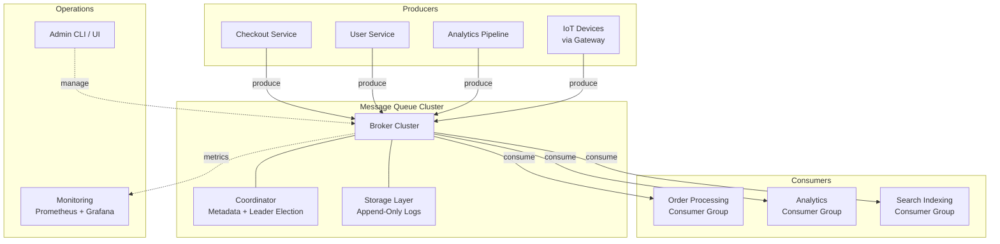

### 1.2 High-Level Architecture

```mermaid
graph LR
    subgraph Producer Clients
        P1[Producer 1]
        P2[Producer 2]
        P3[Producer N]
    end

    subgraph Broker Cluster
        subgraph Broker 1
            B1P0L["Topic-A P0<br/>(Leader)"]
            B1P1F["Topic-A P1<br/>(Follower)"]
            B1P2F["Topic-A P2<br/>(Follower)"]
        end
        subgraph Broker 2
            B2P0F["Topic-A P0<br/>(Follower)"]
            B2P1L["Topic-A P1<br/>(Leader)"]
            B2P2F2["Topic-A P2<br/>(Follower)"]
        end
        subgraph Broker 3
            B3P0F["Topic-A P0<br/>(Follower)"]
            B3P1F["Topic-A P1<br/>(Follower)"]
            B3P2L["Topic-A P2<br/>(Leader)"]
        end
    end

    subgraph Coordinator
        META[Metadata Store<br/>Topics + Partitions + Brokers]
        LE[Leader Election]
        GM[Group<br/>Management]
    end

    subgraph Consumer Groups
        subgraph Group A - 3 consumers
            CA1[Consumer A1<br/>P0]
            CA2[Consumer A2<br/>P1]
            CA3[Consumer A3<br/>P2]
        end
        subgraph Group B - 2 consumers
            CB1[Consumer B1<br/>P0 + P1]
            CB2[Consumer B2<br/>P2]
        end
    end

    P1 & P2 & P3 -->|route by partition key| B1P0L & B2P1L & B3P2L
    B1P0L -->|replicate| B2P0F & B3P0F
    B2P1L -->|replicate| B1P1F & B3P1F
    B3P2L -->|replicate| B1P2F & B2P2F2
    Coordinator -.->|metadata| Broker Cluster
    B1P0L --> CA1
    B2P1L --> CA2
    B3P2L --> CA3
    B1P0L --> CB1
    B2P1L --> CB1
    B3P2L --> CB2
```

### 1.3 Core Components Summary

```
+-------------------+-------------------------------------------------------+
| Component         | Responsibility                                        |
+-------------------+-------------------------------------------------------+
| Producer Client   | Serialize, partition, batch, compress, send to leader  |
| Broker            | Accept writes, store in log, replicate, serve reads    |
| Storage Engine    | Manage log segments, indexes, retention, compaction    |
| Coordinator       | Metadata, leader election, consumer group management   |
| Consumer Client   | Poll from leader, track offsets, handle rebalances     |
| Replication Mgr   | Maintain ISR, propagate writes to followers            |
+-------------------+-------------------------------------------------------+
```

---

## 2. The Broker: Heart of the System

### 2.1 Broker Responsibilities

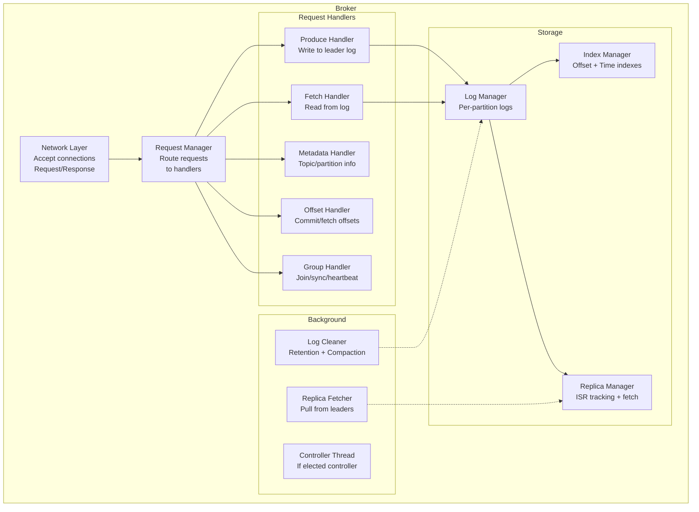

### 2.2 Broker Network Architecture

```
Each broker runs a multi-threaded network architecture:

1. Acceptor Thread (1):
   - Listens on port 9092 (or configured port)
   - Accepts new TCP connections
   - Round-robins connections to processor threads

2. Network Processor Threads (num.network.threads, default 3):
   - Each owns a Java NIO Selector
   - Reads complete requests from socket
   - Places on shared request queue
   - Sends responses back to clients

3. I/O Handler Threads (num.io.threads, default 8):
   - Pull requests from the shared queue
   - Execute the actual operation (produce, fetch, etc.)
   - Place response on the processor's response queue

4. Purgatory:
   - Delayed operations waiting for conditions
   - Example: Produce with acks=all waits for all ISR replicas
   - Example: Fetch with min.bytes waits for enough data
   - Timer wheel for efficient timeout management

Architecture:
  
  Client --> [Acceptor] --> [Processor 1] --> [Request Queue]
                            [Processor 2]          |
                            [Processor 3]     [I/O Thread 1]
                                              [I/O Thread 2]
                                              [I/O Thread 8]
                                                   |
                                              [Response Queue]
                                                   |
                            [Processor 1] <--------+
                            [Processor 2]
                            [Processor 3] --> Client
```

---

## 3. Log-Based Storage Engine

### 3.1 Partition Log Structure

The storage engine is the most important design decision in the entire system.
Each partition is an ordered, immutable sequence of records stored as a sequence
of **log segments** on disk.

```
Partition Directory: /data/kafka-logs/orders-0/

  +-------------------+-------------------+-------------------+
  | Segment 0         | Segment 1         | Segment 2         |
  | (CLOSED)          | (CLOSED)          | (ACTIVE)          |
  +-------------------+-------------------+-------------------+
  | 00000000000000.log| 00000000050000.log| 00000000100000.log|
  | 00000000000000.idx| 00000000050000.idx| 00000000100000.idx|
  | 00000000000000.tix| 00000000050000.tix| 00000000100000.tix|
  +-------------------+-------------------+-------------------+
  | offsets 0-49999   | offsets 50000-    | offsets 100000-   |
  |                   | 99999             | (current)         |
  +-------------------+-------------------+-------------------+

File naming: The filename IS the base offset of the first record in that segment.

.log file: Actual message data (record batches, sequentially appended)
.index file: Sparse offset-to-position index (maps offset -> byte position in .log)
.timeindex file: Sparse timestamp-to-offset index (maps timestamp -> offset)
```

### 3.2 Write Path (Produce)

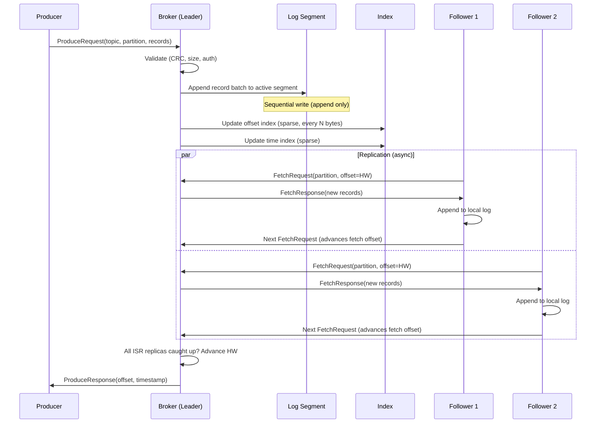

### 3.3 Sequential Write Details

```
Why sequential writes are so fast:

1. OS Page Cache:
   - Writes go to page cache first (write-back)
   - OS flushes to disk asynchronously in large batches
   - Broker does NOT call fsync on every write (by default)
   - Durability comes from REPLICATION, not fsync
   
2. Append-Only:
   - No seek required -- always writing to end of file
   - No read-modify-write cycle
   - No fragmentation over time
   
3. Batching:
   - Producer batches multiple messages into one record batch
   - Broker writes entire batch in one I/O operation
   - Amortizes syscall overhead across many messages

4. Zero-Copy (sendfile):
   Traditional path:     disk -> kernel buffer -> user buffer -> socket buffer -> NIC
   Zero-copy path:       disk -> kernel buffer -> NIC (via DMA)
   
   sendfile() syscall skips TWO memory copies and the context switch to userspace.
   This is why Kafka can serve consumers at disk bandwidth speed.

Performance:
   Single partition write: 100-500 MB/sec (sequential SSD)
   Single partition read:  200-800 MB/sec (with page cache hits)
   Zero-copy read:         Saturates 10 Gbps NIC easily
```

### 3.4 Read Path (Consume)

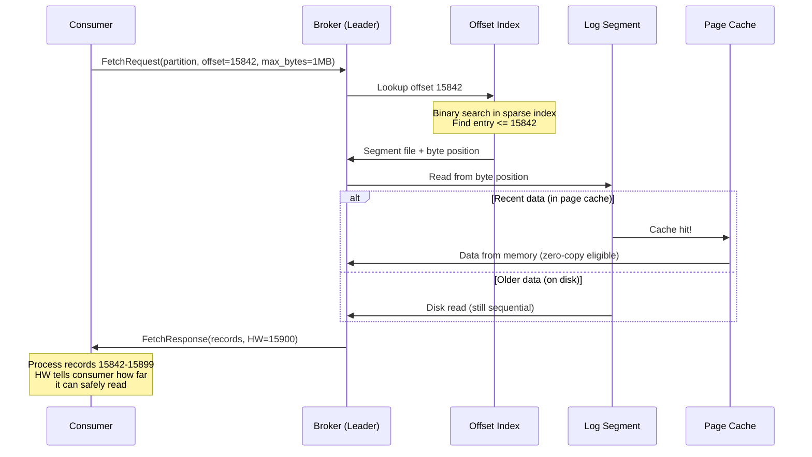

### 3.5 Offset Index: How We Find Messages Fast

```
The offset index is a SPARSE index mapping offsets to byte positions.
Not every offset is indexed -- only every Nth bytes of log data
(configured by index.interval.bytes, default 4096).

Offset Index (.index file):
+----------+--------------+
| Offset   | Position     |
+----------+--------------+
| 0        | 0            |
| 38       | 4096         |
| 75       | 8192         |
| 112      | 12288        |
| 150      | 16384        |
| ...      | ...          |
+----------+--------------+

To find offset 100:
1. Binary search index: find largest entry <= 100 --> (75, 8192)
2. Seek to position 8192 in .log file
3. Scan forward from offset 75 until we find offset 100

Why sparse (not dense)?
- Dense index: 1 entry per message = gigabytes of index for a large partition
- Sparse index: 1 entry per 4KB of data = small, fits in memory
- The "scan forward" part is trivially fast because it is a SHORT sequential scan

Time Index (.timeindex file):
+------------------+----------+
| Timestamp        | Offset   |
+------------------+----------+
| 1712456000000    | 0        |
| 1712456001234    | 38       |
| 1712456002567    | 75       |
| ...              | ...      |
+------------------+----------+

Used for: consumer.seek(timestamp) -- find the offset for a given time
Lookup: binary search timeindex -> offset -> then use offset index
```

---

## 4. Partitioning: The Unit of Everything

### 4.1 Why Partitions Exist

```
A partition is the fundamental unit of:

1. PARALLELISM:   Each partition can be read by one consumer in a group
                   More partitions = more consumers = more throughput

2. ORDERING:      Messages within a partition are strictly ordered
                   Messages ACROSS partitions have no ordering guarantee

3. REPLICATION:   Each partition is independently replicated
                   Partition = unit of leader election and failover

4. STORAGE:       Each partition maps to a directory on one broker
                   Partition data is NOT split across brokers

5. SCALABILITY:   Partitions are distributed across brokers
                   Adding brokers allows redistributing partitions
```

### 4.2 Partition Assignment to Brokers

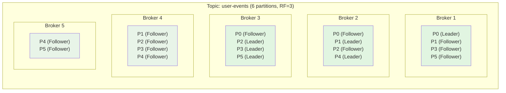

```
Partition assignment strategy (rack-aware):

Goals:
  1. Spread replicas across brokers evenly (load balancing)
  2. No two replicas of the same partition on the same broker
  3. Spread replicas across racks (failure domain isolation)
  4. Leaders distributed evenly (each broker leads ~equal partitions)

Algorithm (simplified):
  For each partition P with replication factor R:
    1. Sort brokers by (number of replicas hosted, rack)
    2. Assign leader to least-loaded broker in first rack
    3. Assign followers to least-loaded brokers in DIFFERENT racks
    4. If not enough racks, distribute across different brokers in same rack

Example with 3 racks (2 brokers each):
  Rack A: Broker 1, Broker 2
  Rack B: Broker 3, Broker 4
  Rack C: Broker 5, Broker 6
  
  Partition 0 (RF=3): Leader=B1 (Rack A), Follower=B3 (Rack B), Follower=B5 (Rack C)
  Partition 1 (RF=3): Leader=B4 (Rack B), Follower=B6 (Rack C), Follower=B2 (Rack A)
  
  Survives: any single broker failure, any single rack failure
```

### 4.3 Producer Partition Routing

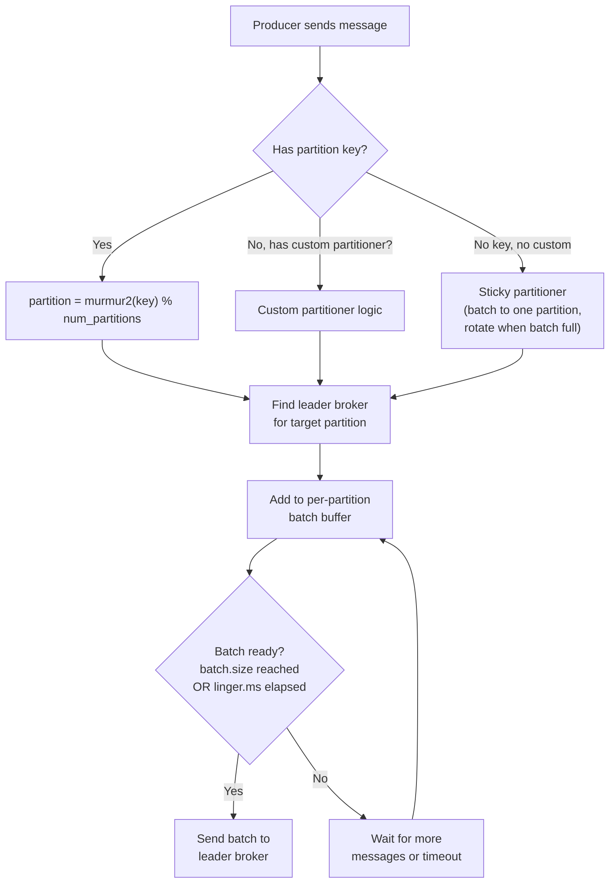

```
Partitioning strategies:

1. Key-Based (most common):
   partition = murmur2(key) % num_partitions
   
   Use case: All events for a user go to same partition -> ordered per-user
   Warning:  Changing partition count BREAKS this mapping!
             Messages for key "user-123" may land in a different partition.
   
2. Round-Robin (no key):
   Distributes messages evenly across partitions.
   Maximum throughput, no ordering by key.
   
3. Sticky Partitioner (Kafka 2.4+):
   Batch messages to ONE partition until batch is full, then rotate.
   Better batching = better compression and fewer requests.
   Replaced pure round-robin as the default for null-key messages.

4. Custom Partitioner:
   Implement your own logic (e.g., route by datacenter, by priority level).
   
Hot partition problem:
  If one key is extremely popular (e.g., a celebrity user), its partition
  becomes a hotspot. Solutions:
  - Add random suffix to key: "user-123-{random}" (breaks ordering!)
  - Use compound key: "user-123-{minute}" (coarse-grained ordering)
  - Increase partition count (does not help if one key dominates)
```

---

## 5. Consumer Groups and Coordination

### 5.1 Consumer Group Protocol

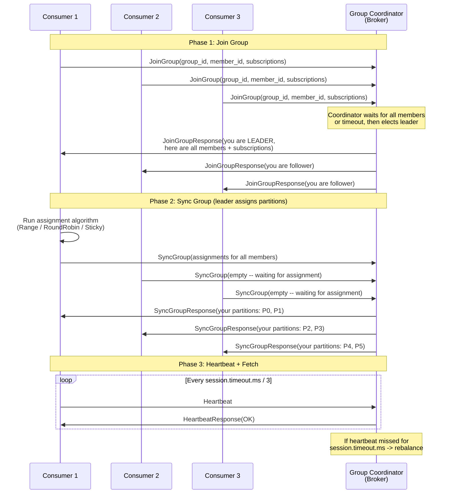

### 5.2 Consumer Group Coordinator

```
Every consumer group is managed by ONE broker acting as the Group Coordinator.

How is the coordinator chosen?
  coordinator_broker = hash(group_id) % num_partitions_of(__consumer_offsets)
  The broker hosting the LEADER of that __consumer_offsets partition is the coordinator.

The coordinator:
  1. Manages group membership (join, leave, heartbeat timeout)
  2. Triggers rebalances when membership changes
  3. Stores committed offsets in __consumer_offsets topic
  4. Tracks generation IDs to fence stale consumers

__consumer_offsets topic:
  - Internal topic, default 50 partitions, RF=3
  - Key: (group_id, topic, partition)
  - Value: (offset, metadata, commit_timestamp)
  - Log-compacted: keeps only latest offset per key
  - This is how offsets survive broker restarts
```

### 5.3 Partition Assignment Strategies

```
Given: Topic with 6 partitions (P0-P5), Consumer Group with 3 consumers (C1-C3)
Subscriptions: All consumers subscribe to the same topic

Strategy 1: Range Assignment
  Sort partitions and consumers alphabetically.
  Divide partitions evenly, remainder goes to first consumers.
  
  C1: P0, P1        (6 / 3 = 2 per consumer)
  C2: P2, P3
  C3: P4, P5
  
  Problem: With multiple topics, C1 always gets the "extra" partition.
  
Strategy 2: Round-Robin Assignment
  Sort all <topic, partition> pairs.
  Assign in round-robin to sorted consumers.
  
  C1: P0, P3
  C2: P1, P4
  C3: P2, P5
  
  More even, but may separate related partitions.

Strategy 3: Sticky Assignment (recommended)
  Like round-robin, but tries to KEEP existing assignments during rebalance.
  
  Before rebalance: C1=[P0,P1], C2=[P2,P3], C3=[P4,P5]
  C3 leaves -> rebalance:
    Sticky:  C1=[P0,P1,P4], C2=[P2,P3,P5]  -- only P4,P5 moved
    Range:   C1=[P0,P1,P2], C2=[P3,P4,P5]   -- P2 moved unnecessarily
  
  Sticky minimizes partition movement -> fewer "stop-the-world" pauses.

Strategy 4: Cooperative Sticky (Kafka 2.4+)
  Like Sticky but uses INCREMENTAL rebalancing.
  Consumers do NOT stop processing during rebalance.
  Only the partitions being moved are briefly paused.
  (Deep dive in deep-dive-and-scaling.md)
```

---

## 6. Offset Management

### 6.1 How Offsets Work

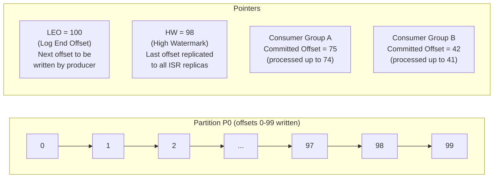

```
Key offset concepts:

1. Log End Offset (LEO):
   - The offset of the NEXT message to be written
   - If last written offset is 99, LEO = 100
   - Each replica tracks its own LEO

2. High Watermark (HW):
   - The offset up to which ALL ISR replicas have replicated
   - Consumers can ONLY read up to HW (not LEO)
   - This ensures consumers never see data that might be lost on leader failure
   - HW = min(LEO of all ISR replicas)

3. Committed Offset (per consumer group):
   - The offset up to which a consumer GROUP has processed
   - Stored in __consumer_offsets topic
   - On consumer restart, consumption resumes from committed offset
   - "Committed" means "I have successfully processed everything before this offset"

4. Consumer Lag:
   - Lag = HW - Committed Offset
   - If HW = 98 and committed offset = 75, lag = 23 messages
   - Critical operational metric: if lag grows, consumer cannot keep up
```

### 6.2 Offset Commit Strategies

```
Strategy 1: Auto-Commit (enable.auto.commit=true)
  - Offsets committed automatically every auto.commit.interval.ms (default 5s)
  - Committed BEFORE processing completes -> at-most-once risk
  - Actually committed during poll() call, not on a timer thread
  
  Risk: Consumer crashes after auto-commit but before processing
        -> messages are "committed" but never processed -> LOST
  
  When to use: Non-critical data where occasional loss is acceptable

Strategy 2: Manual Sync Commit (commitSync())
  - Consumer explicitly commits after processing
  - Blocks until commit succeeds
  - Exactly-right semantics for at-least-once
  
  Pattern:
    while (true) {
        records = consumer.poll(Duration.ofMillis(100));
        for (record : records) {
            process(record);   // process FIRST
        }
        consumer.commitSync(); // then commit
    }
  
  Risk: Consumer crashes after processing but before commit
        -> messages re-delivered on restart -> DUPLICATES (at-least-once)
  
  When to use: Most production workloads

Strategy 3: Manual Async Commit (commitAsync())
  - Non-blocking, uses callback for result
  - Higher throughput than commitSync
  - Cannot retry on failure (offset may be stale by retry time)
  
  Pattern: commitAsync in loop, commitSync on shutdown
  
Strategy 4: Fine-Grained Commit
  - Commit specific offsets per partition (not just "current position")
  - Useful for batch processing: commit after each batch of N messages
  - Required for exactly-once with external systems
```

---

## 7. Replication Protocol

### 7.1 Leader-Follower Replication

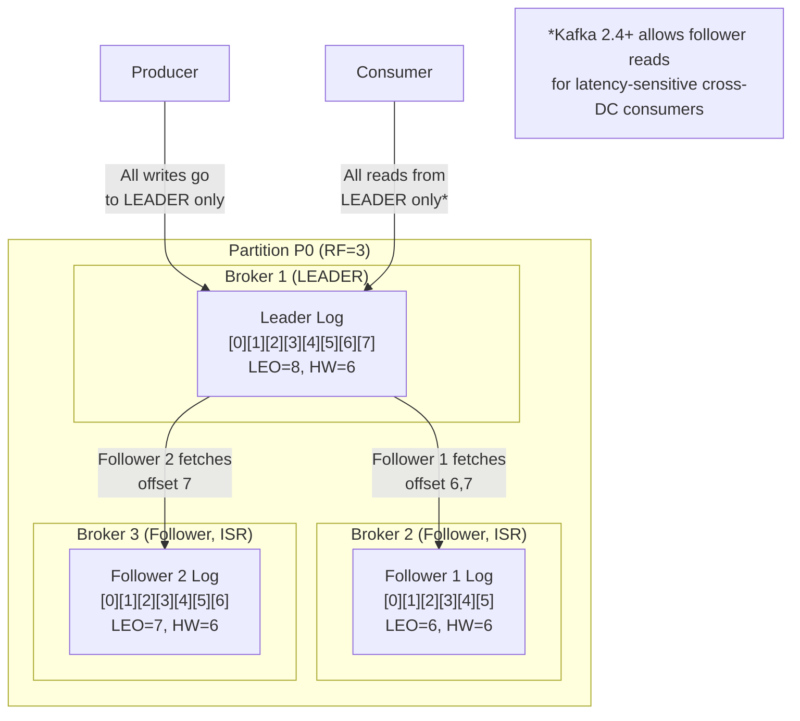

### 7.2 In-Sync Replicas (ISR)

```
ISR = Set of replicas that are "in sync" with the leader.

A follower is IN SYNC if:
  1. It has sent a fetch request within replica.lag.time.max.ms (default 10s)
  2. Its LEO is not more than replica.lag.time.max.ms behind the leader
  
  (Note: Kafka removed the replica.lag.max.messages config in 0.9 because
   it caused constant ISR shrinks during burst traffic)

ISR transitions:

  [Leader, F1, F2] -- all healthy
       |
  F2 falls behind (network issue, slow disk, GC pause)
       |
  [Leader, F1]  -- F2 removed from ISR (ISR shrink)
       |
  F2 catches up (fetches all missing data)
       |
  [Leader, F1, F2] -- F2 added back to ISR (ISR expand)

Why ISR matters:
  - HW = min(LEO of all ISR members)
  - acks=all means "all ISR replicas acknowledged"
  - If ISR = [Leader], acks=all degrades to acks=1 (dangerous!)
  - min.insync.replicas config prevents this:
    If ISR < min.insync.replicas, produces with acks=all are REJECTED
    Typical setting: min.insync.replicas = 2 with RF = 3
```

### 7.3 Acknowledgment Levels

```
+----------+------------------+--------------------+-------------------+
| acks     | Behavior         | Durability         | Latency           |
+----------+------------------+--------------------+-------------------+
| acks=0   | Fire and forget  | Messages may be    | Lowest            |
|          | Don't wait for   | lost (producer     | (~0.5 ms)         |
|          | any ack          | doesn't even know) |                   |
+----------+------------------+--------------------+-------------------+
| acks=1   | Wait for leader  | Messages lost if   | Medium            |
|          | to write to its  | leader dies before  | (~2-5 ms)         |
|          | local log        | followers replicate |                   |
+----------+------------------+--------------------+-------------------+
| acks=all | Wait for ALL ISR | Zero data loss     | Highest           |
| (or -1)  | replicas to      | (if min.insync     | (~5-20 ms)        |
|          | write to log     | .replicas >= 2)    |                   |
+----------+------------------+--------------------+-------------------+

Recommendation for production:
  acks = all
  min.insync.replicas = 2
  replication.factor = 3
  
  This means: 2 out of 3 replicas must acknowledge every write.
  Tolerates 1 broker failure with zero data loss.
  If 2 brokers fail, produces are rejected (availability sacrifice for durability).
```

### 7.4 Leader Election

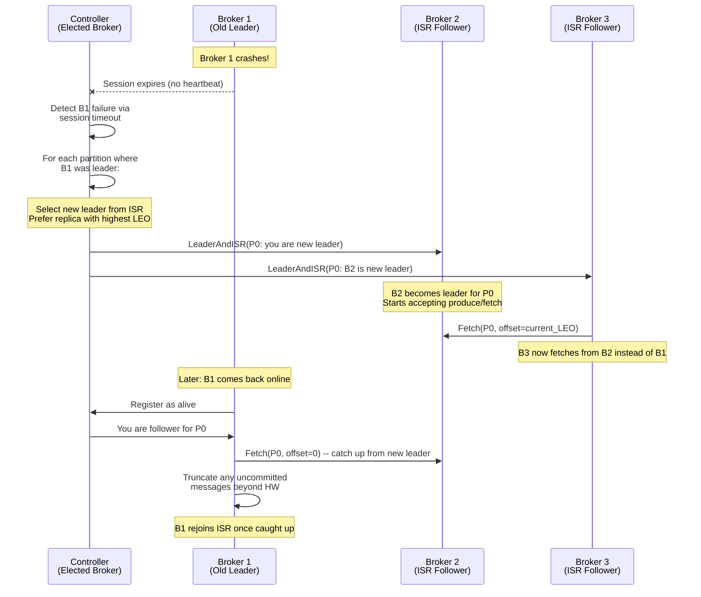

```
Unclean leader election (unclean.leader.election.enable):

  Scenario: ALL ISR replicas are down. Only an out-of-sync replica remains.
  
  If enabled (true):
    - Promote out-of-sync replica -> DATA LOSS (missing recent messages)
    - But partition becomes AVAILABLE immediately
    
  If disabled (false, recommended):
    - Partition stays UNAVAILABLE until an ISR replica comes back
    - Zero data loss but potential extended downtime
    
  This is the classic CAP theorem tradeoff: Availability vs. Consistency.
  
  Kafka's default: disabled (choose consistency).
```

---

## 8. Producer Design

### 8.1 Producer Architecture

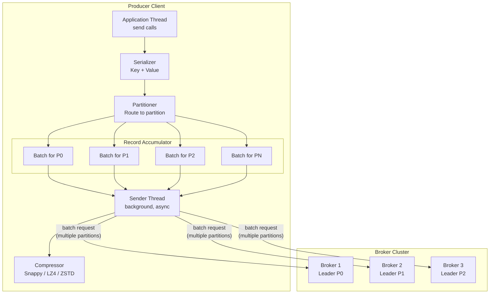

### 8.2 Producer Batching and Configuration

```
Key producer configurations:

batch.size (default 16KB):
  - Maximum size of a batch (per partition) before it is sent
  - Larger batches = better throughput, slightly higher latency
  - Recommended: 64KB - 256KB for high-throughput workloads

linger.ms (default 0):
  - How long to wait for more messages before sending a batch
  - 0 = send immediately (no lingering)
  - 5-100ms = accumulate more messages = larger batches = better compression
  - Tradeoff: latency vs. throughput

buffer.memory (default 32MB):
  - Total memory available for buffering unsent messages
  - If buffer full, send() blocks for max.block.ms then throws exception
  - Size this based on: batch.size x num_partitions x safety_factor

max.in.flight.requests.per.connection (default 5):
  - How many unacknowledged requests per broker connection
  - Higher = more pipeline parallelism = better throughput
  - WARNING: If > 1 and retries > 0, messages can be REORDERED on retry
  - For strict ordering: set to 1 (or use idempotent producer)

compression.type (default none):
  - none, gzip, snappy, lz4, zstd
  - Applied per-batch, not per-message
  - Recommendation: lz4 for latency-sensitive, zstd for throughput

retries (default Integer.MAX_VALUE with idempotent):
  - Number of times to retry a failed send
  - Combined with retry.backoff.ms (default 100ms)
  - Idempotent producer handles this correctly (no duplicates on retry)
```

### 8.3 Producer Send Flow

```
Timeline of a producer send() call:

T=0ms:    Application calls send(topic, key, value)
          |
T=0ms:    Serializer converts key and value to bytes
          |
T=0ms:    Partitioner determines target partition
          partition = murmur2(key) % num_partitions
          |
T=0ms:    Message appended to RecordAccumulator batch for that partition
          send() returns Future<RecordMetadata> immediately (async)
          |
          ... Sender thread (background) ...
          |
T=5ms:    linger.ms expires OR batch.size reached
          Sender drains batch from accumulator
          |
T=5ms:    Compression applied to batch (if configured)
          |
T=6ms:    ProduceRequest sent to leader broker
          |
T=6ms:    Leader appends to log
          |
T=7ms:    (if acks=all) Followers fetch and acknowledge
          |
T=12ms:   Leader sends ProduceResponse to producer
          |
T=12ms:   Future completes with RecordMetadata(topic, partition, offset)
          Callback invoked if provided

Total end-to-end: ~5-15ms (depending on acks level and linger.ms)
```

---

## 9. Consumer Design

### 9.1 Pull-Based Architecture

```
Why PULL (consumer fetches) instead of PUSH (broker sends)?

Push model (RabbitMQ style):
  Problem 1: Broker must track each consumer's rate -> complex
  Problem 2: Fast producer + slow consumer -> consumer overwhelmed
  Problem 3: Different consumers have different processing speeds
  
Pull model (Kafka style):
  Advantage 1: Consumer controls its own rate (natural backpressure)
  Advantage 2: Consumer can batch fetches (fetch 1MB at a time)
  Advantage 3: Broker is simpler (no per-consumer state for delivery)
  
  Disadvantage: If no data, consumer polls in a tight loop (wastes CPU)
  Solution: LONG POLLING (consumer blocks at broker until data arrives
            or timeout expires)

Long polling implementation:
  FetchRequest: min_bytes=1, max_wait_ms=500
  
  Broker behavior:
    If enough data available:  respond immediately
    If not enough data:        wait up to max_wait_ms for data to arrive
                               (held in fetch purgatory with timer wheel)
    If timeout:                respond with whatever is available (may be empty)
```

### 9.2 Consumer Fetch Tuning

```
Key consumer configurations:

fetch.min.bytes (default 1):
  - Minimum bytes the broker should return per fetch
  - Higher = fewer requests, better throughput, higher latency
  - Recommendation: 1KB-1MB depending on latency tolerance

fetch.max.wait.ms (default 500):
  - Maximum time broker waits to fill fetch.min.bytes
  - Combined with fetch.min.bytes for long polling behavior

max.partition.fetch.bytes (default 1MB):
  - Maximum bytes per partition per fetch
  - Must be larger than max.message.bytes on broker

fetch.max.bytes (default 52428800 = 50MB):
  - Maximum total bytes per fetch request (across all partitions)

max.poll.records (default 500):
  - Maximum number of records returned per poll() call
  - Limits processing time per poll cycle
  - Important: must process within max.poll.interval.ms or get kicked from group

max.poll.interval.ms (default 300000 = 5 min):
  - Maximum time between poll() calls before consumer is considered dead
  - If processing takes longer, increase this or decrease max.poll.records

session.timeout.ms (default 45000):
  - Heartbeat timeout. If broker doesn't receive heartbeat within this,
    consumer is removed from group -> rebalance triggered

heartbeat.interval.ms (default 3000):
  - How often consumer sends heartbeat to coordinator
  - Must be < session.timeout.ms / 3
```

### 9.3 Consumer Processing Loop

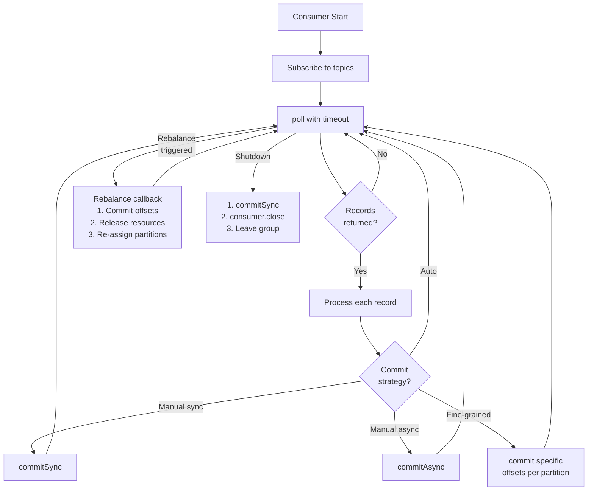

---

## 10. Coordinator: Metadata and Cluster Management

### 10.1 Controller Broker

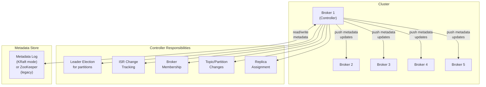

### 10.2 KRaft vs. ZooKeeper

```
Legacy (Kafka < 3.3): ZooKeeper-based coordination

  +-------------+       +----------------+
  | Kafka       | <---> | ZooKeeper      |
  | Cluster     |       | Ensemble (3-5) |
  +-------------+       +----------------+
  
  ZooKeeper stores: broker registration, topic configs, partition state,
                    ISR lists, consumer offsets (old API), ACLs
  
  Problems:
  1. Operational burden: two separate distributed systems to manage
  2. Scalability limit: ~200K partitions (ZK session/watch overhead)
  3. Controller bottleneck: single controller, ZK as source of truth
  4. Split-brain risk: controller and ZK can disagree during network partitions

Modern (Kafka 3.3+): KRaft (Kafka Raft) mode

  +------------------------------------------+
  | Kafka Cluster                            |
  |   Controller Quorum (3-5 brokers)        |
  |   using Raft consensus for metadata      |
  |   Remaining brokers: data only           |
  +------------------------------------------+
  
  Benefits:
  1. No ZooKeeper dependency: single system to deploy and manage
  2. Scalability: supports millions of partitions
  3. Faster failover: metadata changes propagated via Raft log
  4. Simpler: metadata is a Kafka topic itself (__cluster_metadata)
  
  Controller quorum:
  - 3 or 5 controllers (odd number for Raft majority)
  - One active controller (Raft leader)
  - Others are hot standbys (Raft followers)
  - Failover in seconds (Raft leader election)
```

### 10.3 Metadata Flow

```
How clients discover brokers and partition leaders:

1. Bootstrap:
   Client configured with bootstrap.servers = [broker1:9092, broker2:9092]
   Client connects to ANY bootstrap broker

2. Metadata Request:
   Client sends MetadataRequest(topics=[])
   Broker responds with:
   {
     "brokers": [
       {"id": 1, "host": "broker1", "port": 9092, "rack": "us-east-1a"},
       {"id": 2, "host": "broker2", "port": 9092, "rack": "us-east-1b"},
       {"id": 3, "host": "broker3", "port": 9092, "rack": "us-east-1c"}
     ],
     "topics": [
       {
         "name": "orders",
         "partitions": [
           {"id": 0, "leader": 1, "replicas": [1,2,3], "isr": [1,2,3]},
           {"id": 1, "leader": 2, "replicas": [2,3,1], "isr": [2,3,1]},
           {"id": 2, "leader": 3, "replicas": [3,1,2], "isr": [3,1]}
         ]
       }
     ]
   }

3. Direct Connection:
   Producer/Consumer connects DIRECTLY to partition leader.
   No proxy layer. No load balancer for data path.
   
4. Metadata Refresh:
   Client refreshes metadata every metadata.max.age.ms (default 5 min)
   or immediately on "Not Leader" error (leader moved).
```

---

## 11. Message Delivery Semantics

### 11.1 The Three Delivery Guarantees

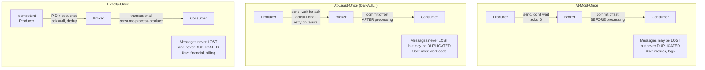

### 11.2 How Duplicates Happen (At-Least-Once)

```
Scenario: Producer duplicate

  T=0: Producer sends message M1 to leader
  T=1: Leader writes M1 to log (offset=42)
  T=2: Leader sends ack back to producer
  T=2: ACK LOST (network issue)
  T=3: Producer retries (timeout, no ack received)
  T=4: Leader writes M1 AGAIN to log (offset=43)
  T=5: Leader sends ack back to producer
  T=5: Producer receives ack -- thinks it sent one message
  
  Result: M1 is in the log TWICE (offset 42 and 43)

Scenario: Consumer duplicate

  T=0: Consumer fetches message M1 (offset=42)
  T=1: Consumer processes M1 (writes to database)
  T=2: Consumer tries to commit offset 43
  T=2: COMMIT FAILS (broker crash, network issue)
  T=3: Consumer reconnects, resumes from last committed offset (42)
  T=4: Consumer fetches M1 AGAIN and processes it AGAIN
  
  Result: M1 processed TWICE (database written twice)
```

---

## 12. Data Flow: End-to-End Message Lifecycle

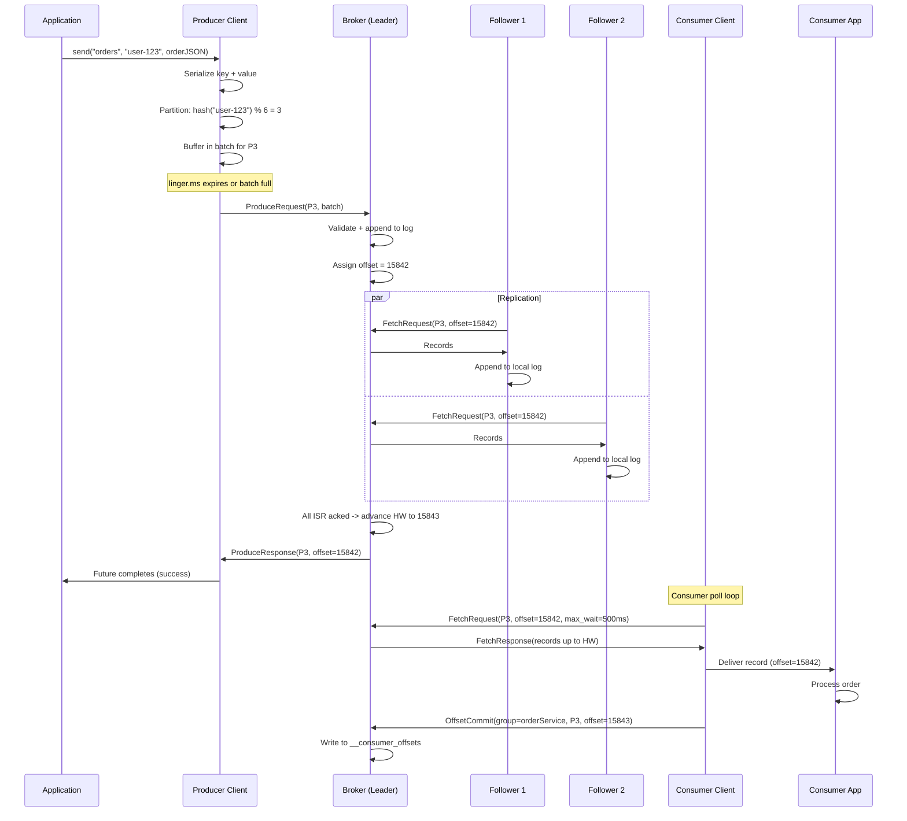

---

## 13. Failure Handling Summary

```
+-------------------------+--------------------------------------------+
| Failure                 | System Response                            |
+-------------------------+--------------------------------------------+
| Producer network error  | Retry with backoff (idempotent = no dup)   |
| Broker (leader) crash   | Controller elects new leader from ISR      |
|                         | Producer refreshes metadata, retries       |
|                         | No data loss if acks=all + min.isr=2       |
+-------------------------+--------------------------------------------+
| Broker (follower) crash | Removed from ISR after timeout             |
|                         | Leader continues with remaining ISR        |
|                         | Follower catches up on restart             |
+-------------------------+--------------------------------------------+
| Consumer crash          | Session timeout -> removed from group      |
|                         | Rebalance: partitions reassigned           |
|                         | New consumer resumes from committed offset |
+-------------------------+--------------------------------------------+
| Controller crash        | New controller elected (KRaft Raft leader) |
|                         | Brief metadata unavailability (~seconds)   |
|                         | Data path unaffected                       |
+-------------------------+--------------------------------------------+
| Network partition       | Brokers on minority side lose ISR status   |
|                         | Leader on majority side continues          |
|                         | Consumers fail over to accessible brokers  |
+-------------------------+--------------------------------------------+
| Disk failure            | Broker goes offline (if single disk)       |
|                         | Or JBOD: partition log moved to other disk |
|                         | Replica on other brokers take over         |
+-------------------------+--------------------------------------------+
```

---

## 14. Retention Policies

### 14.1 Retention Strategies

```
Strategy 1: Time-Based Retention (default)
  retention.ms = 604800000  (7 days)
  
  Log segments older than retention.ms are deleted.
  Checked periodically by log cleaner thread.
  
  Segment deletion:
  - Active segment is NEVER deleted (even if older than retention)
  - Only closed segments (completed, not being written to) are eligible
  - Deletion based on the LAST message timestamp in the segment

Strategy 2: Size-Based Retention
  retention.bytes = 107374182400  (100 GB per partition)
  
  If total log size exceeds retention.bytes, oldest segments deleted.
  Useful for bounding disk usage per partition.

Strategy 3: Log Compaction (cleanup.policy=compact)
  Keep only the LATEST value for each key.
  
  Before compaction:
  [key=A, val=1] [key=B, val=2] [key=A, val=3] [key=C, val=4] [key=B, val=5]
  
  After compaction:
  [key=A, val=3] [key=C, val=4] [key=B, val=5]
  
  Use cases:
  - Database changelog (latest state per row)
  - Configuration snapshots (latest config per key)
  - Cache rebuild (full state from compacted topic)

Strategy 4: Combined (cleanup.policy=delete,compact)
  Compact AND delete old data.
  Latest per key is kept, but even compacted records expire after retention.ms.
```
