# Design a Metrics Monitoring & Alerting System -- Deep Dives & Scaling

## 1. Deep Dive: Time-Series Storage Engine (LSM + Time-Partitioning)

### 1.1 Why LSM Trees for Time-Series Data

Time-series workloads are overwhelmingly write-heavy (95%+ writes). Traditional
B-tree databases suffer because every write requires random I/O to update the tree
in place. LSM (Log-Structured Merge) trees convert random writes into sequential
writes, which is ideal for our workload.

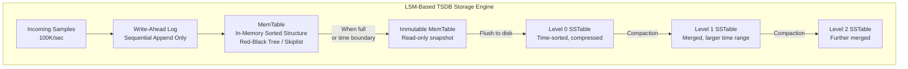

**Why this works for time-series:**

```
1. Write Amplification is Low
   - Traditional LSM: data may be rewritten 10-30x during compaction
   - Time-partitioned LSM: data within a time window is written once,
     compacted once or twice, then immutable
   - Old blocks are never rewritten (append-only nature of time-series)

2. Compaction is Time-Aligned
   - Instead of size-tiered or leveled compaction, we use time-partitioned compaction
   - Blocks are organized by time range: [T0-T2h], [T2h-T4h], ...
   - Compaction merges adjacent time blocks: [T0-T2h] + [T2h-T4h] -> [T0-T4h]
   - This is much cheaper than general-purpose compaction

3. Deletion is Free
   - To "delete" old data, just drop old time-partitioned blocks
   - No tombstone processing, no space reclamation overhead
   - 30-day retention = drop blocks older than 30 days
```

### 1.2 Block Structure Deep Dive

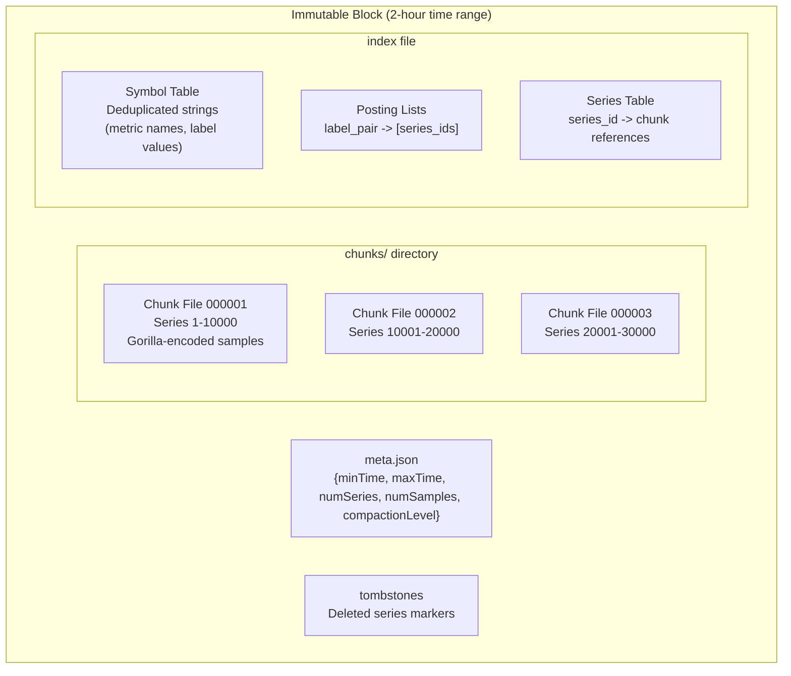

**Chunk encoding in detail:**

```
Each chunk contains samples for ONE series within this block's time range.

Chunk Header:
  +----------+----------+-----------+
  | Encoding | NumSamples| MinTime  |
  | (1 byte) | (2 bytes) | (8 bytes)|
  +----------+----------+-----------+

Chunk Body (Gorilla-encoded):
  +------+------+------+------+------+------+
  | t0   | v0   | DoD1 | XOR1 | DoD2 | XOR2 | ...
  | 64b  | 64b  | 1-32b| 1-64b| 1-32b| 1-64b|
  +------+------+------+------+------+------+

Chunk Footer:
  +----------+
  | CRC32    |
  | (4 bytes)|
  +----------+

Typical chunk: 120 samples (2 hours at 1 sample/min, or 720 at 10s)
Typical chunk size: 500 bytes - 2 KB (compressed)
```

### 1.3 The Index: How Multi-Dimensional Queries Work

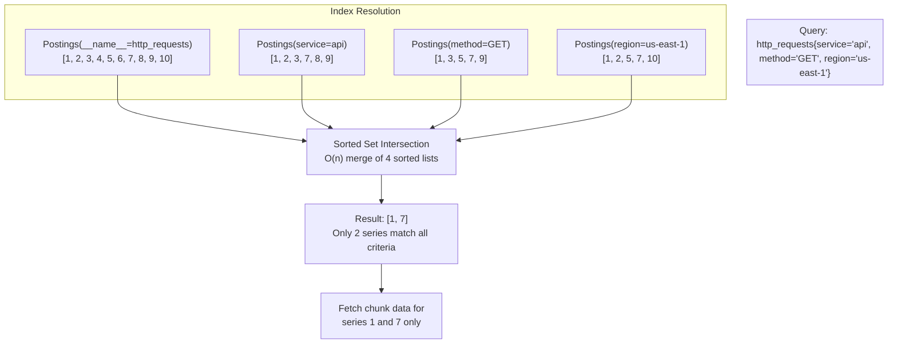

**Posting list optimization techniques:**

```
1. Roaring Bitmaps
   - Instead of sorted integer arrays, use Roaring Bitmaps
   - Efficient intersection, union, and difference operations
   - Compressed: 2-4 bytes per integer vs. 8 bytes for raw uint64
   - Bitwise AND for intersection is O(n/64) word operations

2. Sorted Label Ordering
   - When intersecting, start with the smallest posting list
   - This minimizes the work for subsequent intersections
   - Example: if region=us-east-1 has 500K series but method=DELETE has 100,
     start with method=DELETE

3. Bloom Filters for Block Pruning
   - Each block has a bloom filter of its series IDs
   - Before reading a block's index, check if any queried series MIGHT be there
   - Skip entire blocks that definitely don't contain matching series
```

### 1.4 Write-Ahead Log (WAL) Design

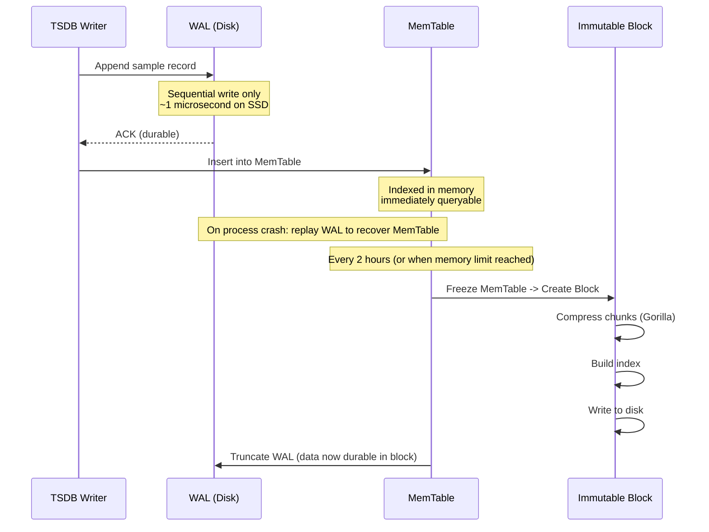

**WAL record format:**

```
Each WAL segment: 128 MB file

Record types:
  - Series Record:  {type=1, series_id, labels}     (first time a series is seen)
  - Sample Record:  {type=2, series_id, timestamp, value}
  - Tombstone Record: {type=3, series_id, min_time, max_time}

WAL write path:
  1. Encode record into buffer
  2. Write to current WAL segment (sequential append)
  3. fsync() periodically (every 1s or N records) for durability
  4. On segment full (128 MB), create new segment

Recovery:
  1. On startup, find all WAL segments
  2. Replay records in order
  3. Rebuild MemTable state
  4. Resume normal operation
  5. Recovery time: ~10-30 seconds for typical WAL size
```

---

## 2. Deep Dive: Alert Evaluation at Scale

### 2.1 The Scale Challenge

```
Given:
  - 10,000 alert rules
  - Each rule evaluated every 15-60 seconds
  - Each evaluation requires a TSDB query
  - Some rules match thousands of series

Throughput needed:
  - 10,000 rules / 30 sec average interval = ~333 rule evaluations/second
  - Each evaluation is a query that may scan 1K-100K data points
  - Total query load from alerts: ~3,300 queries/second (with sub-queries)
```

### 2.2 Alert Evaluation Architecture

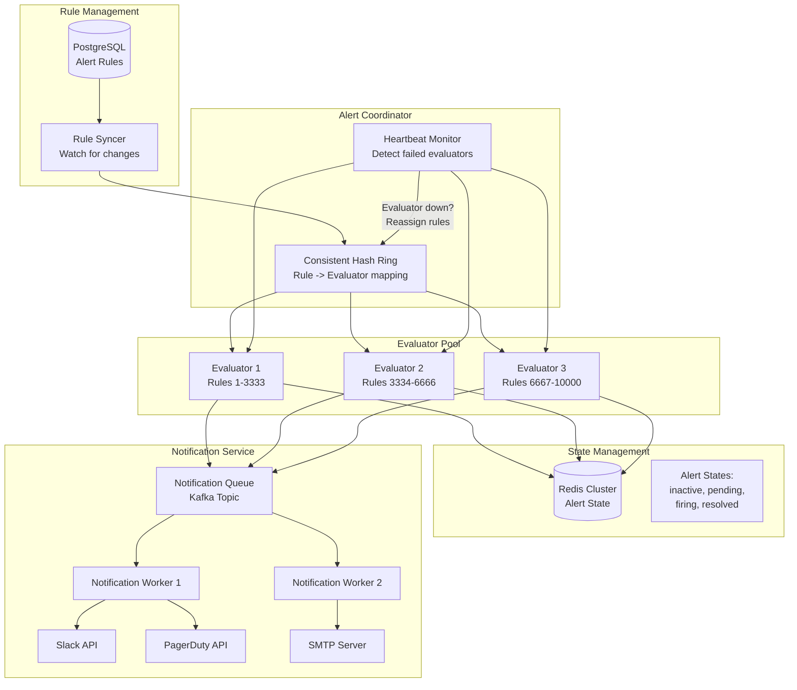

### 2.3 Rule Distribution Strategy

```
Rules are distributed across evaluator nodes using consistent hashing:

  evaluator_node = hash(rule_id) % ring_size -> assigned node

Benefits:
  - Adding/removing evaluators redistributes only a fraction of rules
  - Each evaluator maintains local state for its assigned rules
  - No central bottleneck for rule evaluation

Failure handling:
  - Evaluators send heartbeats to coordinator every 5 seconds
  - If heartbeat missed for 3 intervals (15 seconds):
    1. Coordinator marks node as failed
    2. Failed node's rules are redistributed to remaining evaluators
    3. State is loaded from Redis (not lost with the failed node)
    4. Evaluation resumes within ~30 seconds of failure detection
```

### 2.4 Multi-Window Burn Rate Alerting for SLOs

Traditional threshold alerts are noisy. For SLO-based alerting, Google's
multi-window burn-rate approach is far more effective.

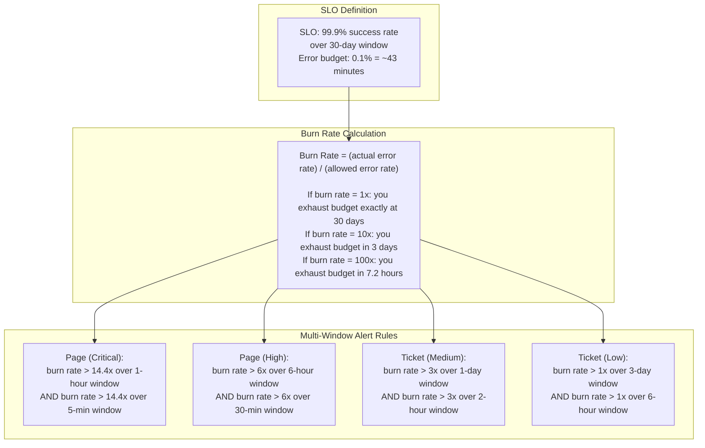

**Why multi-window?**

```
The long window (e.g., 1 hour) ensures the issue is significant enough
to consume meaningful error budget.

The short window (e.g., 5 minutes) ensures the issue is still ongoing
right now (not a historical blip that has already resolved).

Both must be true to fire the alert. This dramatically reduces false positives
while still catching real incidents quickly.

Example PromQL for the critical tier:

  # Long window: 1-hour burn rate > 14.4x
  (
    1 - (
      sum(rate(http_requests_total{status!~"5.."}[1h]))
      /
      sum(rate(http_requests_total[1h]))
    )
  ) > (14.4 * 0.001)

  AND

  # Short window: 5-min burn rate > 14.4x (still happening)
  (
    1 - (
      sum(rate(http_requests_total{status!~"5.."}[5m]))
      /
      sum(rate(http_requests_total[5m]))
    )
  ) > (14.4 * 0.001)
```

### 2.5 Alert Grouping, Inhibition, and Silencing

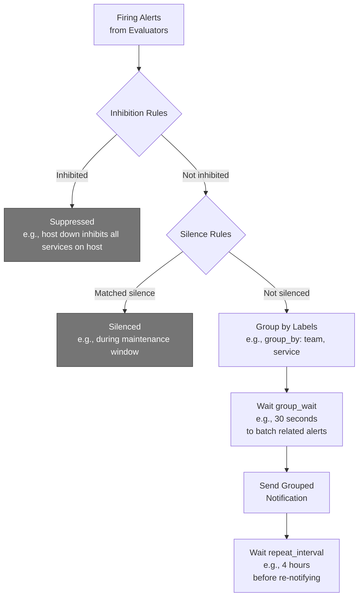

**Alert pipeline configuration (Alertmanager-style):**

```yaml
global:
  resolve_timeout: 5m

route:
  receiver: 'default-slack'
  group_by: ['team', 'service']
  group_wait: 30s
  group_interval: 5m
  repeat_interval: 4h

  routes:
    - match:
        severity: critical
      receiver: 'pagerduty-oncall'
      group_wait: 10s          # page faster for criticals
      repeat_interval: 1h

    - match:
        severity: warning
      receiver: 'slack-team'
      repeat_interval: 12h

inhibit_rules:
  - source_match:
      alertname: 'HostDown'
    target_match_re:
      host: '.*'
    equal: ['host']
    # When HostDown fires, suppress all other alerts from that host

receivers:
  - name: 'pagerduty-oncall'
    pagerduty_configs:
      - service_key: '<key>'
  - name: 'slack-team'
    slack_configs:
      - channel: '#alerts'
  - name: 'default-slack'
    slack_configs:
      - channel: '#monitoring'
```

---

## 3. Deep Dive: Scaling Strategies

### 3.1 Scaling the Write Path

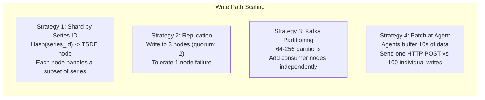

**Detailed sharding approach:**

```
Series Sharding via Consistent Hash Ring:

  1. Hash ring has N virtual nodes per physical node (150 typical)
  2. Series assignment: TSDB_node = ring.lookup(hash(series_id))
  3. Replication: write to the next 2 nodes on the ring as well

  Node addition (10 -> 11 nodes):
    - ~9% of series migrate (1/11)
    - Migration is lazy: old node serves reads, new node starts accepting writes
    - Background process copies historical data for migrated series

  Node failure:
    - Detected by heartbeat (10s timeout)
    - Replica nodes already have the data
    - Hash ring updated to skip failed node
    - Recovery: when node comes back, catch up from WAL replay + peer sync
```

### 3.2 Scaling the Read/Query Path

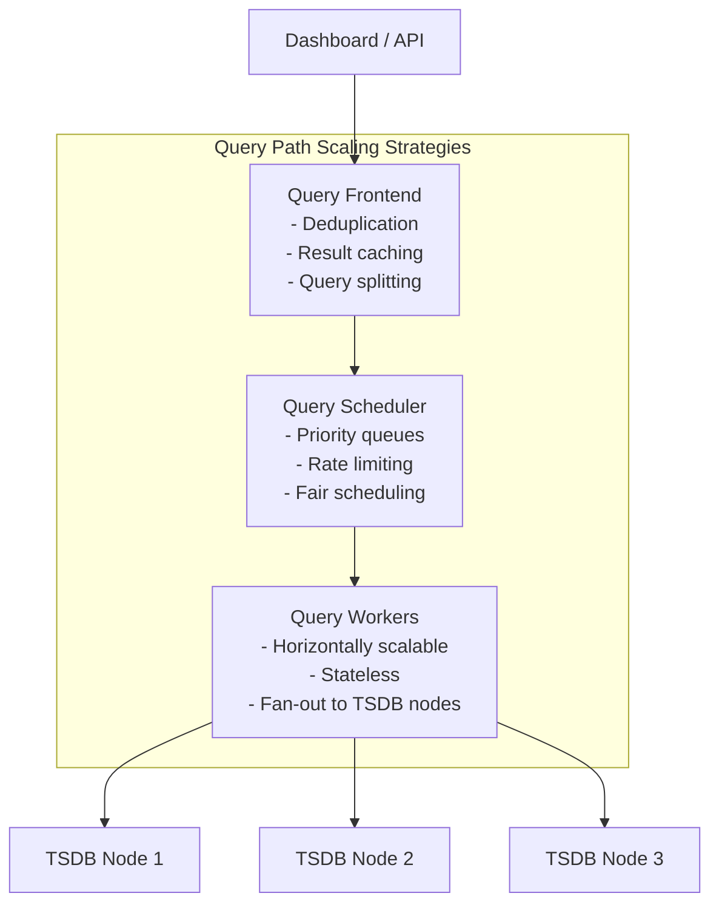

**Query splitting for large time ranges:**

```
Query: "avg CPU over last 30 days, step 1 hour"

Without splitting:
  - Single query scans 30 days x 1M series = massive
  - Likely times out or OOMs

With splitting:
  - Query Frontend splits into 30 daily sub-queries
  - Each sub-query runs in parallel on different workers
  - Results are merged at the frontend
  - Each sub-query is cacheable independently

  Day 1-29 results are immutable and cached permanently
  Day 30 (today) result is cached with short TTL (30s)

Additional optimizations:
  1. Step alignment: round query start/end to step boundaries for cache hits
  2. Partial caching: cache each day's result separately, only recompute today
  3. Tenant isolation: separate query queues per tenant, prevent noisy-neighbor
  4. Query cost estimation: reject queries that would scan >100M samples
  5. Automatic downsampling: use 1-min rollups for queries >6h, 1-hr for >7d
```

### 3.3 Scaling Storage with Tiered Architecture

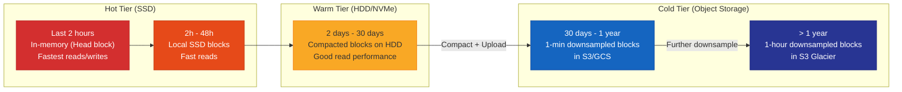

**Object storage integration (Thanos / Cortex pattern):**

```
1. TSDB nodes write blocks to local disk as usual
2. Background uploader sends completed blocks to S3:
   - Block is immutable once written, safe to upload
   - Upload includes chunks, index, meta.json
   - Verify checksum after upload

3. Store Gateway component:
   - Sits between Query Engine and Object Storage
   - Downloads block index files (small) into memory
   - On query: fetches only needed chunks from S3
   - Aggressive caching of chunk data (LRU cache, 32 GB)

4. Local TSDB nodes can now delete old blocks:
   - After block is confirmed in S3, delete local copy
   - Keeps only last 2-48 hours locally
   - Dramatically reduces local disk requirements

5. Cost savings:
   - Local SSD: ~$0.10/GB/month
   - S3 Standard: ~$0.023/GB/month
   - S3 Glacier: ~$0.004/GB/month
   - 10x-25x cost reduction for historical data
```

### 3.4 Scaling Cardinality: The Real Enemy

```
Cardinality = number of unique time series

Safe cardinality: 1-5 million series (manageable)
Dangerous cardinality: 10-100 million series (index blows up, queries slow)
Fatal cardinality: 1 billion+ series (system collapses)

Common cardinality explosions:
  - user_id as a label (millions of users = millions of series per metric)
  - request_id as a label (infinite cardinality)
  - full URL path as a label (unbounded)
  - combination explosion: 100 hosts x 50 endpoints x 5 methods x 3 regions = 75K series
    Add 100 customer_ids: 7.5M series (from one metric!)
```

**Cardinality defense strategies:**

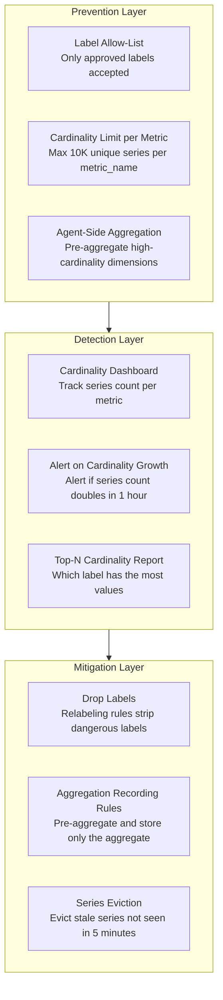

---

## 4. Deep Dive: High Availability

### 4.1 HA Architecture

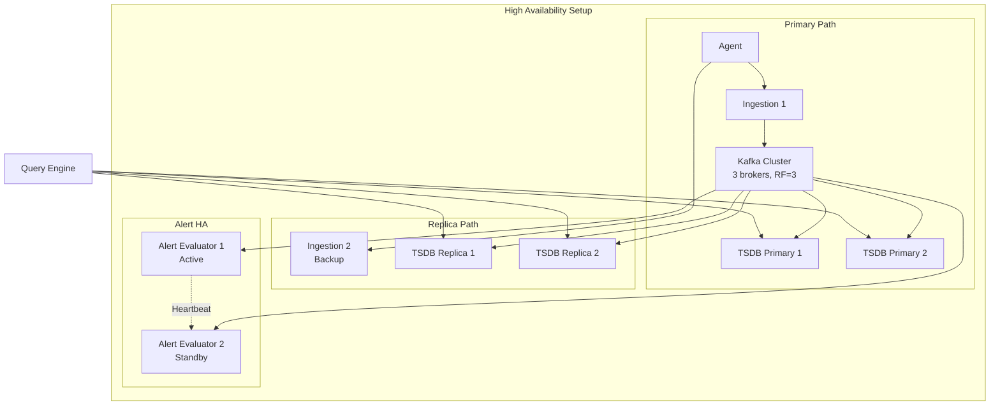

**HA guarantees:**

```
Ingestion HA:
  - Multiple ingestion gateways behind load balancer
  - Agent retries with exponential backoff on failure
  - Agent has local buffer (disk-backed) for 1 hour of data
  - If all gateways down: agent buffers locally, replays when connectivity restored

Kafka HA:
  - 3 broker minimum, replication factor 3
  - min.insync.replicas = 2 (tolerate 1 broker failure)
  - Unclean leader election disabled (no data loss)

TSDB HA:
  - Each series replicated to 3 TSDB nodes
  - Writes use quorum (2 of 3 must ACK)
  - Reads merge from all 3, deduplicate by timestamp
  - On node failure: remaining 2 replicas serve queries, re-replication begins

Alert HA:
  - Active-standby evaluator pairs
  - Both evaluate all rules independently
  - Deduplication at notification layer (same alert from 2 evaluators -> 1 notification)
  - Heartbeat monitoring: standby takes over within 15 seconds
```

### 4.2 Failure Modes and Recovery

```
| Failure                  | Impact                    | Recovery                          |
|--------------------------|---------------------------|-----------------------------------|
| Single agent down        | Gap in one host's metrics | Agent restarts, backfills from WAL|
| Ingestion gateway down   | LB routes to other nodes  | Automatic (seconds)               |
| Kafka broker down        | No impact (RF=3)          | Automatic replication             |
| TSDB node down           | Queries hit replicas      | Re-replication in background      |
| Alert evaluator down     | Standby takes over        | 15-second failover                |
| Query node down          | Other workers handle load | Automatic (load balanced)         |
| Redis (alert state) down | Evaluators use local state| Redis cluster failover (~30s)     |
| S3 outage                | Historical queries fail   | Retry with backoff, serve local   |
| Full region outage       | Failover to secondary     | DNS failover (minutes)            |
```

---

## 5. Deep Dive: Query Optimization

### 5.1 Query Execution Plan

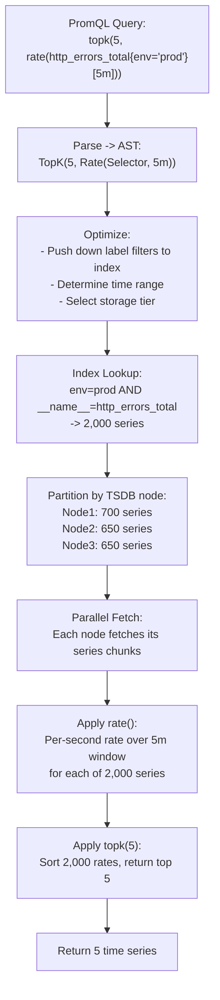

### 5.2 Caching Strategy

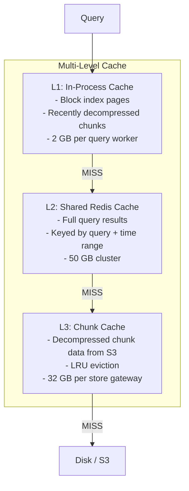

**Cache invalidation:**

```
Time-series caching is MUCH simpler than general caching because:

1. Historical data is immutable
   - A query for "CPU at 3pm yesterday" will always return the same result
   - Cache entry never needs invalidation (infinite TTL)

2. Only "now" edge is mutable
   - Current time window is actively receiving writes
   - Cache queries touching "now" with short TTL (15-30 seconds)

3. Step-aligned caching
   - Round query boundaries to step multiples
   - Query for [00:00, 06:00, step=1m] always produces same cache key
   - Even if user drags time picker slightly, snapped query hits cache

Cache key formula:
  key = hash(query_expression + start_time_aligned + end_time_aligned + step)
```

---

## 6. Comparison: Real-World Systems

| Feature | Prometheus | Datadog | Grafana Cloud (Mimir) | InfluxDB | VictoriaMetrics |
|---------|-----------|---------|----------------------|----------|-----------------|
| Collection Model | Pull (scrape) | Push (agent) | Both | Push | Both |
| Storage Engine | Custom TSDB (local) | Proprietary (distributed) | Custom (distributed, S3-backed) | TSM (custom LSM variant) | Custom fork of TSDB |
| Query Language | PromQL | Custom DSL | PromQL (MetricsQL) | InfluxQL / Flux | MetricsQL (PromQL superset) |
| Compression | Gorilla (DoD + XOR) | Proprietary | Gorilla | Delta + RLE + Snappy | Gorilla + custom |
| Horizontal Scaling | No (single node)* | Yes (SaaS) | Yes (microservices) | Yes (Enterprise) | Yes (cluster mode) |
| Long-Term Storage | No (use Thanos/Cortex) | Built-in | S3/GCS (object storage) | Built-in (TSM) | Built-in |
| HA / Replication | Dual-write (manual) | Built-in (SaaS) | Built-in (replication) | Enterprise only | Replication factor N |
| Cardinality Limit | ~10M practical | Very high (managed) | ~1B (distributed) | ~10M practical | ~100M (optimized) |
| Downsampling | No (use Thanos) | Built-in | Built-in | Continuous queries | Built-in (vmagent) |
| Alerting | Alertmanager | Built-in Monitors | Grafana Alerting | Kapacitor / Tasks | vmalert |
| Best For | Single-cluster, K8s | Full SaaS, enterprise | Multi-cluster, cloud-native | IoT, analytics | Cost-effective at scale |

```
* Prometheus can be scaled horizontally by running multiple instances with different
  scrape targets (federation or remote-write to a central store like Thanos/Mimir).
```

---

## 7. Monitoring the Monitoring System (Meta-Monitoring)

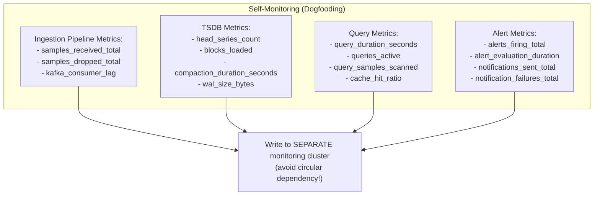

**Key operational alerts for the monitoring system itself:**

```
1. Ingestion lag > 30 seconds       (data freshness degraded)
2. Kafka consumer lag > 100K        (processing falling behind)
3. TSDB head series > 5M            (cardinality creep)
4. Query p99 latency > 5 seconds    (dashboards slow)
5. Alert evaluation p99 > 10 seconds (alerts delayed)
6. WAL size > 1 GB                  (compaction may be stuck)
7. Disk usage > 80%                 (need capacity planning)
8. Notification failure rate > 1%   (alerts not reaching humans)
```

---

## 8. Cost Optimization Strategies

```
1. Aggressive Downsampling
   - 10s -> 1min reduces storage 6x
   - 1min -> 1hr reduces another 60x
   - Total: ~360x reduction for old data

2. Object Storage for Cold Data
   - Move blocks older than 48h to S3 ($0.023/GB vs $0.10/GB SSD)
   - Use S3 Intelligent Tiering for automatic hot/cold management

3. Metric Lifecycle Management
   - Auto-delete metrics not queried in 90 days
   - Identify and deprecate unused metrics
   - Charge-back teams for their cardinality usage

4. Compression Tuning
   - Gorilla encoding: 8-16x compression for typical workloads
   - Additional LZ4/Snappy on top of Gorilla for blocks: extra 1.5-2x
   - Total: 12-32x compression ratio

5. Query Cost Guardrails
   - Reject queries scanning > 100M samples
   - Auto-downsample queries with > 24-hour range
   - Cache aggressively (historical data is immutable)

6. Right-Size Alert Evaluation
   - Not all rules need 15-second evaluation
   - Low-priority alerts: evaluate every 60 seconds
   - Critical alerts: evaluate every 15 seconds
   - Reduces query load from alerting by 4x
```

---

## 9. Interview Tips & Common Pitfalls

### 9.1 What Interviewers Look For

```
1. Understanding of write-heavy workload characteristics
   - Demonstrate you know this is 95% writes
   - Explain why LSM / append-only storage is the right choice
   - Show awareness of Gorilla compression

2. Multi-dimensional data model understanding
   - Explain metric_name + labels as the identity
   - Show inverted index for label-based queries
   - Discuss cardinality as the scaling bottleneck

3. Separation of ingestion, storage, query, and alerting paths
   - Each can scale independently
   - Alerts get dedicated resources (never starved by dashboards)
   - Kafka decouples everything

4. Practical downsampling strategy
   - Not just "we downsample" but HOW (min/max/sum/count per window)
   - Explain why avg alone is insufficient
   - Show the tiered retention policy

5. Alert reliability
   - State machine with pending -> firing -> resolved
   - HA evaluation with deduplication
   - Multi-window burn rate for SLOs (bonus points)
```

### 9.2 Common Mistakes to Avoid

```
1. Using a general-purpose database (PostgreSQL, MySQL)
   - Time-series data needs specialized compression and indexing
   - General DBs cannot handle 100K writes/sec efficiently

2. Ignoring cardinality
   - Not mentioning cardinality limits is a red flag
   - Show you understand the difference between 1M and 100M series

3. Single-node design
   - Even for 10K servers, single-node TSDB hits limits quickly
   - Show horizontal scaling strategy from the start

4. Coupling alerts with dashboards
   - Alerts must be isolated from query load
   - A slow dashboard query should never delay an alert

5. Forgetting about the agent
   - The agent is critical infrastructure
   - It must buffer locally, retry, and handle network failures
   - Don't hand-wave the collection layer

6. Not discussing compression
   - Storage cost is a primary concern
   - Gorilla encoding is expected knowledge for this problem
```

### 9.3 How to Structure Your 45-Minute Interview

```
Minutes 0-5:   Clarify requirements, confirm scope
               "How many servers? What retention? Push or pull?"

Minutes 5-10:  Back-of-envelope estimation
               "100K writes/sec, ~3TB total storage with replication"

Minutes 10-25: High-level architecture
               Draw the full pipeline: agents -> ingestion -> kafka -> TSDB -> queries -> alerts
               Explain each component's role
               Discuss data model (metric_name + labels + timestamp + value)

Minutes 25-35: Deep dive (pick 1-2 based on interviewer interest)
               Option A: Time-series storage engine (Gorilla, LSM, compaction)
               Option B: Alert evaluation at scale (state machine, HA, burn rates)
               Option C: Query optimization (splitting, caching, index lookups)

Minutes 35-42: Scaling & operational concerns
               Horizontal scaling strategy
               HA and failure modes
               Cardinality management
               Cost optimization

Minutes 42-45: Summary & trade-offs
               "The key trade-offs are write optimization vs. query flexibility,
                storage cost vs. query granularity, and alert latency vs. system load."
```

### 9.4 Extending the Design

```
If the interviewer asks you to extend:

1. "Support 100K servers instead of 10K"
   -> 10x more series (10M), 10x more writes (1M/sec)
   -> Need 3-5x more TSDB nodes, Kafka partitions
   -> Cardinality management becomes critical
   -> Consider federation or hierarchical aggregation at the edge

2. "Add distributed tracing integration"
   -> Exemplars: attach trace_id to metric samples
   -> When alert fires, link to relevant traces
   -> Different storage path for traces (Jaeger/Tempo)

3. "Multi-region deployment"
   -> Each region has local TSDB cluster
   -> Central query layer fans out to all regions
   -> Or: remote-write from regions to central cluster
   -> Alert evaluation per-region + global aggregation

4. "Support custom metrics from mobile apps"
   -> Massively higher cardinality (device_id as label is fatal)
   -> Pre-aggregate on client or at ingestion gateway
   -> Use histograms/sketches instead of per-device metrics

5. "Add log-based metrics"
   -> Parse logs to extract metrics (e.g., error counts)
   -> Additional ingestion pipeline from log aggregator
   -> Higher write volume, but same storage model
```

---

## 10. Final Architecture Summary

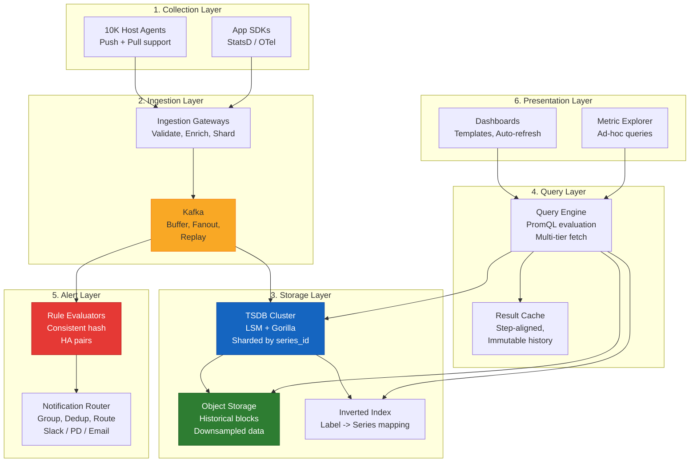

**The five pillars of this design:**

```
1. COLLECTION:  Flexible agent supporting push+pull, with local buffering
2. INGESTION:   Kafka-backed pipeline for durability, decoupling, and fanout
3. STORAGE:     Time-partitioned LSM with Gorilla compression and tiered retention
4. QUERYING:    PromQL engine with multi-level caching and automatic downsampling
5. ALERTING:    Isolated evaluation pipeline with HA, state machines, and SLO burn rates
```
