# Design a Metrics Monitoring & Alerting System -- High-Level Design

## 1. End-to-End Architecture Overview

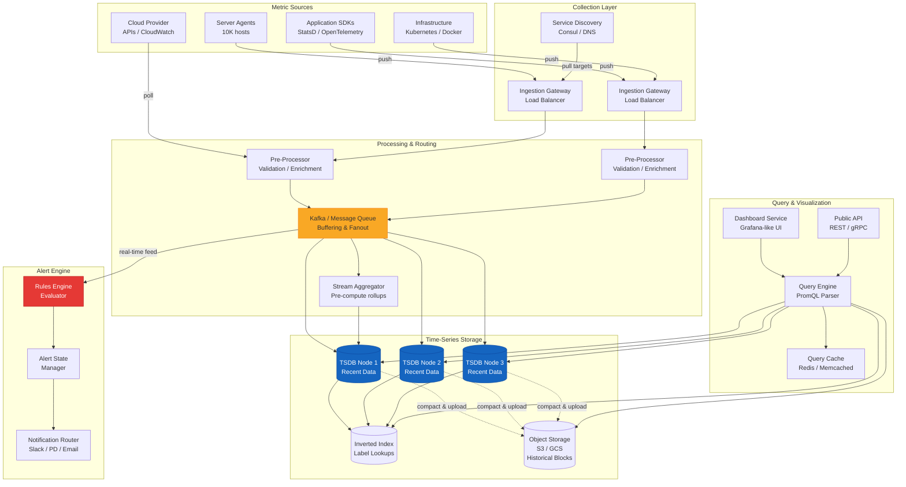

---

## 2. Component Breakdown

### 2.1 Metric Collection Agents

The collection layer is responsible for getting metrics from source systems into
the monitoring pipeline.

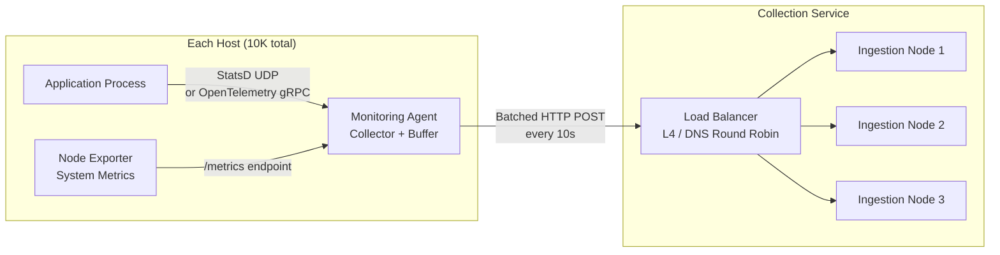

**Two Collection Models:**

| Aspect | Push Model (StatsD/Datadog) | Pull Model (Prometheus) |
|--------|---------------------------|------------------------|
| Direction | Agents push to collector | Collector scrapes targets |
| Service Discovery | Not required (agents know endpoint) | Required (need target list) |
| NAT/Firewall | Works behind NAT | Requires reachable endpoints |
| Health Detection | Cannot detect dead agent (silence) | Knows when target is down |
| Serverless/Lambda | Works well | Not feasible |
| Configuration | Agent-side (what to send) | Server-side (what to scrape) |
| Back-pressure | Harder (agent decides rate) | Easier (collector controls pace) |

**Our Design: Support Both**

```
Push Path:
  Agent -> Ingestion Gateway -> Pre-processor -> Kafka

Pull Path:
  Service Discovery -> Scrape Scheduler -> HTTP GET /metrics -> Pre-processor -> Kafka

Both paths converge at Kafka for unified downstream processing.
```

### 2.2 Pre-Processor (Validation & Enrichment)

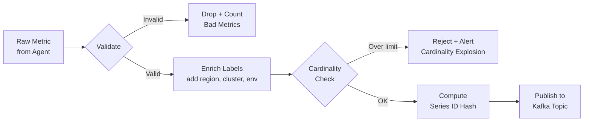

**Pre-processing steps:**

```
1. Schema Validation
   - Metric name matches regex: [a-zA-Z_:][a-zA-Z0-9_:]*
   - Timestamp is within acceptable window (not too old, not in future)
   - Value is a valid float64

2. Label Enrichment
   - Add infrastructure labels (region, availability_zone, cluster)
   - Normalize label names (lowercase, replace dots with underscores)

3. Cardinality Enforcement
   - Track unique series count per metric name
   - If a metric exceeds cardinality limit (e.g., 10,000 series), reject new series
   - This prevents "cardinality explosions" (e.g., someone tagging with user_id)

4. Series ID Computation
   - Hash(metric_name + sorted(labels)) -> uint64 series_id
   - Used for partitioning and deduplication

5. Kafka Partitioning
   - Partition by series_id for ordering guarantees per series
   - Ensures all samples for the same series land on the same TSDB node
```

### 2.3 Message Queue (Kafka)

Kafka serves as the central nervous system between ingestion and storage:

```
Topic: metrics-raw
  Partitions: 64 (tunable)
  Replication: 3
  Retention: 6 hours (buffer for reprocessing)

Partition assignment: hash(series_id) % num_partitions
  -> Guarantees ordering per time series
  -> Enables parallel consumption

Consumers:
  1. TSDB Writer Group    (writes to time-series database)
  2. Alert Evaluator Group (feeds real-time alert rules)
  3. Stream Aggregator     (computes pre-aggregated rollups)
```

**Why Kafka here (not direct writes)?**

```
1. Decouples ingestion from storage (absorb bursts)
2. Enables multiple consumers (TSDB + alerts + aggregation)
3. Provides replay capability (reprocess on storage failures)
4. Handles back-pressure naturally (consumer lag)
5. Allows independent scaling of write and read paths
```

### 2.4 Time-Series Database (TSDB)

The heart of the system. This is where all metrics data lives.

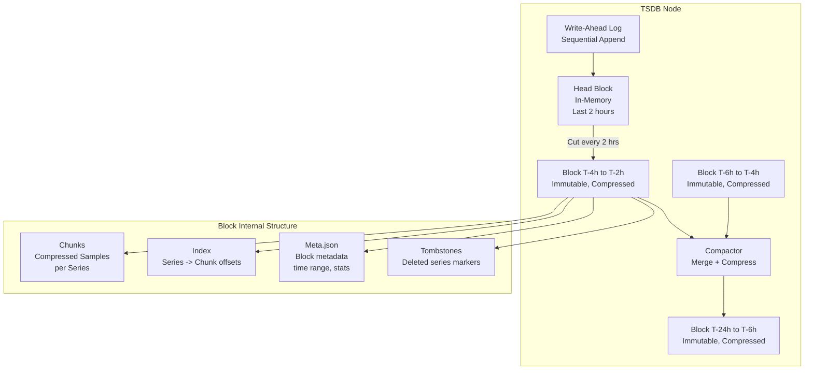

**Storage Layout (Prometheus TSDB-inspired):**

```
data/
  wal/
    000001          # Write-ahead log segment
    000002
  head/             # In-memory block (active writes)
  01BKGV7J...BQ/   # Immutable block (2-hour window)
    chunks/
      000001        # Chunk files (compressed samples)
    index           # Inverted index for this block
    meta.json       # Block metadata (min/max time, num series)
    tombstones      # Deletion markers
  01BKGTZQ...KR/   # Another immutable block
    ...
```

**Write Path (detailed):**

```
1. Sample arrives: {series_id, timestamp, value}
2. Append to WAL (sequential disk write, very fast)
3. Write to Head block's in-memory map:
     head.series[series_id].append(timestamp, value)
4. When Head block reaches time boundary (every 2 hours):
   a. Freeze current Head -> becomes immutable block
   b. Compress all series chunks using Gorilla encoding
   c. Build block-level index
   d. Write block to disk
   e. Truncate WAL
5. Background compaction merges adjacent blocks:
   - 2h + 2h -> 4h block
   - 4h + 4h -> 8h block
   - Reduces block count, improves query performance
```

### 2.5 Data Compression -- Gorilla Encoding

Time-series data compresses extremely well because consecutive values are
highly correlated. Facebook's Gorilla paper introduced two key techniques:

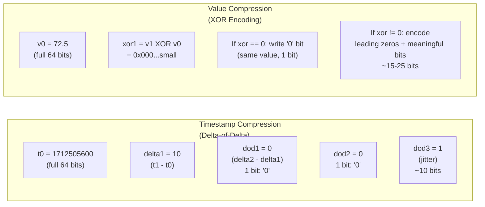

**Compression details:**

```
Timestamp Encoding (Delta-of-Delta):
  - First timestamp: stored in full (64 bits)
  - Second timestamp: store delta (t1 - t0), e.g., 10 seconds
  - Subsequent: store delta-of-delta (current_delta - previous_delta)
  - For regular intervals, delta-of-delta is usually 0 -> encoded as single '0' bit
  - Typical: 1-2 bits per timestamp

Value Encoding (XOR):
  - First value: stored in full (64 bits)
  - Subsequent: XOR with previous value
  - If XOR is 0 (same value): encode as single '0' bit
  - If XOR non-zero, check if leading/trailing zeros match previous XOR:
    - If same zero structure: encode only meaningful bits
    - Otherwise: encode leading zeros count + bit length + meaningful bits
  - Typical: 1-15 bits per value depending on rate of change

Result:
  - CPU usage (slowly changing): ~2-4 bytes per (timestamp, value) pair
  - Request counters (monotonically increasing): ~3-5 bytes per pair
  - Random/high-entropy values: ~8-12 bytes per pair (less compressible)
  - Average across all metric types: ~3 bytes per pair (vs. 16 bytes raw)
```

### 2.6 Inverted Index for Multi-Dimensional Queries

To efficiently query metrics by label (e.g., "all CPU metrics where region=us-east-1"),
we maintain an inverted index:

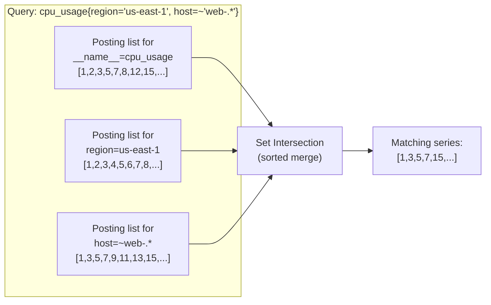

**Index structure:**

```
Inverted Index:
  label_pair("__name__", "cpu_usage")   -> [series_id_1, series_id_2, ...]
  label_pair("region", "us-east-1")     -> [series_id_1, series_id_3, ...]
  label_pair("host", "web-server-042")  -> [series_id_5, series_id_8, ...]

Forward Index:
  series_id_1 -> {__name__: "cpu_usage", region: "us-east-1", host: "web-001"}
  series_id_2 -> {__name__: "cpu_usage", region: "us-west-2", host: "web-002"}

Query Resolution:
  1. Parse query to extract label matchers
  2. Look up posting lists for each matcher
  3. Intersect posting lists (sorted merge, very fast)
  4. For regex matchers: scan label values, collect matching posting lists, union
  5. Result: set of series IDs that match all query conditions
```

### 2.7 Query Engine

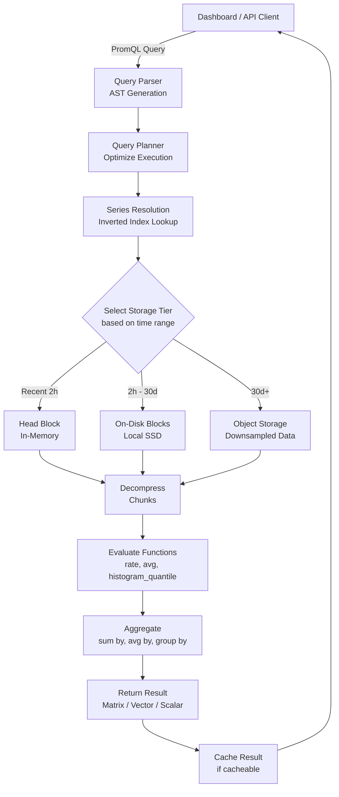

**Query execution flow for a PromQL query:**

```
Query: avg(rate(http_request_duration_seconds{service="payment-api"}[5m])) by (endpoint)

Step 1 - Parse:
  AST: Aggregation(avg, by=[endpoint],
         Function(rate, range=5m,
           Selector(name="http_request_duration_seconds",
                    matchers=[service="payment-api"])))

Step 2 - Plan:
  - Time range: last 6 hours, step 1 minute
  - Need 5 minutes of lookback at each step
  - Identify which blocks overlap the time range

Step 3 - Resolve:
  - Inverted index: __name__="http_request_duration_seconds" AND service="payment-api"
  - Result: 50 matching series (one per endpoint x method combination)

Step 4 - Fetch:
  - For each matching series, fetch samples from [start-5m, end]
  - Decompress chunks, filter to needed time range

Step 5 - Evaluate:
  - Apply rate() function: compute per-second increase over 5m windows
  - Apply avg() aggregation: group by endpoint label, average across series

Step 6 - Return:
  - Result: one time series per unique endpoint value
  - Each contains 360 data points (6 hours at 1-minute step)
```

**Query optimizations:**

```
1. Step-aligned caching: Cache query results aligned to step boundaries
2. Block-level pruning: Skip blocks whose time range doesn't overlap the query
3. Chunk-level pruning: Skip chunks based on min/max time metadata
4. Parallel fetch: Query multiple blocks/nodes in parallel, merge results
5. Partial response: Return data from available nodes even if some are slow
6. Subquery sharing: Multiple dashboard panels querying same base metric share work
```

### 2.8 Alerting Engine

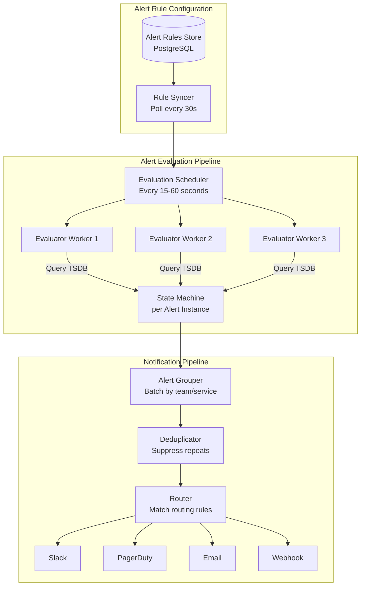

**Alert state machine:**

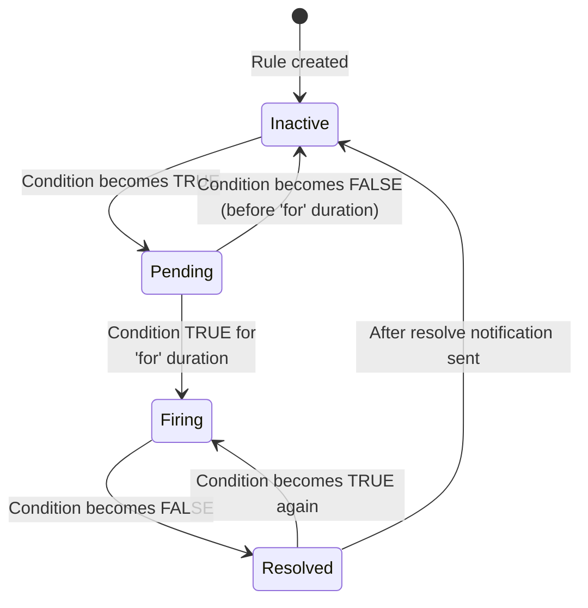

**Alert evaluation details:**

```
For each alert rule (evaluated every 15-60 seconds):

1. Execute the PromQL expression against current data
2. For each resulting series:
   a. If value satisfies threshold:
      - If state is Inactive -> move to Pending, record active_at
      - If state is Pending and (now - active_at) >= for_duration -> move to Firing
      - If state is Firing -> remain Firing (do nothing)
   b. If value does NOT satisfy threshold:
      - If state is Pending -> move to Inactive
      - If state is Firing -> move to Resolved, send resolution notification
      - If state is Inactive -> remain Inactive (do nothing)

3. For newly Firing alerts:
   - Group by configured grouping labels (e.g., team, service)
   - Wait group_wait duration (e.g., 30s) to batch multiple alerts
   - Route to configured notification channels
   - Start repeat_interval timer for re-notification

4. For Resolved alerts:
   - Send resolution notification to same channels
   - Clear state after configurable grace period
```

### 2.9 Dashboard Service

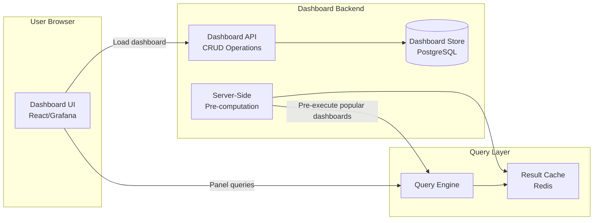

**Dashboard features:**

```
1. Template Variables
   - Dynamic drop-downs populated from label values
   - Example: $region variable -> query all unique values of "region" label
   - All panels re-execute with selected variable value

2. Auto-Refresh
   - Configurable interval (10s, 30s, 1m, 5m)
   - Only fetch new data since last refresh (incremental)

3. Time Range Selection
   - Relative (last 1h, 6h, 24h, 7d, 30d)
   - Absolute (pick start/end datetime)
   - Automatic granularity selection based on range:
     - <6 hours: raw data (10s resolution)
     - 6h-24h: 1-minute downsampled
     - 1d-7d: 5-minute downsampled
     - 7d-30d: 1-hour downsampled
     - >30d: 1-day downsampled

4. Panel Types
   - Time series graph (line, area, bar)
   - Stat panel (single number with sparkline)
   - Table (tabular data)
   - Heatmap (distribution over time)
   - Gauge (current value against thresholds)

5. Annotations
   - Overlay deployment markers, incidents, events on graphs
   - Query-based annotations (e.g., show all deploys)
```

---

## 3. Data Flow: End-to-End Write Path

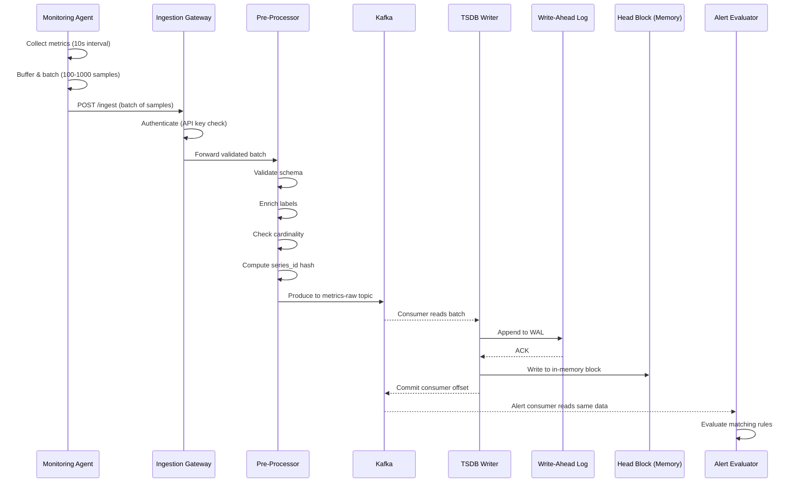

---

## 4. Data Flow: End-to-End Read/Query Path

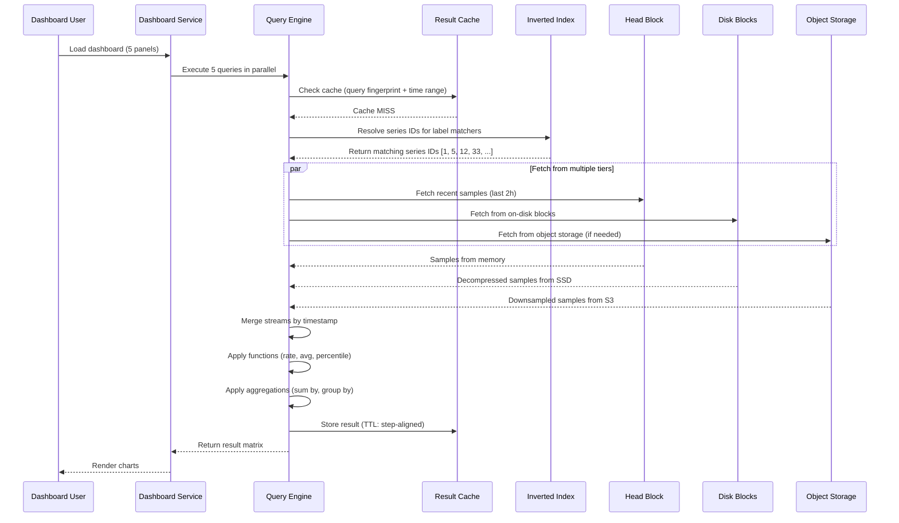

---

## 5. Data Flow: Alert Evaluation & Notification

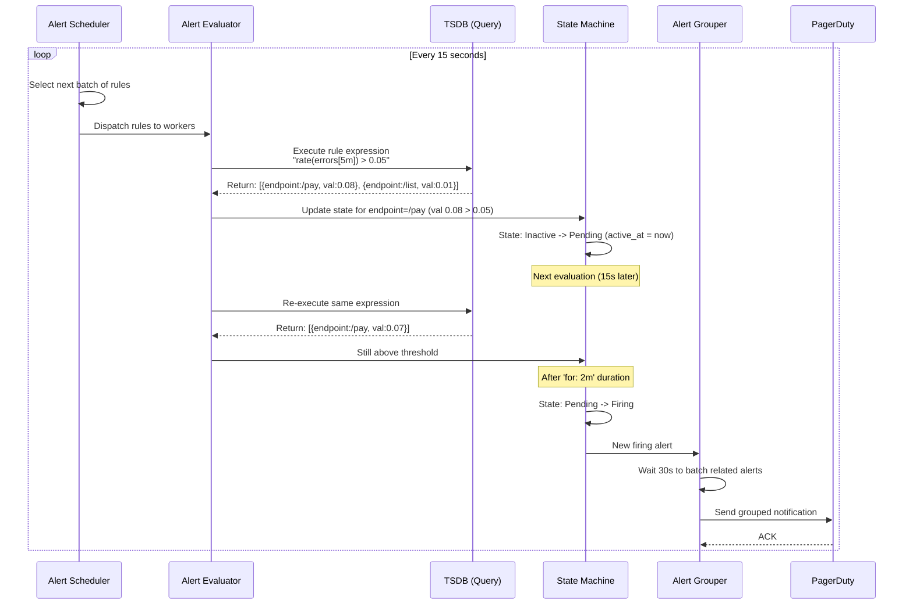

---

## 6. Pre-Aggregation & Downsampling Pipeline

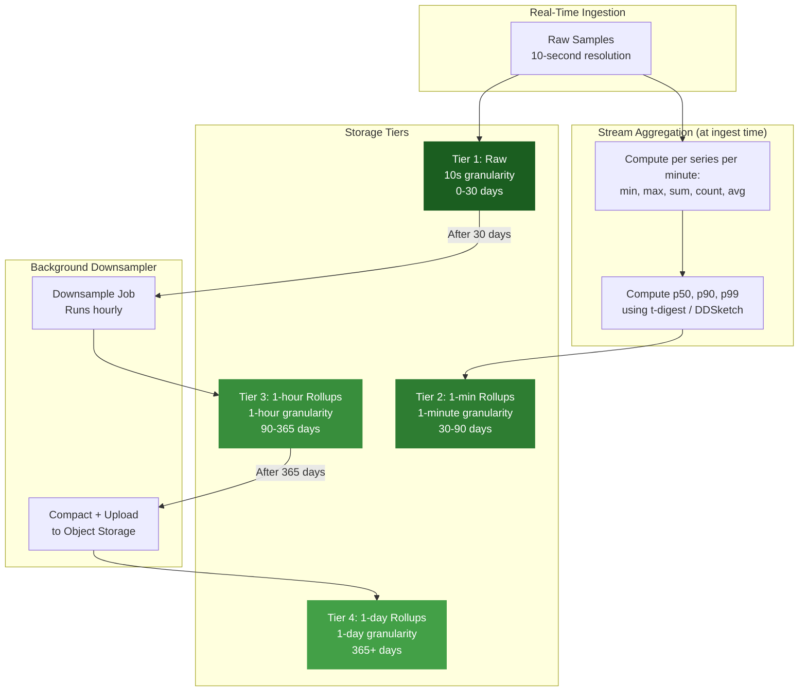

**Downsampling strategy:**

```
Each rollup stores multiple aggregates per window:

1-minute rollup of 10-second raw data:
  For each series, for each 1-minute window:
    - min(values)    # lowest value in the window
    - max(values)    # highest value in the window
    - sum(values)    # sum for computing averages
    - count(values)  # count for computing averages
    - avg(values)    # pre-computed average

  Why store all five?
    - avg alone loses information (can't compute max over downsampled data)
    - Storing min/max/sum/count allows any aggregation function to be
      computed correctly over the downsampled data

  Example:
    Raw (10s): [72.1, 73.5, 71.8, 74.2, 73.0, 72.9] (one minute)
    1-min rollup: {min: 71.8, max: 74.2, sum: 437.5, count: 6, avg: 72.9}

When a dashboard queries "max CPU over last 7 days":
  - Uses 1-minute rollups (not raw data)
  - Takes max of each rollup's max field
  - Result is mathematically identical to computing max over raw data
```

---

## 7. Distributed Topology

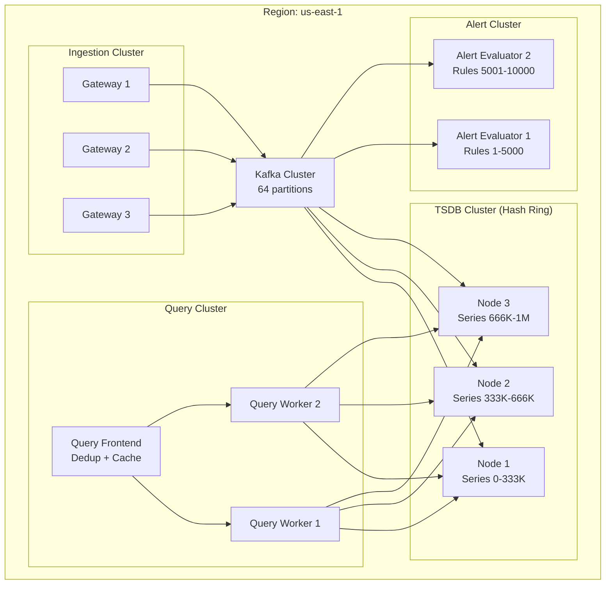

**Series distribution via consistent hashing:**

```
- Each TSDB node owns a range of the hash ring
- Series are assigned to nodes based on hash(series_id) % ring
- Replication: each series is written to 3 consecutive nodes on the ring
- On node failure: queries fan out to replicas, rebalancing redistributes ownership
- Adding a node: only a fraction of series migrate (consistent hashing property)
```

---

## 8. Technology Choices Summary

| Component | Technology Options | Our Choice | Rationale |
|-----------|-------------------|------------|-----------|
| Collection Agent | Telegraf, Prometheus node_exporter, Datadog Agent | Custom agent (Go) | Flexibility, both push+pull |
| Message Queue | Kafka, Pulsar, NATS | Kafka | Proven at scale, replay support |
| TSDB | Prometheus TSDB, InfluxDB, VictoriaMetrics, Thanos | Custom (Prometheus TSDB-based) | Best compression, open-source foundation |
| Inverted Index | In-memory (Prometheus), Cassandra | In-memory with WAL | Fast lookups, fits in RAM |
| Object Storage | S3, GCS, MinIO | S3 | Cheap, durable, infinite scale |
| Query Cache | Redis, Memcached | Redis | TTL support, cluster mode |
| Alert Rules Store | PostgreSQL, etcd | PostgreSQL | ACID, complex queries |
| Dashboard Store | PostgreSQL | PostgreSQL | Same as alert rules, simplicity |
| Notification Queue | Kafka, SQS, Redis Streams | Kafka (reuse existing) | Already deployed, reliable |
| Dashboard UI | Grafana, Custom React | Grafana (embedded) | Feature-rich, open-source |
