# Deep Dive & Scaling -- Nearby Friends / Proximity Service

---

## 1. Deep Dive: Scaling Location Updates (333K/sec)

### 1.1 The Challenge

```
333,000 location updates per second.
Each update must:
  1. Write to Redis (current location)         ~0.1 ms
  2. Update H3 cell index (if cell changed)     ~0.2 ms
  3. Publish to Kafka                           ~1 ms
  4. Write to Cassandra (history)               ~2 ms
  5. Trigger proximity computation              ~5 ms

Total pipeline: ~8 ms per update
Single machine at 8ms/op: 125 updates/sec
Need: 333,000 / 125 = 2,664 machines??

NO. We parallelize and decouple.
```

### 1.2 Partitioning Strategy

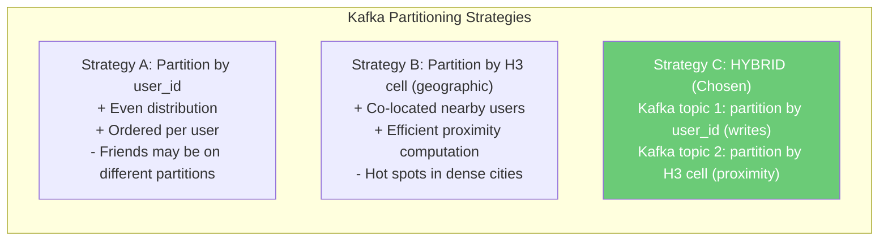

**Hybrid Partitioning (Our Choice):**

```
Topic: location_updates
  Partitions: 128
  Partition key: user_id
  Purpose: Receive raw location updates
  Consumer: Location Service instances (30 servers)
  Each instance handles: 333K / 30 = ~11K updates/sec (achievable)

Topic: proximity_events
  Partitions: 256
  Partition key: H3 cell (resolution 4 -- coarser grouping)
  Purpose: Trigger proximity computation
  Consumer: Proximity Service instances (50 servers)
  Each instance handles: 333K / 50 = ~6.7K events/sec

WHY two topics?
  - location_updates: ordered per user (prevents race conditions)
  - proximity_events: grouped geographically (efficient spatial queries)
  - Location Service reads from topic 1, writes to topic 2
```

### 1.3 Redis Cluster Sharding

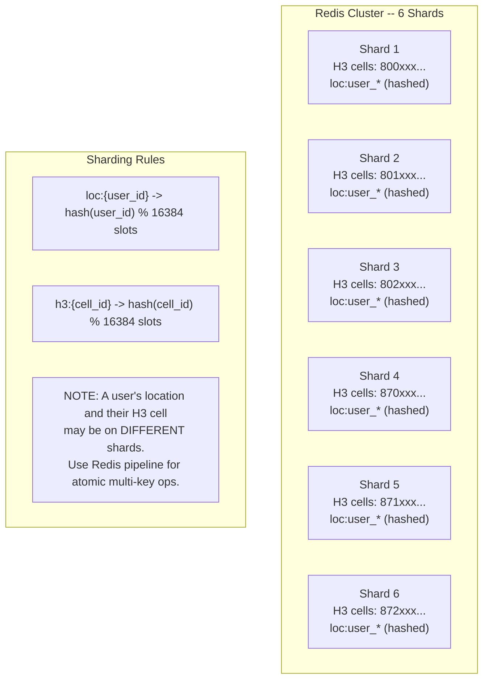

**Redis Performance Math:**

```
Single Redis instance: ~200K ops/sec
Our workload per update:
  - 1 HMSET (location update)
  - 1 EXPIRE (set TTL)
  - 0-2 SADD/SREM (H3 cell change, ~30% of updates)
  Average: ~2.6 Redis commands per update

Total Redis ops: 333K x 2.6 = ~866K ops/sec
With 6 shards: 866K / 6 = ~144K ops/sec per shard
Well within single instance capability!

For reads (proximity queries):
  Each query: ~19 SMEMBERS (k-ring cells) + ~5 HGETALL (friend locations)
  333K queries x 24 ops = 8M read ops/sec
  6 shards + read replicas: 8M / 12 = 667K per instance
  Still within range with read replicas.
```

### 1.4 Write Path Optimization

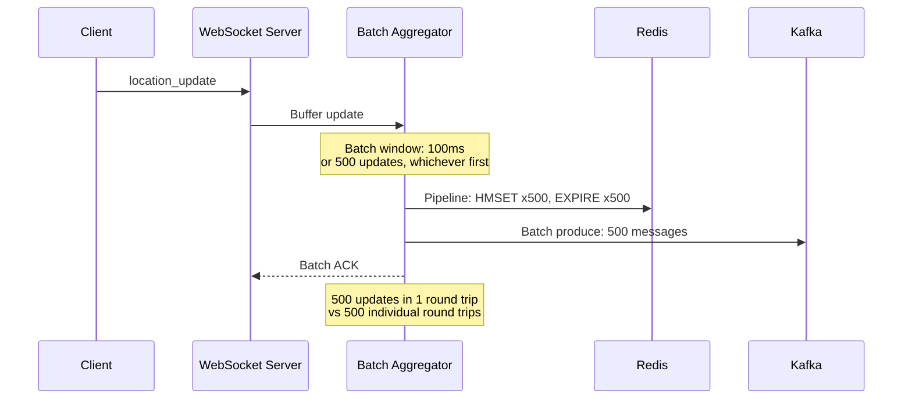

**Batching Impact:**

```
Without batching:
  333K individual Redis round trips/sec
  Network RTT: ~0.5ms each
  Total network time: 333K x 0.5ms = 166.5 seconds of network time/sec
  IMPOSSIBLE on a single connection.

With batching (500 ops per pipeline):
  666 pipeline calls/sec
  Each pipeline: ~2ms (500 ops in one round trip)
  Total: 666 x 2ms = 1.33 seconds of network time/sec
  Very achievable across 30 Location Service instances.
```

---

## 2. Deep Dive: Proximity Calculation

### 2.1 Avoiding the N-Squared Problem

```
NAIVE APPROACH (DO NOT DO THIS):
  For each of 10M active users:
    For each of their 40 active friends:
      Calculate distance(user, friend)
  = 10M x 40 = 400M distance calculations per update cycle (30 sec)
  = 13.3M calculations/sec
  Each Haversine: ~1 microsecond
  Total CPU: 13.3 seconds of CPU per second = 14 cores just for math

SMART APPROACH (WHAT WE DO):
  1. User updates location -> compute H3 cell
  2. Get k-ring cells (19 cells)
  3. Get users in those cells: ~950 users (urban)
  4. Intersect with friend list (40 friends): ~5 matches
  5. Haversine on 5 matches: 5 microseconds

  Per update: 5 distance calcs instead of 40!
  Total: 333K x 5 = 1.67M calcs/sec = 1.67 seconds CPU/sec
  = 2 cores. EASILY scalable.
```

### 2.2 The Set Intersection Trick

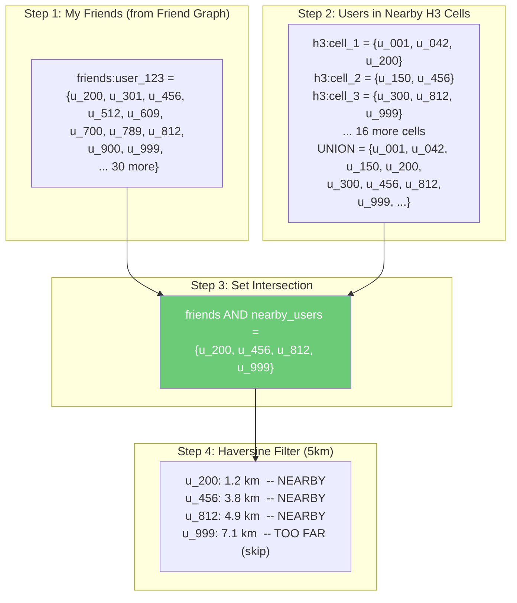

**Can we do the intersection in Redis?**

```
YES! Redis supports set operations natively:

# Option A: Server-side intersection
SINTERSTORE temp:nearby friends:user_123 h3:cell_1 h3:cell_2 ...

Problem: h3 cells and friends may be on different shards.
         SINTER does not work across shards.

# Option B: Fetch to application and intersect
friends = SMEMBERS friends:user_123          # 40 items
cell_users = SUNION h3:cell_1 h3:cell_2 ...  # 950 items
nearby_friends = friends.intersection(cell_users)  # 5 items

This works! Network cost: 2 Redis round trips.
Application-side set intersection of 40 x 950 = trivial CPU.

# Option C (Optimization): Only check friend cells
# Instead of getting ALL users in 19 cells,
# get each friend's location and check if in range.
# If user has only 40 friends, this is 40 Redis lookups
# (pipelined = 1 round trip) vs fetching 950 user IDs.

PIPELINE:
  HGETALL loc:u_200
  HGETALL loc:u_301
  HGETALL loc:u_456
  ... (40 commands)
EXECUTE  # Single round trip, get all 40 friend locations

For each friend with non-null location:
  Calculate Haversine distance
  If < 5km: mark as nearby

This is actually SIMPLER and often FASTER when friend count < cell users.
```

### 2.3 Optimization: Skip Computation When Unnecessary

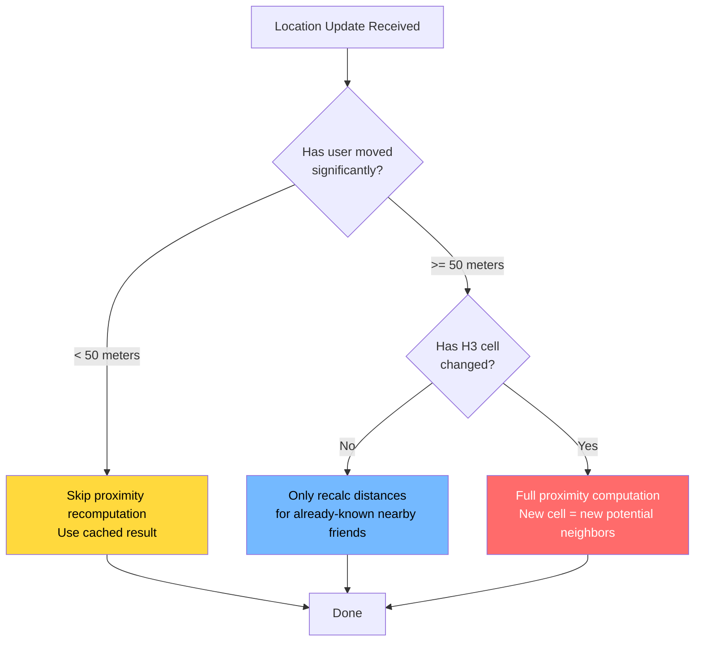

**Impact of Skipping:**

```
Average walking speed: 5 km/h = 1.4 m/s
In 30 seconds: user moves ~42 meters
50-meter threshold: ~70% of updates are "no significant movement"

Of the remaining 30%:
  H3 cell edge: ~1.22 km
  Cell change frequency: ~every 15 minutes when walking
  So only ~3% of updates trigger full recomputation

Update reduction:
  333K updates/sec -> 100K partial + 10K full
  Massive CPU savings on Proximity Service
```

---

## 3. Deep Dive: Battery Optimization

### 3.1 Adaptive Location Frequency

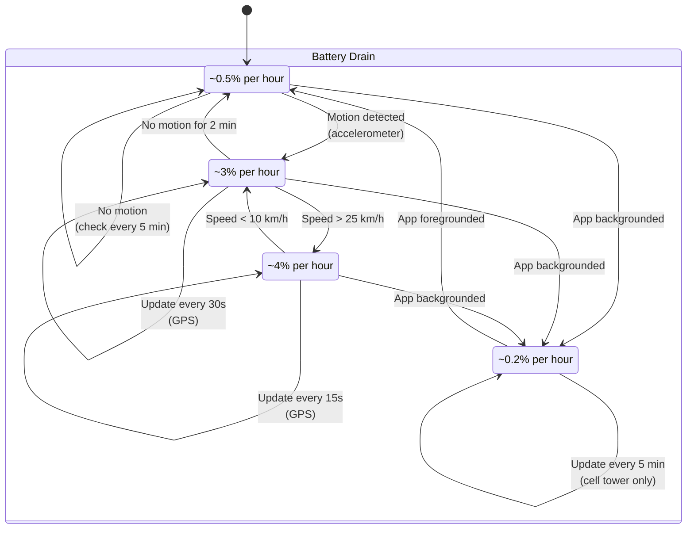

### 3.2 Location Source Selection

```
+------------------+----------+------------+------------------+
| Source           | Accuracy | Power Draw | When to Use      |
+------------------+----------+------------+------------------+
| GPS              | 3-10m    | HIGH       | Walking/driving, |
|                  |          |            | foreground       |
+------------------+----------+------------+------------------+
| WiFi             | 15-40m   | MEDIUM     | Indoor, slow     |
| fingerprinting   |          |            | movement         |
+------------------+----------+------------+------------------+
| Cell tower       | 100-300m | LOW        | Background mode, |
| triangulation    |          |            | stationary       |
+------------------+----------+------------+------------------+
| Fused (Android)  | 3-100m   | ADAPTIVE   | Default choice   |
| CLLocation (iOS) |          |            | (OS optimizes)   |
+------------------+----------+------------+------------------+
| Significant      | ~500m    | VERY LOW   | App killed,      |
| location change  |          |            | wake on move     |
+------------------+----------+------------+------------------+
```

### 3.3 Client-Side Batching

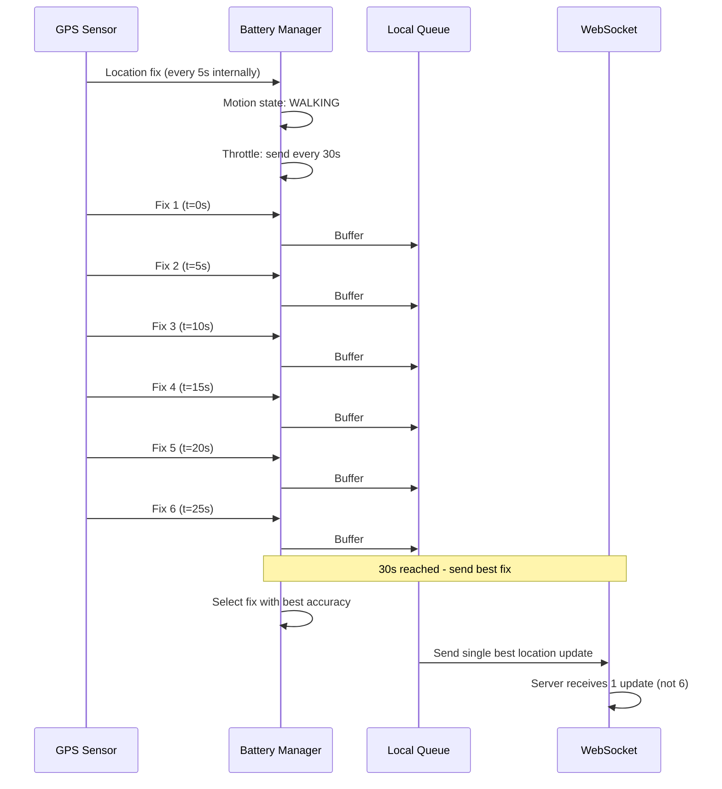

### 3.4 Server-Side Throttling

```
Server enforces maximum update rates regardless of client behavior:

Rate limits per motion state:
  STATIONARY:   max 1 update per 5 minutes
  WALKING:      max 1 update per 30 seconds
  DRIVING:      max 1 update per 15 seconds
  UNKNOWN:      max 1 update per 30 seconds (default)

How server detects motion state:
  1. Client sends speed in location payload
  2. Server compares consecutive locations:
     distance / time_delta = estimated speed
  3. Server overrides if client claims DRIVING but speed is 0

Anti-abuse: if client sends more than 10x expected rate:
  - Silently drop excess updates (don't error -- would cause retries)
  - Flag account for review
```

---

## 4. Deep Dive: Fan-Out Strategy

### 4.1 When I Move, Who Should I Notify?

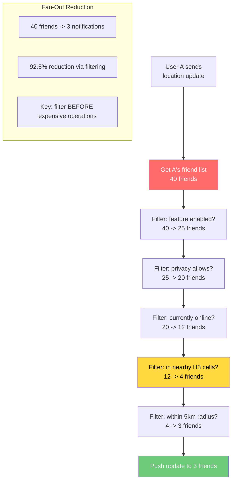

### 4.2 Bidirectional Notification

```
When User A moves near User B:
  BOTH A and B should see each other.

But we don't want to compute twice.

Solution: Process A's update once, notify B.
          B's update will independently check A.

Timeline:
  t=0:   A sends update. A discovers B is nearby. Push to both.
  t=15:  B sends update. B confirms A is still nearby. Push to both.

The 15-second asymmetry is acceptable (eventual consistency).
If B has NOT moved, B's proximity check says "A already notified,
no position change, skip re-notification."
```

### 4.3 Fan-Out Volume Analysis

```
Per user update:
  Average friends:             40
  After feature filter:        25  (62.5%)
  After privacy filter:        20  (80%)
  After online filter:         12  (60%)
  After spatial filter:        4   (33%)
  After distance filter:       3   (75%)

  Fan-out ratio: 3 notifications per update

Global:
  333K updates/sec x 3 = ~1M push notifications/sec
  (Lower than our earlier estimate of 1.67M because of optimistic
   filtering at each stage)

Push notification size: ~100 bytes
Bandwidth: 1M x 100 bytes = 100 MB/sec outbound
Across 100 WebSocket servers: 1 MB/sec each (trivial)
```

---

## 5. Deep Dive: Uber H3 in Practice

### 5.1 How Uber Uses H3

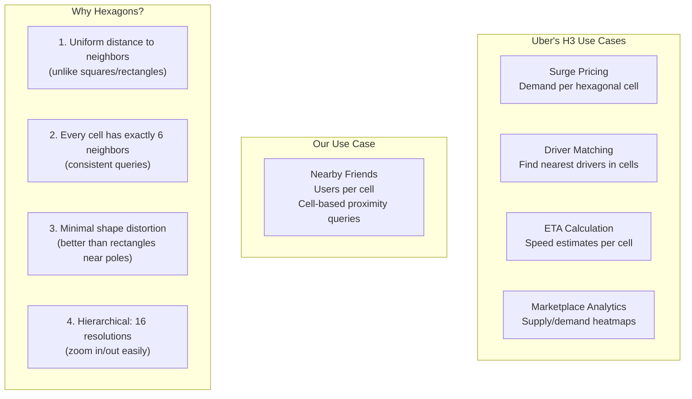

### 5.2 H3 API Usage

```python
import h3

# Convert lat/lng to H3 cell
cell = h3.latlng_to_cell(37.7749, -122.4194, 7)
# Returns: '872830828ffffff'

# Get cell center (for approximate position)
lat, lng = h3.cell_to_latlng('872830828ffffff')

# Get k-ring (center + neighbors)
cells = h3.grid_disk('872830828ffffff', 1)
# Returns 7 cells (center + 6 neighbors)

cells_k2 = h3.grid_disk('872830828ffffff', 2)
# Returns 19 cells (covers ~98 km^2)

# Check if two cells are neighbors
h3.are_neighbor_cells(cell_a, cell_b)

# Get cell resolution
h3.get_resolution('872830828ffffff')  # Returns 7

# Get parent cell (coarser resolution)
parent = h3.cell_to_parent('872830828ffffff', 5)

# Get children cells (finer resolution)
children = h3.cell_to_children('872830828ffffff', 9)
```

### 5.3 Choosing the Right H3 Resolution

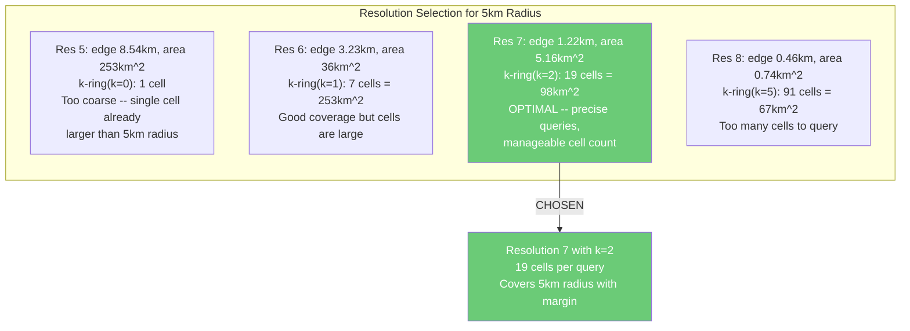

---

## 6. Deep Dive: Handling Hot Spots

### 6.1 The Concert/Stadium Problem

```
Problem: 50,000 people at a concert, all in the same H3 cell.
Normal cell has ~50 users. This cell has 1000x more.

Impact:
  - SMEMBERS h3:{cell} returns 50K items
  - Set intersection with 40 friends is still O(40) -- not bad
  - But 50K users all sending updates to same cell = write hot spot
  - Redis SADD on same key from thousands of writers

Solutions:
```

```mermaid
graph TB
    subgraph "Solution 1: Sub-Cell Partitioning"
        S1A[Dense Cell Detected<br/>Members > 1000]
        S1B[Split to Resolution 9<br/>49 sub-cells]
        S1C[Each sub-cell: ~1000 users<br/>Manageable]
        S1A --> S1B --> S1C
    end

    subgraph "Solution 2: Probabilistic Skip"
        S2A[50K users in cell]
        S2B[Each user has 40 friends<br/>Probability friend is in same cell:<br/>40/50000 = 0.08%]
        S2C[Only compute proximity for users<br/>who ACTUALLY have friends in cell<br/>Pre-filter using friend graph]
        S2A --> S2B --> S2C
    end

    subgraph "Solution 3: Write Sharding"
        S3A[Single hot key: h3:cell_X]
        S3B[Split into 8 sub-keys:<br/>h3:cell_X:0 through h3:cell_X:7]
        S3C[Add user to: h3:cell_X:{hash mod 8}]
        S3D[Read: SUNION all 8 sub-keys]
        S3A --> S3B --> S3C --> S3D
    end
```

### 6.2 Celebrity/Influencer Problem

```
Problem: A celebrity with 10M followers moves.
If we treated followers as "friends," fan-out = 10M notifications.
Even at 1% online, that is 100K pushes per update.

Why this is less of a problem for Nearby Friends:
  1. Nearby Friends uses MUTUAL friendship (not followers)
  2. Celebrities have ~1000 mutual friends, not 10M
  3. Of those, ~100 are online with feature enabled
  4. Of those, ~5 are actually within 5km

Fan-out for celebrity: still only ~5 notifications.
The friend count cap (mutual friends) is a natural protection.

If we DID support asymmetric following:
  - Pre-compute follower cells in background
  - Use "fan-out on read" instead of "fan-out on write"
  - Follower's device periodically pulls celebrity positions
```

---

## 7. Deep Dive: Privacy & Security

### 7.1 Privacy Enforcement Architecture

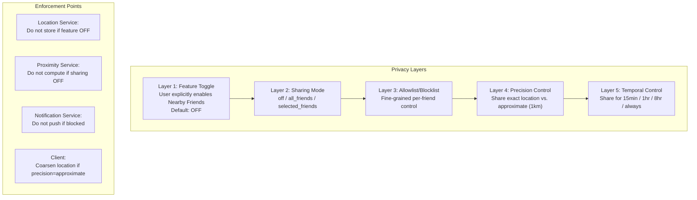

### 7.2 Location Data Protection

```
1. IN TRANSIT:
   - TLS 1.3 for all WebSocket connections
   - Certificate pinning on mobile apps
   - No location data in URL parameters (always body/payload)

2. AT REST:
   - Redis: location data in-memory (no disk persistence for locations)
   - Cassandra: encrypted at rest (AES-256)
   - PostgreSQL: column-level encryption for coordinates

3. DATA RETENTION:
   - Current location: 5-minute TTL in Redis
   - Location history: 24-hour TTL in Cassandra
   - No permanent location storage
   - User can request immediate deletion (GDPR right to erasure)

4. ACCESS CONTROL:
   - Only Proximity Service and Notification Service can read locations
   - Location Service can write but not read others' locations
   - No admin tools expose raw location data
   - Audit log for all location data access

5. ANONYMIZATION:
   - Internal analytics use aggregated, anonymized data
   - H3 cell counts, not individual positions
   - Differential privacy for published statistics
```

### 7.3 Ghost Mode Implementation

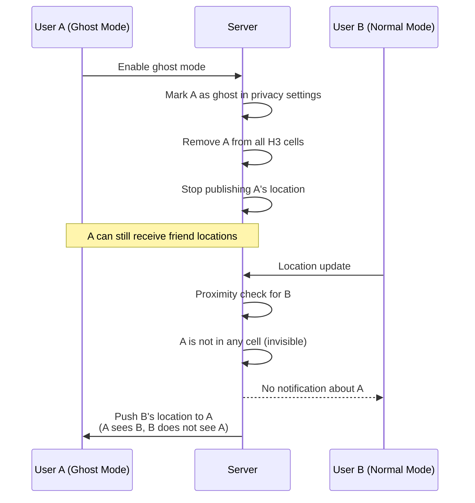

---

## 8. Monitoring & Observability

### 8.1 Key Metrics Dashboard

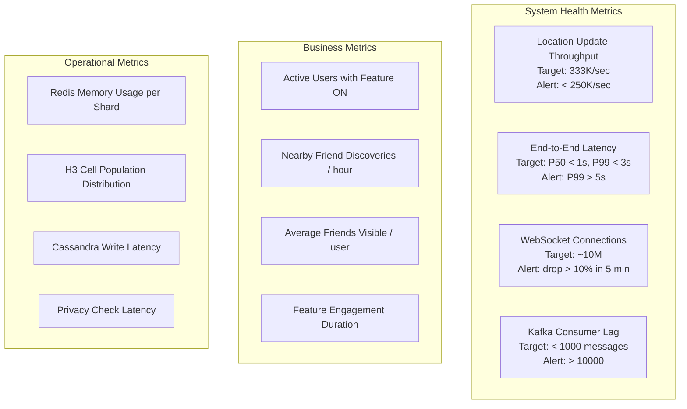

### 8.2 Alerting Rules

```
CRITICAL:
  - Location update throughput drops > 50%
  - WebSocket server loses > 20% connections in 1 minute
  - Redis shard unreachable
  - Kafka broker down

HIGH:
  - P99 end-to-end latency > 5 seconds
  - Kafka consumer lag > 50,000 messages
  - Privacy service error rate > 1%
  - Cassandra write failures > 0.1%

MEDIUM:
  - Redis memory usage > 80%
  - WebSocket server connection count approaching limit
  - Location update rate limit triggers > 1000/min
  - H3 cell with > 10,000 members (hot spot)

LOW:
  - Client-reported GPS accuracy > 500 meters
  - Reconnection rate spike (network issues)
  - Privacy setting changes > normal baseline
```

---

## 9. Comparison With Real-World Systems

### 9.1 Feature Comparison Matrix

```
+--------------------+----------+----------+----------+----------+---------+
| Feature            | Facebook | Snap Map | WhatsApp | Find My  | Our     |
|                    | Nearby   |          | Live Loc | Friends  | Design  |
+--------------------+----------+----------+----------+----------+---------+
| Real-time map      | Yes      | Yes      | Yes      | Yes      | Yes     |
| Update frequency   | ~5 min   | ~15 sec  | ~30 sec  | ~1 min   | ~30 sec |
| Always-on sharing  | Yes      | Yes      | No       | Yes      | Yes     |
| Timed sharing      | No       | No       | Yes      | No       | Yes     |
| Ghost mode         | No       | Yes      | N/A      | No       | Yes     |
| Battery impact     | Low      | Medium   | Medium   | Low      | Low     |
| Group sharing      | No       | No       | Yes      | Yes      | Yes     |
| Precision control  | City     | Exact    | Exact    | Exact    | Both    |
| Friend discovery   | Yes      | No       | No       | No       | Yes     |
| Status/Activity    | No       | Bitmoji  | No       | No       | No      |
| History/Trail      | No       | No       | Yes      | Trails   | Yes     |
| Spatial indexing    | Unknown  | Unknown  | Unknown  | Unknown  | H3      |
| Still active?      | No(2022) | Yes      | Yes      | Yes      | N/A     |
+--------------------+----------+----------+----------+----------+---------+
```

### 9.2 Architecture Comparison

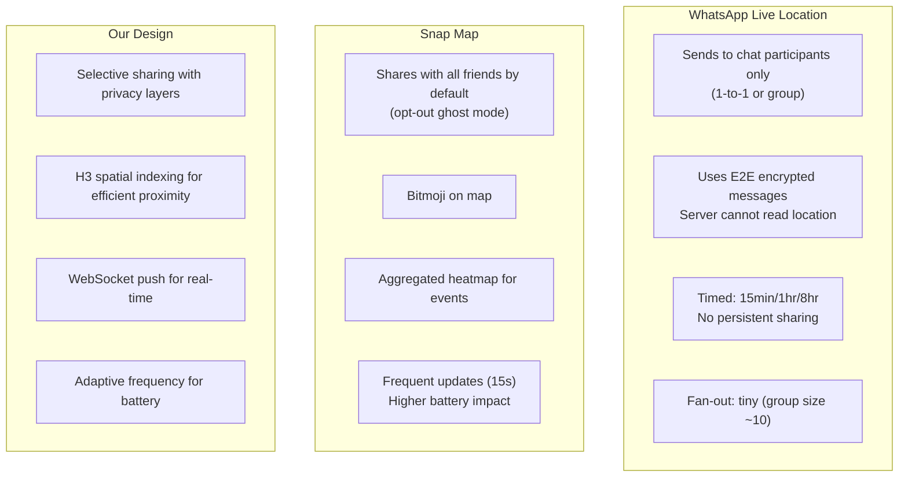

### 9.3 What We Can Learn From Each

```
FROM WHATSAPP LIVE LOCATION:
  - Timed sharing (auto-expire) is a great privacy feature
  - E2E encryption is ideal but adds complexity
  - Small group focus simplifies fan-out enormously

FROM SNAP MAP:
  - Ghost mode is essential for user comfort
  - Activity representation (Bitmoji actions) increases engagement
  - Aggregate heatmaps provide value without individual tracking

FROM FACEBOOK NEARBY FRIENDS (discontinued 2022):
  - Coarse "distance range" (0.5-1 km) insufficient for meetups
  - Low update frequency (5 min) felt stale
  - Lesson: must be real-time enough to be useful

FROM APPLE FIND MY FRIENDS:
  - OS-level integration enables best battery optimization
  - Location history trails are useful for coordinating meetups
  - Works even when app is killed (significant location changes)
```

---

## 10. Interview Tips & Common Follow-Up Questions

### 10.1 How to Structure Your Answer (40-45 minutes)

```
+----+---------------------------+----------+
| #  | Section                   | Time     |
+----+---------------------------+----------+
| 1  | Clarifying questions      | 3-4 min  |
| 2  | Functional requirements   | 2-3 min  |
| 3  | Non-functional req + est  | 5-6 min  |
| 4  | High-level architecture   | 8-10 min |
| 5  | API design                | 3-4 min  |
| 6  | Data model                | 3-4 min  |
| 7  | Deep dive #1 (spatial)    | 5-7 min  |
| 8  | Deep dive #2 (scaling)    | 5-7 min  |
| 9  | Trade-offs & wrap-up      | 3-4 min  |
+----+---------------------------+----------+
```

### 10.2 Common Follow-Up Questions & Answers

```
Q: "How would you handle users who are moving very fast (highway)?"
A: Increase update frequency to 15s, use larger k-ring (k=3).
   Their H3 cell changes rapidly, so we need to be more aggressive
   about cell index updates. Consider "predictive cell pre-loading"
   based on bearing and speed.

Q: "What if a user has 5000 friends?"
A: Cap the proximity check at top 200 closest/most-interacted friends
   (using interaction score from friend graph). Or use tiered checking:
   close friends every update, acquaintances every 5th update.

Q: "How do you handle international users crossing borders?"
A: H3 cells work globally. Region migration: when a user's GPS
   shows they've crossed a region boundary, migrate their session
   to the nearest region. Use DNS-based routing. Their location data
   moves with them.

Q: "Can you make this work without GPS (indoor)?"
A: Yes. Fall back to WiFi fingerprinting (15-40m accuracy) and
   Bluetooth beacons (2-5m accuracy in instrumented buildings).
   The spatial indexing (H3) works the same -- just with less accuracy.

Q: "How would you add 'friend suggestions' (discover people nearby)?"
A: Dangerous privacy territory. Would need explicit "discoverable" mode.
   Use coarser H3 cells (resolution 5, ~8km) and only show
   mutual-friend connections, never strangers.

Q: "What about location spoofing (fake GPS)?"
A: Detect anomalies: impossible speed (teleportation), mock location
   provider flag on Android, jailbreak detection on iOS.
   Cross-reference with cell tower and WiFi data.
   Flag but don't block -- some users have legitimate reasons.

Q: "How would you migrate from Geohash to H3?"
A: Dual-write period: compute both Geohash and H3 for each update.
   Migrate consumers one by one from Geohash to H3 queries.
   Once all consumers use H3, stop writing Geohash.
   Total migration: 2-4 weeks with feature flags.
```

### 10.3 Key Differentiators That Impress Interviewers

```
1. MENTION H3 BY NAME
   "Uber developed H3, a hexagonal hierarchical spatial index.
    I'd use it because hexagons provide uniform distance to
    all neighbors, unlike rectangles."

2. QUANTIFY THE FAN-OUT
   "Each location update triggers checking 40 friends, but
    spatial filtering reduces actual notifications to ~3."

3. EXPLAIN THE SET INTERSECTION TRICK
   "Instead of checking all friends' distances, I intersect the
    friend set with the H3 cell occupant set. This turns O(F)
    distance calculations into O(F intersection C) -- typically
    reducing 40 checks to 5."

4. DISCUSS BATTERY TRADE-OFFS
   "The real competitor isn't another app -- it's the user's
    battery. Adaptive frequency based on motion state keeps
    drain under 5% per hour."

5. PRIVACY-FIRST DESIGN
   "Privacy service fails closed. If we can't verify sharing
    permissions, we don't share. Location is PII."

6. KNOW THE NUMBERS
   "333K updates/sec, 13M proximity checks/sec, 1.67M push
    notifications/sec -- I sized for 10M concurrent users."
```

### 10.4 Architecture Decision Summary

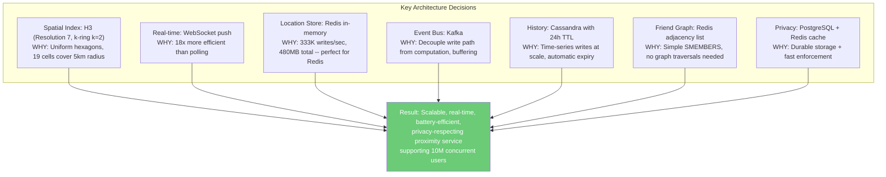

---

## 11. Quick Reference Card

```
+----------------------------------+-----------------------------------+
| Concept                          | Our Solution                      |
+----------------------------------+-----------------------------------+
| Spatial indexing                  | H3 (res 7, k-ring k=2, 19 cells) |
| Location storage                 | Redis (480 MB, 5-min TTL)         |
| Real-time communication          | WebSocket (10M connections)        |
| Event streaming                  | Kafka (333K events/sec)           |
| Location history                 | Cassandra (24h TTL)               |
| Friend graph                     | Redis adjacency list              |
| Privacy settings                 | PostgreSQL + Redis cache          |
| Proximity algorithm              | Set intersection + Haversine      |
| Battery optimization             | Adaptive frequency + motion state |
| Fan-out per update               | ~3 notifications (filtered)       |
| End-to-end latency               | P50 < 1s, P99 < 3s               |
| Update frequency                 | 30s (walking), 15s (driving)      |
| Servers per region               | ~251 (across all services)        |
+----------------------------------+-----------------------------------+
```

---

## 12. One-Page Architecture Cheat Sheet

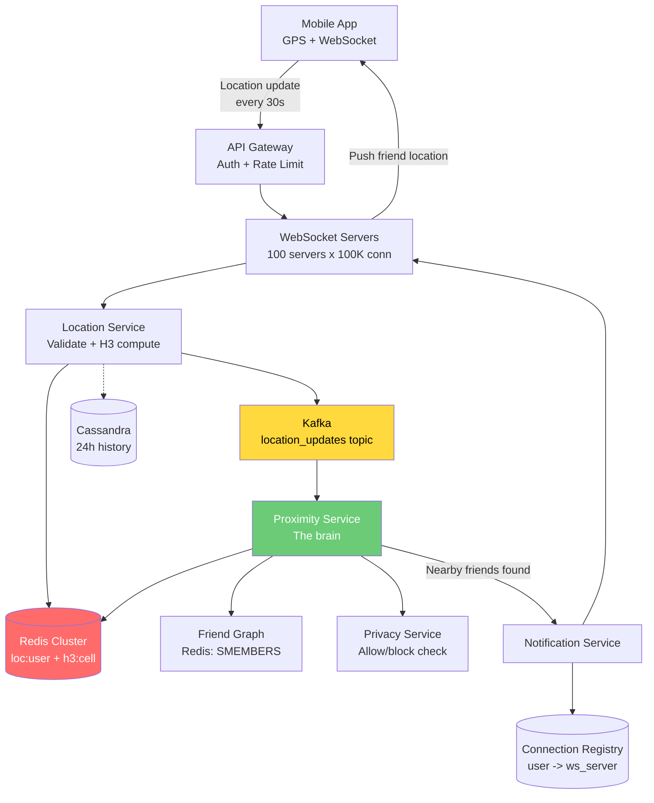

```
End-to-End Flow:
  Phone GPS -> WebSocket -> Location Service -> Redis + Kafka
  -> Proximity Service (H3 cell intersection + Haversine)
  -> Notification Service -> WebSocket -> Friend's phone

Total latency: < 3 seconds
Total throughput: 333K updates/sec, 1M push notifications/sec
```
