# High-Level Design -- Nearby Friends / Proximity Service

---

## 1. System Architecture Overview

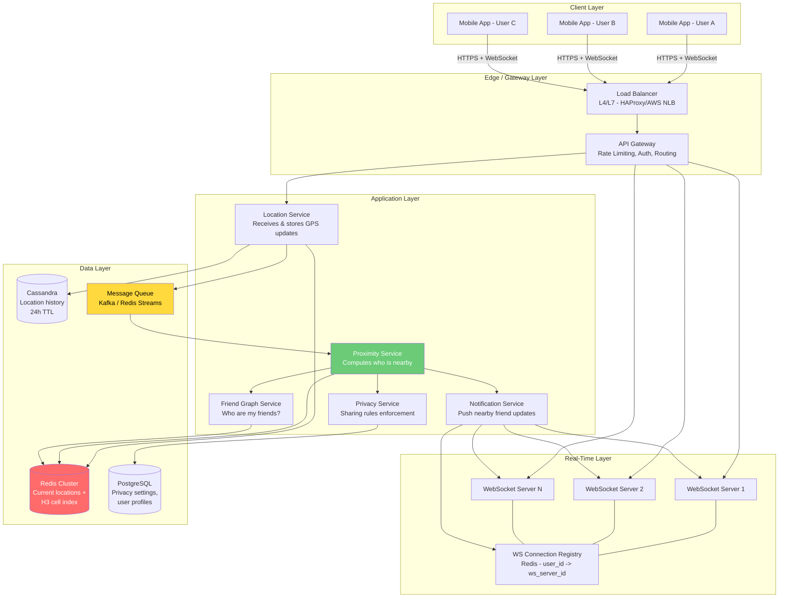

---

## 2. Component Deep Dive

### 2.1 Mobile Client

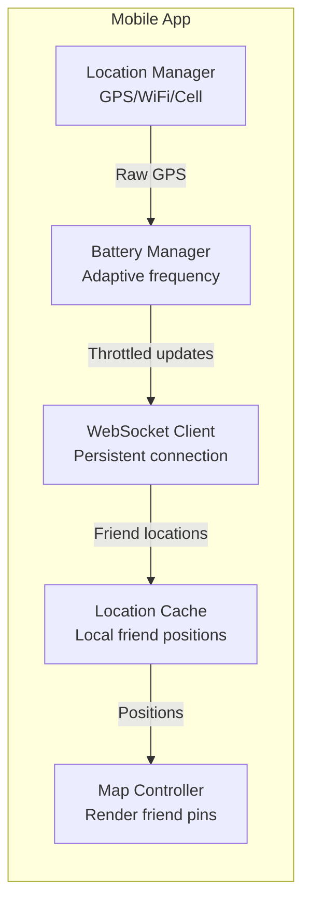

**Key Mobile Responsibilities:**

| Responsibility | Implementation |
|---------------|----------------|
| Location acquisition | Fused Location Provider (Android) / CLLocationManager (iOS) |
| Battery optimization | Adaptive frequency based on motion state |
| Connection management | WebSocket with auto-reconnect + exponential backoff |
| Local caching | Cache friend positions for smooth map rendering |
| Offline handling | Show last-known positions with "stale" indicator |

### 2.2 API Gateway

```
Responsibilities:
  1. Authentication (JWT token validation)
  2. Rate limiting (100 location updates/min per user)
  3. Request routing (REST -> services, WS -> WebSocket servers)
  4. SSL termination
  5. Request/response logging for analytics

Rate Limits:
  - Location updates:  max 2/min normal, 4/min when moving fast
  - Nearby friends GET: max 30/min (fallback endpoint)
  - Privacy settings:   max 10/min
```

### 2.3 WebSocket Service

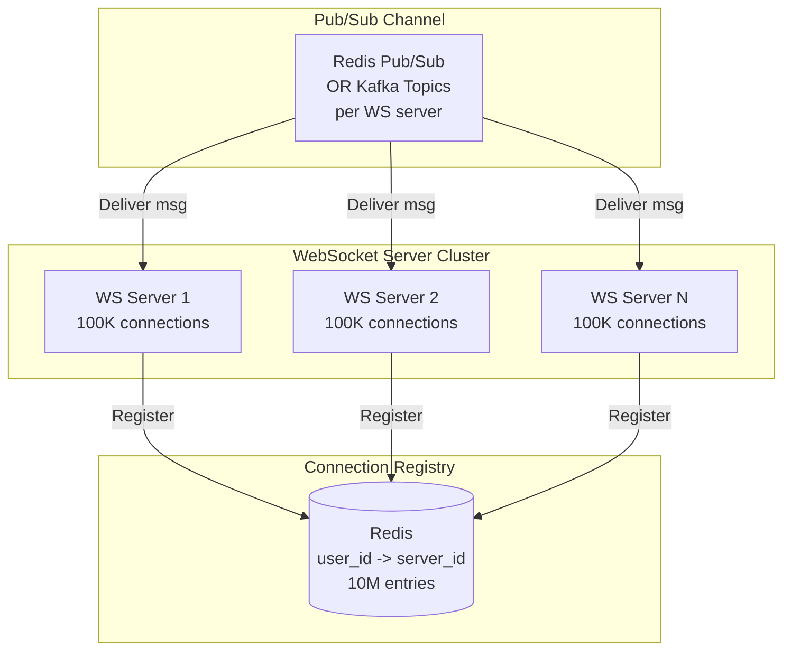

**Connection Management:**

```
When user connects:
  1. Authenticate WebSocket handshake (JWT in query param or header)
  2. Register in connection registry:
     HSET ws_connections user_123 ws_server_7
  3. Subscribe to user's personal channel:
     SUBSCRIBE user_channel:user_123
  4. Fetch and send initial nearby friends list

When user disconnects:
  1. Remove from connection registry:
     HDEL ws_connections user_123
  2. Unsubscribe from channel
  3. Keep location in Redis with TTL (5 min grace period)
  4. After TTL expires, remove from H3 cell index

When server needs to push to user_123:
  1. Look up server: HGET ws_connections user_123 -> ws_server_7
  2. Publish to that server's channel:
     PUBLISH ws_server_7:incoming {target: user_123, data: {...}}
  3. ws_server_7 finds local socket for user_123 and sends
```

**Scaling WebSocket Connections:**

```
10M concurrent connections / 100K per server = 100 WebSocket servers

Each server:
  - 100K persistent TCP connections
  - ~1 GB memory for connection state
  - ~50 Mbps outbound bandwidth
  - 4-8 CPU cores (event-driven, non-blocking I/O)

Technology choices:
  - Node.js with ws library (lightweight, event-driven)
  - Go with gorilla/websocket (efficient goroutines)
  - Java with Netty (proven at scale)
```

### 2.4 Location Service

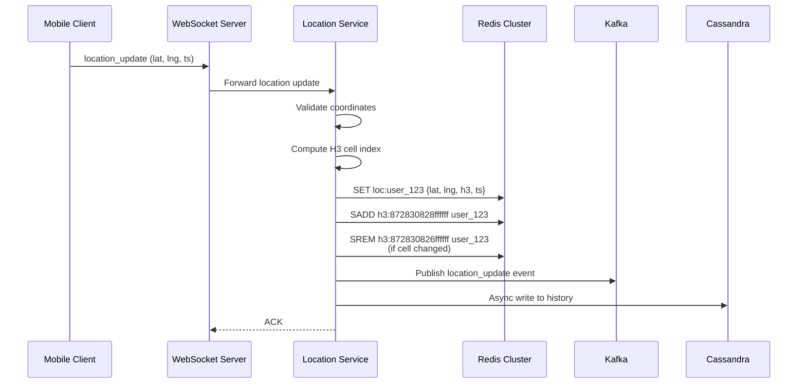

**Location Service Internals:**

```python
class LocationService:
    def handle_update(self, user_id, lat, lng, timestamp, accuracy, speed):
        # 1. Validate
        if not (-90 <= lat <= 90 and -180 <= lng <= 180):
            raise InvalidCoordinates()

        # 2. Compute H3 cell at resolution 7
        new_cell = h3.latlng_to_cell(lat, lng, 7)
        old_location = redis.hgetall(f"loc:{user_id}")
        old_cell = old_location.get("h3_cell")

        # 3. Update current location in Redis
        redis.hmset(f"loc:{user_id}", {
            "lat": lat, "lng": lng,
            "h3_cell": new_cell,
            "ts": timestamp,
            "acc": accuracy,
            "spd": speed
        })
        redis.expire(f"loc:{user_id}", 300)  # 5 min TTL

        # 4. Update H3 cell index (only if cell changed)
        if old_cell and old_cell != new_cell:
            pipeline = redis.pipeline()
            pipeline.srem(f"h3:{old_cell}", user_id)
            pipeline.sadd(f"h3:{new_cell}", user_id)
            pipeline.execute()
        elif not old_cell:
            redis.sadd(f"h3:{new_cell}", user_id)

        # 5. Publish to Kafka for proximity service
        kafka.publish("location_updates", {
            "user_id": user_id,
            "lat": lat, "lng": lng,
            "h3_cell": new_cell,
            "cell_changed": old_cell != new_cell,
            "ts": timestamp
        })

        # 6. Async write to Cassandra for history
        cassandra.async_write("location_history", {
            "user_id": user_id,
            "timestamp": timestamp,
            "lat": lat, "lng": lng,
            "h3_cell": new_cell
        })
```

### 2.5 Proximity Service (The Brain)

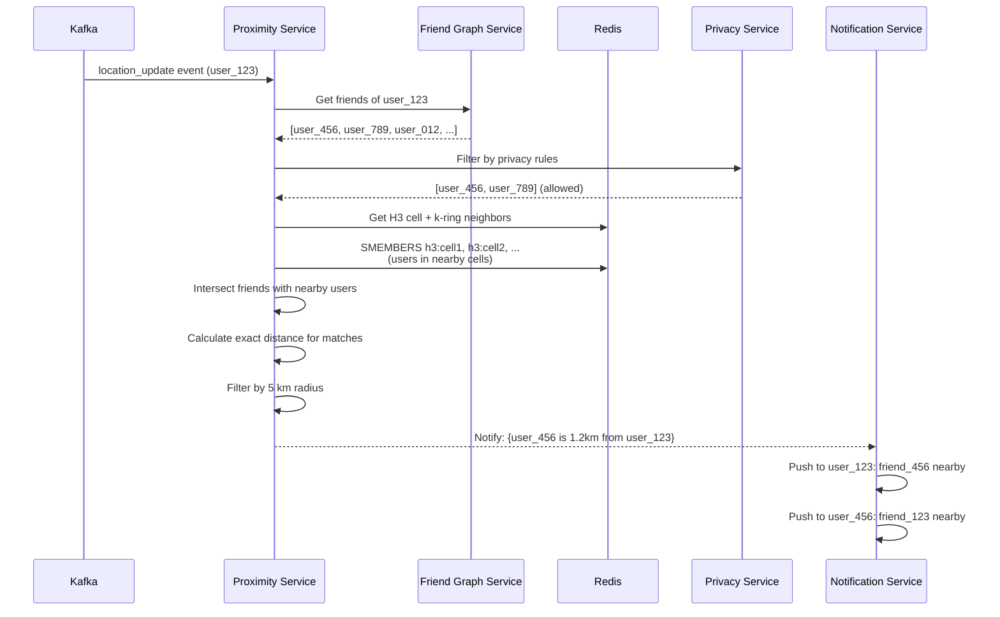

**The Proximity Algorithm:**

```python
class ProximityService:
    RADIUS_KM = 5
    H3_RESOLUTION = 7

    def process_location_update(self, event):
        user_id = event["user_id"]
        lat, lng = event["lat"], event["lng"]
        h3_cell = event["h3_cell"]

        # Step 1: Get user's friends (from Friend Graph Service)
        friend_ids = friend_graph.get_friends(user_id)
        if not friend_ids:
            return

        # Step 2: Filter by privacy (from Privacy Service)
        visible_friends = privacy_service.filter_allowed(
            viewer_ids=friend_ids,
            target_id=user_id
        )
        friends_sharing_with_me = privacy_service.filter_allowed(
            viewer_ids=[user_id],
            target_id_list=visible_friends
        )

        # Step 3: Get k-ring of H3 cells (center + neighbors)
        # k=2 gives 19 cells, covering ~98 km^2
        nearby_cells = h3.grid_disk(h3_cell, 2)

        # Step 4: Get ALL users in those cells
        pipeline = redis.pipeline()
        for cell in nearby_cells:
            pipeline.smembers(f"h3:{cell}")
        cell_members = pipeline.execute()
        users_in_area = set().union(*cell_members)

        # Step 5: Intersect friends with users in area
        # This is the KEY OPTIMIZATION -- set intersection
        nearby_friends = friends_sharing_with_me & users_in_area

        # Step 6: Calculate exact Haversine distance
        results = []
        for friend_id in nearby_friends:
            friend_loc = redis.hgetall(f"loc:{friend_id}")
            dist = haversine(lat, lng,
                           float(friend_loc["lat"]),
                           float(friend_loc["lng"]))
            if dist <= self.RADIUS_KM:
                results.append({
                    "friend_id": friend_id,
                    "distance_km": dist,
                    "lat": friend_loc["lat"],
                    "lng": friend_loc["lng"],
                    "last_updated": friend_loc["ts"]
                })

        # Step 7: Notify both parties
        for friend in results:
            notification_service.push_friend_nearby(
                to_user=user_id,
                friend=friend
            )
            notification_service.push_friend_nearby(
                to_user=friend["friend_id"],
                friend={"friend_id": user_id, "distance_km": friend["distance_km"],
                         "lat": lat, "lng": lng}
            )
```

### 2.6 Friend Graph Service

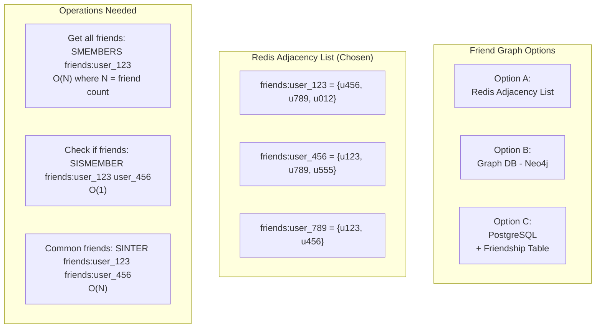

**Why Redis over Graph DB for this use case:**

```
We only need ONE operation: "Get all friends of user X"
We do NOT need: shortest path, friend-of-friend, recommendations

Redis SMEMBERS is O(N) and returns in <1ms for 400 members.
Graph DB adds unnecessary complexity for a flat adjacency lookup.

If the social app already HAS a graph DB, reuse it.
If building from scratch, Redis adjacency list is simpler and faster.
```

### 2.7 Privacy Service

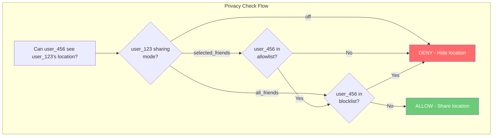

**Privacy Service Implementation:**

```
Cache privacy settings in Redis for fast lookup:

Key:   privacy:{user_id}
Value: {
  "mode": "selected_friends",
  "allowlist": ["u_456", "u_789"],
  "blocklist": ["u_999"]
}
TTL:   1 hour (refresh from PostgreSQL)

Privacy check: ~0.1ms (Redis hash lookup)
Without cache:  ~5ms (PostgreSQL query)
```

### 2.8 Notification Service

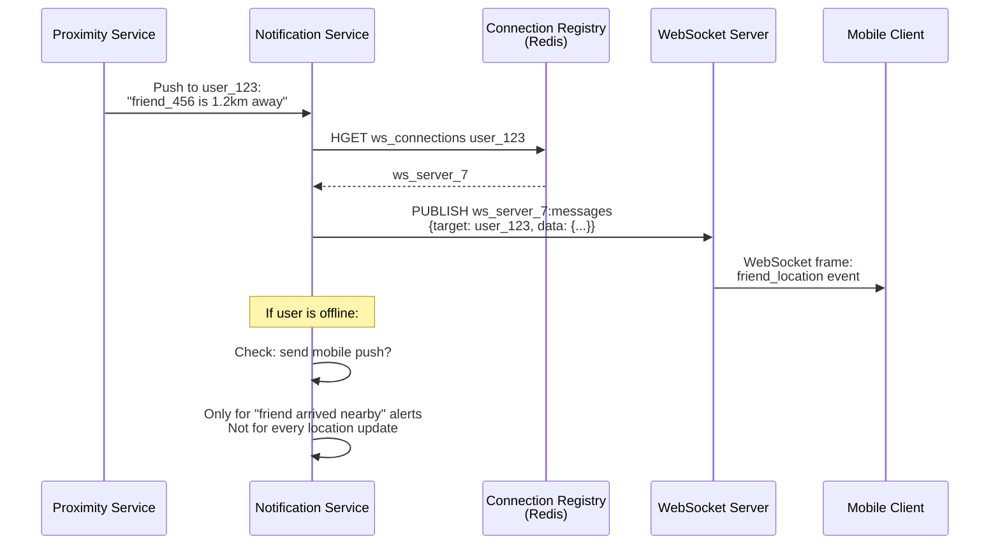

---

## 3. End-to-End Location Update Flow

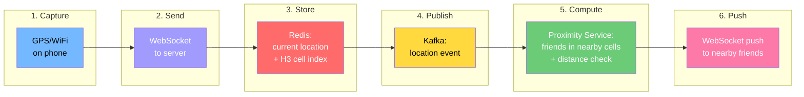

**Detailed Step-by-Step:**

```
Step 1 - CAPTURE (Mobile Client)
  The phone's location manager obtains GPS coordinates.
  Battery manager decides update frequency (see battery optimization).
  Timestamp and accuracy metadata are attached.

Step 2 - SEND (WebSocket)
  Client sends location_update message over persistent WebSocket.
  If WebSocket is disconnected, queue locally and send on reconnect.
  ~100 bytes per update.

Step 3 - STORE (Location Service + Redis)
  Location Service validates coordinates.
  Computes H3 cell at resolution 7.
  Stores in Redis: loc:{user_id} with 5-min TTL.
  Updates H3 cell index if cell changed.
  Writes to Cassandra for history (async, fire-and-forget).

Step 4 - PUBLISH (Kafka)
  Location Service publishes event to Kafka topic "location_updates".
  Kafka partitioned by user_id for ordered processing.
  Multiple Proximity Service instances consume in parallel.

Step 5 - COMPUTE (Proximity Service)
  Consumes event from Kafka.
  Fetches user's friend list from Friend Graph Service.
  Applies privacy filters via Privacy Service.
  Gets k-ring of H3 cells (19 cells for k=2).
  Gets all users in those cells from Redis.
  Intersects friends set with nearby users set.
  Computes exact Haversine distance for matches.
  Filters to within 5 km radius.

Step 6 - PUSH (Notification Service + WebSocket)
  For each nearby friend found:
    Look up their WebSocket server in connection registry.
    Publish location update to that server's channel.
    WebSocket server delivers to client.
  End-to-end latency target: < 3 seconds.
```

---

## 4. H3 Hexagonal Grid -- Visual Explanation

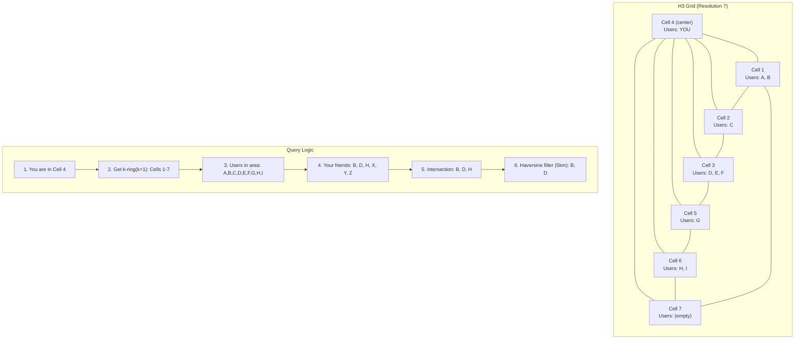

**H3 Resolution Selection:**

```
+------+----------------+------------------+---------------------------+
| Res   | Avg Edge (km) | Avg Area (km^2) | Use Case                  |
+------+----------------+------------------+---------------------------+
| 5     | 8.54          | 252.9            | Country-level grouping    |
| 6     | 3.23          | 36.13            | City-level grouping       |
| 7     | 1.22          | 5.16             | NEARBY FRIENDS (chosen)   |
| 8     | 0.46          | 0.74             | Block-level precision     |
| 9     | 0.17          | 0.11             | Building-level precision  |
+------+----------------+------------------+---------------------------+

Resolution 7 with k-ring k=2:
  - 19 cells queried
  - Total area: ~98 km^2
  - Covers 5km radius circle (78.5 km^2) with margin
  - Each cell: ~5 km^2, containing ~50 active users (in urban areas)
  - Total users to check per query: ~950
  - After friend intersection: ~5 matches (typical)
```

---

## 5. System Architecture -- Regional Deployment

```mermaid
graph TB
    subgraph "Region: US-East"
        LB1[Load Balancer]
        WS1_1[WS Server x30]
        LS1[Location Service x10]
        PS1[Proximity Service x20]
        R1[(Redis Cluster)]
        K1[Kafka Cluster]
    end

    subgraph "Region: EU-West"
        LB2[Load Balancer]
        WS2_1[WS Server x20]
        LS2[Location Service x8]
        PS2[Proximity Service x15]
        R2[(Redis Cluster)]
        K2[Kafka Cluster]
    end

    subgraph "Region: Asia-Pacific"
        LB3[Load Balancer]
        WS3_1[WS Server x25]
        LS3[Location Service x10]
        PS3[Proximity Service x18]
        R3[(Redis Cluster)]
        K3[Kafka Cluster]
    end

    subgraph "Global"
        DNS[GeoDNS / Anycast<br/>Route to nearest region]
        GDB[(Global PostgreSQL<br/>CockroachDB / Spanner<br/>Privacy settings)]
    end

    DNS --> LB1
    DNS --> LB2
    DNS --> LB3
    GDB --- R1
    GDB --- R2
    GDB --- R3
```

**Regional Strategy:**

```
Users are routed to the NEAREST region by GeoDNS.

Location data stays within the region:
  - US users' locations stored in US-East Redis
  - EU users' locations stored in EU-West Redis
  - GDPR compliance: EU location data never leaves EU

Cross-region friends:
  - Rare case: User A in US, friend B in EU
  - They are 5000+ km apart, never "nearby"
  - No need for cross-region location queries!
  - Only edge case: user traveling to different region
  - Solution: on region change, migrate user's active session
```

---

## 6. Data Flow Diagram

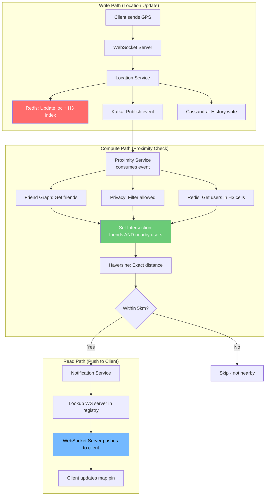

---

## 7. Failure Handling

### 7.1 WebSocket Disconnection

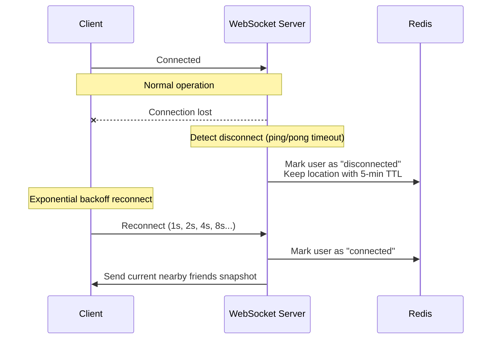

### 7.2 Service Failure Matrix

| Component Fails | Impact | Mitigation |
|-----------------|--------|------------|
| WebSocket Server | Users on that server lose real-time updates | Connection registry detects; clients auto-reconnect to healthy server |
| Location Service | Location updates queue in Kafka | Kafka retains events; service catches up on recovery |
| Proximity Service | Nearby friend computation pauses | Kafka consumer lag increases; users see stale positions |
| Redis (primary) | Location reads/writes fail | Redis Sentinel auto-failover to replica in <30 sec |
| Kafka | Location events not published | Location Service writes to Redis directly; batch retry later |
| Friend Graph Service | Cannot determine friends | Cache friend lists in Proximity Service with 1-hour TTL |
| Privacy Service | Cannot enforce privacy rules | Fail CLOSED -- deny all location sharing until service recovers |

---

## 8. Capacity Planning -- Server Counts

```
+-------------------------+-------+------------------------------------------+
| Component               | Count | Sizing Rationale                         |
+-------------------------+-------+------------------------------------------+
| WebSocket Servers       | 100   | 10M conns / 100K per server              |
| Location Service        | 30    | 333K writes/sec / ~12K per instance      |
| Proximity Service       | 50    | 333K events/sec (CPU-intensive proximity) |
| Friend Graph Service    | 10    | Read-heavy, cached, fast Redis lookups   |
| Privacy Service         | 10    | Cached settings, low compute             |
| Notification Service    | 20    | 1.67M pushes/sec                         |
| Redis Cluster (location)| 6     | 480 MB data, high throughput needs       |
| Redis Cluster (WS reg)  | 3     | 10M entries, moderate throughput         |
| Kafka Brokers           | 6     | 333K msgs/sec, 3x replication           |
| Cassandra Nodes         | 9     | 1.4 TB/day writes, 3x replication       |
| PostgreSQL (privacy)    | 3     | Primary + 2 replicas, low write volume   |
| Load Balancers          | 4     | 2 active + 2 standby (per region)        |
+-------------------------+-------+------------------------------------------+
| TOTAL per region        | ~251  |                                          |
| TOTAL (3 regions)       | ~753  |                                          |
+-------------------------+-------+------------------------------------------+
```

---

## 9. Technology Stack Summary

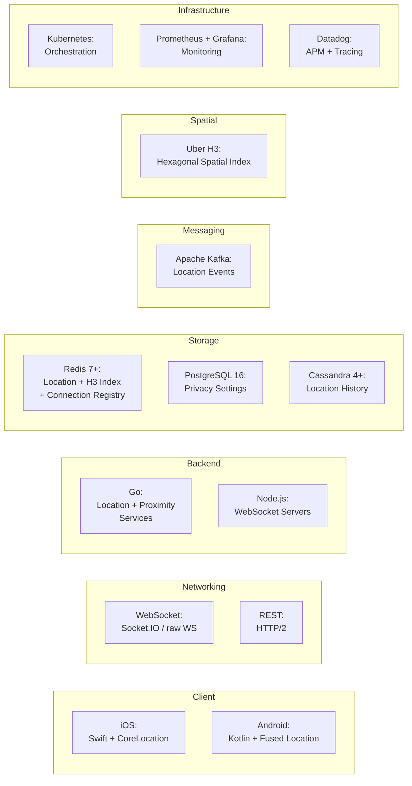

---

## 10. Interview Talking Points for HLD

```
When presenting this design, emphasize:

1. SPATIAL INDEXING is the key insight
   "We avoid O(N) friend checks by using H3 hexagonal cells.
    Only check friends in the same + neighboring cells."

2. PUSH over PULL for real-time
   "WebSocket push is 18x more bandwidth efficient than polling
    and delivers instant updates."

3. SEPARATION OF CONCERNS
   "Location write path, proximity computation, and notification
    are decoupled via Kafka. Each can scale independently."

4. PRIVACY BY DESIGN
   "Privacy service is a hard gate -- fail closed if it's down.
    Location is never shared without explicit consent."

5. BATTERY AWARENESS
   "Client-side adaptive frequency: GPS when moving, cell tower
    when slow, stop when stationary. Server-side throttling too."
```
