# Deep Dive & Scaling: Distributed Task Scheduler

## 1. Deep Dive: Exactly-Once Execution (THE Hardest Part)

This is the question every interviewer will drill into. In a distributed
system with multiple scheduler instances, how do you guarantee each
task fires exactly once?

### 1.1 The Problem

```
Scenario: 3 scheduler instances polling the same database.
Task T has next_run_time = 14:59:59 and is now due.

Without coordination:
  - Scheduler 1 reads T at 15:00:00.001 -> enqueues to Kafka
  - Scheduler 2 reads T at 15:00:00.003 -> enqueues to Kafka AGAIN
  - Scheduler 3 reads T at 15:00:00.005 -> enqueues to Kafka A THIRD TIME
  
Result: Task T executes 3 times! UNACCEPTABLE.

Three approaches to solve this:
  1. Distributed Lock (per task)
  2. Optimistic Locking (DB-level version check)
  3. Partition Assignment (each task owned by exactly one scheduler)
```

### 1.2 Approach 1: Distributed Lock (Redis/ZooKeeper)

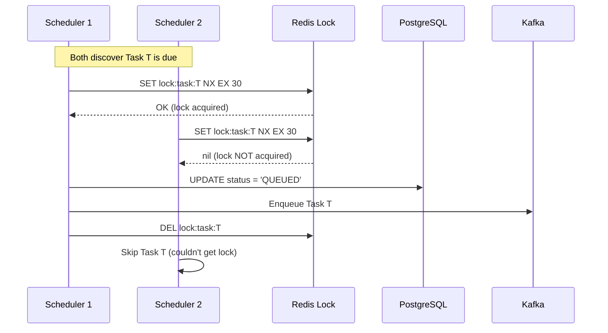

```python
class DistributedLockApproach:
    """
    Use Redis distributed lock (Redlock) to ensure only one
    scheduler can claim a task at a time.
    """
    
    def claim_task(self, task: Task) -> bool:
        lock_key = f"lock:task:{task.task_id}"
        lock_ttl = 30  # seconds
        
        # Attempt to acquire lock (NX = only if not exists)
        acquired = redis.set(lock_key, self.scheduler_id, 
                            nx=True, ex=lock_ttl)
        
        if not acquired:
            return False  # Another scheduler has the lock
        
        try:
            # Update DB and enqueue
            db.execute("""
                UPDATE tasks SET status = 'QUEUED'
                WHERE task_id = %s AND status = 'SCHEDULED'
            """, [task.task_id])
            
            kafka.produce("task-queue", task.to_message())
            return True
            
        finally:
            # Release lock using Lua script for atomic check-and-delete
            # The script verifies we still own the lock before deleting
            release_script = """
                if redis.call("get", KEYS[1]) == ARGV[1] then
                    return redis.call("del", KEYS[1])
                else
                    return 0
                end
            """
            redis.execute_script(release_script, 
                               keys=[lock_key], 
                               args=[self.scheduler_id])
```

```
Distributed Lock Analysis:

  Pros:
    + Simple to understand and implement
    + Fine-grained (per-task locking)
    + Works with any number of schedulers

  Cons:
    - Extra network hop to Redis for EVERY task
    - Redis becomes a dependency (another SPOF)
    - Lock expiry edge cases:
      * Scheduler acquires lock, then GC pause > TTL
      * Lock expires, another scheduler takes over
      * First scheduler resumes -> DOUBLE EXECUTION
    - Not truly safe without Redlock (multiple Redis nodes)
    - Performance: 50K locks/sec is significant Redis load

  Verdict: VIABLE but adds complexity and a dependency.
           Better approaches exist.
```

### 1.3 Approach 2: Optimistic Locking (DB Version Field)

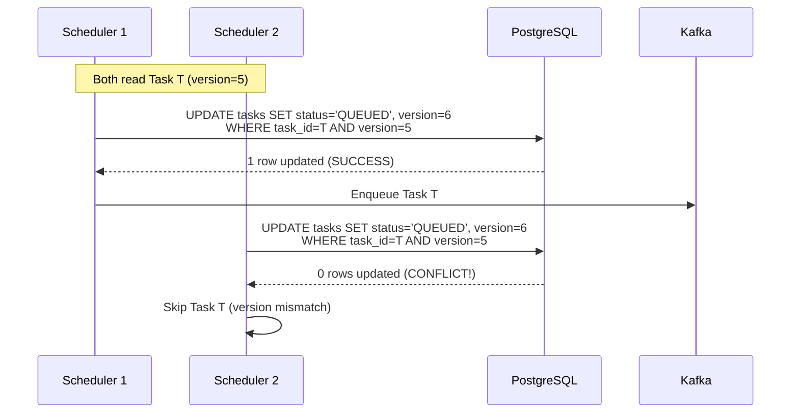

```python
class OptimisticLockApproach:
    """
    Use DB-level optimistic locking with a version field.
    The UPDATE succeeds only if the version hasn't changed since our read.
    This is an atomic compare-and-swap at the DB level.
    """
    
    def claim_task(self, task: Task) -> bool:
        # Atomic: only succeeds if version hasn't changed
        rows_updated = db.execute("""
            UPDATE tasks 
            SET status = 'QUEUED',
                version = version + 1,
                updated_at = NOW()
            WHERE task_id = %s 
              AND version = %s
              AND status = 'SCHEDULED'
        """, [task.task_id, task.version])
        
        if rows_updated == 0:
            # Another scheduler already claimed this task
            # (version was incremented by the winner)
            return False
        
        # We won the race - enqueue the task
        kafka.produce("task-queue", task.to_message())
        return True
```

```
Optimistic Lock Analysis:

  Pros:
    + No external dependency (uses existing PostgreSQL)
    + Atomic and consistent (DB ACID guarantees)
    + Simple implementation (single UPDATE statement)
    + No lock expiry edge cases
    + Very well-understood pattern

  Cons:
    - Wasted reads: all schedulers read the same tasks,
      only one wins the UPDATE race
    - DB contention: multiple schedulers UPDATE the same row
      -> row-level lock contention in PostgreSQL
    - At high scale (50K tasks/sec), the DB UPDATE hotspot
      becomes a bottleneck
    - Works best when conflicts are RARE 
      (but with multiple schedulers polling, conflicts are common)

  Verdict: GOOD for moderate scale (< 10K tasks/sec).
           Bottleneck at very high scale due to DB contention.
```

### 1.4 Approach 3: Partition Assignment (BEST APPROACH)

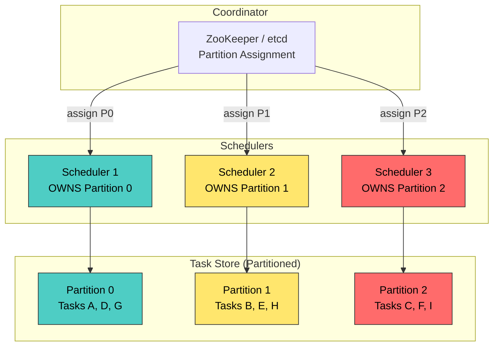

```python
class PartitionAssignmentApproach:
    """
    BEST APPROACH: Each task is assigned to exactly one partition.
    Each scheduler instance owns a disjoint set of partitions.
    
    Result: No conflicts! Each task is processed by exactly one scheduler.
    
    This is the same pattern used by:
      - Kafka consumer groups
      - DynamoDB streams
      - Uber's Cherami / Cadence
    """
    
    def __init__(self, scheduler_id: str):
        self.scheduler_id = scheduler_id
        self.assigned_partitions = []
        
        # Register with ZooKeeper for partition assignment
        self.zk_client = ZooKeeperClient()
        self.zk_client.register_scheduler(
            scheduler_id, 
            callback=self.on_partition_reassignment
        )
    
    def on_partition_reassignment(self, new_partitions: List[int]):
        """Called by ZooKeeper when partitions are reassigned."""
        old = set(self.assigned_partitions)
        new = set(new_partitions)
        
        released = old - new
        acquired = new - old
        
        logger.info(
            f"Partition reassignment: released={released}, "
            f"acquired={acquired}"
        )
        
        self.assigned_partitions = new_partitions
    
    def poll_due_tasks(self) -> List[Task]:
        """
        Query ONLY for tasks in our assigned partitions.
        No conflicts possible since partitions are disjoint.
        """
        return db.execute("""
            SELECT * FROM tasks
            WHERE partition_key = ANY(%s)
              AND next_run_time <= NOW()
              AND status = 'SCHEDULED'
            ORDER BY priority DESC, next_run_time ASC
            LIMIT 1000
        """, [self.assigned_partitions])
    
    def claim_task(self, task: Task) -> bool:
        """
        Since we OWN this partition, no other scheduler 
        will try to claim this task. Simple UPDATE is safe.
        
        We still use optimistic lock as a SAFETY NET
        (belt and suspenders) for edge cases during rebalancing.
        """
        rows_updated = db.execute("""
            UPDATE tasks 
            SET status = 'QUEUED',
                version = version + 1,
                updated_at = NOW()
            WHERE task_id = %s 
              AND version = %s
              AND status = 'SCHEDULED'
        """, [task.task_id, task.version])
        
        return rows_updated > 0
```

```
Partition Assignment Analysis:

  Pros:
    + ZERO conflicts: each partition owned by exactly one scheduler
    + No external lock dependency
    + No wasted reads (each scheduler reads only its partitions)
    + DB queries are PARTITIONED -> efficient, no full table scans
    + Linear horizontal scaling (add scheduler = more partitions/scheduler)
    + Same proven pattern as Kafka consumer groups

  Cons:
    - Requires coordination service (ZooKeeper/etcd)
    - Rebalancing during scheduler failure takes seconds
    - Brief window during rebalance where tasks may be delayed
    - Partition skew: some partitions may have more due tasks

  Mitigations:
    - Use many partitions (1024) for fine-grained balancing
    - Rebalance with "sticky" assignment to minimize movement
    - Still use optimistic lock as safety net during rebalance
    - Monitor partition lag per scheduler

  Verdict: BEST approach for production. Used by Uber, LinkedIn, Airbnb.
```

### 1.5 Comparison Table

```
+-----------------------+--------------+--------------+------------------+
| Aspect                | Distributed  | Optimistic   | Partition        |
|                       | Lock         | Lock (DB)    | Assignment       |
+-----------------------+--------------+--------------+------------------+
| Correctness           | Good*        | Excellent    | Excellent        |
| Performance           | Moderate     | Moderate     | Excellent        |
| DB Load               | Low          | HIGH         | Low (partitioned)|
| External Dependency   | Redis/ZK     | None         | ZK/etcd          |
| Conflict Rate         | Low          | HIGH         | ZERO             |
| Implementation        | Moderate     | Simple       | Complex          |
| Failure Handling      | Complex**    | Simple       | Moderate         |
| Scaling               | Good         | Limited      | Excellent        |
| Used in Production    | Many systems | Many systems | Uber, LinkedIn   |
+-----------------------+--------------+--------------+------------------+
| RECOMMENDATION        |              | Good for     | Best for high    |
|                       |              | small scale  | scale production |
+-----------------------+--------------+--------------+------------------+

* Distributed lock has edge cases with lock expiry + GC pauses
** Need to handle lock not released (process crash before unlock)

Interview Answer:
  "I'd use PARTITION ASSIGNMENT as the primary mechanism, 
   with OPTIMISTIC LOCKING as a safety net. This gives us 
   zero conflicts in the normal case, with guaranteed 
   correctness even during rebalancing."
```

---

## 2. Deep Dive: High-Throughput Task Scanning

### 2.1 The Problem: Naive Full Table Scan

```sql
-- TERRIBLE: Full table scan on 10M rows every second
SELECT * FROM tasks 
WHERE next_run_time <= NOW() 
  AND status = 'SCHEDULED'
ORDER BY priority DESC, next_run_time ASC;

-- With 10M tasks, this query takes SECONDS
-- Running it every second = DB overload
```

### 2.2 Solution: Multi-Level Optimization

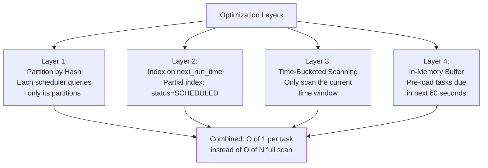

**Layer 1: Partition-Scoped Queries**

```sql
-- GOOD: Each scheduler queries only its partition range
-- With 1024 partitions and 3 schedulers:
-- Each scheduler queries ~341 partitions (~3.3M tasks)

SELECT * FROM tasks
WHERE partition_key = ANY(ARRAY[0, 1, 2, ..., 341])
  AND next_run_time <= NOW()
  AND status = 'SCHEDULED'
ORDER BY priority DESC, next_run_time ASC
LIMIT 1000;

-- With partial index, this is an INDEX SCAN, not a table scan
-- Only touches rows that are actually due
```

**Layer 2: Partial Index (Conditional Index)**

```sql
-- Only index rows where status = 'SCHEDULED'
-- This dramatically reduces index size since most tasks are
-- COMPLETED or RUNNING at any time

CREATE INDEX idx_tasks_due ON tasks (next_run_time, priority DESC)
    WHERE status = 'SCHEDULED';

-- Index size: ~5% of full table (only SCHEDULED tasks)
-- 10M tasks -> ~500K in SCHEDULED status at any time
-- Index fits easily in memory
```

**Layer 3: Time-Bucketed Scanning**

```python
class TimeBucketScanner:
    """
    Instead of scanning all tasks with next_run_time <= NOW(),
    scan only a narrow time window. This limits the result set
    and prevents scanning old overdue tasks repeatedly.
    """
    
    def __init__(self):
        self.last_scanned_time = datetime.utcnow()
    
    def scan_due_tasks(self) -> List[Task]:
        now = datetime.utcnow()
        
        # Only scan tasks due between last_scanned_time and now
        # This is a NARROW window (typically 1-5 seconds)
        tasks = db.execute("""
            SELECT * FROM tasks
            WHERE partition_key = ANY(%s)
              AND next_run_time > %s
              AND next_run_time <= %s
              AND status = 'SCHEDULED'
            ORDER BY priority DESC, next_run_time ASC
            LIMIT 1000
        """, [self.assigned_partitions, 
              self.last_scanned_time, now])
        
        self.last_scanned_time = now
        
        # Also check for overdue tasks (recovery scan, less frequent)
        if self.should_run_recovery_scan():
            overdue = self.scan_overdue_tasks()
            tasks.extend(overdue)
        
        return tasks
    
    def scan_overdue_tasks(self) -> List[Task]:
        """
        Periodic recovery scan for tasks that were missed.
        Runs every 30 seconds, catches anything still SCHEDULED
        but past due by more than 10 seconds.
        """
        return db.execute("""
            SELECT * FROM tasks
            WHERE partition_key = ANY(%s)
              AND next_run_time <= NOW() - INTERVAL '10 seconds'
              AND status = 'SCHEDULED'
            ORDER BY priority DESC
            LIMIT 500
        """, [self.assigned_partitions])
```

**Layer 4: In-Memory Time Wheel (Pre-loading)**

```python
class TimeWheel:
    """
    Pre-load tasks due in the next 60 seconds into an in-memory
    data structure. This eliminates DB polling for imminent tasks.
    
    Structure: Array of 60 buckets (one per second).
    Each bucket contains tasks due at that second.
    
    Think of it as a circular buffer representing the next minute.
    """
    
    def __init__(self, num_buckets: int = 60):
        self.num_buckets = num_buckets
        self.buckets = [[] for _ in range(num_buckets)]
        self.current_tick = 0
    
    def load_upcoming_tasks(self):
        """
        Called periodically (every 30 seconds).
        Loads tasks due in the next 60 seconds from DB.
        """
        now = datetime.utcnow()
        window_end = now + timedelta(seconds=self.num_buckets)
        
        tasks = db.execute("""
            SELECT * FROM tasks
            WHERE partition_key = ANY(%s)
              AND next_run_time > %s
              AND next_run_time <= %s
              AND status = 'SCHEDULED'
        """, [self.assigned_partitions, now, window_end])
        
        for task in tasks:
            bucket_index = int(
                (task.next_run_time - now).total_seconds()
            ) % self.num_buckets
            self.buckets[bucket_index].append(task)
    
    def tick(self) -> List[Task]:
        """
        Called every second. Returns tasks due this second.
        """
        due_tasks = self.buckets[self.current_tick]
        self.buckets[self.current_tick] = []  # clear bucket
        self.current_tick = (self.current_tick + 1) % self.num_buckets
        return due_tasks
```

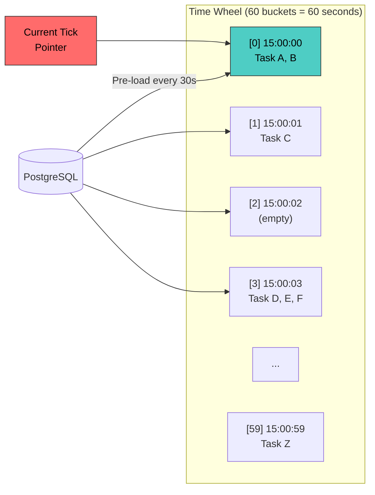

### 2.3 Combined Scanning Strategy

```
Performance Summary:
  +------------------------------------------------------+
  | Without optimization:                                |
  |   Full table scan on 10M rows every second           |
  |   Query time: 3-5 seconds (UNACCEPTABLE)             |
  |                                                      |
  | With all 4 layers:                                   |
  |   Layer 1: Query only ~3M rows (our partitions)      |
  |   Layer 2: Partial index -> scan only ~500K rows     |
  |   Layer 3: Time bucket -> scan only ~1K rows         |
  |   Layer 4: Time wheel -> 0 DB queries for most ticks |
  |   Query time: < 5ms (EXCELLENT)                      |
  +------------------------------------------------------+
```

---

## 3. Deep Dive: Airflow vs Celery vs Temporal

### 3.1 Feature Comparison

```
+-------------------+--------------+--------------+---------------+--------------+
| Feature           | Airflow      | Celery       | Temporal      | Our Design   |
|                   |              | + Beat       | (ex-Cadence)  |              |
+-------------------+--------------+--------------+---------------+--------------+
| Task Type         | DAG-based    | Individual   | Workflow +    | All types    |
|                   | workflows    | tasks        | Activities    |              |
|                   |              |              |               |              |
| Cron Scheduling   | Yes (built   | Celery Beat  | Yes (cron     | Yes          |
|                   | into DAG)    | (single      | schedule on   |              |
|                   |              | instance!)   | workflow)     |              |
|                   |              |              |               |              |
| Exactly-Once      | No* (at-     | No (at-least | Yes (built    | Yes          |
|                   | least-once)  | -once)       | into core)    | (partition+  |
|                   |              |              |               | optimistic)  |
|                   |              |              |               |              |
| Priority          | Pool-based   | Queue-based  | Task queue    | Topic-based  |
|                   | priority     | priority     | priority      | priority     |
|                   |              |              |               |              |
| Retry             | Yes (per     | Yes (per     | Yes (per      | Yes (exp.    |
|                   | task config) | task config) | activity)     | backoff)     |
|                   |              |              |               |              |
| DAG/Dependencies  | Core feature | Canvas       | Workflow DSL  | DAG engine   |
|                   | (first-class)| (chains,     | (Go/Java/     | (topological |
|                   |              | groups)      | Python SDK)   | sort)        |
|                   |              |              |               |              |
| Task Store        | PostgreSQL/  | Redis/       | Cassandra/    | PostgreSQL   |
|                   | MySQL        | RabbitMQ     | PostgreSQL    |              |
|                   |              |              |               |              |
| Scalability       | Limited      | Good (many   | Excellent     | Excellent    |
|                   | (scheduler   | workers, but | (built for    | (partitioned |
|                   | is SPOF)     | Beat is SPOF)| Uber scale)   | scheduler)   |
|                   |              |              |               |              |
| Fault Tolerance   | Moderate     | Moderate     | Excellent     | Excellent    |
|                   | (HA with     | (worker HA,  | (multi-cluster| (partition   |
|                   | CeleryExec.) | Beat SPOF)   | replication)  | rebalance)   |
|                   |              |              |               |              |
| Language          | Python       | Python       | Go, Java,     | Language-    |
|                   |              |              | Python, PHP,  | agnostic     |
|                   |              |              | TypeScript    | (HTTP API)   |
|                   |              |              |               |              |
| Best For          | Data pipe-   | Background   | Long-running  | General-     |
|                   | lines, ETL   | task queues  | workflows,    | purpose task |
|                   |              |              | microservices | scheduling   |
+-------------------+--------------+--------------+---------------+--------------+

* Airflow has "catchup" that can re-run missed tasks but doesn't
  guarantee exactly-once within a single run.
```

### 3.2 Airflow Architecture & Limitations

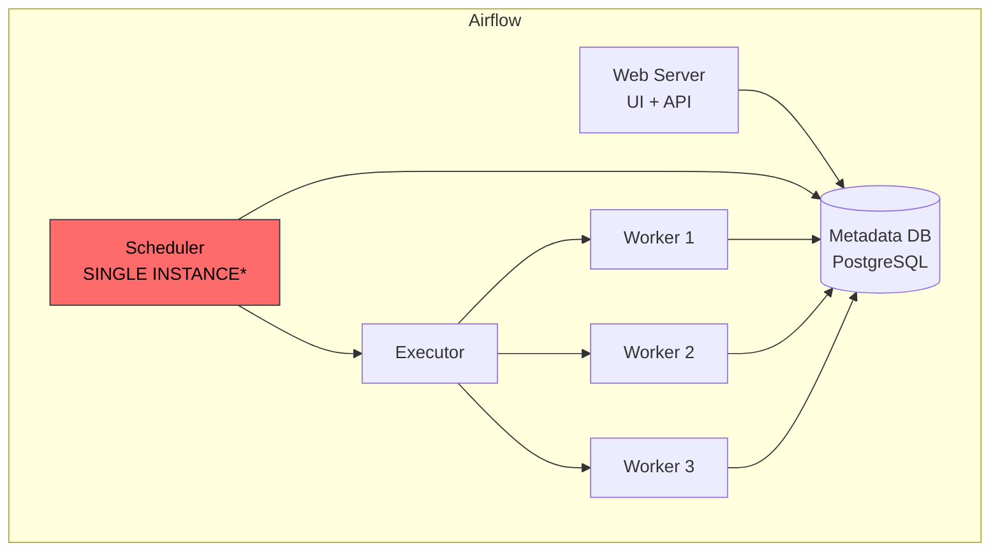

```
Airflow Limitations at Scale:

  1. SCHEDULER BOTTLENECK
     - Single scheduler instance (even with HA, only one active)
     - Parses all DAG files every heartbeat interval
     - Creates DagRuns and TaskInstances sequentially
     - At 10K+ DAGs: scheduler lag becomes significant

  2. NO TRUE EXACTLY-ONCE
     - Tasks can be re-run manually or via "catchup"
     - No built-in deduplication mechanism
     - Relies on idempotent tasks (put burden on developer)

  3. DAG PARSING OVERHEAD
     - Python files parsed on every scheduler heartbeat
     - Complex DAGs with many tasks slow down parsing
     - DAG serialization helps but adds complexity

  4. NOT DESIGNED FOR HIGH-FREQUENCY
     - Minimum schedule interval is typically 1 minute
     - Not suitable for second-level scheduling
     - Better suited for hourly/daily batch jobs

  When to use Airflow:
    - Data pipelines and ETL workflows
    - DAGs with complex dependencies
    - Batch processing (not real-time)
    - When you need rich DAG visualization
```

### 3.3 Celery Beat Architecture & Limitations

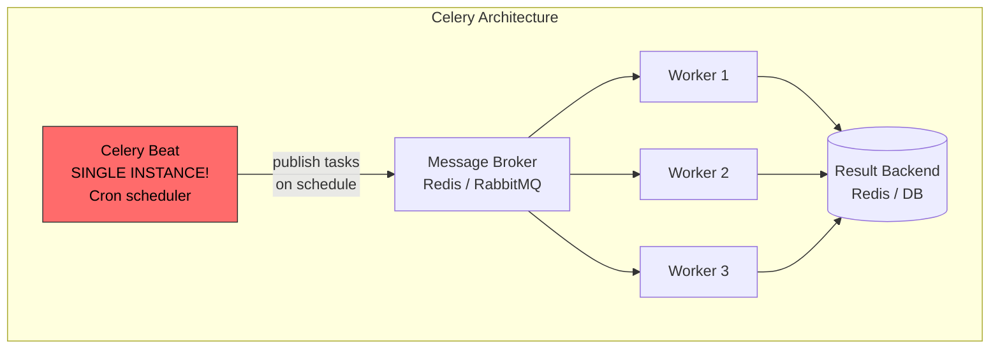

```
Celery Beat Limitations:

  1. SINGLE POINT OF FAILURE
     - Celery Beat runs as a SINGLE process
     - If it crashes, NO cron tasks fire until restart
     - No built-in HA for Beat (must use external watchdog)
     - django-celery-beat stores schedule in DB but still single

  2. NO PERSISTENCE OF SCHEDULE STATE
     - Beat keeps schedule in memory
     - Restart = recalculate all next_run_times
     - Can miss tasks during restart window

  3. SCALING CEILING
     - Single Beat process limits throughput
     - Cannot partition schedule across multiple Beat instances
     - Worker pool scales, but scheduler does not

  When to use Celery + Beat:
    - Small to medium Django/Flask applications
    - < 10K scheduled tasks
    - When simplicity is more important than guarantees
    - Existing Python ecosystem
```

### 3.4 Temporal (Uber Cadence Evolution)

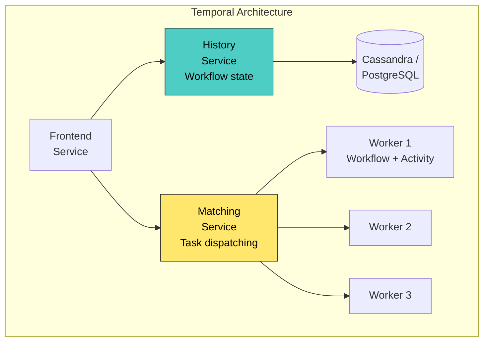

```
Temporal's Key Innovation: EVENT SOURCING for workflows

  Instead of storing "current state", Temporal stores the 
  complete event history of every workflow execution:

  Event 1: WorkflowStarted
  Event 2: TimerStarted (wait 1 hour)
  Event 3: TimerFired
  Event 4: ActivityScheduled ("send-email")
  Event 5: ActivityStarted (worker picked up)
  Event 6: ActivityCompleted (email sent)
  Event 7: WorkflowCompleted

  Benefits:
    - Complete audit trail
    - Can replay workflow from any point
    - Deterministic re-execution after failure
    - Exactly-once guarantee via event sourcing

  Our Design vs Temporal:
    - Temporal: General-purpose workflow engine (overkill for simple cron)
    - Our Design: Focused task scheduler (simpler, more efficient for cron)
    - Temporal: Best when you need long-running workflows with complex logic
    - Our Design: Best when you need high-throughput cron scheduling
```

### 3.5 When to Use What

```
Decision Framework:

  "I need to run a Python script every day at 3 AM"
    -> Airflow (if you have it) or simple cron

  "I need background task processing for my Django app"
    -> Celery + Beat

  "I need to orchestrate a 15-step order fulfillment workflow
   that spans multiple services and may take days"
    -> Temporal / Cadence

  "I need to schedule and execute 10M+ tasks per day with
   exactly-once guarantees and sub-second scheduling precision"
    -> Custom distributed task scheduler (this design)

  "I need all of the above"
    -> Temporal (most versatile, but highest complexity)
```

---

## 4. Uber's Cadence / Temporal Connection

```
History:
  2016: Uber builds "Cherami" (durable task queue)
  2017: Uber builds "Cadence" (workflow engine on top of Cherami)
  2019: Cadence creators leave Uber, fork it as "Temporal"
  2020: Temporal raises $18.75M Series A
  2023: Temporal raises $280M at $1.5B valuation (Sequoia led)
  2025: Temporal is the de facto standard for durable execution

Uber's Cadence Use Cases:
  - Trip lifecycle management
  - Driver onboarding workflow (multi-day, multi-step)
  - Payment processing with retries
  - Fraud detection pipeline
  - Marketplace pricing updates

Why Uber Built Cadence:
  1. Existing tools (Airflow, cron) didn't scale
  2. Needed exactly-once guarantees for payments
  3. Needed long-running workflows (driver onboarding = days)
  4. Needed cross-service orchestration
  5. Needed visibility into workflow state

When interviewer asks: "How does this relate to Cadence/Temporal?"
  Answer: "Our design shares the same core principles:
    - Partitioned task ownership (sharded history service)
    - Durable task queue (matching service)
    - Event-driven task progression
    - Exactly-once via partition assignment
    
    Temporal goes further with workflow-as-code DSL
    and full event sourcing, but our design covers
    the task scheduling subset efficiently."
```

---

## 5. Scaling Strategies

### 5.1 Scaling the Scheduler

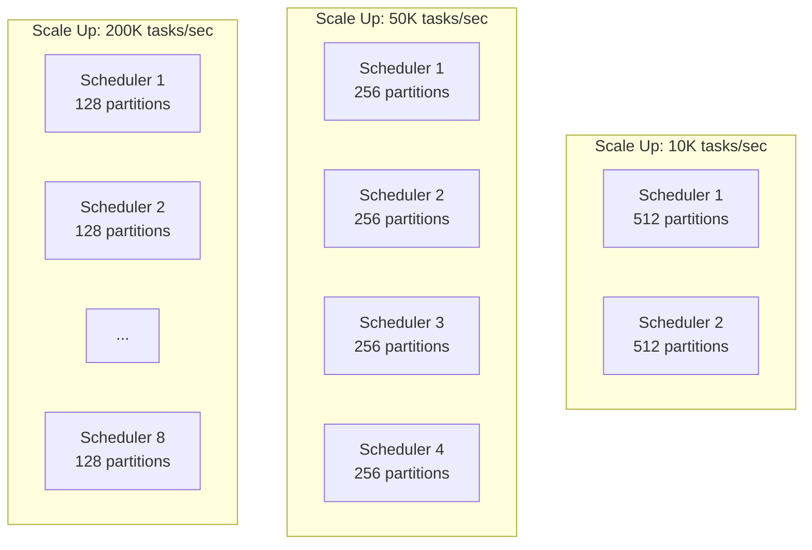

```
Scaling Playbook:

  10K tasks/sec:
    - 2 scheduler instances
    - 1 PostgreSQL primary + 2 replicas
    - 10 Kafka partitions per topic
    - 100 worker instances
    - Single Redis cluster

  50K tasks/sec:
    - 4 scheduler instances
    - PostgreSQL with read replicas + connection pooling (PgBouncer)
    - 50 Kafka partitions per topic
    - 500 worker instances
    - Redis cluster (3 primaries + 3 replicas)

  200K tasks/sec:
    - 8 scheduler instances
    - Sharded PostgreSQL (Citus) or migrate to Cassandra
    - 200 Kafka partitions per topic
    - 2000 worker instances (auto-scaled)
    - Redis cluster (6 primaries + 6 replicas)

  1M+ tasks/sec:
    - 20+ scheduler instances
    - Cassandra or DynamoDB for task store
    - Dedicated Kafka cluster
    - 5000+ worker instances
    - Consider splitting into regional deployments
```

### 5.2 Scaling the Task Store

```
PostgreSQL Scaling Path:

  Step 1: Vertical Scaling
    - Bigger instance (64 CPU, 256 GB RAM)
    - NVMe SSDs for storage
    - Tune: shared_buffers, work_mem, effective_cache_size

  Step 2: Read Replicas
    - 2-3 read replicas for status queries
    - API reads go to replicas
    - Only scheduler writes to primary

  Step 3: Connection Pooling
    - PgBouncer in front of PostgreSQL
    - 2500 workers -> 100 actual DB connections
    - Transaction-level pooling

  Step 4: Table Partitioning
    - Hash partition tasks table by partition_key
    - Range partition task_executions by time
    - Auto-drop old execution partitions

  Step 5: Sharding (Citus or application-level)
    - Shard by tenant_id or partition_key
    - Each shard: separate PostgreSQL cluster
    - Distributed queries via Citus coordinator

  Step 6: Alternative Store
    - Migrate to Cassandra for write-heavy workloads
    - DynamoDB for fully managed, auto-scaling
    - Keep PostgreSQL for DAG metadata (needs ACID)
```

### 5.3 Scaling Workers

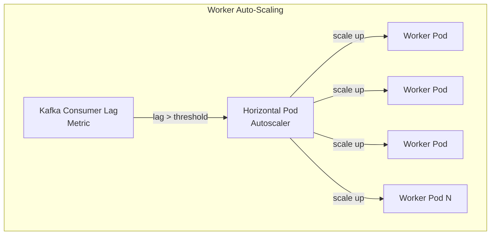

```
Worker Scaling Strategy:

  Metric: Kafka consumer group lag
    - If lag > 10K messages: scale up
    - If lag < 100 messages for 5 min: scale down

  Kubernetes HPA Configuration:
    minReplicas: 50
    maxReplicas: 5000
    scaleUpPolicy: 
      - 100% increase every 60 seconds (aggressive)
    scaleDownPolicy:
      - 10% decrease every 300 seconds (conservative)

  Worker Pool Isolation:
    - Separate pools for high/medium/low priority
    - High priority: always over-provisioned (never queue)
    - Low priority: can scale to zero during off-peak
    - Tenant isolation: dedicated pools for large tenants
```

---

## 6. Failure Scenarios & Recovery

### 6.1 Scheduler Failure

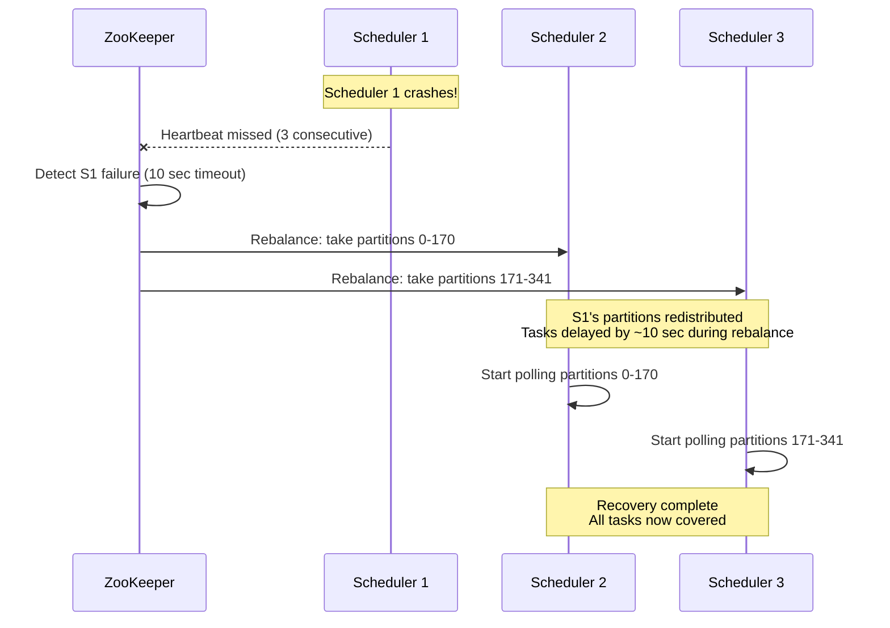

### 6.2 Worker Failure (Mid-Execution)

```
Scenario: Worker crashes while executing Task T

  1. Task T is in status = 'RUNNING' in the DB
  2. No worker is actively executing it
  3. Kafka offset was NOT committed (worker died before commit)

Recovery Mechanism:

  Option A: Kafka Redelivery
    - Kafka sees uncommitted offset
    - Re-delivers message to another worker in the consumer group
    - New worker picks up Task T
    - Checks DB: status = 'RUNNING' 
    - Resets to 'QUEUED' and re-executes

  Option B: Stuck Task Scanner (Background Job)
    - Runs every 30 seconds
    - Finds tasks with status = 'RUNNING' for > timeout_seconds
    - Assumes the worker died
    - Resets status to 'SCHEDULED' with retry_count++
    - Scheduler picks it up on next poll

  SQL for stuck task recovery:
    UPDATE tasks 
    SET status = 'SCHEDULED',
        retry_count = retry_count + 1,
        next_run_time = NOW(),
        version = version + 1
    WHERE status = 'RUNNING'
      AND updated_at < NOW() - (timeout_seconds || ' seconds')::INTERVAL;
```

### 6.3 Database Failure

```
PostgreSQL Primary Failure:

  1. Streaming replication with synchronous standby
  2. Automatic failover via Patroni/pgBouncer
  3. Failover time: 10-30 seconds
  4. During failover:
     - API returns 503 (scheduler can't write)
     - Workers buffer results in memory (retry writes)
     - Tasks are NOT lost (replicated before ack)
  5. After failover:
     - New primary takes over
     - Schedulers reconnect via PgBouncer
     - Workers flush buffered results
     - Stuck task scanner catches any running tasks
```

### 6.4 Kafka Failure

```
Kafka Broker Failure:

  1. Replication factor = 3 (data on 3 brokers)
  2. If 1 broker dies: no data loss, automatic leader election
  3. Producers retry with acks=all (wait for all replicas)
  4. Consumers rebalance across remaining brokers
  5. Recovery time: seconds (Kafka handles this internally)

Kafka Cluster Failure (unlikely):

  1. Tasks are still in PostgreSQL (source of truth)
  2. Scheduler detects Kafka unavailable
  3. Backs off and retries producing
  4. Tasks accumulate in SCHEDULED status
  5. When Kafka recovers, scheduler drains the backlog
  6. Workers may see a burst of tasks after recovery
```

---

## 7. Observability & Monitoring

### 7.1 Key Metrics

```
Scheduler Metrics:
  scheduler.poll.duration_ms         Histogram
  scheduler.tasks.discovered         Counter (per poll)
  scheduler.tasks.enqueued           Counter
  scheduler.claim.conflicts          Counter (should be ~0 with partitioning)
  scheduler.partition.count          Gauge (per instance)
  scheduler.partition.lag            Gauge (tasks overdue in partition)

Worker Metrics:
  worker.tasks.started               Counter
  worker.tasks.completed             Counter
  worker.tasks.failed                Counter
  worker.tasks.timed_out             Counter
  worker.execution.duration_ms       Histogram
  worker.retry.count                 Counter

Queue Metrics:
  kafka.consumer.lag                 Gauge (per topic, per partition)
  kafka.produce.rate                 Counter
  kafka.consume.rate                 Counter

System-Level:
  tasks.scheduled.total              Gauge (10M+)
  tasks.overdue.count                Gauge (should be ~0)
  tasks.dlq.count                    Gauge (alert if growing)
  tasks.execution.p50_ms             Histogram
  tasks.execution.p99_ms             Histogram
```

### 7.2 Alerting Rules

```
CRITICAL Alerts (Page On-Call):
  - tasks.overdue.count > 1000 for 5 minutes
    "More than 1K tasks are overdue -> scheduler may be down"
    
  - kafka.consumer.lag > 50000 for 5 minutes
    "Consumer lag exceeding 50K -> workers can't keep up"
    
  - scheduler.partition.lag > 10 seconds
    "Partition processing lag -> scheduler bottleneck"
    
  - tasks.dlq.count increased by > 100 in 1 hour
    "Spike in permanent failures -> possible upstream issue"

WARNING Alerts (Slack notification):
  - worker.tasks.failed rate > 5% for 10 minutes
  - scheduler.claim.conflicts rate > 1% (partition leak?)
  - db.replication.lag > 5 seconds
  - worker.execution.p99_ms > 30 seconds
```

---

## 8. Trade-Offs Summary

```
+----------------------------------+----------------------------------+
| We Chose                         | Alternative (and why not)        |
+----------------------------------+----------------------------------+
| PostgreSQL for task store        | Cassandra: better write scale    |
| Reason: ACID for exactly-once,   | but weaker consistency, harder   |
| rich queries, well-understood    | to do optimistic locking         |
|                                  |                                  |
| Kafka for task queue             | Redis sorted sets: lower latency |
| Reason: durability, ordering,    | but not durable, memory-bound,   |
| consumer groups, replayability   | no built-in consumer groups      |
|                                  |                                  |
| Partition assignment for         | Distributed locks: simpler but   |
| exactly-once                     | adds Redis dependency, lock      |
| Reason: zero conflicts, proven   | expiry edge cases                |
| at Uber/LinkedIn scale           |                                  |
|                                  |                                  |
| Pull-based workers               | Push-based: lower latency but    |
| Reason: natural backpressure,    | harder to manage load, no        |
| workers control their own rate   | natural backpressure             |
|                                  |                                  |
| Separate priority topics         | Single queue with priorities:    |
| Reason: priority inversion       | simpler but head-of-line         |
| prevention, independent scaling  | blocking, can't scale separately |
|                                  |                                  |
| Time wheel + DB polling          | Pure DB polling: simpler but     |
| Reason: reduces DB load by 95%,  | higher DB load, higher latency   |
| sub-second precision             | at scale                         |
|                                  |                                  |
| ZooKeeper for coordination       | etcd: lighter weight, used in K8s|
| Reason: battle-tested for        | Either works fine; etcd is a     |
| partition assignment at scale    | valid modern alternative          |
+----------------------------------+----------------------------------+
```

---

## 9. Interview Tips: How to Ace This Question

### 9.1 Structure Your Answer (40 Minutes)

```
Minutes 0-5:   Clarifying questions + requirements
Minutes 5-10:  Back-of-envelope estimation
Minutes 10-20: High-level architecture (draw the diagram)
Minutes 20-30: Deep dive into exactly-once execution
Minutes 30-35: Deep dive into high-throughput scanning
Minutes 35-40: Failure scenarios + trade-offs
```

### 9.2 Key Phrases to Use

```
"The HARDEST part of this problem is exactly-once execution
 in a distributed scheduler. Let me walk through three approaches
 and explain why partition assignment is the best."

"I'd use OPTIMISTIC LOCKING as a safety net on top of 
 partition assignment -- belt and suspenders."

"For high-throughput scanning, I'd avoid full table scans 
 by combining partition-scoped queries, partial indexes, 
 time-bucketed scanning, and an in-memory time wheel."

"This design is inspired by Uber's Cadence (now Temporal) --
 the same partition-based ownership model for exactly-once 
 guarantees at scale."

"The task queue decouples scheduling from execution, which 
 means workers can scale independently based on Kafka 
 consumer lag."
```

### 9.3 Common Follow-Up Questions

```
Q: "What if a scheduler crashes during rebalancing?"
A: "Tasks in the rebalancing partitions may be delayed by ~10 seconds.
    The optimistic lock prevents double execution. The stuck-task 
    scanner catches any tasks left in RUNNING state."

Q: "How do you handle clock skew between schedulers?"
A: "We use NTP for clock synchronization. The time wheel pre-loads 
    tasks with a small buffer (1 second ahead). Partition assignment 
    means only one scheduler checks each task, so skew between 
    schedulers doesn't cause conflicts."

Q: "What if Kafka goes down?"
A: "Kafka is replicated (3x). If the entire cluster goes down, 
    tasks accumulate in SCHEDULED state in PostgreSQL. When Kafka 
    recovers, the scheduler drains the backlog. No tasks are lost."

Q: "How do you prevent a runaway task from consuming all resources?"
A: "Three mechanisms: 
    1. Task timeout (kill after timeout_seconds)
    2. Tenant rate limiting (max concurrent tasks per tenant)
    3. Priority-based isolation (separate worker pools)"

Q: "How would you migrate from Airflow to this system?"
A: "Dual-write during migration: keep existing Airflow DAGs running 
    while replicating schedules to the new system. Shadow mode: 
    new system runs in parallel but doesn't execute, just logs what 
    it would do. Compare results. Cut over DAG by DAG."
```

### 9.4 Whiteboard Diagram (Draw This)

```
  +------------------------------------------------------------+
  |                                                            |
  |  Client                                                    |
  |    |                                                       |
  |    v                                                       |
  |  +----------+     +--------------+     +--------------+    |
  |  | Task API |---->|  Task Store  |<----|  Scheduler   |    |
  |  | (CRUD)   |     | (PostgreSQL) |     |  (Partitioned|    |
  |  +----------+     |              |     |   Polling)   |    |
  |                    |  task_id     |     +------+-------+    |
  |                    |  cron_expr   |            |            |
  |                    |  next_run    |            v            |
  |                    |  status <----+     +--------------+    |
  |                    |  version     |     |  Task Queue  |    |
  |                    |  priority    |     |  (Kafka)     |    |
  |                    +--------------+     |  High|Med|Low|    |
  |                           ^            +------+-------+    |
  |                           |                   |            |
  |                    +------+-------+           v            |
  |                    | Result Store |    +--------------+    |
  |                    | + Execution  |<---| Worker Pool  |    |
  |                    |   History    |    | (Auto-scaled)|    |
  |                    +--------------+    +--------------+    |
  |                                                            |
  |  Key Insight: Partition Assignment + Optimistic Lock       |
  |  = Exactly-Once at Scale                                   |
  +------------------------------------------------------------+
```

---

## 10. Final Checklist: Did You Cover Everything?

```
[ ] Requirements: one-time, recurring, event-triggered tasks
[ ] Exactly-once execution guarantee (3 approaches, why partition wins)
[ ] Task store schema with version field for optimistic lock
[ ] Scheduler: partition assignment via ZooKeeper
[ ] Task queue: Kafka with priority topics
[ ] Worker pool: pull-based, auto-scaled on consumer lag
[ ] Retry: exponential backoff with jitter + DLQ
[ ] DAG: topological ordering, trigger downstream on completion
[ ] Cron parsing: next_run_time calculation, timezone/DST handling
[ ] Scaling: each component's scaling strategy
[ ] Failure: scheduler crash, worker crash, DB failure, Kafka failure
[ ] Monitoring: key metrics, alerting rules
[ ] Trade-offs: why PostgreSQL > Cassandra, why Kafka > Redis
[ ] Uber's Cadence/Temporal connection

If you covered 80% of this in 40 minutes, you CRUSHED it.
```
