# High-Level Design: Distributed Task Scheduler

## 1. Architecture Overview

### 1.1 System Architecture Diagram

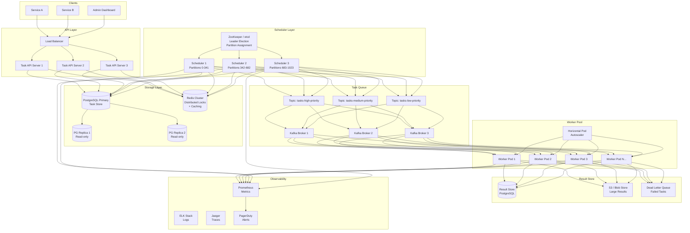

### 1.2 Simplified Data Flow

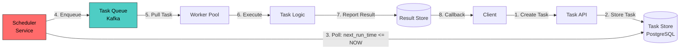

---

## 2. Component Deep Dive

### 2.1 Task API Service

The API layer is the entry point for all task management operations.

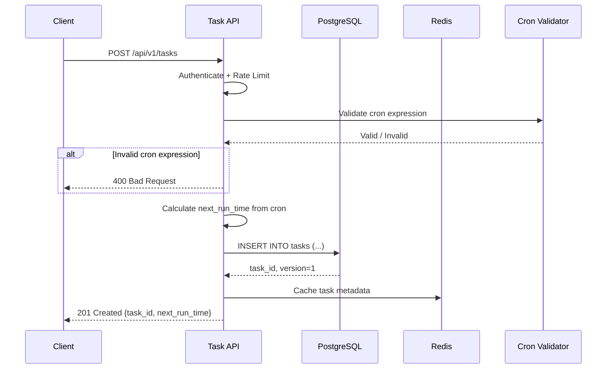

**Key Responsibilities:**

```
1. Request Validation
   - Validate cron expressions (syntax + semantics)
   - Validate payload schema
   - Check tenant quotas and rate limits
   - Validate DAG for cycles (topological sort)

2. Task CRUD Operations
   - Create: Calculate initial next_run_time, insert into DB
   - Read: Serve from cache or read replica
   - Update: Increment version (optimistic lock), recalculate next_run_time
   - Delete: Soft-delete (mark as CANCELLED)

3. Idempotency
   - Accept idempotency_key in request
   - Store in Redis with TTL (24 hours)
   - Return cached response for duplicate requests

4. Rate Limiting
   - Per-tenant rate limiting (token bucket)
   - Global rate limiting for burst protection
```

**API Server Implementation:**

```python
class TaskAPIServer:
    """
    Stateless API server behind a load balancer.
    Horizontal scaling: add more instances as request volume grows.
    """
    
    def create_task(self, request: CreateTaskRequest) -> TaskResponse:
        # 1. Validate request
        self.validate_cron(request.cron_expression)
        self.validate_payload(request.payload)
        self.check_tenant_quota(request.tenant_id)
        
        # 2. Idempotency check
        if request.idempotency_key:
            cached = redis.get(f"idempotency:{request.idempotency_key}")
            if cached:
                return cached
        
        # 3. Calculate next_run_time
        if request.schedule_type == "RECURRING":
            next_run = cron_parser.next(request.cron_expression, 
                                         timezone=request.timezone)
        elif request.schedule_type == "ONE_TIME":
            next_run = request.scheduled_time
        else:
            next_run = None  # EVENT type, no schedule
        
        # 4. Compute partition_key for scheduler assignment
        partition_key = hash(task_id) % NUM_PARTITIONS
        
        # 5. Insert into database
        task = db.insert_task(
            task_id=uuid4(),
            tenant_id=request.tenant_id,
            cron_expression=request.cron_expression,
            next_run_time=next_run,
            status="SCHEDULED",
            priority=request.priority,
            payload=request.payload,
            version=1,
            partition_key=partition_key
        )
        
        # 6. Cache for idempotency
        if request.idempotency_key:
            redis.setex(f"idempotency:{request.idempotency_key}", 
                       86400, task)
        
        return TaskResponse(task)
```

---

### 2.2 Task Store (PostgreSQL)

The task store is the source of truth for all task definitions and state.

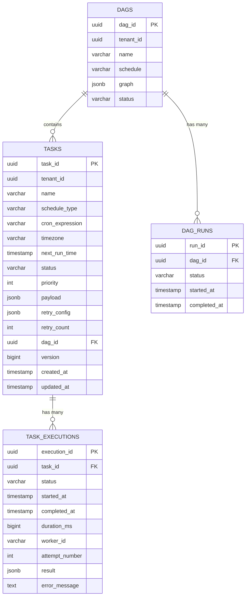

**Why PostgreSQL (not NoSQL)?**

```
Reasons to choose PostgreSQL:

1. STRONG CONSISTENCY
   - Exactly-once requires ACID transactions
   - Optimistic locking needs atomic compare-and-swap
   - DAG state transitions need transactional guarantees

2. RICH QUERIES
   - WHERE next_run_time <= NOW() AND status = 'SCHEDULED'
   - ORDER BY priority DESC, next_run_time ASC
   - Complex filters: tenant, tags, status, time ranges

3. JSONB FOR FLEXIBILITY
   - Task payloads vary by task type
   - Retry config, metadata stored as JSONB
   - Can query inside JSONB when needed

4. PARTITIONING
   - Range partition task_executions by time
   - Hash partition tasks by partition_key (for scheduler assignment)
   - Automatic partition pruning in queries

5. BATTLE-TESTED
   - Uber, Airbnb, Apple use PostgreSQL at scale
   - Well-understood operational model
   - Rich ecosystem (pg_cron, pg_partman, pgBouncer)

When to consider alternatives:
   - DynamoDB: If you need automatic sharding + 10M+ TPS
   - Cassandra: If write throughput > 500K/sec
   - At our scale (10M tasks, 50K TPS) PostgreSQL with 
     sharding handles it well
```

**Partitioning Strategy:**

```sql
-- Hash partition the tasks table for scheduler assignment
-- Each scheduler instance owns a range of partitions

CREATE TABLE tasks (
    task_id UUID,
    partition_key INT,
    -- ... other columns
) PARTITION BY HASH (partition_key);

-- Create 1024 hash partitions (allows fine-grained assignment)
-- In practice, create logical partitions mapped to schedulers

-- For task_executions: range partition by time
CREATE TABLE task_executions (
    -- ... columns
) PARTITION BY RANGE (created_at);

-- Auto-create monthly partitions
-- Drop partitions older than retention period (30 days)
```

---

### 2.3 Scheduler Service (The Brain)

The scheduler is the most critical component. It discovers tasks that
are due for execution and enqueues them to the task queue.

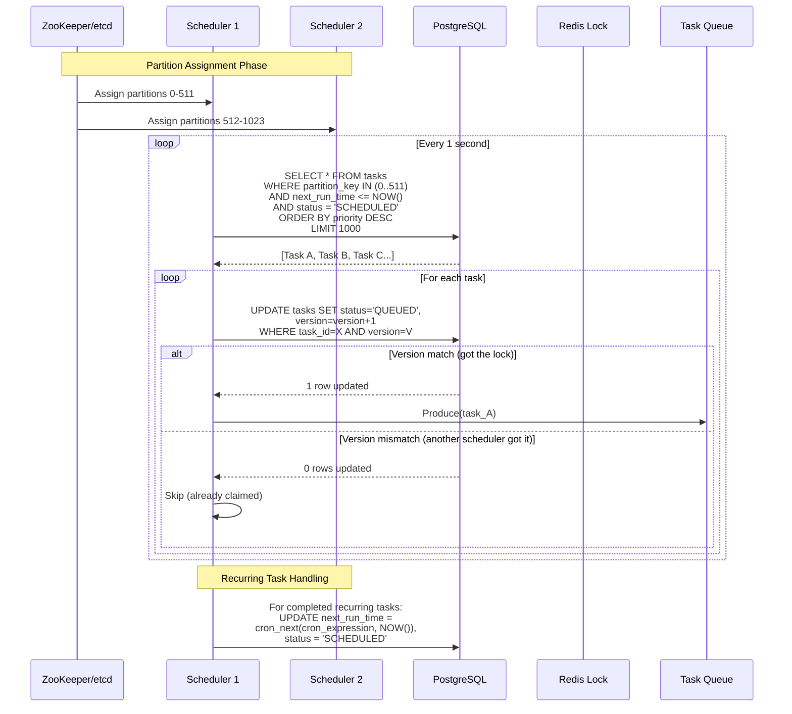

**Scheduler Core Loop:**

```python
class SchedulerService:
    """
    Each scheduler instance is responsible for a subset of task partitions.
    Partition assignment is managed by ZooKeeper/etcd.
    """
    
    def __init__(self, scheduler_id: str):
        self.scheduler_id = scheduler_id
        self.assigned_partitions = []  # set by ZK watcher
        self.running = True
    
    def run(self):
        """Main scheduler loop."""
        while self.running:
            try:
                # Step 1: Poll for due tasks in our partitions
                due_tasks = self.poll_due_tasks()
                
                # Step 2: Claim and enqueue each task
                for task in due_tasks:
                    self.process_task(task)
                
                # Step 3: Brief sleep to avoid hot-looping
                #         (adaptive: sleep less when busy)
                if len(due_tasks) == 0:
                    time.sleep(1.0)  # idle: poll every 1 sec
                else:
                    time.sleep(0.1)  # busy: poll every 100ms
                    
            except Exception as e:
                logger.error(f"Scheduler loop error: {e}")
                metrics.increment("scheduler.loop.errors")
                time.sleep(5)  # back off on error
    
    def poll_due_tasks(self) -> List[Task]:
        """
        Query for tasks that are due for execution
        in our assigned partitions.
        """
        query = """
            SELECT task_id, tenant_id, name, schedule_type,
                   cron_expression, timezone, next_run_time,
                   status, priority, payload, retry_config,
                   retry_count, version, dag_id, parent_task_ids
            FROM tasks
            WHERE partition_key = ANY(%s)
              AND next_run_time <= NOW()
              AND status = 'SCHEDULED'
            ORDER BY priority DESC, next_run_time ASC
            LIMIT 1000
        """
        return db.execute(query, [self.assigned_partitions])
    
    def process_task(self, task: Task) -> bool:
        """
        Claim a task using optimistic locking, then enqueue it.
        Returns True if we successfully claimed and enqueued.
        """
        # Step 1: Attempt to claim via optimistic lock
        rows_updated = db.execute("""
            UPDATE tasks 
            SET status = 'QUEUED',
                version = version + 1,
                updated_at = NOW()
            WHERE task_id = %s 
              AND version = %s
              AND status = 'SCHEDULED'
        """, [task.task_id, task.version])
        
        if rows_updated == 0:
            # Another scheduler already claimed this task
            metrics.increment("scheduler.claim.conflict")
            return False
        
        # Step 2: Enqueue to Kafka
        topic = self.get_priority_topic(task.priority)
        kafka_producer.produce(
            topic=topic,
            key=str(task.task_id),
            value=task.to_message(),
            headers={
                "tenant_id": task.tenant_id,
                "attempt": str(task.retry_count + 1)
            }
        )
        
        metrics.increment("scheduler.tasks.enqueued")
        return True
    
    def get_priority_topic(self, priority: int) -> str:
        """Map priority to Kafka topic for priority-based processing."""
        if priority >= 8:
            return "tasks-high-priority"
        elif priority >= 4:
            return "tasks-medium-priority"
        else:
            return "tasks-low-priority"
```

**Partition Assignment via ZooKeeper/etcd:**

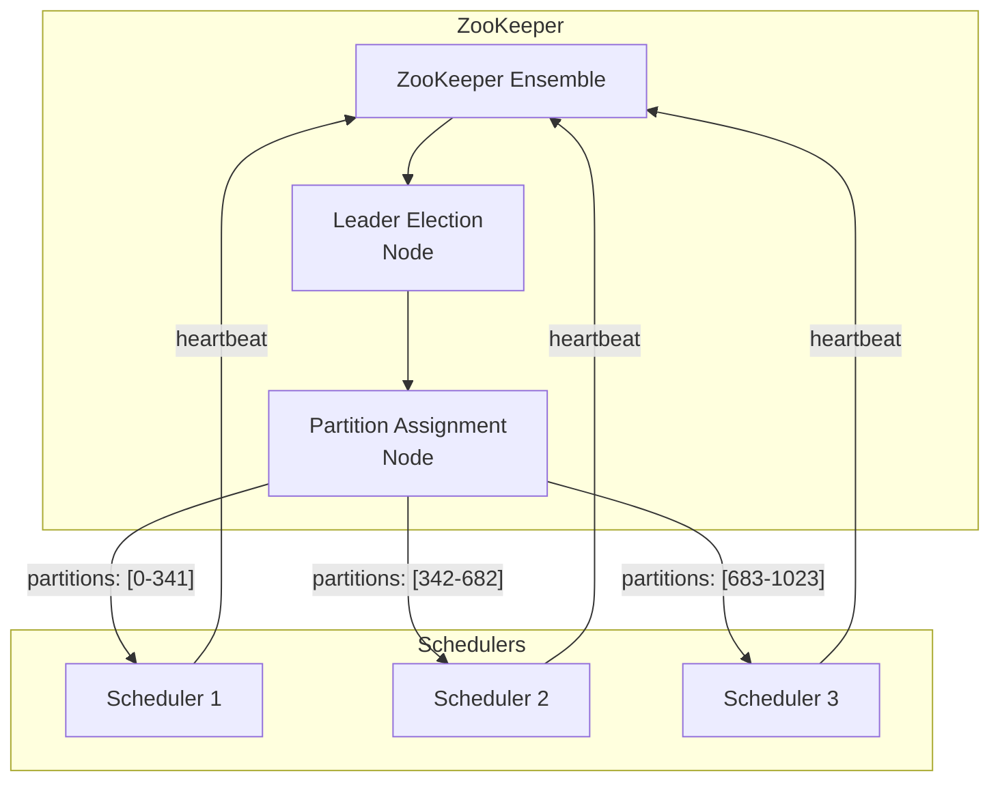

```
Partition Rebalancing:
  1. Scheduler 3 dies -> ZK detects via missed heartbeat
  2. ZK triggers rebalance
  3. Partitions 683-1023 redistributed to Scheduler 1 and 2
  4. Scheduler 1 now owns: 0-341, 683-852
  5. Scheduler 2 now owns: 342-682, 853-1023
  6. New scheduler joins -> ZK triggers rebalance again
  7. Partitions evenly redistributed across 3 schedulers

This is EXACTLY how Kafka consumer groups work!
We use the same consistent hashing / range assignment strategy.
```

---

### 2.4 Task Queue (Kafka)

The task queue decouples the scheduler from workers and provides
durability and ordering guarantees.

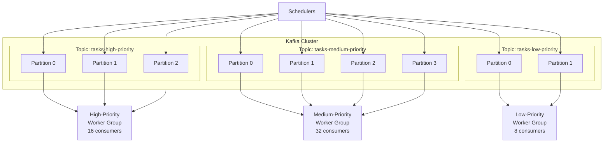

**Why Kafka (vs Redis Sorted Set)?**

```
Kafka Advantages:
  + Durable: Messages persisted to disk, replicated across brokers
  + Ordered: Per-partition ordering guarantees
  + Scalable: Add partitions for more parallelism
  + Replay: Can replay messages (useful for recovery)
  + Consumer groups: Built-in load balancing across workers
  + Backpressure: Workers consume at their own rate

Redis Sorted Set Alternative:
  + Lower latency (in-memory)
  + Built-in priority via score (priority + timestamp)
  + Simpler setup for smaller scale
  - Not durable (data loss on restart without AOF)
  - Single-threaded (throughput ceiling)
  - No built-in consumer groups (need custom implementation)
  - Memory-bound (expensive for millions of tasks)

Decision: Use Kafka for the main task queue (durability + scale)
          Use Redis for auxiliary functions (distributed locks, caching)
```

**Alternative: Redis Sorted Set for Priority Queue**

```python
class RedisPriorityQueue:
    """
    Alternative implementation using Redis sorted sets.
    Score = (priority_bucket * 10^13) + timestamp_ms
    Lower score = higher priority + earlier time = dequeued first.
    """
    
    def enqueue(self, task: Task):
        # Score: higher priority (lower number) comes first,
        # then by scheduled time
        inverted_priority = 10 - task.priority  # 10 -> 0, 1 -> 9
        score = inverted_priority * (10 ** 13) + task.next_run_time_ms
        
        redis.zadd("task_queue", {task.task_id: score})
    
    def dequeue(self, count: int = 10) -> List[str]:
        """
        Atomic pop of lowest-score items.
        Uses ZPOPMIN for atomic dequeue (Redis 5.0+).
        """
        # ZPOPMIN atomically removes and returns members 
        # with lowest scores
        results = redis.zpopmin("task_queue", count)
        return [task_id for task_id, score in results]
    
    def peek(self, count: int = 10) -> List[str]:
        """View next tasks without removing them."""
        return redis.zrange("task_queue", 0, count - 1)
    
    def size(self) -> int:
        return redis.zcard("task_queue")
```

---

### 2.5 Worker Pool

Workers pull tasks from the queue, execute them, and report results.

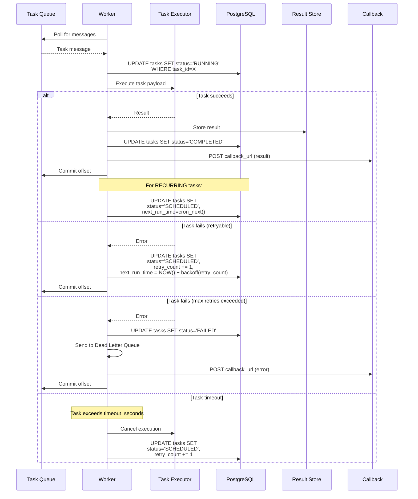

**Worker Implementation:**

```python
class TaskWorker:
    """
    Workers are stateless and horizontally scalable.
    Each worker consumes from one or more Kafka topics.
    """
    
    def __init__(self, worker_id: str, priority_topics: List[str]):
        self.worker_id = worker_id
        self.consumer = KafkaConsumer(
            topics=priority_topics,
            group_id="task-workers",
            enable_auto_commit=False,  # manual commit for exactly-once
            max_poll_records=10
        )
        self.executor = TaskExecutor()
        self.running = True
    
    def run(self):
        """Main worker loop."""
        while self.running:
            messages = self.consumer.poll(timeout_ms=1000)
            
            for message in messages:
                task = Task.from_message(message.value)
                self.process_task(task)
    
    def process_task(self, task: Task):
        """Execute a single task with timeout and error handling."""
        try:
            # Mark as RUNNING
            db.execute("""
                UPDATE tasks SET status = 'RUNNING',
                    updated_at = NOW()
                WHERE task_id = %s
            """, [task.task_id])
            
            # Execute with timeout
            result = self.executor.execute(
                task.payload,
                timeout=task.timeout_seconds
            )
            
            # Success: store result and update status
            self.handle_success(task, result)
            
        except TaskTimeoutError:
            self.handle_timeout(task)
            
        except RetryableError as e:
            self.handle_retryable_failure(task, e)
            
        except PermanentError as e:
            self.handle_permanent_failure(task, e)
            
        finally:
            # Always commit the Kafka offset
            # (task state is tracked in DB, not Kafka)
            self.consumer.commit()
    
    def handle_success(self, task: Task, result: dict):
        """Handle successful task execution."""
        # Store result
        db.execute("""
            INSERT INTO task_executions 
            (task_id, status, started_at, completed_at, 
             duration_ms, worker_id, attempt_number, result)
            VALUES (%s, 'COMPLETED', %s, NOW(), %s, %s, %s, %s)
        """, [task.task_id, task.started_at, 
              result.duration_ms, self.worker_id,
              task.retry_count + 1, json.dumps(result.data)])
        
        if task.schedule_type == "RECURRING":
            # Calculate next run time and re-schedule
            next_run = cron_parser.next(
                task.cron_expression, 
                timezone=task.timezone
            )
            db.execute("""
                UPDATE tasks 
                SET status = 'SCHEDULED',
                    next_run_time = %s,
                    retry_count = 0,
                    version = version + 1,
                    updated_at = NOW()
                WHERE task_id = %s
            """, [next_run, task.task_id])
        else:
            # One-time task: mark completed
            db.execute("""
                UPDATE tasks 
                SET status = 'COMPLETED',
                    version = version + 1,
                    updated_at = NOW()
                WHERE task_id = %s
            """, [task.task_id])
        
        # Fire webhook callback if configured
        if task.callback_url:
            self.send_callback(task.callback_url, {
                "task_id": task.task_id,
                "status": "COMPLETED",
                "result": result.data
            })
        
        # Check DAG: trigger downstream tasks
        if task.dag_id:
            self.trigger_downstream_tasks(task)
    
    def handle_retryable_failure(self, task: Task, error: Exception):
        """Handle a failure that can be retried."""
        if task.retry_count < task.max_retries:
            # Calculate exponential backoff
            delay = self.calculate_backoff(task.retry_count)
            next_retry_time = datetime.utcnow() + timedelta(seconds=delay)
            
            db.execute("""
                UPDATE tasks 
                SET status = 'SCHEDULED',
                    retry_count = retry_count + 1,
                    next_run_time = %s,
                    last_error = %s,
                    version = version + 1,
                    updated_at = NOW()
                WHERE task_id = %s
            """, [next_retry_time, str(error), task.task_id])
            
            logger.warning(
                f"Task {task.task_id} failed (attempt {task.retry_count + 1}), "
                f"retrying at {next_retry_time}: {error}"
            )
        else:
            self.handle_permanent_failure(task, error)
    
    def handle_permanent_failure(self, task: Task, error: Exception):
        """Handle a failure that exhausted all retries."""
        db.execute("""
            UPDATE tasks 
            SET status = 'FAILED',
                last_error = %s,
                version = version + 1,
                updated_at = NOW()
            WHERE task_id = %s
        """, [str(error), task.task_id])
        
        # Send to Dead Letter Queue for investigation
        kafka_producer.produce(
            topic="tasks-dead-letter",
            key=str(task.task_id),
            value=task.to_message()
        )
        
        # Alert on-call if critical task
        if task.priority >= 8:
            alerting.page(
                f"Critical task {task.task_id} ({task.name}) failed "
                f"after {task.max_retries} retries: {error}"
            )
    
    def calculate_backoff(self, retry_count: int) -> float:
        """
        Exponential backoff with jitter.
        Prevents thundering herd on retries.
        """
        base_delay = 1.0  # 1 second
        max_delay = 300.0  # 5 minutes
        
        # Exponential: 1s, 2s, 4s, 8s, 16s, 32s, 64s, 128s, 256s
        delay = min(base_delay * (2 ** retry_count), max_delay)
        
        # Add jitter: random between 0 and delay
        jitter = random.uniform(0, delay * 0.3)
        
        return delay + jitter
```

---

### 2.6 Result Store

```
Architecture:
  - PostgreSQL: Task execution metadata (status, duration, worker)
  - S3/Blob Store: Large task results (> 1 MB)
  - Redis: Recent results cache for frequent status checks

Result Lifecycle:
  1. Worker completes task
  2. Small results (<1 MB): stored in task_executions table
  3. Large results: uploaded to S3, reference stored in DB
  4. Recent results cached in Redis (TTL: 1 hour)
  5. Old results archived and eventually purged per retention policy
```

---

## 3. Task Dependencies (DAG Execution)

### 3.1 DAG Structure

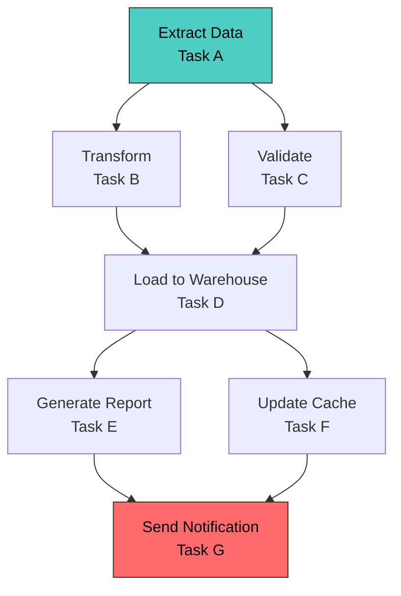

### 3.2 DAG Execution Flow

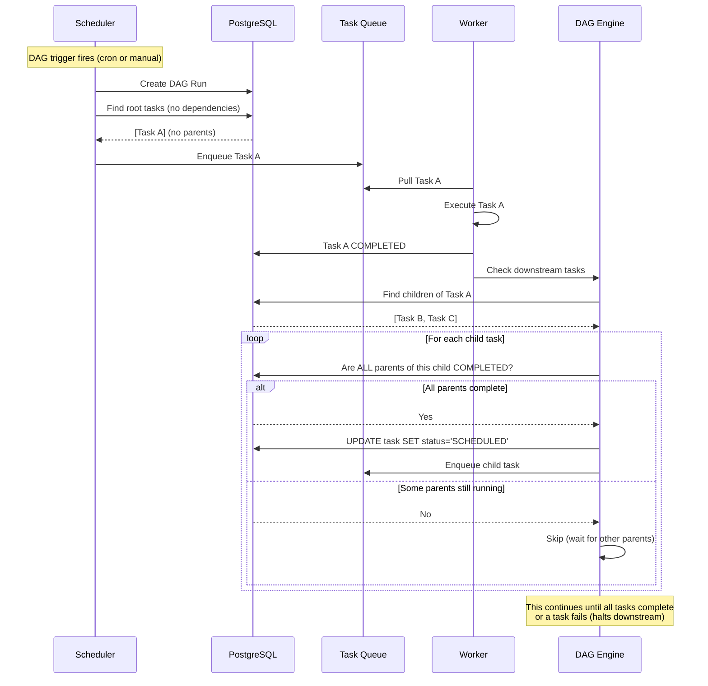

### 3.3 DAG Engine Implementation

```python
class DAGEngine:
    """
    Manages task dependencies within a DAG.
    Uses topological ordering to determine execution sequence.
    """
    
    def trigger_dag_run(self, dag_id: str) -> str:
        """Start a new run of a DAG."""
        dag = db.get_dag(dag_id)
        
        # Validate DAG has no cycles
        if not self.is_acyclic(dag.graph):
            raise ValueError("DAG contains cycles!")
        
        # Create a DAG run
        run_id = db.create_dag_run(dag_id)
        
        # Create task instances for this run
        for task_def in dag.tasks:
            db.create_task(
                dag_id=dag_id,
                dag_run_id=run_id,
                parent_task_ids=task_def.dependencies,
                status='PENDING' if task_def.dependencies else 'SCHEDULED',
                # Root tasks (no deps) are immediately SCHEDULED
            )
        
        return run_id
    
    def on_task_completed(self, task: Task):
        """Called when a task in a DAG completes."""
        if not task.dag_id:
            return
        
        # Find all downstream tasks
        children = db.execute("""
            SELECT * FROM tasks
            WHERE dag_id = %s
              AND %s = ANY(parent_task_ids)
              AND status = 'PENDING'
        """, [task.dag_id, task.task_id])
        
        for child in children:
            # Check if ALL parent tasks are completed
            all_parents_done = db.execute("""
                SELECT COUNT(*) = 0 
                FROM tasks 
                WHERE task_id = ANY(%s)
                  AND status != 'COMPLETED'
            """, [child.parent_task_ids])
            
            if all_parents_done:
                db.execute("""
                    UPDATE tasks 
                    SET status = 'SCHEDULED',
                        next_run_time = NOW()
                    WHERE task_id = %s
                """, [child.task_id])
    
    def is_acyclic(self, graph: dict) -> bool:
        """
        Kahn's algorithm for cycle detection.
        Also produces topological ordering.
        """
        in_degree = defaultdict(int)
        for node, neighbors in graph.items():
            for neighbor in neighbors:
                in_degree[neighbor] += 1
        
        queue = deque([n for n in graph if in_degree[n] == 0])
        visited = 0
        
        while queue:
            node = queue.popleft()
            visited += 1
            for neighbor in graph.get(node, []):
                in_degree[neighbor] -= 1
                if in_degree[neighbor] == 0:
                    queue.append(neighbor)
        
        return visited == len(graph)
```

---

## 4. Retry Strategy Deep Dive

### 4.1 Retry Flow

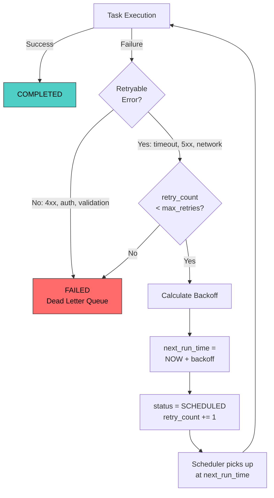

### 4.2 Backoff Strategies

```
┌─────────────────────────────────────────────────────────────────┐
│ Strategy          │ Formula             │ Delays               │
├─────────────────────────────────────────────────────────────────┤
│ Fixed             │ delay               │ 5s, 5s, 5s, 5s      │
│ Linear            │ delay * attempt     │ 5s, 10s, 15s, 20s   │
│ Exponential       │ delay * 2^attempt   │ 1s, 2s, 4s, 8s, 16s │
│ Exp + Jitter      │ exp + rand(0, exp)  │ 1.3s, 2.7s, 5.1s... │
│ Decorrelated      │ rand(delay, prev*3) │ 1.8s, 4.2s, 7.5s... │
└─────────────────────────────────────────────────────────────────┘

Best Practice: ALWAYS use exponential backoff WITH jitter.
  - Exponential prevents hammering a failing dependency
  - Jitter prevents thundering herd (all retries at same time)
```

### 4.3 Dead Letter Queue (DLQ)

```
Dead Letter Queue Purpose:
  1. Capture tasks that exhausted all retries
  2. Allow manual investigation and replay
  3. Prevent infinite retry loops

DLQ Operations:
  - Browse: View failed tasks and their error messages
  - Replay: Re-submit a task from DLQ to the main queue
  - Purge: Delete investigated tasks from DLQ
  - Alert: Auto-alert on-call for critical task failures

DLQ Message Contains:
  - Original task payload
  - All retry attempts with error details
  - Stack traces from each attempt
  - Worker ID that last attempted execution
  - Timestamp of each attempt
```

---

## 5. Complete End-to-End Flow

### 5.1 One-Time Task Flow

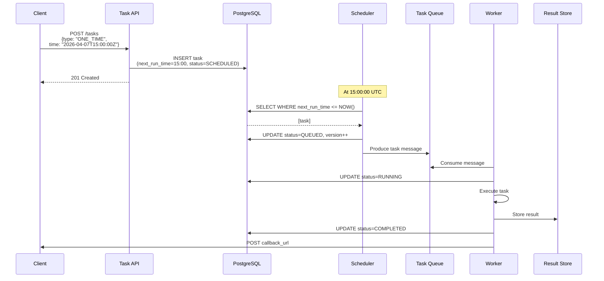

### 5.2 Recurring Task Flow

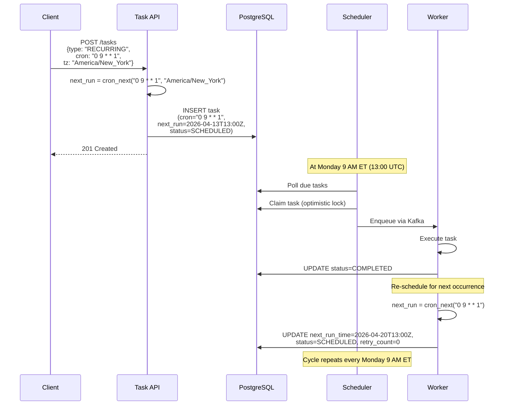

---

## 6. Architecture Patterns Summary

```
┌─────────────────────────────────────────────────────────────┐
│ Pattern               │ Where Used        │ Why             │
├─────────────────────────────────────────────────────────────┤
│ Optimistic Locking    │ Scheduler         │ Exactly-once    │
│                       │ (version field)   │ claim           │
│                       │                   │                 │
│ Partition Assignment  │ Scheduler <-> DB  │ Avoid full      │
│                       │                   │ table scans     │
│                       │                   │                 │
│ Priority Queues       │ Kafka topics      │ High-priority   │
│                       │                   │ tasks first     │
│                       │                   │                 │
│ Consumer Groups       │ Kafka workers     │ Load balanced   │
│                       │                   │ processing      │
│                       │                   │                 │
│ Exponential Backoff   │ Worker retries    │ Prevent         │
│                       │                   │ overload        │
│                       │                   │                 │
│ Dead Letter Queue     │ Failed tasks      │ Error isolation │
│                       │                   │                 │
│ Saga / Choreography   │ DAG execution     │ Multi-step      │
│                       │                   │ workflows       │
│                       │                   │                 │
│ Leader Election       │ Scheduler HA      │ No SPOF         │
│                       │                   │                 │
│ Circuit Breaker       │ Worker -> Service │ Protect         │
│                       │                   │ dependencies    │
└─────────────────────────────────────────────────────────────┘
```

---

## 7. Interview Tip: Drawing the Architecture

```
When presenting this to an interviewer, draw it LEFT to RIGHT:

  Client -> API -> Task Store -> Scheduler -> Queue -> Workers -> Result

Then add these annotations:

  1. Circle the Scheduler and say:
     "This is the brain. The hardest part is ensuring exactly-once
      execution when we have multiple scheduler instances."

  2. Circle the Queue and say:
     "This decouples scheduling from execution. Workers can scale
      independently based on queue depth."

  3. Circle the Task Store and say:
     "The DB is the source of truth. We use optimistic locking 
      (version field) for exactly-once guarantees."

  4. Point to Workers and say:
     "Workers are stateless and horizontally scalable. 
      Auto-scaled based on Kafka consumer lag."

This shows you understand the system at multiple levels.
```
