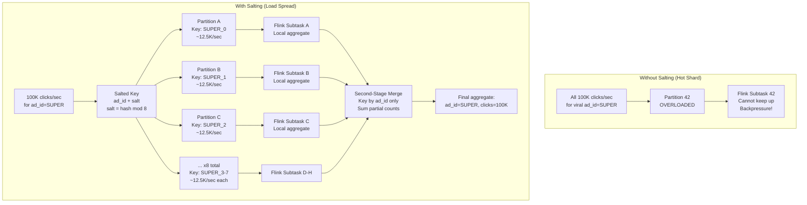
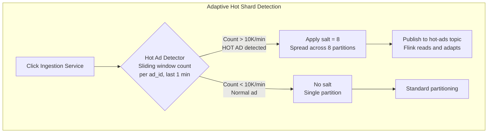
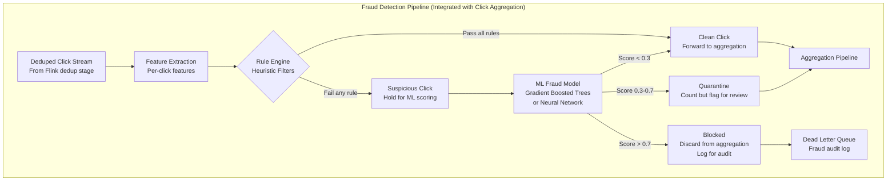
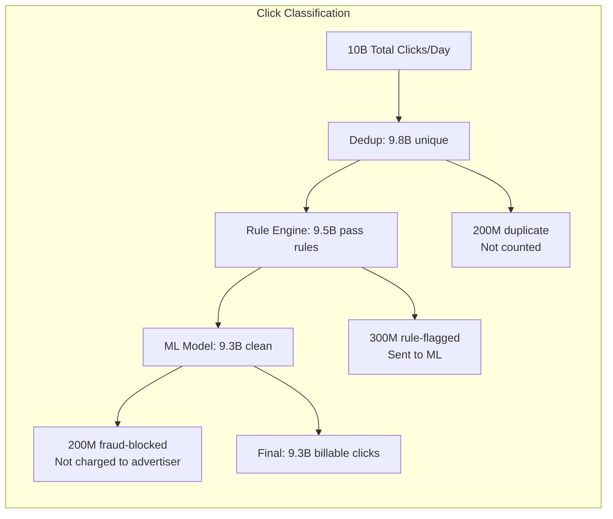
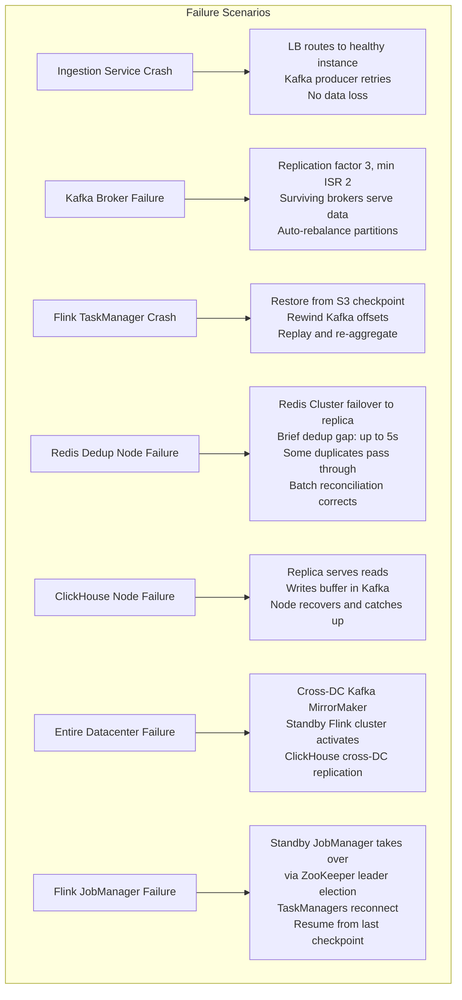
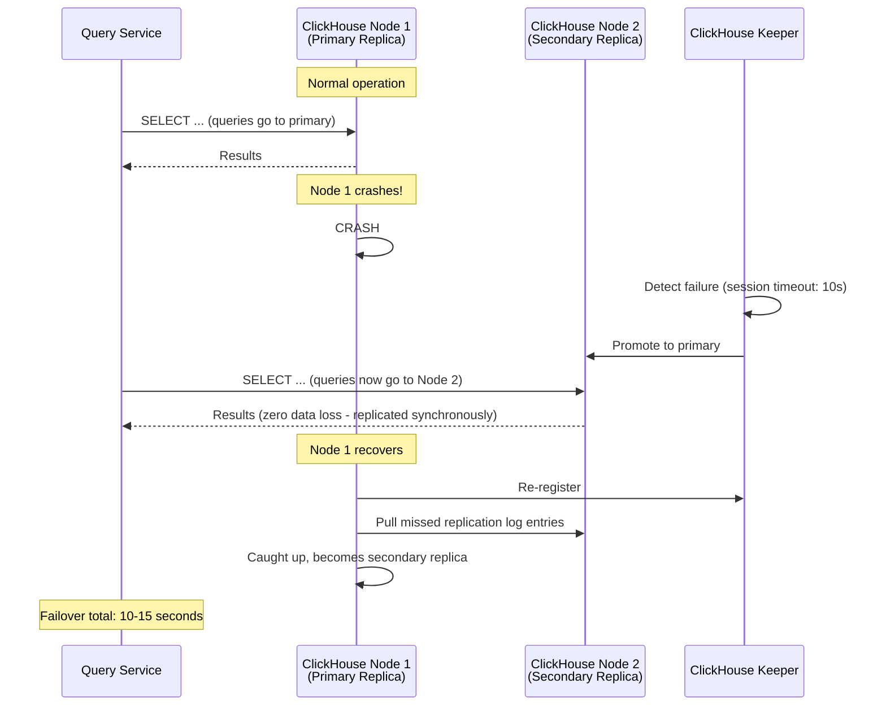
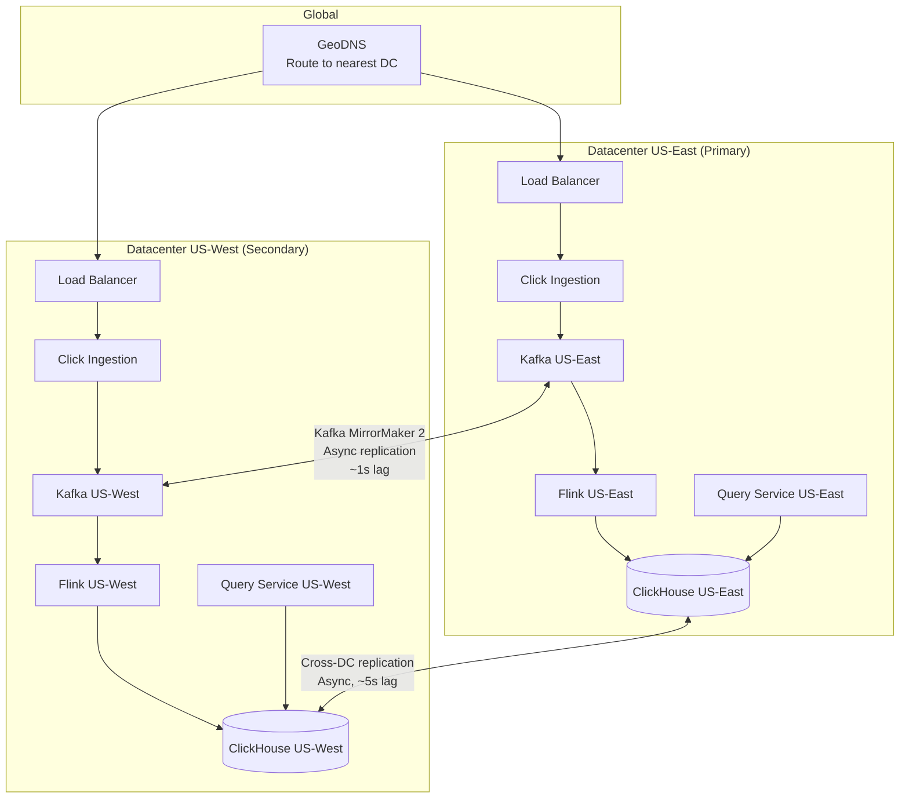
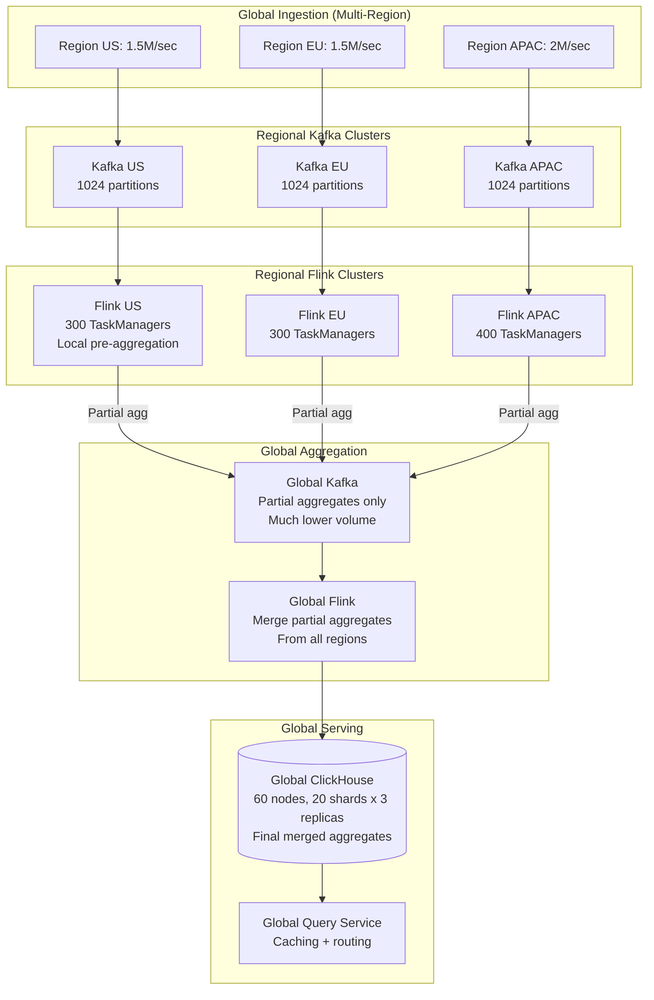

# Design an Ad Click Aggregation System: Deep Dive and Scaling

## Table of Contents
- [1. Deep Dive #1: Hot Shard Problem](#1-deep-dive-1-hot-shard-problem)
- [2. Deep Dive #2: Click Fraud Detection](#2-deep-dive-2-click-fraud-detection)
- [3. Deep Dive #3: ClickHouse vs Druid vs Pinot](#3-deep-dive-3-clickhouse-vs-druid-vs-pinot)
- [4. Deep Dive #4: Fault Tolerance End-to-End](#4-deep-dive-4-fault-tolerance-end-to-end)
- [5. Deep Dive #5: Scaling to 100B Clicks/Day](#5-deep-dive-5-scaling-to-100b-clicksday)
- [6. Trade-Offs and Design Decisions](#6-trade-offs-and-design-decisions)
- [7. Common Interview Questions and Answers](#7-common-interview-questions-and-answers)
- [8. Interview Tips and Presentation Strategy](#8-interview-tips-and-presentation-strategy)

---

## 1. Deep Dive #1: Hot Shard Problem

### 1.1 The Problem

```
We partition Kafka by ad_id so all clicks for one ad go to one partition.
This is necessary for correct per-ad aggregation in Flink.

But what happens when a Super Bowl ad goes viral?

  Normal ad:   ~10 clicks/sec
  Popular ad:  ~1,000 clicks/sec
  Viral ad:    ~100,000 clicks/sec  (during a 30-sec Super Bowl spot)

  Average partition: ~2,000 clicks/sec (500K / 256 partitions)
  Viral ad partition: 100,000 clicks/sec = 50x the average

  One Flink subtask processes one partition.
  That subtask is now 50x overloaded.
  Backpressure propagates. The entire pipeline slows.
```

### 1.2 Solution: Salted Partitioning with Local Pre-Aggregation



### 1.3 Two-Stage Aggregation in Flink

```
Stage 1: Local Pre-Aggregation (parallelism = 256, keyBy salted key)

  Input:  Raw click events
  Key:    ad_id + "_" + (hash(click_id) % num_salts)
  Window: Tumbling 1 minute
  Output: (ad_id, salt, window_start, partial_count)

  Each subtask handles 1/num_salts of the viral ad's traffic.
  For num_salts=8, a 100K/sec viral ad becomes 12.5K/sec per subtask.

Stage 2: Global Merge (parallelism = 64, keyBy ad_id)

  Input:  Partial aggregates from Stage 1
  Key:    ad_id (no salt)
  Window: Tumbling 1 minute
  Output: (ad_id, window_start, total_count)

  This stage receives at most num_salts records per ad per window.
  Even for a viral ad: only 8 partial records to merge. Trivial.
```

### 1.4 Dynamic Salt Detection



```
Hot ad detection:
  - The ingestion service maintains a local counter per ad_id (approximate)
  - Every 10 seconds, it publishes the top-100 ad_ids by volume to a
    "hot-ads" Kafka topic
  - Flink reads this topic and dynamically enables salting for hot ad_ids
  - When an ad is no longer hot, salting is disabled

This avoids over-salting (wasting resources on normal ads) while
protecting against viral ads.

Memory cost of detection:
  - Count-Min Sketch: ~1 MB per ingestion instance
  - Tracks approximate counts for all ad_ids
  - False positive rate: a normal ad might get salted (no correctness issue)
  - False negative rate: a hot ad might not get detected for 10s (brief overload)
```

### 1.5 Alternative: Kafka Partition Reassignment

```
Another approach (less preferred):
  - Detect hot partition via Kafka broker metrics (bytes/sec per partition)
  - Split the hot partition into sub-partitions dynamically
  - Requires Kafka partition reassignment, which is disruptive

Why we prefer application-level salting:
  - No Kafka reconfiguration needed
  - Instant response (no partition rebalancing delay)
  - Flink handles it transparently in the job DAG
  - Can be toggled per-ad_id without affecting other ads
```

---

## 2. Deep Dive #2: Click Fraud Detection

### 2.1 Types of Click Fraud

```
Type                        Description                         Detection Signal
-----------------------------------------------------------------------------------
1. Bot clicks               Automated scripts clicking          Same IP, no JS execution,
                            ads at high frequency               headless browser user-agent

2. Click farms              Humans paid to click ads            Geographic clustering,
                            repeatedly                          unusual click patterns

3. Competitor fraud         Competitor exhausting rival's       High CTR from few users,
                            ad budget with fake clicks          clicks but no conversions

4. Publisher fraud          Publisher inflating clicks           Abnormal click/impression
                            to increase ad revenue              ratio per publisher

5. Device hijacking         Malware generating clicks           Background clicks without
                            without user knowledge              visible ad rendering

6. Proxy/VPN masking        Using rotating proxies to           IP reputation score,
                            evade IP-based detection            datacenter IP ranges
```

### 2.2 Real-Time Fraud Detection Pipeline



### 2.3 Heuristic Rules (Fast, In-Stream)

```
Rule 1: IP Click Rate
  IF same IP clicks same ad > 5 times in 1 minute -> SUSPICIOUS
  Implementation: Redis counter with TTL (INCR + EXPIRE)

Rule 2: User Click Rate
  IF same user clicks any ad > 20 times in 1 minute -> SUSPICIOUS
  Implementation: Redis counter per user_id

Rule 3: Known Bot User-Agents
  IF user_agent matches known bot patterns -> BLOCK
  Implementation: Regex match against curated list (updated daily)

Rule 4: Datacenter IP Ranges
  IF IP belongs to known datacenter/VPN range -> SUSPICIOUS
  Implementation: IP range lookup table (updated daily from threat intel feeds)

Rule 5: Click-Impression Time Gap
  IF time between ad impression and click < 100ms -> SUSPICIOUS
  (Humans cannot see and click an ad in under 100ms)
  Implementation: Join click stream with impression stream

Rule 6: Geographic Impossibility
  IF user's IP geo-location changes > 1000 miles in < 1 hour -> SUSPICIOUS
  Implementation: Sliding window per user_id tracking last known geo

Rule 7: Click Distribution Anomaly
  IF an ad's click rate suddenly increases > 10x vs last-hour average -> FLAG
  Implementation: Sliding window comparison in Flink
```

### 2.4 ML Fraud Model Features

```
Per-Click Features:
  - Time since last click from same user on same ad
  - Time since last click from same IP on any ad
  - Number of distinct ads clicked by this user in last hour
  - Time gap between impression and click (requires joining with impression data)
  - Browser fingerprint consistency score
  - IP reputation score (from threat intel database)
  - Geographic region risk score
  - Device type vs historical pattern for this user
  - Click coordinate position (always same pixel = bot)

Aggregated Features (sliding window):
  - Click rate for this ad in last 5 min vs historical average
  - Unique users vs total clicks ratio for this ad
  - Geographic diversity of clickers for this ad
  - Conversion rate for this ad (clicks that lead to action)
  - Publisher-level click/impression ratio anomaly

Model:
  - LightGBM or XGBoost trained on labeled fraud data
  - Inference latency: < 5ms per click
  - Updated weekly with new labeled data
  - Deployed as a sidecar to Flink TaskManagers (embedded scoring)
```

### 2.5 Fraud Aggregation Impact



**Key principle:** Fraud detection must be conservative. Blocking a legitimate click
costs revenue. Passing a fraudulent click costs advertiser trust. The ML model has
a quarantine zone (score 0.3-0.7) where clicks are counted but flagged for manual
review. The advertiser can dispute quarantined clicks.

---

## 3. Deep Dive #3: ClickHouse vs Druid vs Pinot

### 3.1 Comparison Table

| Feature | ClickHouse | Apache Druid | Apache Pinot |
|---------|-----------|-------------|-------------|
| **Origin** | Yandex (2016) | Metamarkets/Imply (2011) | LinkedIn (2013) |
| **Used at** | Cloudflare, Uber, eBay | Netflix, Airbnb, Walmart | LinkedIn, Uber, Stripe |
| **Architecture** | Shared-nothing MPP | Lambda (real-time + historical) | Lambda (real-time + offline) |
| **Query language** | SQL (full) | Druid SQL (limited) or native JSON | SQL (PQL dialect) |
| **Ingestion** | Batch + INSERT | Real-time (Kafka) + batch | Real-time (Kafka) + batch |
| **Compression** | Excellent (10-20x) | Good (5-10x) | Good (5-10x) |
| **Join support** | Full JOINs | Very limited | Limited |
| **Materialized views** | Yes (native) | No | No |
| **Exactly-once ingestion** | Via ReplacingMergeTree | At-least-once (dedup needed) | At-least-once (dedup needed) |
| **Operational complexity** | Medium (self-managed) | High (many components) | High (many components) |
| **Cloud managed** | ClickHouse Cloud | Imply Cloud | StarTree Cloud |
| **Sub-second query** | Yes (columnar scan) | Yes (pre-aggregation + bitmap) | Yes (star-tree index) |
| **Concurrency** | Medium (100s QPS per node) | High (1000s QPS per node) | High (1000s QPS per node) |
| **Best for** | Ad-hoc SQL analytics | Pre-defined dashboard queries | Pre-defined + real-time mix |

### 3.2 Deep Comparison for Ad Click Use Case

```
Criteria                    ClickHouse              Druid                   Pinot
--------------------------------------------------------------------------------------------
Write throughput            Excellent               Excellent               Excellent
(6K aggregated rows/sec)    Native Kafka MV          Native Kafka ingestion  Native Kafka ingestion

Query latency               50-200ms for our         30-100ms with           30-100ms with
(point query on ad_id)      queries (very good)      pre-aggregation         star-tree index

Query flexibility           Full SQL - can do        Limited SQL, complex    Moderate SQL, some
(ad-hoc analysis)           any analytical query     queries need workarounds  limitations

Aggregation on write        AggregatingMergeTree     Built-in rollup         Built-in rollup
                            handles idempotent        at ingestion time       at ingestion time
                            merges automatically

Exactly-once writes         ReplacingMergeTree       Not natively. Need      Not natively. Need
                            deduplicates by key      external dedup layer    external dedup layer

Operational burden          Single binary, simpler   ZooKeeper + Coordinator Heavy dependency on
                            deployment. ClickHouse   + Broker + Historical   Helix + Controller +
                            Keeper replaces ZK.      + MiddleManager + ...   Broker + Server + ...

Compression                 Best-in-class. Delta     Good. Bitmap index      Good. Star-tree
                            + ZSTD on columnar       adds overhead but       adds overhead but
                            data. 15-20x typical     speeds queries          speeds queries

Ecosystem                   Grafana, dbt, Kafka      Kafka native, Grafana   Kafka native, Grafana
                            Connect, Vector, etc.    Superset plugin         ThirdEye for anomaly

Community & docs            Large, growing fast      Mature, Apache project  Growing, Apache project
```

### 3.3 Why ClickHouse for This Design

```
1. SQL Flexibility
   - Advertiser queries are diverse: point lookups, range scans, top-N, comparisons
   - ClickHouse supports full SQL including JOINs, subqueries, window functions
   - Druid/Pinot require pre-defining rollup rules; ad-hoc queries are limited

2. Idempotent Writes via AggregatingMergeTree
   - Our exactly-once pipeline relies on idempotent upserts
   - ClickHouse's merge-on-read semantics handle duplicate writes natively
   - Druid/Pinot would need an external dedup layer before ingestion

3. Materialized Views for Roll-Ups
   - ClickHouse auto-maintains hourly and daily roll-ups via materialized views
   - No separate ETL job needed for multi-granularity serving
   - Druid/Pinot achieve this via ingestion-time rollup (less flexible)

4. Operational Simplicity
   - ClickHouse is a single binary with ClickHouse Keeper (replaces ZooKeeper)
   - Druid has 6+ process types to manage
   - At our scale (6-10 nodes), ClickHouse is significantly easier to operate

5. Compression
   - 3 TB/day of raw data compressed to ~200 GB in ClickHouse
   - Lower storage costs, faster scans (less data to read from disk)

Trade-off: ClickHouse has lower query concurrency than Druid/Pinot.
Mitigation: We put a Redis cache in front for hot queries, and the Query Service
handles connection pooling and request coalescing.
```

### 3.4 When to Choose Druid or Pinot Instead

```
Choose Druid when:
  - You need very high query concurrency (10K+ QPS per node)
  - Your queries are pre-defined dashboard panels (not ad-hoc)
  - You're already running a Druid cluster for other use cases
  - You need sub-10ms query latency (Druid's bitmap index is faster)

Choose Pinot when:
  - You're at LinkedIn/Uber scale (100+ nodes)
  - You need both real-time and offline table support natively
  - You want StarTree index for extreme pre-aggregation
  - You're building a user-facing analytics product (high concurrency)

Choose ClickHouse when (our case):
  - You need flexible SQL for diverse query patterns
  - Exactly-once ingestion via merge semantics is valuable
  - Your cluster is small-to-medium (< 50 nodes)
  - You want materialized views for automatic roll-ups
  - You value operational simplicity
```

---

## 4. Deep Dive #4: Fault Tolerance End-to-End

### 4.1 Failure Scenarios and Recovery



### 4.2 Flink Checkpoint Recovery Deep Dive

```
Normal Operation Timeline:
  t=0s    Checkpoint CP-100 starts (barrier injected)
  t=2s    CP-100 completes (state uploaded to S3)
  t=2-30s Normal processing continues
  t=15s   TaskManager-7 crashes (OOM, hardware failure, etc.)

Recovery Timeline:
  t=15s   JobManager detects failure (heartbeat timeout)
  t=16s   JobManager cancels all running tasks
  t=17s   JobManager loads CP-100 metadata from S3
  t=18s   JobManager reschedules tasks across remaining TaskManagers
  t=19s   Each TaskManager downloads its state from S3
  t=20s   Kafka consumers rewind to CP-100's offsets
  t=21s   Processing resumes from CP-100's state
  t=23s   Caught up to real-time (replayed 15s of data in ~2s)

Total downtime:    ~8 seconds
Data loss:         Zero
Double-counting:   Zero (idempotent writes to ClickHouse)
Manual intervention: None (fully automatic)
```

### 4.3 Kafka Replay Capability

```
Kafka's retention (72 hours) serves as the ultimate safety net:

  Scenario: Flink has a bug, aggregates are wrong for the last 6 hours
  Recovery:
    1. Fix the bug, deploy new Flink job
    2. Set consumer group offset to 6 hours ago
    3. Replay all events from that point
    4. Flink recomputes aggregates correctly
    5. Idempotent writes overwrite incorrect aggregates in ClickHouse
    6. No data loss, correct results restored

  This is why Kafka retention > Flink checkpoint interval.
  72 hours of retention means we can recover from bugs discovered
  up to 3 days later.
```

### 4.4 ClickHouse Replica Failover



### 4.5 Multi-Datacenter Architecture



```
Cross-DC strategy:
  - Each DC operates independently (active-active for ingestion)
  - Kafka MirrorMaker 2 replicates click events between DCs
  - Each DC runs its own Flink cluster processing local + replicated events
  - ClickHouse cross-DC replication ensures query results are consistent
  - GeoDNS routes users to the nearest DC

  On DC failure:
  - DNS failover routes all traffic to surviving DC (~30s)
  - Surviving DC already has all data via MirrorMaker
  - No data loss (Kafka replication is ahead of Flink processing)
```

---

## 5. Deep Dive #5: Scaling to 100B Clicks/Day

### 5.1 10x Growth: What Changes

```
Current:    10B clicks/day   = 500K/sec peak
10x Growth: 100B clicks/day  = 5M/sec peak

What scales linearly (just add more):
  - Ingestion service instances: 20 -> 200
  - Kafka partitions: 256 -> 2048 (requires topic recreation or new topic)
  - Flink TaskManagers: 100 -> 1000
  - Redis dedup shards: 10 -> 100
  - ClickHouse nodes: 6 -> 60

What needs architectural changes:
  - Kafka cluster: single cluster may hit limits, need multi-cluster federation
  - ClickHouse: 60 nodes needs careful shard management, consider tiered storage
  - Network: 2 GB/sec ingestion requires dedicated network infrastructure
  - Dedup: Bloom filter memory grows 10x, consider partitioned Bloom filters
  - Batch job: 30 TB/day of raw data, Spark cluster needs 10x resources
```

### 5.2 Scaling Architecture at 100B/Day



```
Key insight at 100B scale: REGIONAL PRE-AGGREGATION

  Instead of sending 5M raw clicks/sec to a central pipeline:
  - Each region aggregates locally (reduces data volume by 1000x)
  - Only partial aggregates (ad_id, minute, count) cross regions
  - Global Flink merges partials into final counts

  Data volume reduction:
    Raw:    5M events/sec x 300 bytes = 1.5 GB/sec cross-region
    Partial: ~100K aggregates/sec x 50 bytes = 5 MB/sec cross-region
    Savings: 300x less cross-region traffic
```

### 5.3 Tiered Storage at Scale

```
Hot tier (NVMe SSDs):     Last 7 days    (~350 GB/day agg = 2.5 TB)
Warm tier (HDDs):         7-90 days      (~25 TB)
Cold tier (S3 Glacier):   90+ days       (unlimited, $0.004/GB/month)

ClickHouse tiered storage policy:
  ALTER TABLE click_aggregates
    MODIFY SETTING storage_policy = 'tiered',
    MOVE PARTITION ... TO DISK 'warm' WHERE window_start < now() - INTERVAL 7 DAY,
    MOVE PARTITION ... TO DISK 's3cold' WHERE window_start < now() - INTERVAL 90 DAY;

Queries against cold data:
  - Routed to S3-backed ClickHouse tables
  - Slower (5-30 seconds) but still queryable
  - Acceptable for historical reporting (not real-time dashboards)
```

---

## 6. Trade-Offs and Design Decisions

### 6.1 Key Trade-Offs

```
Trade-Off 1: Exactly-Once vs Throughput
----------------------------------------------------------------------
  Decision: Flink exactly-once checkpointing (every 30s)
  Cost:     ~5-10% throughput reduction vs at-least-once
  Benefit:  Billing correctness (money on the line)
  Why:      At 10B clicks/day, even 0.1% error = 10M wrong charges

Trade-Off 2: Bloom Filter (Fast + Approximate) vs Exact Dedup
----------------------------------------------------------------------
  Decision: Two-tier (Bloom first, Redis fallback)
  Cost:     ~1% of clicks hit Redis unnecessarily (Bloom false positive)
  Benefit:  99% of dedup decisions made in <100ns (no network hop)
  Why:      Redis alone at 500K/sec would need 50+ instances

Trade-Off 3: Lambda Architecture vs Kappa Architecture
----------------------------------------------------------------------
  Decision: Lambda (stream + batch)
  Cost:     Two codepaths to maintain (Flink job + Spark job)
  Benefit:  Batch provides ground truth for reconciliation
  Why:      When advertisers are billed, you need an authoritative source
            that can be audited. Batch reprocessing provides this.

  Alternative (Kappa): Everything through Flink, reprocess by replaying Kafka.
  Problem: Kafka retention is 72h. For monthly billing disputes,
           you need to reprocess data from 30 days ago. Kappa fails here.
           S3 archive + Spark is the practical solution.

Trade-Off 4: ClickHouse vs Druid
----------------------------------------------------------------------
  Decision: ClickHouse
  Cost:     Lower query concurrency (~500 QPS/node vs ~2000 QPS/node)
  Benefit:  Full SQL, idempotent writes, materialized views, simpler ops
  Why:      Our query volume (10K QPS) is handled by 6-10 nodes + cache

Trade-Off 5: Real-Time Dedup Window (1 min) vs Longer Window
----------------------------------------------------------------------
  Decision: 1-minute dedup window
  Cost:     Clicks from same user > 1 min apart are counted separately
  Benefit:  Smaller state in Redis (30M keys vs 300M for 10-min window)
  Why:      Most accidental double-clicks happen within seconds.
            1 minute is the industry standard. Longer windows need
            10x more Redis memory and risk blocking legitimate re-visits.

Trade-Off 6: Protobuf vs JSON for Click Events
----------------------------------------------------------------------
  Decision: Protobuf
  Cost:     Not human-readable, requires schema registry
  Benefit:  60% smaller events, 10x faster serialization
  Why:      At 500K events/sec, saving 150 MB/sec of bandwidth is
            material. Schema registry provides versioning guarantees.

Trade-Off 7: Event Time vs Processing Time Windows
----------------------------------------------------------------------
  Decision: Event time
  Cost:     More complex (watermarks, late event handling, out-of-order)
  Benefit:  Correct aggregation regardless of network delays
  Why:      A click at 12:00:45 must be in the 12:00-12:01 window,
            even if Flink receives it at 12:01:10. Processing time
            would produce wrong billing numbers.
```

### 6.2 Decisions That Signal Seniority in Interviews

```
1. Choosing 202 Accepted (not 200 OK) for click ingestion
   Shows: understanding of async processing, client-server contract clarity

2. Mentioning Kafka partition key = ad_id and the hot shard risk
   Shows: thinking about data distribution, not just happy path

3. Two-tier dedup (Bloom + Redis) instead of just Redis
   Shows: understanding probabilistic data structures, latency optimization

4. Explaining WHY event time over processing time
   Shows: deep stream processing knowledge, not just textbook definitions

5. Mentioning idempotent writes to ClickHouse via MergeTree
   Shows: understanding exactly-once is end-to-end, not just Flink internal

6. Lambda architecture with explicit reconciliation
   Shows: real-world pragmatism -- streaming is fast but batch is authoritative

7. Dynamic salt detection for hot shards
   Shows: production thinking -- you don't pre-salt everything, you adapt

8. Fraud detection as a separate concern layered into the pipeline
   Shows: system thinking beyond the core aggregation problem
```

---

## 7. Common Interview Questions and Answers

### Q1: "How do you guarantee exactly-once counting?"

```
Answer framework (3 layers):

Layer 1: Kafka Producer Idempotence
  - enable.idempotence=true on the producer
  - Kafka assigns each producer a PID and sequence number
  - Broker deduplicates retried messages with same PID+seq
  - Guarantee: each click enters Kafka exactly once

Layer 2: Flink Checkpointing
  - Flink snapshots Kafka offsets + window state together atomically
  - On failure, restores to checkpoint, rewinds Kafka, replays
  - Events are re-processed but state is restored, so no double-counting
  - Guarantee: each click is aggregated exactly once within Flink

Layer 3: Idempotent Sink
  - ClickHouse AggregatingMergeTree merges rows with same key
  - If Flink replays and writes the same window result twice,
    the merge produces the same aggregate (not 2x)
  - Guarantee: each aggregate is written to storage exactly once

End-to-end: Producer dedup -> Flink checkpoint -> Idempotent sink
```

### Q2: "What if a click arrives 2 hours late?"

```
Answer:

Case 1: Arrives within 5 minutes (allowed lateness)
  - Flink re-opens the closed window
  - Adds the late click to the correct window
  - Emits an updated aggregate (retraction + new value)
  - ClickHouse upserts the corrected count

Case 2: Arrives after 5 minutes but within 72 hours (Kafka retention)
  - Sent to Flink side output -> "late-clicks" Kafka topic
  - Not included in real-time aggregation
  - The daily batch job processes ALL raw clicks from S3 (including late ones)
  - Batch reconciliation detects the discrepancy and corrects the aggregate

Case 3: Arrives after 72 hours
  - Still in S3 raw archive (30-day retention)
  - Next batch run includes it
  - For clicks older than 30 days: too late, lost (edge case, negligible volume)

Key insight: The Lambda architecture is specifically designed for this.
The streaming layer is fast but approximate. The batch layer is slow but complete.
Together they handle all timing scenarios.
```

### Q3: "How do you handle a Super Bowl ad getting 100K clicks/sec?"

```
Answer:

Detection:
  - Ingestion service runs a Count-Min Sketch per ad_id
  - When an ad exceeds 10K clicks/min threshold, it's flagged as "hot"
  - Hot ad_ids are published to a coordination topic

Mitigation:
  - Hot ad_ids get salted partition keys (ad_id + "_" + salt)
  - 8 salts spread the load across 8 partitions
  - Flink runs two-stage aggregation:
    Stage 1: Aggregate per salted key (8 parallel subtasks)
    Stage 2: Merge by ad_id (1 subtask, but only merging 8 partial counts)

  Traffic per subtask: 100K/8 = 12.5K/sec (manageable)

Downstream:
  - ClickHouse query "SELECT clicks WHERE ad_id = X" is unaffected
    (data is stored by ad_id, not by salted key)
  - The salt is an internal implementation detail of the streaming pipeline

Recovery:
  - When the ad is no longer hot (rate drops below threshold), salt is removed
  - Normal single-partition processing resumes
```

### Q4: "Why not just use a regular database like PostgreSQL?"

```
Answer:

At our scale (10B clicks/day, 10K queries/sec), PostgreSQL fails on:

1. Write throughput:
   PostgreSQL: ~10K inserts/sec (B-tree index overhead)
   ClickHouse: ~1M inserts/sec (append-only columnar)

2. Analytical query speed:
   "Count clicks for ad X in last hour, grouped by country"
   PostgreSQL: Full table scan or complex index, seconds to minutes
   ClickHouse: Columnar scan, only reads country + count columns, <100ms

3. Storage efficiency:
   PostgreSQL: Row-oriented, 3 TB/day raw storage
   ClickHouse: Columnar + compression, 200 GB/day (15x smaller)

4. Compression:
   PostgreSQL: TOAST compression (2-3x)
   ClickHouse: Delta + ZSTD (10-20x on time-series data)

5. Partition management:
   PostgreSQL: Manual partitioning, partition pruning quirks
   ClickHouse: Native daily partitioning with automatic TTL

PostgreSQL is the right choice for transactional workloads (ad campaign CRUD,
user accounts, billing records). ClickHouse is the right choice for analytical
workloads (aggregate billions of clicks with sub-second latency).

Use both: PostgreSQL for the ad platform's OLTP needs,
ClickHouse for the aggregation system's OLAP needs.
```

### Q5: "How would you detect click fraud?"

```
Answer (see Section 2 for full detail):

Two-phase approach:

Phase 1: Real-time heuristic rules (in-stream, <1ms)
  - IP click rate limiting (>5 clicks/min from same IP on same ad)
  - Known bot user-agent blocking
  - Datacenter IP range detection
  - Click-impression time gap check (<100ms = impossible for human)
  - Geographic impossibility (user in NYC then Tokyo in 10 minutes)

Phase 2: ML model scoring (near-real-time, <5ms)
  - Gradient Boosted Trees trained on labeled fraud data
  - Features: click timing patterns, user behavior history, IP reputation
  - Three outcomes: clean (count), quarantine (count + flag), blocked (discard)

Phase 3: Offline analysis (batch, T+1)
  - Cluster analysis on click patterns
  - Publisher-level anomaly detection
  - Advertiser dispute resolution with detailed audit trail

Key: We never block with >99% confidence unless the signal is strong.
False positives (blocking real clicks) destroy advertiser trust.
When in doubt, count the click but flag it for review.
```

### Q6: "Why Flink over Spark Streaming or Kafka Streams?"

```
Answer:

vs Spark Streaming (micro-batch):
  - Spark processes in micro-batches (100ms-seconds granularity)
  - Flink is true event-at-a-time with windowing
  - For 1-minute tumbling windows, Spark is adequate
  - For sliding windows and low-latency dashboards, Flink is superior
  - Flink's watermark model handles out-of-order events more naturally

vs Kafka Streams:
  - Kafka Streams runs as a library inside your application
  - No separate cluster to manage (simpler ops)
  - BUT: state is stored in local RocksDB, backed by Kafka changelog topics
  - At 500K/sec with large window state, Kafka Streams' state management
    becomes a bottleneck (local disk I/O)
  - Flink's managed state + S3 checkpointing scales better for our volume

vs Storm (legacy):
  - Storm has at-least-once semantics by default
  - Trident (Storm's exactly-once layer) is slow and complex
  - Flink's exactly-once is native and performant
  - Storm is largely deprecated in favor of Flink

Flink wins for our use case because:
  1. Native exactly-once semantics (critical for billing)
  2. Sophisticated event time processing with watermarks
  3. Efficient large state management (RocksDB + S3)
  4. Two-phase commit sink support (for exactly-once end-to-end)
  5. Battle-tested at scale (Alibaba runs 100K+ Flink jobs)
```

### Q7: "What happens if Redis goes down entirely?"

```
Answer:

Impact:
  - Tier 2 dedup is unavailable
  - Bloom filter (Tier 1) still works for ~99% of checks
  - The ~1% "maybe duplicate" events that would normally go to Redis
    are now passed through without authoritative dedup check

Mitigation options:

Option A: Fail-open (our choice)
  - Accept the ~1% of "maybe duplicates" as clicks (slight overcount)
  - Duration: Redis cluster failover takes 10-30 seconds
  - Impact: at 500K/sec, ~0.2% are actual duplicates = ~1K extra clicks
  - Batch reconciliation corrects this the next day

Option B: Fail-closed
  - Reject all "maybe duplicate" clicks until Redis recovers
  - Impact: ~1% of legitimate clicks are incorrectly discarded
  - Worse than fail-open because lost clicks = lost advertiser revenue

Option C: Fallback to local in-memory dedup
  - Each Flink TaskManager maintains a local HashMap for recent events
  - Less accurate than Redis (not shared across instances)
  - Better than nothing, catches same-user duplicates within one TM

Decision: Fail-open + batch reconciliation.
Redis downtime is rare (10-30s with cluster mode). The overcounting
during that window is negligible and corrected by the batch layer.
```

---

## 8. Interview Tips and Presentation Strategy

### 8.1 Time Allocation (45-Minute Interview)

```
Phase                          Time        Focus
-------------------------------------------------------------------
1. Requirements clarification  3-5 min     Confirm: clicks only (not impressions),
                                           10B/day scale, billing accuracy matters

2. Back-of-envelope estimation 3-5 min     Show: 115K/sec avg, 500K peak,
                                           300 bytes/event, 3 TB/day raw

3. High-level architecture     10-12 min   Draw: Ingestion -> Kafka -> Flink ->
                                           ClickHouse -> Query Service
                                           Mention Lambda architecture early

4. Deep dive #1                8-10 min    Dedup: Bloom + Redis two-tier
                                           OR exactly-once pipeline
                                           (follow interviewer's interest)

5. Deep dive #2                8-10 min    Hot shard / scaling
                                           OR reconciliation
                                           (follow interviewer's interest)

6. Wrap-up                     3-5 min     Trade-offs summary, mention
                                           fraud detection as future work
```

### 8.2 What to Draw on the Whiteboard

```
Minimum viable diagram (must include):

  [Ad SDK] -> [Ingestion Service] -> [Kafka] -> [Flink] -> [ClickHouse] -> [Query API]
                                                  |
                                           [Redis Dedup]
                                                  |
                                     [S3 Archive] -> [Spark Batch] -> [Reconciliation]

  Label the Kafka topic names
  Label Flink's windowing strategy
  Show the dedup decision flow
  Show the reconciliation arrow from batch to streaming results
```

### 8.3 Signals That Impress Interviewers

```
Signal                                  How to Demonstrate
-------------------------------------------------------------------
1. Scale awareness                      Start with estimation, reference numbers
                                        throughout ("at 500K/sec, we need...")

2. Exactly-once understanding           Explain the 3-layer chain:
                                        producer idempotence + checkpoint + sink

3. Stream processing depth              Mention watermarks, event time vs
                                        processing time, allowed lateness

4. Trade-off reasoning                  "We chose X over Y because Z.
                                        The cost is A, the benefit is B."

5. Production thinking                  Hot shard, failure recovery, monitoring,
                                        reconciliation, fraud detection

6. Data store knowledge                 Why ClickHouse not PostgreSQL,
                                        columnar vs row-oriented

7. End-to-end thinking                  Don't just design the pipeline.
                                        Think about billing downstream,
                                        advertiser dashboards, dispute resolution.
```

### 8.4 Common Mistakes to Avoid

```
Mistake 1: Starting with the database choice
  Better: Start with requirements and data flow. The storage choice
          follows from the access patterns, not the other way around.

Mistake 2: Ignoring deduplication
  This is the #1 differentiator for this problem. If you don't mention
  dedup, the interviewer will prompt you. Be ready with Bloom + Redis.

Mistake 3: Claiming "Flink gives exactly-once for free"
  Flink's exactly-once is INTERNAL. You need idempotent sinks for
  end-to-end exactly-once. Mention AggregatingMergeTree or upserts.

Mistake 4: Not mentioning late events
  "What about clicks that arrive 10 minutes late?" If you don't address
  this, the interviewer will ask. Show watermarks + allowed lateness.

Mistake 5: Forgetting the batch layer
  A pure streaming architecture has no way to correct errors or handle
  very late events. Mention Lambda architecture and daily reconciliation.

Mistake 6: Over-engineering from the start
  Don't start with 3 data centers and 1000 nodes. Start with a clean
  single-DC design, then discuss scaling when prompted.

Mistake 7: Not discussing monitoring
  "How do you know the system is healthy?" Mention: ingestion lag,
  Flink checkpoint duration, dedup ratio, stream-vs-batch deviation,
  query latency percentiles. This shows production experience.
```

### 8.5 One-Page Summary for Quick Review

```
DESIGN AN AD CLICK AGGREGATION SYSTEM
======================================

Requirements: Aggregate 10B clicks/day for billing + dashboards.
              Exactly-once counting. Dedup double-clicks. Sub-second queries.

Scale:        115K/sec avg, 500K/sec peak, 300 bytes/event, 3 TB/day raw.

Architecture: Lambda (stream + batch)
  Ingestion -> Kafka (256 partitions, key=ad_id)
            -> Flink (dedup + tumbling/sliding windows + exactly-once)
            -> ClickHouse (AggregatingMergeTree, idempotent writes)
            -> Query Service (REST, Redis cache)
            -> Advertiser Dashboard / Billing Pipeline

  S3 Archive -> Spark Batch (daily) -> Reconciliation -> Correct ClickHouse

Dedup:        Two-tier: Bloom filter (99% fast path) + Redis SET NX (1% fallback)
              Window: same user + same ad within 1 minute

Exactly-Once: Kafka idempotent producer
              + Flink checkpoint barriers (every 30s to S3)
              + Idempotent ClickHouse sink (AggregatingMergeTree)

Hot Shard:    Salted partition keys for viral ads
              Two-stage aggregation (local pre-agg + global merge)

Storage:      ClickHouse (OLAP, columnar, sub-second queries)
              Minute -> Hourly -> Daily materialized view roll-ups
              S3 for raw archive (Parquet, 30-day retention)

Fault Tolerance:
              Flink checkpoint recovery (~8s automatic)
              Kafka replay (72h retention)
              ClickHouse replica failover
              Batch reconciliation as safety net

Fraud:        Heuristic rules (IP rate, bot UA, geo) + ML model (LightGBM)
              Three outcomes: clean / quarantine / blocked
```

---

**Previous:** [High-Level Design](./high-level-design.md)
**Start:** [Requirements and Estimation](./requirements-and-estimation.md)
