# Design an Ad Click Aggregation System: High-Level Design

## Table of Contents
- [1. Architecture Overview](#1-architecture-overview)
- [2. System Architecture Diagram](#2-system-architecture-diagram)
- [3. Component Deep Dive](#3-component-deep-dive)
- [4. Click Deduplication Design](#4-click-deduplication-design)
- [5. Stream Processing with Apache Flink](#5-stream-processing-with-apache-flink)
- [6. MapReduce Batch Aggregation](#6-mapreduce-batch-aggregation)
- [7. Aggregation Storage Layer (OLAP)](#7-aggregation-storage-layer-olap)
- [8. Exactly-Once Aggregation](#8-exactly-once-aggregation)
- [9. Lambda Architecture and Data Reconciliation](#9-lambda-architecture-and-data-reconciliation)
- [10. Data Flow Walkthroughs](#10-data-flow-walkthroughs)
- [11. Database Design Details](#11-database-design-details)

---

## 1. Architecture Overview

The system follows a **Lambda architecture** with three layers:

1. **Speed Layer (Stream Processing):** Apache Flink consumes from Kafka in real-time,
   deduplicates clicks, aggregates them in tumbling windows, and writes to ClickHouse
   for immediate query serving.

2. **Batch Layer:** A daily MapReduce/Spark job reprocesses the complete raw click log
   from object storage, producing the authoritative "ground truth" aggregation.

3. **Serving Layer:** ClickHouse stores both real-time and batch-reconciled aggregates.
   The Query Service reads from ClickHouse to serve advertiser dashboards and the
   billing pipeline.

**Key architectural decisions:**

1. **Kafka as the central message bus** -- decouples ingestion from processing, provides
   replay capability for recovery, and acts as a buffer for traffic spikes
2. **Apache Flink for stream processing** -- native exactly-once semantics via
   checkpointing, sophisticated windowing (tumbling + sliding), and handles out-of-order
   events with watermarks
3. **Two-tier deduplication** -- Bloom filter (fast, space-efficient, probabilistic) backed
   by Redis (exact, authoritative) for the 1-minute dedup window
4. **ClickHouse for aggregation storage** -- columnar OLAP database purpose-built for
   analytical queries over billions of rows with sub-second latency
5. **Idempotent writes everywhere** -- every write operation uses upsert semantics so
   replays and retries cannot produce double-counting

---

## 2. System Architecture Diagram

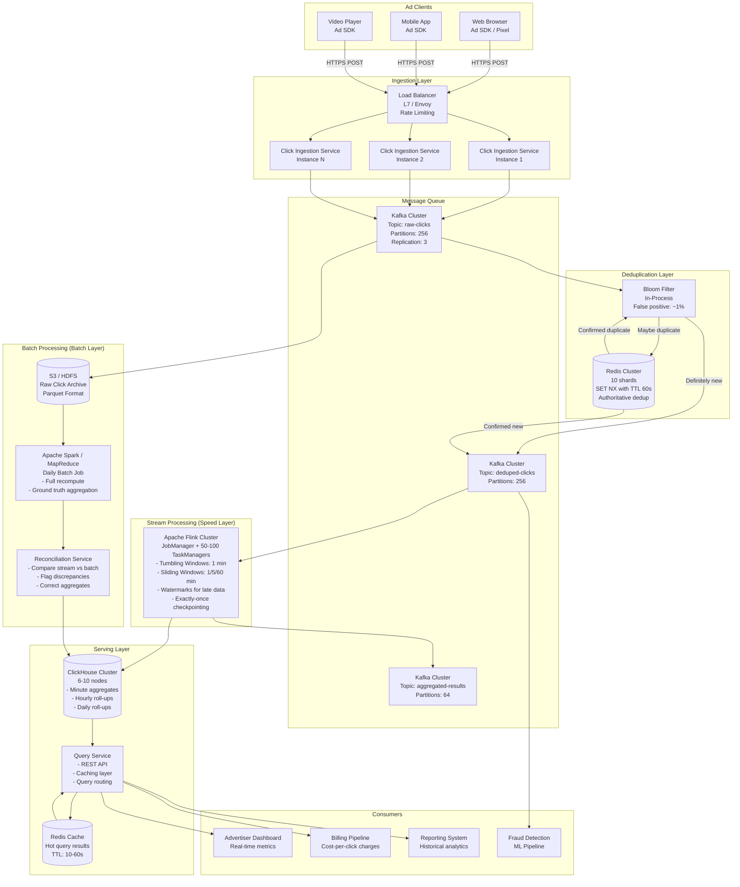

---

## 3. Component Deep Dive

### 3.1 Click Ingestion Service

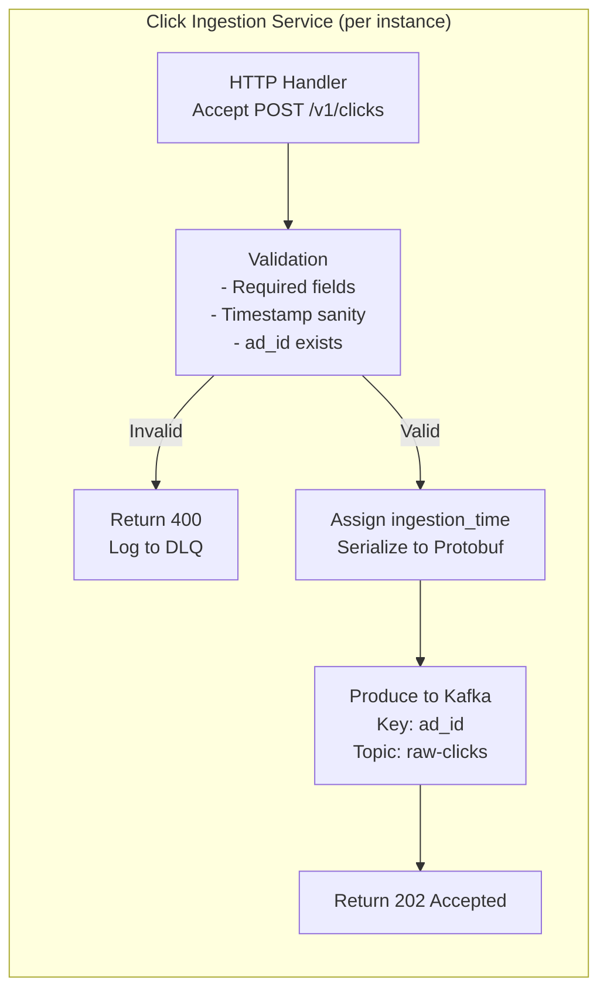

**Design decisions:**

- **Stateless service:** Each instance is identical, scaled horizontally behind the
  load balancer. No local state means instant scaling.

- **Kafka partition key = ad_id:** All clicks for the same ad go to the same partition.
  This is crucial because Flink parallelism operates per-partition, so all clicks for
  one ad are processed by one Flink subtask, enabling correct per-ad aggregation
  without cross-partition coordination.

- **Validation is minimal:** We reject obviously bad data (missing fields, timestamps
  in the future, unknown ad_ids). Deduplication happens downstream in the Flink
  pipeline, not here, because dedup requires state and we want ingestion to be stateless.

- **Fire-and-forget from client's perspective:** The ad SDK receives 202 Accepted as
  soon as the click is durably written to Kafka. The SDK does not wait for dedup or
  aggregation.

**Capacity planning:**
```
500K clicks/sec peak / 50K clicks/sec per instance = 10 instances minimum
With headroom: 15-20 instances
Each instance: 4 cores, 8 GB RAM, 1 Gbps NIC
```

### 3.2 Kafka Configuration

```
Topic: raw-clicks
  Partitions:          256 (allows up to 256 Flink parallel subtasks)
  Replication factor:  3 (durability guarantee)
  Retention:           72 hours (3 days for replay capability)
  Partition key:       ad_id (co-locates all clicks for same ad)
  Compression:         lz4 (fast compression, ~50% ratio)
  Min ISR:             2 (at least 2 replicas must ACK before producer gets success)

Topic: deduped-clicks
  Partitions:          256
  Replication factor:  3
  Retention:           72 hours
  Partition key:       ad_id

Topic: aggregated-results
  Partitions:          64 (lower parallelism needed for aggregated data)
  Replication factor:  3
  Retention:           7 days
```

**Why 256 partitions?**
- 500K clicks/sec / ~5K events/sec per Flink subtask = 100 subtasks minimum
- 256 gives headroom for future growth and allows efficient scaling
- Must be a power of 2 for uniform hash distribution

**Producer configuration:**
```properties
acks=all                  # Wait for all ISR replicas (durability)
retries=Integer.MAX_VALUE # Infinite retries on transient failures
max.in.flight.requests.per.connection=5  # With idempotent producer
enable.idempotence=true   # Kafka dedup at the producer level
compression.type=lz4      # 50% bandwidth saving
batch.size=65536           # 64KB batches for throughput
linger.ms=5                # Wait up to 5ms to fill a batch
```

### 3.3 Kafka as a Buffer for Traffic Spikes

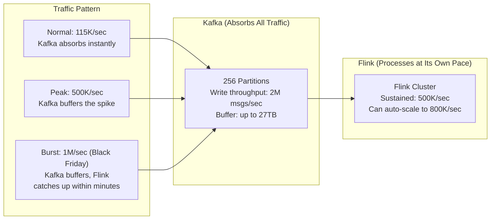

**Critical insight:** Kafka decouples ingestion throughput from processing throughput.
If a flash mob causes a 2x spike beyond Flink's current capacity, Kafka simply buffers
the excess. Flink catches up when the spike subsides. Zero data loss, zero backpressure
to the client.

---

## 4. Click Deduplication Design

### 4.1 The Problem

A user clicking the same ad rapidly (double-click, network retry, slow page load
causing multiple click fires) should be counted as a single click. Our rule:

> **Same user_id + same ad_id within 1 minute = 1 click.**

At 500K clicks/sec, we need a dedup system that:
1. Makes a decision in < 1ms (cannot be the bottleneck)
2. Has negligible false negatives (missing a duplicate = overcharging advertiser)
3. Has acceptable false positives (rejecting a legitimate click = lost revenue, but rare)
4. Handles 500K lookups/sec + 500K writes/sec

### 4.2 Two-Tier Deduplication Architecture

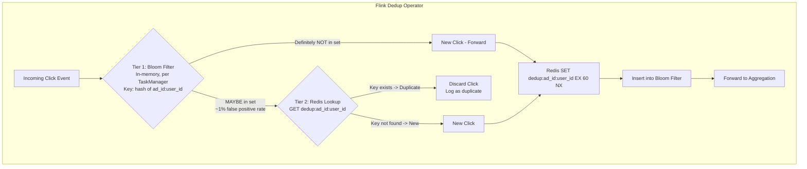

### 4.3 Tier 1: Bloom Filter (Fast Path)

```
Configuration:
  Expected elements:     30M (500K/sec x 60 sec window)
  False positive rate:   1% (configurable)
  Memory per filter:     ~36 MB (using optimal parameters)
  Hash functions:        7 (optimal for 1% FPR)

Performance:
  Lookup time:           ~100 nanoseconds (in-memory bit array)
  Insert time:           ~100 nanoseconds
  Memory per Flink TM:   ~36 MB (one filter per TaskManager)

Why Bloom filter first?
  - 99% of clicks are genuinely new (not duplicates)
  - Bloom filter says "definitely not a duplicate" for 99% of events
  - Only 1% (the "maybe duplicate" set) needs a Redis round-trip
  - This reduces Redis load by 99x: from 500K/sec to ~5K/sec
```

**Bloom filter rotation:**
```
We maintain TWO Bloom filters, rotating every 60 seconds:

  Time 0:00 - 1:00   ->  Filter A (active), Filter B (empty)
  Time 1:00 - 2:00   ->  Filter B (active), Filter A (draining)
  Time 2:00 - 3:00   ->  Filter A (active, reset), Filter B (draining)

  For lookups, we check BOTH filters (current + previous)
  This handles clicks that span the rotation boundary.
```

### 4.4 Tier 2: Redis (Authoritative)

```
Redis Cluster Configuration:
  Instances:      10 shards
  Memory/shard:   16 GB
  Total memory:   160 GB
  Data structure:  String with NX + TTL

Key pattern:     dedup:{ad_id}:{user_id}
Value:           {click_id}
TTL:             60 seconds

Operation:       SET dedup:123456:abcdef "click_uuid" EX 60 NX
  - NX = "only set if Not eXists"
  - If returns OK:  first click, it's new
  - If returns nil: duplicate within 60s

Memory estimation:
  Key size:      ~40 bytes ("dedup:" + 10 digit ad_id + ":" + 16 char user_id)
  Value size:    ~36 bytes (UUID)
  Redis overhead: ~80 bytes per key (dict entry, SDS headers)
  Total/key:     ~156 bytes

  Keys at any time: 30M (500K/sec x 60s TTL)
  Memory needed:    30M x 156 bytes = ~4.7 GB
  With 10 shards:   ~500 MB per shard (well within 16 GB)
```

### 4.5 Handling Bloom Filter False Positives

```
Scenario: Bloom filter says "maybe duplicate" but it's actually a new click.

  Flow:
  1. Bloom says "maybe" -> go to Redis
  2. Redis says "key not found" -> it's new
  3. We SET the key in Redis (NX, TTL 60)
  4. We add to Bloom filter
  5. Forward to aggregation

  Impact: ~1% of clicks take the Redis path unnecessarily
  Cost:   ~5K extra Redis ops/sec (trivial for a 10-shard cluster)
  Result: Zero false negatives. We never wrongly discard a legitimate click.
```

### 4.6 Deduplication Decision Matrix

| Bloom Filter | Redis | Decision | Frequency |
|-------------|-------|----------|-----------|
| Definitely new | (skip) | Accept click | ~99% |
| Maybe duplicate | Not found | Accept click | ~0.8% |
| Maybe duplicate | Found | Reject (duplicate) | ~0.2% |
| Definitely new | (skip) | Accept click | -- |

**Key property:** False negatives are impossible with this two-tier design. The only
error mode is a Bloom filter false positive, which is resolved by the authoritative
Redis check. No legitimate click is ever dropped.

---

## 5. Stream Processing with Apache Flink

### 5.1 Flink Job Architecture

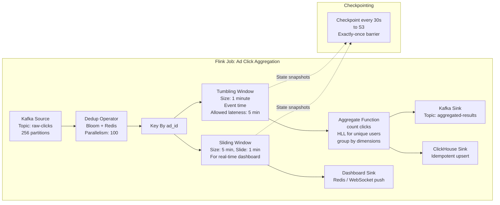

### 5.2 Event Time vs Processing Time

```
Why Event Time?
  - Clicks carry a timestamp from the user's device (event time)
  - Network delays, retries, and out-of-order delivery mean
    clicks may arrive at Flink out of chronological order
  - If we used processing time, a click from 12:00:45 that arrives
    at 12:01:10 would be counted in the wrong window

  Event time ensures: a click is always counted in the window
  that corresponds to WHEN the user clicked, not when Flink received it.

Watermarks:
  - Flink tracks the "water level" of event time progress
  - Watermark = "I believe all events with timestamp <= W have arrived"
  - We configure: watermark = max_event_time - 10 seconds
  - When watermark passes window end, the window fires

  Example:
    Window: 12:00:00 - 12:01:00
    Watermark reaches 12:01:00 at wall clock ~12:01:10
    Window fires, emits aggregated result
    Late events (arriving after watermark) handled by allowed lateness
```

### 5.3 Tumbling Windows (1-Minute Aggregation)

```
Tumbling Window: fixed-size, non-overlapping, aligned to clock.

  12:00:00 ─────── 12:01:00 ─────── 12:02:00 ─────── 12:03:00
  |   Window 1    |   Window 2    |   Window 3    |
  |  742 clicks   |  756 clicks   |  801 clicks   |

  - Each click falls into exactly ONE window
  - At window close, emit: (ad_id, window_start, click_count, unique_users)
  - This is the PRIMARY aggregation used for billing

  Flink code (conceptual):
    clicks
      .keyBy(click -> click.getAdId())
      .window(TumblingEventTimeWindows.of(Time.minutes(1)))
      .allowedLateness(Time.minutes(5))
      .aggregate(new ClickCountAggregator())
      .addSink(clickHouseSink)
```

### 5.4 Sliding Windows (Real-Time Dashboard)

```
Sliding Window: fixed-size, overlapping, slides by a step.

  For "clicks in last 5 minutes, updated every minute":
    Window size: 5 minutes
    Slide:       1 minute

  12:00 ───── 12:05  (Window A)
    12:01 ───── 12:06  (Window B)
      12:02 ───── 12:07  (Window C)

  - Each click belongs to MULTIPLE windows (up to 5 in this case)
  - More computation but gives smooth real-time dashboard experience
  - Used for: live advertiser dashboards, alerting on anomalous click spikes

  Flink code (conceptual):
    clicks
      .keyBy(click -> click.getAdId())
      .window(SlidingEventTimeWindows.of(Time.minutes(5), Time.minutes(1)))
      .aggregate(new ClickCountAggregator())
      .addSink(dashboardSink)
```

### 5.5 Late Event Handling

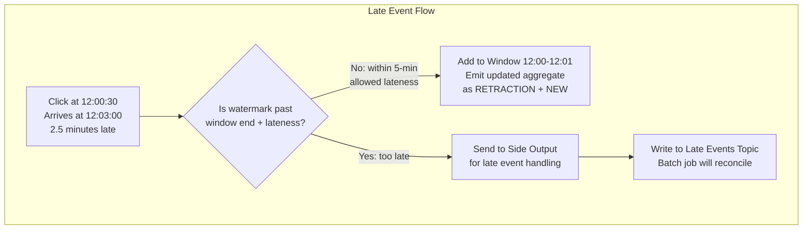

```
Allowed Lateness: 5 minutes

  - A click timestamped 12:00:30 that arrives at 12:04:50 is "late" but
    within the 5-minute allowed lateness window
  - Flink re-opens window 12:00-12:01, adds the click, emits an updated count
  - The ClickHouse sink does an idempotent upsert, so the old count is replaced

  Extremely late events (> 5 minutes):
  - Sent to a Kafka side-output topic "late-clicks"
  - The daily batch job picks these up and includes them in reconciliation
  - This handles offline devices reconnecting hours later
```

### 5.6 Flink Checkpointing Configuration

```yaml
Checkpoint interval:         30 seconds
Checkpoint timeout:          60 seconds
Min pause between:           10 seconds
Max concurrent:              1
Checkpoint storage:          S3 (s3://flink-checkpoints/ad-click-agg/)
State backend:               RocksDB (for large state, spills to disk)
Unaligned checkpoints:       Enabled (faster checkpoint completion under backpressure)

What gets checkpointed:
  - Kafka consumer offsets (which messages have been processed)
  - Window state (partially accumulated counts for open windows)
  - Bloom filter state (current and previous filter)
  - Watermark progress

Recovery:
  - On failure, Flink restores from the latest checkpoint
  - Kafka consumers rewind to the checkpointed offsets
  - Windows are restored with their partial state
  - Processing resumes exactly where it left off
  - No data loss, no double-counting
```

---

## 6. MapReduce Batch Aggregation

### 6.1 Why Batch When We Have Streaming?

```
The streaming layer provides FAST results but may have small inaccuracies:
  - Events that arrived after the allowed lateness window
  - Rare edge cases in Flink checkpoint-recovery (theoretical)
  - Any bugs in the streaming pipeline

The batch layer provides ACCURATE results but with delay (T+1 day):
  - Processes ALL raw click data, including late arrivals
  - Simple, deterministic computation (harder to have bugs)
  - Serves as the authoritative "ground truth"

Together (Lambda Architecture):
  - Real-time queries: served by streaming results (fast, ~99.9% accurate)
  - Billing: uses batch results (slow but authoritative)
  - Reconciliation: compares stream vs batch, flags discrepancies
```

### 6.2 Batch Job Architecture

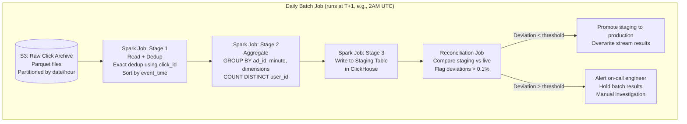

### 6.3 MapReduce Conceptual Flow

```
MAP Phase:
  Input:  Raw click events (Parquet from S3)
  For each click:
    Key:   (ad_id, campaign_id, minute_bucket, country, device_type)
    Value: (click_id, user_id, 1)

SHUFFLE Phase:
  All records with the same key go to the same reducer
  Network transfer of intermediate data

REDUCE Phase:
  For each key:
    Deduplicate by click_id (exact, using HashSet)
    Count unique user_ids (using HyperLogLog for memory efficiency)
    Sum click counts
    Emit: (key, total_clicks, unique_users)

Output:
  Write aggregated results to ClickHouse staging table
```

### 6.4 Batch vs Stream Comparison

| Aspect | Stream (Flink) | Batch (Spark) |
|--------|---------------|---------------|
| **Latency** | 5-10 seconds | T+1 day (runs next morning) |
| **Accuracy** | ~99.9% (misses very late events) | ~100% (processes everything) |
| **Dedup method** | Bloom filter + Redis (probabilistic + TTL) | Exact dedup by click_id (deterministic) |
| **Cost** | Always running, uses resources 24/7 | Runs once daily, ~2-4 hours of compute |
| **Complexity** | High (state management, checkpointing) | Low (stateless MapReduce, simple logic) |
| **Use case** | Real-time dashboards, alerts | Billing, official reporting, auditing |
| **Failure mode** | State corruption possible (rare) | Idempotent, just re-run the job |

---

## 7. Aggregation Storage Layer (OLAP)

### 7.1 Why ClickHouse?

```
The aggregation store must handle:
  - Write: ~6K inserts/sec of pre-aggregated rows (from Flink)
  - Read:  ~10K queries/sec (point queries + range queries + top-N)
  - Data:  Billions of rows with sub-second query latency
  - Scan:  Analytical queries scanning millions of rows

This is a classic OLAP workload. The top three options:

  1. ClickHouse (our choice)
  2. Apache Druid
  3. Apache Pinot

All three are columnar, distributed, and optimized for analytical queries.
We choose ClickHouse for this design. (Detailed comparison in deep-dive.)
```

### 7.2 ClickHouse Table Design

```sql
-- Primary aggregation table: minute-level granularity
CREATE TABLE click_aggregates ON CLUSTER ad_cluster
(
    ad_id           UInt64,
    campaign_id     UInt64,
    advertiser_id   UInt64,
    window_start    DateTime,       -- Start of 1-minute window
    country         LowCardinality(String),
    device_type     LowCardinality(String),
    click_count     UInt64,
    unique_users    AggregateFunction(uniq, String),  -- HyperLogLog
    source          LowCardinality(String),           -- 'stream' or 'batch'
    updated_at      DateTime DEFAULT now()
)
ENGINE = ReplicatedAggregatingMergeTree('/clickhouse/tables/{shard}/click_aggregates', '{replica}')
PARTITION BY toYYYYMMDD(window_start)
ORDER BY (advertiser_id, campaign_id, ad_id, window_start, country, device_type)
TTL window_start + INTERVAL 90 DAY;

-- Why AggregatingMergeTree?
-- It automatically merges rows with the same ORDER BY key at compaction time.
-- If Flink writes the same window twice (retry/recovery), the merge produces
-- the correct result. This is the foundation of idempotent writes.
```

### 7.3 Materialized Views for Roll-Ups

```sql
-- Hourly roll-up (auto-maintained by ClickHouse)
CREATE MATERIALIZED VIEW click_aggregates_hourly
ENGINE = AggregatingMergeTree()
PARTITION BY toYYYYMMDD(window_start)
ORDER BY (advertiser_id, campaign_id, ad_id, window_start, country)
AS SELECT
    ad_id,
    campaign_id,
    advertiser_id,
    toStartOfHour(window_start) AS window_start,
    country,
    sum(click_count) AS click_count,
    uniqMergeState(unique_users) AS unique_users
FROM click_aggregates
GROUP BY ad_id, campaign_id, advertiser_id, toStartOfHour(window_start), country;

-- Daily roll-up
CREATE MATERIALIZED VIEW click_aggregates_daily
ENGINE = AggregatingMergeTree()
PARTITION BY toYYYYMM(window_start)
ORDER BY (advertiser_id, campaign_id, ad_id, window_start)
AS SELECT
    ad_id,
    campaign_id,
    advertiser_id,
    toDate(window_start) AS window_start,
    sum(click_count) AS click_count,
    uniqMergeState(unique_users) AS unique_users
FROM click_aggregates
GROUP BY ad_id, campaign_id, advertiser_id, toDate(window_start);
```

### 7.4 Query Routing Strategy

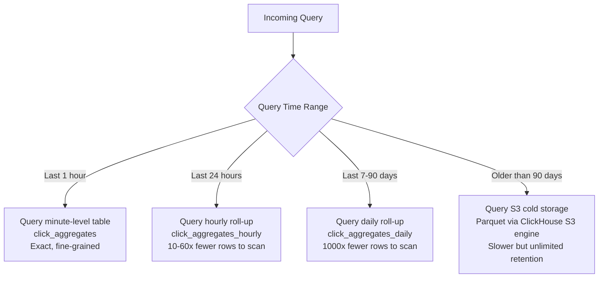

The Query Service automatically routes to the most efficient table based on the
requested time range and granularity. This keeps p99 latency under 200ms for
point queries and under 1s for range queries.

---

## 8. Exactly-Once Aggregation

### 8.1 The Problem

```
In a distributed streaming system, failures are CERTAIN:
  - A Flink TaskManager crashes mid-window
  - The network between Flink and ClickHouse drops briefly
  - A ClickHouse node goes down during a write

Without exactly-once guarantees:
  - If we lose a click:   advertiser is undercharged (our revenue drops)
  - If we double-count:   advertiser is overcharged (legal liability, trust destroyed)
  - Both are unacceptable when money is on the line
```

### 8.2 End-to-End Exactly-Once Pipeline

```mermaid
graph TB
    subgraph "Exactly-Once Chain"
        A[Kafka Producer<br/>enable.idempotence=true<br/>No duplicate messages into Kafka] --> B[Kafka<br/>Each message has<br/>unique producer_id + seq_num]
        B --> C[Flink Source<br/>Reads Kafka offsets<br/>Offsets checkpointed to S3]
        C --> D[Flink Processing<br/>Window state checkpointed<br/>Checkpoint barriers ensure consistency]
        D --> E[Flink Sink<br/>Two-phase commit OR<br/>idempotent upserts to ClickHouse]
        E --> F[ClickHouse<br/>AggregatingMergeTree<br/>Duplicate inserts merged correctly]
    end

    subgraph "On Failure + Recovery"
        G[Flink restores last checkpoint] --> H[Kafka offsets rewound<br/>to checkpointed position]
        H --> I[Messages replayed<br/>from last consistent state]
        I --> J[ClickHouse receives<br/>some duplicate writes]
        J --> K[AggregatingMergeTree<br/>merges duplicates into<br/>correct aggregate]
    end
```

### 8.3 Idempotent Writes to ClickHouse

```sql
-- The write from Flink includes a deterministic key:
-- (ad_id, window_start, country, device_type)

-- If the same window result is written twice (due to Flink replay after recovery),
-- the AggregatingMergeTree merges them at compaction time.

-- For absolute correctness, we use ReplacingMergeTree for the raw insert,
-- keyed on (ad_id, window_start, dimensions, batch_id):

-- batch_id = Flink checkpoint ID
-- Same checkpoint ID + same key = same data = safe to merge/replace

-- The FINAL keyword in queries forces immediate merge for read consistency:
SELECT ad_id, sum(click_count) AS total_clicks
FROM click_aggregates FINAL
WHERE ad_id = 1234567890
  AND window_start BETWEEN '2024-11-14 12:00:00' AND '2024-11-14 13:00:00'
GROUP BY ad_id;
```

### 8.4 Checkpoint Barrier Protocol

```
Flink's exactly-once guarantee relies on aligned checkpoint barriers:

  1. JobManager injects a barrier into each source operator
  2. Barrier flows through the DAG like a regular event
  3. When an operator receives barriers from ALL inputs:
     a. It snapshots its state (window contents, counters)
     b. It forwards the barrier downstream
  4. When the barrier reaches all sinks:
     a. Sink commits the output (or marks it as committed)
     b. Checkpoint is complete

  If a failure occurs between checkpoint N and N+1:
  - State is restored to checkpoint N
  - Kafka offsets are rewound to checkpoint N's position
  - Processing resumes, replaying events between N and N+1
  - Sinks receive duplicate writes, but idempotent upserts handle this

  Checkpoint frequency: every 30 seconds
  Worst-case replay on failure: 30 seconds of data re-processed
  Impact: zero data loss, zero double-counting
```

---

## 9. Lambda Architecture and Data Reconciliation

### 9.1 Lambda Architecture Overview

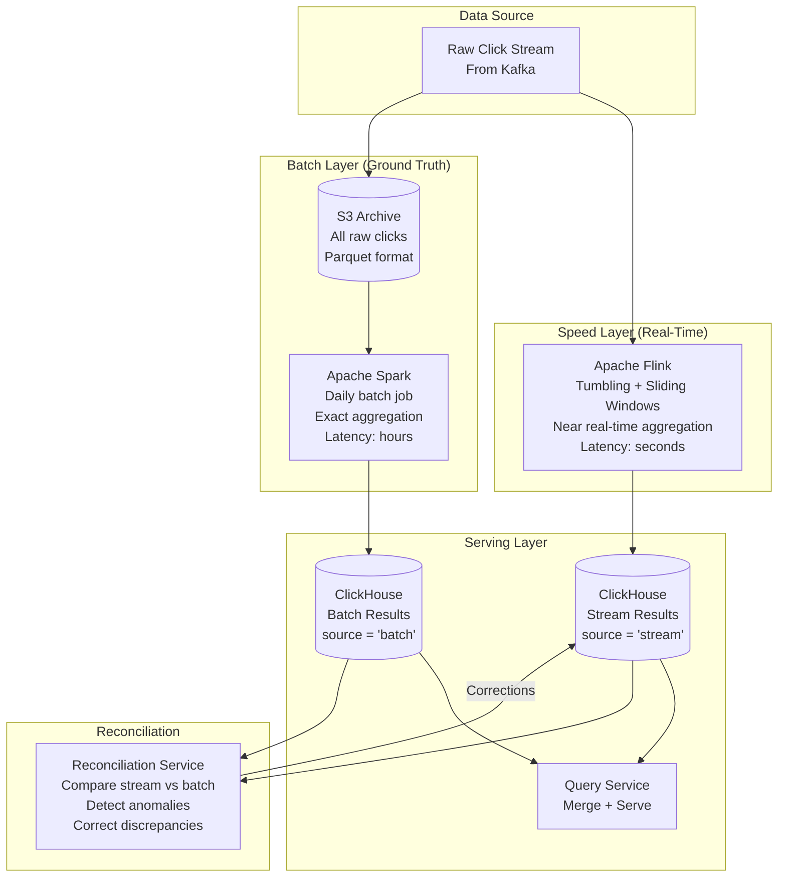

### 9.2 Why Stream Results May Differ from Batch

```
Source of Discrepancy          Typical Impact      Resolution
----------------------------------------------------------------------
1. Late events beyond          ~0.01-0.1%          Batch includes all
   allowed lateness                                 late events from S3

2. Bloom filter false pos      ~0.001%             Batch uses exact dedup
   (legitimate click dropped                        by click_id, no Bloom
   as duplicate in stream)                          filter

3. Flink checkpoint recovery   ~0.0001%            Rare: during recovery,
   edge cases                                       a window boundary event
                                                    might shift windows

4. Clock skew between          ~0.01%              Batch normalizes all
   ingestion servers                                timestamps consistently

5. Redis TTL expiry races      ~0.001%             Batch dedup is exact
   (dedup key expires during                        and not time-bounded
   the SET NX check)

Total expected deviation: < 0.1% (our target)
```

### 9.3 Reconciliation Process

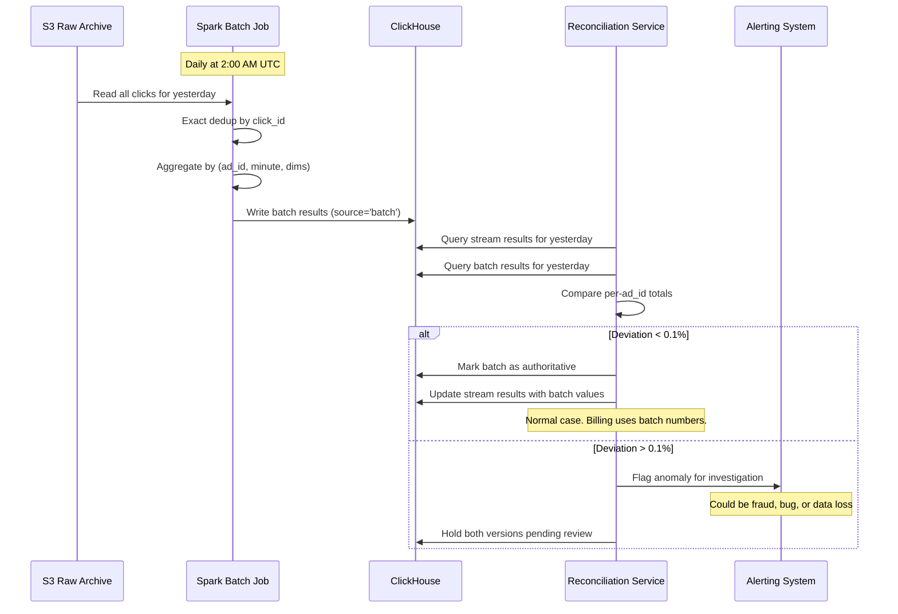

### 9.4 Reconciliation Query

```sql
-- Compare stream vs batch for a given date
SELECT
    s.ad_id,
    s.total_clicks AS stream_clicks,
    b.total_clicks AS batch_clicks,
    abs(s.total_clicks - b.total_clicks) AS difference,
    abs(s.total_clicks - b.total_clicks) / b.total_clicks AS deviation_pct
FROM (
    SELECT ad_id, sum(click_count) AS total_clicks
    FROM click_aggregates FINAL
    WHERE source = 'stream'
      AND window_start >= '2024-11-14'
      AND window_start < '2024-11-15'
    GROUP BY ad_id
) s
FULL OUTER JOIN (
    SELECT ad_id, sum(click_count) AS total_clicks
    FROM click_aggregates FINAL
    WHERE source = 'batch'
      AND window_start >= '2024-11-14'
      AND window_start < '2024-11-15'
    GROUP BY ad_id
) b ON s.ad_id = b.ad_id
WHERE abs(s.total_clicks - b.total_clicks) / b.total_clicks > 0.001  -- Flag > 0.1%
ORDER BY deviation_pct DESC
LIMIT 100;
```

---

## 10. Data Flow Walkthroughs

### 10.1 Happy Path: Single Click Event

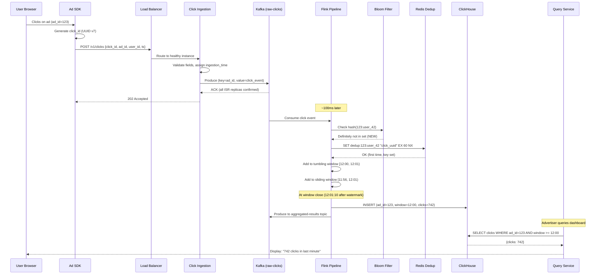

### 10.2 Duplicate Click Detection

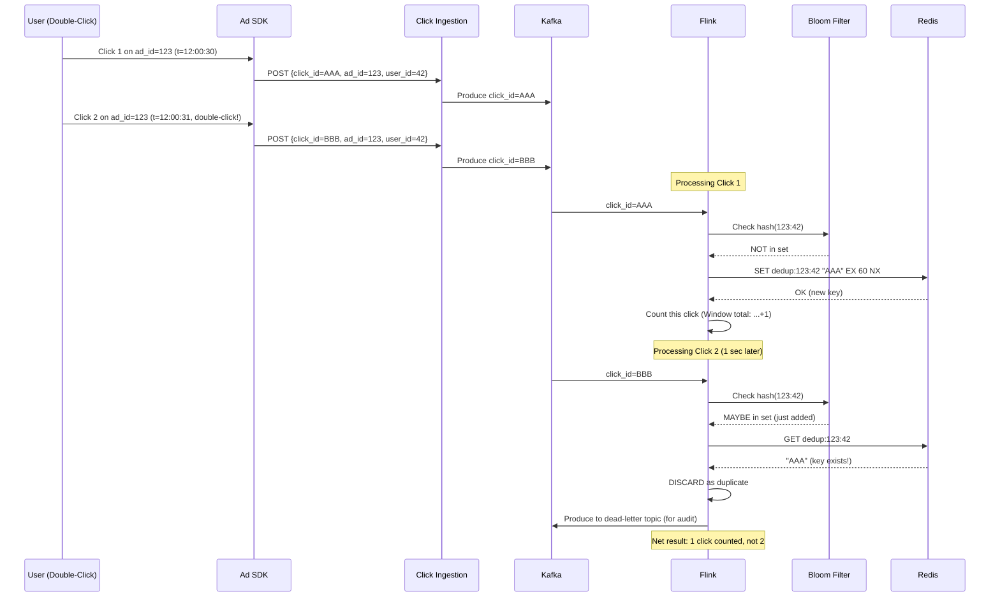

### 10.3 Flink Failure and Recovery

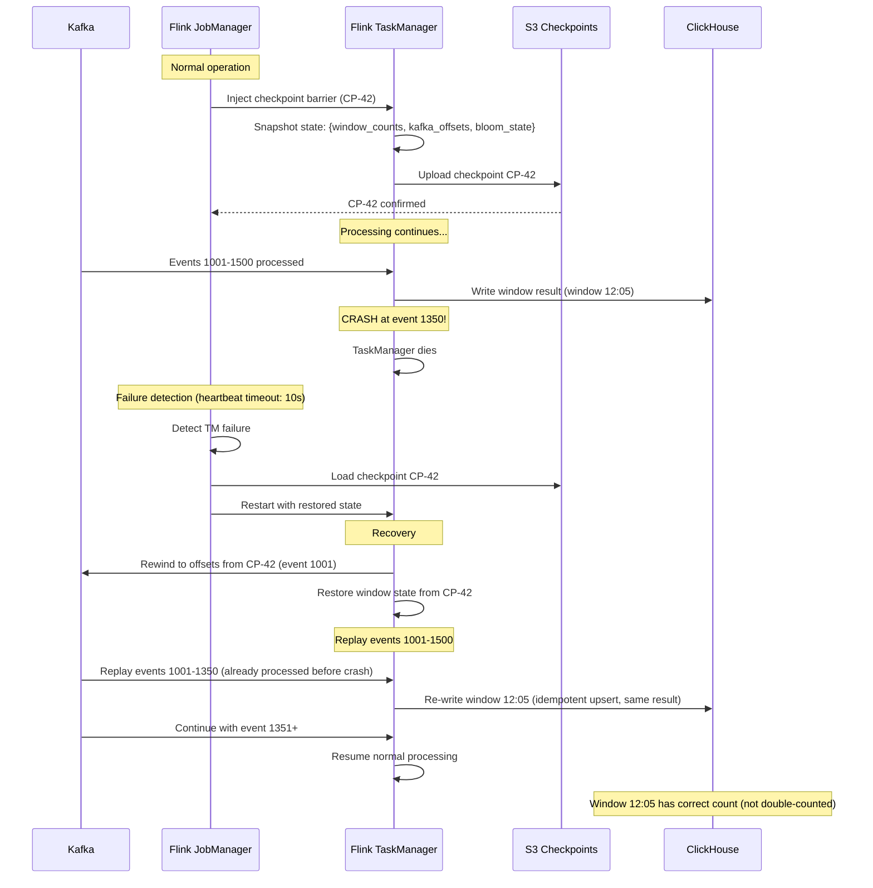

---

## 11. Database Design Details

### 11.1 ClickHouse Cluster Topology

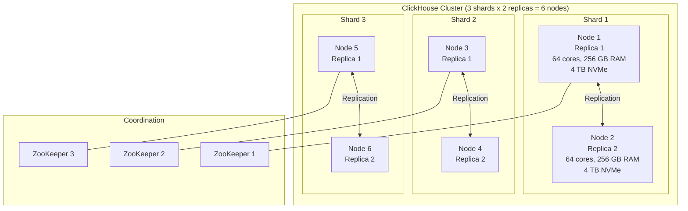

### 11.2 Distributed Table

```sql
-- Distributed table: routes queries to appropriate shards
CREATE TABLE click_aggregates_distributed ON CLUSTER ad_cluster
AS click_aggregates
ENGINE = Distributed(ad_cluster, default, click_aggregates, sipHash64(ad_id));

-- sipHash64(ad_id) determines which shard stores each ad's data
-- All data for the same ad_id lives on the same shard
-- Queries on a single ad_id only hit one shard (efficient)
-- Queries without ad_id filter fan out to all shards (parallel scan)
```

### 11.3 Data Lifecycle

```
Minute-level data:  Stored 90 days  -> Auto-deleted via TTL
Hourly roll-up:     Stored 1 year   -> Auto-deleted via TTL
Daily roll-up:      Stored 3 years  -> Moved to S3 cold storage
Raw click archive:  Stored 30 days in S3 Standard, then Glacier
```

---

**Next:** [Deep Dive and Scaling](./deep-dive-and-scaling.md) -- hot shard handling, click fraud detection, ClickHouse vs Druid vs Pinot comparison, fault tolerance patterns, and interview tips.
