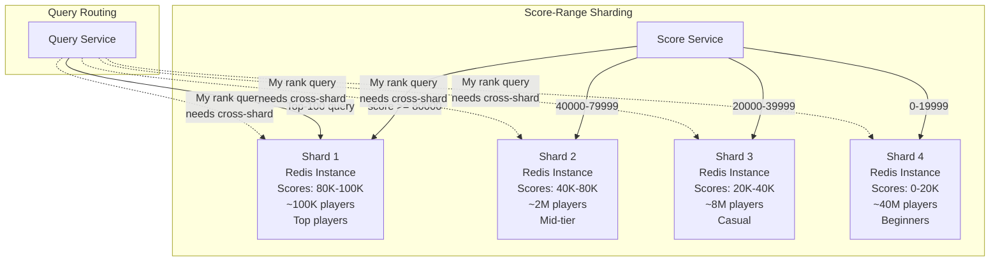
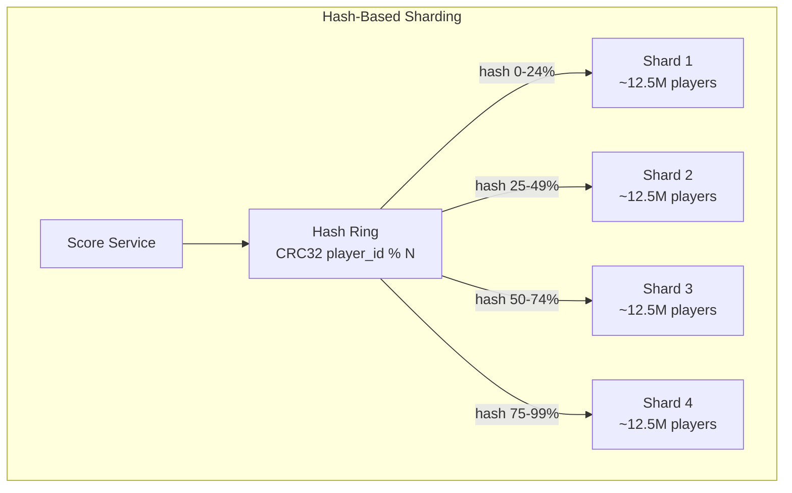
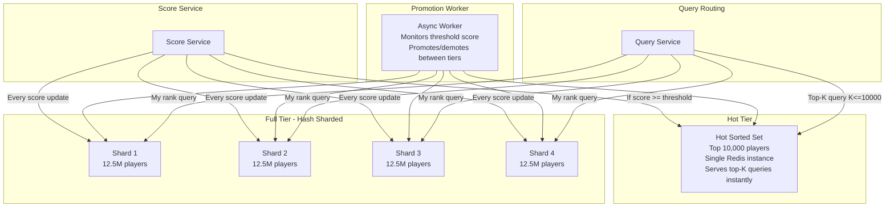
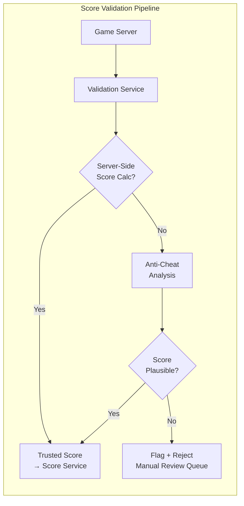
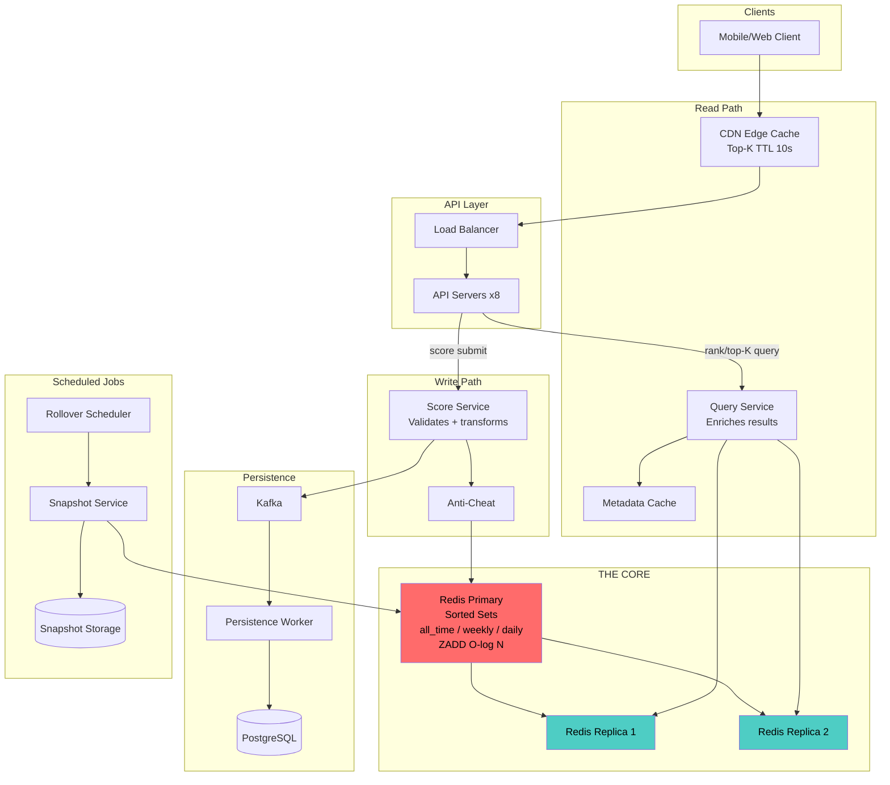

# Design a Real-Time Leaderboard System - Deep Dive & Scaling

## Deep Dive 1: Redis Sorted Set Internals (Skip List)

Understanding the skip list is what separates a good answer from a great one. When the
interviewer asks "how does ZREVRANK actually work in O(log N)?", this is the answer.

### 1.1 Skip List Structure

```
A skip list is a probabilistic data structure that provides O(log N) search,
insert, and delete -- like a balanced BST, but much simpler to implement.

Conceptual structure (scores in ascending order):

Level 4:  HEAD ─────────────────────────────────────────────────── 99850 → NIL
           │                                                        │
Level 3:  HEAD ──────────────── 42500 ──────────────────────────── 99850 → NIL
           │                     │                                  │
Level 2:  HEAD ───── 15000 ──── 42500 ──────── 78200 ──────────── 99850 → NIL
           │          │          │               │                  │
Level 1:  HEAD ───── 15000 ──── 42500 ──── 65300 ──── 78200 ──── 99850 → NIL
           │          │          │          │          │            │
Level 0:  HEAD → 4250 → 15000 → 42500 → 55100 → 65300 → 78200 → 99850 → NIL
           ↓      ↓       ↓       ↓       ↓       ↓       ↓       ↓
          span  alice   bob    carol   dave    eve    frank  grace
          info  (1)     (1)    (1)     (1)     (1)    (1)    (1)

Key insight: each forward pointer stores a SPAN -- the number of nodes it skips.
This enables O(log N) rank calculation by summing spans along the search path.
```

### 1.2 How ZREVRANK Works (O(log N) Rank Calculation)

```
To find the rank of a member, Redis traverses the skip list from the top level
down, accumulating span counts along the way.

Example: Find rank of "dave" (score=55100) in a sorted set of 7 members:

Level 4:  HEAD ──(7)──────────────────────────────────────── 99850
Level 3:  HEAD ──(3)───────────── 42500 ──(4)──────────────── 99850
Level 2:  HEAD ──(2)── 15000 ──(1)── 42500 ──(2)── 78200 ──(1)── 99850
Level 1:  HEAD ──(2)── 15000 ──(1)── 42500 ──(1)── 65300 ──(1)── 78200 ──(1)── 99850
Level 0:  HEAD ──(1)── 4250 ──(1)── 15000 ──(1)── 42500 ──(1)── 55100 ...

Search path for score=55100 (dave):
  Level 4: HEAD → 99850? 99850 > 55100, go down.           Accumulated span: 0
  Level 3: HEAD → 42500? 42500 < 55100, go right.          Accumulated span: 3
           42500 → 99850? 99850 > 55100, go down.          Accumulated span: 3
  Level 2: 42500 → 78200? 78200 > 55100, go down.          Accumulated span: 3
  Level 1: 42500 → 65300? 65300 > 55100, go down.          Accumulated span: 3
  Level 0: 42500 → 55100? FOUND!                           Accumulated span: 3 + 1 = 4

  Rank (0-based, ascending) = 4 - 1 = 3  (4th element, 0-indexed = 3)
  Rank (0-based, descending / ZREVRANK) = total_elements - 1 - 3 = 7 - 1 - 3 = 3

  dave is rank 3 in descending order (4th highest score).

The key: we never scan all N elements. We only traverse O(log N) levels,
each step accumulating the span to compute the rank.
```

### 1.3 Skip List vs Balanced BST

```
Why does Redis use a skip list instead of a Red-Black Tree or AVL Tree?

  Skip List:
    + Simpler to implement (~200 lines of C in Redis)
    + Range queries are trivial (follow level-0 forward pointers)
    + Concurrent-friendly (can lock individual nodes)
    + Same O(log N) expected performance
    - Probabilistic (not worst-case guaranteed)
    - Uses more memory (multiple forward pointers per node)

  Red-Black Tree:
    + Guaranteed O(log N) worst case
    + Less memory per node (just left, right, parent, color)
    - Range queries require in-order traversal (less cache-friendly)
    - Rotation operations are complex
    - Rank calculation requires augmenting with subtree sizes

  Redis chose skip lists because:
    1. Range operations (ZRANGE, ZREVRANGE) are a core use case
    2. Implementation simplicity matters for a database kernel
    3. Expected O(log N) is effectively guaranteed for realistic N
    4. Antirez (Redis creator) found them easier to reason about

  Quote from Antirez:
  "They are simpler, and I think they are more cache-friendly.
   Also implementing ZRANGE in a balanced tree is harder."
```

---

## Deep Dive 2: Scaling Beyond a Single Redis Instance

### 2.1 When Does a Single Redis Instance Break?

```
Single Redis Instance Limits:
  - Memory: typically 64-128 GB usable
  - Each sorted set member: ~124 bytes
  - 50M members: ~6.2 GB → FINE
  - 500M members: ~62 GB → pushing limits
  - 1B members: ~124 GB → EXCEEDS single instance

Throughput:
  - 100K-300K ops/sec → FINE for our 90K ops/sec
  - 1M+ ops/sec → need clustering

When to shard:
  Scenario A: >200M members per board → memory limit
  Scenario B: >200K writes/sec → throughput limit
  Scenario C: >500K reads/sec → add replicas first, then shard
```

### 2.2 Sharding Strategy: By Score Range



```
Score-Range Sharding:

  Pros:
    + Top-K queries hit ONLY the top shard → fast!
    + Each shard is smaller → faster operations
    + Natural data locality (top players together)

  Cons:
    - HIGHLY UNEVEN distribution (most players in bottom shard)
    - "My rank" requires querying ALL shards and summing
    - Player score increases may require CROSS-SHARD MIGRATION
      (player moves from Shard 4 to Shard 3 = ZREM + ZADD across shards)
    - Shard boundaries need rebalancing as score distribution changes

  "My Rank" query with score-range sharding:
    1. Determine which shard the player is in
    2. Get rank within that shard: ZREVRANK (O(log N))
    3. Get count of ALL players in higher shards: ZCARD for each higher shard
    4. Global rank = sum of higher shard counts + rank within shard

    Example: Player has score=35000 (Shard 3)
      ZCARD Shard 1 = 100,000
      ZCARD Shard 2 = 2,000,000
      ZREVRANK Shard 3 player = 1,500,000
      Global rank = 100,000 + 2,000,000 + 1,500,000 = 3,600,001

    Latency: 3 ZCARD calls + 1 ZREVRANK = ~4ms (acceptable)
```

### 2.3 Sharding Strategy: Hash-Based (Player ID)



```
Hash-Based Sharding:

  Pros:
    + Even distribution across shards (each gets ~N/K players)
    + No cross-shard migration on score update
    + Simple routing: shard = hash(player_id) % num_shards

  Cons:
    - TOP-K REQUIRES MERGING ALL SHARDS
      Must get top-K from each shard and merge-sort
    - "My rank" requires querying ALL shards for counts
    - Every query is a scatter-gather across all shards

  Top-K query with hash sharding:
    1. ZREVRANGE 0 K-1 on EACH shard (parallel)
    2. Merge-sort K*num_shards entries
    3. Return top K from merged result

    For K=100, 4 shards: merge 400 entries → trivial
    For K=100, 100 shards: merge 10,000 entries → still fast
    Latency: max(shard latencies) + merge time ≈ 2-3ms

  "My rank" query with hash sharding:
    1. Get rank within my shard: ZREVRANK (O(log N'))
    2. Get count of players scoring higher in ALL other shards:
       ZCOUNT shard_i (my_score) +inf  for each other shard
    3. Global rank = sum of all counts + 1

    Latency: (num_shards - 1) ZCOUNT calls + 1 ZREVRANK ≈ 4-5ms
```

### 2.4 Sharding Comparison

```
+-------------------+-----------------------+-----------------------+
|  Operation        | Score-Range Sharding  | Hash-Based Sharding   |
+-------------------+-----------------------+-----------------------+
| Top-K             | O(K + log N') on 1    | Scatter-gather all    |
|                   | shard (fast!)         | shards, merge K*S     |
+-------------------+-----------------------+-----------------------+
| My Rank           | ZCARD on higher shards| ZCOUNT on all shards  |
|                   | + ZREVRANK on mine    | + ZREVRANK on mine    |
+-------------------+-----------------------+-----------------------+
| Score Update      | May cross shards      | Always same shard     |
|                   | (ZREM + ZADD)         | (simple ZADD)         |
+-------------------+-----------------------+-----------------------+
| Data Distribution | Highly skewed         | Uniform               |
|                   | (power law)           |                       |
+-------------------+-----------------------+-----------------------+
| Rebalancing       | Complex (move data)   | Consistent hashing    |
+-------------------+-----------------------+-----------------------+

RECOMMENDATION:
  - For most cases (50M-200M): single Redis primary + replicas. No sharding needed.
  - For 200M-1B: Hash-based sharding. Uniform distribution is worth the scatter-gather.
  - For top-K optimization at scale: Hybrid -- top 10K in a separate "hot" sorted set.
```

### 2.5 The Hybrid Approach (Best of Both Worlds)



```
Hybrid approach:
  1. Maintain a small "hot" sorted set with top 10,000 players
  2. Shard the full leaderboard across N Redis instances (hash-based)
  3. Top-K queries (K <= 10,000) hit ONLY the hot set → O(K + log 10K)
  4. My-rank queries scatter-gather across shards as before
  5. A promotion worker monitors the 10,000th score and promotes/demotes

  This optimizes for the most common access pattern:
    - 90% of leaderboard views are "show me the top 100" → hits hot set only
    - 10% are "what's my rank?" → scatter-gather is acceptable at 4-5ms
```

---

## Deep Dive 3: Persistence and Recovery

### 3.1 Why Redis Alone is Not Enough

```
Redis is an in-memory store. If the instance crashes or restarts,
ALL leaderboard data is gone unless we have a recovery strategy.

Risk matrix:
  - Redis crash → data in memory is lost
  - Redis restart → empty sorted sets
  - Network partition → split-brain (inconsistent replicas)
  - Human error → accidental FLUSHALL

Recovery options:
  1. Redis RDB snapshots (periodic disk snapshots)
  2. Redis AOF (Append-Only File, like a WAL)
  3. External backup to PostgreSQL (our chosen approach)
  4. Combination of Redis persistence + external backup
```

### 3.2 Dual-Write Strategy: Redis + Async PostgreSQL

```mermaid
graph LR
    subgraph Write Path
        SS[Score Service]
        RP[Redis Primary<br/>ZADD - real time]
        KF[Kafka<br/>Score Events]
        PW[Persistence<br/>Worker]
        PG[(PostgreSQL<br/>scores table)]
    end

    subgraph Recovery Path
        REC[Recovery Service]
        PG2[(PostgreSQL<br/>scores table)]
        RP2[Redis Primary<br/>Rebuilt from DB]
    end

    SS -->|sync write| RP
    SS -->|async publish| KF
    KF --> PW
    PW -->|batch insert| PG

    PG2 -->|SELECT player_id, MAX(composite_score)<br/>FROM scores<br/>WHERE board_id = 'all_time'<br/>GROUP BY player_id| REC
    REC -->|ZADD pipeline<br/>1M members per batch| RP2
```

```
Normal operation:
  1. Score Service writes to Redis (sync) → 1ms
  2. Score Service publishes to Kafka (async) → non-blocking
  3. Persistence Worker consumes from Kafka → batch INSERT to PostgreSQL
  4. PostgreSQL has all scores with full history

Recovery (Redis died and restarted empty):
  1. Recovery Service queries PostgreSQL:
     SELECT player_id, MAX(composite_score) as best_score
     FROM scores
     WHERE board_id = 'all_time'
     GROUP BY player_id
  2. Pipeline ZADD in batches of 10,000:
     ZADD all_time score1 player1 score2 player2 ... (up to 10K per call)
  3. 50M players / 10K per batch = 5,000 batches
  4. At ~1ms per batch = 5 seconds to rebuild entire leaderboard

Recovery time: ~5-30 seconds for 50M members (depending on DB query time)
During recovery: serve stale data from replicas (if available) or return 503
```

### 3.3 Redis Persistence Configuration

```
Recommended Redis persistence settings:

# RDB (point-in-time snapshots)
save 300 10000          # Snapshot every 5 min if >=10K writes
rdbcompression yes      # Compress snapshots (saves disk)
rdbchecksum yes         # Detect corruption

# AOF (append-only file)
appendonly yes           # Enable AOF
appendfsync everysec     # Fsync every second (balance durability/perf)
auto-aof-rewrite-percentage 100    # Rewrite when AOF doubles in size
auto-aof-rewrite-min-size 64mb     # Minimum AOF size to trigger rewrite

# With AOF enabled:
#   - Maximum data loss on crash: ~1 second of writes
#   - Recovery: Redis replays AOF on startup
#   - AOF rewrite prevents unbounded file growth

# Memory configuration
maxmemory 28gb                    # Leave 4 GB for OS + overhead on 32 GB host
maxmemory-policy noeviction       # NEVER evict leaderboard data!
```

---

## Deep Dive 4: Segment Tree Alternative

For interviews at companies like Google or Meta, the interviewer may ask about
alternatives to Redis sorted sets. The segment tree is the classic CS answer.

### 4.1 When Would You Use a Segment Tree?

```
Redis Sorted Set limitations:
  1. "How many players have score between 1000 and 2000?" → O(log N) with ZCOUNT
  2. "What percentile is score X?" → O(log N) with ZCOUNT
  3. These are fine, but what if you need O(1) rank lookup?

Segment tree provides:
  - O(1) rank lookup (with prefix sum)
  - O(log M) score update (M = score range, not player count)
  - O(log M) range count queries

Trade-off: O(log M) where M = max_score vs O(log N) where N = num_players
  If M << N (small score range, many players): segment tree wins
  If M >> N (large score range, few players): sorted set wins
```

### 4.2 Segment Tree for Leaderboard

```
Concept: Build a segment tree over the SCORE RANGE [0, MAX_SCORE].
Each leaf stores the count of players with that exact score.
Each internal node stores the sum of counts in its range.

Score range: [0, 999999] → ~1M leaves
Tree size: ~2M nodes (complete binary tree)
Memory: 2M x 4 bytes (int32) = 8 MB → trivially small!

Example (score range 0-7 for simplicity):

                 [0-7]: 7 players
               /                \
        [0-3]: 3                [4-7]: 4
       /       \              /         \
    [0-1]: 1   [2-3]: 2   [4-5]: 3    [6-7]: 1
    /   \      /   \       /   \       /   \
  [0]:0 [1]:1 [2]:1 [3]:1 [4]:2 [5]:1 [6]:0 [7]:1

Score 4 has 2 players, score 5 has 1 player, etc.
Total players with score >= 5: sum [5-7] = 1+0+1 = 2

Operations:
  Update score (player gets score 5):
    Increment leaf [5] by 1, propagate sums up → O(log M)

  "My rank" for score 5:
    Count of players with score > 5 = prefix_sum[6..MAX]
    = sum [6-7] = 1 → rank = 1 + 1 = 2 (2nd place)
    → O(log M)

  But wait -- for EXACT rank (handling players at the SAME score):
    Need tie-breaking. Segment tree alone cannot distinguish between
    two players with score 4. Need secondary structure for intra-score ordering.
```

### 4.3 Segment Tree vs Redis Sorted Set

```
+---------------------+-------------------------+-------------------------+
| Criteria            | Redis Sorted Set        | Segment Tree            |
+---------------------+-------------------------+-------------------------+
| Rank lookup         | O(log N)                | O(log M)                |
|                     | N = 50M players         | M = 1M score range      |
|                     | log(50M) ≈ 26           | log(1M) ≈ 20            |
+---------------------+-------------------------+-------------------------+
| Score update        | O(log N) ≈ 26 ops       | O(log M) ≈ 20 ops       |
+---------------------+-------------------------+-------------------------+
| Top-K query         | O(K + log N) -- native  | O(K * log M) -- iterate |
+---------------------+-------------------------+-------------------------+
| Range query         | O(K + log N)            | O(log M)                |
+---------------------+-------------------------+-------------------------+
| Memory              | ~124 bytes/member       | ~8 MB fixed (score range)|
|                     | 50M × 124B = 6.2 GB     | Independent of N!        |
+---------------------+-------------------------+-------------------------+
| Player → Score      | O(1) -- built-in hash   | Need separate hash map  |
+---------------------+-------------------------+-------------------------+
| Tie-breaking        | Composite score handles | Need secondary structure|
+---------------------+-------------------------+-------------------------+
| Implementation      | One Redis command        | Custom data structure   |
|                     | (ZADD, ZREVRANK)         | (must implement + host) |
+---------------------+-------------------------+-------------------------+
| Operational cost    | Redis -- managed service | Custom service -- you   |
|                     | (ElastiCache, etc.)      | maintain everything     |
+---------------------+-------------------------+-------------------------+

VERDICT for interviews:
  - Default answer: Redis Sorted Set (simpler, operational, proven)
  - Mention segment tree as: "If we needed O(log M) rank queries where M << N,
    a segment tree over the score range would give us that, at the cost of
    needing a custom implementation and losing built-in tie-breaking."
  - Real-world: Nearly everyone uses Redis. Segment trees are academic.
```

---

## Deep Dive 5: Approximate Rankings for Ultra-Scale

When the leaderboard has 1 billion+ players and exact ranking becomes expensive,
approximate methods become attractive for non-competitive contexts.

### 5.1 Percentile Buckets (Simple Approximation)

```
Instead of exact rank, tell the player their PERCENTILE:
  "You are in the top 5% of all players"

Implementation:
  1. Divide score range into 100 buckets (1 per percentile)
  2. Each bucket tracks count of players in that score range
  3. Periodically recalculate bucket boundaries based on score distribution

  Storage: 100 integers (400 bytes)
  Rank query: O(1) -- find which bucket, return percentile
  Update: O(1) -- increment/decrement bucket counters

  Accuracy: ±1 percentile (instead of exact rank)
  Use case: Casual games where "top 5%" is sufficient

  Clash Royale uses this approach below the top 10,000:
    - Top 10,000: exact ranks displayed
    - Below 10,000: "Top 1%", "Top 5%", "Top 10%", etc.
```

### 5.2 Count-Min Sketch + Bucket Approach

```
For even more efficient approximate ranking with billions of players:

1. Divide score space into B buckets of width W:
   Bucket 0: scores [0, W)
   Bucket 1: scores [W, 2W)
   ...
   Bucket B-1: scores [(B-1)W, BW)

2. Each bucket stores exact count of players.
3. "My rank" for score S:
   - Find bucket b = floor(S / W)
   - Sum counts of all buckets above b (pre-computed prefix sum → O(1))
   - Within bucket b, approximate position linearly

   Rank ≈ sum_above_buckets + (players_in_my_bucket * (bucket_max - S) / W)

4. Trade-off: B=1000 buckets → ±0.1% accuracy, O(1) query time
```

---

## Deep Dive 6: Real-Time Leaderboard Push Updates

### 6.1 WebSocket Architecture for Live Leaderboard

```mermaid
graph TB
    subgraph Score Events
        RP[Redis Primary<br/>ZADD triggers<br/>keyspace notification]
        KF[Kafka<br/>Score update events]
    end

    subgraph WebSocket Layer
        WS1[WebSocket Server 1<br/>Manages client connections<br/>Subscribed to channels]
        WS2[WebSocket Server 2]
        WSN[WebSocket Server N]
    end

    subgraph Redis Pub/Sub
        PS[Redis Pub/Sub<br/>Channels:<br/>leaderboard:top100:update<br/>leaderboard:rank:{player_id}]
    end

    subgraph Clients
        C1[Client 1<br/>Watching top 100]
        C2[Client 2<br/>Watching own rank]
        C3[Client N<br/>Watching tournament]
    end

    RP --> PS
    KF --> PS
    PS --> WS1 & WS2 & WSN
    WS1 --> C1
    WS2 --> C2
    WSN --> C3
```

### 6.2 Selective Push Strategy

```
NOT every score update should push to all clients.
This would create a thundering herd problem.

Smart push strategy:

1. Top-100 changes:
   - Only push when the top-100 list ACTUALLY changes
   - Frequency: ~1 update/minute for top-100 in a large game
   - Push to all clients subscribed to "top100" channel

2. "My rank changed":
   - Only push when a specific player's rank changes by >=1 position
   - Frequency: depends on their rank (top players change more often)
   - Push ONLY to that player's WebSocket connection

3. Batched updates:
   - Collect rank changes over a 1-second window
   - Send one batched update instead of many individual ones
   - Reduces WebSocket message volume by 10-100x

Implementation:
  Score Service:
    on_score_update(player_id, new_score, new_rank):
      old_rank = get_previous_rank(player_id)
      if new_rank != old_rank:
        publish("rank_change:" + player_id, {new_rank, new_score})
      if new_rank <= 100 or old_rank <= 100:
        publish("top100_change", get_top_100())
```

---

## 7. Operational Concerns

### 7.1 Monitoring Dashboard

```
Critical metrics to monitor:

Redis:
  - used_memory_rss: must stay below maxmemory (alert at 80%)
  - instantaneous_ops_per_sec: baseline ~90K, alert if >250K
  - connected_clients: should match API server count
  - replication_lag: alert if any replica >100ms behind
  - keyspace_misses: should be near 0 for leaderboard keys
  - slowlog: any command >10ms needs investigation

Application:
  - ZADD latency (p50, p95, p99): alert if p99 > 5ms
  - ZREVRANK latency (p50, p95, p99): alert if p99 > 5ms
  - score_updates_per_second: normal range, anomaly detection
  - cache_hit_rate (top-K cache): should be >95%
  - error_rate: alert if >0.1%

Business:
  - unique_players_scored_today: detect drop-offs
  - top_score_today: detect cheating (impossible scores)
  - leaderboard_queries_per_second: traffic pattern changes
```

### 7.2 Anti-Cheat Integration



```
Anti-cheat checks for leaderboard:

1. Server-side score calculation (BEST):
   - Game server computes the score, not the client
   - Client sends game actions → server replays → server computes score
   - Impossible to submit fake scores

2. Statistical anomaly detection:
   - Score is 10 standard deviations above mean → flag
   - Score increased faster than theoretically possible → flag
   - Score submitted from known bot IP range → flag

3. Replay verification:
   - Store game replay data with each score
   - Randomly verify top-100 replays
   - If replay doesn't match score → remove from leaderboard

4. Rate limiting:
   - Max 1 score per game session
   - Max 10 game sessions per hour
   - Prevents score-farming bots
```

---

## 8. Real-World Systems

### 8.1 Case Studies

```
Clash Royale (Supercell):
  - 100M+ players, global leaderboard
  - Top 10,000: exact ranks, updated in real time
  - Below 10,000: "Top X%" display
  - Uses Redis sorted sets for top players
  - Approximate ranking for the long tail
  - Seasonal leaderboards with 1-month reset

LeetCode Contest Rankings:
  - ~50K concurrent contestants per weekly contest
  - Ranks by: problems solved (primary), total time (secondary)
  - Composite score: solved_count * 1e9 + (max_time - total_time)
  - Real-time during contest, frozen after
  - Redis sorted set per contest

Dream11 (Fantasy Sports):
  - Millions of players per cricket match
  - Scores change as REAL match progresses (live scoring)
  - Extremely spiky: score updates for ALL players when a wicket falls
  - Strategy: batch score recomputation every 30 seconds
  - Use approximate rankings during live match, exact after match ends

Fortnite (Epic Games):
  - Global ranked mode leaderboard
  - Per-region leaderboards (NA, EU, APAC)
  - Seasonal reset every ~3 months
  - Top 500 tracked precisely, rest approximated
  - Uses a combination of Redis + custom ranking service
```

### 8.2 Architecture Comparison

```
+------------------+-----------------+------------------+------------------+
| Aspect           | Clash Royale    | LeetCode         | Dream11          |
+------------------+-----------------+------------------+------------------+
| Scale            | 100M+ players   | 50K/contest      | 10M+/match       |
| Update freq      | After each game | After each submit| Every ball bowled|
|                  | (~1K/sec)       | (~500/sec)       | (~100K burst)    |
+------------------+-----------------+------------------+------------------+
| Ranking accuracy | Exact top 10K   | Exact all        | Approx during    |
|                  | Approx rest     |                  | live, exact post |
+------------------+-----------------+------------------+------------------+
| Time scope       | Seasonal (month)| Per contest      | Per match        |
| Score type       | Trophies (ELO)  | Solved + Time    | Fantasy points   |
| Core tech        | Redis + custom  | Redis sorted set | Redis + batch    |
+------------------+-----------------+------------------+------------------+
```

---

## 9. Trade-Offs Summary

### 9.1 Key Trade-Offs

| Trade-Off | Option A | Option B | Recommendation |
|-----------|----------|----------|----------------|
| Exact vs approximate rank | O(log N) per query, always accurate | O(1) with percentile buckets, +-1% | Exact for top 10K, approximate for rest |
| Redis single vs sharded | Simple ops, 50M limit per instance | Complex routing, unlimited scale | Single instance up to 200M; shard beyond |
| Sync vs async persistence | Zero data loss, 20ms added latency | Possible 1-sec data loss, no latency cost | Async -- 1 second of scores is recoverable |
| Separate vs embedded metadata | Two lookups (score + metadata) | Larger sorted set members | Separate -- sorted set stays lean |
| Fan-out read vs write for friends | 50 reads per request | 50 writes per score update | Fan-out read -- friend lists are small |
| Push vs pull for rank updates | Real-time but complex WebSocket infra | Simple polling, slightly stale | Push for top-100, pull for personal rank |
| Composite score vs secondary sort | Single ZADD, limited precision | Two-pass query, exact ties | Composite score -- precision is sufficient |
| CDN caching for top-K | 99% cache hit, 10s staleness | Always fresh, 100x more Redis load | CDN cache -- top-10 changes rarely |

### 9.2 What Could Go Wrong

```
Failure Scenarios and Mitigations:

1. Redis Primary Failure
   Impact: Score updates fail; reads continue from replicas
   Mitigation: Sentinel auto-failover in ~30s; API retries writes
   Recovery: Promoted replica becomes new primary

2. Redis Memory Full
   Impact: ZADD fails with OOM error
   Mitigation: Set maxmemory-policy to noeviction (prevent silent data loss)
              Monitor memory, scale before hitting limit
   Recovery: Add memory or shard

3. Score Spam / DDoS
   Impact: Redis overwhelmed with ZADD calls
   Mitigation: Rate limiting per player (max 1 score/minute)
              API gateway throttling
   Recovery: Auto-scale API layer; Redis can handle 100K+ ops/sec

4. Clock Skew in Composite Scores
   Impact: Tie-breaking produces incorrect ordering
   Mitigation: Use server-side timestamps only (not client timestamps)
              NTP synchronization across servers
   Recovery: Recompute composite scores from PostgreSQL source of truth

5. Rollover Race Condition
   Impact: Score written to old daily board after it was deleted
   Mitigation: Score Service computes board key from current UTC time
              Rollover RENAMES old board (doesn't delete immediately)
              24-hour TTL on archived boards as safety net

6. Kafka Consumer Lag
   Impact: PostgreSQL backup falls behind Redis
   Mitigation: Monitor consumer lag; add consumers if lag > 5 minutes
   Recovery: Consumer catches up naturally; Redis is source of truth during lag
```

---

## 10. Interview Tips

### 10.1 What to Say When

```
Minute 0-2: Clarify requirements
  "The key question is whether we need exact ranks for ALL 50M players or just
   the top K. This fundamentally changes the approach."

Minute 2-5: State the core insight
  "This problem maps perfectly to a Redis Sorted Set. Every leaderboard operation
   -- score update, rank query, top-K -- is O(log N), which means ~26 operations
   for 50 million players. That is sub-millisecond."

Minute 5-15: Draw the architecture
  "Score Ingestion → Score Service → Redis Sorted Set → Query Service → Client.
   Redis is the single source of truth for rankings. PostgreSQL is the async
   backup for durability."

Minute 15-25: Deep dive (pick ONE based on interviewer interest)
  - If asked about ties: composite score trick
  - If asked about scale: sharding strategies
  - If asked about data structure: skip list internals
  - If asked about friend leaderboard: fan-out read vs write

Minute 25-30: Discuss trade-offs and edge cases
  "The main trade-off is exact vs approximate ranking. For 50M players,
   exact ranking with Redis is feasible. For 1B+, we would use approximate
   ranking below the top 10K and exact ranking only for competitive tiers."
```

### 10.2 Common Follow-Up Questions

```
Q: "What if Redis goes down?"
A: "Redis replicas continue serving reads. Sentinel promotes a replica to primary
    within 30 seconds. Worst case, we rebuild from PostgreSQL in ~30 seconds.
    We lose at most 1 second of score updates (from Kafka lag). AOF persistence
    provides an additional safety net with ~1 second granularity."

Q: "What if we have 1 billion players?"
A: "Two strategies: (1) Hash-based sharding across 8-10 Redis instances, with
    scatter-gather for rank queries. (2) Approximate ranking for the bottom 99%
    using percentile buckets, with exact ranking only for the top 10K in a
    dedicated hot sorted set."

Q: "Can we use SQL instead of Redis?"
A: "Technically yes, but it won't meet our latency requirements. SELECT COUNT(*)
    WHERE score > X on 50M rows takes 100ms+ even with an index. Redis ZREVRANK
    takes ~1ms. SQL is fine for the persistence layer and for offline analytics,
    but not for real-time rank queries."

Q: "How do you handle a player changing their name?"
A: "Player metadata is stored separately from the sorted set. The sorted set
    member is the player_id (immutable). Name changes update the metadata cache
    and PostgreSQL -- the sorted set is untouched, and ranks are unaffected."

Q: "What about regional leaderboards?"
A: "Separate sorted sets per region: leaderboard:all_time:NA, leaderboard:all_time:EU,
    etc. The Score Service writes to the appropriate regional board based on the
    player's region. Global board is maintained in parallel. Same infrastructure,
    just more sorted set keys."

Q: "How do you prevent players from gaming the leaderboard?"
A: "Three layers: (1) Server-side score calculation -- the game server computes
    the score, not the client. (2) Statistical anomaly detection -- scores that
    are physically impossible in the game are rejected. (3) Replay verification --
    periodically verify that game replays match submitted scores."
```

### 10.3 One-Page Architecture Summary



```
The entire system in one sentence:
  "Scores flow through the Score Service into a Redis Sorted Set
   which provides O(log N) rank queries, backed by async PostgreSQL
   persistence, with read replicas and CDN caching for the read-heavy
   query path."

That is the leaderboard system. Simple in concept, nuanced in details.
```
