# Design a Real-Time Leaderboard System - High-Level Design

## 1. Architecture Overview

A real-time leaderboard is fundamentally a **sorted data structure with fast rank
lookups**. The entire architecture revolves around keeping a Redis Sorted Set as the
single source of truth for rankings, with all other components feeding into or reading
from it.

The critical insight: **the leaderboard is a read-heavy system where writes are rare
but must instantly affect reads**. A player updates their score once every few minutes,
but millions of players query the leaderboard every few seconds.

### 1.1 System Context

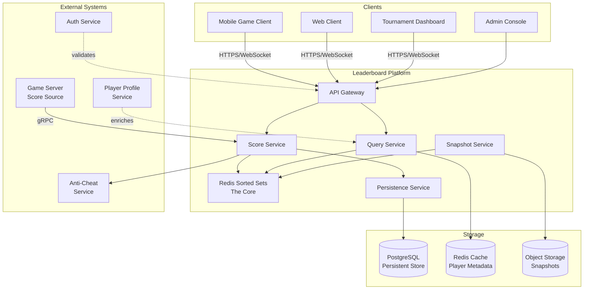

### 1.2 High-Level Architecture

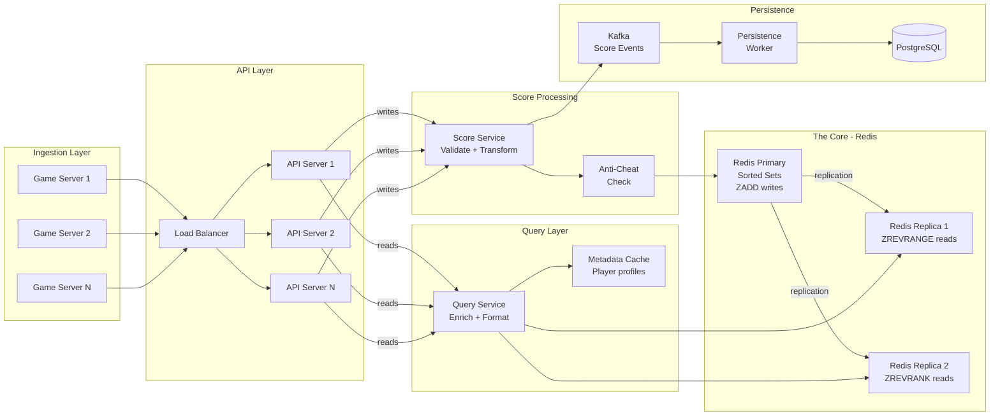

---

## 2. The Core Data Structure: Redis Sorted Set

This is **the single most important section** of the entire design. If you explain
nothing else in the interview, explain this.

### 2.1 What is a Redis Sorted Set?

A Redis Sorted Set is a collection where each member has an associated score. Members
are unique (like a set), but they are **automatically sorted by score** at all times.
Internally, Redis implements sorted sets using two data structures:

```
Redis Sorted Set Internal Implementation:

  1. SKIP LIST (for ordered operations)
     ┌───────────────────────────────────────────────────┐
     │ Level 4: HEAD ──────────────────────────► 99850   │
     │ Level 3: HEAD ────────► 42500 ──────────► 99850   │
     │ Level 2: HEAD ► 15000 ► 42500 ► 78200 ► 99850    │
     │ Level 1: HEAD ► 15000 ► 42500 ► 78200 ► 99850    │
     │                  ↓        ↓        ↓       ↓      │
     │               player   player   player   player   │
     │               "alice"  "bob"    "carol"  "dave"   │
     └───────────────────────────────────────────────────┘

     - Probabilistic data structure (like a balanced BST but simpler)
     - Each node has random "height" (levels of forward pointers)
     - Average O(log N) for insert, delete, rank lookup, range query
     - Stores span counts at each level for O(log N) rank calculation

  2. HASH TABLE (for O(1) point lookups)
     ┌──────────────────────────────┐
     │ "alice" → score: 15000      │
     │ "bob"   → score: 42500      │
     │ "carol" → score: 78200      │
     │ "dave"  → score: 99850      │
     └──────────────────────────────┘

     - O(1) lookup: "what is alice's score?"
     - O(1) existence check: "is alice on the board?"

  Together, they give the best of both worlds:
    - Ordered operations (rank, range) → skip list → O(log N)
    - Point lookups (score, exists)    → hash table → O(1)
```

### 2.2 Redis Commands for Leaderboard Operations

Every leaderboard operation maps to exactly one Redis command:

```
┌─────────────────────┬──────────────────────────────┬───────────────┐
│ Leaderboard Op      │ Redis Command                │ Complexity    │
├─────────────────────┼──────────────────────────────┼───────────────┤
│ Submit/update score  │ ZADD board_id score player   │ O(log N)      │
│ Get rank (0-based)  │ ZREVRANK board_id player      │ O(log N)      │
│ Top-K players       │ ZREVRANGE board_id 0 K-1      │ O(K + log N)  │
│   (with scores)     │  WITHSCORES                   │               │
│ Get player's score  │ ZSCORE board_id player        │ O(1)          │
│ Players around rank │ ZREVRANGE board_id R-5 R+5    │ O(K + log N)  │
│ Remove player       │ ZREM board_id player          │ O(log N)      │
│ Total player count  │ ZCARD board_id                │ O(1)          │
│ Count in score range│ ZCOUNT board_id min max       │ O(log N)      │
│ Conditional update  │ ZADD board_id GT score player │ O(log N)      │
│   (only if higher)  │                               │               │
└─────────────────────┴──────────────────────────────┴───────────────┘
```

### 2.3 Command Examples (What the Code Actually Looks Like)

```redis
-- 1. Player "alice" scores 4250 points
ZADD all_time 4250 "alice"
-- Result: (integer) 1  (new member added)

-- 2. Player "alice" gets a higher score of 4500
ZADD all_time 4500 "alice"
-- Result: (integer) 0  (existing member updated, not new)
-- Alice's rank is automatically recalculated!

-- 3. Only update if new score is HIGHER than existing
ZADD all_time GT 4100 "alice"
-- Result: (integer) 0  (4100 < 4500, so score NOT updated)

-- 4. What is alice's rank? (0-based, highest score = rank 0)
ZREVRANK all_time "alice"
-- Result: (integer) 15822  (alice is rank 15823 in 1-based)

-- 5. Top 10 players with scores
ZREVRANGE all_time 0 9 WITHSCORES
-- Result:
-- 1) "pro_gamer_99"
-- 2) "99850"
-- 3) "ninja_slayer"
-- 4) "99720"
-- 5) "speed_demon"
-- 6) "99680"
-- ... (10 players total)

-- 6. Players ranked 15818 to 15828 (around alice's rank)
ZREVRANGE all_time 15817 15827 WITHSCORES
-- Result: 11 players around alice's position

-- 7. How many players total?
ZCARD all_time
-- Result: (integer) 50000000

-- 8. Remove banned player
ZREM all_time "cheater_42"
-- Result: (integer) 1  (removed; all ranks below shift up by 1)

-- 9. What percentile is a score of 4250?
ZCOUNT all_time 4250 +inf
-- Result: (integer) 15823  (15823 players have score >= 4250)
-- Percentile = (50M - 15823) / 50M * 100 = 99.97th percentile
```

---

## 3. Component Design

### 3.1 Score Service (Write Path)

The Score Service is the **single entry point** for all score updates. It validates,
transforms, and writes scores to Redis.

```
+-------------------------------------------------------------------+
|                        SCORE SERVICE                               |
+-------------------------------------------------------------------+
| Responsibilities:                                                  |
|   - Receive score submissions from game servers or API clients     |
|   - Validate score against anti-cheat rules                       |
|   - Compute composite score for tie-breaking                      |
|   - Write to Redis Sorted Set (ZADD)                              |
|   - Publish score event to Kafka for async persistence            |
|   - Return new rank to caller                                     |
+-------------------------------------------------------------------+
| Design Decisions:                                                  |
|   - Stateless -- any instance can process any score               |
|   - Idempotent -- same score submission = same result             |
|   - Validates BEFORE writing to Redis (reject bad scores early)   |
|   - Uses Redis pipeline for multi-board updates (daily + weekly   |
|     + all-time in one round trip)                                 |
+-------------------------------------------------------------------+
```

#### Score Update Flow (Detailed)

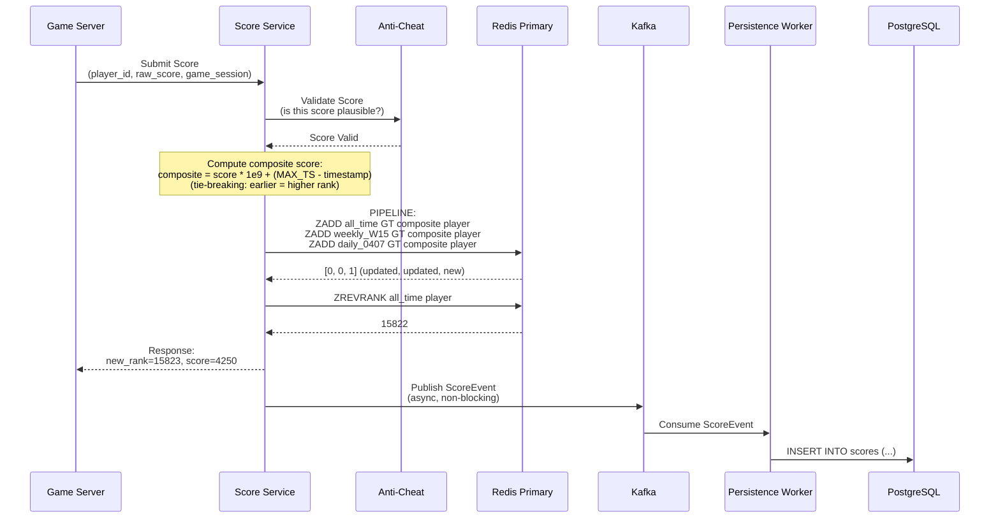

### 3.2 Query Service (Read Path)

The Query Service handles all leaderboard read operations and enriches raw Redis data
with player metadata.

```
+-------------------------------------------------------------------+
|                        QUERY SERVICE                               |
+-------------------------------------------------------------------+
| Responsibilities:                                                  |
|   - Handle top-K, my-rank, relative leaderboard, friend board     |
|   - Read from Redis replicas (not primary, to avoid write impact) |
|   - Enrich player IDs with display names, avatars, country flags  |
|   - Apply caching for hot queries (top-10 changes rarely)         |
|   - Paginate large result sets                                    |
+-------------------------------------------------------------------+
| Design Decisions:                                                  |
|   - Reads from Redis REPLICAS (not primary)                       |
|   - Local LRU cache for top-10/top-100 (TTL: 5 seconds)          |
|   - Batch metadata lookups (HMGET for multiple players at once)   |
|   - Fan-out read for friend leaderboards                          |
+-------------------------------------------------------------------+
```

#### Top-K Query Flow

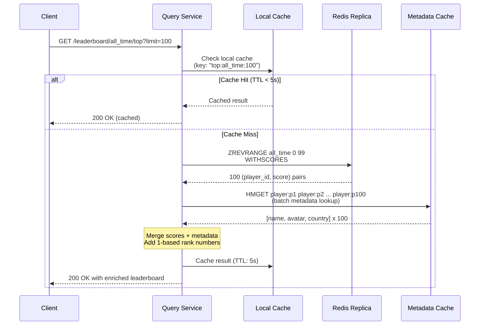

#### My Rank + Relative Leaderboard Flow

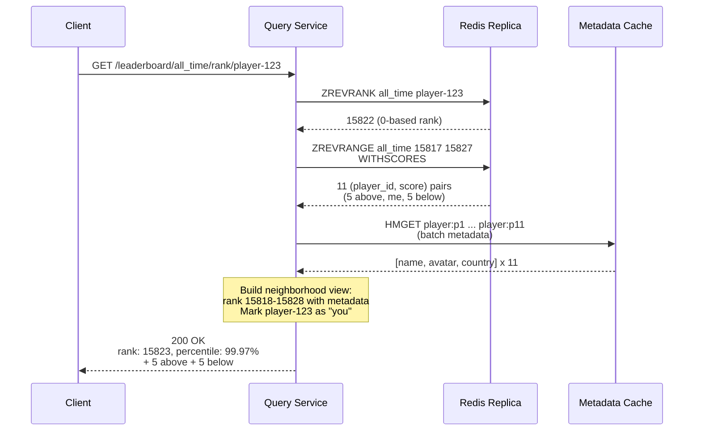

### 3.3 Redis Topology

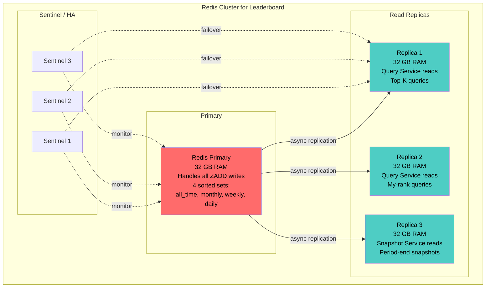

```
Why this topology?

1. Single Primary for writes:
   - 10K ZADD/sec is well within single Redis capacity (100K+ ops/sec)
   - Sorted set operations are fast: O(log N) = ~26 hops for 50M
   - No need for write sharding at this scale

2. Multiple Replicas for reads:
   - 80K reads/sec split across 3 replicas = ~27K each (comfortable)
   - Replica reads have ~0-1ms replication lag (acceptable for leaderboard)
   - A player's rank might be 1ms stale -- nobody notices

3. Sentinel for High Availability:
   - If primary fails, Sentinel promotes a replica in ~30 seconds
   - During failover, writes fail but reads continue from other replicas
   - Application retries failed writes (idempotent with player_id as key)
```

### 3.4 Metadata Cache

Player metadata (display names, avatars, country flags) is stored separately
from the sorted set and cached for fast enrichment.

```
Redis Hash for Player Metadata:

  HSET player:uuid-123 name "ProGamer99" avatar "https://..." country "KR" level 42
  HSET player:uuid-456 name "NinjaSlayer" avatar "https://..." country "US" level 38

  Batch lookup (single round trip for 100 players):
  HMGET player:uuid-123 name avatar country
  HMGET player:uuid-456 name avatar country
  ... (pipelined)

Why separate from the sorted set?
  - Sorted set members should be small (just player_id)
  - Metadata changes independently from scores (name change ≠ re-rank)
  - Metadata can be cached aggressively (TTL: 5 minutes)
  - Sorted set stays lean = less Redis memory for the critical structure
```

---

## 4. Handling Ties: The Composite Score Trick

This is a **frequently asked follow-up** in interviews. If two players have the same
score, who ranks higher?

### 4.1 The Problem

```
Scenario:
  Alice scores 4250 at 2:00 PM
  Bob scores 4250 at 3:00 PM

  Who should be ranked higher?
  Most games: Alice (she achieved the score first)

  But Redis ZADD only stores ONE score per member.
  If both have score=4250, their relative order is UNDEFINED
  (Redis uses lexicographic ordering of member names as fallback,
   which is meaningless for player ranking).
```

### 4.2 The Solution: Composite Score

Encode the timestamp INTO the score so that tied scores are broken by time.

```
Composite Score Formula:
  composite_score = raw_score * TIMESTAMP_RANGE + inverted_timestamp

  Where:
    TIMESTAMP_RANGE = 1,000,000,000 (1e9) -- enough precision for timestamps
    inverted_timestamp = MAX_TIMESTAMP - actual_timestamp

  Example (higher score = better, earlier time = better):
    Alice: raw_score=4250, timestamp=1000 (earlier)
      composite = 4250 * 1e9 + (9999999999 - 1000) = 4250000009999998999

    Bob: raw_score=4250, timestamp=2000 (later)
      composite = 4250 * 1e9 + (9999999999 - 2000) = 4250000009999997999

    Alice's composite > Bob's composite → Alice ranks higher!

  Why invert the timestamp?
    - Redis sorts ASCENDING by default (ZRANGE)
    - We use ZREVRANGE (descending), so higher = better
    - Earlier timestamp → larger inverted value → higher composite → higher rank
    - This means "first to reach this score ranks higher"

  Recovering the raw score for display:
    raw_score = floor(composite_score / 1e9)
    4250 = floor(4250000009999998999 / 1e9)
```

### 4.3 Implementation

```python
# Score Service: computing composite score

MAX_TIMESTAMP = 9_999_999_999  # Far future epoch (year ~2286)

def compute_composite_score(raw_score: int, timestamp_ms: int) -> float:
    """
    Encode raw score and timestamp into a single float for Redis.
    Higher raw score = higher rank.
    Same raw score + earlier timestamp = higher rank.
    """
    inverted_ts = MAX_TIMESTAMP - (timestamp_ms // 1000)  # Second precision
    composite = raw_score * 1_000_000_000 + inverted_ts
    return float(composite)

def extract_raw_score(composite_score: float) -> int:
    """Recover the display score from the composite."""
    return int(composite_score // 1_000_000_000)

# Example usage:
# Alice scores 4250 at timestamp 1712500000000 (earlier)
alice_composite = compute_composite_score(4250, 1712500000000)
# = 4250 * 1e9 + (9999999999 - 1712500000) = 4250008287499999.0

# Bob scores 4250 at timestamp 1712503600000 (1 hour later)
bob_composite = compute_composite_score(4250, 1712503600000)
# = 4250 * 1e9 + (9999999999 - 1712503600) = 4250008287496399.0

# alice_composite > bob_composite → Alice ranks higher (she scored first)
```

### 4.4 Precision Considerations

```
IEEE 754 double-precision floating point has 53 bits of mantissa.
  Maximum exact integer: 2^53 = 9,007,199,254,740,992

Our composite score:
  max_raw_score * 1e9 + max_inverted_ts
  = 999,999 * 1e9 + 9,999,999,999
  = 999,999,009,999,999,999

  This is ~1e18, which exceeds 2^53 (~9e15).

  SOLUTION: If raw scores can exceed ~9,000:
    Option A: Use 1e6 instead of 1e9 (millisecond precision → second precision)
    Option B: Use Redis string encoding with ZADD (scores are stored as strings internally)
    Option C: Use a smaller timestamp epoch (seconds since game launch, not Unix epoch)

  For most games (scores 0-999,999, timestamps in seconds):
    1e6 precision is sufficient and stays within double precision.
    composite = raw_score * 1_000_000 + inverted_ts
    Max = 999,999 * 1e6 + 999,999 = 999,999,999,999 (~1e12) ✓ fits in double
```

---

## 5. Time-Scoped Leaderboards

### 5.1 Strategy: Separate Sorted Sets Per Period

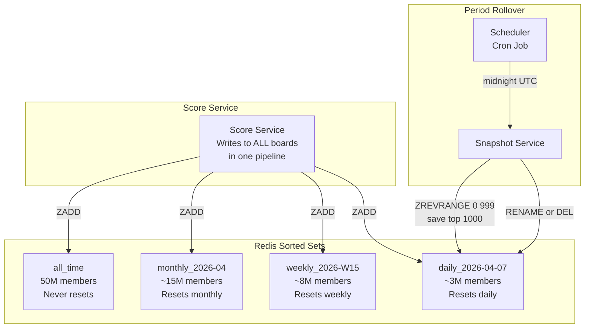

### 5.2 Multi-Board Write (Redis Pipeline)

When a player submits a score, we update ALL relevant boards in a single Redis
pipeline (one network round trip):

```redis
-- Single pipeline, single round trip
MULTI
ZADD all_time GT 4250000009999998999 "player-123"
ZADD monthly_2026-04 GT 4250000009999998999 "player-123"
ZADD weekly_2026-W15 GT 4250000009999998999 "player-123"
ZADD daily_2026-04-07 GT 4250000009999998999 "player-123"
EXEC

-- 4 commands, 1 round trip, ~1ms total
-- GT flag: only update if new score > existing score
```

### 5.3 Period Rollover Strategy

```
Daily Rollover (at midnight UTC):
  1. Snapshot Service reads top-K from expiring board:
     ZREVRANGE daily_2026-04-06 0 999 WITHSCORES
  2. Write snapshot to PostgreSQL (for rewards/history)
  3. Delete expired board:
     DEL daily_2026-04-06
  4. New board auto-created on first ZADD:
     ZADD daily_2026-04-07 ...  (Redis creates key lazily)

Weekly Rollover (Monday 00:00 UTC):
  Same pattern: snapshot → persist → delete old → new auto-created

Monthly Rollover (1st of month 00:00 UTC):
  Same pattern

All-time board:
  Never rolls over. Grows forever (or until player is inactive for 1 year).

Key Naming Convention:
  all_time                  -- permanent
  monthly_{YYYY-MM}         -- monthly_2026-04
  weekly_{YYYY-Www}         -- weekly_2026-W15
  daily_{YYYY-MM-DD}        -- daily_2026-04-07
  tournament_{tournament_id} -- event-specific boards
```

### 5.4 Rollover Timing and Safety

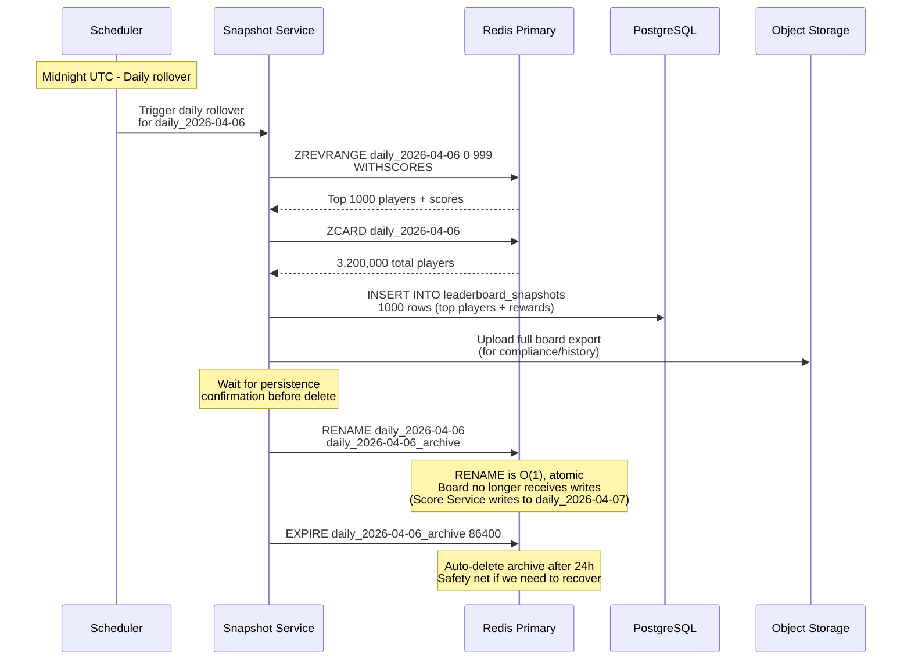

---

## 6. Friend Leaderboard

The friend leaderboard is architecturally different from the global leaderboard because
it is **personalized per player** -- each player sees a different board.

### 6.1 The Challenge

```
Global leaderboard: 1 sorted set, 50M members, everyone sees the same view
Friend leaderboard: N sorted sets? One per player? 50M sorted sets??

Options:
  A. Pre-compute a sorted set per player (fan-out on write)
     - 50M sorted sets x 50 friends each = 2.5 billion entries
     - Every score update fans out to all friends' boards
     - Writes: 10K/sec x 50 friends = 500K writes/sec → too much

  B. Compute on read (fan-out on read)  ✓ BETTER
     - When player requests friend board:
       1. Fetch friend list: [friend_1, friend_2, ..., friend_50]
       2. Fetch each friend's score from global board: ZSCORE x 50
       3. Sort in application code
       4. Return sorted list
     - Reads: 50 ZSCORE calls per request → pipeline to 1 round trip

  C. Per-player sorted set, populated lazily (hybrid)
     - Create friend board only when requested
     - Cache for 60 seconds
     - Invalidate on friend score update (pub/sub)
```

### 6.2 Fan-Out Read Implementation (Option B)

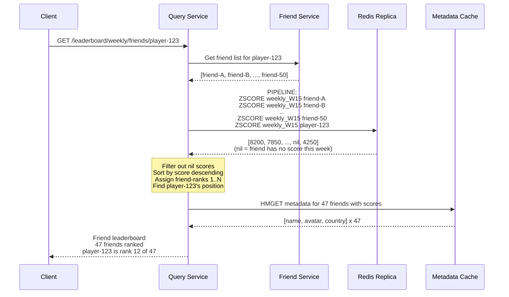

```
Performance Analysis:
  - Friend list lookup: 1 call to Friend Service (~5ms with cache)
  - 51 ZSCORE calls pipelined: 1 Redis round trip (~1ms)
  - Sort 50 items in memory: negligible
  - Metadata enrichment: 1 pipelined HMGET (~1ms)
  - Total: ~8ms (well under 50ms target)

  This approach works because friend lists are small (typically <200).
  For a social network with 5000 friends, consider Option C (cached per-player set).
```

---

## 7. End-to-End Flows

### 7.1 Complete Score Update Flow

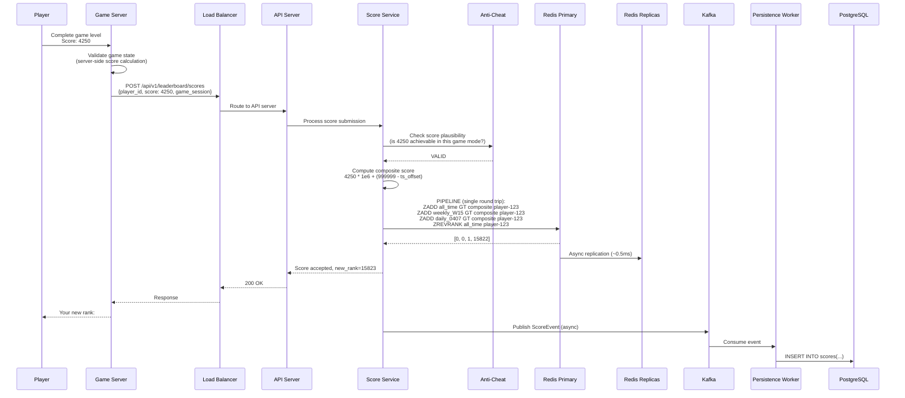

### 7.2 Complete Top-K Query Flow

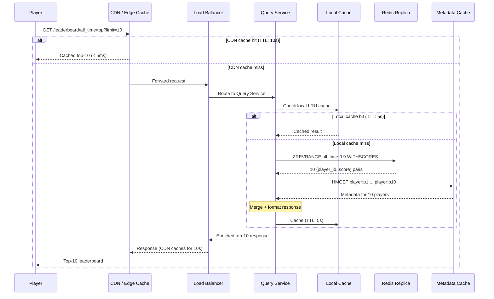

---

## 8. Data Model Summary

### 8.1 Redis Data Model

```
Key                          | Type        | Contents                    | Size
-----------------------------|-------------|-----------------------------|--------
all_time                     | Sorted Set  | 50M (player_id → composite) | ~6 GB
monthly_2026-04              | Sorted Set  | 15M entries                 | ~1.8 GB
weekly_2026-W15              | Sorted Set  | 8M entries                  | ~1 GB
daily_2026-04-07             | Sorted Set  | 3M entries                  | ~370 MB
player:{uuid}                | Hash        | name, avatar, country, level| ~200 B each
                             |             | 50M hashes                  | ~10 GB
-----------------------------|-------------|-----------------------------|--------
Total Redis memory:          |             |                             | ~20 GB
With overhead (1.5x):        |             |                             | ~30 GB
```

### 8.2 PostgreSQL Data Model

```
Table                    | Row Count       | Purpose
-------------------------|-----------------|----------------------------------
players                  | 50M             | Player profiles (source of truth)
scores                   | 750M (30 days)  | Score history with game sessions
leaderboard_snapshots    | ~30K/month      | Period-end top-1000 for rewards
friendships              | 2.5B            | Bidirectional friend edges
```

---

## 9. Technology Stack Summary

| Component | Technology | Rationale |
|-----------|-----------|-----------|
| **Leaderboard Core** | Redis 7+ Sorted Set | O(log N) for all operations; industry standard |
| **Metadata Cache** | Redis Hashes (same cluster) | Co-located with leaderboard for single hop |
| **API Servers** | Go / Node.js | High concurrency, low overhead |
| **Event Streaming** | Kafka | Decouple score writes from persistence |
| **Persistent Store** | PostgreSQL | ACID for player data, scores, snapshots |
| **CDN** | CloudFront / Fastly | Edge cache for top-K (10s TTL) |
| **Load Balancer** | Nginx / ALB | Route API traffic, TLS termination |
| **Monitoring** | Prometheus + Grafana | Redis ops/sec, latency percentiles |
| **Scheduler** | Kubernetes CronJob | Period rollovers (daily/weekly/monthly) |

---

## 10. Key Design Decisions Summary

| Decision | Choice | Alternative | Why |
|----------|--------|------------|-----|
| Core data structure | Redis Sorted Set | SQL ORDER BY, custom B-tree | O(log N) all ops, battle-tested, zero maintenance |
| Tie-breaking | Composite score (score * 1e6 + inverted_ts) | Separate sort key | Single ZADD call; no secondary index needed |
| Write topology | Single Redis primary | Multi-primary | 10K writes/sec is easily handled by one instance |
| Read scaling | Redis replicas | Application-level cache only | Replicas are consistent, cache may go stale |
| Time-scoped boards | Separate sorted sets | TTL on members / partitioned table | Clean rollover, independent sizing, simple code |
| Friend leaderboard | Fan-out on read | Fan-out on write (per-user sorted set) | 50 ZSCORE calls < maintaining 50M extra sorted sets |
| Persistence | Async to PostgreSQL via Kafka | Synchronous DB write | DB write on hot path adds 20-50ms; unacceptable |
| Top-K caching | CDN + local LRU (5-10s TTL) | No caching | Top-10 changes ~once/minute; cache saves 99% of reads |
| Metadata storage | Separate Redis Hash | Embedded in sorted set member | Sorted set stays lean; metadata changes independently |
| Score validation | Anti-cheat service (async-ish) | Trust client scores | Never trust the client; server-side validation is essential |
