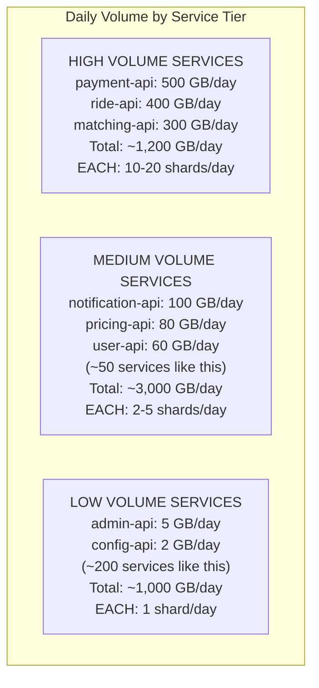
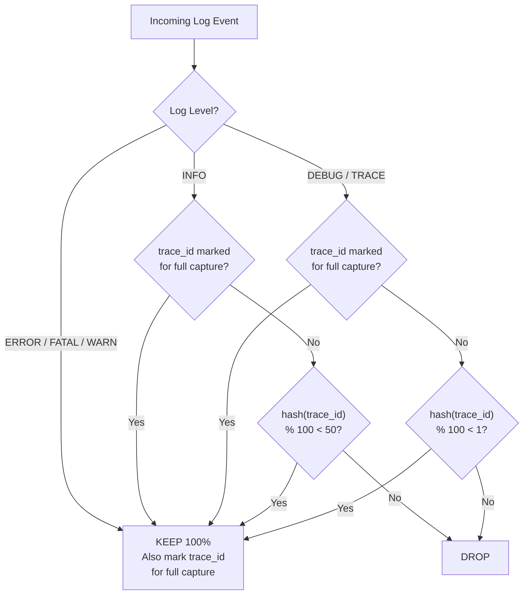
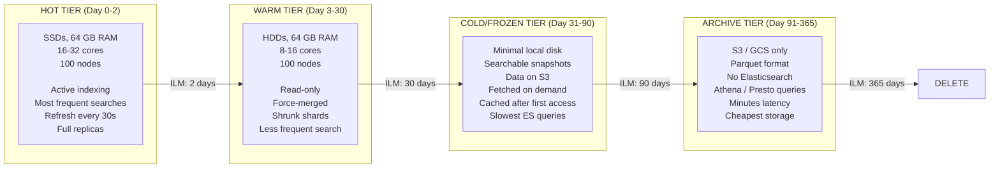
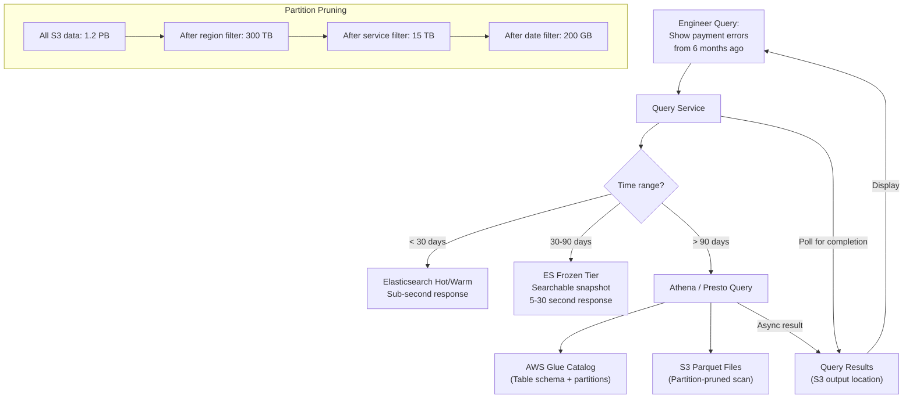
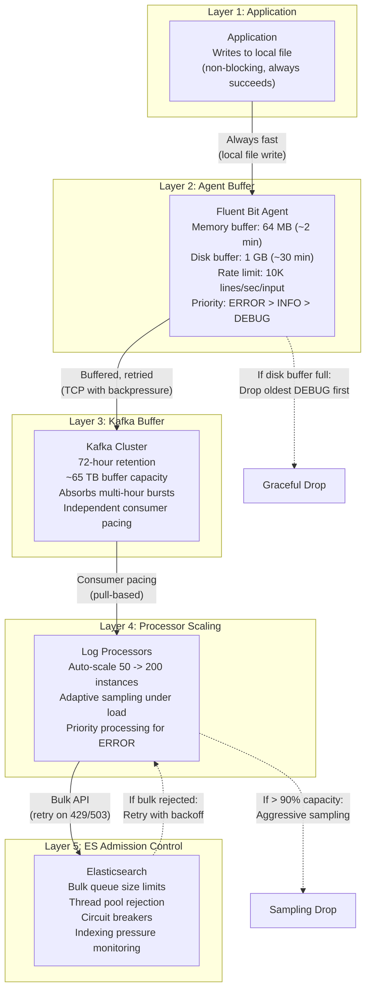
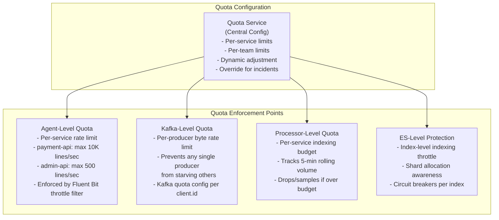
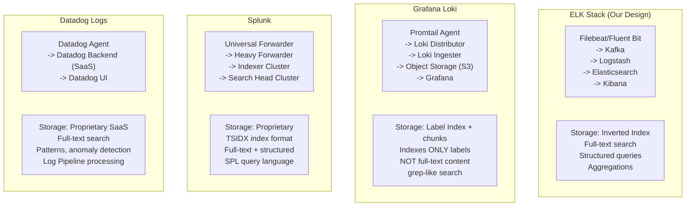
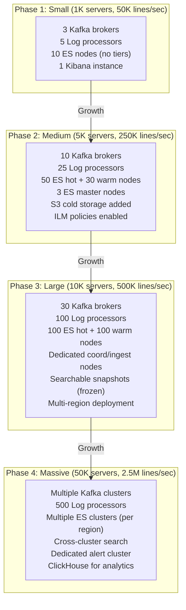
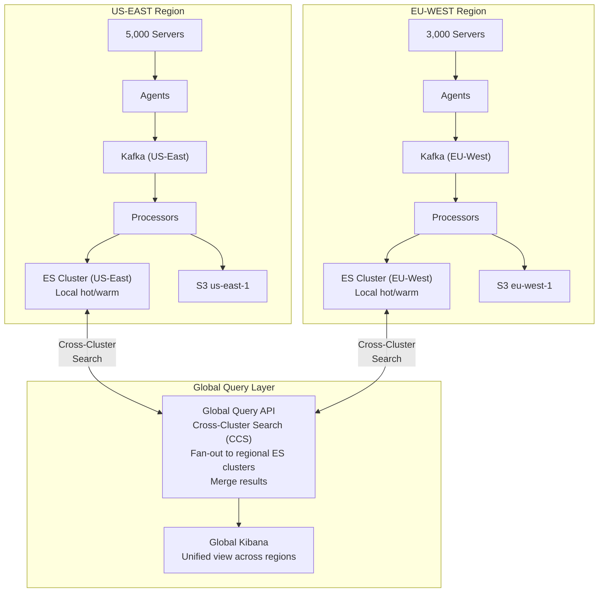
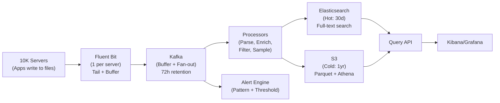

# Design a Distributed Logging System (ELK/Splunk): Deep Dive and Scaling

## Table of Contents
- [1. Deep Dive #1: Elasticsearch Index Sizing and Shard Strategy](#1-deep-dive-1-elasticsearch-index-sizing-and-shard-strategy)
- [2. Deep Dive #2: Log Sampling at Scale](#2-deep-dive-2-log-sampling-at-scale)
- [3. Deep Dive #3: Hot-Cold Architecture with ILM](#3-deep-dive-3-hot-cold-architecture-with-ilm)
- [4. Deep Dive #4: Handling Backpressure and Burst Traffic](#4-deep-dive-4-handling-backpressure-and-burst-traffic)
- [5. Deep Dive #5: Multi-Tenancy and Quota Management](#5-deep-dive-5-multi-tenancy-and-quota-management)
- [6. Comparison: ELK vs Loki vs Splunk vs Datadog Logs](#6-comparison-elk-vs-loki-vs-splunk-vs-datadog-logs)
- [7. Scaling Strategies](#7-scaling-strategies)
- [8. Failure Modes and Mitigations](#8-failure-modes-and-mitigations)
- [9. Trade-offs and Design Decisions](#9-trade-offs-and-design-decisions)
- [10. Interview Tips and Common Mistakes](#10-interview-tips-and-common-mistakes)

---

## 1. Deep Dive #1: Elasticsearch Index Sizing and Shard Strategy

### 1.1 Why Shard Strategy Matters

```
THE CORE PROBLEM:

Elasticsearch performance is heavily dependent on shard count and shard size.
Too few shards -> can't parallelize, hot spots, can't scale writes.
Too many shards -> cluster state bloat, high overhead per search, master node strain.
Wrong shard size -> either wasted resources or slow queries.

At our scale (21.6 TB/day, 30-day retention), getting this wrong means the
difference between 3-second queries and 30-second queries, or between a stable
cluster and one that crashes weekly.
```

### 1.2 Shard Sizing Guidelines

```
ELASTICSEARCH BEST PRACTICES (from Elastic's own guidance):

+-------------------------------+----------------------------+
| Parameter                     | Recommended Value          |
+-------------------------------+----------------------------+
| Shard size                    | 20-50 GB each              |
| Shards per GB of heap         | < 20 shards per GB         |
| Max shards per node           | < 600-1000                 |
| Total cluster shards          | < 10,000-20,000            |
| Heap per data node            | 30-31 GB (never exceed 32) |
| Docs per shard                | < 2 billion                |
+-------------------------------+----------------------------+

WHY 20-50 GB PER SHARD?
  - < 20 GB: Too many shards needed, high overhead
  - > 50 GB: Segment merges slow down, recovery takes too long
  - Lucene segments within each shard work best at this size
```

### 1.3 Shard Calculation for Our System



```
DETAILED SHARD MATH:

High-volume services (10 services):
  10 services x 15 shards/day x 1 replica = 300 shards/day

Medium-volume services (50 services):
  50 services x 3 shards/day x 1 replica = 300 shards/day

Low-volume services (200 services):
  200 services x 1 shard/day x 1 replica = 400 shards/day

Total shards per day: 1,000 shards/day (including replicas)

For 30-day hot window: 1,000 x 2 (hot days) = 2,000 shards
For warm window: 1,000 x 28 = 28,000 shards

PROBLEM: 30,000 shards is TOO MANY!

SOLUTION: Shrink + merge indices when moving to warm tier:
  - Warm indices: force-merge to 1 segment, shrink to 1/5th shard count
  - 28,000 / 5 = 5,600 warm shards
  - Hot: 2,000 + Warm: 5,600 = 7,600 total shards (acceptable)

ALTERNATIVE: Rollup old indices into larger combined indices
  - After 7 days, merge daily indices into weekly indices
  - After 30 days, merge into monthly indices
  - Drastically reduces shard count for older data
```

### 1.4 Dynamic Shard Allocation Per Service

```python
# Pseudocode: auto-calculate shard count based on service volume

def calculate_shards_for_service(service_name, daily_volume_gb):
    """
    Dynamically set shard count when creating a daily index.
    Target: 30 GB per shard.
    """
    TARGET_SHARD_SIZE_GB = 30
    MIN_SHARDS = 1
    MAX_SHARDS = 20

    # Calculate needed shards (with Elasticsearch overhead factor 1.3x)
    effective_volume = daily_volume_gb * 1.3  # indexing overhead
    num_shards = max(MIN_SHARDS, min(MAX_SHARDS,
                     math.ceil(effective_volume / TARGET_SHARD_SIZE_GB)))

    return {
        "index": f"logs-{service_name}-{today}",
        "settings": {
            "number_of_shards": num_shards,
            "number_of_replicas": 1,
            "routing.allocation.require.data": "hot"
        }
    }

# Examples:
# payment-api (500 GB/day) -> 22 shards (capped at 20)
# notification-api (100 GB/day) -> 5 shards
# admin-api (5 GB/day) -> 1 shard
```

### 1.5 Index Template Hierarchy

```
INDEX TEMPLATES (applied in order of priority):

1. Global template (lowest priority):
   Pattern: logs-*
   Settings: codec=best_compression, refresh=30s, replicas=1

2. Service-tier templates:
   Pattern: logs-payment-*
   Settings: shards=15, replicas=1

   Pattern: logs-ride-*
   Settings: shards=12, replicas=1

3. Override template (highest priority, emergency):
   Pattern: logs-debug-*
   Settings: shards=1, replicas=0  (debug logs: fewer resources)

MAPPING TEMPLATE:
  - All keyword fields use doc_values=true (for sorting/aggregations)
  - The message field uses text type with standard analyzer
  - Stack traces stored but NOT indexed (saves huge space)
  - Dynamic mapping disabled to prevent mapping explosions
  
  "dynamic": "strict"  -- rejects unmapped fields
  OR
  "dynamic": "false"   -- stores but doesn't index unmapped fields
  
  WARNING: "dynamic": "true" (default) is DANGEROUS at scale.
  One service adding a high-cardinality field can explode mappings
  and bring down the cluster.
```

---

## 2. Deep Dive #2: Log Sampling at Scale

### 2.1 The Sampling Problem

```
WITHOUT SAMPLING:
  500K lines/sec x 500 bytes = 250 MB/sec = 21.6 TB/day
  30-day hot storage: ~2 PB in Elasticsearch
  Cost: ~$150K-200K/month for ES cluster alone

WITH INTELLIGENT SAMPLING:
  ~190K lines/sec effective = 95 MB/sec = 8.2 TB/day
  30-day hot storage: ~750 TB in Elasticsearch
  Cost: ~$55K-75K/month
  
  SAVINGS: ~60% reduction in storage and compute cost

BUT: You cannot randomly drop logs. If an ERROR occurs and you've
dropped the preceding INFO/DEBUG context, debugging is impossible.
```

### 2.2 Trace-Aware Sampling



### 2.3 Implementation Details

```python
import hashlib
from datetime import datetime, timedelta

# Redis set of trace_ids that should be fully captured
# Key: "full_capture_traces", TTL: 10 minutes
FULL_CAPTURE_KEY = "full_capture_traces"

SAMPLE_RATES = {
    "FATAL": 1.0,     # 100% -- always keep
    "ERROR": 1.0,     # 100% -- always keep
    "WARN":  1.0,     # 100% -- always keep
    "INFO":  0.50,    # 50%  -- half
    "DEBUG": 0.01,    # 1%   -- heavily sampled
    "TRACE": 0.001,   # 0.1% -- almost none
}

def process_log(log_event, redis_client):
    level = log_event.get("level", "INFO")
    trace_id = log_event.get("trace_id", "")
    
    # RULE 1: Always keep high-severity logs
    if level in ("FATAL", "ERROR"):
        # Mark this trace for full capture (retroactive and forward)
        if trace_id:
            redis_client.sadd(FULL_CAPTURE_KEY, trace_id)
            redis_client.expire(FULL_CAPTURE_KEY, 600)  # 10 min TTL
        return True  # KEEP
    
    # RULE 2: Always keep WARN
    if level == "WARN":
        return True
    
    # RULE 3: If this trace had an error, keep ALL its logs
    if trace_id and redis_client.sismember(FULL_CAPTURE_KEY, trace_id):
        return True  # KEEP (full trace context)
    
    # RULE 4: Deterministic hash-based sampling
    # Using trace_id ensures all logs from the same trace are either
    # all kept or all dropped -- no partial traces
    sample_rate = SAMPLE_RATES.get(level, 0.5)
    if not trace_id:
        trace_id = log_event.get("request_id", str(datetime.now()))
    
    hash_value = int(hashlib.md5(trace_id.encode()).hexdigest(), 16)
    return (hash_value % 10000) < (sample_rate * 10000)


# CRITICAL INSIGHT:
# Hash on trace_id (not random) ensures consistency.
# If we sample 1% of DEBUG logs, we get COMPLETE traces for 1% of requests,
# rather than random 1% of individual log lines (which gives incomplete
# traces for many requests).
```

### 2.4 Head-Based vs Tail-Based Sampling

```
HEAD-BASED SAMPLING (decide at request start):
  +----------------------------------------------------+
  | At API gateway, decide: "This request gets full    |
  | logging" (based on trace_id hash).                 |
  | Propagate decision to all downstream services.     |
  +----------------------------------------------------+
  
  Pros:
    - All-or-nothing per trace (cleanest)
    - Decision is cheap and fast
    - No need for retroactive capture
  
  Cons:
    - Cannot keep logs for requests that fail unexpectedly
    - A 1% sample rate means 99% of errors have no context
    - Useless for debugging rare issues

TAIL-BASED SAMPLING (decide after seeing the outcome):
  +----------------------------------------------------+
  | Buffer all logs for a trace in memory/Kafka.       |
  | If any log is ERROR/FATAL, flush ALL buffered logs.|
  | If trace completes normally, apply sample rate.    |
  +----------------------------------------------------+
  
  Pros:
    - Guaranteed full context for every error
    - Best of both worlds: low volume + full debug capability
  
  Cons:
    - Requires buffering (memory/latency overhead)
    - Trace can span minutes -> large buffer window needed
    - More complex implementation

OUR DESIGN: HYBRID APPROACH
  - Head-based: Hash on trace_id for deterministic baseline sampling
  - Tail-based: Redis "full capture" set for error-triggered retroactive capture
  - Forward capture: Once a trace is marked, all FUTURE logs in that trace are kept
  - Limitation: Past logs already dropped before the error are lost
    (acceptable trade-off vs. full tail-based buffering complexity)
```

### 2.5 Adaptive Sampling Under Load

```
NORMAL LOAD (< 70% pipeline capacity):
  Apply standard sample rates from SAMPLE_RATES table.
  
ELEVATED LOAD (70-90% capacity):
  Tighten sampling:
    INFO:  50% -> 20%
    DEBUG: 1%  -> 0.1%
    TRACE: 0.1% -> 0% (drop all)
  
CRITICAL LOAD (> 90% capacity):
  Emergency sampling:
    INFO:  20% -> 5%
    DEBUG: 0.1% -> 0%
    TRACE: 0%
  
  NEVER drop ERROR/FATAL regardless of load.
  
  def get_adaptive_sample_rate(level, pipeline_utilization):
      base_rate = SAMPLE_RATES[level]
      if pipeline_utilization > 0.9:
          return base_rate * 0.1  # 10% of normal
      elif pipeline_utilization > 0.7:
          return base_rate * 0.4  # 40% of normal
      return base_rate
```

---

## 3. Deep Dive #3: Hot-Cold Architecture with ILM

### 3.1 The Four Tiers



### 3.2 Cost Comparison Across Tiers

```
+----------------+----------------+------------------+------------------+
| Tier           | Storage Cost   | Compute Cost     | Query Latency    |
|                | (per TB/month) | (per node/month) |                  |
+----------------+----------------+------------------+------------------+
| HOT (SSD)      | $200-400       | $2,000-4,000     | < 1 second       |
|                | (gp3 EBS)     | (c5.4xlarge)     |                  |
+----------------+----------------+------------------+------------------+
| WARM (HDD)     | $50-100        | $1,000-2,000     | 1-5 seconds      |
|                | (st1 EBS)     | (r5.2xlarge)     |                  |
+----------------+----------------+------------------+------------------+
| COLD (Frozen)  | $23            | $500-1,000       | 5-30 seconds     |
|                | (S3 Standard)  | (minimal local)  | (first access)   |
+----------------+----------------+------------------+------------------+
| ARCHIVE (S3)   | $23            | $0 (serverless   | 30 sec - 5 min   |
|                | (S3 Standard)  | Athena on demand) |                  |
+----------------+----------------+------------------+------------------+

MONTHLY COST ESTIMATE FOR OUR SYSTEM:

Hot tier:   100 nodes x $3,000/node + 1,000 TB x $300/TB = $600,000
Warm tier:  100 nodes x $1,500/node + 1,000 TB x $75/TB  = $225,000
Cold tier:  1,000 TB x $23/TB + 10 nodes x $750            = $30,500
Archive:    1,200 TB x $23/TB + Athena queries              = $28,000

TOTAL: ~$884,000/month (~$10.6M/year)

WITHOUT TIERING (everything on hot):
  12 months x 21.6 TB/day x 365 x $300/TB = WAY more
  Hot-cold tiering saves 60-70% of total cost.
```

### 3.3 Searchable Snapshots (Frozen Tier)

```
HOW SEARCHABLE SNAPSHOTS WORK:

Traditional ES index:
  [Shard data on local SSD] -> Fast queries, expensive storage

Searchable snapshot:
  [Shard data in S3] --on demand--> [Local cache on small SSD]
  
  First query to a frozen index:
    1. ES receives search request
    2. Determines which segments/blocks needed
    3. Downloads ONLY the needed blocks from S3 (not entire shard)
    4. Caches downloaded blocks locally
    5. Executes search on cached data
    6. Returns results
    
  Subsequent queries to same data:
    1. Cache hit -> served from local SSD
    2. Much faster (similar to warm tier)

  LATENCY PROFILE:
    First query (cache miss):  5-30 seconds
    Repeat query (cache hit):  1-5 seconds
    
  This is acceptable for logs older than 30 days -- engineers rarely
  search old logs, and when they do, they can wait a few seconds.
```

### 3.4 Cold Storage Query Architecture



---

## 4. Deep Dive #4: Handling Backpressure and Burst Traffic

### 4.1 The Burst Problem

```
NORMAL:     500K lines/sec (baseline)
DEPLOY:     800K lines/sec (verbose logging during deploy)
INCIDENT:   2M lines/sec (error storms, retry amplification)
WORST CASE: 5M lines/sec (cascading failure across all services)

The logging system MUST handle these bursts without:
  1. Losing ERROR/FATAL logs (ever)
  2. Crashing any component
  3. Causing backpressure to affect application performance
  4. Falling so far behind that logs are hours late
```

### 4.2 Multi-Layer Backpressure Architecture



### 4.3 Priority Queue Processing

```
DURING BURST, log processors implement priority processing:

PRIORITY 1 (ALWAYS PROCESS):
  - FATAL logs
  - ERROR logs
  - Logs matching active alert rules
  - Logs from tier=critical services

PRIORITY 2 (PROCESS IF CAPACITY):
  - WARN logs
  - INFO logs from critical services

PRIORITY 3 (BEST EFFORT):
  - INFO logs from non-critical services
  - DEBUG logs (even the sampled 1%)

IMPLEMENTATION:
  Three Kafka consumer groups with different priorities:
  
  Consumer Group "critical":   100 instances, reads ONLY ERROR/FATAL
  Consumer Group "standard":   50 instances, reads WARN/INFO
  Consumer Group "background": 20 instances, reads DEBUG/TRACE
  
  During burst: scale "critical" group, pause "background" group
```

---

## 5. Deep Dive #5: Multi-Tenancy and Quota Management

### 5.1 The Noisy Neighbor Problem

```
SCENARIO:
  Team A deploys a bug that causes their service to log 100x normal volume.
  One service now produces 50% of all logs.
  
  WITHOUT QUOTAS:
  - Kafka partitions for that service lag behind
  - ES bulk queue fills up
  - ALL other services' logs are delayed
  - Engineers from Team B can't search their logs during an incident
  - The logging system becomes useless for everyone

  WITH QUOTAS:
  - Team A's excess logs are sampled/dropped at the agent level
  - Team A gets a notification: "Exceeding logging quota"
  - All other services are unaffected
  - Logging system remains useful
```

### 5.2 Quota Architecture



### 5.3 Per-Service Quota Table

```
+-------------------+-------------------+-------------------+-------------------+
| Service Tier      | Ingest Limit      | Storage Limit     | Overage Action    |
|                   | (lines/sec)       | (GB/day)          |                   |
+-------------------+-------------------+-------------------+-------------------+
| Critical (T1)     | 20,000            | 1,000             | Alert team, then  |
| payment, ride     |                   |                   | sample INFO at 10%|
+-------------------+-------------------+-------------------+-------------------+
| Standard (T2)     | 5,000             | 250               | Alert team, then  |
| notification, map |                   |                   | sample INFO at 5% |
+-------------------+-------------------+-------------------+-------------------+
| Low (T3)          | 1,000             | 50                | Alert team, then  |
| admin, config     |                   |                   | hard drop excess  |
+-------------------+-------------------+-------------------+-------------------+
| Debug/Test        | 500               | 10                | Hard drop excess  |
| dev environments  |                   |                   | immediately       |
+-------------------+-------------------+-------------------+-------------------+
```

---

## 6. Comparison: ELK vs Loki vs Splunk vs Datadog Logs

### 6.1 Architecture Comparison



### 6.2 Detailed Comparison Table

```
+-------------------+--------------------+--------------------+--------------------+--------------------+
| Dimension         | ELK Stack          | Grafana Loki       | Splunk Enterprise  | Datadog Logs       |
+-------------------+--------------------+--------------------+--------------------+--------------------+
| FULL-TEXT SEARCH   | Excellent          | Poor (grep-like)   | Excellent          | Good               |
|                   | Inverted index     | Only label index   | Proprietary index  | SaaS optimized     |
|                   | Lucene-powered     | Content NOT indexed| TSIDX format       |                    |
+-------------------+--------------------+--------------------+--------------------+--------------------+
| QUERY LANGUAGE    | Lucene / KQL /     | LogQL (PromQL-like)| SPL (powerful,     | Faceted search +   |
|                   | ES Query DSL       |                    | complex)           | log patterns       |
+-------------------+--------------------+--------------------+--------------------+--------------------+
| STORAGE COST      | High (index        | LOW (only labels   | Very High          | Very High          |
|                   | everything)        | indexed, content   | (proprietary       | ($2.55/GB ingested |
|                   |                    | in cheap chunks)   | licensing)         | after 10 GB/day)   |
+-------------------+--------------------+--------------------+--------------------+--------------------+
| OPERATIONAL       | HIGH               | Low-Medium         | Medium             | ZERO               |
| COMPLEXITY        | (ES cluster mgmt   | (simpler arch,     | (managed product   | (fully managed     |
|                   | is notoriously     | uses object store) | but still on-prem) | SaaS)              |
|                   | difficult)         |                    |                    |                    |
+-------------------+--------------------+--------------------+--------------------+--------------------+
| SCALABILITY       | Horizontal but     | Very good          | Good with cluster  | Essentially        |
|                   | complex (shard     | (stateless, S3     | but expensive at   | unlimited (SaaS)   |
|                   | management)        | backed)            | scale)             |                    |
+-------------------+--------------------+--------------------+--------------------+--------------------+
| BEST FOR          | Full-text search   | K8s-native, cost-  | Enterprise with    | Teams who want     |
|                   | at scale, complex  | sensitive, Grafana  | budget, compliance | zero ops overhead  |
|                   | queries, analytics | already in use     | requirements       |                    |
+-------------------+--------------------+--------------------+--------------------+--------------------+
| COST AT SCALE     | $10-15M/year       | $2-5M/year         | $15-30M/year       | $20-40M/year       |
| (21 TB/day)       | (self-managed)     | (S3 + compute)     | (license + HW)     | (SaaS pricing)     |
+-------------------+--------------------+--------------------+--------------------+--------------------+
```

### 6.3 When to Choose What

```
CHOOSE ELK WHEN:
  - You need powerful full-text search across log content
  - You have the ops team to manage Elasticsearch clusters
  - You need complex aggregation queries
  - You're building a logging platform as a product (internal or external)

CHOOSE LOKI WHEN:
  - You're already using Grafana for metrics
  - Cost is a primary concern (10x cheaper than ELK for same volume)
  - Most queries are filtered by labels (service, level), not free-text
  - You're Kubernetes-native and want simple operations
  - You can tolerate slower free-text search (grep, not index)

CHOOSE SPLUNK WHEN:
  - Enterprise with compliance/security requirements (SIEM use case)
  - Budget is not a constraint
  - You need the powerful SPL query language
  - You want a mature, fully-featured product with support contracts

CHOOSE DATADOG LOGS WHEN:
  - You want zero operational overhead (SaaS)
  - You're already using Datadog for metrics and APM
  - Budget for logging is < 5 TB/day (cost explodes above this)
  - You value developer experience and out-of-the-box features
```

### 6.4 Loki Deep Dive (The Key Alternative)

```
WHY LOKI IS INTERESTING:

Loki's key insight: Don't index log CONTENT. Only index log LABELS.

ELK approach:
  Log: "2025-03-15 ERROR payment-api Failed to charge customer 12345"
  ES indexes EVERY word: "2025-03-15", "ERROR", "payment-api", "Failed",
                          "charge", "customer", "12345"
  This creates a massive inverted index.

Loki approach:
  Labels: {service="payment-api", level="ERROR", namespace="production"}
  Content: Stored as compressed chunks in S3, NOT indexed
  
  To search: First filter by labels (fast, small index)
             Then grep through matching chunks (slower, but less data)

TRADE-OFF:
  ELK: Index everything -> Fast search, expensive storage
  Loki: Index labels only -> Cheap storage, slower content search

AT UBER'S SCALE:
  21.6 TB/day of log content
  ELK index overhead: ~30-50% additional storage for inverted index
  Loki: Stores compressed chunks in S3 at $23/TB/month vs $300/TB/month

  For queries like "service=payment-api AND level=ERROR", Loki is fast.
  For queries like "message contains 'customer 12345'", Loki is slow (grep).
  
  Most debugging starts with label filters anyway,
  so Loki is often "good enough."
```

---

## 7. Scaling Strategies

### 7.1 Horizontal Scaling Plan



### 7.2 Multi-Region Architecture



```
MULTI-REGION DESIGN PRINCIPLES:

1. Ingest locally, query globally
   - Logs are ingested in the region where they're generated
   - Avoids cross-region data transfer costs ($0.02/GB AWS)
   - At 250 MB/sec, cross-region transfer would cost $400K/month

2. Cross-Cluster Search (CCS)
   - Elasticsearch CCS sends queries to each regional cluster
   - Results are merged at the coordinating node
   - Adds ~50-100ms latency per remote cluster
   
3. Cold storage is regional
   - S3 buckets in each region
   - Athena queries run against local region's S3
   - Global queries fan out to each region's Athena

4. GDPR compliance
   - EU data stays in EU region
   - EU logs never replicated to US
   - Delete requests scoped to region
```

---

## 8. Failure Modes and Mitigations

### 8.1 Failure Scenarios

```
+-------------------------------+---------------------------+-------------------------------+
| Failure                       | Impact                    | Mitigation                    |
+-------------------------------+---------------------------+-------------------------------+
| Agent crashes                 | Logs from that server     | Systemd auto-restart. File    |
|                               | stop flowing              | position tracking resumes     |
|                               |                           | from last offset. No data     |
|                               |                           | loss (logs still on disk).    |
+-------------------------------+---------------------------+-------------------------------+
| Kafka broker failure          | Temporarily reduced       | Kafka replication factor=3.   |
|                               | throughput                | Auto-reassign partitions.     |
|                               |                           | Agents retry to other brokers.|
+-------------------------------+---------------------------+-------------------------------+
| All Kafka down                | Agents buffer to disk     | Agent disk buffer (1 GB =     |
|                               |                           | ~30 min). Extended outage:    |
|                               |                           | agents drop DEBUG, keep ERROR.|
+-------------------------------+---------------------------+-------------------------------+
| Elasticsearch cluster down    | Logs queued in Kafka,     | Kafka 72-hour retention       |
|                               | no search available       | buffers ALL logs. Once ES     |
|                               |                           | recovers, consumers catch up. |
|                               |                           | Search API returns 503.       |
+-------------------------------+---------------------------+-------------------------------+
| ES master node failure        | Cluster temporarily       | 3 dedicated masters. Cluster  |
|                               | read-only (no indexing)   | elects new master in < 30s.   |
|                               |                           | Brief indexing pause.         |
+-------------------------------+---------------------------+-------------------------------+
| ES hot node failure           | Lost 1 copy of shards     | Replica shards on other nodes |
|                               |                           | become primary. ES rebalances |
|                               |                           | and creates new replicas.     |
+-------------------------------+---------------------------+-------------------------------+
| S3 unavailable                | Cannot archive to cold    | Buffer Parquet writes locally.|
|                               | storage                   | Retry when S3 is back.        |
|                               |                           | S3 SLA is 99.99% anyway.     |
+-------------------------------+---------------------------+-------------------------------+
| Network partition between     | Regional logging isolated  | Each region is self-contained.|
| regions                       |                           | Cross-region search degrades  |
|                               |                           | to single-region only.        |
+-------------------------------+---------------------------+-------------------------------+
| Log processor bug (bad parse) | Malformed docs indexed    | Dead letter queue for parse   |
|                               | or dropped                | failures. Kafka replay to     |
|                               |                           | reprocess after fix deployed. |
+-------------------------------+---------------------------+-------------------------------+
| Mapping explosion in ES       | Index rejects new docs,   | Strict dynamic mapping.       |
|                               | cluster instability       | Index template validation.    |
|                               |                           | Pre-approved field additions. |
+-------------------------------+---------------------------+-------------------------------+
```

### 8.2 Self-Monitoring

```
CRITICAL RULE: The logging system cannot use itself for monitoring.
If the logging system is down, you cannot log that it is down.

SOLUTION: Separate monitoring path.

Logging system health metrics -> Prometheus (separate system)
                              -> Grafana dashboards
                              -> PagerDuty alerts

Key metrics to monitor:
  - Kafka consumer lag (per consumer group)
  - ES indexing rate vs. ingestion rate
  - ES cluster health (green/yellow/red)
  - ES JVM heap usage per node
  - Agent forwarding errors
  - End-to-end latency (timestamp in log vs. indexed timestamp)
  - Dropped/rejected log count
  - DLQ depth
```

---

## 9. Trade-offs and Design Decisions

### 9.1 Key Trade-offs

```
+-------------------------------+-------------------------------+-------------------------------+
| Decision                      | Option A                      | Option B (Our Choice)         |
+-------------------------------+-------------------------------+-------------------------------+
| Search engine                 | ClickHouse (columnar SQL)     | Elasticsearch (inverted index)|
|                               | + Faster aggregations         | + Better full-text search     |
|                               | + Lower storage cost          | + Mature ecosystem (Kibana)   |
|                               | - Weaker full-text search     | - Higher storage cost         |
|                               | - Less mature log ecosystem   | - Complex cluster management  |
+-------------------------------+-------------------------------+-------------------------------+
| Index everything vs.          | Index all fields              | Selective indexing             |
| selective indexing             | + Any field searchable        | + 50% less storage            |
|                               | - 2x storage cost             | + Faster indexing              |
|                               | - Slower indexing              | - Some fields not searchable  |
+-------------------------------+-------------------------------+-------------------------------+
| Transport                     | Direct agent -> ES            | Agent -> Kafka -> Processor   |
|                               | + Simpler architecture        | + Buffering and decoupling    |
|                               | + Lower latency               | + Replay capability           |
|                               | - No buffer during spikes     | + Fan-out to multiple sinks   |
|                               | - ES overwhelmed by 10K agents| - More infrastructure         |
+-------------------------------+-------------------------------+-------------------------------+
| Sampling strategy             | No sampling (keep all)        | Intelligent sampling          |
|                               | + Complete data                | + 60% cost reduction          |
|                               | - 2.5x cost                   | + Sufficient for debugging    |
|                               | - Slower queries (more data)  | - May lose some context       |
+-------------------------------+-------------------------------+-------------------------------+
| Log format                    | Store raw text                | Parse to structured JSON      |
|                               | + Simpler ingestion           | + Faster structured queries   |
|                               | + No parse failures           | + Better aggregations         |
|                               | - Slower queries              | + Smaller index (keyword vs   |
|                               | - No structured queries       |   text for known fields)      |
|                               |                               | - Parse failures need DLQ     |
+-------------------------------+-------------------------------+-------------------------------+
| Retention                     | Single tier (all in ES)       | Hot-warm-cold-archive tiers   |
|                               | + Simpler operations          | + 70% cost savings            |
|                               | + Uniform query speed         | + 1-year retention affordable |
|                               | - Extremely expensive          | - More operational complexity |
|                               | - Short retention (can't      | - Varying query latency       |
|                               |   afford > 30 days)           |                               |
+-------------------------------+-------------------------------+-------------------------------+
```

### 9.2 What Uber Actually Uses

```
UBER'S LOGGING STACK (approximate, based on public talks):

- Collection:   Custom agents + Fluent Bit on Kubernetes
- Transport:    Apache Kafka (Uber contributes to Kafka heavily)
- Processing:   Custom stream processing (previously used Flink)
- Hot storage:  Elasticsearch (massive multi-cluster setup)
- Cold storage: HDFS / object storage
- Query:        Custom query layer with Kibana frontend
- Scale:        Billions of log lines per day across 4,000+ services
- Innovation:   Built custom tools for log pattern detection,
                anomaly detection, and automated root cause analysis

They've also explored:
- ClickHouse for high-cardinality log analytics
- Apache Pinot for real-time analytics on log-derived data
- Custom compression and storage optimizations
```

---

## 10. Interview Tips and Common Mistakes

### 10.1 What Interviewers Look For

```
MUST DEMONSTRATE:
  1. Clear distinction between logs and metrics
  2. Understanding of the ingestion pipeline (agent -> kafka -> processor -> storage)
  3. Back-of-envelope math (500K lines/sec, 21.6 TB/day)
  4. Storage tiering (hot/warm/cold) and why it matters for cost
  5. Elasticsearch knowledge (inverted index, shards, ILM)
  6. Handling burst traffic (backpressure, buffering, sampling)

BONUS POINTS:
  - Trace correlation across services (trace_id)
  - Sampling strategies (head-based vs. tail-based)
  - Loki as an alternative (shows breadth of knowledge)
  - PII redaction in the pipeline
  - Self-monitoring paradox (can't use logging to monitor logging)
  - Multi-tenancy and quota management
```

### 10.2 Common Mistakes

```
MISTAKE 1: "I'll just store logs in a database"
  WHY WRONG: Logs need full-text search (inverted index).
  PostgreSQL full-text search can't handle 500K inserts/sec.
  You need a purpose-built search engine.

MISTAKE 2: "Applications will send logs directly via HTTP"
  WHY WRONG: Coupling logging to the application path.
  If logging is slow, the application is slow.
  Agent-based collection decouples these.

MISTAKE 3: "I'll keep all logs in Elasticsearch for 1 year"
  WHY WRONG: 21.6 TB/day x 365 = 7,884 TB in ES.
  At $300/TB/month, that's $2.3M/month just for storage.
  Tiering (hot/warm/cold/archive) reduces this by 70%.

MISTAKE 4: Ignoring backpressure
  WHY WRONG: During incidents, log volume spikes 4-10x.
  Without buffering (Kafka) and sampling, the pipeline collapses
  exactly when you need it most.

MISTAKE 5: "I'll index every field in every log"
  WHY WRONG: Dynamic mapping + high cardinality = mapping explosion.
  One service adding user_id as a text field creates millions of
  unique terms in the inverted index. Use strict mapping.

MISTAKE 6: Confusing logs with metrics
  WHY WRONG: They're different systems. Logs are text (Elasticsearch).
  Metrics are numbers (Prometheus). Different storage, different queries.
  If you design a metrics system when asked about logging, that's a fail.
```

### 10.3 Time Management for 45-Min Interview

```
0:00 - 0:03  Clarify requirements (logging, not metrics!)
0:03 - 0:08  Back-of-envelope estimation
0:08 - 0:10  API design (ingestion + search)
0:10 - 0:25  High-level architecture (draw the pipeline)
             Collection -> Kafka -> Processing -> ES/S3 -> Query
0:25 - 0:35  Deep dive #1 (interviewer's choice, often one of):
             - Elasticsearch indexing and shard strategy
             - Sampling strategies
             - Hot-cold storage tiering
             - Handling burst traffic
0:35 - 0:43  Deep dive #2 or trade-offs discussion
0:43 - 0:45  Wrap-up: summarize key design decisions
```

### 10.4 Concise Architecture Summary (For Whiteboard)



```
KEY NUMBERS:
  500K lines/sec | 250 MB/sec | 21.6 TB/day
  30-day hot (ES ~1PB) | 1-year cold (S3 ~1.2PB)
  ~230 ES nodes | 30 Kafka brokers | 100 processors
  Ingest-to-search: < 30 sec | Search: < 3 sec (hot)
```
