# Design a Distributed Logging System (ELK/Splunk): High-Level Design

## Table of Contents
- [1. Architecture Overview](#1-architecture-overview)
- [2. System Architecture Diagram](#2-system-architecture-diagram)
- [3. End-to-End Data Flow](#3-end-to-end-data-flow)
- [4. Component Deep Dive](#4-component-deep-dive)
- [5. Log Collection Layer](#5-log-collection-layer)
- [6. Transport Layer (Kafka)](#6-transport-layer-kafka)
- [7. Log Processing Pipeline](#7-log-processing-pipeline)
- [8. Storage Layer](#8-storage-layer)
- [9. Query and Search Layer](#9-query-and-search-layer)
- [10. Alerting System](#10-alerting-system)
- [11. Visualization Layer](#11-visualization-layer)
- [12. Data Flow Walkthroughs](#12-data-flow-walkthroughs)

---

## 1. Architecture Overview

The system follows a **pipeline architecture** with five distinct layers: Collection,
Transport, Processing, Storage, and Query. Each layer is independently scalable
and connected through Kafka as the central message bus, providing durability and
decoupling between producers and consumers.

**Key architectural decisions:**
1. **Agent-based collection** -- lightweight agents on every server (not direct HTTP push) for reliability and backpressure
2. **Kafka as the central spine** -- decouples fast producers from slower consumers, provides replay capability, handles burst absorption
3. **Separate processing layer** -- parsing, enrichment, filtering done by dedicated workers before storage
4. **Hot-cold storage tiering** -- Elasticsearch for recent searchable logs, S3 for cheap long-term archive
5. **Daily index rotation** -- simplifies lifecycle management, enables efficient time-range queries
6. **Schema-on-read for cold data** -- Parquet files in S3 queried via Athena/Presto without pre-indexing

---

## 2. System Architecture Diagram

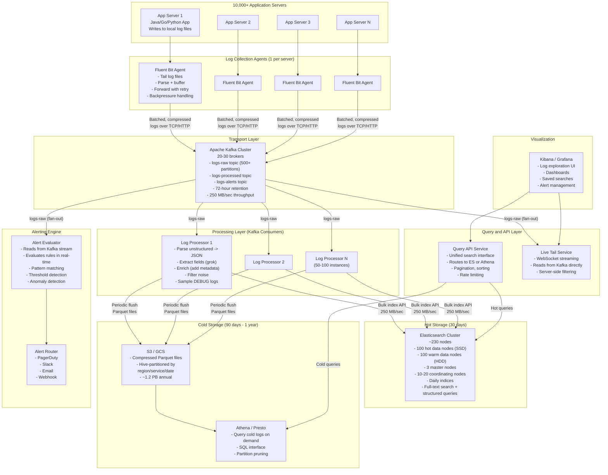

---

## 3. End-to-End Data Flow

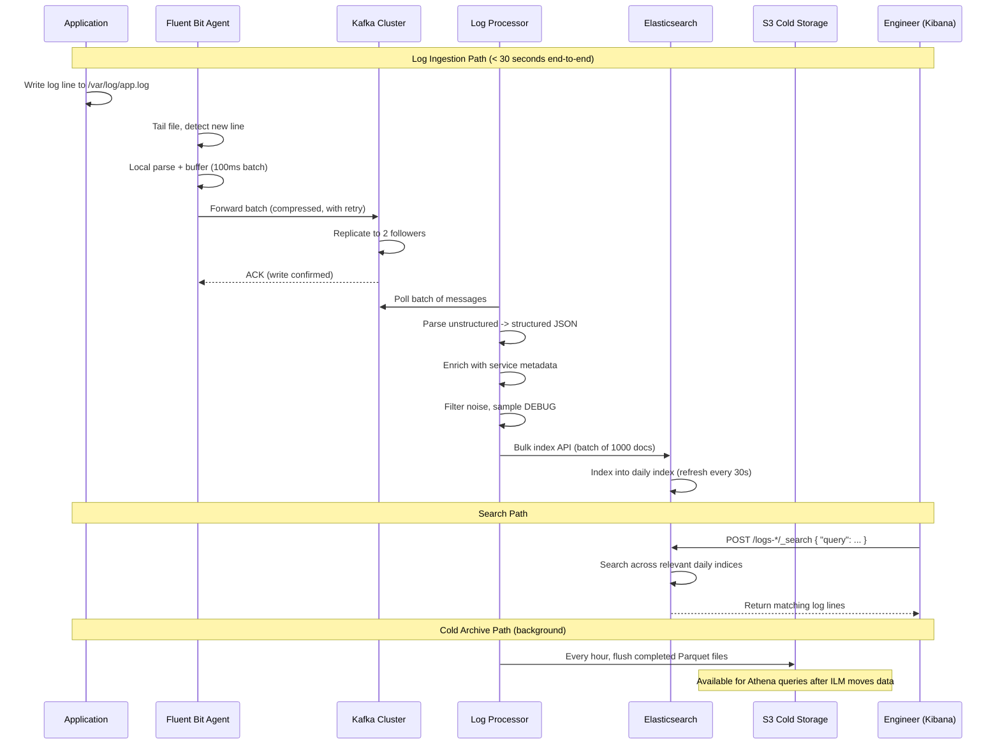

---

## 4. Component Deep Dive

### 4.1 Component Responsibility Map

```
+---------------------+---------------------------+----------------------------+
| Component           | Responsibility            | Scale                      |
+---------------------+---------------------------+----------------------------+
| Log Agent           | Tail files, parse, buffer | 10,000 instances (1/server)|
| (Fluent Bit)        | forward with retry        |                            |
+---------------------+---------------------------+----------------------------+
| Kafka               | Durable message transport | 20-30 brokers              |
|                     | Burst buffer, replay      | 500+ partitions            |
|                     | Fan-out to consumers      | 250 MB/sec sustained       |
+---------------------+---------------------------+----------------------------+
| Log Processor       | Parse, enrich, filter,    | 50-100 instances           |
|                     | sample, route             | Stateless, horizontally    |
|                     |                           | scalable                   |
+---------------------+---------------------------+----------------------------+
| Elasticsearch       | Full-text search index    | ~230 nodes                 |
| (Hot + Warm)        | Structured queries        | 1-2 PB storage             |
|                     | Aggregations              | 30-90 day retention        |
+---------------------+---------------------------+----------------------------+
| S3 / GCS            | Cold log archive          | ~1.2 PB/year               |
| (Cold)              | Compliance retention      | Compressed Parquet         |
+---------------------+---------------------------+----------------------------+
| Athena / Presto     | SQL queries on cold data  | Serverless / on-demand     |
+---------------------+---------------------------+----------------------------+
| Query API           | Unified search interface  | 10-20 instances            |
|                     | Route hot vs. cold        |                            |
+---------------------+---------------------------+----------------------------+
| Alert Evaluator     | Real-time pattern matching| 10-20 instances            |
|                     | Threshold + anomaly alerts|                            |
+---------------------+---------------------------+----------------------------+
| Kibana / Grafana    | UI for search, dashboards | 3-5 instances (HA)         |
|                     | Alert management          |                            |
+---------------------+---------------------------+----------------------------+
```

---

## 5. Log Collection Layer

### 5.1 Agent Architecture

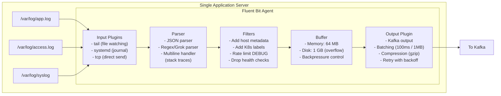

### 5.2 Why Agent-Based (Not Direct Push)

```
AGENT-BASED (recommended):                    DIRECT HTTP PUSH:
+----------------------------------+          +----------------------------------+
| App writes to file (fast, local) |          | App sends HTTP to logging API    |
| Agent tails file asynchronously  |          | Blocking call in request path    |
| Agent handles retry/buffer       |          | App must handle failures         |
| Zero app code changes            |          | Logging SDK in every language    |
| Backpressure doesn't affect app  |          | Slow logging = slow app          |
| Works with ANY app/language      |          | Coupling between app and infra   |
+----------------------------------+          +----------------------------------+
         WINNER for most cases                       Use only as supplement
```

### 5.3 Agent Configuration Example (Fluent Bit)

```yaml
# fluent-bit.conf

[SERVICE]
    Flush         1          # Flush buffer every 1 second
    Log_Level     warn       # Agent's own log level
    storage.path  /var/fluent-bit/buffer
    storage.sync  normal
    storage.backlog.mem_limit  64MB

[INPUT]
    Name          tail
    Path          /var/log/app/*.log
    Tag           app.*
    Parser        json
    Refresh_Interval  5       # Check for new files every 5 seconds
    Rotate_Wait   30          # Wait 30s before closing rotated file
    Mem_Buf_Limit 50MB        # Memory buffer per input
    storage.type  filesystem  # Overflow to disk when memory full

[INPUT]
    Name          tail
    Path          /var/log/nginx/access.log
    Tag           nginx.access
    Parser        nginx_combined
    Multiline     On
    Multiline_Flush  5

[INPUT]
    Name          systemd
    Tag           syslog.*
    Systemd_Filter  _SYSTEMD_UNIT=docker.service

[FILTER]
    Name          record_modifier
    Match         *
    Record        hostname ${HOSTNAME}
    Record        cluster  prod-us-east-1
    Record        datacenter us-east-1a

[FILTER]
    Name          grep
    Match         *
    Exclude       message ^GET /health

[FILTER]
    Name          throttle
    Match         app.*
    Rate          10000       # Max 10K records/sec per input
    Window        5
    Print_Status  true

[OUTPUT]
    Name          kafka
    Match         *
    Brokers       kafka-1:9092,kafka-2:9092,kafka-3:9092
    Topics        logs-raw
    Format        json
    Timestamp_Key @timestamp
    rdkafka.compression.codec  snappy
    rdkafka.queue.buffering.max.messages  100000
    rdkafka.message.send.max.retries  5
```

### 5.4 Kubernetes Log Collection

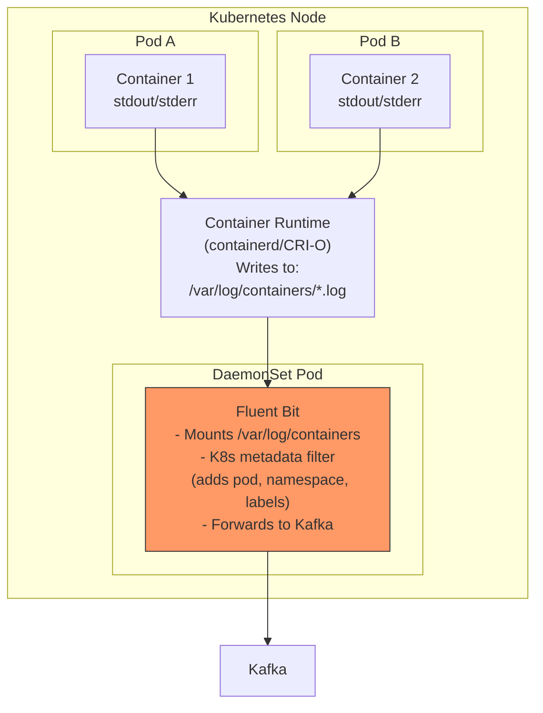

**K8s metadata enrichment** -- The Fluent Bit Kubernetes filter automatically adds:
- `kubernetes.namespace_name`
- `kubernetes.pod_name`
- `kubernetes.container_name`
- `kubernetes.labels.*`
- `kubernetes.annotations.*`

This eliminates the need for applications to include deployment context in their logs.

---

## 6. Transport Layer (Kafka)

### 6.1 Topic Design

```
+-------------------+-----------+-------------------+-------------------------------+
| Topic             | Partitions| Retention         | Purpose                       |
+-------------------+-----------+-------------------+-------------------------------+
| logs-raw          | 500+      | 72 hours          | Raw logs from agents          |
|                   |           |                   | (before processing)           |
+-------------------+-----------+-------------------+-------------------------------+
| logs-processed    | 500+      | 24 hours          | After parsing/enrichment      |
|                   |           |                   | (for ES indexing + cold store)|
+-------------------+-----------+-------------------+-------------------------------+
| logs-alerts       | 50        | 24 hours          | High-severity logs for        |
|                   |           |                   | real-time alert evaluation    |
+-------------------+-----------+-------------------+-------------------------------+
| logs-dlq          | 50        | 7 days            | Dead letter queue for         |
|                   |           |                   | unparseable/failed logs       |
+-------------------+-----------+-------------------+-------------------------------+
```

### 6.2 Partition Strategy

```
Partition key: service_name

Why service_name?
  1. Logs from the same service go to the same partition
  2. Ordering within a service is preserved
  3. Enables per-service consumer parallelism
  4. Prevents head-of-line blocking (slow service doesn't block fast ones)

Concern: Hot partitions from high-volume services?
  Solution: Hash key = service_name + random_suffix(0-9)
            This spreads a single service across 10 partitions
            while keeping locality for medium-volume services
```

### 6.3 Why Kafka (Not Direct Agent -> ES)

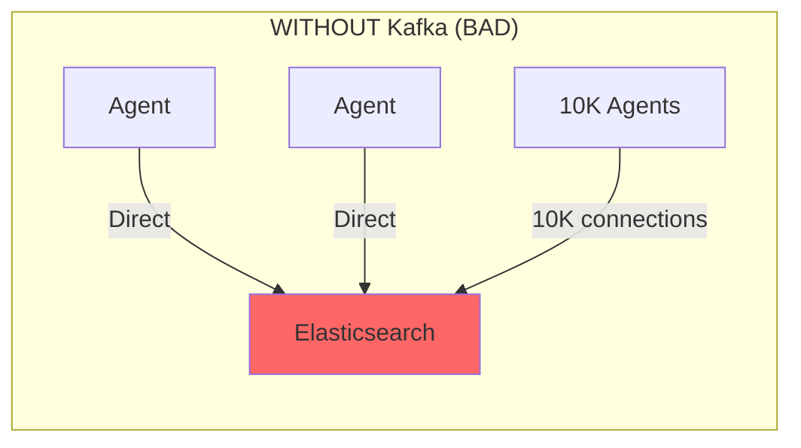

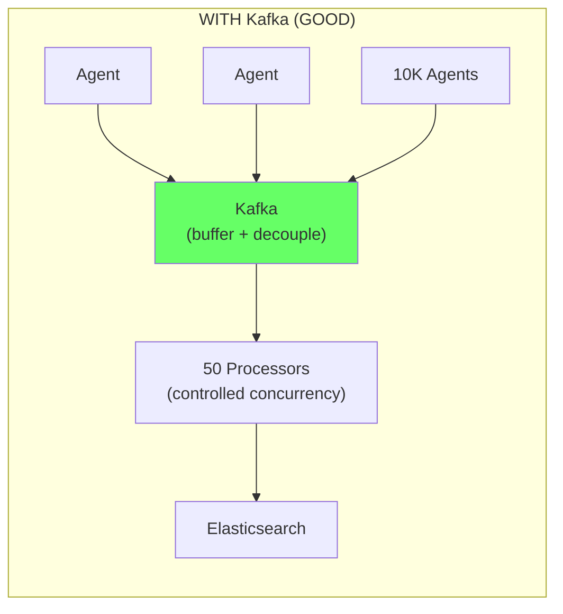

**Kafka provides:**

| Benefit | Without Kafka | With Kafka |
|---------|--------------|------------|
| **Burst handling** | ES overwhelmed during spikes | Kafka absorbs bursts, consumers process at steady rate |
| **Connection management** | 10K agents = 10K connections to ES | 10K agents -> Kafka -> 50 processors -> ES |
| **Backpressure** | Agents block or drop logs | Kafka buffers hours of data |
| **Replay** | Lost data is gone forever | Replay from Kafka offset to reprocess |
| **Fan-out** | Need to duplicate writes | One write, multiple consumers (ES, S3, alerts, tail) |
| **Decoupling** | ES outage = data loss | ES outage = Kafka buffers, no loss |

### 6.4 Consumer Group Architecture

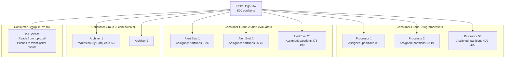

Each consumer group reads ALL messages independently. This is the power of Kafka
fan-out: one write serves four different downstream systems.

---

## 7. Log Processing Pipeline

### 7.1 Pipeline Stages

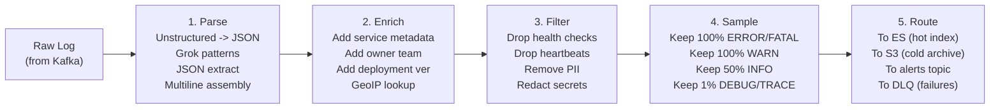

### 7.2 Stage 1: Parsing

```
INPUT (raw syslog):
  Mar 15 14:23:45 web-server-042 nginx[1234]: 10.0.42.17 - user123
    [15/Mar/2025:14:23:45 +0000] "POST /api/v1/rides HTTP/1.1" 500 0 0.234

GROK PATTERN:
  %{SYSLOGTIMESTAMP:syslog_timestamp} %{HOSTNAME:host} %{WORD:program}\[%{NUMBER:pid}\]:
  %{IP:client_ip} - %{NOTSPACE:user} \[%{HTTPDATE:timestamp}\]
  "%{WORD:method} %{URIPATH:path} HTTP/%{NUMBER}" %{NUMBER:status:int}
  %{NUMBER:bytes:int} %{NUMBER:duration:float}

OUTPUT (structured JSON):
  {
    "timestamp": "2025-03-15T14:23:45Z",
    "host": "web-server-042",
    "program": "nginx",
    "pid": 1234,
    "client_ip": "10.0.42.17",
    "user": "user123",
    "http": {
      "method": "POST",
      "path": "/api/v1/rides",
      "status_code": 500,
      "body_bytes": 0,
      "duration_sec": 0.234
    }
  }

MULTILINE HANDLING (Java stack trace):
  Input lines:
    2025-03-15 14:23:45 ERROR - Payment failed
    java.lang.NullPointerException
        at com.uber.payment.Processor.charge(Processor.java:142)
        at com.uber.payment.API.handleRequest(API.java:89)
    Caused by: java.io.IOException: Connection refused
        at java.net.Socket.connect(Socket.java:591)
  
  Rule: If line starts with whitespace or "Caused by" or "at ", 
        append to previous event.
  
  Output: Single log event with full stack trace in error.stack_trace field
```

### 7.3 Stage 2: Enrichment

```python
# Pseudocode for enrichment processor

SERVICE_METADATA = {
    "payment-api": {
        "team": "payments",
        "oncall_group": "payments-oncall",
        "tier": "critical",
        "repo": "github.com/uber/payment-api"
    },
    "ride-api": {
        "team": "marketplace",
        "oncall_group": "marketplace-oncall",
        "tier": "critical",
        "repo": "github.com/uber/ride-api"
    }
}

def enrich(log_event):
    service = log_event.get("service")
    
    # Add service metadata
    meta = SERVICE_METADATA.get(service, {})
    log_event["team"] = meta.get("team", "unknown")
    log_event["oncall_group"] = meta.get("oncall_group", "default")
    log_event["tier"] = meta.get("tier", "standard")
    
    # Add infrastructure context
    log_event["datacenter"] = resolve_datacenter(log_event["host"])
    log_event["cluster"] = resolve_cluster(log_event["host"])
    
    # GeoIP for client IPs (if present)
    if "client_ip" in log_event:
        geo = geoip_lookup(log_event["client_ip"])
        log_event["geo"] = {
            "country": geo.country,
            "city": geo.city
        }
    
    # Normalize timestamp to UTC ISO-8601
    log_event["timestamp"] = normalize_timestamp(log_event["timestamp"])
    
    return log_event
```

### 7.4 Stage 3: Filtering and PII Redaction

```
FILTER RULES:

1. DROP health checks:
   IF path == "/health" OR path == "/readiness" OR path == "/liveness"
   THEN DROP

2. DROP Kubernetes probes:
   IF user_agent CONTAINS "kube-probe" THEN DROP

3. DROP heartbeat noise:
   IF message MATCHES "heartbeat (sent|received)" AND level == "DEBUG"
   THEN DROP

4. REDACT PII:
   - Credit card: Replace /\b\d{4}[\s-]?\d{4}[\s-]?\d{4}[\s-]?\d{4}\b/ 
     with "****-****-****-XXXX" (keep last 4)
   - SSN: Replace /\b\d{3}-\d{2}-\d{4}\b/ with "***-**-XXXX"
   - Email: Replace /\b[\w.+-]+@[\w-]+\.[\w.]+\b/ with "[REDACTED_EMAIL]"
   - Auth tokens: Replace /Bearer\s+\S+/ with "Bearer [REDACTED]"

5. TRUNCATE oversized logs:
   IF message.length > 10,000 characters
   THEN truncate to 10,000 and add "[TRUNCATED]"
```

### 7.5 Stage 4: Sampling

```
SAMPLING STRATEGY:

The goal: Reduce volume without losing important data.
500K lines/sec at full fidelity is expensive. Sampling can cut storage 50-70%.

+----------+------------------+---------+-------------------------------+
| Level    | Sampling Rate    | Volume  | Rationale                     |
+----------+------------------+---------+-------------------------------+
| FATAL    | 100% (keep all)  | < 0.01% | Always critical               |
| ERROR    | 100% (keep all)  | ~1%     | Always needed for debugging   |
| WARN     | 100% (keep all)  | ~5%     | Often signals emerging issues |
| INFO     | 50% (1 in 2)     | ~60%    | Useful but high volume        |
| DEBUG    | 1% (1 in 100)    | ~30%    | Only needed deep debugging    |
| TRACE    | 0.1% (1 in 1000) | ~4%     | Almost never needed in prod   |
+----------+------------------+---------+-------------------------------+

EFFECTIVE REDUCTION:
  Before sampling: 500K lines/sec
  After sampling:  ~190K lines/sec (62% reduction)
  Storage savings:  ~60% on hot tier

IMPLEMENTATION:
  - Hash-based deterministic sampling on trace_id
  - If any log in a trace is ERROR, keep ALL logs for that trace
  - This preserves the ability to see the full context around errors
  
  def should_keep(log_event):
      level = log_event["level"]
      if level in ("FATAL", "ERROR", "WARN"):
          return True
      
      trace_id = log_event.get("trace_id", "")
      if is_trace_marked_for_full_capture(trace_id):
          return True  # Error in this trace -> keep everything
      
      sample_rate = {"INFO": 0.5, "DEBUG": 0.01, "TRACE": 0.001}
      hash_value = hash(trace_id) % 10000
      return hash_value < (sample_rate.get(level, 1.0) * 10000)
```

### 7.6 Stage 5: Routing

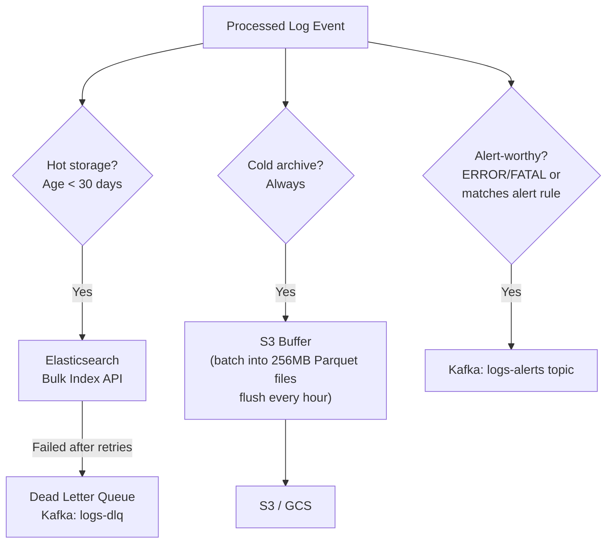

---

## 8. Storage Layer

### 8.1 Hot Storage: Elasticsearch

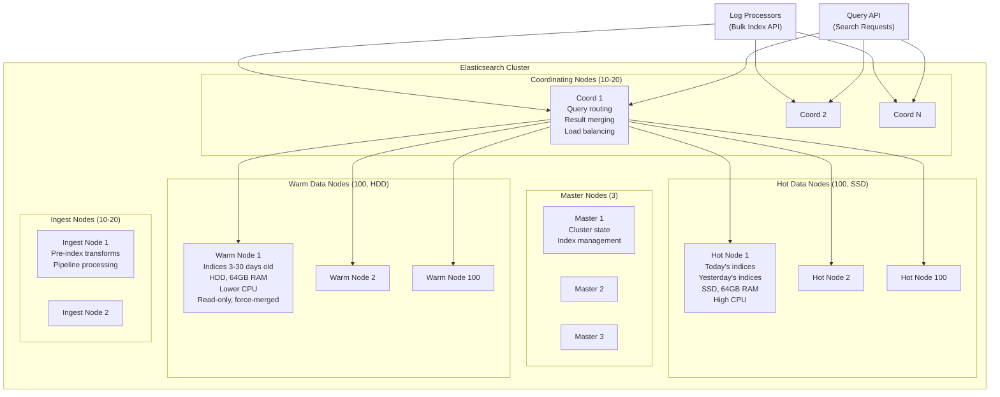

### 8.2 Index Strategy

```
DAILY INDEX PATTERN:
  logs-{service}-{YYYY.MM.DD}
  
  Examples:
    logs-payment-api-2025.03.15  (today, HOT tier, SSD)
    logs-payment-api-2025.03.14  (yesterday, HOT tier, SSD)
    logs-payment-api-2025.03.10  (5 days ago, WARM tier, HDD)
    logs-payment-api-2025.02.15  (28 days ago, WARM tier, about to go cold)

SHARD SIZING:
  Target: 20-50 GB per shard (Elasticsearch best practice)
  
  High-volume service (payment-api): 200 GB/day -> 10 shards per daily index
  Medium-volume service (matching-api): 50 GB/day -> 2 shards per daily index  
  Low-volume service (admin-api): 5 GB/day -> 1 shard per daily index

  Total shards across cluster: ~5,000-10,000
  (This is manageable; ES clusters can handle 10K-20K shards)

INDEX TEMPLATE:
  {
    "index_patterns": ["logs-*"],
    "template": {
      "settings": {
        "number_of_shards": 5,         // default, overridden per service
        "number_of_replicas": 1,        // 1 replica for durability
        "index.codec": "best_compression",
        "index.refresh_interval": "30s",
        "index.routing.allocation.require.data": "hot"  // Start on hot nodes
      }
    }
  }
```

### 8.3 Index Lifecycle Management (ILM)

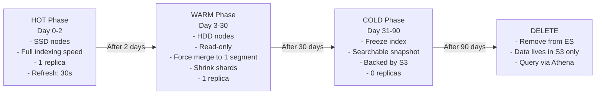

```json
{
  "policy": {
    "phases": {
      "hot": {
        "min_age": "0ms",
        "actions": {
          "rollover": {
            "max_age": "1d",
            "max_size": "50gb"
          },
          "set_priority": { "priority": 100 }
        }
      },
      "warm": {
        "min_age": "2d",
        "actions": {
          "allocate": {
            "require": { "data": "warm" },
            "number_of_replicas": 1
          },
          "forcemerge": { "max_num_segments": 1 },
          "shrink": { "number_of_shards": 1 },
          "set_priority": { "priority": 50 }
        }
      },
      "cold": {
        "min_age": "30d",
        "actions": {
          "searchable_snapshot": {
            "snapshot_repository": "s3-snapshots"
          },
          "set_priority": { "priority": 0 }
        }
      },
      "delete": {
        "min_age": "90d",
        "actions": {
          "delete": {}
        }
      }
    }
  }
}
```

### 8.4 Cold Storage: S3 Architecture

```
S3 BUCKET STRUCTURE:
  s3://uber-logs-archive/
    region=us-east-1/
      service=payment-api/
        year=2025/
          month=03/
            day=15/
              hour=14/
                logs-payment-api-20250315-14-part001.parquet  (256 MB)
                logs-payment-api-20250315-14-part002.parquet  (256 MB)
              hour=15/
                ...

PARQUET FILE BENEFITS:
  1. Columnar format -> efficient for querying specific fields
  2. Built-in compression (Snappy/Zstd) -> 5:1 compression ratio
  3. Column pruning -> only read columns referenced in query
  4. Predicate pushdown -> skip row groups that don't match filter
  5. Schema embedded in file -> self-describing

QUERYING COLD DATA (AWS Athena):
  SELECT timestamp, service, level, message
  FROM logs_archive
  WHERE region = 'us-east-1'
    AND service = 'payment-api'
    AND year = '2025' AND month = '03' AND day = '15'
    AND level = 'ERROR'
    AND message LIKE '%NullPointerException%'
  ORDER BY timestamp DESC
  LIMIT 100;

  -- Partition pruning: Only scans 1 hour of 1 service in 1 region
  -- Without partitioning: Would scan ALL data (petabytes!)
```

---

## 9. Query and Search Layer

### 9.1 Query Architecture

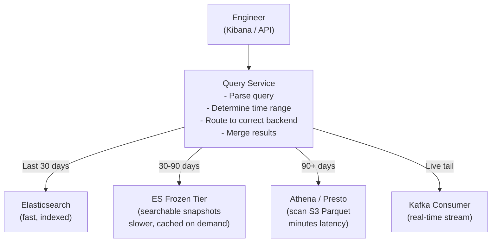

### 9.2 Common Query Patterns

```
1. KEYWORD SEARCH (most common):
   "Find all logs containing 'NullPointerException' in payment-api last 1 hour"
   
   ES Query:
   GET logs-payment-api-2025.03.15/_search
   {
     "query": {
       "bool": {
         "must": [
           { "match_phrase": { "message": "NullPointerException" } }
         ],
         "filter": [
           { "range": { "timestamp": { "gte": "now-1h" } } }
         ]
       }
     },
     "sort": [{ "timestamp": "desc" }],
     "size": 100
   }

2. TRACE CORRELATION (critical for debugging distributed systems):
   "Show me ALL logs across ALL services for trace_id=abc-123"
   
   GET logs-*-2025.03.15/_search
   {
     "query": {
       "term": { "trace_id": "abc-123-def-456" }
     },
     "sort": [{ "timestamp": "asc" }],
     "size": 1000
   }
   
   This returns the complete request journey:
   14:23:45.001  api-gateway    INFO   Received POST /api/v1/rides
   14:23:45.005  ride-api       INFO   Processing ride request
   14:23:45.010  matching-api   INFO   Finding nearest drivers
   14:23:45.050  matching-api   INFO   Matched driver_123
   14:23:45.055  ride-api       INFO   Dispatching to driver
   14:23:45.100  notification   INFO   Sent push to driver
   14:23:45.200  ride-api       ERROR  Driver accept timeout
   
3. ERROR AGGREGATION (dashboards):
   "Show error count per service per 5-minute bucket, last 24 hours"
   
   GET logs-*-2025.03.15/_search
   {
     "size": 0,
     "query": {
       "bool": {
         "filter": [
           { "term": { "level": "ERROR" } },
           { "range": { "timestamp": { "gte": "now-24h" } } }
         ]
       }
     },
     "aggs": {
       "by_service": {
         "terms": { "field": "service", "size": 50 },
         "aggs": {
           "over_time": {
             "date_histogram": {
               "field": "timestamp",
               "fixed_interval": "5m"
             }
           }
         }
       }
     }
   }

4. PATTERN DETECTION:
   "Find the top 10 most frequent error messages in the last hour"
   
   GET logs-*/_search
   {
     "size": 0,
     "query": {
       "bool": {
         "filter": [
           { "term": { "level": "ERROR" } },
           { "range": { "timestamp": { "gte": "now-1h" } } }
         ]
       }
     },
     "aggs": {
       "top_errors": {
         "significant_terms": {
           "field": "error.type",
           "size": 10
         }
       }
     }
   }
```

### 9.3 Search Performance Optimization

```
TECHNIQUE                         IMPACT                    HOW
----------------------------------------------------------------------
Time-range filter (ALWAYS)        90% shard pruning         Daily indices + timestamp filter
                                                            skips irrelevant days entirely

Keyword fields for filtering      10x faster than text      "level": "keyword" not "text"
                                                            Exact match, no analysis

Routing by service                Skip irrelevant shards    Custom routing on service field
                                                            Query only hits relevant shards

Pre-sorted indices                Skip scoring overhead     Default sort by timestamp desc
                                                            Most queries want "most recent"

Caching                           100x for repeated         ES request cache, node query
                                  queries                   cache, filesystem cache

Pagination (search_after)         Avoid deep pagination     Use search_after instead of
                                                            from+size for deep results

Async search                      Long queries don't        ES async search API for cold
                                  time out                  tier queries that take minutes
```

---

## 10. Alerting System

### 10.1 Alert Architecture

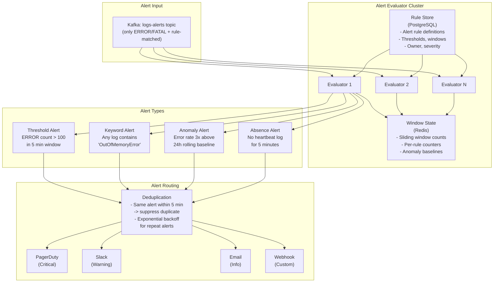

### 10.2 Alert Rule Examples

```yaml
# Rule 1: Error spike in critical service
- name: "Payment API Error Spike"
  type: threshold
  query:
    service: payment-api
    level: ERROR
  condition: count > 100
  window: 5m
  severity: critical
  notify:
    pagerduty: payments-oncall
    slack: "#payment-alerts"

# Rule 2: Specific fatal error
- name: "OOM Detection"
  type: keyword
  query:
    message_contains: "OutOfMemoryError"
    environment: production
  condition: count > 0
  window: 1m
  severity: critical
  notify:
    pagerduty: infrastructure-oncall
    slack: "#infra-alerts"

# Rule 3: Anomaly detection
- name: "Abnormal Error Rate"
  type: anomaly
  query:
    level: ERROR
  baseline: rolling_24h_average
  condition: current > baseline * 3
  window: 10m
  severity: warning
  notify:
    slack: "#service-health"

# Rule 4: Absence detection (heartbeat)
- name: "Service Heartbeat Missing"
  type: absence
  query:
    message_contains: "heartbeat"
    service: payment-api
  expected_interval: 60s
  alert_after: 5m
  severity: critical
  notify:
    pagerduty: payments-oncall
```

---

## 11. Visualization Layer

### 11.1 Kibana / Grafana Dashboard Layout

```
+-----------------------------------------------------------------------+
|  DISTRIBUTED LOGGING DASHBOARD - Production                    [Live] |
+-----------------------------------------------------------------------+
|                                                                       |
|  Ingestion Rate          Error Rate (all services)    Active Alerts   |
|  [=====] 487K/sec        [=====] 2,341/min           [!] 3 Critical  |
|  (target: 500K)          (baseline: 1,800/min)        [!] 7 Warning  |
|                                                                       |
+-----------------------------------------------------------------------+
|                                                                       |
|  Error Count by Service (last 1 hour)                                |
|  +------------------------------------------------------------------+|
|  | payment-api  ████████████████████████  4,521                     ||
|  | ride-api     ████████████████         3,201                      ||
|  | matching-api ████████████             2,456                      ||
|  | user-api     ████████                 1,789                      ||
|  | notification ████                       834                      ||
|  +------------------------------------------------------------------+|
|                                                                       |
+-----------------------------------------------------------------------+
|                                                                       |
|  Error Rate Timeline (5-min buckets, last 24 hours)                  |
|  +------------------------------------------------------------------+|
|  |     *                                                            ||
|  |    * *        *                                                  ||
|  |   *   *      * *                              *                  ||
|  |  *     *    *   *     *  *                   * *                 ||
|  | *       ****     *****    ***    *  *  *  ***   ****             ||
|  |------------------------------------------------------------------||
|  | 00:00  04:00  08:00  12:00  16:00  20:00  00:00                 ||
|  +------------------------------------------------------------------+|
|                                                                       |
+-----------------------------------------------------------------------+
|                                                                       |
|  LOG EXPLORER   [service: payment-api ▼] [level: ERROR ▼] [1 hour]  |
|  Search: [NullPointerException________________________________] [Go] |
|                                                                       |
|  14:23:45.456 ERROR payment-api  NullPointerException in Charge...   |
|  14:23:44.123 ERROR payment-api  Failed to process payment for...    |
|  14:23:43.789 ERROR payment-api  Database connection timeout af...    |
|  14:23:42.012 ERROR payment-api  NullPointerException in Charge...   |
|  [Load more...]                                                       |
|                                                                       |
+-----------------------------------------------------------------------+
```

---

## 12. Data Flow Walkthroughs

### 12.1 Walkthrough: Engineer Debugs a Production Error

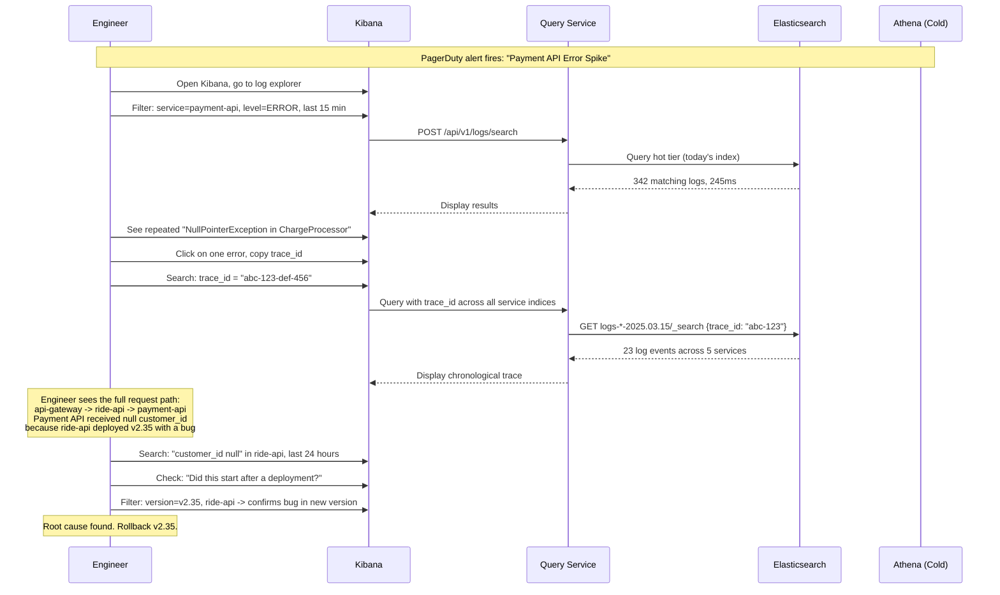

### 12.2 Walkthrough: Backpressure During an Outage

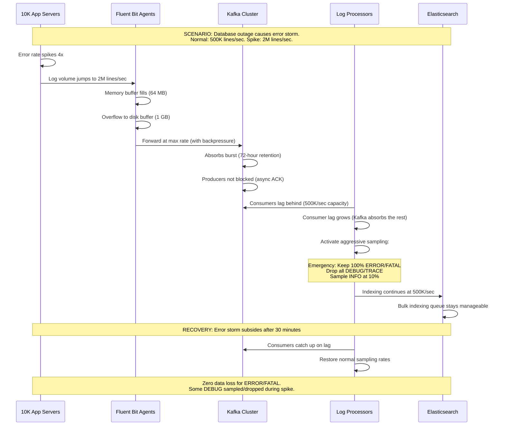

### 12.3 Walkthrough: ILM Moves Index from Hot to Warm

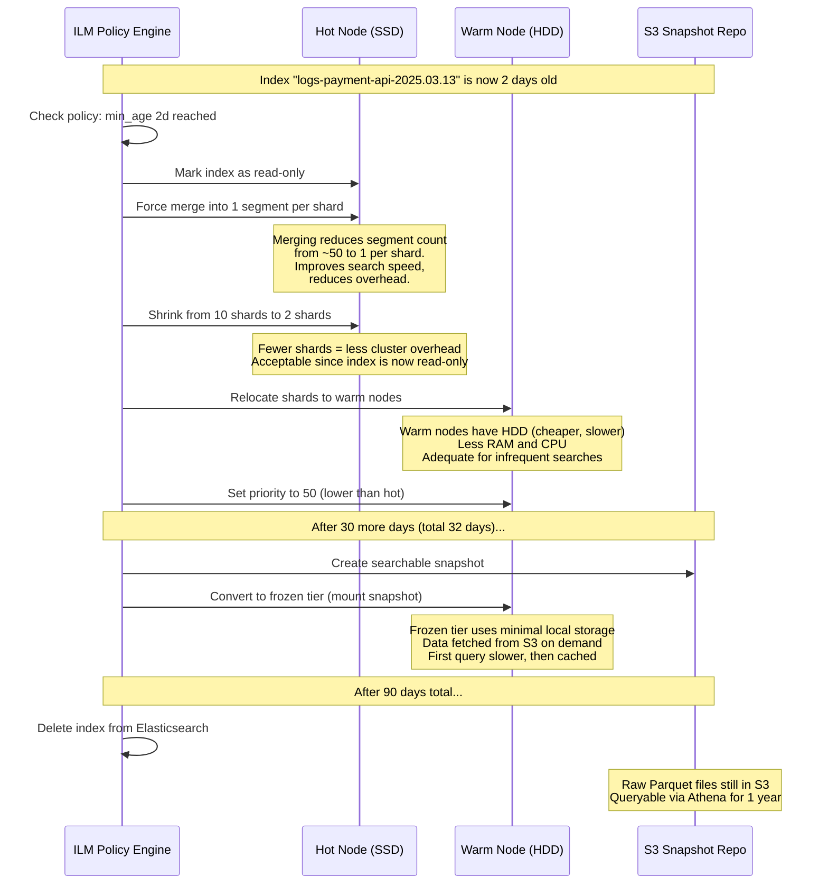
