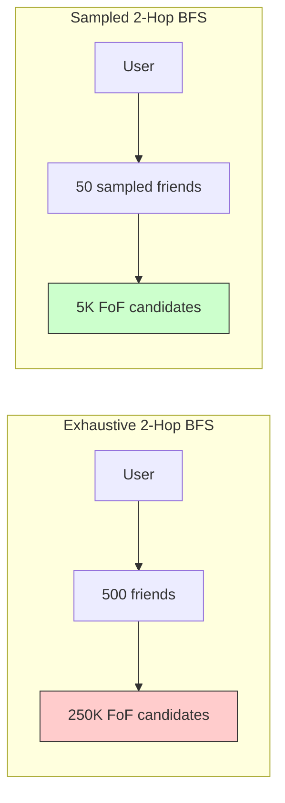
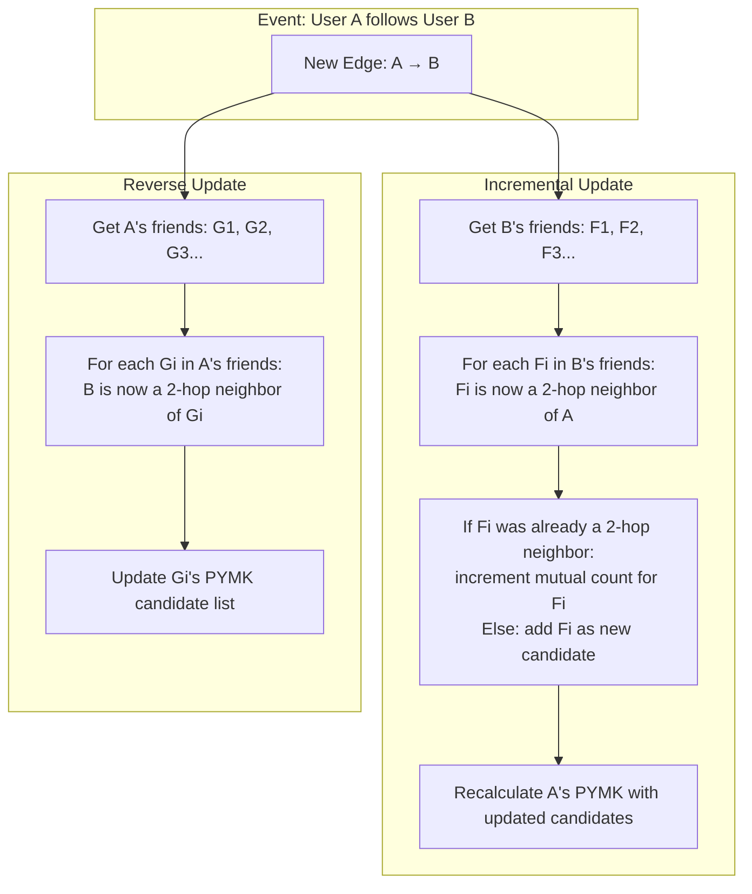
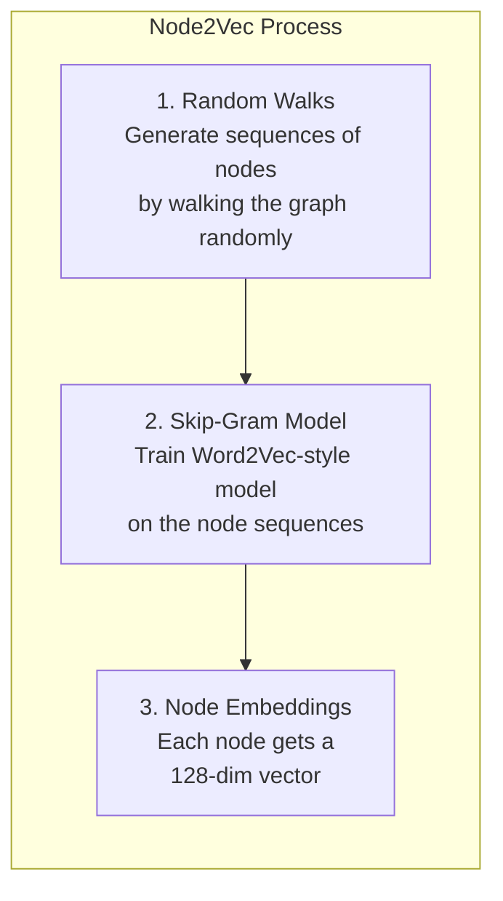
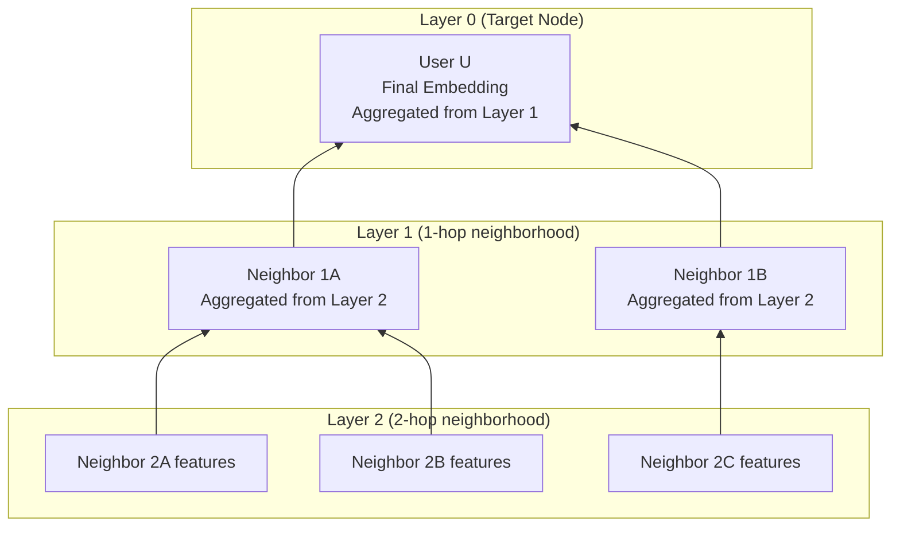
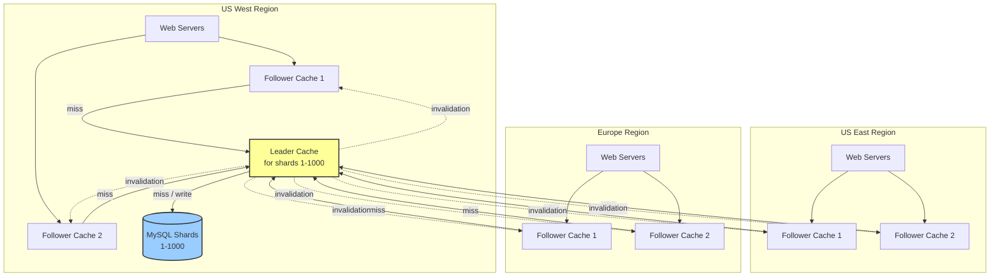
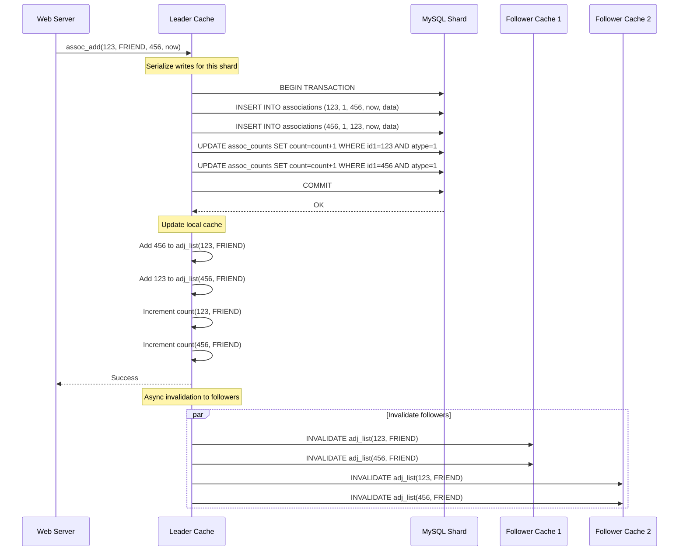
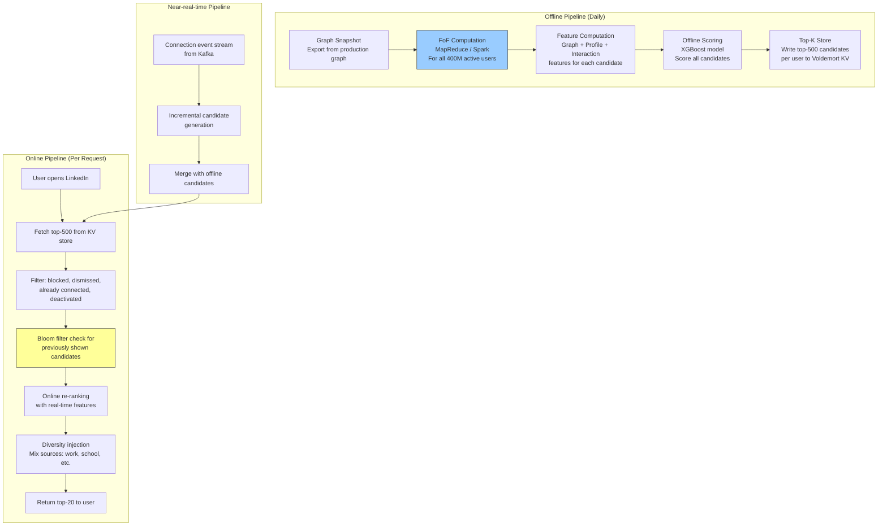
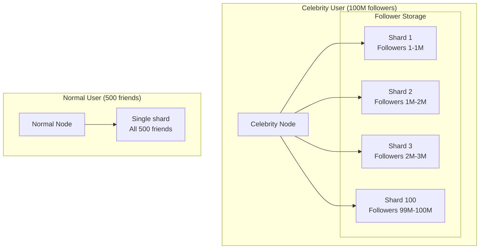
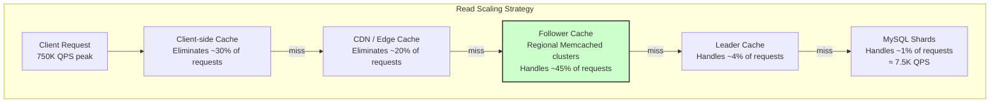
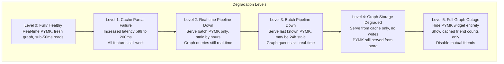

# Design a Social Graph / People You May Know (PYMK): Deep Dive and Scaling

## Table of Contents
- [1. Deep Dive #1: BFS at Scale](#1-deep-dive-1-bfs-at-scale)
- [2. Deep Dive #2: Graph Neural Networks for PYMK](#2-deep-dive-2-graph-neural-networks-for-pymk)
- [3. Deep Dive #3: Facebook TAO Architecture](#3-deep-dive-3-facebook-tao-architecture)
- [4. Deep Dive #4: LinkedIn's PYMK System](#4-deep-dive-4-linkedins-pymk-system)
- [5. The Celebrity / Hot Node Problem](#5-the-celebrity--hot-node-problem)
- [6. Privacy, Blocking, and GDPR](#6-privacy-blocking-and-gdpr)
- [7. Scaling Strategies](#7-scaling-strategies)
- [8. Failure Modes and Mitigation](#8-failure-modes-and-mitigation)
- [9. Trade-offs and Decision Framework](#9-trade-offs-and-decision-framework)
- [10. Interview Discussion Points](#10-interview-discussion-points)

---

## 1. Deep Dive #1: BFS at Scale

### 1.1 The Problem Statement

```
For a single user with 500 friends:
  - 1-hop BFS: 500 nodes (trivial)
  - 2-hop BFS: 500 x 500 = 250,000 candidate nodes
  - 3-hop BFS: 500^3 = 125,000,000 nodes (six degrees of separation!)

For PYMK, we need 2-hop BFS for 400M active users.

Question: How do we make this feasible?

Naive approach:
  400M users x 250K candidates each = 100 quadrillion evaluations
  Even at 1M evaluations/sec = 3,170 YEARS

We need to be 1,000,000x faster. How?
```

### 1.2 Strategy 1: Sampling Instead of Exhaustive BFS



```
Sampling strategy:

Step 1: Sample K friends (K = 50 out of 500)
  - Don't sample uniformly at random!
  - Weight by interaction frequency (closer friends = better signal)
  - Weight by recency (recently added friends reveal current social context)
  - Weight by social diversity (sample from different clusters/communities)

Step 2: For each sampled friend, sample L of their friends (L = 100)
  - Again, weighted sampling (not uniform)
  - Prefer friends who are themselves well-connected (higher-degree nodes)

Total candidates: K x L = 50 x 100 = 5,000 per user
Reduction: 250K → 5K = 50x fewer candidates to evaluate

Quality impact:
  - We tested exhaustive vs sampled at LinkedIn: sampled approach
    captures 95%+ of the top-50 PYMK candidates
  - Why? Because truly relevant candidates appear through MANY paths
    (high mutual friend count), so they survive sampling

Time per user: 50 adjacency list lookups x 5ms = 250ms
  (With batch requests and caching: ~50ms)
```

### 1.3 Strategy 2: Batch Precomputation with MapReduce

```mermaid
graph TB
    subgraph "MapReduce Pipeline for FoF"
        subgraph "Phase 1: Emit Friend Pairs"
            M1[Mapper<br/>For each user U with friends F1, F2, F3...<br/>Emit: key=(F1,F2) val=U<br/>Emit: key=(F1,F3) val=U<br/>Emit: key=(F2,F3) val=U]
        end
        subgraph "Phase 2: Count Mutual Friends"
            R1[Reducer<br/>For key=(A,B) → collect all U values<br/>count = len(U values)<br/>= number of mutual friends of A and B]
        end
        subgraph "Phase 3: Generate PYMK"
            F1[Filter<br/>Remove pairs that are already friends<br/>Keep top-N by mutual count per user]
        end
    end

    M1 --> R1 --> F1
```

```
MapReduce FoF Algorithm (used at Facebook):

Map phase:
  Input: User U has friends [F1, F2, F3, ..., Fn]
  Output: For every pair (Fi, Fj) where i < j:
          Emit key=(Fi, Fj), value=U

  Example: User U=100 has friends [1, 2, 3]
  Emits:
    (1, 2) → 100    # Users 1 and 2 have mutual friend 100
    (1, 3) → 100    # Users 1 and 3 have mutual friend 100
    (2, 3) → 100    # Users 2 and 3 have mutual friend 100

Reduce phase:
  For key=(A, B), collect all values [U1, U2, U3, ...]
  Count = len(values) = number of mutual friends of A and B

  Example: key=(1, 2), values=[100, 200, 300]
  → Users 1 and 2 have 3 mutual friends: {100, 200, 300}

Scale analysis:
  Each user with N friends emits C(N, 2) = N*(N-1)/2 pairs
  500 friends → 500*499/2 = 124,750 pairs per user
  2B users x 125K pairs = 250 trillion pairs to emit

  THIS IS TOO MUCH! We need the sampling trick here too:
  Sample 50 friends → C(50, 2) = 1,225 pairs per user
  2B users x 1,225 = 2.45 trillion pairs (still huge but tractable)

  On a 10,000 node Spark cluster: ~2 hours
```

### 1.4 Strategy 3: Incremental BFS (Process Changes, Not Full Graph)



```
Incremental approach avoids recomputing from scratch:

When A follows B:
  1. B's friends become new FoF candidates for A
     - Fetch B's friend list (500 friends)
     - For each friend F of B:
       - If F not already A's friend and F not already in A's PYMK:
         Add F to A's PYMK candidates with mutual_count = 1
       - If F already in A's PYMK candidates:
         Increment mutual_count for F

  2. A's friends may now have B as a new FoF candidate
     - For each friend G of A:
       - B is now a 2-hop neighbor of G (through A)
       - Update G's PYMK incrementally

Cost per follow event:
  - 2 adjacency list lookups: O(1000) total
  - ~1000 PYMK candidate updates
  - Total: ~10ms per event
  - At 100K follows/sec: 100K x 10ms = 1000 seconds of work per second
  - Need ~1000 worker cores for real-time incremental PYMK
```

### 1.5 Strategy 4: Locality-Sensitive Hashing (LSH) for Approximate Nearest Neighbors

```
For very large-scale PYMK, we can reformulate the problem:

Instead of BFS (find neighbors in graph topology), use:
  - Compute a "social fingerprint" vector for each user
  - Find users with similar fingerprints (approximate nearest neighbors)

Social fingerprint (MinHash):
  - Each user's friend set is a set of IDs: {101, 102, 103, ...}
  - MinHash: apply K random hash functions to the set
  - fingerprint = [min(h1(friends)), min(h2(friends)), ..., min(hK(friends))]
  - This is a compact signature (~128 bytes per user)
  - Jaccard similarity between two users ≈ fraction of matching MinHash values

LSH for PYMK:
  - Compute MinHash signatures for all 2B users: 2B x 128 bytes = 256 GB
  - Use LSH to group users into buckets of similar signatures
  - Within each bucket, users are likely to have high mutual friend overlap
  - These are PYMK candidates!

PROS: Sublinear time, works for users with no mutual friends
CONS: Approximate, misses some candidates, hard to explain ("23 mutual friends" 
      is a much better explanation than "similar social fingerprint")
```

### 1.6 BFS Strategy Comparison

```
┌──────────────────────┬────────────┬──────────────┬───────────────┬──────────┐
│ Strategy             │ Per-User   │ Total (400M) │ Quality       │ Use Case │
│                      │ Cost       │ Cost         │               │          │
├──────────────────────┼────────────┼──────────────┼───────────────┼──────────┤
│ Exhaustive BFS       │ 250K evals │ Impossible   │ Perfect       │ Tiny     │
│ Sampled BFS          │ 5K evals   │ 2T evals     │ 95% recall    │ Real-time│
│ MapReduce FoF        │ 1.2K pairs │ 2.5T pairs   │ 99% recall    │ Batch    │
│ Incremental          │ 1K updates │ 100M/sec     │ Fresh but     │ Stream   │
│                      │ per event  │ aggregate    │ incomplete    │          │
│ LSH (approx)         │ O(1) lookup│ O(N) total   │ ~80% recall   │ Cold     │
│                      │            │              │               │ start    │
├──────────────────────┼────────────┼──────────────┼───────────────┼──────────┤
│ RECOMMENDED:         │ Hybrid: Batch (MapReduce) + Incremental (stream) + │
│                      │ Sampled BFS (real-time fallback)                    │
└──────────────────────┴────────────────────────────────────────────────────┘
```

---

## 2. Deep Dive #2: Graph Neural Networks for PYMK

### 2.1 The Modern Approach: Node Embeddings

```
Traditional PYMK: Handcrafted graph features (mutual count, Jaccard, Adamic-Adar)
Modern PYMK: Learn node embeddings, predict links from embedding similarity

What is a node embedding?
  - A vector (e.g., 128-dimensional) representing a user in the social graph
  - Users who are "close" in the graph have similar embeddings
  - "Close" means: friends, friends-of-friends, same community, etc.

Why embeddings?
  - Capture structural similarity that handcrafted features miss
  - Two users may have 0 mutual friends but be structurally similar
    (same role in their respective communities → likely to connect)
  - Enable efficient approximate nearest neighbor search for candidate generation
```

### 2.2 Node2Vec: Random Walk-Based Embeddings



```
Node2Vec Algorithm:

1. Random Walks:
   For each node u, generate R random walks of length L
   Parameters p and q control the walk behavior:
     - p (return parameter): probability of returning to previous node
       Low p → walk stays local (BFS-like)
     - q (in-out parameter): probability of moving away
       Low q → walk explores widely (DFS-like)

   Example walk from user 123:
     123 → 101 → 205 → 101 → 308 → 412 → 308 → ...

2. Skip-Gram Training:
   Treat random walks as "sentences" and nodes as "words"
   Train Word2Vec skip-gram: predict nearby nodes from context
   Window size w: nodes within w steps in the walk are "context"

3. Output:
   Each node u has an embedding vector e_u ∈ R^128

Link Prediction:
  P(edge between u and v) ∝ sigmoid(e_u · e_v)
  High dot product → likely to be connected → PYMK candidate

Scale:
  - 2B nodes, each gets a 128-dim float32 embedding
  - 2B x 128 x 4 bytes = 1 TB of embeddings
  - Training: 2B nodes x 10 walks x 80 steps = 1.6 trillion tokens
  - On a GPU cluster: ~24 hours to train
```

### 2.3 GraphSAGE: Inductive Node Embeddings

```
Problem with Node2Vec: Transductive (must retrain for new nodes)
  - When a new user joins, we don't have their embedding
  - Must rerun Node2Vec on the updated graph (expensive!)

Solution: GraphSAGE (SAmple and aggreGatE)
  - Instead of learning a fixed embedding per node,
    learn a FUNCTION that generates embeddings from a node's neighborhood
  - The function can be applied to new nodes without retraining

GraphSAGE Process:
  1. For target node u, sample K neighbors at each of L layers
  2. Aggregate neighbor embeddings at each layer
  3. Combine with the node's own features
  4. Output: embedding for u based on its local neighborhood

  Layer 0: u's features (profile attributes, activity stats)
  Layer 1: Aggregate features of u's 1-hop neighbors
  Layer 2: Aggregate features of u's 2-hop neighbors
  ...
  Final: Embedding captures L-hop neighborhood structure
```



```
Aggregation functions:
  - Mean aggregator: avg(neighbor embeddings)
  - LSTM aggregator: feed neighbor embeddings through LSTM
  - Pooling aggregator: element-wise max/mean after MLP transform

GraphSAGE for PYMK:
  1. Train GraphSAGE on existing graph (predict known edges)
  2. For each user, generate embedding using their current neighborhood
  3. Find users with similar embeddings (approximate nearest neighbors)
  4. These are PYMK candidates

  Advantage: New users get embeddings immediately from their initial connections
  Scale: Inference for one user = sample ~25 neighbors x 2 layers = 625 node lookups
         At 5ms per lookup (with caching): ~3 seconds cold, <100ms with batching
```

### 2.4 Link Prediction as a Machine Learning Problem

```
Formulation:
  Given: Graph G with nodes V and edges E
  Task: Predict which pairs (u, v) ∉ E are likely to become edges

  Training data:
    Positive examples: Actual edges (u, v) ∈ E
    Negative examples: Random non-edges (u, v) ∉ E
      (Careful: most non-edges are VERY unlikely → hard negative mining)

  Features for pair (u, v):
    - Graph features: mutual count, Jaccard, Adamic-Adar (from HLD)
    - Embedding features: cosine_similarity(e_u, e_v), ||e_u - e_v||
    - Profile features: same company, school, city
    - Interaction features: profile views, search appearances

  Model:
    - Two-tower model: embed_u and embed_v independently, then dot product
    - Or: concatenate features and pass through MLP/gradient boosted trees
    - Output: P(u connects to v | u sees v in PYMK)

  Offline evaluation:
    - Hold out 10% of edges as test set
    - Predict: would these edges have formed?
    - Metrics: AUC-ROC, Precision@K, Recall@K

  Online evaluation:
    - A/B test: show PYMK from new model vs old model
    - Metric: connection request rate, acceptance rate
    - LinkedIn: improved PYMK model → 30% more connections
```

### 2.5 GNN vs Traditional Features: When to Use What

```
┌────────────────────────────┬──────────────────────────────────────────┐
│ Approach                   │ Best For                                 │
├────────────────────────────┼──────────────────────────────────────────┤
│ FoF + Mutual Count         │ V1 / MVP / Interview baseline            │
│ (no ML)                    │ Simple, explainable, works well           │
├────────────────────────────┼──────────────────────────────────────────┤
│ Handcrafted features +     │ V2 / Production system                   │
│ Gradient Boosted Trees     │ Best interpretability + good accuracy     │
├────────────────────────────┼──────────────────────────────────────────┤
│ Node2Vec embeddings +      │ V3 / Large-scale production              │
│ Two-tower model            │ Captures deep structural patterns        │
├────────────────────────────┼──────────────────────────────────────────┤
│ GraphSAGE / GNN +          │ V4 / State-of-the-art                    │
│ End-to-end link prediction │ Handles cold start, most accurate        │
│                            │ But: complex training, hard to debug      │
└────────────────────────────┴──────────────────────────────────────────┘

Interview tip: Start with FoF + mutual count (the classic approach),
then mention GNN as a "modern enhancement" if the interviewer probes.
```

---

## 3. Deep Dive #3: Facebook TAO Architecture

### 3.1 Why Facebook Built TAO

```
Before TAO (2009-2012):
  - Facebook used MySQL + Memcached directly
  - Every engineer wrote their own cache-aside logic:
      1. Check Memcache
      2. On miss, query MySQL
      3. Populate Memcache
  - Problems:
      a. Thundering herd: cache miss → 100s of requests hit MySQL simultaneously
      b. Stale reads: race conditions between cache updates
      c. Complexity: every team reimplemented caching logic
      d. No graph-aware API: engineers wrote raw SQL joins for graph queries

TAO solution:
  - Provide a unified graph-aware API (objects + associations)
  - Handle all caching automatically (write-through, invalidation)
  - Prevent thundering herd (single-flight cache fills)
  - Scale reads via Follower Caches (geographic distribution)
```

### 3.2 TAO Data Model

```
OBJECTS (Nodes):
  ┌─────────────────────────────────────────┐
  │  (id: 12345, otype: USER)               │
  │  data: {                                │
  │    name: "Alice",                       │
  │    email: "alice@example.com",          │
  │    avatar_url: "cdn.fb.com/alice.jpg"   │
  │  }                                      │
  └─────────────────────────────────────────┘

ASSOCIATIONS (Edges):
  ┌──────────────────────────────────────────────────────────────┐
  │  (id1: 12345, atype: FRIEND, id2: 67890, time: 1704067200) │
  │  data: { source: "pymk", interaction_score: 0.85 }         │
  └──────────────────────────────────────────────────────────────┘

  Association types (atypes) at Facebook:
    FRIEND          - undirected friendship (stored as 2 directed edges)
    AUTHORED        - user authored a post/comment/photo
    TAGGED_IN       - user tagged in a photo/post
    LIKED           - user liked a post/photo
    COMMENTED_ON    - user commented on a post
    MEMBER_OF       - user is member of a group
    ADMIN_OF        - user is admin of a page/group

  Everything in Facebook's social graph is modeled as objects + associations.
  Users, posts, photos, comments, pages, groups, events -- all objects.
  Friendships, likes, tags, memberships -- all associations.
```

### 3.3 TAO Cache Architecture (Multi-Region)



```
Key design details:

Leader Cache:
  - One leader per shard (shard = range of object IDs)
  - All writes go through the Leader (serialized)
  - Prevents write-write conflicts and stale cache issues
  - Write-through: every write updates cache AND MySQL atomically
  - If Leader fails: promote a Follower, refill cache from MySQL

Follower Cache:
  - Read-only replicas deployed in every region
  - Serve 99%+ of reads (most data is read-heavy)
  - Cache miss → ask Leader Cache (NOT MySQL directly)
  - Receive async invalidations from Leader
  - Stale window: typically < 1 second after a write

Thundering Herd Prevention:
  - When multiple requests miss the cache for the same key:
  - Only ONE request goes to the backing store (Leader or MySQL)
  - Other requests WAIT for the first one to return
  - This is "single-flight" or "request coalescing"
  - Without this: a popular user going viral = 100K cache misses = DB dead

Consistency Model:
  - Read-after-write: guaranteed if client reads from Leader
  - Eventual consistency: Follower reads may be stale by ~1s
  - In practice: user's OWN actions route to Leader for consistency
    (e.g., "I just unfriended Alice" → my next read sees the change)
  - OTHER users' actions may take ~1s to propagate
    (e.g., "Bob unfriended Alice" → Alice sees it within 1s)
```

### 3.4 TAO Write Path (Detailed)



```
Important details:

1. Bidirectional edge atomicity:
   - For undirected friendships, BOTH edges are written in ONE MySQL transaction
   - If the crash happens mid-write, the transaction rolls back → no dangling edges
   - If id1 and id2 are on DIFFERENT shards → 2-phase commit or accept eventual consistency

2. Cross-shard friendships (the hard case):
   - User 123 on Shard A, User 456 on Shard B
   - TAO uses "refcounts" and async reconciliation
   - Write the "primary" edge on Shard A (where id1 lives)
   - Send async message to create "inverse" edge on Shard B
   - If Shard B write fails → retry queue ensures eventual creation
   - Brief window of inconsistency: user 123 sees the friendship, 456 doesn't yet

3. Association count maintenance:
   - Count is denormalized for O(1) reads (no COUNT(*) queries)
   - Updated atomically with edge creation
   - Slight risk of count drift → periodic reconciliation job
```

---

## 4. Deep Dive #4: LinkedIn's PYMK System

### 4.1 LinkedIn PYMK Architecture Overview



### 4.2 LinkedIn's Bloom Filter for Seen Suggestions

```
Problem: 
  User opens LinkedIn 20 times/day and sees PYMK widget each time.
  If we show the same 20 suggestions every time → user learns to ignore them.
  But we only have ~200 good candidates (high mutual count).

Solution: Bloom filter to track which candidates have been shown

Implementation:
  - Per-user Bloom filter: ~1 KB per user (8192 bits, 5 hash functions)
  - Stored in the PYMK KV store alongside candidate list
  - When serving PYMK:
      1. Fetch top-500 candidates
      2. For each candidate, check Bloom filter: "have we shown this before?"
      3. Skip candidates that have been shown AND not acted on
      4. Show new candidates first, backfill with high-value repeats
  - When user sees a PYMK suggestion (impression logged):
      1. Add the candidate ID to the Bloom filter
  - Bloom filter is reset weekly (give candidates another chance)

Why Bloom filter instead of exact set?
  - Space: exact set for 500 shown items = 500 x 8 bytes = 4 KB
  - Bloom filter: 1 KB (4x smaller)
  - At 400M users: saves 1.2 TB of storage
  - False positives (1%) only mean we skip a valid candidate (acceptable)
  - No false negatives: we never re-show a recently shown candidate by mistake
```

### 4.3 LinkedIn's Mixing Strategy

```
PYMK candidates come from multiple sources:
  1. Friends of friends (FoF)           - 60% of suggestions
  2. Same company/school                 - 15% of suggestions
  3. Contact import (phone/email)        - 10% of suggestions
  4. Similar profile (embedding-based)   - 10% of suggestions
  5. Trending in your network            - 5% of suggestions

Diversity rules:
  - No more than 3 consecutive suggestions from the same source
  - At least 1 suggestion from each active source
  - If user dismissed a "same company" suggestion:
    reduce that source weight for next serving

Explanation strings:
  - FoF: "23 mutual connections including Alice and Bob"
  - Company: "Works at Google, like you"
  - School: "Studied at Stanford University"
  - Contact: "Is in your imported contacts"
  - Profile: "Has a similar role in Software Engineering"

These explanations SIGNIFICANTLY increase connection request rates.
LinkedIn found that showing "23 mutual connections" increases
click-through by 3x vs showing no explanation.
```

---

## 5. The Celebrity / Hot Node Problem

### 5.1 Problem Definition

```
Normal user:  500 friends/followers  → adjacency list = 4 KB
Celebrity:    100,000,000 followers  → adjacency list = 800 MB (!!)

Problems:
  1. Storage: One user's adjacency list = 800 MB (cannot cache this!)
  2. Read amplification: "Get followers of Elon Musk" → scan 800 MB
  3. Write amplification: "Show Elon Musk's post to all followers" → 100M fan-outs
  4. Hot partition: All of Elon Musk's data on one shard → that shard is 100x hotter
  5. Mutual friends: mutual_friends(you, Elon) → intersect your 500 with his 100M
     (actually fast if you iterate your 500 and check each against his hash set)
```

### 5.2 Solutions



```
Strategy 1: Sharded Follower Lists
  - Celebrity's followers are split across multiple shards
  - follower_shard(celebrity_id, shard_num) → [subset of followers]
  - "Get all followers" = scatter-gather across shards
  - "Check if X follows celebrity" = hash(X) → check specific shard

Strategy 2: Separate Hot vs Cold Storage
  - Users above 1M followers → "hot node" tier
  - Hot nodes get dedicated cache servers (not shared with normal users)
  - Follower counts are approximate (exact count too expensive to maintain)
  - "Followers of celebrity" queries are rate-limited

Strategy 3: Asymmetric Edge Storage
  - Normal follow: store in adjacency list
  - Celebrity follow: store only in REVERSE index (follower→celebrity)
  - DO NOT store celebrity→[all followers] as a single adjacency list
  - "Get celebrity's followers" → scan reverse index (background operation)
  - "Does X follow celebrity?" → check X's adjacency list (fast, O(1))

Strategy 4: Precomputed Subsets
  - For PYMK: "mutual friends with celebrity" is rarely useful
    (having 3 mutual friends with a celebrity among 100M is meaningless)
  - Skip celebrities in PYMK entirely (they don't need recommendations!)
  - For display: precompute "X of your friends follow this celebrity"
    using small bloom filter lookup
```

---

## 6. Privacy, Blocking, and GDPR

### 6.1 Privacy Enforcement Flow

```mermaid
graph TB
    subgraph "Every Graph Query"
        Q[Incoming Query]
        B[Block Check<br/>Bloom Filter O(1)]
        P[Privacy Check<br/>Settings Cache O(1)]
        V[Visibility Check<br/>Are they friends?<br/>Is profile public?]
        R[Return Results]
        E[Return Empty / Error]
    end

    Q --> B
    B -->|Not blocked| P
    B -->|Blocked| E
    P -->|Public| R
    P -->|Friends only| V
    P -->|Private| E
    V -->|Yes, friends| R
    V -->|Not friends| E
```

### 6.2 GDPR: Right to Deletion

```
When a user requests account deletion:

Phase 1 (Immediate, < 1 hour):
  1. Mark account as "pending_deletion" (soft delete)
  2. Remove from all PYMK result caches
  3. Remove from search indexes
  4. Stop showing their profile to other users

Phase 2 (Background, < 7 days):
  1. Delete all outgoing edges (friendships, follows)
  2. Delete all incoming edges (followers, friend references)
  3. Update friend counts for all affected users
  4. Remove from all Bloom filters (block lists)
  5. Delete interaction history
  6. Delete PYMK dismissals
  7. Delete node embeddings and features

Phase 3 (Verification, < 30 days):
  1. Audit scan: verify no references to deleted user remain
  2. Purge from backup tapes (or mark for exclusion on restore)
  3. Remove from analytics datasets
  4. Generate deletion compliance report

Scale of deletion cascade:
  - User with 500 friends → 1000 edge deletions (both directions)
  - 500 friend count updates
  - 500 PYMK cache invalidations
  - N Bloom filter rebuilds
  - Total: ~2000 write operations per deleted user
  - At 10K deletions/day: 20M background operations/day (manageable)
```

### 6.3 Block Enforcement in PYMK

```
Block rules for PYMK:

1. If A blocked B:
   - B NEVER appears in A's PYMK
   - A NEVER appears in B's PYMK
   - A and B never appear as mutual friends for anyone
   - If C asks "mutual friends with B", and A is mutual → A is hidden

2. If A blocked B and later unblocks:
   - B can reappear in PYMK (after next batch recomputation)
   - But A and B's past interaction data is not restored
   - Effectively a "fresh start" for PYMK regarding this pair

3. Implementation:
   - Block list is bidirectional: block(A,B) creates entries for both A→B and B→A
   - Bloom filter contains ALL blocked pairs (both directions)
   - Every PYMK candidate is checked against Bloom filter before display
   - False positive rate of 1%: only causes unnecessary DB lookups
   - True positive: candidate is filtered out (never shown)
```

---

## 7. Scaling Strategies

### 7.1 Read Scaling



```
Read scaling math:
  Peak QPS: 750K
  After client cache (30%): 525K
  After CDN (20%): 375K
  After Follower Cache (90% hit rate): 37.5K
  After Leader Cache (80% hit rate): 7.5K QPS hitting MySQL

  MySQL at 7.5K QPS across 10K shards = 0.75 QPS per shard → trivial!

  Follower Cache sizing:
  - 10B most-accessed adjacency lists (hot users)
  - Average 8 KB per list = 80 TB of cache
  - Memcached servers with 64 GB each = 1,250 servers
  - Split across 5 regions = 250 servers per region
```

### 7.2 Write Scaling

```
Write scaling:
  Peak: 100K writes/sec
  Each write = 1 edge creation → ~4 DB operations:
    1. INSERT edge (from → to)
    2. INSERT reverse edge (to → from) (if undirected)
    3. UPDATE count for from_user
    4. UPDATE count for to_user

  Total DB writes: 100K x 4 = 400K writes/sec
  Across 10K shards: 40 writes/sec per shard → very manageable

  But: cross-shard writes require coordination
  - ~50% of friendships cross shards (random hash partitioning)
  - 50K cross-shard writes/sec → async replication with retry queue
  - Accept ~1 second inconsistency window for cross-shard edges
```

### 7.3 PYMK Scaling

```
Batch pipeline scaling:
  400M active users x 5K candidates/user = 2T candidate evaluations
  Spark cluster: 1000 executors x 16 cores each = 16K cores
  At 100K evaluations/sec/core: 16K x 100K = 1.6B evals/sec
  Time: 2T / 1.6B = 1,250 seconds ≈ 21 minutes

  Memory per executor: 64 GB
  Total cluster memory: 1000 x 64 GB = 64 TB
  This is sufficient to hold the graph edges in distributed memory

Real-time pipeline scaling:
  100K follow events/sec → each triggers ~500 PYMK incremental updates
  = 50M PYMK updates/sec
  Flink cluster: 500 task managers x 4 cores = 2000 cores
  At 25K updates/sec/core = 50M updates/sec ✓

PYMK serving:
  460 QPS average (40M requests/day)
  Each request: 1 KV lookup (2ms) + filtering (1ms) + ranking (10ms) = 13ms
  Single server at 100 QPS: need 5 servers (trivially scalable)
  Peak (5x average): 25 servers
```

---

## 8. Failure Modes and Mitigation

### 8.1 Failure Scenarios

```
┌─────────────────────────────┬───────────────────────────────────────────────┐
│ Failure                     │ Impact and Mitigation                         │
├─────────────────────────────┼───────────────────────────────────────────────┤
│ Follower Cache server crash │ Impact: Cache miss spike for that shard range │
│                             │ Mitigation: Requests route to Leader Cache    │
│                             │ Recovery: New cache server warms up in ~5 min │
├─────────────────────────────┼───────────────────────────────────────────────┤
│ Leader Cache crash          │ Impact: All writes for that shard stall       │
│                             │ Mitigation: Promote Follower to Leader        │
│                             │ Recovery: < 30 seconds with automatic failover│
├─────────────────────────────┼───────────────────────────────────────────────┤
│ MySQL shard crash           │ Impact: Reads from cache still work           │
│                             │ Writes fail for that shard                    │
│                             │ Mitigation: MySQL replica promoted to primary │
│                             │ Recovery: < 1 minute with automated failover  │
├─────────────────────────────┼───────────────────────────────────────────────┤
│ Kafka cluster partial fail  │ Impact: Real-time PYMK pipeline delayed      │
│                             │ Mitigation: Batch PYMK still serves stale    │
│                             │ results; writes still succeed (async)         │
├─────────────────────────────┼───────────────────────────────────────────────┤
│ PYMK batch pipeline failure │ Impact: Stale PYMK suggestions (up to 24h)   │
│                             │ Mitigation: Real-time pipeline provides some  │
│                             │ freshness; serve last good batch              │
├─────────────────────────────┼───────────────────────────────────────────────┤
│ Celebrity goes viral        │ Impact: 1M follows/min to single user         │
│                             │ Hot shard for that user's follower list       │
│                             │ Mitigation: Sharded follower lists, rate      │
│                             │ limiting, async count updates                 │
├─────────────────────────────┼───────────────────────────────────────────────┤
│ Full region outage          │ Impact: Users in that region lose access      │
│                             │ Mitigation: DNS failover to another region    │
│                             │ Follower Caches in other regions still serve  │
│                             │ Writes may fail if Leader was in failed region│
└─────────────────────────────┴───────────────────────────────────────────────┘
```

### 8.2 Graceful Degradation Hierarchy



---

## 9. Trade-offs and Decision Framework

### 9.1 Key Design Trade-offs

```
TRADE-OFF 1: Graph Database vs. Custom Storage (TAO-style)
  ┌─────────────────────────────────────────────────────────┐
  │  Graph DB (Neo4j)          │  TAO-style (MySQL + Cache) │
  ├────────────────────────────┼────────────────────────────┤
  │  ✓ Native traversal        │  ✓ Scales to trillions     │
  │  ✓ Cypher queries          │  ✓ Proven at Facebook      │
  │  ✓ Less code to write      │  ✓ Simple API (5 ops)      │
  │  ✗ Scaling is hard         │  ✗ No native traversal     │
  │  ✗ Vendor lock-in          │  ✗ Complex to build        │
  ├────────────────────────────┴────────────────────────────┤
  │  DECISION: TAO-style for FAANG scale;                   │
  │  Graph DB for startup/medium scale (< 100M users)       │
  └─────────────────────────────────────────────────────────┘

TRADE-OFF 2: Batch PYMK vs. Real-time PYMK
  ┌─────────────────────────────────────────────────────────┐
  │  Batch Only                │  Real-time Only             │
  ├────────────────────────────┼────────────────────────────┤
  │  ✓ Thorough evaluation     │  ✓ Instant freshness        │
  │  ✓ All features available  │  ✓ Reacts to new edges      │
  │  ✗ Stale by hours          │  ✗ Limited candidate pool   │
  │  ✗ Expensive compute       │  ✗ No global features       │
  ├────────────────────────────┴────────────────────────────┤
  │  DECISION: Hybrid. Batch for candidate generation,      │
  │  real-time for freshness. LinkedIn and Facebook both     │
  │  use this approach.                                      │
  └─────────────────────────────────────────────────────────┘

TRADE-OFF 3: Hash Partitioning vs. Social Partitioning
  ┌─────────────────────────────────────────────────────────┐
  │  Hash Partitioning         │  Social Partitioning        │
  ├────────────────────────────┼────────────────────────────┤
  │  ✓ Even load distribution  │  ✓ Fewer cross-partition    │
  │  ✓ Simple, stateless       │    queries for graph ops    │
  │  ✓ Easy rebalancing        │  ✓ Better cache locality    │
  │  ✗ Friends span partitions │  ✗ Expensive to compute     │
  │  ✗ Scatter-gather needed   │  ✗ Uneven partition sizes   │
  │                            │  ✗ Hard to rebalance        │
  ├────────────────────────────┴────────────────────────────┤
  │  DECISION: Hash partitioning + aggressive caching.      │
  │  The cache hit rate (99%+) makes cross-partition costs   │
  │  irrelevant for reads.                                   │
  └─────────────────────────────────────────────────────────┘

TRADE-OFF 4: Exhaustive BFS vs. Sampled BFS for PYMK
  ┌─────────────────────────────────────────────────────────┐
  │  Exhaustive BFS            │  Sampled BFS                │
  ├────────────────────────────┼────────────────────────────┤
  │  ✓ Perfect recall          │  ✓ 50x faster               │
  │  ✓ Exact mutual counts     │  ✓ 95% recall (good enough) │
  │  ✗ 250K evals per user     │  ✗ May miss rare candidates  │
  │  ✗ Infeasible at scale     │  ✗ Approximate mutual counts │
  ├────────────────────────────┴────────────────────────────┤
  │  DECISION: Sampled BFS for real-time, exhaustive via    │
  │  MapReduce for batch. The top candidates have high      │
  │  mutual counts and survive sampling easily.              │
  └─────────────────────────────────────────────────────────┘

TRADE-OFF 5: Consistency vs. Latency for Graph Reads
  ┌─────────────────────────────────────────────────────────┐
  │  Strong Consistency        │  Eventual Consistency       │
  ├────────────────────────────┼────────────────────────────┤
  │  ✓ Always fresh data       │  ✓ Sub-millisecond reads    │
  │  ✓ No stale friend lists   │  ✓ Read from nearest cache  │
  │  ✗ Must read from Leader   │  ✓ Scales with more replicas│
  │  ✗ Cross-region latency    │  ✗ ~1s stale window         │
  │  ✗ Lower throughput        │  ✗ May see deleted friends  │
  ├────────────────────────────┴────────────────────────────┤
  │  DECISION: Eventual consistency (TAO Follower reads).   │
  │  ~1s staleness is acceptable. Route the writing user's  │
  │  subsequent reads to Leader for read-after-write         │
  │  consistency.                                            │
  └─────────────────────────────────────────────────────────┘
```

### 9.2 Decision Matrix

```
┌────────────────────────────────────────────────────────────────────┐
│                      System Design Decisions                       │
├────────────────────┬───────────────────────┬───────────────────────┤
│ Component          │ Choice                │ Why                   │
├────────────────────┼───────────────────────┼───────────────────────┤
│ Graph Storage      │ Sharded MySQL +       │ Proven at Facebook    │
│                    │ Memcached (TAO-style) │ scale (trillions)     │
├────────────────────┼───────────────────────┼───────────────────────┤
│ Cache Strategy     │ Write-through with    │ 99%+ hit rate,        │
│                    │ Leader-Follower       │ strong consistency    │
│                    │                       │ for writes            │
├────────────────────┼───────────────────────┼───────────────────────┤
│ Partitioning       │ Hash(user_id)         │ Even load, simple     │
├────────────────────┼───────────────────────┼───────────────────────┤
│ PYMK Pipeline      │ Batch + Real-time     │ Fresh + thorough      │
├────────────────────┼───────────────────────┼───────────────────────┤
│ PYMK Algorithm     │ Sampled FoF + ML rank │ 95% recall, fast      │
├────────────────────┼───────────────────────┼───────────────────────┤
│ ML Model           │ GBT (V1) → GNN (V2)  │ Start simple, evolve  │
├────────────────────┼───────────────────────┼───────────────────────┤
│ Privacy            │ Bloom filter + cache  │ O(1) checks on every  │
│                    │                       │ query, 1% FP rate     │
├────────────────────┼───────────────────────┼───────────────────────┤
│ Celebrity handling │ Sharded follower list │ Prevents hot nodes    │
│                    │ + asymmetric storage  │                       │
├────────────────────┼───────────────────────┼───────────────────────┤
│ Consistency        │ Eventual (Follower)   │ Sub-ms latency,       │
│                    │ + RAW (Leader route)  │ acceptable staleness  │
└────────────────────┴───────────────────────┴───────────────────────┘
```

---

## 10. Interview Discussion Points

### 10.1 Questions the Interviewer Will Ask

```
Q1: "How do you handle a user with 100 million followers?"
A1: "Celebrity nodes get special treatment. Instead of storing all 100M followers
     in a single adjacency list, I shard the follower list across multiple storage
     nodes. For PYMK, I skip celebrities entirely -- having 3 mutual friends
     with someone who has 100M followers is not a meaningful signal. For display
     ('N of your friends follow X'), I check the user's smaller friend list
     against a Bloom filter of the celebrity's followers."

Q2: "What happens when two users block each other? How do you ensure they
     never see each other in PYMK?"
A2: "Block relationships are stored bidirectionally and loaded into an in-memory
     Bloom filter (~600MB total) on every query server. Every PYMK candidate
     is checked against this Bloom filter in O(1). The 1% false positive rate
     only causes unnecessary DB lookups (safe direction -- we never accidentally
     show a blocked user). The Bloom filter is refreshed every 5 minutes."

Q3: "Why not use Neo4j for everything?"
A3: "Neo4j is excellent for graph traversal at medium scale, but it struggles
     beyond ~500M nodes. At 2B users and 1T edges, we need a horizontally
     scalable solution. Facebook's TAO approach (MySQL + Memcached) handles
     this by treating the graph as objects + associations in a sharded SQL
     database with a write-through cache layer. The 99%+ cache hit rate
     means most reads never hit the database."

Q4: "How do you keep PYMK fresh when users are constantly adding friends?"
A4: "Hybrid approach: batch pipeline runs every 6 hours to generate the base
     candidate pool using MapReduce FoF computation. A real-time Kafka Streams
     pipeline processes each new follow event and generates incremental PYMK
     updates. The serving layer merges batch + real-time candidates and
     re-ranks them on each request."

Q5: "How do you handle GDPR deletion requests?"
A5: "Three phases: immediate soft delete (hide from all surfaces within 1 hour),
     background edge deletion (cascade to all 500+ friendships within 7 days),
     and verification audit (confirm full deletion within 30 days). Each
     deleted user triggers ~2000 write operations (edge deletions + count
     updates + cache invalidations). At 10K deletions/day, this is
     20M background operations -- well within capacity."
```

### 10.2 Advanced Topics to Mention (If Time Permits)

```
1. GRAPH COMPRESSION:
   "At 40TB of edge data, we can compress adjacency lists significantly.
    Since user IDs in a friend list are often numerically close (signed up
    around the same time), we can use delta encoding + varint encoding
    to reduce storage by 3-5x."

2. TIERED STORAGE:
   "Active users' adjacency lists are in Memcached (hot tier).
    Users who haven't logged in for 6+ months get evicted from cache
    and their data lives only in MySQL (cold tier). This reduces cache
    size from 80TB to ~20TB while serving 99.9% of requests from cache."

3. SOCIAL GRAPH EVOLUTION:
   "The graph is not static. We can detect community evolution over time:
    new clusters forming (e.g., user joins a new company), clusters splitting
    (e.g., graduation from school). PYMK should prioritize candidates from
    the user's CURRENT social context, not their historical one."

4. A/B TESTING PYMK:
   "We run continuous A/B tests on the PYMK ranking model. The key metric
    is connection_request_rate * acceptance_rate. We bucket users by random
    hash and serve different model versions. A 1% improvement in PYMK
    quality translates to millions of additional connections per month."

5. COLD START PYMK:
   "New users with 0-5 connections can't use FoF-based PYMK. For cold start:
    (a) Use contact import (phone/email matching) for initial suggestions
    (b) Use profile attributes (company, school, city) for content-based
        recommendations
    (c) Use GraphSAGE embeddings that can generate embeddings for new nodes
        from their sparse initial neighborhood
    (d) As connections grow beyond 10, transition to FoF-based PYMK"
```

### 10.3 System Summary for Interview Closing

```
┌────────────────────────────────────────────────────────────────────┐
│           SOCIAL GRAPH / PYMK SYSTEM SUMMARY                      │
├────────────────────────────────────────────────────────────────────┤
│                                                                    │
│  SCALE:    2B users, 1T edges, 250K read QPS, 100K write QPS     │
│                                                                    │
│  STORAGE:  TAO-inspired (MySQL shards + Memcached write-through)  │
│            40TB edges + 240TB with indexes/replication             │
│                                                                    │
│  CACHING:  Leader-Follower Memcached, 99%+ hit rate               │
│            Multi-region Follower Caches for low-latency reads     │
│                                                                    │
│  PYMK:    Hybrid batch (MapReduce FoF) + real-time (Kafka)       │
│            Sampled BFS (50 friends x 100 FoF = 5K candidates)    │
│            ML ranking: mutual count + profile + interaction       │
│                                                                    │
│  PRIVACY:  Bloom filter for O(1) block checks                     │
│            GDPR cascade deletion within 30 days                   │
│                                                                    │
│  SCALING:  Hash partition by user_id                               │
│            Celebrity: sharded follower lists                      │
│            Cross-partition: scatter-gather + aggressive caching   │
│                                                                    │
│  KEY INSIGHT: The cache hit rate (99%+) is what makes this whole  │
│  system work. Without caching, 250K QPS on 40TB of data across   │
│  10K MySQL shards would be catastrophic. With caching, MySQL sees │
│  < 1% of reads (~2.5K QPS across all shards = trivial).          │
│                                                                    │
└────────────────────────────────────────────────────────────────────┘
```
