# Design a Social Graph / People You May Know (PYMK): High-Level Design

## Table of Contents
- [1. Architecture Overview](#1-architecture-overview)
- [2. System Architecture Diagram](#2-system-architecture-diagram)
- [3. Component Deep Dive](#3-component-deep-dive)
- [4. Graph Storage Approaches](#4-graph-storage-approaches)
- [5. Graph Query Patterns](#5-graph-query-patterns)
- [6. PYMK Algorithm and Pipeline](#6-pymk-algorithm-and-pipeline)
- [7. Data Flow Walkthroughs](#7-data-flow-walkthroughs)
- [8. Caching Strategy](#8-caching-strategy)
- [9. Graph Partitioning](#9-graph-partitioning)
- [10. Communication Patterns](#10-communication-patterns)
- [11. Database Design Details](#11-database-design-details)

---

## 1. Architecture Overview

The system is organized as a **microservices architecture** with five core services
built around a distributed graph storage layer. The graph is stored as sharded
adjacency lists with a write-through cache layer (inspired by Facebook's TAO).
PYMK is powered by a hybrid batch + real-time pipeline.

**Key architectural decisions:**
1. **Adjacency list in sharded KV store** -- O(1) neighbor lookup, horizontal scaling
2. **Write-through cache (TAO-inspired)** -- absorb read load, keep data fresh
3. **Batch + real-time PYMK pipeline** -- precompute base candidates, refine in real-time
4. **Graph partitioned by user_id** -- accept cross-partition scatter-gather as trade-off
5. **Bloom filters for privacy** -- O(1) block list checks on every query
6. **Separate hot-node handling** -- celebrity followers stored differently than normal users

---

## 2. System Architecture Diagram

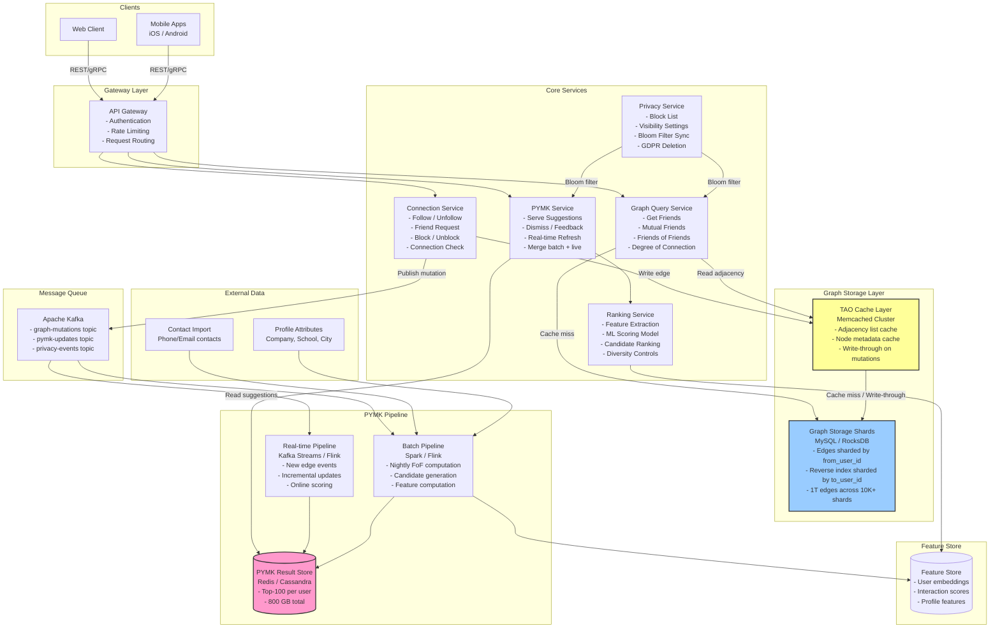

---

## 3. Component Deep Dive

### 3.1 Connection Service

```
Responsibility: Handle all graph mutation operations (write path)

Operations:
  - follow(user_a, user_b)       → Create directed edge A→B
  - unfollow(user_a, user_b)     → Remove edge A→B
  - send_friend_request(a, b)    → Create pending edge
  - accept_friend_request(a, b)  → Activate edge, create reverse edge B→A
  - block(a, b)                  → Create block edge, remove any existing connection
  - unblock(a, b)                → Remove block edge

Write Path:
  1. Validate request (rate limit, not already connected, not blocked)
  2. Write to TAO cache (write-through to storage)
  3. Update friend/follower counts (atomic increment)
  4. Publish graph-mutation event to Kafka
  5. Return success to client

Idempotency:
  - Use (from_id, to_id, operation, timestamp) as idempotency key
  - Repeated follow requests are no-ops
```

### 3.2 Graph Query Service

```
Responsibility: Serve all graph read queries with low latency

Operations:
  - get_friends(user_id, cursor, limit)
  - get_followers(user_id, cursor, limit)
  - check_connection(user_a, user_b)
  - get_mutual_friends(user_a, user_b, limit)
  - get_friends_of_friends(user_id, limit)
  - get_connection_degree(user_a, user_b)

Read Path:
  1. Check TAO cache for adjacency list
  2. On cache miss, fetch from Graph Storage Shards
  3. For mutual friends: fetch both adjacency lists, compute intersection
  4. Apply privacy filter (check Bloom filter for blocks)
  5. Return paginated results

Performance:
  - get_friends: O(1) cache lookup + O(k) for k results
  - check_connection: O(1) hash lookup in adjacency list
  - mutual_friends: O(min(|A|, |B|)) set intersection
  - friends_of_friends: O(|friends| x avg_degree) -- must sample
```

### 3.3 PYMK Service

```
Responsibility: Serve "People You May Know" suggestions

Read Path:
  1. Fetch precomputed PYMK list from PYMK Result Store
  2. Check freshness (if stale, trigger async recomputation)
  3. Filter: remove already-connected users, blocked users, dismissed users
  4. Merge with real-time candidates (new edges since last batch)
  5. Pass candidates to Ranking Service for final scoring
  6. Return top-N ranked suggestions with explanations

Merge Strategy (batch + real-time):
  - Batch: Precomputed top-500 candidates per user (nightly)
  - Real-time: When user X adds friend Y, Y's friends become new candidates for X
  - Merge: Union of batch + real-time, re-ranked by Ranking Service

Dismissals:
  - Stored in PYMK_Dismissal table (user_id, dismissed_id)
  - Loaded into a per-user Bloom filter for fast filtering
  - Dismissed users never reappear (until Bloom filter is rebuilt)
```

### 3.4 Ranking Service

```
Responsibility: Score and rank PYMK candidates using ML

Input: List of candidate user_ids + requesting user_id
Output: Ranked list with scores and explanation strings

Features used for scoring:
  ┌─────────────────────────────────────────────────────────────┐
  │  Feature Category        │  Features                        │
  ├──────────────────────────┼──────────────────────────────────┤
  │  Graph features          │  Mutual friend count             │
  │                          │  Jaccard similarity of friends   │
  │                          │  Adamic-Adar index               │
  │                          │  Shortest path length            │
  │                          │  Common communities              │
  ├──────────────────────────┼──────────────────────────────────┤
  │  Profile features        │  Same company                    │
  │                          │  Same school                     │
  │                          │  Same city/region                │
  │                          │  Industry overlap                │
  │                          │  Age proximity                   │
  ├──────────────────────────┼──────────────────────────────────┤
  │  Interaction features    │  Profile view frequency          │
  │                          │  Message history                 │
  │                          │  Event co-attendance             │
  │                          │  Group membership overlap        │
  ├──────────────────────────┼──────────────────────────────────┤
  │  Temporal features       │  Recency of mutual friendships   │
  │                          │  Account age                     │
  │                          │  Last active timestamp           │
  │                          │  Connection velocity             │
  ├──────────────────────────┼──────────────────────────────────┤
  │  Embedding features      │  Node embedding cosine similarity│
  │                          │  (from Graph Neural Network)     │
  └──────────────────────────┴──────────────────────────────────┘

Model: Gradient Boosted Trees (XGBoost/LightGBM) or deep model
Target: P(user accepts connection request | candidate shown)
```

### 3.5 Privacy Service

```
Responsibility: Enforce privacy rules across all graph queries

Components:
  1. Block List Store: (blocker_id, blocked_id) pairs in sharded MySQL
  2. Bloom Filter Generator: Creates compact Bloom filters of block pairs
  3. Privacy Settings Cache: User privacy preferences in Redis
  4. GDPR Deletion Worker: Handles account deletion cascades

Bloom Filter for Blocks:
  - Size: 10 bits per element, 3 hash functions → 1% false positive rate
  - Total blocked pairs: ~500M (estimate)
  - Bloom filter size: ~600 MB (fits in memory on each query server)
  - Updated every 5 minutes via background sync
  - False positives only cause extra DB lookups (safe direction)

Privacy Check Flow:
  1. Receive query: "mutual friends of A and B"
  2. Check Bloom filter: is (A, B) a blocked pair?
  3. If Bloom says "maybe blocked" → check DB
  4. If blocked → return empty / error
  5. Check A's privacy settings: are friends visible to B?
  6. If private → check if B is A's friend
  7. Only return results that pass all privacy checks
```

---

## 4. Graph Storage Approaches

This section compares four approaches. Each has trade-offs at our scale (2B nodes, 1T edges).

### 4.1 Approach 1: Adjacency List in SQL (Simple but Slow)

```sql
-- Schema
CREATE TABLE edges (
    from_user_id  BIGINT NOT NULL,
    to_user_id    BIGINT NOT NULL,
    edge_type     TINYINT NOT NULL,    -- 1=friend, 2=follow, 3=blocked
    created_at    TIMESTAMP NOT NULL,
    PRIMARY KEY (from_user_id, to_user_id),
    INDEX idx_reverse (to_user_id, from_user_id),
    INDEX idx_type_time (from_user_id, edge_type, created_at DESC)
);

-- Get friends of user 123
SELECT to_user_id FROM edges
WHERE from_user_id = 123 AND edge_type = 1
ORDER BY created_at DESC;

-- Mutual friends of users 123 and 456
SELECT a.to_user_id FROM edges a
JOIN edges b ON a.to_user_id = b.to_user_id
WHERE a.from_user_id = 123 AND b.from_user_id = 456
AND a.edge_type = 1 AND b.edge_type = 1;

-- Friends of friends for user 123 (2-hop BFS)
SELECT DISTINCT e2.to_user_id, COUNT(*) as mutual_count
FROM edges e1
JOIN edges e2 ON e1.to_user_id = e2.from_user_id
WHERE e1.from_user_id = 123
  AND e1.edge_type = 1
  AND e2.edge_type = 1
  AND e2.to_user_id != 123
  AND e2.to_user_id NOT IN (
    SELECT to_user_id FROM edges WHERE from_user_id = 123
  )
GROUP BY e2.to_user_id
ORDER BY mutual_count DESC
LIMIT 50;
```

```
PROS:
  ✓ Simple, well-understood
  ✓ ACID transactions for friend request accept (create 2 edges atomically)
  ✓ SQL is flexible for ad-hoc queries
  ✓ Easy to add indexes for different access patterns

CONS:
  ✗ JOINs for mutual friends / FoF are extremely expensive at scale
  ✗ Single SQL table cannot hold 1T rows
  ✗ Sharding breaks JOINs (cross-shard joins are nightmare)
  ✗ 2-hop BFS query involves nested subqueries and huge intermediate results
  ✗ No native graph traversal optimization

VERDICT: Good for < 1M users. Unacceptable for our 2B user scale.
```

### 4.2 Approach 2: Adjacency List in Key-Value Store (Fast Reads, Eventual Consistency)

```
Key-Value Model:
  Key:   user:{user_id}:friends
  Value: Sorted Set of (friend_id, timestamp)

  Key:   user:{user_id}:followers
  Value: Sorted Set of (follower_id, timestamp)

  Key:   user:{user_id}:following
  Value: Sorted Set of (following_id, timestamp)

Example (Redis-like):
  ZADD user:123:friends 1712505600 "456"    # Add friend 456 with timestamp
  ZRANGE user:123:friends 0 19              # Get first 20 friends
  ZSCORE user:123:friends "456"             # Check if 456 is a friend (O(1))
  ZCARD user:123:friends                    # Friend count

Mutual Friends (application-level set intersection):
  friends_A = ZRANGE user:123:friends 0 -1
  friends_B = ZRANGE user:456:friends 0 -1
  mutual = intersection(friends_A, friends_B)
```

```
PROS:
  ✓ O(1) friend check, O(k) friend list retrieval
  ✓ Horizontally scalable (shard by user_id)
  ✓ No JOINs -- adjacency list is pre-materialized
  ✓ Can store in Redis (in-memory) for ultra-low latency
  ✓ Sorted sets give free pagination by timestamp

CONS:
  ✗ Mutual friends requires fetching both full lists to client/app layer
  ✗ No transactions across keys (A→B and B→A must be separate writes)
  ✗ Eventual consistency for bidirectional edges
  ✗ Celebrity problem: user with 100M followers → 100M element sorted set (~800MB)
  ✗ No graph traversal primitives (BFS must be coded in application)

VERDICT: Good middle ground. Used by many real systems with an application-layer
         graph query engine on top.
```

### 4.3 Approach 3: Graph Database (Neo4j -- Native Graph Traversal)

```cypher
// Schema-less nodes and relationships
CREATE (u1:User {id: 123, name: "Alice"})
CREATE (u2:User {id: 456, name: "Bob"})
CREATE (u1)-[:FRIEND {since: datetime("2025-01-15")}]->(u2)
CREATE (u2)-[:FRIEND {since: datetime("2025-01-15")}]->(u1)

// Get friends of Alice
MATCH (alice:User {id: 123})-[:FRIEND]->(friend)
RETURN friend.id, friend.name

// Mutual friends of Alice and Bob
MATCH (alice:User {id: 123})-[:FRIEND]->(mutual)<-[:FRIEND]-(bob:User {id: 456})
RETURN mutual.id, mutual.name

// Friends of friends (2-hop, excluding existing friends)
MATCH (me:User {id: 123})-[:FRIEND]->()-[:FRIEND]->(fof)
WHERE NOT (me)-[:FRIEND]->(fof) AND fof.id <> 123
RETURN fof.id, COUNT(*) AS mutual_count
ORDER BY mutual_count DESC
LIMIT 50

// Shortest path between two users
MATCH path = shortestPath(
  (a:User {id: 123})-[:FRIEND*..6]-(b:User {id: 789})
)
RETURN length(path), [n IN nodes(path) | n.name]
```

```
PROS:
  ✓ Native graph traversal -- index-free adjacency (pointer chasing)
  ✓ Cypher query language is expressive for graph patterns
  ✓ BFS, shortest path, pattern matching built-in
  ✓ Relationship properties (edge attributes) are first-class
  ✓ Variable-length path queries (1..6 hops) are efficient

CONS:
  ✗ Horizontal scaling is limited (Neo4j Enterprise has sharding but it's complex)
  ✗ Cannot easily handle 2B nodes / 1T edges on a single cluster
  ✗ Write throughput is lower than KV stores
  ✗ Operational complexity: backup, recovery, monitoring
  ✗ Vendor lock-in with Cypher query language
  ✗ Memory requirements: Neo4j wants the graph in memory for best performance

VERDICT: Excellent for graph queries at medium scale (< 100M nodes).
         Facebook/LinkedIn/Twitter all built custom solutions for billion-scale.
```

### 4.4 Approach 4: Facebook TAO (The Real-World Answer)

```
TAO = "The Associations and Objects" graph store

Two abstractions:
  1. Objects (nodes):  (id, otype, data)
      - id: globally unique 64-bit integer
      - otype: type of object (user, page, post, comment, photo, etc.)
      - data: key-value pairs (JSON-like)

  2. Associations (edges): (id1, atype, id2, time, data)
      - id1: source object ID
      - atype: association type (friend, follow, like, tagged_in, etc.)
      - id2: destination object ID
      - time: timestamp (used for ordering)
      - data: edge attributes

API (just 5 operations):
  obj_get(id)                              → Get object by ID
  assoc_get(id1, atype, id2s)             → Check specific edges
  assoc_range(id1, atype, pos, limit)     → Get edges by type, paginated
  assoc_count(id1, atype)                 → Count edges of type
  assoc_time_range(id1, atype, t1, t2)   → Get edges in time range
```

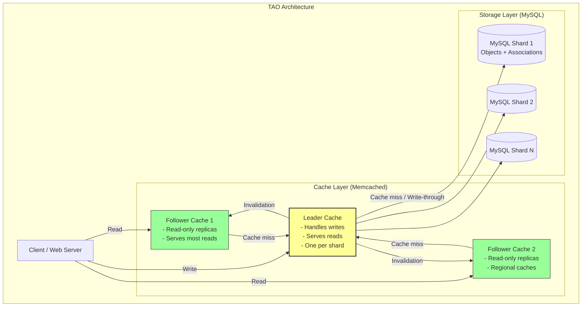

```
TAO Architecture Details:

Write Path:
  1. Client sends write to Leader Cache
  2. Leader Cache writes to MySQL (synchronous, write-through)
  3. Leader Cache updates its own cache
  4. Leader Cache sends async invalidation to all Follower Caches
  5. Follower Caches evict stale entry (lazy reload on next read)

Read Path (Follower Cache):
  1. Client reads from nearest Follower Cache
  2. Cache hit → return immediately (99%+ hit rate)
  3. Cache miss → Follower asks Leader Cache
  4. Leader hit → return and populate Follower
  5. Leader miss → Leader reads from MySQL, populates both caches

Consistency:
  - Reads from Follower Caches are eventually consistent
  - After a write, Leader Cache is immediately consistent
  - Follower Caches converge within ~1 second (invalidation propagation)
  - "Read-after-write" consistency: route the writer's reads to Leader Cache

PROS:
  ✓ Battle-tested at Facebook scale (billions of users, trillions of edges)
  ✓ 99%+ cache hit rate → MySQL sees minimal load
  ✓ Simple API (5 operations) covers all graph access patterns
  ✓ MySQL provides durable, transactional storage
  ✓ Follower Caches enable geographic distribution
  ✓ Graceful degradation (if cache fails, reads go to MySQL)

CONS:
  ✗ Complex distributed system to build and operate
  ✗ Eventual consistency for reads from Follower Caches
  ✗ Requires careful shard management for MySQL
  ✗ Not open-source (proprietary Facebook technology)
  ✗ No native graph traversal (BFS must be coded in application layer)

VERDICT: The gold standard for social graph storage at scale.
         In an interview, say "I'd build something inspired by TAO" and
         explain the leader-follower cache + MySQL storage model.
```

### 4.5 Storage Approach Comparison

```
┌───────────────────┬──────────┬───────────┬───────────┬──────────────┐
│                   │ SQL      │ KV Store  │ Graph DB  │ TAO          │
│                   │ (MySQL)  │ (Redis)   │ (Neo4j)   │ (MySQL+MC)   │
├───────────────────┼──────────┼───────────┼───────────┼──────────────┤
│ Max scale         │ ~100M    │ ~10B      │ ~500M     │ Trillions    │
│ Read latency      │ 1-10ms   │ <1ms      │ 1-5ms     │ <1ms (cache) │
│ Write latency     │ 1-5ms    │ <1ms      │ 2-10ms    │ 5-10ms       │
│ Graph traversal   │ Slow     │ App-level │ Native    │ App-level    │
│ Consistency       │ Strong   │ Eventual  │ Strong    │ Eventual     │
│ Operational cost  │ Low      │ Medium    │ High      │ High         │
│ Who uses it       │ Small    │ Twitter   │ Startups  │ Facebook     │
│                   │ startups │ Pinterest │ Mid-size  │ (inspired by)│
└───────────────────┴──────────┴───────────┴───────────┴──────────────┘

RECOMMENDED: For an interview at FAANG scale, describe the TAO approach.
For a startup interview, describe KV Store + application-layer graph queries.
```

---

## 5. Graph Query Patterns

### 5.1 Get Friends (1-hop neighbors)

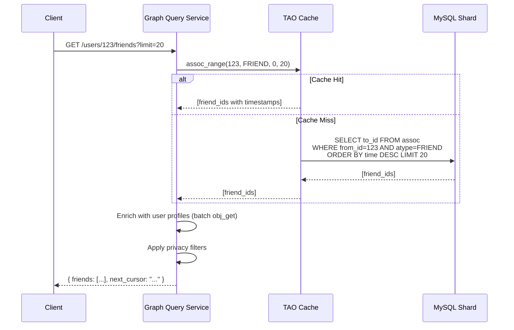

```
Complexity: O(1) cache lookup + O(k) for k results
Latency: < 5ms (cache hit), < 50ms (cache miss)
```

### 5.2 Check Connection (Edge Existence)

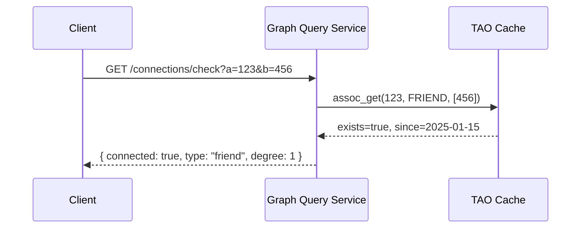

```
Complexity: O(1) hash lookup in cached adjacency list
Latency: < 2ms (cache hit)
Called: On every profile view, every feed item → must be FAST
```

### 5.3 Mutual Friends (Set Intersection)

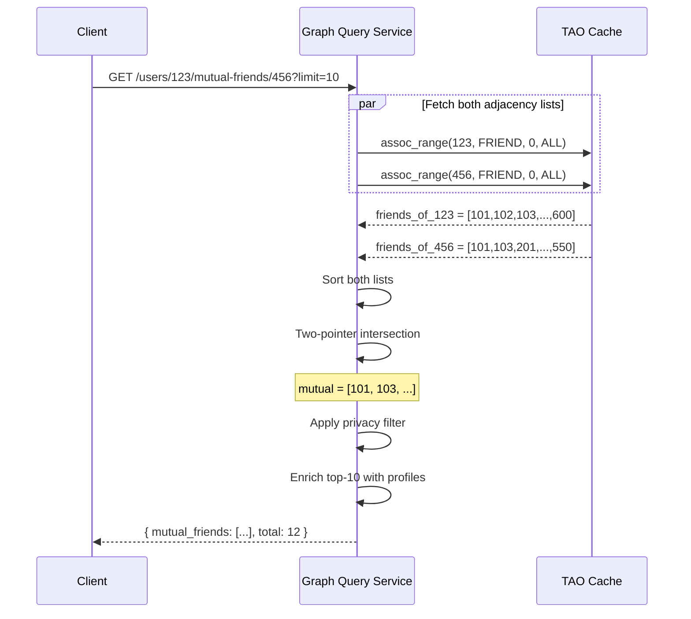

```
Algorithm: Sorted Set Intersection (Two-Pointer)

  def mutual_friends(user_a, user_b):
      friends_a = sorted(get_friends(user_a))  # O(n log n)
      friends_b = sorted(get_friends(user_b))  # O(m log m)

      mutual = []
      i, j = 0, 0
      while i < len(friends_a) and j < len(friends_b):
          if friends_a[i] == friends_b[j]:
              mutual.append(friends_a[i])
              i += 1
              j += 1
          elif friends_a[i] < friends_b[j]:
              i += 1
          else:
              j += 1
      return mutual

Complexity: O(n + m) where n, m are the friend counts of A and B
  - If both have 500 friends: O(1000) comparisons
  - This is fast! The bottleneck is fetching the lists, not the intersection

Optimization for users with very different list sizes:
  - If |A| = 50 and |B| = 5000, use binary search: O(50 x log(5000)) = O(600)
  - Better than O(5050) linear merge
```

### 5.4 Friends of Friends (2-Hop BFS)

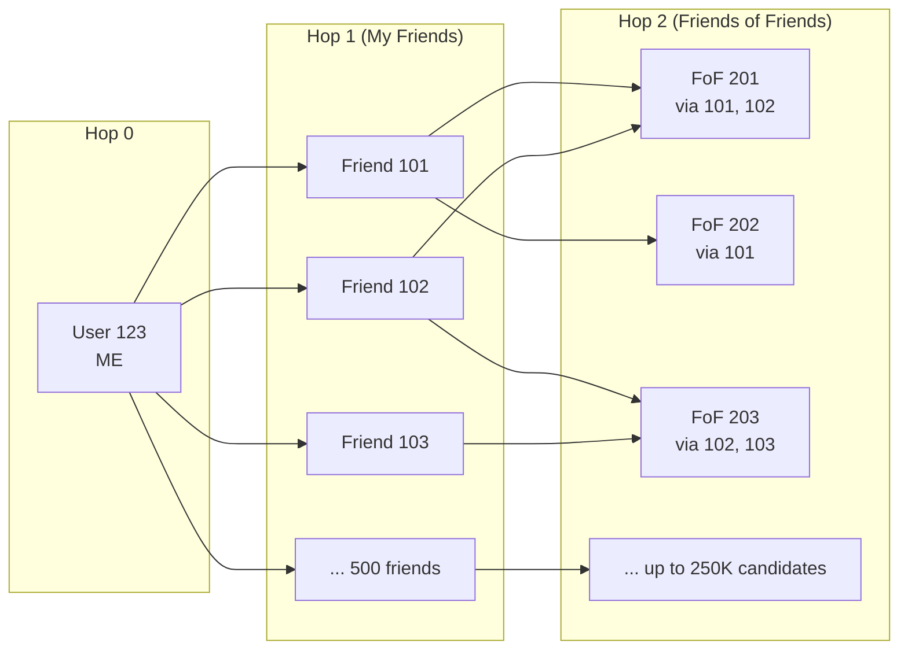

```
Algorithm: 2-Hop BFS with Aggregation

  def friends_of_friends(user_id):
      my_friends = set(get_friends(user_id))     # 500 friends
      candidates = Counter()                       # candidate → mutual count

      for friend in my_friends:
          fof_list = get_friends(friend)           # 500 friends each
          for fof in fof_list:
              if fof != user_id and fof not in my_friends:
                  candidates[fof] += 1              # Count mutual friends

      # Sort by mutual friend count (descending)
      return candidates.most_common(50)

Scale Analysis:
  - 500 friends, each with 500 friends
  - 500 x 500 = 250,000 candidate evaluations
  - After dedup: maybe ~50K unique candidates
  - Need to fetch 501 adjacency lists (1 + 500 friends)
  - At 5ms each = 2.5 seconds sequential
  - With batching and parallelism: ~100-200ms

This is the CORE of the PYMK algorithm!
```

### 5.5 N-Degree Connection (Shortest Path)

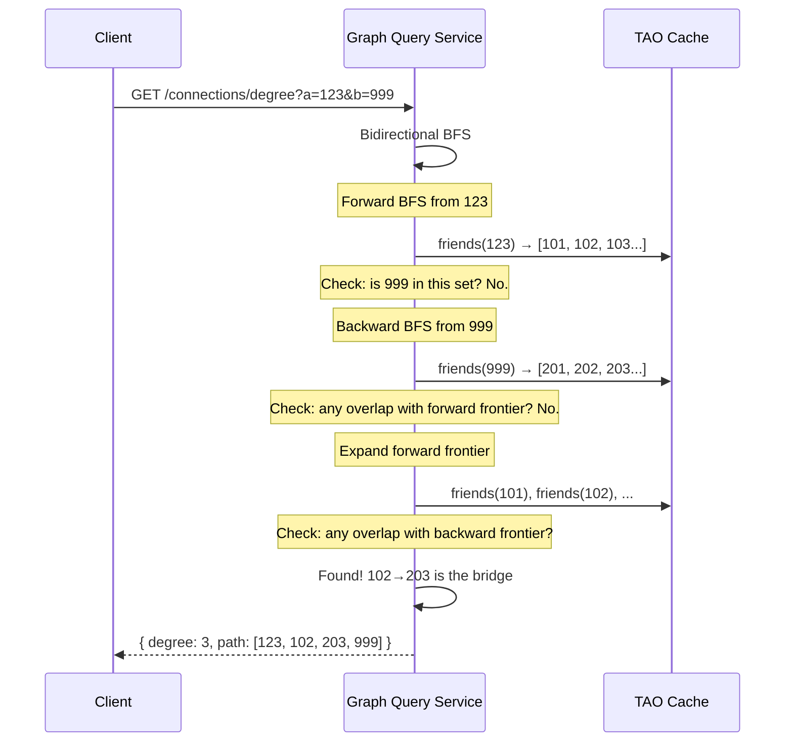

```
Algorithm: Bidirectional BFS

  - Expand BFS from both source and target simultaneously
  - Meet in the middle → reduces search space exponentially
  - Unidirectional BFS with branching factor b and depth d: O(b^d)
  - Bidirectional BFS: O(2 * b^(d/2)) which is MUCH smaller

  LinkedIn limits to 3rd-degree connections:
    - 1st degree: direct connection
    - 2nd degree: friend-of-friend
    - 3rd degree: friend-of-friend-of-friend
    - Beyond: "Out of network"

  Search space:
    - 1-hop: 500 nodes
    - 2-hop: 250,000 nodes (500 x 500)
    - 3-hop: 125,000,000 nodes (500^3) ← "six degrees of separation"
    - Bidirectional 3-hop: 2 x 500^1.5 ≈ 22,000 nodes (MUCH better)
```

---

## 6. PYMK Algorithm and Pipeline

### 6.1 End-to-End PYMK Architecture

```mermaid
graph TB
    subgraph "Candidate Generation (Recall)"
        CG1[Friends of Friends<br/>2-hop BFS<br/>~5K candidates per user]
        CG2[Same Company / School<br/>Profile attribute matching<br/>~1K candidates]
        CG3[Contact Import<br/>Phone/email matches<br/>~200 candidates]
        CG4[Graph Embeddings<br/>Node2Vec / GraphSAGE<br/>~500 candidates by similarity]
        CG5[Collaborative Filtering<br/>Users with similar friend patterns<br/>~300 candidates]
    end

    subgraph "Filtering"
        F1[Remove Existing Friends]
        F2[Remove Blocked Users]
        F3[Remove Dismissed Suggestions]
        F4[Remove Private Accounts<br/>that don't allow suggestions]
        F5[Remove Inactive Accounts]
    end

    subgraph "Ranking (Precision)"
        R1[Feature Extraction<br/>Mutual count, profile sim,<br/>interaction signals, recency]
        R2[ML Scoring Model<br/>P(accept | features)<br/>XGBoost / Neural Network]
        R3[Diversity Re-ranking<br/>Mix candidates from<br/>different social circles]
    end

    subgraph "Serving"
        S1[Top-100 Results Stored<br/>in PYMK Result Cache]
        S2[Real-time Merge Layer<br/>Inject fresh candidates<br/>from recent graph changes]
        S3[Serve to Client<br/>Paginated, with explanations]
    end

    CG1 --> F1
    CG2 --> F1
    CG3 --> F1
    CG4 --> F1
    CG5 --> F1
    F1 --> F2 --> F3 --> F4 --> F5
    F5 --> R1 --> R2 --> R3
    R3 --> S1
    S1 --> S2 --> S3
```

### 6.2 The Classic FoF Algorithm (Detailed)

```python
# Core PYMK Algorithm: Friends-of-Friends ranked by mutual friend count

def compute_pymk(user_id, max_friends_to_sample=50, max_fof_per_friend=100):
    """
    The classic PYMK algorithm used by Facebook/LinkedIn.

    Instead of exhaustive 2-hop BFS (500 x 500 = 250K):
    - Sample 50 of user's friends (weighted by interaction recency)
    - For each, sample 100 of their friends
    - Total: 50 x 100 = 5,000 candidates (manageable!)
    """

    # Step 1: Get user's friends, sample a subset
    all_friends = get_friends(user_id)                     # 500 friends
    my_friends_set = set(all_friends)

    # Weight by interaction frequency (closer friends = better signal)
    sampled_friends = weighted_sample(
        all_friends,
        weights=get_interaction_scores(user_id, all_friends),
        k=max_friends_to_sample                            # 50
    )

    # Step 2: For each sampled friend, get THEIR friends
    candidates = Counter()  # candidate_id → mutual_friend_count

    for friend in sampled_friends:
        friend_friends = get_friends(friend)               # 500 each
        sampled_fof = random_sample(friend_friends, k=max_fof_per_friend)  # 100

        for fof in sampled_fof:
            if fof != user_id and fof not in my_friends_set:
                candidates[fof] += 1                        # Increment mutual count

    # Step 3: Get top candidates by mutual friend count
    top_candidates = candidates.most_common(500)

    # Step 4: Compute features and score each candidate
    scored = []
    for candidate_id, mutual_count in top_candidates:
        features = extract_features(user_id, candidate_id, mutual_count)
        score = ml_model.predict(features)
        scored.append((candidate_id, score, mutual_count))

    # Step 5: Sort by ML score, apply diversity, return top 100
    scored.sort(key=lambda x: x[1], reverse=True)
    diversified = apply_diversity_rules(scored)
    return diversified[:100]
```

### 6.3 PYMK Scoring Features (Detailed)

```
GRAPH-BASED FEATURES:
  1. mutual_friend_count:
     Number of common friends between user and candidate
     Example: user has 500 friends, candidate has 400, mutual = 23
     This is THE most predictive feature

  2. jaccard_similarity:
     |A ∩ B| / |A ∪ B| = 23 / (500 + 400 - 23) = 0.026
     Normalizes for users with very different friend counts

  3. adamic_adar_index:
     Σ (1 / log(degree(z))) for each mutual friend z
     Gives more weight to mutual friends who have few connections
     (A mutual friend with 50 connections is stronger signal than one with 5000)

  4. preferential_attachment:
     degree(A) x degree(B) = 500 x 400 = 200,000
     High-degree users are more likely to form connections

  5. resource_allocation_index:
     Σ (1 / degree(z)) for each mutual friend z
     Similar to Adamic-Adar but stronger penalty for high-degree mutual friends

PROFILE-BASED FEATURES:
  6. same_company:       Boolean (1 if same current employer)
  7. same_school:        Boolean (1 if attended same school)
  8. same_city:          Boolean (1 if same city in profile)
  9. industry_match:     Boolean (1 if same industry)
  10. title_similarity:  Cosine similarity of job title embeddings

INTERACTION-BASED FEATURES:
  11. profile_views:     How many times user viewed candidate's profile
  12. search_appearances: Did candidate appear in user's searches?
  13. group_overlap:     Number of shared groups/communities
  14. event_coattendance: Attended the same events

TEMPORAL FEATURES:
  15. recency_of_mutuals: Average age of mutual friendships
      (Recent mutual friends = higher PYMK relevance)
  16. candidate_account_age: New accounts get boosted (cold start)
  17. user_connection_velocity: How actively is the user adding friends?
```

### 6.4 Batch vs. Real-time PYMK

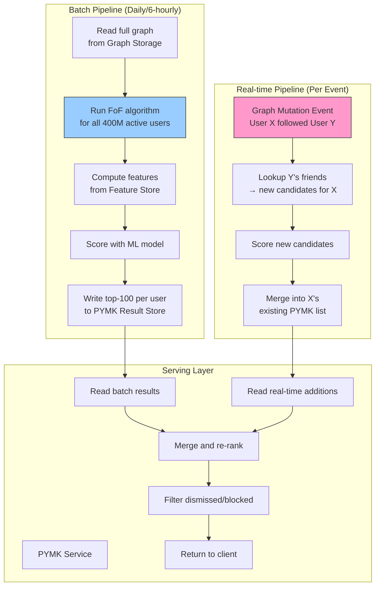

```
Why hybrid (batch + real-time)?

Batch alone:
  - Stale by hours: User adds 3 new friends → PYMK doesn't reflect until next batch
  - Expensive: 6 hours on 1000 cores just for FoF computation

Real-time alone:
  - Cannot do exhaustive candidate generation (too expensive per-request)
  - Missing the "global" view (e.g., contact import, profile similarity)

Hybrid:
  - Batch provides the baseline: broad candidate pool, feature-rich scoring
  - Real-time provides freshness: new connections immediately produce new candidates
  - Serving layer merges both: O(1) read of batch + O(small) merge of real-time updates
```

---

## 7. Data Flow Walkthroughs

### 7.1 Follow/Add Friend Flow

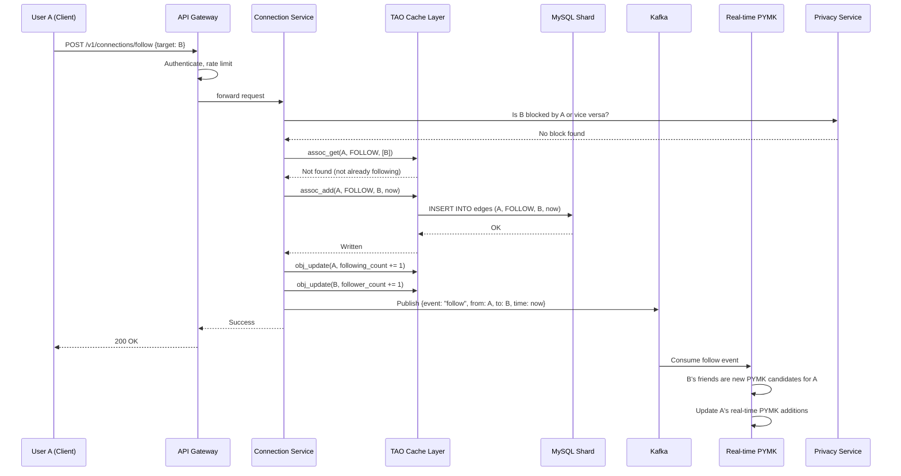

### 7.2 Mutual Friends Query Flow

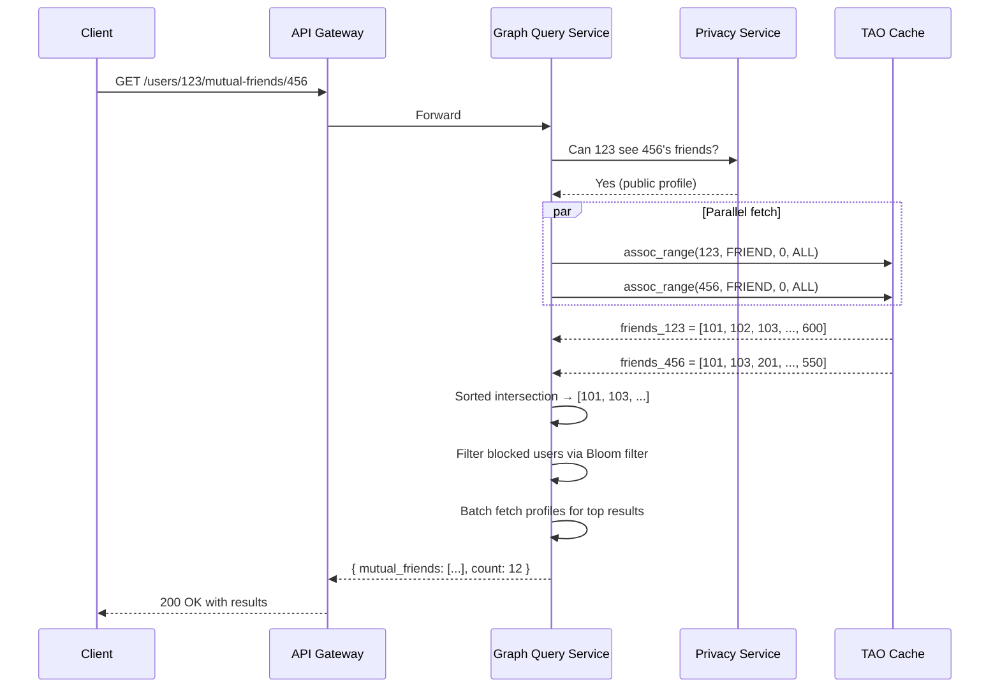

### 7.3 PYMK Request Flow

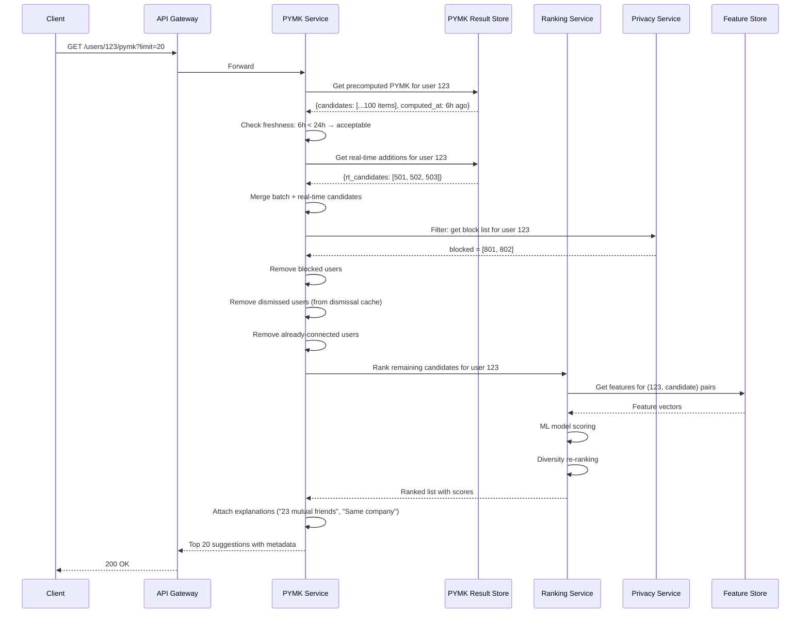

---

## 8. Caching Strategy

### 8.1 Multi-Layer Cache Architecture

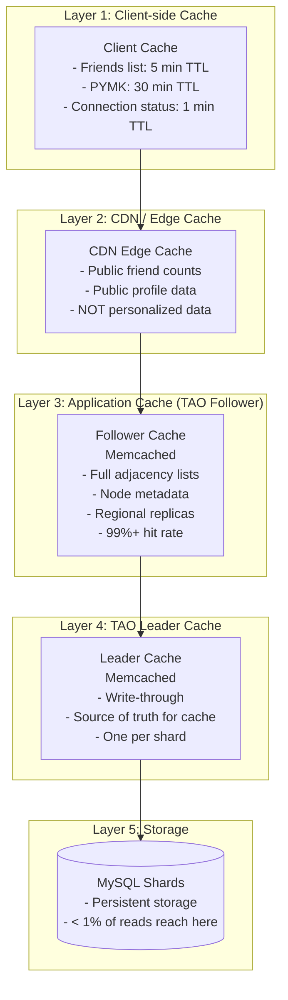

### 8.2 Cache Key Design

```
Adjacency List Cache:
  Key:    adj:{user_id}:{edge_type}
  Value:  Sorted list of (target_id, timestamp) pairs
  TTL:    1 hour (with invalidation on writes)
  Size:   500 edges x 16 bytes = 8 KB average

  Example: adj:123:friend → [(101,1704067200), (102,1704153600), ...]

Edge Existence Cache:
  Key:    edge:{from_id}:{to_id}:{type}
  Value:  1 (exists) or 0 (not exists)
  TTL:    5 minutes
  Size:   1 byte

  Example: edge:123:456:friend → 1

Friend Count Cache:
  Key:    count:{user_id}:{type}
  Value:  Integer count
  TTL:    10 minutes (with invalidation on writes)

  Example: count:123:friend → 487

PYMK Result Cache:
  Key:    pymk:{user_id}
  Value:  JSON array of top-100 candidates with scores
  TTL:    24 hours (refreshed by batch pipeline)
  Size:   ~2 KB per user

  Example: pymk:123 → [{id:501,score:0.87,mutual:23}, ...]

Block List Bloom Filter:
  Key:    bloom:blocks:{shard_id}
  Value:  Bloom filter bitset
  TTL:    5 minutes (rebuilt from DB)
  Size:   ~600 MB total (in-memory on each query server)
```

### 8.3 Cache Invalidation Strategy

```
Write-Through (TAO Leader):
  1. User A follows B
  2. Write to MySQL: INSERT edge (A, FOLLOW, B)
  3. Update Leader Cache: add B to adj:A:follow
  4. Send invalidation to Follower Caches: EVICT adj:A:follow
  5. Follower Caches reload on next access

Count Invalidation:
  1. After edge write, increment count in Leader Cache
  2. Invalidate count in Follower Caches
  3. On reload, Follower reads from Leader (not DB)

PYMK Invalidation:
  1. Real-time pipeline detects new edge event
  2. Computes incremental PYMK updates
  3. Appends to pymk_rt:{user_id} (real-time additions key)
  4. Serving layer merges batch + RT on each request
  5. Batch pipeline overwrites pymk:{user_id} every 6 hours
```

---

## 9. Graph Partitioning

### 9.1 Partitioning by User ID

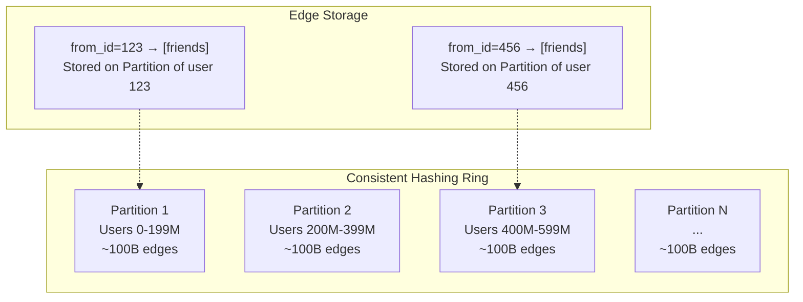

```
Strategy: Hash(user_id) mod N → partition number

Each partition stores:
  - All outgoing edges for users assigned to that partition
  - Reverse index: incoming edges (for "followers of X" queries)

Problem: Friends span partitions!
  User 123 (Partition 1) is friends with User 456 (Partition 3)
  - Outgoing edge (123→456) on Partition 1
  - Outgoing edge (456→123) on Partition 3 (reverse direction stored separately)
  - Mutual friends query: both partitions needed
```

### 9.2 Cross-Partition Queries (Scatter-Gather)

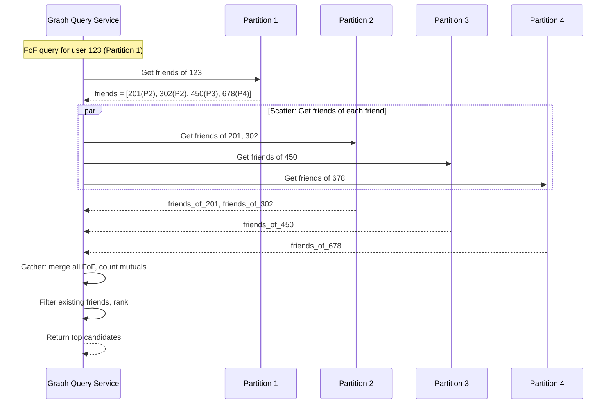

```
Scatter-Gather Trade-offs:

Latency = max(partition response times)
  - If one partition is slow, the entire query is slow
  - Mitigation: hedged requests (send to 2 replicas, take first response)

Fan-out factor:
  - FoF query for user with 500 friends across 100 partitions
  - = 100 parallel partition queries (high fan-out)
  - Each partition handles many such scatter requests
  - Amplification: 1 client request → 100+ internal requests

Mitigation strategies:
  1. Aggressive caching (TAO reduces 99% of scatter to cache hits)
  2. Locality-aware partitioning (colocate friends on same partition)
  3. Precomputed results (FoF / PYMK computed in batch, not real-time)
  4. Sampling (don't query ALL friends, sample 50)
```

### 9.3 Alternative: Social Partitioning (Graph-Aware)

```
Idea: Instead of hash(user_id), partition based on social clusters.
      Friends are likely colocated → fewer cross-partition queries.

Algorithm: METIS graph partitioning
  - Find communities in the social graph
  - Assign each community to a partition
  - Minimize cross-partition edges

PROS:
  ✓ Most graph queries stay within 1-2 partitions
  ✓ Dramatically reduces scatter-gather fan-out
  ✓ Better cache locality

CONS:
  ✗ Expensive to compute (NP-hard, approximation algorithms)
  ✗ Must rebalance as graph evolves (new friendships cross partitions)
  ✗ Uneven partition sizes (some communities are huge)
  ✗ New users have no community yet (where to place them?)
  ✗ Global friendships (A in US, B in India) always cross partitions

VERDICT: In practice, hash partitioning + aggressive caching wins.
         Facebook uses hash partitioning with TAO's cache absorbing
         99%+ of reads, making cross-partition costs negligible for reads.
```

---

## 10. Communication Patterns

### 10.1 Synchronous (Request-Response)

```
Used for:
  - All client-facing API calls (follow, get friends, PYMK)
  - Inter-service calls during request processing
  - TAO cache reads (latency-critical)

Protocol: gRPC for internal service-to-service, REST for client-facing

Timeout strategy:
  - TAO cache read: 5ms timeout (fallback to Leader Cache)
  - Leader Cache read: 20ms timeout (fallback to MySQL)
  - MySQL read: 100ms timeout
  - Cross-service calls: 200ms timeout
  - Client-facing API: 500ms total budget
```

### 10.2 Asynchronous (Event-Driven)

```
Used for:
  - Graph mutation propagation (follow/unfollow events)
  - PYMK pipeline updates
  - Cache invalidation
  - Privacy event cascades (block → update Bloom filter)
  - GDPR deletion cascades

Kafka Topics:
  graph-mutations:     { event, from_id, to_id, type, timestamp }
  pymk-updates:        { user_id, new_candidates, removed_candidates }
  privacy-events:      { event, user_id, target_id, action }
  deletion-requests:   { user_id, deletion_type, requested_at }
```

### 10.3 Topic Design

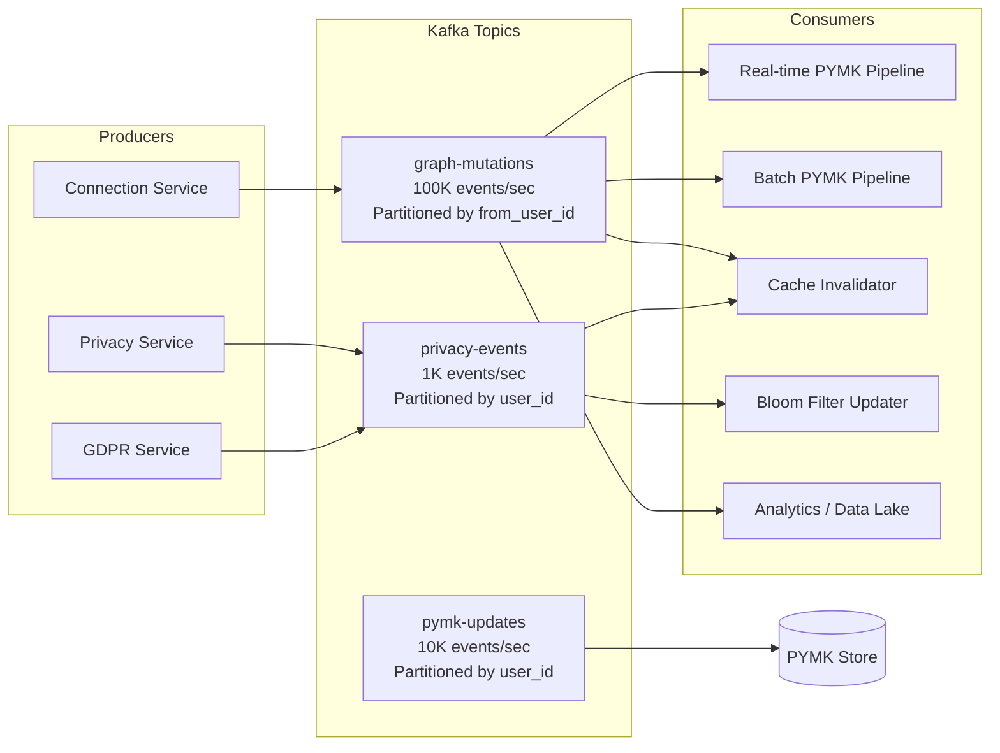

---

## 11. Database Design Details

### 11.1 MySQL Schema (TAO Storage Layer)

```sql
-- Object table (users, pages, groups, etc.)
CREATE TABLE objects (
    id          BIGINT PRIMARY KEY,
    otype       SMALLINT NOT NULL,        -- 1=user, 2=page, 3=group, ...
    data        BLOB,                      -- serialized key-value pairs
    version     INT DEFAULT 1,
    created_at  TIMESTAMP DEFAULT NOW(),
    updated_at  TIMESTAMP DEFAULT NOW(),
    INDEX idx_otype (otype)
) ENGINE=InnoDB;

-- Association table (edges between objects)
CREATE TABLE associations (
    id1         BIGINT NOT NULL,           -- source object
    atype       SMALLINT NOT NULL,         -- 1=friend, 2=follow, 3=like, ...
    id2         BIGINT NOT NULL,           -- target object
    time        BIGINT NOT NULL,           -- timestamp (for ordering)
    data        BLOB,                      -- edge attributes
    version     INT DEFAULT 1,
    PRIMARY KEY (id1, atype, id2),
    INDEX idx_range (id1, atype, time DESC),   -- assoc_range queries
    INDEX idx_reverse (id2, atype, id1)         -- reverse lookups
) ENGINE=InnoDB;

-- Association count table (denormalized for O(1) count queries)
CREATE TABLE assoc_counts (
    id1         BIGINT NOT NULL,
    atype       SMALLINT NOT NULL,
    count       INT NOT NULL DEFAULT 0,
    updated_at  TIMESTAMP DEFAULT NOW(),
    PRIMARY KEY (id1, atype)
) ENGINE=InnoDB;

-- Sharding: Each MySQL instance holds a range of id1 values
-- Shard key: hash(id1) mod num_shards
-- Typical setup: 10,000+ shards across 1,000+ MySQL instances
```

### 11.2 PYMK Result Storage

```sql
-- Precomputed PYMK suggestions (in Cassandra or Redis)

-- Cassandra schema:
CREATE TABLE pymk_results (
    user_id       BIGINT,
    candidate_id  BIGINT,
    score         FLOAT,
    mutual_count  INT,
    reason        TEXT,                    -- "23 mutual friends"
    sources       SET<TEXT>,               -- {"fof", "same_company"}
    computed_at   TIMESTAMP,
    PRIMARY KEY (user_id, score, candidate_id)
) WITH CLUSTERING ORDER BY (score DESC, candidate_id ASC);
-- Partition by user_id, sorted by score descending
-- Query: SELECT * FROM pymk_results WHERE user_id = 123 LIMIT 20

-- Dismissals table:
CREATE TABLE pymk_dismissals (
    user_id           BIGINT,
    dismissed_user_id BIGINT,
    dismissed_at      TIMESTAMP,
    reason            TEXT,
    PRIMARY KEY (user_id, dismissed_user_id)
);

-- Real-time PYMK additions (short-lived, merged into batch):
CREATE TABLE pymk_realtime (
    user_id       BIGINT,
    candidate_id  BIGINT,
    score         FLOAT,
    mutual_count  INT,
    added_at      TIMESTAMP,
    PRIMARY KEY (user_id, added_at, candidate_id)
) WITH default_time_to_live = 86400;  -- TTL: 24 hours
```

### 11.3 Privacy and Block Storage

```sql
-- Block list (MySQL, sharded by blocker_id)
CREATE TABLE block_list (
    blocker_id   BIGINT NOT NULL,
    blocked_id   BIGINT NOT NULL,
    created_at   TIMESTAMP DEFAULT NOW(),
    PRIMARY KEY (blocker_id, blocked_id),
    INDEX idx_blocked (blocked_id, blocker_id)
);

-- Privacy settings (MySQL or Redis)
CREATE TABLE privacy_settings (
    user_id             BIGINT PRIMARY KEY,
    friends_visibility  ENUM('public', 'friends', 'private') DEFAULT 'friends',
    profile_visibility  ENUM('public', 'friends', 'private') DEFAULT 'public',
    pymk_eligible       BOOLEAN DEFAULT TRUE,
    searchable          BOOLEAN DEFAULT TRUE,
    updated_at          TIMESTAMP DEFAULT NOW()
);
```

### 11.4 Interaction Tracking (for PYMK Ranking)

```sql
-- Interaction signals (Cassandra, time-series)
CREATE TABLE user_interactions (
    user_id          BIGINT,
    target_user_id   BIGINT,
    interaction_type TEXT,                  -- "profile_view", "message", "like", "comment"
    occurred_at      TIMESTAMP,
    PRIMARY KEY ((user_id, target_user_id), occurred_at)
) WITH CLUSTERING ORDER BY (occurred_at DESC)
  AND default_time_to_live = 7776000;      -- 90-day retention

-- Aggregated interaction scores (precomputed daily)
CREATE TABLE interaction_scores (
    user_id          BIGINT,
    target_user_id   BIGINT,
    score            FLOAT,                -- Weighted aggregate
    last_interaction  TIMESTAMP,
    interaction_count INT,
    computed_at      TIMESTAMP,
    PRIMARY KEY (user_id, target_user_id)
);
```
