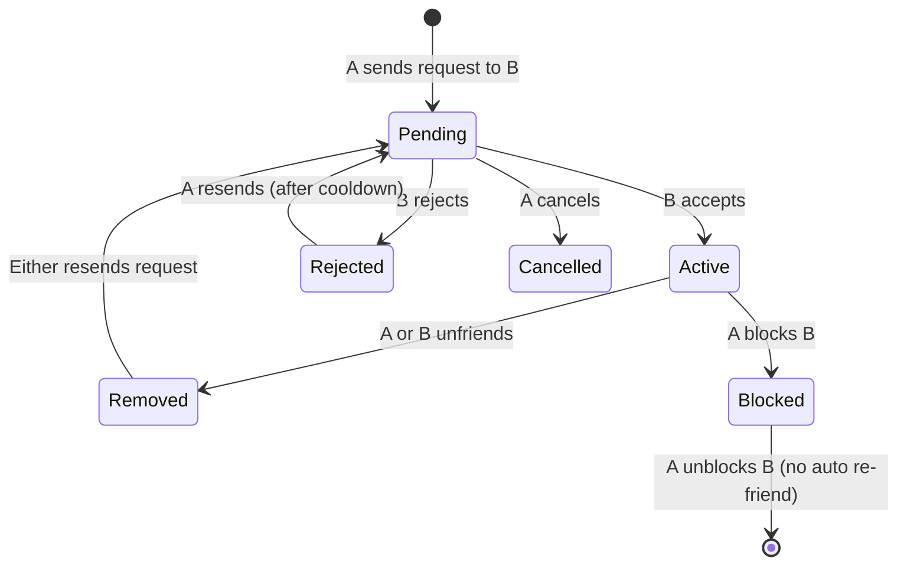

# Design a Social Graph / People You May Know (PYMK): Requirements and Estimation

## Table of Contents
- [1. Problem Statement](#1-problem-statement)
- [2. Functional Requirements](#2-functional-requirements)
- [3. Non-Functional Requirements](#3-non-functional-requirements)
- [4. Out of Scope](#4-out-of-scope)
- [5. Back-of-Envelope Estimation](#5-back-of-envelope-estimation)
- [6. API Design](#6-api-design)
- [7. Data Model Overview](#7-data-model-overview)
- [8. Graph Data Model Concepts](#8-graph-data-model-concepts)
- [9. Interview Tips for This Problem](#9-interview-tips-for-this-problem)

---

## 1. Problem Statement

Design a social graph system (like Facebook's friend graph, LinkedIn's professional
network, or Twitter's follow graph) that stores relationships between billions of users,
enables real-time graph queries (mutual friends, friends-of-friends), and powers a
"People You May Know" recommendation engine.

**Why this is a top-tier interview question:**
- It tests **graph data modeling** (adjacency lists, graph databases, TAO)
- It tests **graph algorithms at scale** (BFS, set intersection, link prediction)
- It tests **recommendation systems** (ranking, scoring, ML features)
- It tests **massive-scale storage** (1 trillion edges across 2 billion users)
- It tests **distributed systems** (graph partitioning, cross-partition queries)
- It tests **caching strategies** (hot nodes, celebrity problem, cache invalidation)

**Real-world context:**
- Facebook's social graph: 3B+ users, 400B+ friendships (undirected edges)
- LinkedIn: 1B+ members, avg ~500 connections, PYMK drives 50%+ of growth
- Twitter: 500M+ users, follow graph is directed (asymmetric)
- Instagram: Hybrid -- follow graph (directed) + "close friends" (undirected)

---

## 2. Functional Requirements

### 2.1 Core Graph Operations

| # | Requirement | Description |
|---|-------------|-------------|
| FR-1 | **Follow / Add Friend** | User A can follow User B (directed) or send a friend request (undirected after acceptance) |
| FR-2 | **Unfollow / Unfriend** | User A can remove a connection with User B |
| FR-3 | **Accept / Reject Request** | For undirected graphs (Facebook-style): B can accept/reject A's request |
| FR-4 | **Get Friends List** | Retrieve all connections for a user, with pagination |
| FR-5 | **Check Connection** | Determine if User A and User B are directly connected |
| FR-6 | **Get Connection Count** | Return the number of friends/followers/following for a user |

### 2.2 Graph Query Operations

| # | Requirement | Description |
|---|-------------|-------------|
| FR-7 | **Mutual Friends** | Given User A and User B, return the set of users who are friends with both A and B |
| FR-8 | **Friends of Friends** | Return all 2-hop connections for a user (friends of my friends who are not already my friends) |
| FR-9 | **Connection Degree** | Determine the shortest path between two users (1st, 2nd, 3rd+ degree) |
| FR-10 | **Common Connections** | For a profile visit, show "N mutual connections" between viewer and profile owner |

### 2.3 People You May Know (PYMK)

| # | Requirement | Description |
|---|-------------|-------------|
| FR-11 | **PYMK Recommendations** | Generate a ranked list of suggested connections for each user |
| FR-12 | **Dismiss Suggestion** | User can dismiss a PYMK suggestion (should not reappear) |
| FR-13 | **Real-time Updates** | When a user adds a new friend, their PYMK should update to reflect new candidates |
| FR-14 | **Diversified Suggestions** | PYMK should include candidates from different social circles (work, school, family) |

### 2.4 Privacy and Controls

| # | Requirement | Description |
|---|-------------|-------------|
| FR-15 | **Block User** | Blocked users should never appear in PYMK, mutual friends, or search results |
| FR-16 | **Private Profile** | User can make their friends list private (only visible to friends) |
| FR-17 | **Connection Visibility** | Control who can see your connections (public, friends only, only me) |

---

## 3. Non-Functional Requirements

### 3.1 Performance

| Requirement | Target | Rationale |
|-------------|--------|-----------|
| **Get friends list** | < 50ms (p99 < 200ms) | Must be fast for profile page load |
| **Check connection** | < 10ms (p99 < 50ms) | Called on every profile view, feed item, etc. |
| **Mutual friends** | < 100ms (p99 < 500ms) | Displayed on profile pages, involves set intersection |
| **PYMK generation** | < 500ms for cached, < 5s for cold | Background pre-computation acceptable |
| **Follow/unfollow write** | < 100ms (p99 < 500ms) | Must feel instant to user |
| **Write throughput** | 100K follow/unfollow ops/sec | High-volume social platform |

### 3.2 Scale

| Metric | Target | Notes |
|--------|--------|-------|
| **Total users (nodes)** | 2 billion | Active + inactive accounts |
| **Avg connections per user** | 500 | Varies: median ~200, power users 5000+ |
| **Total edges** | ~1 trillion (1T) | 2B x 500 avg (undirected: divide by 2 for storage) |
| **Peak read QPS** | 10M+ graph queries/sec | Profile views, feed generation, PYMK, etc. |
| **Peak write QPS** | 100K mutations/sec | Follows, unfollows, blocks |
| **Celebrity nodes** | Users with 100M+ followers | Require special handling |

### 3.3 Availability and Reliability

| Requirement | Target | Rationale |
|-------------|--------|-----------|
| **Availability** | 99.99% (52 min downtime/year) | Core social feature; outage = user-visible |
| **Durability** | No lost edges | A "disappeared friend" is a critical bug |
| **Consistency** | Eventual (< 5s) for reads | User follows someone -> their friends list updates within seconds |
| **Consistency** | Strong for writes | Follow/unfollow must not lose data |
| **PYMK freshness** | Updated within 1 hour | Batch + real-time hybrid is acceptable |

### 3.4 Other Non-Functional Requirements

| Requirement | Target | Rationale |
|-------------|--------|-----------|
| **GDPR compliance** | Full deletion within 30 days | User deletion must cascade to all edges, PYMK, caches |
| **Geographic distribution** | Multi-region | Users connect globally; minimize cross-region latency |
| **Graceful degradation** | Serve stale PYMK if pipeline down | PYMK is not mission-critical |
| **Rate limiting** | 1000 follows/day per user | Prevent spam bots from mass-following |

---

## 4. Out of Scope

| Feature | Why Excluded |
|---------|--------------|
| News Feed / Timeline | Separate system (fan-out on write/read) that consumes the graph |
| Messaging | Uses the graph for contacts but is a separate service |
| Group management | Groups are a different entity type in the graph |
| Search / Discovery | Separate search index; may use graph signals for ranking |
| Content recommendations | Different from people recommendations (PYMK) |
| Phone/email contact import | An input signal to PYMK but a separate ingestion pipeline |

---

## 5. Back-of-Envelope Estimation

### 5.1 Graph Size

```
Total users (nodes):           2,000,000,000 (2B)
Avg connections per user:      500
Total edges (undirected):      2B x 500 / 2 = 500 billion (500B)
  (Each friendship stored once, but indexed from both sides)
Total directed edges:          2B x 500 = 1 trillion (1T)
  (If follow model -- each follow is one directional edge)
```

### 5.2 Storage Estimation -- Adjacency List

```
Edge record (for SQL or KV store):
  - from_user_id:  8 bytes (int64)
  - to_user_id:    8 bytes (int64)
  - relationship:  1 byte (friend, follow, blocked)
  - created_at:    8 bytes (timestamp)
  - metadata:      ~15 bytes (source, interaction score, etc.)
  ─────────────────────────────────────────────
  Total per edge: ~40 bytes

Undirected graph (Facebook-style, stored as 2 directed edges):
  500B friendships x 2 directions x 40 bytes = 40 TB of edge data

Directed graph (Twitter-style, one edge per follow):
  1T edges x 40 bytes = 40 TB of edge data

Either way: ~40 TB of raw edge data (before indexes)
```

### 5.3 Storage Estimation -- With Indexes

```
Primary index (from_user_id, to_user_id):
  16 bytes per entry x 1T entries = 16 TB

Reverse index (to_user_id, from_user_id):
  16 bytes per entry x 1T entries = 16 TB

Secondary indexes (by timestamp, by type):
  ~8 TB

Total storage with indexes: ~80 TB

With replication factor 3: ~240 TB
```

### 5.4 Node (User) Storage

```
User node record:
  - user_id:            8 bytes
  - username:           32 bytes
  - friend_count:       4 bytes
  - follower_count:     4 bytes
  - following_count:    4 bytes
  - account_status:     1 byte
  - privacy_settings:   4 bytes
  - metadata:           ~50 bytes
  ─────────────────────────────────
  Total per user: ~107 bytes, round to 128 bytes

2B users x 128 bytes = 256 GB (trivial compared to edges)
```

### 5.5 Read Query Volume

```
Profile views:
  2B users, 20% DAU = 400M DAU
  Each user views ~10 profiles/day = 4B profile views/day
  Each profile view triggers:
    - 1 "check connection" query
    - 1 "mutual friends" query
    - 1 "friend count" query
  = 12B graph queries/day = ~140K QPS average

Feed generation:
  400M DAU x ~20 feed views/day = 8B feed loads/day
  Each feed item may need "liked by N friends" = friend check
  Conservative: 8B additional queries/day = ~93K QPS

PYMK:
  400M DAU, ~10% check PYMK/day = 40M PYMK requests/day
  = ~460 QPS (but each PYMK request does heavy graph traversal internally)

Total average graph read QPS: ~250K QPS
Peak (3x average): ~750K QPS
With caching hit rate 90%: ~75K QPS hitting backend storage
```

### 5.6 Write Volume

```
New friendships/follows:
  400M DAU x 0.5 new connections/day = 200M new edges/day
  = ~2,300 writes/sec average

Unfollows/unfriends:
  ~20% of new follows rate = ~460 writes/sec

Total average write QPS: ~3,000 writes/sec
Peak (with viral events, new user onboarding): 100K writes/sec
  (Spikes when a celebrity joins, new feature launch, etc.)
```

### 5.7 PYMK Computation

```
Batch PYMK (precomputed for all active users):
  400M active users
  Each PYMK = 2-hop BFS:
    - Fetch user's 500 friends
    - For each friend, fetch their 500 friends
    - 500 x 500 = 250,000 candidate nodes per user
    - Deduplicate, filter existing friends, rank

  Total candidates to evaluate: 400M x 250K = 100 quadrillion
    (Obviously we cap and sample -- see Deep Dive)

  Practical approach:
    - Sample 50 friends (not all 500)
    - For each, sample 100 of their friends
    - 50 x 100 = 5,000 candidates per user
    - 400M x 5K = 2 trillion candidate evaluations/day
    - At 100K evaluations/sec/core = 20M core-seconds = ~230 core-days
    - With 1000 cores: ~6 hours for full recomputation

Memory per user's PYMK result (top 100 suggestions):
  100 x 8 bytes (user_id) + scores = ~2 KB per user
  400M users x 2 KB = 800 GB of PYMK results (fits in distributed cache)
```

### 5.8 Network Bandwidth

```
Adjacency list fetch (get friends of user X):
  500 friends x 8 bytes = 4 KB per request
  At 250K QPS: ~1 GB/sec

Mutual friends query:
  Intersection of two 500-element lists: ~8 KB per request
  At 140K QPS: ~1.1 GB/sec

Total network bandwidth: ~5 GB/sec across the graph service fleet
```

### 5.9 Estimation Summary Table

| Resource | Estimate |
|----------|----------|
| **Nodes** | 2 billion |
| **Edges** | 500B undirected (1T directed) |
| **Raw edge storage** | ~40 TB |
| **Total storage (with indexes, replication)** | ~240 TB |
| **Node storage** | ~256 GB |
| **Peak read QPS** | ~750K (75K after cache) |
| **Peak write QPS** | ~100K |
| **PYMK precompute time** | ~6 hours on 1000 cores |
| **PYMK result cache** | ~800 GB |
| **Network bandwidth** | ~5 GB/sec |

---

## 6. API Design

### 6.1 Connection Management APIs

```
POST /v1/connections/follow
  Header: Authorization: Bearer <token>
  Body: {
    "target_user_id": "user_456",
    "source": "profile_page"          // tracking where follow originated
  }
  Response: {
    "connection_id": "conn_789",
    "type": "follow",                 // or "friend_request_sent"
    "status": "active",               // or "pending" for friend requests
    "created_at": "2026-04-07T10:00:00Z"
  }

POST /v1/connections/unfollow
  Header: Authorization: Bearer <token>
  Body: {
    "target_user_id": "user_456"
  }
  Response: {
    "status": "removed",
    "removed_at": "2026-04-07T10:01:00Z"
  }

POST /v1/connections/friend-request
  Header: Authorization: Bearer <token>
  Body: {
    "target_user_id": "user_456",
    "message": "Hey, we met at the conference!"  // optional
  }
  Response: {
    "request_id": "req_101",
    "status": "pending"
  }

POST /v1/connections/friend-request/{request_id}/accept
POST /v1/connections/friend-request/{request_id}/reject

POST /v1/connections/block
  Body: { "target_user_id": "user_456" }
```

### 6.2 Graph Query APIs

```
GET /v1/users/{user_id}/friends?cursor=abc&limit=20
  Response: {
    "friends": [
      { "user_id": "user_101", "name": "Alice", "mutual_count": 15, "since": "2025-01-15" },
      { "user_id": "user_102", "name": "Bob", "mutual_count": 8, "since": "2024-06-20" },
      ...
    ],
    "total_count": 487,
    "next_cursor": "def"
  }

GET /v1/users/{user_id}/followers?cursor=abc&limit=20
GET /v1/users/{user_id}/following?cursor=abc&limit=20

GET /v1/connections/check?user_a=user_123&user_b=user_456
  Response: {
    "connected": true,
    "connection_type": "friend",           // friend, following, follower, none
    "degree": 1,                            // 1 = direct, 2 = friend-of-friend, etc.
    "mutual_friend_count": 12
  }

GET /v1/users/{user_id}/mutual-friends/{other_user_id}?limit=10
  Response: {
    "mutual_friends": [
      { "user_id": "user_201", "name": "Charlie", "avatar_url": "..." },
      { "user_id": "user_202", "name": "Diana", "avatar_url": "..." },
      ...
    ],
    "total_mutual_count": 12
  }

GET /v1/users/{user_id}/friends-of-friends?limit=50
  Response: {
    "fof_users": [
      { "user_id": "user_301", "mutual_count": 25, "through": ["user_101","user_102"] },
      ...
    ]
  }
```

### 6.3 PYMK APIs

```
GET /v1/users/{user_id}/pymk?limit=20&cursor=abc
  Response: {
    "suggestions": [
      {
        "user_id": "user_501",
        "name": "Eve",
        "mutual_friend_count": 23,
        "mutual_friends_preview": ["user_101", "user_102", "user_103"],
        "reason": "23 mutual friends",
        "score": 0.87,
        "sources": ["friends_of_friends", "same_company"]
      },
      {
        "user_id": "user_502",
        "name": "Frank",
        "mutual_friend_count": 5,
        "reason": "Worked at Google",
        "score": 0.72,
        "sources": ["same_company", "same_school"]
      },
      ...
    ],
    "next_cursor": "xyz"
  }

POST /v1/users/{user_id}/pymk/dismiss
  Body: {
    "dismissed_user_id": "user_502",
    "reason": "dont_know"              // optional feedback: "dont_know", "not_interested"
  }

POST /v1/users/{user_id}/pymk/refresh
  // Force recomputation of PYMK for this user (rate-limited)
```

---

## 7. Data Model Overview

### 7.1 Graph Entities

```
┌───────────────────────────────────────────────────┐
│  Node (User)                                      │
├───────────────────────────────────────────────────┤
│  user_id          BIGINT PRIMARY KEY              │
│  username          VARCHAR(64)                     │
│  display_name      VARCHAR(128)                    │
│  friend_count      INT                             │
│  follower_count    INT                             │
│  following_count   INT                             │
│  account_status    ENUM(active, suspended, deleted)│
│  privacy_level     ENUM(public, friends, private)  │
│  created_at        TIMESTAMP                       │
│  updated_at        TIMESTAMP                       │
└───────────────────────────────────────────────────┘

┌───────────────────────────────────────────────────┐
│  Edge (Connection)                                │
├───────────────────────────────────────────────────┤
│  from_user_id      BIGINT                         │
│  to_user_id        BIGINT                         │
│  edge_type         ENUM(friend, follow, blocked)  │
│  status            ENUM(active, pending, removed) │
│  created_at        TIMESTAMP                       │
│  updated_at        TIMESTAMP                       │
│  interaction_score FLOAT                           │
│  source            VARCHAR(32)                     │
│  PRIMARY KEY (from_user_id, to_user_id)           │
│  INDEX (to_user_id, from_user_id)                 │
│  INDEX (from_user_id, edge_type, created_at)      │
└───────────────────────────────────────────────────┘

┌───────────────────────────────────────────────────┐
│  PYMK_Result (Precomputed Suggestions)            │
├───────────────────────────────────────────────────┤
│  user_id           BIGINT PRIMARY KEY             │
│  suggestions       JSON / BLOB                     │
│    [{ candidate_id, score, mutual_count, reason }]│
│  computed_at       TIMESTAMP                       │
│  version           INT                             │
│  ttl               TIMESTAMP                       │
└───────────────────────────────────────────────────┘

┌───────────────────────────────────────────────────┐
│  PYMK_Dismissal                                   │
├───────────────────────────────────────────────────┤
│  user_id           BIGINT                         │
│  dismissed_user_id BIGINT                         │
│  dismissed_at      TIMESTAMP                       │
│  reason            VARCHAR(32)                     │
│  PRIMARY KEY (user_id, dismissed_user_id)         │
└───────────────────────────────────────────────────┘

┌───────────────────────────────────────────────────┐
│  Block_List                                       │
├───────────────────────────────────────────────────┤
│  blocker_user_id   BIGINT                         │
│  blocked_user_id   BIGINT                         │
│  created_at        TIMESTAMP                       │
│  PRIMARY KEY (blocker_user_id, blocked_user_id)   │
│  INDEX (blocked_user_id, blocker_user_id)         │
└───────────────────────────────────────────────────┘
```

### 7.2 Friend Request State Machine



---

## 8. Graph Data Model Concepts

### 8.1 Directed vs. Undirected Graphs

```
UNDIRECTED (Facebook-style friendship):
  A ── B  means A is friends with B AND B is friends with A
  Storage: Store 2 edges (A→B and B→A) for bidirectional lookup
  Query: friends(A) = all nodes X where edge(A, X) exists

DIRECTED (Twitter-style follow):
  A ──→ B  means A follows B (B does NOT necessarily follow A)
  Storage: Store 1 edge per follow
  Query: following(A) = edges from A; followers(A) = edges to A

HYBRID (Instagram):
  Follow is directed, but "close friends" is undirected
  Some features (DMs) available only for mutual follows
```

### 8.2 Adjacency List vs. Adjacency Matrix

```
Adjacency Matrix (2B x 2B):
  Size = 2B x 2B / 8 = 500 petabytes (!!!)
  Verdict: IMPOSSIBLE at this scale. Never use for social graphs.

Adjacency List:
  Store only existing edges: 1T edges x 40 bytes = 40 TB
  Verdict: The only viable approach for sparse graphs (density = 500/2B ≈ 0.00000025)
```

### 8.3 Why Graphs Are Hard at Scale

```
1. Random access pattern:
   - Graph traversal visits unpredictable nodes
   - CPU caches are useless (no spatial locality)
   - Disk seeks kill performance (must be in-memory or on SSD)

2. Cross-partition queries:
   - A's friends are on partition 1, 5, 12, 37, ...
   - Every graph query becomes scatter-gather
   - Latency = max(all partition latencies)

3. Power-law distribution:
   - Most users have ~200 friends
   - Some users (celebrities) have 100M+ followers
   - Hot nodes create massive skew in load and storage

4. Cascading complexity:
   - "Mutual friends of 2-hop connections" = 3 levels of fan-out
   - 500 x 500 x 500 = 125 million nodes to visit for 3-hop query
   - Must sample/prune aggressively
```

---

## 9. Interview Tips for This Problem

### 9.1 Common Mistakes to Avoid

| Mistake | Why It Fails | Better Approach |
|---------|-------------|-----------------|
| Using a relational join for mutual friends | O(n^2) at scale, kills the DB | Pre-sorted adjacency lists + set intersection |
| Storing the graph in a single SQL table | Cannot handle 1T rows | Sharded KV store or specialized graph storage |
| Computing PYMK in real-time | 2-hop BFS for 500-friend user = 250K candidates | Batch precompute + real-time layer |
| Ignoring the celebrity problem | 1 user with 100M followers breaks naive queries | Separate hot-node handling (see Deep Dive) |
| Over-engineering with a graph database | "Just use Neo4j" is not a complete answer | Discuss trade-offs: Neo4j vs TAO vs sharded KV |
| Forgetting privacy/blocking | Interviewer WILL ask about blocked users in PYMK | Bloom filter or block list check on every query |

### 9.2 What Interviewers Want to Hear

```
1. GRAPH MODELING:
   "I'll use an adjacency list model with edges stored as (from_id, to_id) pairs,
    sharded by from_id for efficient neighbor lookups. For undirected friendships,
    I store both directions to support lookups from either side."

2. STORAGE TRADE-OFFS:
   "At 1T edges, we need ~40TB storage. SQL works for small graphs but we need
    a sharded approach -- either a KV store like RocksDB/Cassandra or a purpose-built
    system like Facebook's TAO (MySQL + Memcached with object/association model)."

3. PYMK ALGORITHM:
   "The classic approach is friends-of-friends ranked by mutual friend count.
    For a user with 500 friends, 2-hop BFS produces ~250K candidates. We sample
    50 friends and 100 of their friends to get 5K candidates, then rank by
    mutual count, interaction score, profile similarity, and recency."

4. SCALE STRATEGY:
   "Graph is partitioned by user_id using consistent hashing. Since friends span
    partitions, graph queries require scatter-gather. I mitigate latency with:
    (a) aggressive caching of adjacency lists, (b) precomputed PYMK results,
    (c) sampling instead of exhaustive traversal."

5. PRIVACY:
   "Every graph query must check the block list and privacy settings. I use an
    in-memory Bloom filter of blocked pairs for O(1) lookup. PYMK filters out
    blocked users, private profiles, and previously dismissed suggestions."
```

### 9.3 Progression of the Interview

```
Phase 1 (5 min): Requirements
  → Clarify: directed vs undirected? PYMK scope? Scale numbers?

Phase 2 (5 min): Estimation
  → 2B users x 500 = 1T edges, ~40 TB, ~250K QPS reads
  → PYMK: 250K candidates per user, precompute in ~6 hours on 1000 cores

Phase 3 (15 min): High-Level Design
  → Graph Storage → Graph Query Service → PYMK Service → Ranking Service
  → Data flow for follow, mutual friends, PYMK

Phase 4 (15 min): Deep Dive (interviewer picks 1-2)
  → BFS at scale: sampling, pruning, scatter-gather
  → TAO architecture: objects, associations, write-through cache
  → PYMK ranking: features, ML model, real-time vs batch
  → Graph partitioning: consistent hashing, replication, hot nodes
```
