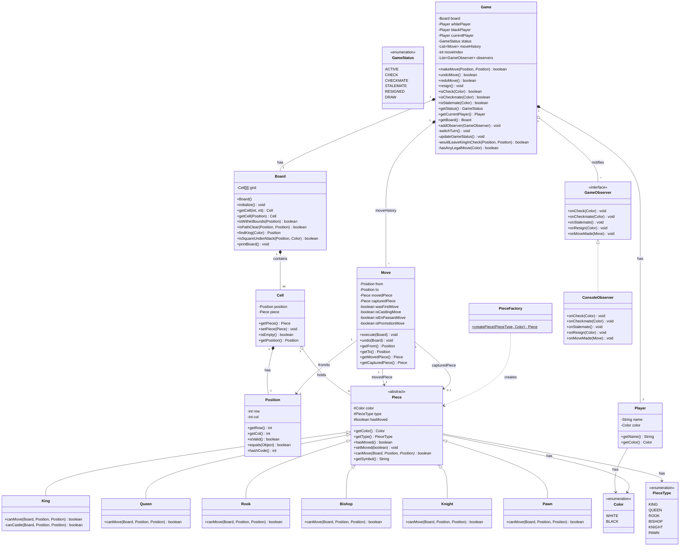

# Low-Level Design: Chess Game

> Commonly asked at: **Uber India**, Google, Amazon, Flipkart
> Difficulty: Hard | Time to solve in interview: 45-60 minutes

---

## Table of Contents

1. [Problem Statement](#1-problem-statement)
2. [Requirements](#2-requirements)
3. [Entity Identification](#3-entity-identification)
4. [Class Diagram](#4-class-diagram)
5. [Design Patterns](#5-design-patterns)
6. [Design Decisions and Rationale](#6-design-decisions-and-rationale)
7. [Piece Movement Rules](#7-piece-movement-rules)
8. [State Management](#8-state-management)
9. [Core Algorithms](#9-core-algorithms)
10. [Move Validation Flow](#10-move-validation-flow)
11. [Extension Handling](#11-extension-handling)
12. [Complexity Analysis](#12-complexity-analysis)
13. [Concurrency Considerations](#13-concurrency-considerations)
14. [Testing Strategy](#14-testing-strategy)
15. [Interview Tips](#15-interview-tips)
16. [Summary](#16-summary)

---

## 1. Problem Statement

Design an object-oriented system for a standard two-player chess game. The system must
support all standard chess rules including piece-specific movement, capturing, turn
management, check detection, checkmate detection, stalemate detection, move history,
and undo functionality.

This is a classic LLD interview problem that tests your ability to:
- Model a complex domain with many interacting entities
- Apply the right design patterns where they naturally fit
- Handle intricate rule enforcement (check, checkmate, pins, etc.)
- Design for extensibility (timers, AI players, variants)

---

## 2. Requirements

### 2.1 Functional Requirements

| # | Requirement | Priority |
|---|-------------|----------|
| FR-1 | Two human players can play a standard chess game | Must |
| FR-2 | White always moves first | Must |
| FR-3 | All six piece types move according to official chess rules | Must |
| FR-4 | A move is rejected if it is illegal for that piece type | Must |
| FR-5 | A move is rejected if it leaves the player's own king in check | Must |
| FR-6 | System detects when a king is in check | Must |
| FR-7 | System detects checkmate (game over, one player wins) | Must |
| FR-8 | System detects stalemate (game over, draw) | Must |
| FR-9 | Turn alternates between White and Black after each valid move | Must |
| FR-10 | System maintains a full move history | Must |
| FR-11 | Players can undo the last move (and redo) | Should |
| FR-12 | Pieces can capture opponent pieces | Must |
| FR-13 | Player can resign | Must |
| FR-14 | Pawn promotion when reaching the last rank | Should |
| FR-15 | Castling (king-side and queen-side) | Should |
| FR-16 | En passant capture | Should |

### 2.2 Non-Functional Requirements

| # | Requirement |
|---|-------------|
| NFR-1 | Clean OOP design following SOLID principles |
| NFR-2 | Extensible to add timers, AI opponents, or new game variants |
| NFR-3 | Move validation must be correct for every board state |
| NFR-4 | Thread-safe game state transitions for multiplayer extensions |

### 2.3 Assumptions

- Console-based game (no GUI)
- No AI opponent (both players are human)
- No time control / chess clock (extension discussed later)
- Standard 8x8 board with standard starting positions

---

## 3. Entity Identification

Working through the problem domain, we identify these core entities:

### 3.1 Core Entities

| Entity | Responsibility |
|--------|---------------|
| **Game** | Orchestrates the entire game: manages turns, validates moves, detects end conditions |
| **Board** | Holds the 8x8 grid of cells, knows how to place/remove/move pieces, queries like "is square under attack?" |
| **Cell** | A single square on the board; knows its position and which piece (if any) sits on it |
| **Piece** (abstract) | Base class for all chess pieces; declares `canMove()` contract, holds color and type |
| **King** | Extends Piece; moves one square in any direction, involved in castling and check logic |
| **Queen** | Extends Piece; moves any number of squares along rank, file, or diagonal |
| **Rook** | Extends Piece; moves any number of squares along rank or file |
| **Bishop** | Extends Piece; moves any number of squares diagonally |
| **Knight** | Extends Piece; moves in an L-shape (2+1), can jump over other pieces |
| **Pawn** | Extends Piece; moves forward one (or two from start), captures diagonally, promotes |
| **Player** | Represents a human player; has a name and a color |
| **Move** | A command object recording from/to positions, piece moved, piece captured, flags for undo |
| **Position** | Value object representing a (row, col) coordinate on the board |
| **PieceFactory** | Creates Piece instances by type and color (Factory pattern) |
| **GameObserver** | Interface for observers notified on check/checkmate/stalemate events |
| **ConsoleObserver** | Concrete observer that prints game events to console |
| **GameStatus** | Enum: ACTIVE, CHECK, CHECKMATE, STALEMATE, RESIGNED, DRAW |
| **Color** | Enum: WHITE, BLACK |
| **PieceType** | Enum: KING, QUEEN, ROOK, BISHOP, KNIGHT, PAWN |

### 3.2 Relationships at a Glance

- **Game** HAS-A Board, two Players, a list of Moves, and a GameStatus.
- **Board** HAS-A 8x8 array of Cells.
- **Cell** HAS-A Position and an optional Piece reference.
- **Player** HAS-A Color.
- **Piece** IS-A hierarchy: King, Queen, Rook, Bishop, Knight, Pawn all extend Piece.
- **Move** references two Positions (from, to), the Piece moved, and the Piece captured (nullable).

---

## 4. Class Diagram



---

## 5. Design Patterns

### 5.1 Template Method Pattern -- Piece Movement Validation

**Where:** The abstract `Piece` class and its six concrete subclasses.

**Why:** Every piece shares the same high-level validation flow:
1. Check that the destination is within bounds.
2. Check that the destination does not contain a friendly piece.
3. Check piece-specific movement rules (this step varies per piece type).
4. Check that the move does not leave own king in check.

Steps 1, 2, and 4 are identical across all piece types. Only step 3 differs. This is
the textbook Template Method: a base class defines the skeleton of an algorithm and
defers certain steps to subclasses.

```
abstract class Piece {
    // Each subclass implements its own movement logic
    public abstract boolean canMove(Board board, Position from, Position to);
}

// Subclasses only define what is unique to them:
King.canMove()    -> 1 square any direction + castling
Queen.canMove()   -> horizontal + vertical + diagonal (unlimited)
Rook.canMove()    -> horizontal + vertical (unlimited)
Bishop.canMove()  -> diagonal (unlimited)
Knight.canMove()  -> L-shape (2+1), can jump
Pawn.canMove()    -> forward 1 (or 2 from start), capture diagonal
```

**Open/Closed Principle:** Adding a new piece type (e.g., "Empress" in a variant) only
requires creating a new subclass. No existing code changes.

### 5.2 Factory Pattern -- PieceFactory

**Where:** `PieceFactory.createPiece(PieceType type, Color color)`.

**Why:** During board initialization we need to create 32 pieces of 6 different types
and 2 colors. Pawn promotion also needs to create a new piece at runtime. A factory
centralizes this creation logic:

```
PieceFactory.createPiece(QUEEN, WHITE)  -->  new Queen(WHITE)
PieceFactory.createPiece(KNIGHT, BLACK) -->  new Knight(BLACK)
```

Benefits:
- Board initialization code does not need to know concrete piece classes.
- Adding a new piece type means editing only the factory.
- Pawn promotion reuses the same factory method.
- Single point of change if piece constructors evolve.

### 5.3 Command Pattern -- Move as Command Object

**Where:** The `Move` class with `execute()` and `undo()` methods.

**Why:** We need to support:
- **Move history**: store every move made in the game.
- **Undo**: reverse the last move exactly, restoring captured pieces and flags.
- **Redo** (future extension): re-apply an undone move.
- **Notation export**: generate PGN or algebraic notation from the move list.

Each `Move` stores everything needed to both execute and reverse the action:

```
class Move {
    Position from;           // where the piece came from
    Position to;             // where the piece went
    Piece movedPiece;        // the piece that moved
    Piece capturedPiece;     // the piece that was captured (may be null)
    boolean wasFirstMove;    // was this the piece's first move? (needed for undo)
    boolean isCastlingMove;  // did this move involve castling?
    boolean isEnPassantMove; // was this an en passant capture?
    boolean isPromotionMove; // did a pawn promote?
}
```

The Game maintains a `List<Move> moveHistory` and a `moveIndex` pointer:
- **Undo**: decrement index, call `move.undo(board)`
- **Redo**: call `move.execute(board)`, increment index

**Why Command over Memento?** A Memento would snapshot the entire board (64 cells +
all piece state) per move. Command stores only the delta -- much more memory-efficient
since a chess move is a well-defined, reversible operation.

### 5.4 Observer Pattern -- Game Event Notification

**Where:** `GameObserver` interface, `Game.notifyObservers()`.

**Why:** After every move, the game must determine if the move caused check or checkmate
and communicate this to interested parties. Rather than having the Game class directly
call methods on every consumer, we use the Observer pattern:

```
interface GameObserver {
    void onCheck(Color kingColor);
    void onCheckmate(Color loserColor);
    void onStalemate();
    void onResign(Color resignedColor);
    void onMoveMade(Move move);
}
```

The Game class maintains a `List<GameObserver>` and notifies all observers after each
state change. A ConsoleObserver, a GUIObserver, a LoggingObserver, or a
NetworkBroadcastObserver can all register independently.

This decouples the core game logic from presentation and notification concerns entirely.

---

## 6. Design Decisions and Rationale

### 6.1 Board as 8x8 2D Array of Cell Objects

The board is represented as:

```
Cell[][] grid = new Cell[8][8];
```

Row 0 = rank 8 (Black's back rank). Row 7 = rank 1 (White's back rank).
Col 0 = file 'a'. Col 7 = file 'h'.

**Why Cell objects instead of Piece[][]?**
- Cells carry their own position, making them self-describing.
- Cells can be extended with metadata (e.g., "is this square highlighted?").
- Null-safety: `cell.isEmpty()` is cleaner than `grid[r][c] == null`.
- Models the real domain directly: a chess board has squares, and squares hold pieces.

### 6.2 Position as a Value Object

Position is immutable with just `row` and `col`. It implements `equals()` and
`hashCode()` so it can be used in sets and maps. This avoids passing raw `int` pairs
everywhere, reducing bugs from accidentally swapping row/col.

### 6.3 Piece Inheritance (not Composition)

This is a genuine IS-A relationship. A King IS-A Piece. A Pawn IS-A Piece. They share
common state (color, hasMoved) and a common contract (canMove), but each has a
fundamentally different implementation.

We are NOT using inheritance to share implementation code -- we are using it to
establish a type hierarchy where polymorphism is essential. The Board and Game work
with `Piece` references and call `canMove()` polymorphically. This is textbook
Liskov Substitution Principle.

**Why not Strategy for movement?** A Rook does not HAVE-A movement strategy that could
be swapped at runtime. A Rook always moves like a Rook. Strategy would add indirection
without benefit in standard chess.

### 6.4 Two-Phase Move Validation

Every move goes through two phases:

**Phase 1 -- Piece-Level Validation** (`piece.canMove(board, from, to)`)
- Is the destination reachable by this piece type?
- Is the path clear (no blocking pieces for sliding pieces)?
- Is the destination not occupied by a friendly piece?

**Phase 2 -- King Safety Validation** (`game.wouldLeaveKingInCheck(from, to)`)
- Simulate the move on the actual board (then undo)
- Check if the player's own king is under attack after the simulated move
- If yes, the move is illegal (even if the piece can physically make it)

This two-phase approach cleanly separates concerns: pieces know their movement rules,
the game knows the global constraint about king safety.

### 6.5 Board Owns the Grid, Not Game

Separation of concerns. The Board is responsible for the physical state of the grid:
placing pieces, moving them, checking bounds, path clearance. The Game is responsible
for rules and orchestration: turn management, check detection, win conditions. This
maps cleanly to Single Responsibility: Board = spatial logic, Game = game logic.

---

## 7. Piece Movement Rules

### 7.1 Movement Summary

| Piece | Movement | Path Clear? | Special Rules |
|-------|----------|-------------|---------------|
| **King** | 1 square in any direction (8 possible) | N/A (1 square) | Castling: 2 squares toward rook |
| **Queen** | Any number along rank, file, or diagonal | Yes | None |
| **Rook** | Any number along rank or file | Yes | Involved in castling |
| **Bishop** | Any number diagonally | Yes | None |
| **Knight** | L-shape: 2 in one direction + 1 perpendicular | No (jumps) | Can leap over pieces |
| **Pawn** | Forward 1 (or 2 from start row) | Yes (for forward moves) | Captures diagonally, en passant, promotion |

### 7.2 Sliding Pieces Path Clearance

Queen, Rook, and Bishop are "sliding" pieces. They move any number of squares in a
direction but cannot jump over other pieces. The `Board.isPathClear(from, to)` method
checks all intermediate squares:

```
isPathClear(from, to):
    rowDir = sign(to.row - from.row)   // -1, 0, or 1
    colDir = sign(to.col - from.col)   // -1, 0, or 1

    currentRow = from.row + rowDir
    currentCol = from.col + colDir

    while (currentRow, currentCol) != (to.row, to.col):
        if board[currentRow][currentCol] is not empty:
            return false
        currentRow += rowDir
        currentCol += colDir

    return true
```

Knight is the only piece that skips path clearance entirely -- it can jump.

### 7.3 Pawn Special Rules

Pawns are the most complex piece despite being the "simplest":
- Move forward 1 square (if destination is empty)
- Move forward 2 squares from starting row (if both squares are empty)
- Capture diagonally forward 1 square (if enemy piece is there)
- En passant: capture diagonally to an empty square if opponent pawn just double-moved
- Promotion: automatically become a Queen when reaching the last rank

Direction depends on color: White pawns move from row 6 toward row 0 (decreasing),
Black pawns move from row 1 toward row 7 (increasing).

---

## 8. State Management

### 8.1 Core State

```
Game:
    GameStatus status;          // ACTIVE, CHECK, CHECKMATE, STALEMATE, RESIGNED, DRAW
    Player currentPlayer;       // which player moves next
    List<Move> moveHistory;     // ordered list of all moves
    int moveIndex;              // pointer for undo/redo
```

### 8.2 State Machine

```
                  +--------+
         start -->| ACTIVE |<---------+
                  +--------+          |
                   |      |           |
              move |      | move      | (move resolves check)
                   v      v           |
              +-------+ +----------+  |
              | CHECK |->| (legal  |--+
              +-------+  |  move)  |
                   |      +--------+
                   | (no legal moves for checked player)
                   v
              +-----------+
              | CHECKMATE |  (terminal -- opponent wins)
              +-----------+

              +--------+
              | ACTIVE |
              +--------+
                   | (current player has no legal moves, not in check)
                   v
              +-----------+
              | STALEMATE |  (terminal -- draw)
              +-----------+

              +--------+      +-------+
              | ACTIVE | -or- | CHECK |
              +--------+      +-------+
                   | player resigns
                   v
              +----------+
              | RESIGNED |  (terminal -- opponent wins)
              +----------+
```

### 8.3 State Transition Table

| From State | Event | To State |
|------------|-------|----------|
| ACTIVE | Move puts opponent king in check, opponent has legal moves | CHECK |
| ACTIVE | Move puts opponent king in check, opponent has NO legal moves | CHECKMATE |
| ACTIVE | Move does not cause check, opponent has no legal moves | STALEMATE |
| ACTIVE | Player resigns | RESIGNED |
| CHECK | Checked player makes a legal move that resolves check | ACTIVE |
| CHECK | Checked player makes a move that keeps opponent in check | CHECK |
| CHECK | Checked player has no legal moves | CHECKMATE |
| CHECK | Player resigns | RESIGNED |

### 8.4 Turn Management

After every successful move:
1. Execute the move on the board
2. Check if the opponent's king is now in check
3. If in check, check if it is checkmate (no legal moves for opponent)
4. If not in check, check if it is stalemate (no legal moves for opponent)
5. Update status accordingly
6. Switch currentPlayer to the opponent
7. Notify all observers

The turn only switches after a fully valid, executed move. Invalid move attempts do
NOT consume a turn.

---

## 9. Core Algorithms

### 9.1 Check Detection

**Question:** Is the king of color C currently under attack?

```
isCheck(Color c):
    kingPos = board.findKing(c)
    for each cell on the board (row 0..7, col 0..7):
        piece = cell.getPiece()
        if piece != null AND piece.color != c:
            if piece.canMove(board, piece.position, kingPos):
                return true    // an enemy piece can reach the king
    return false
```

**Key insight:** We ask "can any enemy piece move to the king's square?" rather than
tracing attack lines from the king outward. This reuses the existing `canMove()` logic
for each piece type, avoiding duplicated movement code.

### 9.2 Checkmate Detection

**Question:** Is it checkmate for color C? (King in check AND no legal move exists)

```
isCheckmate(Color c):
    if !isCheck(c):
        return false    // not even in check

    return !hasAnyLegalMove(c)
```

```
hasAnyLegalMove(Color c):
    for each cell on the board:
        piece = cell.getPiece()
        if piece != null AND piece.color == c:
            for each destination cell on the board:
                if piece.canMove(board, piece.position, dest.position):
                    if !wouldLeaveKingInCheck(piece.position, dest.position):
                        return true   // found at least one legal move
    return false   // no legal moves exist
```

**Why simulate?** A move might move a piece that was blocking a different attack line
(a "pin"). We must actually simulate the move, re-evaluate check, then undo it.

### 9.3 Stalemate Detection

Identical logic to checkmate, except the precondition is that the king is NOT in check.

```
isStalemate(Color c):
    if isCheck(c):
        return false   // if in check, it would be checkmate, not stalemate
    return !hasAnyLegalMove(c)
```

### 9.4 "Would This Move Leave My King in Check?" Test

Every candidate move is filtered through this test:

```
wouldLeaveKingInCheck(Position from, Position to):
    // Save state
    capturedPiece = board.getCell(to).getPiece()
    movedPiece = board.getCell(from).getPiece()

    // Temporarily execute the move
    board.getCell(to).setPiece(movedPiece)
    board.getCell(from).setPiece(null)

    // Check if own king is now attacked
    inCheck = isCheck(movedPiece.getColor())

    // Undo the temporary move
    board.getCell(from).setPiece(movedPiece)
    board.getCell(to).setPiece(capturedPiece)

    return inCheck
```

This handles **pins** automatically. If moving a bishop would expose the king to a
rook attack along the same line, `isCheck()` will catch it after the simulated move.

---

## 10. Move Validation Flow

The complete flow when a player attempts a move:

```
Player calls game.makeMove(from, to)
    |
    v
[1] Is the game still active? (status == ACTIVE or CHECK)
    |-- No  --> return false (game is over)
    |-- Yes --> continue
    v
[2] Is there a piece at 'from'?
    |-- No  --> return false
    |-- Yes --> continue
    v
[3] Does the piece belong to the current player?
    |-- No  --> return false (cannot move opponent's pieces)
    |-- Yes --> continue
    v
[4] Can the piece physically move to 'to'?
    |-- Call piece.canMove(board, from, to)
    |-- This checks piece-specific movement rules + path clearance
    |-- No  --> return false
    |-- Yes --> continue
    v
[5] Would this move leave own king in check?
    |-- Simulate the move, call isCheck(ownColor)
    |-- Yes --> return false (illegal: cannot leave king in check)
    |-- No  --> continue
    v
[6] Execute the move
    |-- Create Move command object (record from, to, captured piece, flags)
    |-- Call move.execute(board)
    |-- Mark piece as having moved
    |-- Add to moveHistory, advance moveIndex
    |-- Handle pawn promotion if applicable
    v
[7] Post-move: update game status
    |-- Is opponent now in check? --> isCheck(opponentColor)
    |   |-- Yes: does opponent have any legal move? --> hasAnyLegalMove(opponentColor)
    |   |   |-- No  --> status = CHECKMATE (game over)
    |   |   |-- Yes --> status = CHECK
    |   |-- No: does opponent have any legal move?
    |       |-- No  --> status = STALEMATE (game over, draw)
    |       |-- Yes --> status = ACTIVE
    v
[8] Switch turn to opponent
    v
[9] Notify all observers
    |-- return true (move was successful)
```

---

## 11. Extension Handling

### 11.1 Castling

**Conditions for castling to be legal:**
1. Neither the king nor the chosen rook has previously moved (`hasMoved == false`)
2. No pieces between the king and rook (`isPathClear`)
3. The king is not currently in check
4. The king does not pass through any square that is under attack
5. The king does not land on a square that is under attack

**Implementation details:**
- King's `canMove()` detects a 2-square horizontal move as a castling attempt
- Validates all 5 conditions listed above
- `Move.execute()` moves both the king and the rook to their new positions
- `Move.undo()` restores both pieces to their original positions and resets `hasMoved`

King-side castling (White): King e1->g1, Rook h1->f1
Queen-side castling (White): King e1->c1, Rook a1->d1
King-side castling (Black): King e8->g8, Rook h8->f8
Queen-side castling (Black): King e8->c8, Rook a8->d8

### 11.2 En Passant

**Conditions:**
1. Opponent's pawn just advanced 2 squares on the immediately preceding move
2. Your pawn is on the 5th rank (row 3 for White, row 4 for Black)
3. Your pawn is horizontally adjacent to the opponent's pawn that just double-moved
4. The capture is to the square the opponent's pawn "passed through"

**Implementation:**
- `Game` exposes the last move via `moveHistory`
- `Pawn.canMove()` checks if the move is a diagonal capture to an empty square AND
  the last move was a 2-square pawn advance to the adjacent column
- `Move.execute()` removes the captured pawn (which is NOT on the destination square)
- `Move.undo()` restores the captured pawn to its position and restores the capturing
  pawn to its original position

### 11.3 Pawn Promotion

**Condition:** A pawn reaches the opposite end of the board (row 0 for White, row 7
for Black).

**Implementation:**
- After a pawn move, `Move.execute()` checks if the pawn reached the last rank
- If so, the pawn is replaced with a new Queen (default promotion)
- Can be extended to allow player choice (Queen, Rook, Bishop, Knight)
- `Move.undo()` restores the original pawn

### 11.4 Adding a Timer (Extension Discussion)

**Impact:** Minimal changes to core classes.

- Add a `Clock` class with `remainingTime`, `start()`, `pause()`, `isExpired()`
- Each Player gets a Clock instance
- Game starts the current player's clock before their turn and pauses it after
- If a clock expires, Game sets status to a new `TIMEOUT` status

No existing classes are modified except Game. Open/Closed Principle in action.

### 11.5 Adding an AI Player (Extension Discussion)

- Define a `MoveStrategy` interface: `selectMove(Board, Color): Move`
- `HumanMoveStrategy` waits for user input
- `MinimaxMoveStrategy` uses minimax with alpha-beta pruning
- Player holds a MoveStrategy reference
- Game loop calls `currentPlayer.getStrategy().selectMove()` instead of waiting for input

---

## 12. Complexity Analysis

| Operation | Time Complexity | Notes |
|-----------|----------------|-------|
| `piece.canMove()` | O(n), n = max dimension = 8 | Sliding pieces check path; Knight is O(1) |
| `isCheck(color)` | O(P), P = opponent pieces (max 16) | Check each opponent piece against king |
| `isCheckmate(color)` | O(P * 64) worst case | For each piece, try each destination square |
| `wouldLeaveKingInCheck()` | O(P) | Simulate move, then call isCheck |
| `makeMove()` | O(P * 64) | Includes checkmate/stalemate detection |
| `undoMove()` | O(1) | Just reverse the stored move command |
| `isPathClear()` | O(7) worst case | At most 7 squares between two corners |

With at most 32 pieces and 64 squares, all operations complete in microseconds.
Memory usage: O(1) per move (Command pattern), O(M) total for M moves.

---

## 13. Concurrency Considerations

For the standard two-player local game, concurrency is not a concern since players
alternate turns and the game is single-threaded.

For extensions:
- **Timer:** The Clock runs on a separate thread. Use `AtomicLong` for `remainingMillis`
  or synchronize access.
- **Network play:** Incoming moves arrive on a network thread. Synchronize `makeMove()`
  and `undoMove()`.
- **AI computation:** Run on a separate thread with a `Future<Move>` to deliver the
  result without blocking the UI.

The core Game class can be made thread-safe by synchronizing `makeMove()` and
`undoMove()`, or by using a single-threaded event loop (command queue) pattern.

---

## 14. Testing Strategy

| Test Category | Examples |
|---------------|----------|
| **Unit: Piece movement** | King moves 1 square, Queen slides diagonally, Knight L-shape, Pawn forward |
| **Unit: Illegal moves** | Rook moving diagonally, Bishop moving horizontally, moving through pieces |
| **Unit: Capture** | Capturing opponent piece, cannot capture own piece |
| **Unit: Check detection** | Place pieces to create check, verify isCheck returns true |
| **Unit: Checkmate** | Scholar's mate, back-rank mate, smothered mate |
| **Unit: Stalemate** | King-only vs King+Queen stalemate position |
| **Unit: Castling** | Valid castling, blocked castling, castling through check, castling after king moved |
| **Unit: En passant** | Valid en passant, expired en passant (not immediately after double move) |
| **Unit: Pawn promotion** | Pawn reaches last rank and becomes Queen |
| **Unit: Pinned piece** | Piece pinned to king cannot move away from pin line |
| **Unit: Undo/Redo** | Make move, undo, verify board state exactly restored |
| **Integration: Full game** | Play a complete sequence of moves leading to checkmate |
| **Edge case** | Move when game is over returns false; resign sets correct status |

---

## 15. Interview Tips

### What interviewers look for at Uber India:

1. **Clean class hierarchy**: Piece abstraction with proper inheritance and polymorphism
2. **SOLID principles**: Single responsibility per class, open for extension
3. **Design patterns**: Command (undo), Factory (creation), Template Method (movement), Observer (events)
4. **Edge cases**: Check, checkmate, stalemate, pins, castling, en passant
5. **Two-phase move validation**: piece rules + king safety
6. **Algorithm clarity**: Check detection, checkmate detection explained step by step

### Common mistakes to avoid:

- Putting all movement logic in the Board class (violates SRP)
- Forgetting to check if a move leaves your own king in check
- Not distinguishing check vs checkmate vs stalemate
- Hardcoding piece creation instead of using a factory
- Not supporting undo (Command pattern is expected)
- Making Position mutable (should be immutable value object)

### Suggested 45-minute breakdown:

| Time | Activity |
|------|----------|
| 0-5 min | Clarify requirements, state assumptions |
| 5-15 min | Identify entities, draw class diagram |
| 15-30 min | Code core classes: Piece hierarchy, Board, Game |
| 30-40 min | Code check/checkmate/stalemate logic |
| 40-45 min | Discuss extensions: castling, en passant, undo, timer, AI |

---

## 16. Summary

### Design Pattern Recap

| Pattern | Where Applied | Benefit |
|---------|--------------|---------|
| **Template Method** | Piece.canMove() -- each subclass implements its own rules | Eliminates duplicated validation across 6 piece types |
| **Factory** | PieceFactory.createPiece() | Centralizes piece creation, decouples board setup from concrete classes |
| **Command** | Move with execute/undo | Enables move history, undo/redo with minimal memory overhead |
| **Observer** | GameObserver for check/checkmate/move events | Decouples game logic from UI, logging, and network concerns |
| **Strategy (ext)** | MoveStrategy for AI players | Swappable AI algorithms without changing game flow |

### Key Classes Summary

```
Game
 |-- Board (8x8 grid)
 |    |-- Cell[8][8]
 |         |-- Position (row, col)
 |         |-- Piece (abstract)
 |              |-- King, Queen, Rook, Bishop, Knight, Pawn
 |
 |-- Player (white, black)
 |-- Move (Command pattern: execute/undo)
 |-- GameStatus (enum: ACTIVE, CHECK, CHECKMATE, ...)
 |-- GameObserver (interface for event notification)
 |-- PieceFactory (creates pieces by type)
```

### The One-Sentence Summary

A chess LLD is fundamentally about a **Piece type hierarchy** (Template Method) where
each piece implements `canMove()`, a **Board** that manages spatial state, a **Game**
that enforces rules and detects check/checkmate via simulation, and **Move commands**
that enable undo/redo -- all wired together with the Observer pattern for event
notification.
