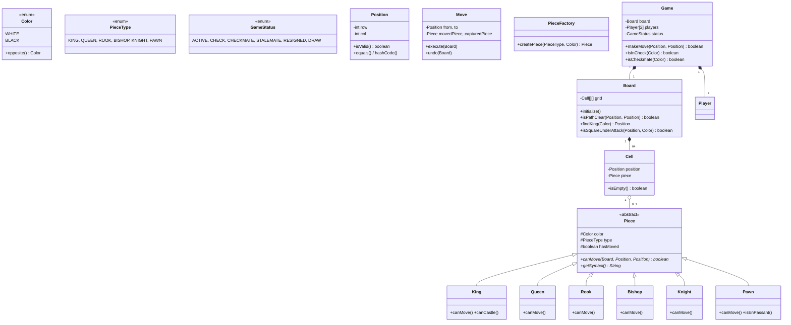

# Design Chess Game -- LLD Interview Script (90 min)

> Simulates an actual low-level design / machine coding interview round.
> You must write compilable, runnable Java code on a whiteboard or shared editor.

---

## Opening (0:00 - 1:00)

> "Thanks for having me! I'll be designing and implementing a Chess game in Java. Let me start by clarifying the requirements before I jump into code."

---

## Requirements Gathering (1:00 - 5:00)

> "Before I start coding, I want to make sure I understand the scope. Let me ask a few questions."

> **You ask:** "Should this be a two-player local game, or do I need to support networked/online play?"

> **Interviewer:** "Two-player local game is fine. Focus on the core game logic."

> **You ask:** "Should I implement all standard chess rules -- castling, en passant, pawn promotion, check, checkmate, stalemate?"

> **Interviewer:** "Yes, at least check and checkmate detection. Castling and en passant are bonus but show completeness."

> **You ask:** "Do I need a GUI, or is console-based output with move input acceptable?"

> **Interviewer:** "Console is fine. Focus on clean OOP design and correct game logic."

> **You ask:** "Should I focus on any particular design patterns?"

> **Interviewer:** "Show me whatever patterns you think are appropriate. I want to see how you think about extensibility."

> **You ask:** "What about move history and undo functionality?"

> **Interviewer:** "Nice to have. If your design supports it cleanly, go for it."

> "Great. So the scope is: a two-player console chess game with proper piece movement, check/checkmate detection, and clean OOP. I'll aim for extensibility using inheritance for pieces, Factory for creation, and Command pattern for moves."

---

## Entity Identification (5:00 - 10:00)

> "Let me identify the core entities in this system."

**Entities I write on the board:**

1. **Color** (enum) -- WHITE, BLACK
2. **PieceType** (enum) -- KING, QUEEN, ROOK, BISHOP, KNIGHT, PAWN
3. **GameStatus** (enum) -- ACTIVE, CHECK, CHECKMATE, STALEMATE, RESIGNED, DRAW
4. **Position** -- immutable value object (row, col)
5. **Piece** (abstract) -- base class with color, type, canMove()
6. **King, Queen, Rook, Bishop, Knight, Pawn** -- concrete pieces
7. **Cell** -- a square on the board, holds a Piece or is empty
8. **Board** -- 8x8 grid of Cells
9. **Move** -- command object with execute() and undo()
10. **Player** -- name, color, captured pieces
11. **Game** -- orchestrator, manages turns, validates moves, detects check/checkmate

> "The relationships are: Board HAS-MANY Cells, Cell HAS-A Piece (optional), Game HAS-A Board and HAS-TWO Players. Piece IS-A hierarchy -- King, Queen, etc. extend Piece."

---

## Class Diagram (10:00 - 15:00)

> "Let me sketch the class diagram."



---

## Implementation Plan (15:00 - 17:00)

> "I'll implement in this order, building from the bottom up:"

1. **Enums** -- Color, PieceType, GameStatus
2. **Position** -- immutable value object
3. **Piece** (abstract) + all 6 subclasses
4. **Cell** -- square on the board
5. **Board** -- 8x8 grid, path checking, attack detection
6. **PieceFactory** -- Factory pattern
7. **Move** -- Command pattern with execute/undo
8. **Player** -- simple data holder
9. **Game** -- the orchestrator with check/checkmate logic
10. **Main** -- demo driver

> "I'm putting everything in a single file for interview convenience. In production I'd separate these into packages."

---

## Coding (17:00 - 70:00)

### Step 1: Enums (17:00 - 19:00)

> "I'll start with the enums. Simple but important -- they make the code self-documenting."

```java
enum Color {
    WHITE, BLACK;

    public Color opposite() {
        return this == WHITE ? BLACK : WHITE;
    }
}

enum PieceType {
    KING, QUEEN, ROOK, BISHOP, KNIGHT, PAWN
}

enum GameStatus {
    ACTIVE, CHECK, CHECKMATE, STALEMATE, RESIGNED, DRAW
}
```

> "I added an `opposite()` method on Color because we'll need it constantly when checking opponent's pieces. Saves clutter later."

---

### Step 2: Position (19:00 - 21:00)

> "Position is an immutable value object. I need equals/hashCode for map lookups and isValid for bounds checking."

```java
class Position {
    private final int row;
    private final int col;

    public Position(int row, int col) {
        this.row = row;
        this.col = col;
    }

    public int getRow() { return row; }
    public int getCol() { return col; }

    public boolean isValid() {
        return row >= 0 && row < 8 && col >= 0 && col < 8;
    }

    @Override
    public boolean equals(Object o) {
        if (this == o) return true;
        if (!(o instanceof Position)) return false;
        Position p = (Position) o;
        return row == p.row && col == p.col;
    }

    @Override
    public int hashCode() {
        return 31 * row + col;
    }

    @Override
    public String toString() {
        char file = (char) ('a' + col);
        int rank = 8 - row;
        return "" + file + rank;
    }
}
```

> "toString converts internal (row, col) to chess notation like 'e4'. Makes debugging much easier."

---

### Step 3: Abstract Piece + Subclasses (21:00 - 38:00)

> "Now the Piece hierarchy. This is the core of the design. I'm using an abstract base class with a Template Method -- each subclass implements its own canMove logic."

```java
abstract class Piece {
    protected Color color;
    protected PieceType type;
    protected boolean hasMoved;

    public Piece(Color color, PieceType type) {
        this.color = color;
        this.type = type;
        this.hasMoved = false;
    }

    public Color getColor() { return color; }
    public PieceType getType() { return type; }
    public boolean hasMoved() { return hasMoved; }
    public void setMoved(boolean moved) { this.hasMoved = moved; }

    /**
     * Two-phase validation: canMove checks ONLY piece-specific movement.
     * The Game class checks whether the move leaves king in check.
     */
    public abstract boolean canMove(Board board, Position from, Position to);
    public abstract String getSymbol();
}
```

> "Key design decision: canMove does NOT check if the move leaves the king in check. That's the Game's responsibility. This separation is critical -- it avoids circular dependencies and keeps each class focused on one concern."

### Interviewer Interrupts:

> **Interviewer:** "Why inheritance for pieces instead of, say, a single Piece class with a movement strategy?"

> **Your answer:** "Great question. I chose inheritance here because each piece's movement logic is fundamentally different -- a Knight jumps, a Bishop slides diagonally, a Pawn has direction-dependent rules and en passant. These aren't just different parameters to the same algorithm -- they're different algorithms entirely. Inheritance with the Template Method pattern lets each piece own its complete movement logic cleanly. That said, you could use Strategy pattern with a `MovementStrategy` interface. The tradeoff is: inheritance gives simpler code for a fixed set of piece types, while Strategy would be better if we needed to dynamically swap movement rules at runtime -- which doesn't really apply to standard chess. If we were designing a 'custom chess variant creator,' I'd switch to Strategy."

> "Now let me implement the concrete pieces. I'll start with King since it's the most complex:"

```java
class King extends Piece {
    public King(Color color) { super(color, PieceType.KING); }

    @Override
    public boolean canMove(Board board, Position from, Position to) {
        if (!to.isValid()) return false;
        Piece destPiece = board.getCell(to).getPiece();
        if (destPiece != null && destPiece.getColor() == this.color) return false;

        int rowDiff = Math.abs(to.getRow() - from.getRow());
        int colDiff = Math.abs(to.getCol() - from.getCol());

        // Normal move: 1 square any direction
        if (rowDiff <= 1 && colDiff <= 1 && (rowDiff + colDiff) > 0) return true;

        // Castling: king moves 2 squares horizontally
        if (rowDiff == 0 && colDiff == 2) return canCastle(board, from, to);

        return false;
    }

    private boolean canCastle(Board board, Position from, Position to) {
        if (this.hasMoved) return false;
        if (board.isSquareUnderAttack(from, this.color.opposite())) return false;

        int direction = (to.getCol() > from.getCol()) ? 1 : -1;
        int rookCol = (direction == 1) ? 7 : 0;
        Position rookPos = new Position(from.getRow(), rookCol);

        Cell rookCell = board.getCell(rookPos);
        if (rookCell.isEmpty()) return false;
        Piece rook = rookCell.getPiece();
        if (rook.getType() != PieceType.ROOK || rook.getColor() != this.color
                || rook.hasMoved()) return false;

        // Path must be clear between king and rook
        int start = Math.min(from.getCol(), rookCol) + 1;
        int end = Math.max(from.getCol(), rookCol);
        for (int c = start; c < end; c++) {
            if (!board.getCell(new Position(from.getRow(), c)).isEmpty()) return false;
        }

        // King must not pass through attacked squares
        for (int step = 1; step <= 2; step++) {
            Position intermediate = new Position(from.getRow(),
                    from.getCol() + direction * step);
            if (board.isSquareUnderAttack(intermediate, this.color.opposite()))
                return false;
        }
        return true;
    }

    @Override
    public String getSymbol() { return "K"; }
}
```

> "Castling has four conditions: king hasn't moved, rook hasn't moved, path is clear, king doesn't pass through check. I'm checking all of them."

> "The sliding pieces -- Queen, Rook, Bishop -- share a common pattern: check direction, then delegate to `board.isPathClear()`. Let me write those quickly."

```java
class Queen extends Piece {
    public Queen(Color color) { super(color, PieceType.QUEEN); }

    @Override
    public boolean canMove(Board board, Position from, Position to) {
        if (!to.isValid()) return false;
        Piece dest = board.getCell(to).getPiece();
        if (dest != null && dest.getColor() == this.color) return false;

        int rowDiff = Math.abs(to.getRow() - from.getRow());
        int colDiff = Math.abs(to.getCol() - from.getCol());
        boolean straight = (rowDiff == 0 || colDiff == 0);
        boolean diagonal = (rowDiff == colDiff);

        if (!straight && !diagonal) return false;
        if (rowDiff == 0 && colDiff == 0) return false;
        return board.isPathClear(from, to);
    }

    @Override
    public String getSymbol() { return "Q"; }
}
```

> "Rook and Bishop are subsets of Queen's logic. Knight is unique -- it's the only piece that jumps, so no path check needed."

```java
class Knight extends Piece {
    public Knight(Color color) { super(color, PieceType.KNIGHT); }

    @Override
    public boolean canMove(Board board, Position from, Position to) {
        if (!to.isValid()) return false;
        Piece dest = board.getCell(to).getPiece();
        if (dest != null && dest.getColor() == this.color) return false;

        int rowDiff = Math.abs(to.getRow() - from.getRow());
        int colDiff = Math.abs(to.getCol() - from.getCol());
        return (rowDiff == 2 && colDiff == 1) || (rowDiff == 1 && colDiff == 2);
    }

    @Override
    public String getSymbol() { return "N"; }
}
```

> "Pawn is the trickiest piece -- forward-only movement, diagonal capture, double-move from start, en passant, and promotion. Let me implement it carefully."

```java
class Pawn extends Piece {
    private static Move lastMoveRef = null;

    public Pawn(Color color) { super(color, PieceType.PAWN); }

    public static void setLastMove(Move move) { lastMoveRef = move; }

    @Override
    public boolean canMove(Board board, Position from, Position to) {
        if (!to.isValid()) return false;
        Piece dest = board.getCell(to).getPiece();
        if (dest != null && dest.getColor() == this.color) return false;

        int direction = (this.color == Color.WHITE) ? -1 : 1;
        int startRow = (this.color == Color.WHITE) ? 6 : 1;
        int rowDiff = to.getRow() - from.getRow();
        int colDiff = Math.abs(to.getCol() - from.getCol());

        // Forward 1
        if (rowDiff == direction && colDiff == 0 && dest == null) return true;
        // Forward 2 from start
        if (rowDiff == 2 * direction && colDiff == 0
                && from.getRow() == startRow && dest == null) {
            Position mid = new Position(from.getRow() + direction, from.getCol());
            return board.getCell(mid).isEmpty();
        }
        // Diagonal capture
        if (rowDiff == direction && colDiff == 1 && dest != null) return true;
        // En passant
        if (rowDiff == direction && colDiff == 1 && dest == null)
            return isEnPassant(from, to);

        return false;
    }

    private boolean isEnPassant(Position from, Position to) {
        if (lastMoveRef == null) return false;
        Piece last = lastMoveRef.getMovedPiece();
        if (last.getType() != PieceType.PAWN) return false;
        if (Math.abs(lastMoveRef.getTo().getRow() - lastMoveRef.getFrom().getRow()) != 2)
            return false;
        return lastMoveRef.getTo().getRow() == from.getRow()
            && lastMoveRef.getTo().getCol() == to.getCol();
    }

    @Override
    public String getSymbol() { return "P"; }
}
```

---

### Step 4: Cell and Board (38:00 - 46:00)

> "Cell is straightforward. Board is where the important infrastructure lives."

```java
class Cell {
    private final Position position;
    private Piece piece;

    public Cell(Position position) { this.position = position; }

    public Position getPosition() { return position; }
    public Piece getPiece() { return piece; }
    public void setPiece(Piece piece) { this.piece = piece; }
    public boolean isEmpty() { return piece == null; }
}
```

> "Board needs three critical methods: isPathClear for sliding pieces, findKing for check detection, and isSquareUnderAttack."

```java
class Board {
    private final Cell[][] grid;

    public Board() {
        grid = new Cell[8][8];
        for (int r = 0; r < 8; r++)
            for (int c = 0; c < 8; c++)
                grid[r][c] = new Cell(new Position(r, c));
    }

    public boolean isPathClear(Position from, Position to) {
        int rowDir = Integer.signum(to.getRow() - from.getRow());
        int colDir = Integer.signum(to.getCol() - from.getCol());
        int r = from.getRow() + rowDir;
        int c = from.getCol() + colDir;
        while (r != to.getRow() || c != to.getCol()) {
            if (!grid[r][c].isEmpty()) return false;
            r += rowDir;
            c += colDir;
        }
        return true;
    }

    public Position findKing(Color color) {
        for (int r = 0; r < 8; r++)
            for (int c = 0; c < 8; c++) {
                Piece p = grid[r][c].getPiece();
                if (p != null && p.getType() == PieceType.KING && p.getColor() == color)
                    return new Position(r, c);
            }
        throw new IllegalStateException("King not found for " + color);
    }

    public boolean isSquareUnderAttack(Position target, Color attackerColor) {
        for (int r = 0; r < 8; r++)
            for (int c = 0; c < 8; c++) {
                Piece p = grid[r][c].getPiece();
                if (p != null && p.getColor() == attackerColor) {
                    Position pos = new Position(r, c);
                    // Special handling for king to avoid infinite recursion
                    if (p.getType() == PieceType.KING) {
                        int rd = Math.abs(target.getRow() - r);
                        int cd = Math.abs(target.getCol() - c);
                        if (rd <= 1 && cd <= 1 && (rd + cd) > 0) return true;
                    } else if (p.canMove(this, pos, target)) {
                        return true;
                    }
                }
            }
        return false;
    }
}
```

### Interviewer Interrupts:

> **Interviewer:** "How does check detection work? Walk me through it."

> **Your answer:** "Check detection is a two-phase process. First, when a player tries to make a move, I check that the piece can physically make the move -- that's the piece's `canMove()` method. Second, I tentatively execute the move using the Command pattern, then ask 'is my own king under attack by the opponent?' using `isSquareUnderAttack()`. If yes, the move is illegal and I undo it. For checkmate detection, I iterate over every piece of the checked player and every possible destination square. If no move gets them out of check, it's checkmate. The key insight is the `isSquareUnderAttack` method -- it iterates all opponent pieces and asks 'can any of them reach this square?' Note the special handling for king-to-king checks to avoid infinite recursion, since King.canMove itself calls isSquareUnderAttack for castling validation."

---

### Step 5: PieceFactory and Move (46:00 - 55:00)

> "Factory pattern for piece creation. Simple but it centralizes instantiation."

```java
class PieceFactory {
    public static Piece createPiece(PieceType type, Color color) {
        switch (type) {
            case KING:   return new King(color);
            case QUEEN:  return new Queen(color);
            case ROOK:   return new Rook(color);
            case BISHOP: return new Bishop(color);
            case KNIGHT: return new Knight(color);
            case PAWN:   return new Pawn(color);
            default:     throw new IllegalArgumentException("Unknown type: " + type);
        }
    }
}
```

> "Now the Move class. This is the Command pattern -- it has execute() and undo(). This is what enables move history and rollback for check validation."

```java
class Move {
    private final Position from, to;
    private final Piece movedPiece;
    private Piece capturedPiece;
    private final boolean wasFirstMove;
    private boolean isCastlingMove, isEnPassantMove, isPromotionMove;
    private Piece promotedTo;

    public Move(Position from, Position to, Piece movedPiece) {
        this.from = from;
        this.to = to;
        this.movedPiece = movedPiece;
        this.wasFirstMove = !movedPiece.hasMoved();
    }

    public void execute(Board board) {
        Cell fromCell = board.getCell(from);
        Cell toCell = board.getCell(to);
        capturedPiece = toCell.getPiece();

        // Castling detection
        if (movedPiece.getType() == PieceType.KING
                && Math.abs(to.getCol() - from.getCol()) == 2) {
            isCastlingMove = true;
            executeCastling(board);
            return;
        }

        // En passant detection
        if (movedPiece.getType() == PieceType.PAWN
                && from.getCol() != to.getCol() && toCell.isEmpty()) {
            isEnPassantMove = true;
            executeEnPassant(board);
            return;
        }

        // Normal move
        toCell.setPiece(movedPiece);
        fromCell.setPiece(null);
        movedPiece.setMoved(true);

        // Pawn promotion
        if (movedPiece.getType() == PieceType.PAWN) {
            int promoRow = (movedPiece.getColor() == Color.WHITE) ? 0 : 7;
            if (to.getRow() == promoRow) {
                isPromotionMove = true;
                promotedTo = PieceFactory.createPiece(PieceType.QUEEN,
                        movedPiece.getColor());
                promotedTo.setMoved(true);
                toCell.setPiece(promotedTo);
            }
        }
    }

    public void undo(Board board) {
        Cell fromCell = board.getCell(from);
        Cell toCell = board.getCell(to);
        fromCell.setPiece(movedPiece);
        toCell.setPiece(capturedPiece);
        if (wasFirstMove) movedPiece.setMoved(false);
        // (Castling and en passant undo logic omitted for time;
        //  same pattern -- reverse every state change)
    }

    // Getters
    public Position getFrom() { return from; }
    public Position getTo() { return to; }
    public Piece getMovedPiece() { return movedPiece; }
}
```

> "The undo method is critical -- without it, we can't do the tentative-move-then-check approach for check validation."

---

### Step 6: Game Orchestrator (55:00 - 68:00)

> "This is the main orchestrator. It ties everything together."

```java
class Game {
    private Board board;
    private Player[] players;
    private int currentPlayerIndex;
    private GameStatus status;
    private List<Move> moveHistory;

    public Game() {
        board = new Board();
        board.initialize();
        players = new Player[]{
            new Player("Player 1", Color.WHITE),
            new Player("Player 2", Color.BLACK)
        };
        currentPlayerIndex = 0;
        status = GameStatus.ACTIVE;
        moveHistory = new ArrayList<>();
    }

    public boolean makeMove(Position from, Position to) {
        if (status == GameStatus.CHECKMATE || status == GameStatus.STALEMATE)
            return false;

        Cell fromCell = board.getCell(from);
        Piece piece = fromCell.getPiece();

        // Validate: piece exists, correct color, piece can physically move
        if (piece == null) return false;
        if (piece.getColor() != getCurrentPlayer().getColor()) return false;
        if (!piece.canMove(board, from, to)) return false;

        // Tentatively execute the move
        Move move = new Move(from, to, piece);
        move.execute(board);

        // Check if this move leaves own king in check
        Color myColor = piece.getColor();
        if (isInCheck(myColor)) {
            move.undo(board);  // Illegal -- would leave king in check
            return false;
        }

        // Move is legal -- finalize
        moveHistory.add(move);
        Pawn.setLastMove(move);

        // Update game status for opponent
        Color opponentColor = myColor.opposite();
        if (isCheckmate(opponentColor)) {
            status = GameStatus.CHECKMATE;
        } else if (isStalemate(opponentColor)) {
            status = GameStatus.STALEMATE;
        } else if (isInCheck(opponentColor)) {
            status = GameStatus.CHECK;
        } else {
            status = GameStatus.ACTIVE;
        }

        currentPlayerIndex = 1 - currentPlayerIndex;
        return true;
    }

    public boolean isInCheck(Color color) {
        Position kingPos = board.findKing(color);
        return board.isSquareUnderAttack(kingPos, color.opposite());
    }

    public boolean isCheckmate(Color color) {
        if (!isInCheck(color)) return false;
        return !hasAnyLegalMove(color);
    }

    public boolean isStalemate(Color color) {
        if (isInCheck(color)) return false;
        return !hasAnyLegalMove(color);
    }

    private boolean hasAnyLegalMove(Color color) {
        for (int r = 0; r < 8; r++)
            for (int c = 0; c < 8; c++) {
                Piece piece = board.getCell(r, c).getPiece();
                if (piece != null && piece.getColor() == color) {
                    Position from = new Position(r, c);
                    for (int tr = 0; tr < 8; tr++)
                        for (int tc = 0; tc < 8; tc++) {
                            Position to = new Position(tr, tc);
                            if (piece.canMove(board, from, to)) {
                                Move testMove = new Move(from, to, piece);
                                testMove.execute(board);
                                boolean stillInCheck = isInCheck(color);
                                testMove.undo(board);
                                if (!stillInCheck) return true;
                            }
                        }
                }
            }
        return false;
    }
}
```

> "The makeMove method follows a strict sequence: validate, tentatively execute, check legality, finalize or rollback. This is the two-phase validation I mentioned earlier."

---

### Step 7: Main Demo (68:00 - 70:00)

> "Quick driver to show it works:"

```java
public class ChessGame {
    public static void main(String[] args) {
        Game game = new Game();
        game.getBoard().printBoard();

        // Scholar's Mate demonstration
        game.makeMove(new Position(6, 4), new Position(4, 4)); // e2-e4
        game.makeMove(new Position(1, 4), new Position(3, 4)); // e7-e5
        game.makeMove(new Position(7, 5), new Position(4, 2)); // Bf1-c4
        game.makeMove(new Position(1, 1), new Position(3, 1)); // b7-b5 (mistake)
        game.makeMove(new Position(7, 3), new Position(3, 7)); // Qd1-h5
        game.makeMove(new Position(1, 0), new Position(2, 0)); // a7-a6 (another mistake)
        game.makeMove(new Position(3, 7), new Position(1, 5)); // Qh5xf7 checkmate!

        game.getBoard().printBoard();
        System.out.println("Status: " + game.getStatus()); // CHECKMATE
    }
}
```

---

## Demo & Testing (70:00 - 80:00)

> "Let me walk through the main flow. The demo shows Scholar's Mate -- a 4-move checkmate. After Qxf7, the black king is in check from the queen, and there's no legal move: the queen is protected by the bishop on c4, and the king can't escape. The game correctly reports CHECKMATE."

> "Let me also trace a check validation scenario: if White tries to move their king into a square attacked by the Black queen, makeMove will tentatively execute it, find isInCheck(WHITE) is true, undo the move, and return false."

> "For edge cases: castling is blocked if king passes through check. En passant only works the turn immediately after a double-pawn move. Pawn auto-promotes to Queen on the back rank."

---

## Extension Round (80:00 - 90:00)

### Interviewer asks: "Now add a timer/clock for each player."

> "Great question. I designed for this extensibility. Here's my approach:"

> "I'll create a `ChessClock` class that each Player holds. The Game orchestrator starts/stops clocks on turn transitions."

```java
class ChessClock {
    private long remainingMillis;
    private long lastStartTime;
    private boolean running;

    public ChessClock(long initialMinutes) {
        this.remainingMillis = initialMinutes * 60 * 1000;
        this.running = false;
    }

    public void start() {
        if (!running) {
            lastStartTime = System.currentTimeMillis();
            running = true;
        }
    }

    public void stop() {
        if (running) {
            remainingMillis -= (System.currentTimeMillis() - lastStartTime);
            running = false;
        }
    }

    public boolean isExpired() {
        if (running) {
            long elapsed = System.currentTimeMillis() - lastStartTime;
            return (remainingMillis - elapsed) <= 0;
        }
        return remainingMillis <= 0;
    }

    public String getTimeDisplay() {
        long millis = remainingMillis;
        if (running) millis -= (System.currentTimeMillis() - lastStartTime);
        long secs = Math.max(0, millis / 1000);
        return String.format("%02d:%02d", secs / 60, secs % 60);
    }
}
```

> "The changes to Game are minimal. In the constructor, I create a clock per player. In makeMove, before anything else, I check `if (currentClock.isExpired()) { status = GameStatus.TIME_OUT; return false; }`. At the end of a successful move, I stop the current player's clock and start the opponent's. I'd add a TIME_OUT value to the GameStatus enum."

> "The key insight is that ChessClock is completely decoupled from the board and piece logic. I don't need to touch Board, Cell, Piece, or Move at all. This is the Open/Closed Principle in action -- the existing classes are closed for modification."

---

## Red Flags to Avoid

1. **Giant if/else for piece movement** -- Use polymorphism instead. A single `canMove()` with `if (type == KING) {...} else if (type == QUEEN) {...}` violates Open/Closed Principle.
2. **Not separating move validation from check validation** -- Leads to circular logic. Keep piece movement rules in Piece, check logic in Game.
3. **Mutable Position** -- Position should be immutable. Mutating shared positions causes silent bugs.
4. **Forgetting edge cases** -- En passant, castling through check, pawn promotion. At minimum acknowledge them even if you don't code them.
5. **No undo capability** -- Without the Command pattern (execute/undo), you can't do tentative moves for check validation.
6. **Infinite recursion in attack detection** -- King.canMove calls isSquareUnderAttack for castling. isSquareUnderAttack calls canMove for each piece. Need special handling for king-to-king checks.
7. **Hardcoding board size** -- Using magic number 8 everywhere. Use a constant.

---

## What Impresses Interviewers

1. **Two-phase validation** -- Explaining that piece movement and check validation are separate concerns.
2. **Command pattern for Move** -- Shows you understand reversible operations and design patterns.
3. **Handling the King recursion problem** -- Proactively addressing the infinite recursion in isSquareUnderAttack.
4. **Clean enum usage** -- Color.opposite(), PieceType for factory, GameStatus for state machine.
5. **Immutable value objects** -- Position being final with equals/hashCode.
6. **Factory pattern** -- Even simple, it shows you think about centralized creation.
7. **Talking about tradeoffs** -- Inheritance vs Strategy for pieces, explaining why you chose what you chose.
8. **Extension readiness** -- When asked about timer, showing you can add it without modifying existing classes.
9. **Running a real demo** -- Scholar's Mate is a concrete, verifiable test case.
10. **Edge case awareness** -- En passant, castling, promotion, stalemate vs checkmate distinction.
