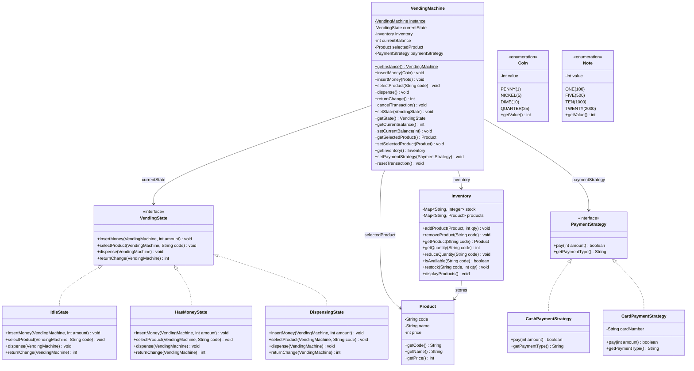
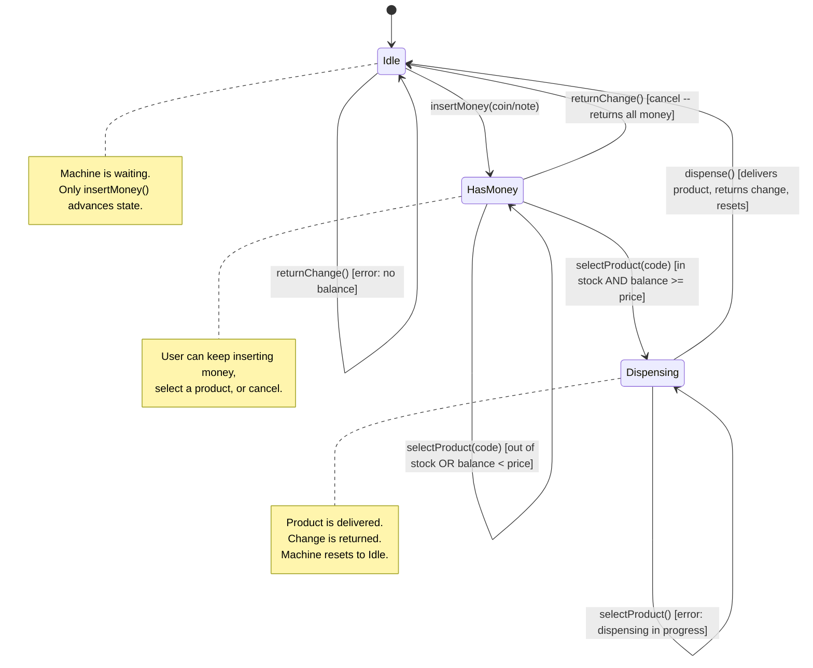

# Low-Level Design: Vending Machine

## 1. Problem Statement

Design a fully functional vending machine that supports:
- Displaying available products with prices
- Accepting money (coins and notes) from users
- Allowing users to select a product
- Dispensing the selected product if sufficient funds are inserted
- Returning correct change to the user
- Handling edge cases: out-of-stock products, insufficient funds, cancellation

The design must cleanly manage the machine's lifecycle through well-defined states
using the **State** design pattern, support multiple payment strategies via the
**Strategy** pattern, and ensure a single machine instance through the **Singleton**
pattern.

---

## 2. Requirements

### 2.1 Functional Requirements

| # | Requirement | Details |
|---|-------------|---------|
| FR-1 | Insert money | Accept coins (PENNY, NICKEL, DIME, QUARTER) and notes (ONE, FIVE, TEN, TWENTY) |
| FR-2 | Select product | User picks a product by code (e.g., "A1", "B2") |
| FR-3 | Dispense product | Machine delivers the product when funds are sufficient |
| FR-4 | Return change | Machine calculates and returns the correct change |
| FR-5 | Cancel transaction | User can cancel at any point and get their money back |
| FR-6 | Out-of-stock handling | Reject selection if the chosen product has zero quantity |
| FR-7 | Insufficient funds | Prompt user to insert more money or cancel |
| FR-8 | Inventory management | Admin can restock products and check inventory levels |

### 2.2 Non-Functional Requirements

| # | Requirement | Details |
|---|-------------|---------|
| NFR-1 | Thread safety | Machine must handle one transaction at a time safely |
| NFR-2 | Extensibility | Easy to add new payment types, product categories, or states |
| NFR-3 | Maintainability | State logic isolated per state -- no giant switch/if-else blocks |
| NFR-4 | Testability | Each state class is independently testable |

---

## 3. Core Entities

### 3.1 Entity Overview

| Entity | Responsibility |
|--------|---------------|
| `VendingMachine` | Singleton facade -- holds state, inventory, and current balance |
| `VendingState` | Interface defining all actions the machine supports in any state |
| `IdleState` | Waiting for money -- only `insertMoney()` is valid |
| `HasMoneyState` | Money inserted -- user can add more, select product, or cancel |
| `DispensingState` | Product selected + funds sufficient -- dispense and return change |
| `Product` | Immutable value object: name, price, code |
| `Inventory` | HashMap-backed store mapping product codes to quantities |
| `Coin` | Enum of coin denominations with cent values |
| `Note` | Enum of note denominations with cent values |
| `PaymentStrategy` | Strategy interface for payment processing |
| `CashPaymentStrategy` | Concrete strategy for coin/note payments |
| `CardPaymentStrategy` | Concrete strategy for card-based payments |

---

## 4. Class Diagram



---

## 5. State Diagram



---

## 6. Design Patterns Applied

### 6.1 State Pattern (Primary)

**Problem:** A vending machine behaves differently depending on whether it is idle,
has money inserted, or is dispensing a product. Encoding this with if-else chains
makes the code brittle and hard to extend.

**Solution:** Define a `VendingState` interface with methods for every action
(`insertMoney`, `selectProduct`, `dispense`, `returnChange`). Each concrete state
class implements these methods with state-specific logic. The `VendingMachine`
delegates all action calls to its `currentState` object.

**State Behavior Matrix:**

| Action | IdleState | HasMoneyState | DispensingState |
|--------|-----------|---------------|-----------------|
| `insertMoney()` | Accept money, transition to HasMoney | Accept money, stay in HasMoney | Reject -- dispensing in progress |
| `selectProduct()` | Reject -- no money inserted | Validate stock + funds; if OK transition to Dispensing; else stay | Reject -- dispensing in progress |
| `dispense()` | Reject -- no transaction | Reject -- select a product first | Deliver product, return change, transition to Idle |
| `returnChange()` | Reject -- no balance | Return full balance, transition to Idle | Automatically handled during dispense |

**Why this is better than switch/case:**
- Adding a new state (e.g., `MaintenanceState`) requires only a new class -- zero changes to existing code.
- Each state class is small, focused, and independently testable.
- Impossible to forget handling an action in a state because the interface enforces it.

### 6.2 Strategy Pattern (Payment)

**Problem:** The machine should support multiple payment methods (cash, card, mobile
pay in the future) without modifying the core machine logic.

**Solution:** Define a `PaymentStrategy` interface with a `pay(amount)` method.
Concrete strategies (`CashPaymentStrategy`, `CardPaymentStrategy`) encapsulate
the payment logic. The `VendingMachine` holds a reference to the current strategy
and delegates payment processing to it.

**Benefits:**
- Swap payment methods at runtime: `machine.setPaymentStrategy(new CardPaymentStrategy("4111..."))`
- Add new payment types without touching existing code
- Each strategy is testable in isolation

### 6.3 Singleton Pattern (VendingMachine)

**Problem:** There should be exactly one vending machine instance managing the
shared inventory and state. Multiple instances would create inconsistent state.

**Solution:** `VendingMachine` has a private constructor and a static
`getInstance()` method that returns the single instance, creating it lazily on
first access. Thread safety is ensured via the double-checked locking idiom.

---

## 7. Detailed State Transitions and Edge Cases

### 7.1 Happy Path: Successful Purchase

```
1. Machine is in IdleState
2. User inserts QUARTER + QUARTER + QUARTER + QUARTER + QUARTER  (125 cents)
3. State transitions to HasMoneyState, balance = 125
4. User selects product "A1" (Coca-Cola, price = 100 cents)
5. Product is in stock, balance (125) >= price (100)
6. State transitions to DispensingState, selectedProduct = Coca-Cola
7. Machine dispenses Coca-Cola
8. Machine returns change: 125 - 100 = 25 cents
9. Inventory for "A1" decremented by 1
10. State transitions back to IdleState, balance = 0
```

### 7.2 Edge Case: Insufficient Funds

```
1. Machine is in HasMoneyState, balance = 50
2. User selects product "A1" (price = 100)
3. HasMoneyState.selectProduct() detects 50 < 100
4. Prints: "Insufficient funds. Please insert 50 more cents."
5. State remains HasMoneyState -- user can insert more or cancel
```

### 7.3 Edge Case: Out of Stock

```
1. Machine is in HasMoneyState, balance = 200
2. User selects product "B2" (quantity = 0)
3. HasMoneyState.selectProduct() checks inventory.isAvailable("B2") -> false
4. Prints: "Product B2 is out of stock. Please select another product."
5. State remains HasMoneyState
```

### 7.4 Edge Case: Cancel Transaction

```
1. Machine is in HasMoneyState, balance = 175
2. User calls returnChange()
3. HasMoneyState.returnChange() returns 175 cents
4. Balance reset to 0
5. State transitions to IdleState
```

### 7.5 Edge Case: Invalid Actions in Wrong State

```
- Calling selectProduct() in IdleState -> "Please insert money first."
- Calling dispense() in IdleState -> "No transaction in progress."
- Calling insertMoney() in DispensingState -> "Please wait, dispensing in progress."
- Calling selectProduct() in DispensingState -> "Please wait, dispensing in progress."
```

### 7.6 Edge Case: Invalid Product Code

```
1. Machine is in HasMoneyState, balance = 200
2. User selects product "Z9" which does not exist
3. HasMoneyState.selectProduct() -> inventory.getProduct("Z9") returns null
4. Prints: "Invalid product code: Z9"
5. State remains HasMoneyState
```

### 7.7 Edge Case: Last Item Purchase

```
1. Product "A1" has quantity = 1
2. User completes purchase of "A1"
3. Inventory decremented to 0
4. Next user who selects "A1" gets out-of-stock error
5. Admin can call inventory.restock("A1", 10) to replenish
```

---

## 8. Money Representation

All monetary values are stored as **integers in cents** to avoid floating-point
precision issues. This is a standard practice in financial software.

| Coin | Value (cents) |
|------|--------------|
| PENNY | 1 |
| NICKEL | 5 |
| DIME | 10 |
| QUARTER | 25 |

| Note | Value (cents) |
|------|--------------|
| ONE | 100 |
| FIVE | 500 |
| TEN | 1000 |
| TWENTY | 2000 |

---

## 9. Inventory Management

The `Inventory` class uses two `HashMap` structures:

- `Map<String, Product>` -- maps product code to `Product` object
- `Map<String, Integer>` -- maps product code to available quantity

Operations:
- **addProduct(Product, qty):** Registers a product and sets its initial stock.
- **reduceQuantity(code):** Decrements stock by 1 after a successful dispense.
- **restock(code, qty):** Admin operation to add more units.
- **isAvailable(code):** Returns `true` if the product exists and quantity > 0.
- **displayProducts():** Prints a formatted table of all products, prices, and stock.

---

## 10. Thread Safety Considerations

1. **Singleton:** Double-checked locking with `volatile` ensures safe lazy initialization.
2. **Transaction isolation:** The machine processes one transaction at a time. In a
   real-world extension, a `ReentrantLock` or `synchronized` blocks around state
   transitions would prevent race conditions.
3. **Inventory updates:** `reduceQuantity()` should be atomic in a concurrent environment.
   For this design, single-threaded operation is assumed, but the design is ready
   for synchronization wrappers.

---

## 11. Extensibility Guide

| Extension | How to Add |
|-----------|-----------|
| New coin/note denomination | Add entry to `Coin` or `Note` enum |
| New payment method (e.g., mobile) | Implement `PaymentStrategy` interface |
| Maintenance mode | Create `MaintenanceState` implementing `VendingState` |
| Product categories | Add a `category` field to `Product` |
| Discount/promotion | Introduce a `PricingStrategy` or decorator on `Product.getPrice()` |
| Logging/audit trail | Add observer/listener on state transitions |
| Multiple machines | Remove Singleton; use a `VendingMachineFactory` |

---

## 12. Sequence Diagram: Happy Path Purchase

```
User              VendingMachine         IdleState         HasMoneyState      DispensingState      Inventory
 |                      |                    |                   |                   |                  |
 |-- insertMoney(Q) --> |                    |                   |                   |                  |
 |                      |-- insertMoney() -->|                   |                   |                  |
 |                      |   balance += 25    |                   |                   |                  |
 |                      |   setState(HasMoney)|                  |                   |                  |
 |                      |<-------------------|                   |                   |                  |
 |                      |                    |                   |                   |                  |
 |-- insertMoney(Q) --> |                    |                   |                   |                  |
 |                      |-- insertMoney() ---|------------------>|                   |                  |
 |                      |   balance += 25    |                   |                   |                  |
 |                      |<-------------------|-------------------|                   |                  |
 |                      |                    |                   |                   |                  |
 |-- selectProduct(A1)->|                    |                   |                   |                  |
 |                      |-- selectProduct()--|------------------>|                   |                  |
 |                      |                    |                   |-- isAvailable() --|----------------->|
 |                      |                    |                   |<-- true ----------|------------------|
 |                      |                    |                   | balance >= price   |                  |
 |                      |                    |                   | setState(Dispensing)|                 |
 |                      |<-------------------|-------------------|                   |                  |
 |                      |                    |                   |                   |                  |
 |-- dispense() ------->|                    |                   |                   |                  |
 |                      |-- dispense() ------|-------------------|------------------>|                  |
 |                      |                    |                   |                   |-- reduceQty() -->|
 |                      |                    |                   |                   |<-- done ---------|
 |                      |                    |                   |                   | return change    |
 |                      |                    |                   |                   | setState(Idle)   |
 |<-- product + change -|                    |                   |                   |                  |
```

---

## 13. Summary

This design decomposes the vending machine problem into cleanly separated concerns:

- **State pattern** eliminates conditional complexity by encapsulating behavior in
  state objects. Each state knows exactly which actions are valid and what transitions
  to make.
- **Strategy pattern** decouples payment processing from the machine, enabling runtime
  switching and future payment methods without modifying the machine.
- **Singleton pattern** ensures a single, consistent point of access to the machine
  and its shared inventory.

The result is a system that is easy to reason about, test, and extend -- the hallmarks
of a well-crafted low-level design.
