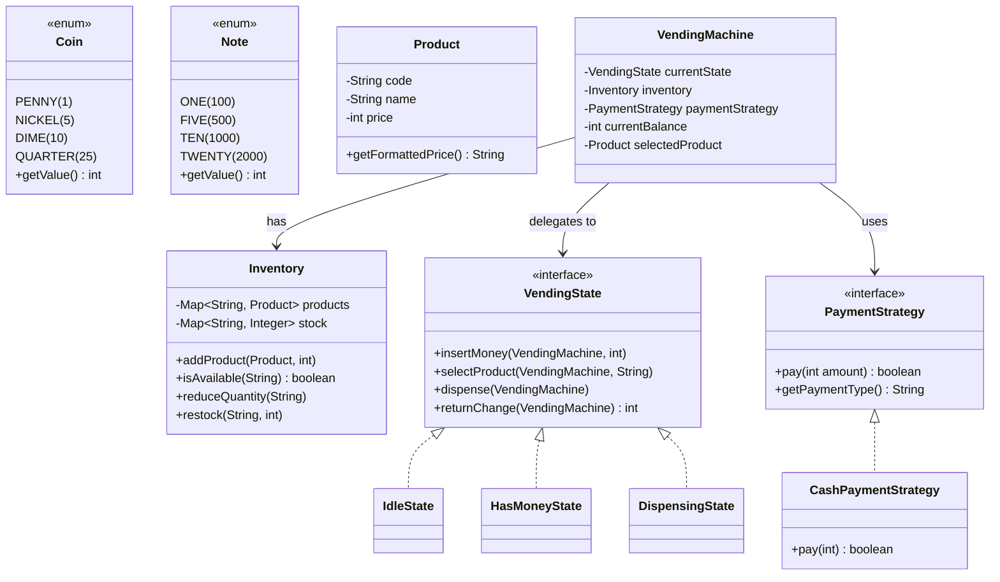

# Design Vending Machine -- LLD Interview Script (90 min)

> Simulates an actual low-level design / machine coding interview round.
> You must write compilable, runnable Java code on a whiteboard or shared editor.

---

## Opening (0:00 - 1:00)

> "Thanks for the problem! I'll be designing and implementing a Vending Machine in Java. This is a classic State pattern problem. Let me start by nailing down the requirements."

---

## Requirements Gathering (1:00 - 5:00)

> **You ask:** "Should the machine support only cash (coins/notes), or also card payments?"

> **Interviewer:** "Start with cash. We might add card later."

> **You ask:** "How should the machine handle the product catalog -- fixed set of products or dynamically configurable?"

> **Interviewer:** "Admin should be able to add products and restock. Show me a clean inventory system."

> **You ask:** "What about concurrent users? Can two people use the machine at once?"

> **Interviewer:** "Good question. For now, one user at a time. But design it so concurrency could be added."

> **You ask:** "Should I handle change calculation? What if the machine can't make change?"

> **Interviewer:** "Yes, calculate change. You can assume the machine always has enough change for simplicity."

> **You ask:** "Should I focus on any specific design patterns?"

> **Interviewer:** "I want to see at least one structural pattern applied well. Don't just code procedurally."

> "Perfect. So the scope is: a single-user vending machine with cash payments, product inventory, state-based transaction flow, and change calculation. I'll use the State pattern for the transaction lifecycle and Strategy pattern for payment extensibility."

---

## Entity Identification (5:00 - 10:00)

> "Let me identify the core entities."

**Entities I write on the board:**

1. **Coin** (enum) -- PENNY(1), NICKEL(5), DIME(10), QUARTER(25)
2. **Note** (enum) -- ONE(100), FIVE(500), TEN(1000), TWENTY(2000)
3. **Product** -- code, name, price (in cents to avoid floating-point)
4. **Inventory** -- manages product catalog and stock quantities
5. **PaymentStrategy** (interface) -- Strategy pattern for payment types
6. **CashPaymentStrategy** -- concrete strategy for cash
7. **VendingState** (interface) -- State pattern
8. **IdleState, HasMoneyState, DispensingState** -- concrete states
9. **VendingMachine** -- the context class, delegates to current state

> "The relationships: VendingMachine HAS-A VendingState (current), HAS-A Inventory, HAS-A PaymentStrategy. State transitions: Idle -> HasMoney -> Dispensing -> Idle."

> "Why store prices in cents? To avoid floating-point precision issues. $1.75 becomes 175 cents. This is an important real-world concern."

---

## Class Diagram (10:00 - 15:00)

> "Let me sketch the class diagram."



---

## Implementation Plan (15:00 - 17:00)

> "I'll implement bottom-up in this order:"

1. **Enums** -- Coin, Note (denominations with cent values)
2. **Product** -- immutable value object
3. **Inventory** -- product catalog + stock management
4. **PaymentStrategy** interface + CashPaymentStrategy
5. **VendingState** interface
6. **IdleState, HasMoneyState, DispensingState** -- concrete states
7. **VendingMachine** -- the context that ties it all together
8. **Main demo** -- end-to-end transaction flow

---

## Coding (17:00 - 70:00)

### Step 1: Enums (17:00 - 19:00)

> "Starting with denominations. Values are in cents."

```java
public enum Coin {
    PENNY(1), NICKEL(5), DIME(10), QUARTER(25);

    private final int value;
    Coin(int value) { this.value = value; }
    public int getValue() { return value; }
}

public enum Note {
    ONE(100), FIVE(500), TEN(1000), TWENTY(2000);

    private final int value;
    Note(int value) { this.value = value; }
    public int getValue() { return value; }
}
```

> "By storing values in cents, $1.75 is just 175. No floating-point errors, no BigDecimal complexity."

---

### Step 2: Product (19:00 - 22:00)

> "Product is an immutable value object. Price in cents."

```java
public class Product {
    private final String code;
    private final String name;
    private final int price; // in cents

    public Product(String code, String name, int price) {
        if (code == null || code.isEmpty())
            throw new IllegalArgumentException("Product code cannot be null/empty");
        if (price <= 0)
            throw new IllegalArgumentException("Price must be positive");
        this.code = code;
        this.name = name;
        this.price = price;
    }

    public String getCode() { return code; }
    public String getName() { return name; }
    public int getPrice() { return price; }

    public String getFormattedPrice() {
        return String.format("$%.2f", price / 100.0);
    }

    @Override
    public String toString() {
        return String.format("[%s] %s - %s", code, name, getFormattedPrice());
    }
}
```

> "Note the validation in the constructor. Defensive programming prevents silent bugs."

---

### Step 3: Inventory (22:00 - 28:00)

> "Inventory uses two maps: one for product metadata, one for stock counts. This way I can look up a product's details and check its quantity independently."

```java
public class Inventory {
    private final Map<String, Product> products;
    private final Map<String, Integer> stock;

    public Inventory() {
        this.products = new HashMap<>();
        this.stock = new HashMap<>();
    }

    public void addProduct(Product product, int quantity) {
        if (product == null) throw new IllegalArgumentException("Product cannot be null");
        if (quantity < 0) throw new IllegalArgumentException("Quantity cannot be negative");
        products.put(product.getCode(), product);
        stock.put(product.getCode(),
                  stock.getOrDefault(product.getCode(), 0) + quantity);
    }

    public Product getProduct(String code) {
        return products.get(code);
    }

    public int getQuantity(String code) {
        return stock.getOrDefault(code, 0);
    }

    public boolean isAvailable(String code) {
        return products.containsKey(code) && stock.getOrDefault(code, 0) > 0;
    }

    public void reduceQuantity(String code) {
        if (!isAvailable(code))
            throw new IllegalStateException("Product " + code + " not available");
        stock.put(code, stock.get(code) - 1);
    }

    public void restock(String code, int quantity) {
        if (!products.containsKey(code))
            throw new IllegalArgumentException("Product " + code + " does not exist");
        stock.put(code, stock.getOrDefault(code, 0) + quantity);
    }

    public void displayProducts() {
        System.out.println("============================================");
        System.out.println("         VENDING MACHINE PRODUCTS           ");
        System.out.println("============================================");
        for (Map.Entry<String, Product> entry : products.entrySet()) {
            Product p = entry.getValue();
            int qty = stock.getOrDefault(p.getCode(), 0);
            String stockDisplay = qty > 0 ? String.valueOf(qty) : "SOLD OUT";
            System.out.printf("%-6s %-20s %-8s %-6s%n",
                    p.getCode(), p.getName(), p.getFormattedPrice(), stockDisplay);
        }
    }
}
```

---

### Step 4: PaymentStrategy (28:00 - 32:00)

> "Now the Strategy pattern for payments. This is the hook for future extensibility."

```java
public interface PaymentStrategy {
    boolean pay(int amount);
    String getPaymentType();
}

public class CashPaymentStrategy implements PaymentStrategy {
    @Override
    public boolean pay(int amount) {
        // Cash is validated by the state machine's balance check.
        // If we reach here, balance is already confirmed sufficient.
        System.out.println("Processing cash payment of "
                + String.format("$%.2f", amount / 100.0));
        return true;
    }

    @Override
    public String getPaymentType() { return "CASH"; }
}
```

> "For cash, the 'payment' is really just an acknowledgment -- the physical money was already collected by the state machine. The real value of this interface comes when we add card payments later."

---

### Step 5: VendingState Interface (32:00 - 35:00)

> "The State interface declares every possible user action. Each state either handles it or rejects it."

```java
public interface VendingState {
    void insertMoney(VendingMachine machine, int amount);
    void selectProduct(VendingMachine machine, String code);
    void dispense(VendingMachine machine);
    int returnChange(VendingMachine machine);
}
```

> "Every action gets the VendingMachine as context, so the state can read/modify the machine's data and trigger state transitions."

### Interviewer Interrupts:

> **Interviewer:** "Why State pattern here instead of if/else? Isn't this over-engineering?"

> **Your answer:** "Consider the alternative: a single VendingMachine class with a status field and if/else in every method. Something like `if (status == IDLE) {...} else if (status == HAS_MONEY) {...}`. The problems:
> 1. **Every method has the same switch/if-else block** -- insertMoney, selectProduct, dispense, returnChange all need it. That's 4 methods times 3 states = 12 branches in one class.
> 2. **Adding a new state means touching every method** -- violates Open/Closed Principle.
> 3. **State-specific logic is scattered** -- everything about HasMoneyState behavior is spread across 4 different methods instead of being in one place.
>
> With the State pattern, all behavior for a given state lives in one class. Adding a new state like `MaintenanceState` means adding one new class with 4 methods -- zero changes to existing code. The pattern pays for itself as soon as you have 3+ states and 3+ actions."

---

### Step 6: Concrete States (35:00 - 52:00)

> "Let me implement each state. I'll start with IdleState."

```java
public class IdleState implements VendingState {
    @Override
    public void insertMoney(VendingMachine machine, int amount) {
        if (amount <= 0) {
            System.out.println("Invalid amount.");
            return;
        }
        machine.setCurrentBalance(machine.getCurrentBalance() + amount);
        System.out.println("Inserted " + formatCents(amount)
                + ". Balance: " + formatCents(machine.getCurrentBalance()));
        machine.setState(new HasMoneyState()); // Transition: Idle -> HasMoney
    }

    @Override
    public void selectProduct(VendingMachine machine, String code) {
        System.out.println("Please insert money first.");
    }

    @Override
    public void dispense(VendingMachine machine) {
        System.out.println("No transaction in progress.");
    }

    @Override
    public int returnChange(VendingMachine machine) {
        System.out.println("No money inserted.");
        return 0;
    }

    private String formatCents(int c) {
        return String.format("$%.2f", c / 100.0);
    }
}
```

> "Each invalid action gives a clear error message. This is much better than silent failures."

> "Now HasMoneyState -- the most complex state. Three valid actions: insert more, select product, or cancel."

```java
public class HasMoneyState implements VendingState {
    @Override
    public void insertMoney(VendingMachine machine, int amount) {
        if (amount <= 0) {
            System.out.println("Invalid amount.");
            return;
        }
        machine.setCurrentBalance(machine.getCurrentBalance() + amount);
        System.out.println("Inserted " + formatCents(amount)
                + ". Balance: " + formatCents(machine.getCurrentBalance()));
        // Stay in HasMoneyState
    }

    @Override
    public void selectProduct(VendingMachine machine, String code) {
        Inventory inventory = machine.getInventory();
        Product product = inventory.getProduct(code);

        if (product == null) {
            System.out.println("Invalid product code: " + code);
            return;
        }
        if (!inventory.isAvailable(code)) {
            System.out.println(product.getName() + " is out of stock.");
            return;
        }
        if (machine.getCurrentBalance() < product.getPrice()) {
            int shortfall = product.getPrice() - machine.getCurrentBalance();
            System.out.println("Insufficient funds. Need "
                    + formatCents(shortfall) + " more.");
            return;
        }

        machine.setSelectedProduct(product);
        System.out.println("Selected: " + product.getName());
        machine.setState(new DispensingState()); // Transition: HasMoney -> Dispensing
    }

    @Override
    public void dispense(VendingMachine machine) {
        System.out.println("Please select a product first.");
    }

    @Override
    public int returnChange(VendingMachine machine) {
        int balance = machine.getCurrentBalance();
        System.out.println("Cancelled. Returning " + formatCents(balance));
        machine.resetTransaction();
        machine.setState(new IdleState()); // Transition: HasMoney -> Idle
        return balance;
    }

    private String formatCents(int c) {
        return String.format("$%.2f", c / 100.0);
    }
}
```

> "Note the three validations in selectProduct: exists, in stock, sufficient funds. Each gives a specific error message."

> "DispensingState is the final step -- process payment, reduce inventory, return change."

```java
public class DispensingState implements VendingState {
    @Override
    public void insertMoney(VendingMachine machine, int amount) {
        System.out.println("Dispensing in progress. Cannot accept money.");
    }

    @Override
    public void selectProduct(VendingMachine machine, String code) {
        System.out.println("Dispensing in progress. Cannot change selection.");
    }

    @Override
    public void dispense(VendingMachine machine) {
        Product product = machine.getSelectedProduct();
        if (product == null) {
            System.out.println("Error: no product selected.");
            machine.resetTransaction();
            machine.setState(new IdleState());
            return;
        }

        // 1. Process payment
        PaymentStrategy strategy = machine.getPaymentStrategy();
        if (strategy != null) {
            strategy.pay(product.getPrice());
        }

        // 2. Reduce inventory
        machine.getInventory().reduceQuantity(product.getCode());

        // 3. Calculate and return change
        int change = machine.getCurrentBalance() - product.getPrice();
        if (change > 0) {
            System.out.println("Returning change: "
                    + String.format("$%.2f", change / 100.0));
        }

        System.out.println("Dispensing: " + product.getName());
        System.out.println("Thank you for your purchase!");

        // 4. Reset and return to idle
        machine.resetTransaction();
        machine.setState(new IdleState()); // Transition: Dispensing -> Idle
    }

    @Override
    public int returnChange(VendingMachine machine) {
        System.out.println("Cannot cancel during dispensing.");
        return 0;
    }
}
```

---

### Step 7: VendingMachine Context (52:00 - 60:00)

> "The VendingMachine is the context class. It holds all state and delegates every user action to the current VendingState."

```java
public class VendingMachine {
    private VendingState currentState;
    private final Inventory inventory;
    private PaymentStrategy paymentStrategy;
    private int currentBalance;
    private Product selectedProduct;

    public VendingMachine() {
        this.inventory = new Inventory();
        this.currentState = new IdleState();
        this.paymentStrategy = new CashPaymentStrategy();
        this.currentBalance = 0;
        this.selectedProduct = null;
    }

    // ----- Delegate all actions to current state -----
    public void insertMoney(int amount) {
        currentState.insertMoney(this, amount);
    }

    public void selectProduct(String code) {
        currentState.selectProduct(this, code);
    }

    public void dispense() {
        currentState.dispense(this);
    }

    public int returnChange() {
        return currentState.returnChange(this);
    }

    // ----- Convenience methods for coin/note insertion -----
    public void insertCoin(Coin coin) {
        insertMoney(coin.getValue());
    }

    public void insertNote(Note note) {
        insertMoney(note.getValue());
    }

    // ----- Getters/setters used by states -----
    public VendingState getState() { return currentState; }
    public void setState(VendingState state) { this.currentState = state; }
    public Inventory getInventory() { return inventory; }
    public PaymentStrategy getPaymentStrategy() { return paymentStrategy; }
    public void setPaymentStrategy(PaymentStrategy s) { this.paymentStrategy = s; }
    public int getCurrentBalance() { return currentBalance; }
    public void setCurrentBalance(int b) { this.currentBalance = b; }
    public Product getSelectedProduct() { return selectedProduct; }
    public void setSelectedProduct(Product p) { this.selectedProduct = p; }

    public void resetTransaction() {
        currentBalance = 0;
        selectedProduct = null;
    }
}
```

> "The VendingMachine itself has zero business logic. It purely delegates to the current state. This is the essence of the State pattern -- the context is thin, the states are smart."

---

### Step 8: Main Demo (60:00 - 64:00)

> "Let me write a demo that shows the complete flow."

```java
public class VendingMachineDemo {
    public static void main(String[] args) {
        VendingMachine machine = new VendingMachine();

        // Admin: stock the machine
        machine.getInventory().addProduct(new Product("A1", "Coke", 150), 5);
        machine.getInventory().addProduct(new Product("A2", "Pepsi", 150), 3);
        machine.getInventory().addProduct(new Product("B1", "Chips", 100), 10);
        machine.getInventory().addProduct(new Product("C1", "Candy", 75), 8);

        machine.getInventory().displayProducts();

        // === Transaction 1: Successful purchase ===
        System.out.println("\n--- Transaction 1: Buy Coke ---");
        machine.insertNote(Note.ONE);         // Insert $1.00
        machine.insertCoin(Coin.QUARTER);     // Insert $0.25
        machine.insertCoin(Coin.QUARTER);     // Insert $0.25
        machine.selectProduct("A1");          // Select Coke ($1.50)
        machine.dispense();                   // Dispense (exact change)

        // === Transaction 2: Insufficient funds ===
        System.out.println("\n--- Transaction 2: Insufficient funds ---");
        machine.insertCoin(Coin.QUARTER);     // Insert $0.25
        machine.selectProduct("A1");          // Coke costs $1.50 -- rejected
        machine.returnChange();               // Cancel, get $0.25 back

        // === Transaction 3: Out of stock ===
        System.out.println("\n--- Transaction 3: Change returned ---");
        machine.insertNote(Note.FIVE);        // Insert $5.00
        machine.selectProduct("C1");          // Select Candy ($0.75)
        machine.dispense();                   // Dispense, $4.25 change
    }
}
```

> "Transaction 1 shows exact change. Transaction 2 shows insufficient funds with cancel. Transaction 3 shows change calculation."

---

### Interviewer Interrupts:

> **Interviewer:** "How do you handle concurrent users?"

> **Your answer:** "Right now the design is single-threaded. To add concurrency, I'd make two changes:

> 1. **Synchronized state transitions** -- The VendingMachine's delegate methods (insertMoney, selectProduct, etc.) would use `synchronized` blocks or a ReentrantLock. This ensures that only one thread can interact with the machine at a time -- which maps to reality, since a physical vending machine serves one customer at a time.

> 2. **Thread-safe Inventory** -- The Inventory's reduceQuantity and restock methods need synchronization. A ConcurrentHashMap for stock plus AtomicInteger for quantities would handle concurrent reads efficiently. For the stock-check-then-reduce race condition, I'd use compareAndSet or synchronize the check-and-decrement as an atomic operation.

> The State pattern actually makes concurrency easier to reason about because all state-specific logic is in one place. I know exactly which operations can conflict."

---

## Demo & Testing (70:00 - 80:00)

> "Let me trace the Transaction 1 output:"

```
--- Transaction 1: Buy Coke ---
Inserted $1.00. Balance: $1.00
Inserted $0.25. Balance: $1.25
Inserted $0.25. Balance: $1.50
Selected: Coke
Processing cash payment of $1.50
Dispensing: Coke
Thank you for your purchase!
```

> "The state transitions are: Idle -> (insertNote) -> HasMoney -> (insertCoin x2, stays) -> HasMoney -> (selectProduct) -> Dispensing -> (dispense) -> Idle."

> "For Transaction 2:"

```
--- Transaction 2: Insufficient funds ---
Inserted $0.25. Balance: $0.25
Insufficient funds. Need $1.25 more.
Cancelled. Returning $0.25
```

> "selectProduct fails validation, stays in HasMoneyState. returnChange transitions back to Idle."

---

## Extension Round (80:00 - 90:00)

### Interviewer asks: "Now add card payment support."

> "This is exactly why I used the Strategy pattern. I can add card support without modifying any existing state or machine logic."

```java
public class CardPaymentStrategy implements PaymentStrategy {
    private final String cardNumber;

    public CardPaymentStrategy(String cardNumber) {
        if (cardNumber == null || cardNumber.length() < 4)
            throw new IllegalArgumentException("Invalid card number");
        this.cardNumber = cardNumber;
    }

    @Override
    public boolean pay(int amount) {
        String masked = "****-****-****-"
                + cardNumber.substring(cardNumber.length() - 4);
        System.out.println("Authorizing card " + masked
                + " for " + String.format("$%.2f", amount / 100.0));
        // In production: call payment gateway API
        System.out.println("Card payment approved.");
        return true;
    }

    @Override
    public String getPaymentType() { return "CARD"; }
}
```

> "Usage is simply:"

```java
machine.setPaymentStrategy(new CardPaymentStrategy("4111111111111111"));
machine.selectProduct("A1");
machine.dispense(); // Uses card instead of cash
```

> "The changes: one new class, zero modifications to existing code. The DispensingState.dispense() method already calls `strategy.pay(amount)` -- it doesn't care whether it's cash or card. This is the Open/Closed Principle in action."

> "For a more complete card flow, I might add a new state -- `AwaitingCardState` -- where the machine waits for card tap/insert instead of coin insertion. The state would validate the card, set the PaymentStrategy, then transition to HasMoneyState with balance equal to the product price. But the core pattern remains the same."

---

## Red Flags to Avoid

1. **Using floating-point for money** -- Always use integers (cents) or BigDecimal. `0.1 + 0.2 != 0.3` in floating-point.
2. **Giant if/else state machine** -- `if (state == IDLE) {...} else if (state == HAS_MONEY) {...}` in every method. Use the State pattern.
3. **No input validation** -- Negative amounts, null product codes, out-of-stock products. Validate everything.
4. **Tight coupling between payment and dispensing** -- Hardcoding cash logic in the dispense method makes adding card payments a rewrite.
5. **Forgetting to reset state** -- After dispensing or cancelling, the machine must return to Idle with balance=0, selectedProduct=null.
6. **No "cancel" flow** -- Users must be able to get their money back at any point before dispensing.
7. **Mutable Product** -- Product should be immutable. Price changes mid-transaction would be a bug.

---

## What Impresses Interviewers

1. **State pattern with clear transitions** -- Drawing the state machine diagram (Idle -> HasMoney -> Dispensing -> Idle) before coding.
2. **Strategy pattern for payments** -- Showing foresight for extensibility even before being asked.
3. **Cents-based pricing** -- Demonstrates awareness of real-world money handling.
4. **Defensive validation** -- Constructor validation, null checks, stock checks, balance checks.
5. **Clean separation of concerns** -- States handle behavior, VendingMachine holds data, Inventory manages stock, PaymentStrategy handles payment.
6. **Explaining why State > if/else** -- Articulating the maintenance and extension costs of each approach.
7. **Working demo with multiple scenarios** -- Success, insufficient funds, out of stock, change calculation.
8. **Extension without modification** -- Adding CardPaymentStrategy touches zero existing files.
9. **Concurrency awareness** -- Even if not implemented, showing you've thought about where race conditions live.
10. **Convenience methods** -- `insertCoin(Coin.QUARTER)` wrapping `insertMoney(25)` shows attention to API usability.
