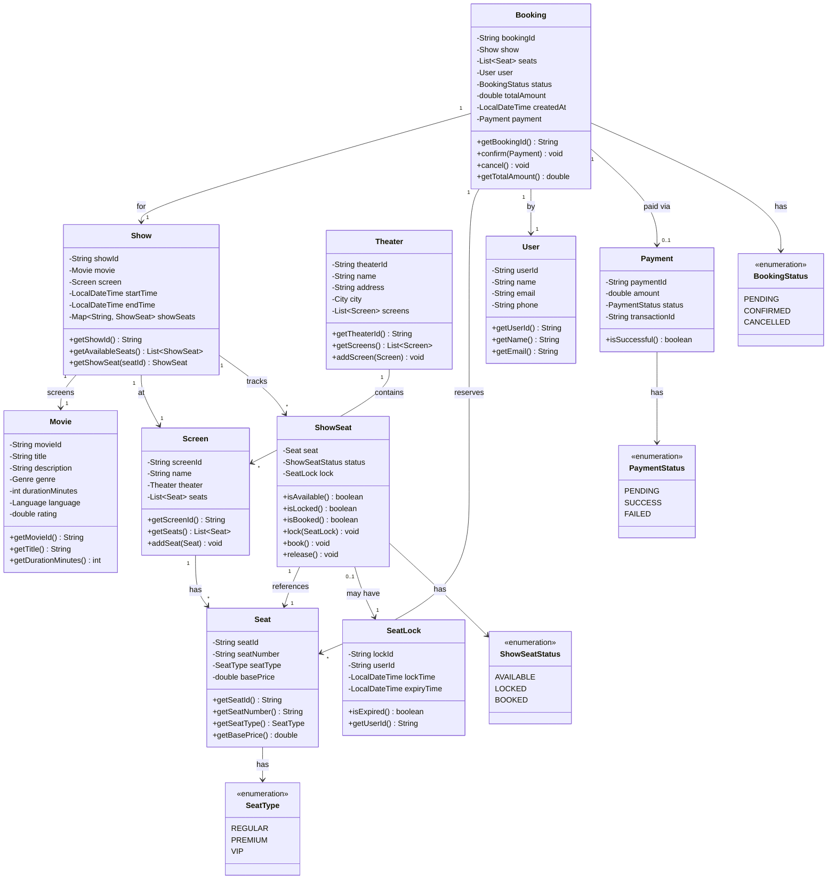
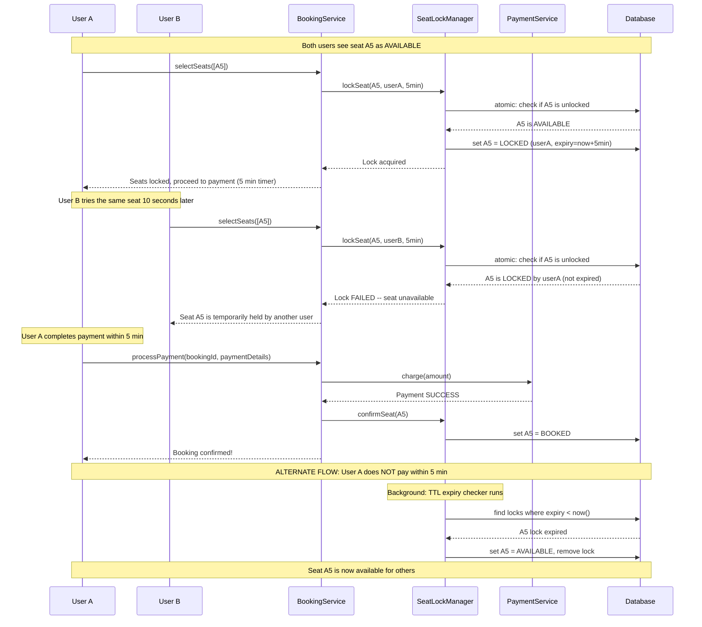

# Low-Level Design: BookMyShow / Movie Ticket Booking System

> Frequently asked at **Uber India**, Swiggy, Flipkart, and other product-based companies.

---

## Table of Contents

1. [Problem Statement](#1-problem-statement)
2. [Functional Requirements](#2-functional-requirements)
3. [Non-Functional Requirements](#3-non-functional-requirements)
4. [Core Entities](#4-core-entities)
5. [Class Diagram](#5-class-diagram)
6. [Detailed Entity Design](#6-detailed-entity-design)
7. [Design Patterns](#7-design-patterns)
   - 7a. Strategy Pattern -- Seat Pricing
   - 7b. Observer Pattern -- Notifications
   - 7c. State Pattern -- Booking Lifecycle
   - 7d. Factory Pattern -- Seat Creation
8. [The Critical Challenge: Concurrent Seat Booking](#8-the-critical-challenge-concurrent-seat-booking)
9. [Seat Locking Sequence Diagram](#9-seat-locking-sequence-diagram)
10. [Extension: Offers and Coupons via Decorator Pattern](#10-extension-offers-and-coupons-via-decorator-pattern)
11. [API Design (Key Operations)](#11-api-design-key-operations)
12. [Interview Tips](#12-interview-tips)

---

## 1. Problem Statement

Design a movie ticket booking system (like BookMyShow) that allows users to:
- Browse movies playing in their city
- Select a theater and showtime
- View a seat map for a specific show
- Select one or more seats and book them with payment
- Handle the scenario where **two users attempt to book the same seat simultaneously**

This is a classic LLD problem that tests your ability to model real-world entities,
apply design patterns, and -- most importantly -- reason about **concurrency**.

---

## 2. Functional Requirements

| # | Requirement | Details |
|---|-------------|---------|
| FR-1 | Browse movies | User selects a city, sees all currently showing movies |
| FR-2 | View shows | For a selected movie, see all theaters and showtimes |
| FR-3 | View seat map | For a selected show, see the seat layout with availability |
| FR-4 | Select seats | User picks one or more available seats |
| FR-5 | Book tickets | System locks seats, processes payment, confirms booking |
| FR-6 | Handle concurrency | If two users pick the same seat, only one succeeds |
| FR-7 | Cancel booking | User can cancel; seats become available again |
| FR-8 | Notifications | User receives confirmation on successful booking |

---

## 3. Non-Functional Requirements

| # | Requirement | Details |
|---|-------------|---------|
| NFR-1 | Consistency | Seat booking must be **strongly consistent** -- no double booking |
| NFR-2 | Low latency | Seat selection and lock acquisition should be fast (<200ms) |
| NFR-3 | Fault tolerance | If payment fails, locked seats must be released |
| NFR-4 | Scalability | Support concurrent bookings across thousands of shows |
| NFR-5 | TTL on locks | Temporary seat locks expire after 5 minutes to prevent hoarding |

---

## 4. Core Entities

| Entity | Responsibility |
|--------|---------------|
| **Movie** | Represents a film with title, description, genre, duration, language, rating |
| **Theater** | A physical cinema hall in a city, contains multiple screens |
| **Screen** | A single auditorium inside a theater, has a fixed seat layout |
| **Show** | A specific screening: ties a Movie to a Screen at a specific date/time |
| **Seat** | An individual seat in a screen -- has a type (Regular/Premium/VIP) and price |
| **ShowSeat** | The per-show state of a seat: available, locked, or booked |
| **Booking** | A confirmed reservation: user + show + seats + payment + status |
| **Payment** | Tracks payment method, amount, transaction ID, and status |
| **User** | A registered user with name, email, and phone |
| **SeatLock** | Temporary lock on a seat for a user with a TTL |

---

## 5. Class Diagram



---

## 6. Detailed Entity Design

### 6.1 Movie
```
Movie
├── movieId: String (UUID)
├── title: String
├── description: String
├── genre: Genre (ACTION, COMEDY, DRAMA, THRILLER, ...)
├── durationMinutes: int
├── language: Language (ENGLISH, HINDI, TELUGU, ...)
├── rating: double (e.g., 8.5)
└── releaseDate: LocalDate
```

### 6.2 Theater and Screen
```
Theater
├── theaterId: String
├── name: String ("PVR Phoenix Mall")
├── address: String
├── city: City (MUMBAI, DELHI, BANGALORE, ...)
└── screens: List<Screen>

Screen
├── screenId: String
├── name: String ("Screen 1", "IMAX")
├── theater: Theater (back-reference)
└── seats: List<Seat> (the physical layout)
```

### 6.3 Seat Hierarchy

Seats come in three types with different base prices:

```
        +--------+
        |  Seat  |
        +--------+
        | seatId |
        | number |
        | type   |
        | price  |
        +--------+
            ^
    ________|________
   |        |        |
Regular  Premium    VIP
 $10      $20      $40
```

The `SeatType` enum determines pricing behavior via the Strategy pattern (section 7a).

### 6.4 Show and ShowSeat

A `Show` is the core scheduling entity. For each show, every physical `Seat` in
the screen gets a corresponding `ShowSeat` that tracks its real-time status:

```
Show #S1 (Avengers @ PVR Screen-1 @ 7:00 PM)
├── ShowSeat(A1, AVAILABLE)
├── ShowSeat(A2, LOCKED by User-42, expires 7:03 PM)
├── ShowSeat(A3, BOOKED)
├── ShowSeat(B1, AVAILABLE)
└── ...
```

### 6.5 Booking Lifecycle

```
PENDING ──→ CONFIRMED ──→ (done)
   │              │
   │              └──→ CANCELLED (refund triggered)
   │
   └──→ CANCELLED (payment failed / timeout)
```

---

## 7. Design Patterns

### 7a. Strategy Pattern -- Seat Pricing

**Problem:** Ticket price depends on seat type AND day of the week (weekends cost more).
We need flexible, swappable pricing logic.

**Solution:** Define a `PricingStrategy` interface. Each strategy computes the final
price given a seat and a show.

```
<<interface>>
PricingStrategy
  + calculatePrice(seat: Seat, show: Show) : double

RegularPricingStrategy
  // Returns seat.basePrice as-is

WeekendPricingStrategy
  // Returns seat.basePrice * 1.5 on Sat/Sun

HolidayPricingStrategy
  // Returns seat.basePrice * 2.0 on holidays
```

**Why Strategy?**
- Open/Closed Principle: add new pricing rules without modifying existing code.
- The `BookingService` delegates pricing to the injected strategy.
- At runtime, the system picks the right strategy based on the show date.

```
BookingService
├── pricingStrategy: PricingStrategy  ← injected
└── calculateTotal(seats, show):
        for each seat:
            total += pricingStrategy.calculatePrice(seat, show)
        return total
```

### 7b. Observer Pattern -- Notifications

**Problem:** When a booking is confirmed or a show becomes available (e.g., someone
cancels), interested users should be notified.

**Solution:** Implement a publisher-subscriber model.

```
<<interface>>
BookingObserver
  + onBookingConfirmed(booking: Booking) : void
  + onBookingCancelled(booking: Booking) : void
  + onShowAvailabilityChanged(show: Show) : void

EmailNotificationService implements BookingObserver
  // Sends email to user

SMSNotificationService implements BookingObserver
  // Sends SMS to user

BookingService (Publisher)
├── observers: List<BookingObserver>
├── addObserver(observer) : void
├── removeObserver(observer) : void
└── notifyObservers(event) : void   ← called after confirm/cancel
```

**Flow:**
1. User completes payment -> `BookingService.confirmBooking()`
2. `confirmBooking()` sets status to CONFIRMED
3. `notifyObservers(onBookingConfirmed)` fires
4. `EmailNotificationService` sends confirmation email
5. `SMSNotificationService` sends confirmation SMS

### 7c. State Pattern -- Booking Lifecycle

**Problem:** A `Booking` transitions through states (PENDING -> CONFIRMED -> CANCELLED),
and the allowed operations differ per state.

**Solution:** Each state is a separate class implementing a `BookingState` interface.

```
<<interface>>
BookingState
  + confirm(booking) : void
  + cancel(booking) : void
  + getStatus() : BookingStatus

PendingState implements BookingState
  + confirm() → transitions to ConfirmedState
  + cancel() → transitions to CancelledState

ConfirmedState implements BookingState
  + confirm() → throws "Already confirmed"
  + cancel() → transitions to CancelledState, triggers refund

CancelledState implements BookingState
  + confirm() → throws "Cannot confirm cancelled booking"
  + cancel() → throws "Already cancelled"
```

**Why State?**
- Eliminates large if-else / switch blocks on booking status.
- Adding a new state (e.g., REFUND_IN_PROGRESS) is a new class, not a change to existing ones.

### 7d. Factory Pattern -- Seat Creation

**Problem:** Seats have different types with different base prices. We need a
centralized way to create properly initialized seats.

**Solution:** A `SeatFactory` that creates seats by type.

```
SeatFactory
  + createSeat(seatNumber: String, type: SeatType) : Seat

  switch(type):
    REGULAR → new Seat(seatNumber, REGULAR, 200.0)
    PREMIUM → new Seat(seatNumber, PREMIUM, 400.0)
    VIP     → new Seat(seatNumber, VIP, 700.0)
```

**Why Factory?**
- Centralizes seat creation logic and default prices.
- If pricing rules for seat types change, only the factory is updated.
- Client code is decoupled from the specific Seat construction details.

---

## 8. The Critical Challenge: Concurrent Seat Booking

This is the **single most important topic** the interviewer wants you to discuss.

### The Problem

```
Timeline:
  T1: User-A sees seat A5 as AVAILABLE
  T2: User-B sees seat A5 as AVAILABLE
  T3: User-A clicks "Book seat A5"
  T4: User-B clicks "Book seat A5"
  T5: ??? Who gets the seat?
```

Without proper concurrency control, **both users could be charged** for the same seat.
This is a classic **lost update** / **race condition** problem.

### Solution: Temporary Seat Lock with TTL

The solution has three key ideas:

1. **Optimistic selection, pessimistic locking**: Users can freely browse seats,
   but when they click "Book", the system acquires an exclusive lock.

2. **Temporary lock with TTL (5 minutes)**: The lock is not permanent. The user
   gets 5 minutes to complete payment. If they don't, the lock expires and the
   seat returns to AVAILABLE.

3. **Atomic lock acquisition**: The `lockSeat()` operation must be **atomic** --
   typically implemented with `synchronized` blocks, database row-level locks, or
   Redis `SETNX` with TTL.

### Lock Lifecycle

```
AVAILABLE ──[lockSeat(userId, 5min)]──→ LOCKED
                                           │
                       ┌───────────────────┤
                       │                   │
              [payment succeeds]    [TTL expires OR payment fails]
                       │                   │
                       v                   v
                    BOOKED             AVAILABLE
```

### Implementation Approaches (mention in interview)

| Approach | How | Best for |
|----------|-----|----------|
| **In-memory synchronized** | `synchronized` block on ShowSeat object | Single-server demo |
| **Database pessimistic lock** | `SELECT ... FOR UPDATE` on seat row | Traditional RDBMS |
| **Redis SETNX + TTL** | `SET seat:show123:A5 userId NX EX 300` | Distributed systems |
| **Optimistic locking** | Version column + retry on conflict | Low-contention scenarios |

### Why Not Just Use a Database Transaction?

A database transaction alone is not enough because:
- The booking flow spans **multiple steps** (select -> lock -> pay -> confirm).
- You cannot hold a DB transaction open for 5 minutes while the user enters payment info.
- A **temporary lock with TTL** is the right granularity.

---

## 9. Seat Locking Sequence Diagram



---

## 10. Extension: Offers and Coupons via Decorator Pattern

**Interviewer follow-up:** "How would you add coupon/offer support?"

**Solution:** Use the **Decorator Pattern** to wrap the pricing strategy.

```
<<interface>>
PricingStrategy
  + calculatePrice(seat, show) : double

RegularPricingStrategy implements PricingStrategy
  // base price logic

PricingDecorator implements PricingStrategy        ← abstract decorator
  - wrappedStrategy: PricingStrategy
  + calculatePrice(seat, show) : double
      return wrappedStrategy.calculatePrice(seat, show)

CouponDecorator extends PricingDecorator
  - couponCode: String
  - discountPercent: double
  + calculatePrice(seat, show) : double
      base = super.calculatePrice(seat, show)
      return base * (1 - discountPercent / 100)

PlatformFeeDecorator extends PricingDecorator
  - feePercent: double
  + calculatePrice(seat, show) : double
      base = super.calculatePrice(seat, show)
      return base * (1 + feePercent / 100)
```

**Usage: stack decorators**
```
strategy = new RegularPricingStrategy()
strategy = new CouponDecorator(strategy, "FLAT20", 20.0)   // 20% off
strategy = new PlatformFeeDecorator(strategy, 5.0)          // 5% platform fee

finalPrice = strategy.calculatePrice(seat, show)
// base=200, after coupon=160, after fee=168
```

**Why Decorator?**
- Multiple discounts/surcharges can be **stacked** in any order.
- New offers are new decorator classes -- no changes to existing strategies.
- Follows Single Responsibility and Open/Closed principles.

---

## 11. API Design (Key Operations)

### 11.1 Browse Movies
```
GET /movies?city=BANGALORE

Response:
[
  { "movieId": "M1", "title": "Avengers", "genre": "ACTION", "rating": 8.5 },
  { "movieId": "M2", "title": "Inception", "genre": "THRILLER", "rating": 9.0 }
]
```

### 11.2 Get Shows for a Movie
```
GET /movies/M1/shows?city=BANGALORE&date=2026-04-07

Response:
[
  { "showId": "S1", "theater": "PVR Phoenix", "screen": "Screen 1",
    "startTime": "14:00", "availableSeats": 120 },
  { "showId": "S2", "theater": "INOX Mantri", "screen": "IMAX",
    "startTime": "19:00", "availableSeats": 45 }
]
```

### 11.3 Get Seat Map
```
GET /shows/S1/seats

Response:
[
  { "seatId": "A1", "type": "VIP",     "price": 700, "status": "AVAILABLE" },
  { "seatId": "A2", "type": "VIP",     "price": 700, "status": "BOOKED" },
  { "seatId": "B1", "type": "PREMIUM", "price": 400, "status": "AVAILABLE" },
  { "seatId": "B2", "type": "PREMIUM", "price": 400, "status": "LOCKED" }
]
```

### 11.4 Book Seats
```
POST /bookings
{
  "showId": "S1",
  "seatIds": ["A1", "B1"],
  "userId": "U1"
}

Response (success):
{ "bookingId": "BK-001", "status": "PENDING", "totalAmount": 1100,
  "lockExpiresAt": "2026-04-07T14:05:00", "paymentUrl": "/payments/BK-001" }

Response (failure -- seat taken):
{ "error": "Seats [A1] are currently unavailable" }
```

### 11.5 Confirm Payment
```
POST /payments/BK-001
{ "method": "UPI", "transactionId": "TXN-999" }

Response:
{ "bookingId": "BK-001", "status": "CONFIRMED", "amount": 1100 }
```

---

## 12. Interview Tips

### What the Interviewer is Looking For

1. **Entity modeling**: Can you identify the right entities and their relationships?
   - Movie-Theater-Screen-Show-Seat is the standard decomposition.
   - ShowSeat (per-show seat state) vs Seat (physical seat) is a key distinction.

2. **Concurrency handling**: This is THE question.
   - Mention the temporary lock with TTL approach immediately.
   - Discuss the atomic lock acquisition (synchronized / Redis SETNX / DB row lock).
   - Explain what happens on payment timeout.

3. **Design patterns**: Use them naturally, not forced.
   - Strategy for pricing is the most natural fit.
   - Observer for notifications is standard.
   - State for booking lifecycle shows you think about transitions.
   - Decorator for extensibility (coupons/offers) is a great follow-up.

4. **Trade-offs**: Discuss trade-offs when asked.
   - In-memory locking vs Redis: single server vs distributed.
   - Optimistic vs pessimistic locking: contention level matters.
   - TTL duration: too short = user frustration, too long = seat hoarding.

### Common Follow-Up Questions

| Question | Key Points |
|----------|-----------|
| "How do you prevent seat hoarding?" | TTL on locks; max seats per user per show |
| "What if the payment gateway is slow?" | Async payment with webhook; lock is independent of payment |
| "How to show real-time seat availability?" | WebSockets or SSE to push updates; or poll every 5-10 seconds |
| "How to handle partial failures?" | Saga pattern; if payment fails, release all locks |
| "How to scale across cities?" | Partition data by city; each city is fairly independent |
| "What about popular shows with massive demand?" | Queue-based booking (virtual waiting room); rate limiting |

---

## Summary of Patterns Used

| Pattern | Where | Why |
|---------|-------|-----|
| **Strategy** | SeatPricingStrategy | Flexible pricing by seat type + day of week |
| **Observer** | BookingObserver | Decouple notifications from booking logic |
| **State** | BookingState | Clean booking lifecycle transitions |
| **Factory** | SeatFactory | Centralized seat creation with default prices |
| **Decorator** | Coupon/Offer pricing | Stack-able discounts without modifying core pricing |

---

*End of design walkthrough. See `code.md` for complete working Java code.*
