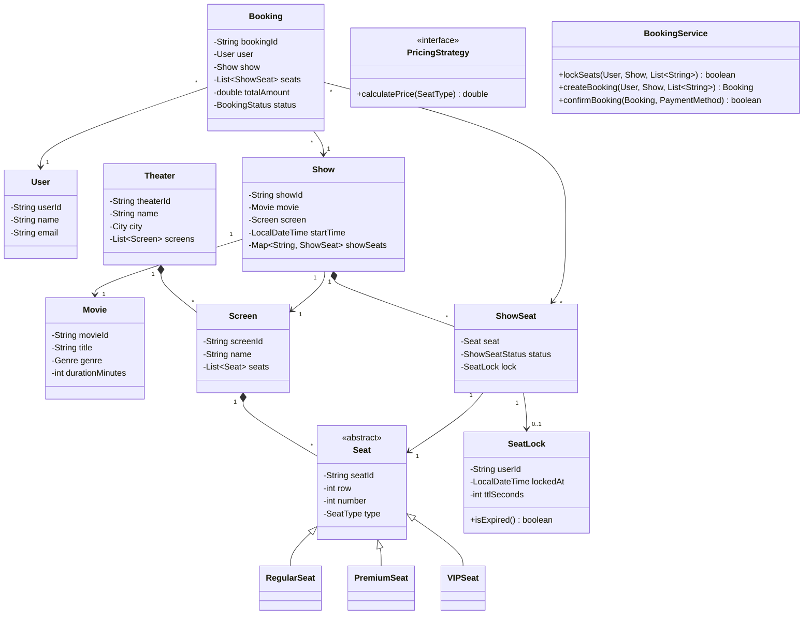

# Design BookMyShow (Movie Ticket Booking) -- LLD Interview Script (90 min)

> Simulates an actual low-level design / machine coding interview round.
> You must write compilable, runnable Java code on a whiteboard or shared editor.

---

## Opening (0:00 - 1:00)

> "Thanks! I'll be designing and implementing a Movie Ticket Booking system like BookMyShow. The key challenge here is handling concurrent seat selection and booking without double-selling. Let me clarify the requirements."

---

## Requirements Gathering (1:00 - 5:00)

> **You ask:** "Should I model the full flow -- browsing movies, selecting show times, seat selection, payment, and booking confirmation?"

> **Interviewer:** "Yes. Focus on the booking flow. Movie browsing can be simple."

> **You ask:** "How should I handle concurrent seat selection? Two users selecting the same seat at the same time."

> **Interviewer:** "This is the most important part. Show me how you prevent double-booking."

> **You ask:** "Should I support different seat types with different pricing?"

> **Interviewer:** "Yes -- at least Regular, Premium, VIP with different prices."

> **You ask:** "Should the system support multiple cities, theaters, and screens?"

> **Interviewer:** "Yes, model the full hierarchy: City -> Theaters -> Screens -> Shows -> Seats."

> **You ask:** "What about payment? Should I integrate a real payment flow?"

> **Interviewer:** "Simulate it. Show the design pattern, not the API integration."

> **You ask:** "Any time constraints for seat selection? Like a 'seat lock' that expires?"

> **Interviewer:** "Yes! Exactly. Show me a temporary lock mechanism."

> "Great. The scope is: multi-city movie booking with theater/screen hierarchy, seat locking with TTL for concurrent safety, a pricing strategy, and booking state machine. I'll use the Factory pattern for seats, Strategy for pricing, Observer for notifications, and a SeatLock mechanism with TTL."

---

## Entity Identification (5:00 - 10:00)

> "Let me identify all the entities."

**Entities I write on the board:**

1. **Enums** -- SeatType, ShowSeatStatus, BookingStatus, PaymentStatus, PaymentMethod, Genre, City
2. **User** -- userId, name, email, phone
3. **Movie** -- movieId, title, genre, duration, rating
4. **Theater** -- theaterId, name, city, list of Screens
5. **Screen** -- screenId, list of Seats
6. **Seat** (abstract) -- seatId, row, number, SeatType (Factory pattern for creation)
7. **Show** -- showId, movie, screen, startTime, list of ShowSeats
8. **ShowSeat** -- links a Seat to a Show with a status (AVAILABLE / LOCKED / BOOKED)
9. **SeatLock** -- userId, showSeatId, lockedAt, TTL (time-to-live)
10. **Booking** -- bookingId, user, show, seats, amount, status (state machine)
11. **PricingStrategy** (interface) -- calculates price per seat type
12. **BookingService** -- the orchestrator: lock seats, create booking, process payment, confirm

> "The relationships: Theater HAS-MANY Screens, Screen HAS-MANY Seats, Show HAS-A Movie + Screen, Show HAS-MANY ShowSeats. Booking HAS-MANY ShowSeats, HAS-A User, HAS-A Show."

---

## Class Diagram (10:00 - 15:00)

> "Let me sketch this."



---

## Implementation Plan (15:00 - 17:00)

> "Implementation order, bottom-up:"

1. **Enums** -- SeatType, ShowSeatStatus, BookingStatus, PaymentStatus, PaymentMethod, Genre, City
2. **User, Movie, Theater, Screen** -- basic entities
3. **Seat hierarchy** -- abstract Seat + RegularSeat, PremiumSeat, VIPSeat + SeatFactory
4. **Show + ShowSeat** -- the per-show seat instance with status tracking
5. **SeatLock** -- the TTL-based locking mechanism (critical for concurrency)
6. **Booking** -- with state machine (PENDING -> CONFIRMED | CANCELLED)
7. **PricingStrategy** -- Strategy pattern for seat pricing
8. **BookingService** -- the orchestrator that ties it all together
9. **Main demo** -- end-to-end booking flow

---

## Coding (17:00 - 70:00)

### Step 1: Enums (17:00 - 19:00)

> "Starting with the enums. These define the vocabulary of the system."

```java
public enum SeatType { REGULAR, PREMIUM, VIP }

public enum ShowSeatStatus { AVAILABLE, LOCKED, BOOKED }

public enum BookingStatus { PENDING, CONFIRMED, CANCELLED }

public enum PaymentStatus { PENDING, SUCCESS, FAILED }

public enum PaymentMethod { CREDIT_CARD, DEBIT_CARD, UPI, NET_BANKING }

public enum Genre { ACTION, COMEDY, DRAMA, THRILLER, HORROR, ROMANCE, SCI_FI }

public enum City { MUMBAI, DELHI, BANGALORE, HYDERABAD, CHENNAI }
```

---

### Step 2: Core Entities (19:00 - 25:00)

> "Simple data classes. I'll keep them clean."

```java
public class User {
    private final String userId;
    private final String name;
    private final String email;
    private final String phone;

    public User(String userId, String name, String email, String phone) {
        this.userId = userId;
        this.name = name;
        this.email = email;
        this.phone = phone;
    }

    public String getUserId() { return userId; }
    public String getName()   { return name; }
    public String getEmail()  { return email; }
    // ... other getters
}

public class Movie {
    private final String movieId;
    private final String title;
    private final Genre genre;
    private final int durationMinutes;
    private final double rating;

    // constructor, getters ...
}

public class Theater {
    private final String theaterId;
    private final String name;
    private final City city;
    private final List<Screen> screens;

    public Theater(String theaterId, String name, String address, City city) {
        this.theaterId = theaterId;
        this.name = name;
        this.city = city;
        this.screens = new ArrayList<>();
    }

    public void addScreen(Screen screen) { screens.add(screen); }
    public List<Screen> getScreens() { return screens; }
}

public class Screen {
    private final String screenId;
    private final String name;
    private final List<Seat> seats;

    public Screen(String screenId, String name) {
        this.screenId = screenId;
        this.name = name;
        this.seats = new ArrayList<>();
    }

    public void addSeat(Seat seat) { seats.add(seat); }
    public List<Seat> getSeats() { return Collections.unmodifiableList(seats); }
}
```

---

### Step 3: Seat Hierarchy + Factory (25:00 - 30:00)

> "I'm using inheritance for seat types because each type may have different attributes in the future -- VIP might have extra legroom, reclining, etc. The Factory centralizes creation."

```java
public abstract class Seat {
    private final String seatId;
    private final int row;
    private final int number;
    private final SeatType type;

    public Seat(String seatId, int row, int number, SeatType type) {
        this.seatId = seatId;
        this.row = row;
        this.number = number;
        this.type = type;
    }

    public String getSeatId() { return seatId; }
    public int getRow() { return row; }
    public int getNumber() { return number; }
    public SeatType getType() { return type; }
}

public class RegularSeat extends Seat {
    public RegularSeat(String id, int row, int num) {
        super(id, row, num, SeatType.REGULAR);
    }
}

public class PremiumSeat extends Seat {
    public PremiumSeat(String id, int row, int num) {
        super(id, row, num, SeatType.PREMIUM);
    }
}

public class VIPSeat extends Seat {
    public VIPSeat(String id, int row, int num) {
        super(id, row, num, SeatType.VIP);
    }
}

public class SeatFactory {
    public static Seat createSeat(String id, int row, int num, SeatType type) {
        switch (type) {
            case REGULAR: return new RegularSeat(id, row, num);
            case PREMIUM: return new PremiumSeat(id, row, num);
            case VIP:     return new VIPSeat(id, row, num);
            default: throw new IllegalArgumentException("Unknown seat type");
        }
    }
}
```

---

### Step 4: Show, ShowSeat, and SeatLock (30:00 - 42:00)

> "This is the critical section. ShowSeat tracks the per-show status of each seat, and SeatLock provides the TTL-based temporary reservation."

```java
public class SeatLock {
    private final String userId;
    private final LocalDateTime lockedAt;
    private final int ttlSeconds;

    public SeatLock(String userId, int ttlSeconds) {
        this.userId = userId;
        this.lockedAt = LocalDateTime.now();
        this.ttlSeconds = ttlSeconds;
    }

    public String getUserId() { return userId; }
    public LocalDateTime getLockedAt() { return lockedAt; }

    public boolean isExpired() {
        return LocalDateTime.now().isAfter(lockedAt.plusSeconds(ttlSeconds));
    }

    public boolean isLockedBy(String userId) {
        return this.userId.equals(userId) && !isExpired();
    }
}
```

> "The key method is `isExpired()`. When a lock expires, the seat effectively becomes available again without any cleanup thread. We check lazily."

```java
public class ShowSeat {
    private final Seat seat;
    private ShowSeatStatus status;
    private SeatLock lock;

    public ShowSeat(Seat seat) {
        this.seat = seat;
        this.status = ShowSeatStatus.AVAILABLE;
        this.lock = null;
    }

    public Seat getSeat() { return seat; }
    public ShowSeatStatus getStatus() { return status; }

    public boolean isAvailable() {
        if (status == ShowSeatStatus.LOCKED && lock != null && lock.isExpired()) {
            // Lock expired -- lazily release
            status = ShowSeatStatus.AVAILABLE;
            lock = null;
        }
        return status == ShowSeatStatus.AVAILABLE;
    }

    public synchronized boolean lock(String userId, int ttlSeconds) {
        if (!isAvailable()) return false;
        this.lock = new SeatLock(userId, ttlSeconds);
        this.status = ShowSeatStatus.LOCKED;
        return true;
    }

    public synchronized boolean book(String userId) {
        if (status != ShowSeatStatus.LOCKED) return false;
        if (lock == null || !lock.isLockedBy(userId)) return false;
        this.status = ShowSeatStatus.BOOKED;
        return true;
    }

    public synchronized void release() {
        this.status = ShowSeatStatus.AVAILABLE;
        this.lock = null;
    }
}
```

### Interviewer Interrupts:

> **Interviewer:** "How do you prevent double-booking? Walk me through the concurrency."

> **Your answer:** "Double-booking prevention happens at three levels:

> **Level 1: SeatLock with TTL** -- When User A selects a seat, I lock it with a time-to-live (say 5 minutes). During that window, User B sees the seat as LOCKED and cannot select it. If User A doesn't complete payment within the TTL, the lock expires and the seat becomes available again.

> **Level 2: Synchronized methods** -- The `lock()` and `book()` methods on ShowSeat are `synchronized`. This means only one thread at a time can attempt to lock or book a specific seat. Even if two users click 'select' at the exact same millisecond, only one will succeed.

> **Level 3: Book only if locked by you** -- The `book()` method checks `lock.isLockedBy(userId)`. Even if someone bypasses the UI and sends a direct booking request, they can't book a seat locked by another user.

> In a production system with a database, I'd use an optimistic locking strategy -- UPDATE show_seats SET status='BOOKED' WHERE seat_id=X AND status='LOCKED' AND locked_by=userId. The WHERE clause is the atomic check-and-set. If zero rows are affected, someone else got there first."

### Interviewer Interrupts:

> **Interviewer:** "What about concurrent seat selection? Two users clicking at the same time."

> **Your answer:** "The `synchronized` keyword on ShowSeat.lock() serializes concurrent attempts. But synchronized is per-object, so different seats can be locked in parallel -- there's no global lock bottleneck. For true production scale with distributed systems, I'd replace in-memory synchronization with Redis distributed locks -- SET seatId NX EX ttl -- which provides the same semantics with cluster-wide coordination."

---

### Step 5: Show (42:00 - 47:00)

> "Show connects a Movie to a Screen at a specific time and manages ShowSeats."

```java
public class Show {
    private final String showId;
    private final Movie movie;
    private final Screen screen;
    private final LocalDateTime startTime;
    private final Map<String, ShowSeat> showSeats; // seatId -> ShowSeat

    public Show(String showId, Movie movie, Screen screen, LocalDateTime startTime) {
        this.showId = showId;
        this.movie = movie;
        this.screen = screen;
        this.startTime = startTime;
        this.showSeats = new LinkedHashMap<>();

        // Create a ShowSeat for every physical seat in the screen
        for (Seat seat : screen.getSeats()) {
            showSeats.put(seat.getSeatId(), new ShowSeat(seat));
        }
    }

    public ShowSeat getShowSeat(String seatId) {
        return showSeats.get(seatId);
    }

    public List<ShowSeat> getAvailableSeats() {
        return showSeats.values().stream()
                .filter(ShowSeat::isAvailable)
                .collect(Collectors.toList());
    }

    public Movie getMovie() { return movie; }
    public Screen getScreen() { return screen; }
    public LocalDateTime getStartTime() { return startTime; }
}
```

---

### Step 6: Booking with State Machine (47:00 - 53:00)

> "Booking follows a simple state machine: PENDING -> CONFIRMED or CANCELLED."

```java
public class Booking {
    private final String bookingId;
    private final User user;
    private final Show show;
    private final List<ShowSeat> seats;
    private final double totalAmount;
    private BookingStatus status;
    private LocalDateTime bookedAt;

    public Booking(String bookingId, User user, Show show,
                   List<ShowSeat> seats, double totalAmount) {
        this.bookingId = bookingId;
        this.user = user;
        this.show = show;
        this.seats = seats;
        this.totalAmount = totalAmount;
        this.status = BookingStatus.PENDING;
        this.bookedAt = LocalDateTime.now();
    }

    public void confirm() {
        if (status != BookingStatus.PENDING)
            throw new IllegalStateException("Can only confirm PENDING bookings");
        this.status = BookingStatus.CONFIRMED;
    }

    public void cancel() {
        if (status == BookingStatus.CONFIRMED) {
            // Release all seats back to available
            for (ShowSeat ss : seats) {
                ss.release();
            }
        }
        this.status = BookingStatus.CANCELLED;
    }

    public String getBookingId() { return bookingId; }
    public BookingStatus getStatus() { return status; }
    public double getTotalAmount() { return totalAmount; }
    public User getUser() { return user; }
}
```

---

### Step 7: Pricing Strategy (53:00 - 56:00)

> "Strategy pattern for pricing. Different shows or theaters could have different pricing."

```java
public interface PricingStrategy {
    double calculatePrice(SeatType seatType);
}

public class StandardPricingStrategy implements PricingStrategy {
    @Override
    public double calculatePrice(SeatType seatType) {
        switch (seatType) {
            case REGULAR: return 200.0;
            case PREMIUM: return 350.0;
            case VIP:     return 500.0;
            default: throw new IllegalArgumentException("Unknown seat type");
        }
    }
}

public class WeekendPricingStrategy implements PricingStrategy {
    @Override
    public double calculatePrice(SeatType seatType) {
        switch (seatType) {
            case REGULAR: return 250.0;
            case PREMIUM: return 450.0;
            case VIP:     return 650.0;
            default: throw new IllegalArgumentException("Unknown seat type");
        }
    }
}
```

> "If the interviewer asks about surge pricing, holiday pricing, or promotional pricing, I can just add another strategy. Zero changes to existing code."

---

### Step 8: BookingService -- The Orchestrator (56:00 - 65:00)

> "This is the core engine that ties everything together."

```java
public class BookingService {
    private static final int SEAT_LOCK_TTL_SECONDS = 300; // 5 minutes
    private final PricingStrategy pricingStrategy;
    private int bookingCounter = 0;
    private final List<OrderStatusObserver> observers;

    public BookingService(PricingStrategy pricingStrategy) {
        this.pricingStrategy = pricingStrategy;
        this.observers = new ArrayList<>();
    }

    /**
     * Step 1: Lock selected seats for the user.
     * Returns true only if ALL requested seats were locked.
     * If any lock fails, releases all already-locked seats (rollback).
     */
    public boolean lockSeats(User user, Show show, List<String> seatIds) {
        List<ShowSeat> locked = new ArrayList<>();

        for (String seatId : seatIds) {
            ShowSeat ss = show.getShowSeat(seatId);
            if (ss == null || !ss.lock(user.getUserId(), SEAT_LOCK_TTL_SECONDS)) {
                // Rollback all previously locked seats
                for (ShowSeat prev : locked) {
                    prev.release();
                }
                return false;
            }
            locked.add(ss);
        }
        return true;
    }

    /**
     * Step 2: Create a pending booking with calculated pricing.
     */
    public Booking createBooking(User user, Show show, List<String> seatIds) {
        List<ShowSeat> showSeats = new ArrayList<>();
        double total = 0;

        for (String seatId : seatIds) {
            ShowSeat ss = show.getShowSeat(seatId);
            if (ss == null)
                throw new IllegalArgumentException("Invalid seat: " + seatId);
            showSeats.add(ss);
            total += pricingStrategy.calculatePrice(ss.getSeat().getType());
        }

        String bookingId = "BK-" + (++bookingCounter);
        return new Booking(bookingId, user, show, showSeats, total);
    }

    /**
     * Step 3: Process payment and confirm booking.
     * Books all seats atomically -- all succeed or all fail.
     */
    public boolean confirmBooking(Booking booking, PaymentMethod method) {
        // Simulate payment
        System.out.println("Processing " + method + " payment of Rs. "
                + booking.getTotalAmount());
        boolean paymentSuccess = true; // simulated

        if (paymentSuccess) {
            // Book all seats
            for (ShowSeat ss : booking.getSeats()) {
                boolean booked = ss.book(booking.getUser().getUserId());
                if (!booked) {
                    // Seat lock expired or stolen -- rollback
                    booking.cancel();
                    return false;
                }
            }
            booking.confirm();
            notifyObservers(booking);
            return true;
        } else {
            booking.cancel();
            return false;
        }
    }

    private void notifyObservers(Booking booking) {
        System.out.println("Sending confirmation email to "
                + booking.getUser().getEmail());
        System.out.println("Sending SMS to " + booking.getUser().getPhone());
    }
}
```

> "The three-step flow is: lockSeats -> createBooking -> confirmBooking. If lockSeats fails (seats taken), we bail early. If payment fails, we cancel and release seats."

---

### Step 9: Main Demo (65:00 - 70:00)

> "End-to-end demo:"

```java
public class BookMyShowDemo {
    public static void main(String[] args) {
        // Setup: Theater with a screen
        Screen screen = new Screen("SCR-1", "Screen 1");
        screen.addSeat(SeatFactory.createSeat("A1", 1, 1, SeatType.REGULAR));
        screen.addSeat(SeatFactory.createSeat("A2", 1, 2, SeatType.REGULAR));
        screen.addSeat(SeatFactory.createSeat("B1", 2, 1, SeatType.PREMIUM));
        screen.addSeat(SeatFactory.createSeat("C1", 3, 1, SeatType.VIP));

        Theater theater = new Theater("TH-1", "PVR Phoenix", "...", City.MUMBAI);
        theater.addScreen(screen);

        Movie movie = new Movie("M-1", "Inception", "...", Genre.SCI_FI, 148, 8.8);
        Show show = new Show("SH-1", movie, screen,
                LocalDateTime.of(2025, 1, 15, 18, 30));

        User alice = new User("U-1", "Alice", "alice@email.com", "9876543210");
        User bob = new User("U-2", "Bob", "bob@email.com", "9876543211");

        BookingService service = new BookingService(new StandardPricingStrategy());

        // Alice books A1 and B1
        System.out.println("--- Alice tries to book A1, B1 ---");
        boolean locked = service.lockSeats(alice, show, List.of("A1", "B1"));
        System.out.println("Lock result: " + locked); // true

        Booking aliceBooking = service.createBooking(alice, show, List.of("A1", "B1"));
        System.out.println("Total: Rs. " + aliceBooking.getTotalAmount()); // 550.0

        boolean confirmed = service.confirmBooking(aliceBooking, PaymentMethod.UPI);
        System.out.println("Booking confirmed: " + confirmed); // true

        // Bob tries to book A1 (already booked by Alice)
        System.out.println("\n--- Bob tries to book A1 ---");
        boolean bobLock = service.lockSeats(bob, show, List.of("A1"));
        System.out.println("Lock result: " + bobLock); // false -- seat already booked!

        // Bob books C1 instead
        System.out.println("\n--- Bob books C1 instead ---");
        bobLock = service.lockSeats(bob, show, List.of("C1"));
        Booking bobBooking = service.createBooking(bob, show, List.of("C1"));
        service.confirmBooking(bobBooking, PaymentMethod.CREDIT_CARD);
    }
}
```

---

## Demo & Testing (70:00 - 80:00)

> "Let me trace the output:"

```
--- Alice tries to book A1, B1 ---
Lock result: true
Total: Rs. 550.0
Processing UPI payment of Rs. 550.0
Sending confirmation email to alice@email.com
Sending SMS to 9876543210
Booking confirmed: true

--- Bob tries to book A1 ---
Lock result: false

--- Bob books C1 instead ---
Lock result: true
Processing CREDIT_CARD payment of Rs. 500.0
Sending confirmation email to bob@email.com
Booking confirmed: true
```

> "Key scenarios demonstrated: successful booking, concurrent conflict (Bob can't lock A1), and fallback to another seat."

> "Edge cases to test: lock expiry (wait 5+ minutes, seat becomes available again), partial lock failure (if Alice tries to lock A1+C1 and C1 is taken, A1 is rolled back), payment failure (booking cancelled, seats released)."

---

## Extension Round (80:00 - 90:00)

### Interviewer asks: "Now add coupon/discount support."

> "Great. I designed the pricing with Strategy pattern, so discounts fit naturally. I'll add a Coupon entity and a DiscountPricingStrategy that wraps an existing strategy."

```java
public class Coupon {
    private final String code;
    private final double discountPercent;
    private final double maxDiscount;
    private final LocalDateTime expiresAt;
    private boolean used;

    public Coupon(String code, double discountPercent, double maxDiscount,
                  LocalDateTime expiresAt) {
        this.code = code;
        this.discountPercent = discountPercent;
        this.maxDiscount = maxDiscount;
        this.expiresAt = expiresAt;
        this.used = false;
    }

    public boolean isValid() {
        return !used && LocalDateTime.now().isBefore(expiresAt);
    }

    public double applyDiscount(double amount) {
        if (!isValid()) return amount;
        double discount = amount * (discountPercent / 100.0);
        discount = Math.min(discount, maxDiscount);
        return amount - discount;
    }

    public void markUsed() { this.used = true; }
    public String getCode() { return code; }
}
```

> "For the pricing integration, I use the Decorator pattern -- wrapping the existing PricingStrategy:"

```java
public class DiscountPricingStrategy implements PricingStrategy {
    private final PricingStrategy basePricing;
    private final Coupon coupon;

    public DiscountPricingStrategy(PricingStrategy basePricing, Coupon coupon) {
        this.basePricing = basePricing;
        this.coupon = coupon;
    }

    @Override
    public double calculatePrice(SeatType seatType) {
        double basePrice = basePricing.calculatePrice(seatType);
        return coupon.applyDiscount(basePrice);
    }
}
```

> "Usage in BookingService: when the user applies a coupon, I wrap the current strategy:"

```java
// In createBooking, if user has coupon:
PricingStrategy effective = new DiscountPricingStrategy(
    this.pricingStrategy, userCoupon);
double total = 0;
for (ShowSeat ss : showSeats) {
    total += effective.calculatePrice(ss.getSeat().getType());
}
userCoupon.markUsed();
```

> "Changes: two new classes (Coupon and DiscountPricingStrategy), zero modifications to existing code. The Decorator pattern lets me stack discounts if needed -- e.g., a site-wide discount wrapped around a coupon discount."

---

## Red Flags to Avoid

1. **No seat locking** -- Allowing direct booking without a lock step guarantees double-booking under concurrency.
2. **Global lock for all seats** -- Using a single `synchronized` block for all seat operations kills parallelism. Lock per-seat, not globally.
3. **No lock expiry (TTL)** -- If a user abandons the flow, seats stay locked forever.
4. **Mutable seat status without synchronization** -- Race conditions on ShowSeatStatus.
5. **No rollback on partial failure** -- If locking 3 seats and the 3rd fails, you must release the first two.
6. **Mixing booking logic into entities** -- The Booking class shouldn't know about payment processing. That's the service layer's job.
7. **No pricing abstraction** -- Hardcoding prices makes it impossible to add weekend/holiday/discount pricing.

---

## What Impresses Interviewers

1. **Seat locking with TTL** -- Shows deep understanding of concurrent booking systems.
2. **Three-step booking flow** -- Lock -> Book -> Confirm is the industry-standard pattern (similar to Stripe's payment intents).
3. **Synchronized per-seat, not global** -- Shows understanding of granular locking.
4. **Lazy lock expiry** -- No background cleanup thread needed; check on access.
5. **Rollback on partial lock failure** -- Atomicity even without a database.
6. **Factory for seats, Strategy for pricing** -- Two patterns applied naturally, not forced.
7. **Decorator for discounts** -- Showing you can compose pricing strategies.
8. **Observer for notifications** -- Email/SMS decoupled from booking logic.
9. **Show vs Seat vs ShowSeat distinction** -- The ShowSeat entity (linking a physical seat to a specific show instance) is the insight most candidates miss.
10. **Production-awareness** -- Mentioning Redis locks, database optimistic locking, and distributed systems when discussing concurrency.
