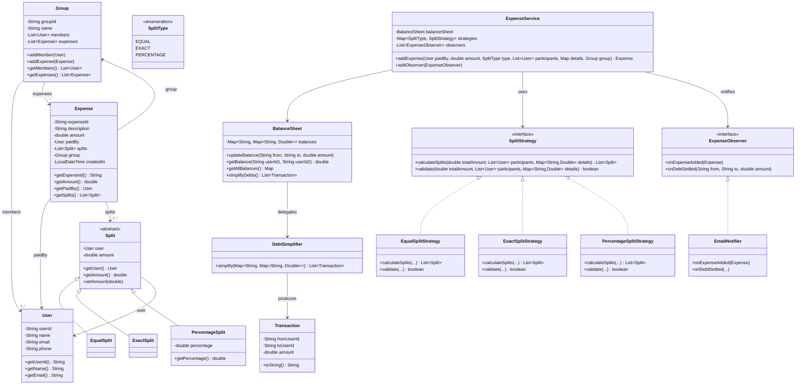

# Design Splitwise / Expense Sharing System -- LLD Walkthrough

## The Problem

> "Design a system like Splitwise where users can share expenses, split costs
> in different ways, track balances, and simplify debts within groups."

This is a **rising-frequency LLD question at Uber India**. It tests your grasp of
the Strategy pattern, clean OOP modeling, graph-based debt simplification, and
the Observer pattern. The interviewer wants to see you model multiple split types
cleanly without if-else chains and produce a working balance sheet.

---

## Step 1: Clarify Requirements (2-3 minutes)

### Functional Requirements

| Requirement                              | Detail                                          |
|------------------------------------------|-------------------------------------------------|
| Add an expense                           | One person pays, multiple people owe             |
| Split equally                            | Divide total evenly among participants           |
| Split by exact amount                    | Each person owes a specific amount (sum = total) |
| Split by percentage                      | Each person owes a percentage (sum = 100%)       |
| Track balances                           | Who owes whom, and how much                      |
| Simplify debts                           | Minimize total number of transactions to settle  |
| Group expenses                           | Create groups, add expenses within a group       |
| Notify on expense added / settled        | Users get notified when relevant events occur    |

### Non-Functional Requirements

| Requirement               | Detail                                  |
|---------------------------|-----------------------------------------|
| Correctness               | Every rupee accounted for, no rounding drift |
| Extensibility             | Easy to add new split types later       |
| Thread safety (discussion)| Balance updates must be atomic          |
| Clean OOP                 | Strategy, Observer, single responsibility|

### Summarize Back

> "We need a system where users create groups, add expenses with three split
> types (equal, exact, percentage), maintain a running balance sheet of who owes
> whom, and can simplify the debts to minimize transactions. Users should be
> notified when expenses are added. The design should be extensible to new split
> types without modifying existing code."

---

## Step 2: Identify Core Entities

Before drawing any diagram, list the nouns:

```
User            -- person in the system
Group           -- collection of users sharing expenses
Expense         -- a payment event: who paid, how much, how it's split
Split           -- one person's share of an expense (abstract)
  EqualSplit    -- share computed by dividing equally
  ExactSplit    -- share specified as an exact amount
  PercentageSplit -- share specified as a percentage
BalanceSheet    -- ledger: Map<UserId, Map<UserId, Double>>
Transaction     -- a simplified debt: from -> to -> amount
```

And the verbs / behaviors:

```
SplitStrategy          -- compute splits from total + participants
ExpenseService         -- orchestrate adding expenses, updating balances
DebtSimplifier         -- minimize transactions from current balances
ExpenseObserver        -- react to expense events (notify users)
```

---

## Step 3: Class Diagram



---

## Step 4: The Core Pattern -- Strategy for Split Types

This is the **centerpiece** of the design. Without it, you end up with a massive
if-else block inside `addExpense()`. The Strategy pattern lets each split type
encapsulate its own calculation logic and validation.

### Why Strategy?

```
WITHOUT Strategy (bad):
  if (type == EQUAL)  { ... divide equally ... }
  else if (type == EXACT) { ... validate sum ... }
  else if (type == PERCENTAGE) { ... convert pct ... }
  // Adding a new type means modifying this method -- violates Open/Closed

WITH Strategy (good):
  SplitStrategy strategy = strategies.get(splitType);
  List<Split> splits = strategy.calculateSplits(amount, participants, details);
  // Adding a new type = add one class + register it. Zero existing code changes.
```

### SplitStrategy Interface

```java
public interface SplitStrategy {
    List<Split> calculateSplits(double totalAmount, List<User> participants,
                                 Map<String, Double> splitDetails);
    boolean validate(double totalAmount, List<User> participants,
                     Map<String, Double> splitDetails);
}
```

### EqualSplitStrategy

```
Input:  totalAmount = 3000, participants = [Alice, Bob, Charlie]
Logic:  each share = 3000 / 3 = 1000.00
Output: [EqualSplit(Alice, 1000), EqualSplit(Bob, 1000), EqualSplit(Charlie, 1000)]

Validation: at least one participant. That's it.
```

### ExactSplitStrategy

```
Input:  totalAmount = 3000, details = {Alice: 1500, Bob: 1000, Charlie: 500}
Logic:  use the exact amounts as provided
Output: [ExactSplit(Alice, 1500), ExactSplit(Bob, 1000), ExactSplit(Charlie, 500)]

Validation: sum of exact amounts MUST equal totalAmount.
  1500 + 1000 + 500 = 3000  (valid)
  1500 + 1000 + 600 = 3100  (INVALID -- throws exception)
```

### PercentageSplitStrategy

```
Input:  totalAmount = 3000, details = {Alice: 50, Bob: 30, Charlie: 20}
Logic:  Alice = 3000 * 50/100 = 1500
        Bob   = 3000 * 30/100 = 900
        Charlie = 3000 * 20/100 = 600
Output: [PercentageSplit(Alice, 1500, 50%), PercentageSplit(Bob, 900, 30%),
         PercentageSplit(Charlie, 600, 20%)]

Validation: percentages MUST sum to exactly 100.
  50 + 30 + 20 = 100  (valid)
  50 + 30 + 25 = 105  (INVALID -- throws exception)
```

### Strategy Registration

```java
Map<SplitType, SplitStrategy> strategies = new HashMap<>();
strategies.put(SplitType.EQUAL, new EqualSplitStrategy());
strategies.put(SplitType.EXACT, new ExactSplitStrategy());
strategies.put(SplitType.PERCENTAGE, new PercentageSplitStrategy());
```

To add a **new split type** (say SHARE-based, where you specify ratios like
2:1:1), you:
1. Create `ShareSplit extends Split`
2. Create `ShareSplitStrategy implements SplitStrategy`
3. Add `strategies.put(SplitType.SHARE, new ShareSplitStrategy())`

Zero lines of existing code touched. **Open/Closed Principle in action.**

---

## Step 5: Balance Tracking

### Data Structure

```
Map<String, Map<String, Double>> balances

Example state after Alice pays 3000 split equally among Alice, Bob, Charlie:
  Alice paid 3000. Each owes 1000.
  Bob owes Alice 1000.  Charlie owes Alice 1000.

  balances = {
    "Bob":     { "Alice": 1000.0 },
    "Charlie": { "Alice": 1000.0 }
  }
```

### Update Logic

When adding an expense where `paidBy` paid and `split.user` owes `split.amount`:

```
For each split where split.user != paidBy:
    ower = split.user.id
    lender = paidBy.id

    // Check if lender already owes ower something (reverse debt)
    if balances[lender][ower] exists:
        if balances[lender][ower] >= split.amount:
            balances[lender][ower] -= split.amount   // reduce reverse debt
        else:
            remainder = split.amount - balances[lender][ower]
            balances[lender][ower] = 0               // clear reverse debt
            balances[ower][lender] += remainder       // ower now owes the rest
    else:
        balances[ower][lender] += split.amount
```

### Reading a Balance

```
getBalance("Bob", "Alice"):
  if balances["Bob"]["Alice"] > 0  -->  "Bob owes Alice 1000"
  if balances["Alice"]["Bob"] > 0  -->  "Alice owes Bob 1000"
  else                             -->  "Bob and Alice are settled"
```

---

## Step 6: Debt Simplification Algorithm

This is the second key interview topic. In a group of N people with criss-crossing
debts, how do you **minimize the number of transactions** to settle all debts?

### The Problem

```
Before simplification (5 transactions):
  Alice owes Bob    1000
  Bob owes Charlie  2000
  Charlie owes Alice 500
  Alice owes Charlie 1500
  Bob owes Alice     300

After simplification (2 transactions):
  Alice owes Charlie  ???
  Bob owes Charlie    ???
  (much fewer transactions)
```

### Algorithm: Greedy Net-Balance Matching

```
Step 1: Calculate NET balance for each person.
  net[person] = (total owed TO them) - (total they OWE)

  If net > 0 --> they are a NET CREDITOR (others owe them)
  If net < 0 --> they are a NET DEBTOR  (they owe others)
  If net = 0 --> they are settled

Step 2: Separate into creditors (positive) and debtors (negative).

Step 3: Sort both lists by absolute value (largest first).

Step 4: Greedy matching:
  While creditors and debtors remain:
    Take the largest creditor and largest debtor.
    settlement = min(creditor.amount, abs(debtor.amount))
    Create transaction: debtor pays creditor `settlement`
    Reduce both by `settlement`.
    Remove any that hit zero.

This produces the MINIMUM number of transactions.
```

### Worked Example

```
Raw debts:
  A owes B: 1000       B owes C: 3000
  A owes C: 2000       C owes A: 500

Step 1 -- Net balances:
  A: owed 500 (from C), owes 3000 (1000 to B + 2000 to C) --> net = -2500
  B: owed 1000 (from A), owes 3000 (to C)                 --> net = -2000
  C: owed 5000 (3000 from B + 2000 from A), owes 500 (to A) --> net = +4500

  Verify: -2500 + -2000 + 4500 = 0  (must always sum to zero)

Step 2 -- Separate:
  Creditors: [C: +4500]
  Debtors:   [A: -2500, B: -2000]

Step 3 -- Match:
  Round 1: A(-2500) pays C(+4500) --> settlement = 2500
           A is settled. C has +2000 remaining.
  Round 2: B(-2000) pays C(+2000) --> settlement = 2000
           Both settled.

Result: only 2 transactions instead of 4:
  A pays C: 2500
  B pays C: 2000
```

### Complexity

```
Time:  O(N log N) for sorting + O(N) for matching = O(N log N)
Space: O(N) for net balance map
```

---

## Step 7: Observer Pattern -- Notifications

When an expense is added or a debt is settled, multiple subsystems need to react:
email notifications, push notifications, activity feed updates. The Observer
pattern decouples the expense service from these side effects.

### Structure

```
ExpenseObserver (interface):
  + onExpenseAdded(Expense expense)
  + onDebtSettled(String fromUserId, String toUserId, double amount)

EmailNotifier implements ExpenseObserver:
  + onExpenseAdded(expense):
      for each split in expense:
          if split.user != expense.paidBy:
              sendEmail(split.user, "You owe " + expense.paidBy.name + " ..." )

  + onDebtSettled(from, to, amount):
      sendEmail(to, from + " settled a debt of " + amount)
```

### Registration

```java
ExpenseService service = new ExpenseService(balanceSheet);
service.addObserver(new EmailNotifier());
service.addObserver(new PushNotifier());    // easy to add more
service.addObserver(new ActivityLogger());
```

When `service.addExpense(...)` is called, after updating balances it iterates
through all registered observers and calls `onExpenseAdded(expense)`. No changes
to ExpenseService when adding new notification channels.

---

## Step 8: Flow Walkthrough -- Adding an Expense

Here is the complete flow when a user adds a group expense:

```
1. User calls: expenseService.addExpense(
       paidBy=Alice, amount=3000, type=EQUAL,
       participants=[Alice, Bob, Charlie], details=null, group=TripGroup)

2. ExpenseService looks up strategy:
       strategy = strategies.get(EQUAL)  --> EqualSplitStrategy

3. Strategy validates and computes splits:
       validate(3000, [Alice, Bob, Charlie], null)  --> true
       calculateSplits(3000, [Alice, Bob, Charlie], null)
         --> [EqualSplit(Alice,1000), EqualSplit(Bob,1000), EqualSplit(Charlie,1000)]

4. Expense object created:
       Expense { id=UUID, desc="Group dinner", amount=3000,
                 paidBy=Alice, splits=[...], group=TripGroup }

5. Balance sheet updated:
       For Bob's split (1000):   balances["Bob"]["Alice"] += 1000
       For Charlie's split (1000): balances["Charlie"]["Alice"] += 1000
       (Alice's own split is skipped -- she paid, so she doesn't owe herself)

6. Expense added to group:
       TripGroup.expenses.add(expense)

7. Observers notified:
       emailNotifier.onExpenseAdded(expense)
         --> Email to Bob: "Alice added 'Group dinner' (3000). You owe 1000."
         --> Email to Charlie: "Alice added 'Group dinner' (3000). You owe 1000."

8. Expense returned to caller.
```

---

## Step 9: Design Patterns Summary

| Pattern     | Where Used                         | Why                                      |
|-------------|------------------------------------|------------------------------------------|
| **Strategy**| SplitStrategy + 3 implementations  | Swap split algorithms without if-else    |
| **Observer**| ExpenseObserver + notifiers        | Decouple notifications from core logic   |
| **Factory** | Strategy map lookup by SplitType   | Create right strategy from enum          |
| **Template**| Split abstract class               | Common fields, specialized subclasses    |

---

## Step 10: Edge Cases and Interview Talking Points

### Rounding Errors

When splitting 1000 three ways: 333.33 + 333.33 + 333.33 = 999.99. One penny
is lost. Solution: assign the remainder to the first participant.

```java
double baseShare = Math.floor(totalAmount * 100 / n) / 100;  // 333.33
double remainder = totalAmount - baseShare * n;               // 0.01
// First person gets baseShare + remainder = 333.34
```

### Self-Split

When the payer is also a participant, skip their split in the balance update.
They owe themselves nothing.

### Negative Balances and Reverse Debts

If A owes B 500, and then B owes A 300 in a new expense, the net is A owes B
200. The balance sheet must handle this netting correctly.

### Concurrent Updates

In a production system, balance updates must be synchronized. Two expenses
added simultaneously for the same users could corrupt the balance map.
Mention `ConcurrentHashMap` or row-level locking in a database.

### Expense Deletion

If an expense is deleted, reverse all the balance updates. This is the inverse
operation of `updateBalance`.

---

## Step 11: Extensibility Checklist

| Future Feature            | How to Add                                            |
|---------------------------|-------------------------------------------------------|
| New split type (by shares)| New Split subclass + Strategy impl + register in map  |
| Settlement tracking       | Add `settleDebt(from, to, amount)` to ExpenseService  |
| Currency conversion       | Decorator on SplitStrategy or separate CurrencyService|
| Recurring expenses        | Scheduler that calls addExpense periodically           |
| Expense categories        | Add `category` field to Expense, no structural change  |
| Audit log                 | New Observer that logs to persistent store              |
| Push notifications        | New Observer implementation, register it                |

---

## Step 12: What the Interviewer Is Looking For

1. **Strategy pattern** -- this is non-negotiable. If you use if-else for split
   types, you fail the OOP portion.

2. **Clean entity modeling** -- Split as an abstract class with proper
   inheritance, Expense composed of Splits.

3. **Balance tracking correctness** -- handle reverse debts, self-splits, and
   demonstrate with a concrete example.

4. **Debt simplification** -- explain the greedy algorithm clearly. Show the
   net-balance approach. Bonus: mention that the general minimum-transaction
   problem is NP-hard, but the greedy approach is optimal for most practical
   cases.

5. **Observer for notifications** -- shows you think about side effects and
   decoupling.

6. **Working code** -- the implementation must compile and produce correct
   output for all three split types.
