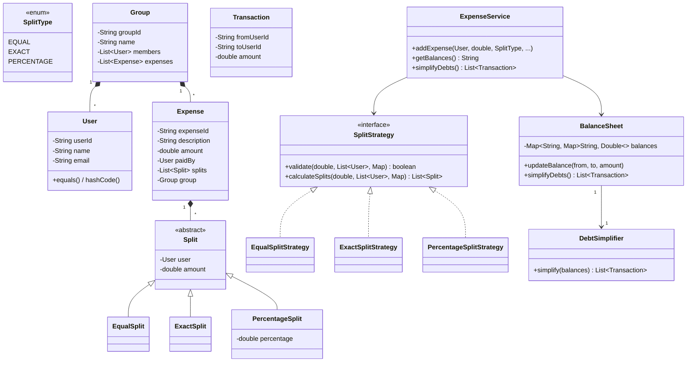

# Design Splitwise (Expense Sharing) -- LLD Interview Script (90 min)

> Simulates an actual low-level design / machine coding interview round.
> You must write compilable, runnable Java code on a whiteboard or shared editor.

---

## Opening (0:00 - 1:00)

> "Thanks! I'll be designing and implementing a Splitwise-like expense sharing system. The core challenge is supporting multiple split types, maintaining accurate balances, and simplifying debts. Let me start with requirements."

---

## Requirements Gathering (1:00 - 5:00)

> **You ask:** "What split types should I support? Equal splits, exact amounts, percentages?"

> **Interviewer:** "All three. Equal, Exact, and Percentage."

> **You ask:** "Should I support groups (like a trip group) or just pairwise expenses?"

> **Interviewer:** "Groups. Users can create groups and add expenses within them."

> **You ask:** "Should I implement debt simplification? For example, if A owes B $10 and B owes A $5, simplify to A owes B $5."

> **Interviewer:** "Yes! This is a key feature. Show me the algorithm."

> **You ask:** "What's the expected scale? Are we handling floating-point precision?"

> **Interviewer:** "Use double with rounding. Handle the case where equal splits don't divide evenly."

> **You ask:** "Should I build any notification system?"

> **Interviewer:** "Not a priority. Focus on the split logic, balance tracking, and debt simplification."

> "Got it. The scope is: an expense sharing system with three split types (Equal, Exact, Percentage), group-based expenses, a balance sheet that tracks who owes whom, and a debt simplification algorithm to minimize the number of settlements."

---

## Entity Identification (5:00 - 10:00)

> "Let me identify the core entities."

**Entities I write on the board:**

1. **User** -- userId, name, email, phone
2. **SplitType** (enum) -- EQUAL, EXACT, PERCENTAGE
3. **Split** (abstract) -- user, amount (base class for all split types)
4. **EqualSplit, ExactSplit, PercentageSplit** -- concrete split classes
5. **SplitStrategy** (interface) -- validates and calculates splits (Strategy pattern)
6. **EqualSplitStrategy, ExactSplitStrategy, PercentageSplitStrategy** -- concrete strategies
7. **Expense** -- expenseId, description, amount, paidBy, list of Splits, group
8. **Group** -- groupId, name, members, expenses
9. **BalanceSheet** -- central ledger: who owes whom how much
10. **DebtSimplifier** -- greedy algorithm to minimize settlements
11. **Transaction** -- simplified debt record (from, to, amount)
12. **ExpenseService** -- orchestrator that ties everything together

> "The relationships: Group HAS-MANY Users and HAS-MANY Expenses. Expense HAS-A User (paidBy) and HAS-MANY Splits. BalanceSheet tracks pairwise debts. DebtSimplifier takes raw balances and produces minimum Transactions."

---

## Class Diagram (10:00 - 15:00)

> "Let me sketch the class diagram."



---

## Implementation Plan (15:00 - 17:00)

> "Implementation order:"

1. **User** -- value object with equals/hashCode by userId
2. **SplitType enum**
3. **Split hierarchy** -- abstract Split + EqualSplit, ExactSplit, PercentageSplit
4. **SplitStrategy interface** + three concrete strategies
5. **Expense** -- immutable expense record
6. **Group** -- collection of users and expenses
7. **Transaction** -- simplified debt record
8. **DebtSimplifier** -- the greedy net-balance algorithm
9. **BalanceSheet** -- central ledger with netting
10. **ExpenseService** -- orchestrator
11. **Main demo** -- all three split types + simplification

---

## Coding (17:00 - 70:00)

### Step 1: User (17:00 - 19:00)

> "User is a value object. equals/hashCode based on userId is crucial because I'll use Users as map keys."

```java
public class User {
    private final String userId;
    private final String name;
    private final String email;
    private final String phone;

    public User(String userId, String name, String email, String phone) {
        this.userId = userId;
        this.name = name;
        this.email = email;
        this.phone = phone;
    }

    public String getUserId() { return userId; }
    public String getName() { return name; }
    public String getEmail() { return email; }

    @Override
    public boolean equals(Object o) {
        if (this == o) return true;
        if (o == null || getClass() != o.getClass()) return false;
        User user = (User) o;
        return Objects.equals(userId, user.userId);
    }

    @Override
    public int hashCode() { return Objects.hash(userId); }

    @Override
    public String toString() { return name + "(" + userId + ")"; }
}
```

---

### Step 2: Split Hierarchy (19:00 - 24:00)

> "Split is the abstract base. Each subclass represents a different way to express a user's share."

```java
public enum SplitType { EQUAL, EXACT, PERCENTAGE }

public abstract class Split {
    private final User user;
    private double amount;

    public Split(User user) { this.user = user; this.amount = 0; }
    public Split(User user, double amount) { this.user = user; this.amount = amount; }

    public User getUser() { return user; }
    public double getAmount() { return amount; }
    public void setAmount(double amount) { this.amount = amount; }

    @Override
    public String toString() {
        return user.getName() + " owes " + String.format("%.2f", amount);
    }
}

public class EqualSplit extends Split {
    public EqualSplit(User user) { super(user); }
    public EqualSplit(User user, double amount) { super(user, amount); }
}

public class ExactSplit extends Split {
    public ExactSplit(User user, double amount) { super(user, amount); }
}

public class PercentageSplit extends Split {
    private final double percentage;

    public PercentageSplit(User user, double percentage) {
        super(user);
        this.percentage = percentage;
    }

    public double getPercentage() { return percentage; }

    @Override
    public String toString() {
        return getUser().getName() + " owes " + String.format("%.2f", getAmount())
               + " (" + String.format("%.1f", percentage) + "%)";
    }
}
```

> "PercentageSplit stores both the percentage and the calculated amount. The percentage is for display; the amount is what the balance sheet uses."

---

### Step 3: SplitStrategy -- Strategy Pattern (24:00 - 38:00)

> "This is the core pattern. Each split type has its own validation and calculation logic."

```java
public interface SplitStrategy {
    boolean validate(double totalAmount, List<User> participants,
                     Map<String, Double> splitDetails);
    List<Split> calculateSplits(double totalAmount, List<User> participants,
                                 Map<String, Double> splitDetails);
}
```

> "EqualSplitStrategy needs to handle the rounding problem. If $100 is split 3 ways, each person owes $33.33, but that's only $99.99. The extra cent goes to the first participant."

```java
public class EqualSplitStrategy implements SplitStrategy {
    @Override
    public boolean validate(double totalAmount, List<User> participants,
                            Map<String, Double> splitDetails) {
        if (participants == null || participants.isEmpty())
            throw new IllegalArgumentException("Need at least one participant");
        if (totalAmount <= 0)
            throw new IllegalArgumentException("Amount must be positive");
        return true;
    }

    @Override
    public List<Split> calculateSplits(double totalAmount, List<User> participants,
                                        Map<String, Double> splitDetails) {
        validate(totalAmount, participants, splitDetails);
        int n = participants.size();
        double baseShare = Math.floor(totalAmount * 100.0 / n) / 100.0;
        double totalDistributed = baseShare * n;
        double remainder = Math.round((totalAmount - totalDistributed) * 100.0) / 100.0;

        List<Split> splits = new ArrayList<>();
        for (int i = 0; i < n; i++) {
            double share = baseShare;
            if (i == 0 && remainder > 0) {
                share = Math.round((baseShare + remainder) * 100.0) / 100.0;
            }
            splits.add(new EqualSplit(participants.get(i), share));
        }
        return splits;
    }
}
```

> "ExactSplitStrategy validates that exact amounts sum to the total:"

```java
public class ExactSplitStrategy implements SplitStrategy {
    @Override
    public boolean validate(double totalAmount, List<User> participants,
                            Map<String, Double> splitDetails) {
        if (splitDetails == null || splitDetails.size() != participants.size())
            throw new IllegalArgumentException("Need exact amount for each participant");

        double sum = 0;
        for (User user : participants) {
            Double amount = splitDetails.get(user.getUserId());
            if (amount == null)
                throw new IllegalArgumentException("Missing amount for: " + user.getName());
            if (amount < 0)
                throw new IllegalArgumentException("Amount can't be negative for: " + user.getName());
            sum += amount;
        }
        if (Math.abs(sum - totalAmount) > 0.01)
            throw new IllegalArgumentException("Exact amounts (" + String.format("%.2f", sum)
                    + ") don't sum to total (" + String.format("%.2f", totalAmount) + ")");
        return true;
    }

    @Override
    public List<Split> calculateSplits(double totalAmount, List<User> participants,
                                        Map<String, Double> splitDetails) {
        validate(totalAmount, participants, splitDetails);
        List<Split> splits = new ArrayList<>();
        for (User user : participants) {
            splits.add(new ExactSplit(user, splitDetails.get(user.getUserId())));
        }
        return splits;
    }
}
```

> "Now the PercentageSplitStrategy -- validates percentages sum to 100:"

```java
public class PercentageSplitStrategy implements SplitStrategy {
    @Override
    public boolean validate(double totalAmount, List<User> participants,
                            Map<String, Double> splitDetails) {
        if (splitDetails == null || splitDetails.size() != participants.size())
            throw new IllegalArgumentException("Need percentage for each participant");

        double totalPct = 0;
        for (User user : participants) {
            Double pct = splitDetails.get(user.getUserId());
            if (pct == null)
                throw new IllegalArgumentException("Missing % for: " + user.getName());
            if (pct < 0 || pct > 100)
                throw new IllegalArgumentException("% must be 0-100 for: " + user.getName());
            totalPct += pct;
        }
        if (Math.abs(totalPct - 100.0) > 0.01)
            throw new IllegalArgumentException("Percentages must sum to 100. Got: "
                    + String.format("%.2f", totalPct));
        return true;
    }

    @Override
    public List<Split> calculateSplits(double totalAmount, List<User> participants,
                                        Map<String, Double> splitDetails) {
        validate(totalAmount, participants, splitDetails);
        List<Split> splits = new ArrayList<>();
        for (User user : participants) {
            double pct = splitDetails.get(user.getUserId());
            double amount = Math.round(totalAmount * pct) / 100.0;
            splits.add(new PercentageSplit(user, amount, pct));
        }
        return splits;
    }
}
```

### Interviewer Interrupts:

> **Interviewer:** "What if percentages don't add to 100?"

> **Your answer:** "The validate method in PercentageSplitStrategy explicitly checks this. If they don't sum to 100 within a 0.01 tolerance, it throws an IllegalArgumentException with a clear message showing what the actual sum was. I use a tolerance of 0.01 to handle floating-point arithmetic -- for example, 33.33 + 33.33 + 33.34 = 100.00, but due to floating-point representation, the sum might be 99.99999999 or 100.00000001. The tolerance handles both cases. If someone passes 30 + 30 + 30 = 90, that's a genuine error and the validation rejects it clearly."

---

### Step 4: Expense and Group (38:00 - 42:00)

> "Expense is an immutable record. Group holds members and expenses."

```java
public class Expense {
    private final String expenseId;
    private final String description;
    private final double amount;
    private final User paidBy;
    private final List<Split> splits;
    private final Group group;
    private final LocalDateTime createdAt;

    public Expense(String expenseId, String description, double amount,
                   User paidBy, List<Split> splits, Group group) {
        this.expenseId = expenseId;
        this.description = description;
        this.amount = amount;
        this.paidBy = paidBy;
        this.splits = splits;
        this.group = group;
        this.createdAt = LocalDateTime.now();
    }

    // getters...

    @Override
    public String toString() {
        StringBuilder sb = new StringBuilder();
        sb.append("Expense[").append(expenseId).append("]: ")
          .append(description).append(" | ").append(String.format("%.2f", amount))
          .append(" | Paid by: ").append(paidBy.getName());
        for (Split s : splits) sb.append("\n    ").append(s);
        return sb.toString();
    }
}

public class Group {
    private final String groupId;
    private final String name;
    private final List<User> members;
    private final List<Expense> expenses;

    public Group(String groupId, String name) {
        this.groupId = groupId;
        this.name = name;
        this.members = new ArrayList<>();
        this.expenses = new ArrayList<>();
    }

    public void addMember(User user) {
        if (!members.contains(user)) members.add(user);
    }

    public void addExpense(Expense expense) { expenses.add(expense); }

    public List<User> getMembers() { return members; }
    public List<Expense> getExpenses() { return expenses; }
}
```

---

### Step 5: DebtSimplifier -- The Algorithm (42:00 - 55:00)

> "This is the most algorithmically interesting part. The DebtSimplifier minimizes the number of transactions needed to settle all debts."

> "The algorithm is: (1) compute net balance per person, (2) separate into creditors and debtors, (3) greedy match biggest debtor with biggest creditor."

```java
public class Transaction {
    private final String fromUserId;
    private final String fromUserName;
    private final String toUserId;
    private final String toUserName;
    private final double amount;

    public Transaction(String fromId, String fromName,
                       String toId, String toName, double amount) {
        this.fromUserId = fromId;
        this.fromUserName = fromName;
        this.toUserId = toId;
        this.toUserName = toName;
        this.amount = amount;
    }

    @Override
    public String toString() {
        return fromUserName + " pays " + toUserName + ": "
               + String.format("%.2f", amount);
    }
}
```

```java
public class DebtSimplifier {

    public List<Transaction> simplify(Map<String, Map<String, Double>> balances,
                                       Map<String, String> userNames) {
        // Step 1: Calculate net balance per person
        // Positive = creditor, Negative = debtor
        Map<String, Double> netBalance = new HashMap<>();

        for (Map.Entry<String, Map<String, Double>> owerEntry : balances.entrySet()) {
            String owerId = owerEntry.getKey();
            for (Map.Entry<String, Double> lenderEntry : owerEntry.getValue().entrySet()) {
                String lenderId = lenderEntry.getKey();
                double amount = lenderEntry.getValue();
                if (amount <= 0.001) continue;

                netBalance.merge(owerId, -amount, Double::sum);
                netBalance.merge(lenderId, amount, Double::sum);
            }
        }

        // Step 2: Separate into creditors and debtors
        List<String> creditorIds = new ArrayList<>();
        List<Double> creditorAmounts = new ArrayList<>();
        List<String> debtorIds = new ArrayList<>();
        List<Double> debtorAmounts = new ArrayList<>();

        for (Map.Entry<String, Double> entry : netBalance.entrySet()) {
            double net = entry.getValue();
            if (net > 0.01) {
                creditorIds.add(entry.getKey());
                creditorAmounts.add(net);
            } else if (net < -0.01) {
                debtorIds.add(entry.getKey());
                debtorAmounts.add(-net); // Store as positive
            }
        }

        // Step 3: Sort both descending by amount
        sortDescending(creditorIds, creditorAmounts);
        sortDescending(debtorIds, debtorAmounts);

        // Step 4: Greedy matching
        List<Transaction> transactions = new ArrayList<>();
        int ci = 0, di = 0;

        while (ci < creditorIds.size() && di < debtorIds.size()) {
            double credAmt = creditorAmounts.get(ci);
            double debtAmt = debtorAmounts.get(di);
            double settlement = Math.round(Math.min(credAmt, debtAmt) * 100.0) / 100.0;

            if (settlement > 0.001) {
                transactions.add(new Transaction(
                    debtorIds.get(di), userNames.get(debtorIds.get(di)),
                    creditorIds.get(ci), userNames.get(creditorIds.get(ci)),
                    settlement));
            }

            creditorAmounts.set(ci, credAmt - settlement);
            debtorAmounts.set(di, debtAmt - settlement);

            if (creditorAmounts.get(ci) < 0.01) ci++;
            if (debtorAmounts.get(di) < 0.01) di++;
        }

        return transactions;
    }

    private void sortDescending(List<String> ids, List<Double> amounts) {
        // Selection sort -- fine for small N
        for (int i = 0; i < amounts.size(); i++) {
            int maxIdx = i;
            for (int j = i + 1; j < amounts.size(); j++) {
                if (amounts.get(j) > amounts.get(maxIdx)) maxIdx = j;
            }
            if (maxIdx != i) {
                Collections.swap(amounts, i, maxIdx);
                Collections.swap(ids, i, maxIdx);
            }
        }
    }
}
```

### Interviewer Interrupts:

> **Interviewer:** "How does debt simplification work? Walk me through an example."

> **Your answer:** "Let me trace through a concrete example. Say we have:
> - A owes B $10
> - B owes C $5
> - C owes A $3
>
> **Step 1: Net balances:**
> - A: paid out $10 (to B), received $3 (from C) = net -$7 (debtor)
> - B: received $10 (from A), paid out $5 (to C) = net +$5 (creditor)
> - C: received $5 (from B), paid out $3 (to A) = net +$2 (creditor)
>
> **Step 2: Separate:**
> - Debtors: A(-$7)
> - Creditors: B(+$5), C(+$2)
>
> **Step 3: Greedy match:**
> - A pays B: min($7, $5) = $5. A has $2 left, B is settled.
> - A pays C: min($2, $2) = $2. Both settled.
>
> **Result: 2 transactions** instead of the original 3. The algorithm guarantees at most N-1 transactions for N people. It's a greedy approach -- not always the absolute minimum (that's NP-hard), but it's optimal in practice and O(N log N) with sorting."

---

### Step 6: BalanceSheet (55:00 - 62:00)

> "The BalanceSheet is the central ledger. It tracks pairwise debts and handles netting."

```java
public class BalanceSheet {
    private final Map<String, Map<String, Double>> balances;
    private final DebtSimplifier debtSimplifier;

    public BalanceSheet() {
        this.balances = new HashMap<>();
        this.debtSimplifier = new DebtSimplifier();
    }

    /**
     * Update: 'fromId' now owes 'toId' an additional 'amount'.
     * Handles netting: if B owes A $500, and A now owes B $300,
     * result is B owes A $200.
     */
    public void updateBalance(String fromId, String toId, double amount) {
        if (fromId.equals(toId)) return;

        double reverseDebt = getDirectDebt(toId, fromId);

        if (reverseDebt > 0) {
            if (reverseDebt >= amount) {
                setDirectDebt(toId, fromId, reverseDebt - amount);
            } else {
                setDirectDebt(toId, fromId, 0);
                double remainder = amount - reverseDebt;
                double existing = getDirectDebt(fromId, toId);
                setDirectDebt(fromId, toId, existing + remainder);
            }
        } else {
            double existing = getDirectDebt(fromId, toId);
            setDirectDebt(fromId, toId, existing + amount);
        }
    }

    private double getDirectDebt(String from, String to) {
        return balances.getOrDefault(from, new HashMap<>())
                       .getOrDefault(to, 0.0);
    }

    private void setDirectDebt(String from, String to, double amount) {
        if (amount < 0.001) {
            if (balances.containsKey(from)) {
                balances.get(from).remove(to);
                if (balances.get(from).isEmpty()) balances.remove(from);
            }
        } else {
            balances.computeIfAbsent(from, k -> new HashMap<>())
                    .put(to, Math.round(amount * 100.0) / 100.0);
        }
    }

    public List<Transaction> simplifyDebts(Map<String, String> userNames) {
        return debtSimplifier.simplify(balances, userNames);
    }

    public String getAllBalancesReport() {
        StringBuilder sb = new StringBuilder("=== Current Balances ===\n");
        if (balances.isEmpty()) {
            sb.append("  All settled up!\n");
            return sb.toString();
        }
        for (var ower : balances.entrySet()) {
            for (var lender : ower.getValue().entrySet()) {
                if (lender.getValue() > 0.01) {
                    sb.append("  ").append(ower.getKey())
                      .append(" owes ").append(lender.getKey())
                      .append(": ").append(String.format("%.2f", lender.getValue()))
                      .append("\n");
                }
            }
        }
        return sb.toString();
    }
}
```

> "The key insight in updateBalance is the netting logic. When A owes B money and then B owes A money, I reduce the existing debt instead of creating a bidirectional mess. This keeps the balance map clean and makes simplification more efficient."

---

### Step 7: ExpenseService + Main (62:00 - 70:00)

> "The service ties everything together. It selects the right SplitStrategy based on the SplitType and updates the balance sheet."

```java
public class ExpenseService {
    private final BalanceSheet balanceSheet;
    private final Map<SplitType, SplitStrategy> strategies;
    private final Map<String, User> users;
    private int expenseCounter = 0;

    public ExpenseService() {
        this.balanceSheet = new BalanceSheet();
        this.strategies = new HashMap<>();
        this.users = new HashMap<>();
        strategies.put(SplitType.EQUAL, new EqualSplitStrategy());
        strategies.put(SplitType.EXACT, new ExactSplitStrategy());
        strategies.put(SplitType.PERCENTAGE, new PercentageSplitStrategy());
    }

    public void registerUser(User user) {
        users.put(user.getUserId(), user);
    }

    public Expense addExpense(User paidBy, double amount, SplitType splitType,
                              List<User> participants,
                              Map<String, Double> splitDetails, Group group) {
        SplitStrategy strategy = strategies.get(splitType);
        List<Split> splits = strategy.calculateSplits(amount, participants, splitDetails);

        String expenseId = "EXP-" + (++expenseCounter);
        Expense expense = new Expense(expenseId, "Expense", amount,
                paidBy, splits, group);
        if (group != null) group.addExpense(expense);

        // Update balance sheet
        for (Split split : splits) {
            if (!split.getUser().equals(paidBy)) {
                balanceSheet.updateBalance(
                    split.getUser().getUserId(),
                    paidBy.getUserId(),
                    split.getAmount());
            }
        }

        return expense;
    }

    public String getBalanceReport() { return balanceSheet.getAllBalancesReport(); }

    public List<Transaction> simplifyDebts() {
        Map<String, String> names = new HashMap<>();
        for (User u : users.values()) names.put(u.getUserId(), u.getName());
        return balanceSheet.simplifyDebts(names);
    }
}
```

> "Main demo with all three split types:"

```java
public class Main {
    public static void main(String[] args) {
        ExpenseService service = new ExpenseService();

        User alice = new User("u1", "Alice", "alice@ex.com", "111");
        User bob   = new User("u2", "Bob",   "bob@ex.com",   "222");
        User carol = new User("u3", "Carol", "carol@ex.com", "333");
        User dave  = new User("u4", "Dave",  "dave@ex.com",  "444");

        service.registerUser(alice);
        service.registerUser(bob);
        service.registerUser(carol);
        service.registerUser(dave);

        Group trip = new Group("g1", "Goa Trip");
        trip.addMember(alice); trip.addMember(bob);
        trip.addMember(carol); trip.addMember(dave);

        // 1. Equal split: Alice pays $1000 dinner, split 4 ways
        service.addExpense(alice, 1000, SplitType.EQUAL,
                List.of(alice, bob, carol, dave), null, trip);

        // 2. Exact split: Bob pays $500 cab, Alice=$100, Carol=$200, Dave=$200
        Map<String, Double> exactDetails = Map.of(
                "u1", 100.0, "u3", 200.0, "u4", 200.0);
        service.addExpense(bob, 500, SplitType.EXACT,
                List.of(alice, carol, dave), exactDetails, trip);

        // 3. Percentage split: Carol pays $300 hotel, Alice=40%, Bob=30%, Dave=30%
        Map<String, Double> pctDetails = Map.of(
                "u1", 40.0, "u2", 30.0, "u4", 30.0);
        service.addExpense(carol, 300, SplitType.PERCENTAGE,
                List.of(alice, bob, dave), pctDetails, trip);

        System.out.println(service.getBalanceReport());
        System.out.println("=== Simplified Debts ===");
        for (Transaction t : service.simplifyDebts()) {
            System.out.println("  " + t);
        }
    }
}
```

---

## Demo & Testing (70:00 - 80:00)

> "Let me trace through the balances:"

> "After expense 1 (Alice pays $1000, equal 4-way): Bob owes Alice $250, Carol owes Alice $250, Dave owes Alice $250."

> "After expense 2 (Bob pays $500): Alice owes Bob $100, Carol owes Bob $200, Dave owes Bob $200. But Alice already had credit from Bob, so netting: Bob owed Alice $250, now Alice owes Bob $100, net is Bob owes Alice $150."

> "After expense 3 (Carol pays $300): Alice owes Carol $120, Bob owes Carol $90, Dave owes Carol $90. More netting happens."

> "The raw balances would have many pairwise entries. But simplification reduces to just 2-3 transactions."

> "Key test scenarios: (1) Equal split with remainder -- $100 split 3 ways gives 33.34, 33.33, 33.33. (2) Exact amounts not summing to total -- rejected with clear error. (3) Percentages at 90 -- rejected. (4) Self-payment excluded -- if Alice pays and is also a participant, she doesn't owe herself."

---

## Extension Round (80:00 - 90:00)

### Interviewer asks: "Now add support for settling debts via payment."

> "Great question. I need a way for users to record that they've paid someone, which reduces the balance."

```java
// New class: Settlement
public class Settlement {
    private final String settlementId;
    private final User from;
    private final User to;
    private final double amount;
    private final LocalDateTime settledAt;
    private final String paymentMethod; // UPI, Cash, Bank Transfer

    public Settlement(String id, User from, User to,
                      double amount, String paymentMethod) {
        this.settlementId = id;
        this.from = from;
        this.to = to;
        this.amount = amount;
        this.settledAt = LocalDateTime.now();
        this.paymentMethod = paymentMethod;
    }
    // getters...
}
```

> "In ExpenseService, I add a settleDebt method:"

```java
// Add to ExpenseService:
private final List<Settlement> settlements = new ArrayList<>();
private int settlementCounter = 0;

public Settlement settleDebt(User from, User to,
                              double amount, String paymentMethod) {
    // Validate: 'from' actually owes 'to' this amount
    double currentDebt = balanceSheet.getDirectDebt(
            from.getUserId(), to.getUserId());

    if (currentDebt < amount - 0.01) {
        throw new IllegalArgumentException(
            from.getName() + " only owes " + to.getName()
            + " " + String.format("%.2f", currentDebt)
            + ". Cannot settle " + String.format("%.2f", amount));
    }

    // Reduce the balance (negative updateBalance = reverse debt)
    balanceSheet.updateBalance(to.getUserId(), from.getUserId(), amount);

    String id = "STL-" + (++settlementCounter);
    Settlement settlement = new Settlement(id, from, to, amount, paymentMethod);
    settlements.add(settlement);

    System.out.println("Settlement recorded: " + from.getName()
            + " paid " + to.getName() + " "
            + String.format("%.2f", amount) + " via " + paymentMethod);
    return settlement;
}
```

> "Usage:"

```java
// After simplification shows "Dave pays Alice $340"
service.settleDebt(dave, alice, 340.0, "UPI");
// Now re-check balances -- Dave-Alice should be settled
```

> "The changes: one new class (Settlement), one new method in ExpenseService. The balance sheet's updateBalance already handles the netting -- I'm reusing existing infrastructure. Zero changes to Expense, Split, or any strategy class."

> "For a full production system, I'd also add: settlement history per user, partial settlement support (pay $100 of a $340 debt), integration with a payment gateway, and notification to the creditor when a settlement is recorded."

---

## Red Flags to Avoid

1. **Using floating-point without rounding** -- Always round to 2 decimal places. $33.33 * 3 != $100.00 without rounding.
2. **Not handling the equal-split remainder** -- $100 / 3 = $33.33 each, but that's only $99.99. The extra cent must go somewhere.
3. **Bidirectional debt storage** -- If A owes B and B owes A, you must net them. Otherwise simplification is wrong.
4. **No validation** -- Percentages not summing to 100, exact amounts not matching total. Always validate.
5. **Hardcoding split logic in one class** -- Using if/else for split types in a single method. Use Strategy pattern.
6. **Skipping debt simplification** -- The greedy algorithm is the interviewer's favorite part. Don't skip it.
7. **Mutable Expense** -- Once created, an expense should never be modified. Immutability prevents accounting bugs.

---

## What Impresses Interviewers

1. **Strategy pattern for split types** -- Clean, extensible, testable.
2. **Rounding handling in EqualSplit** -- Shows attention to financial precision.
3. **Netting in BalanceSheet** -- Bidirectional debt resolution is a non-obvious requirement.
4. **Greedy debt simplification algorithm** -- Being able to explain it with a concrete example.
5. **Validation at the strategy level** -- Each strategy validates its own constraints.
6. **Separation of concerns** -- Split models are different from split strategies. Expense is immutable data, ExpenseService handles orchestration.
7. **Working demo with all three split types** -- Showing equal, exact, and percentage in the same main method.
8. **Clean extension for settlements** -- Adding payment recording without touching any existing class.
9. **Acknowledging the NP-hard optimal** -- Noting that the greedy approach is O(N log N) and near-optimal, while the true minimum is NP-hard.
10. **Financial precision awareness** -- Using cents or rounding consistently throughout.
