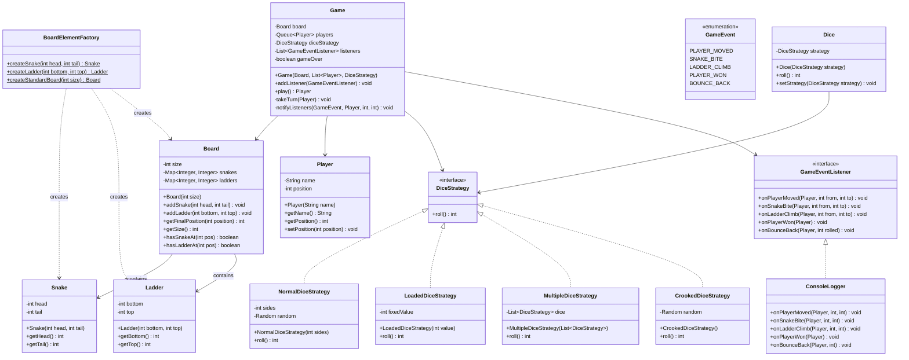

# Design Snake and Ladder Game -- Complete Low-Level Design

A classic Uber India SDE1/SDE2 interview problem. The interviewer expects you to model
the game entities cleanly, demonstrate OOP, apply a few design patterns, and handle
edge cases -- all in 45 minutes on a whiteboard.

> **Interview Insight**: This is NOT about complex algorithms. The interviewer is
> testing your ability to decompose a real-world game into clean classes, apply SOLID
> principles, and write code that is extensible without modification.

---

## 1. Requirements Gathering

### Functional Requirements

| # | Requirement | Notes |
|---|-------------|-------|
| FR1 | Support N players (2+) | Players take turns in order |
| FR2 | Configurable board size | Default 10x10 = 100 cells |
| FR3 | Configurable snakes | Head at higher position, tail at lower |
| FR4 | Configurable ladders | Bottom at lower position, top at higher |
| FR5 | Dice rolling | Standard 6-sided die, extensible to others |
| FR6 | Turn management | Round-robin, skip if stuck (optional) |
| FR7 | Winner detection | First player to reach exactly the final cell wins |
| FR8 | Game events | Notify observers on move, snake bite, ladder climb, win |

### Non-Functional Requirements

| # | Requirement | Notes |
|---|-------------|-------|
| NFR1 | Extensible dice strategies | Normal die, loaded die, multiple dice |
| NFR2 | Extensible board elements | Could add power-ups, traps later |
| NFR3 | Testable | All components independently testable |
| NFR4 | Thread-safe NOT required | Single-threaded turn-based game |

### Clarifying Questions to Ask the Interviewer

1. Can a snake head be at position 100 (final cell)? -- **No, that would make the game unwinnable.**
2. Can a snake and a ladder share the same start position? -- **No, a cell has at most one element.**
3. Does rolling a 6 give an extra turn? -- **Not in the base version; mention it as extensible.**
4. If the dice roll overshoots position 100, does the player stay? -- **Yes, the player does not move.**
5. Can there be cycles (snake drops to a ladder that climbs back)? -- **The board setup should prevent infinite loops.**

---

## 2. Core Entities

| Entity | Responsibility |
|--------|---------------|
| `Game` | Orchestrates the game loop, manages turns, declares winner |
| `Board` | Holds the board configuration: snakes and ladders |
| `Player` | Tracks name and current position |
| `Dice` | Generates a random roll based on the current strategy |
| `Snake` | Represents a snake: head (start) to tail (end) |
| `Ladder` | Represents a ladder: bottom (start) to top (end) |
| `Cell` | (Optional) Represents a position on the board |
| `DiceStrategy` | Strategy interface for different dice behaviors |
| `GameEventListener` | Observer interface for game event notifications |
| `BoardElementFactory` | Factory for creating snakes and ladders |
| `GameEvent` | Enum of event types |

---

## 3. Class Diagram



---

## 4. Design Patterns Applied

### 4.1 Factory Pattern -- BoardElementFactory

**Problem**: Creating snakes, ladders, and pre-configured boards involves validation logic
(e.g., snake head must be above tail, ladder top must be above bottom, positions must be
within board bounds). We do not want this scattered across the codebase.

**Solution**: A `BoardElementFactory` centralizes creation and validation.

```
Client ---> BoardElementFactory.createSnake(head, tail) ---> Snake
Client ---> BoardElementFactory.createLadder(bottom, top) ---> Ladder
Client ---> BoardElementFactory.createStandardBoard(100) ---> Board (pre-configured)
```

**Why Factory here?**
- Validation logic is in one place (single responsibility)
- Easy to add new board elements (power-ups, traps) without changing existing code
- `createStandardBoard()` provides a convenient default setup

**Interview Tip**: Mention that a more advanced version could use Abstract Factory if
you had different board "themes" (e.g., jungle theme with different snake/ladder visuals).

---

### 4.2 Strategy Pattern -- DiceStrategy

**Problem**: The game should support different dice behaviors -- a standard 6-sided die,
a loaded die for testing, multiple dice rolled together, or a crooked die that only
rolls even numbers.

**Solution**: Define a `DiceStrategy` interface and swap implementations at runtime.

```
         +------------------+
         |  DiceStrategy    |
         |  + roll(): int   |
         +--------+---------+
                  |
     +------------+------------+----------------+
     |            |            |                |
 NormalDice  LoadedDice  MultipleDice    CrookedDice
 (1-6 rand)  (fixed)    (sum of N)    (even only)
```

**Why Strategy here?**
- Open/Closed Principle: add new dice types without modifying Game
- Testability: inject `LoadedDiceStrategy` in unit tests for deterministic results
- Runtime flexibility: could switch dice mid-game if rules allow

**Key Insight**: The Game class depends on `DiceStrategy` (abstraction), not on any
concrete dice. This is Dependency Inversion in action.

---

### 4.3 Observer Pattern -- GameEventListener

**Problem**: Multiple components might care about game events -- a console logger, a
GUI updater, an analytics tracker, a sound effects player. The Game should not know
about any of them.

**Solution**: Game maintains a list of `GameEventListener` objects and notifies all
of them when events occur.

```
Game ---notify---> [ConsoleLogger, GUIUpdater, AnalyticsTracker, ...]
        |
        +-- onPlayerMoved(player, from, to)
        +-- onSnakeBite(player, from, to)
        +-- onLadderClimb(player, from, to)
        +-- onPlayerWon(player)
        +-- onBounceBack(player, diceValue)
```

**Why Observer here?**
- Decouples the game engine from presentation / analytics / sound
- Adding a new listener requires zero changes to Game
- Each listener can independently decide how to handle each event

**Interview Tip**: Interviewers love hearing "we can add a GUI listener later without
touching the Game class." That is the textbook Open/Closed Principle.

---

## 5. Game Flow -- Step by Step

```
START
  |
  v
[Initialize Board with snakes and ladders]
  |
  v
[Add players to turn queue]
  |
  v
[LOOP] <---------------------------------------------+
  |                                                    |
  v                                                    |
[Dequeue current player]                               |
  |                                                    |
  v                                                    |
[Roll dice using DiceStrategy]                         |
  |                                                    |
  v                                                    |
[Calculate new position = current + diceValue]         |
  |                                                    |
  v                                                    |
{new position > board size?}                           |
  |YES                    |NO                          |
  v                       v                            |
[Stay at current pos]  [Move to new position]          |
[Notify BOUNCE_BACK]     |                             |
  |                       v                            |
  |                {Snake at new position?}             |
  |                  |YES              |NO             |
  |                  v                 |               |
  |              [Slide down to       |               |
  |               snake tail]         |               |
  |              [Notify SNAKE_BITE]  |               |
  |                  |                |               |
  |                  v                v               |
  |                {Ladder at new position?}           |
  |                  |YES              |NO            |
  |                  v                 |              |
  |              [Climb up to         |              |
  |               ladder top]         |              |
  |              [Notify LADDER_CLIMB]|              |
  |                  |                |              |
  |                  v                v              |
  |              [Notify PLAYER_MOVED]              |
  |                       |                          |
  |                       v                          |
  |              {Position == board size?}            |
  |                |YES            |NO               |
  |                v               v                 |
  |          [Notify PLAYER_WON] [Enqueue player]    |
  |          [Set gameOver=true]   |                 |
  |          [Return winner]       +-----------------+
  |                |
  v                v
[END]           [END]
```

---

## 6. Detailed Design Decisions

### 6.1 Board Representation -- HashMap vs Array

**Decision**: Use `HashMap<Integer, Integer>` for both snakes and ladders.

| Approach | Pros | Cons |
|----------|------|------|
| HashMap  | O(1) lookup, sparse representation, easy to configure | Slightly more memory per entry |
| Array    | O(1) lookup, cache-friendly | Wastes memory for empty cells |

**Choice**: HashMap. The board is sparse -- most cells have no snake or ladder.
A 100-cell board might have only 6 snakes and 6 ladders. HashMap is cleaner.

```
snakes:  {16 -> 6, 47 -> 26, 49 -> 11, 56 -> 53, 62 -> 19, 64 -> 60, 87 -> 24, 93 -> 73, 95 -> 75, 98 -> 78}
ladders: {1 -> 38, 4 -> 14, 9 -> 31, 21 -> 42, 28 -> 84, 36 -> 44, 51 -> 67, 71 -> 91, 80 -> 100}
```

### 6.2 Turn Management -- Queue

**Decision**: Use a `LinkedList<Player>` as a `Queue`. Dequeue the current player,
let them take a turn, and enqueue them at the back (unless they won).

**Why Queue?**
- Natural round-robin ordering
- O(1) dequeue and enqueue
- Easy to add/remove players mid-game if needed

### 6.3 Position Tracking

**Decision**: Each `Player` holds their own `position` (int). Position 0 means "not yet
on the board" and the first roll places them. Position `boardSize` (100) means they won.

### 6.4 Snake/Ladder Collision

**Decision**: After moving, check for snake first, then ladder. In a well-configured
board, a cell cannot have both a snake and a ladder. The factory enforces this.

> **Alternative**: Some implementations check iteratively (a ladder could land on a
> snake, which drops to another ladder). We support this with a loop in
> `Board.getFinalPosition()`.

---

## 7. Edge Cases

### 7.1 Overshoot -- Exact Landing Required

If a player is at position 97 and rolls a 5, new position would be 102. Since
102 > 100, the player stays at 97. This is the standard rule.

```java
int newPosition = currentPosition + diceRoll;
if (newPosition > board.getSize()) {
    // Player stays, notify bounce back
    return;
}
```

### 7.2 Snake at Position 100

The factory must reject a snake with head at position 100 (or whatever `boardSize` is).
If a player could land on 100 and get bitten, they could never win.

```java
if (head == boardSize) {
    throw new IllegalArgumentException("Snake cannot start at the winning position");
}
```

### 7.3 Infinite Loops

A chain like: ladder 5->20, snake 20->5 would create an infinite loop.
The factory or board setup should validate that no cycles exist.

```
Validation: for each snake/ladder chain, follow the path and ensure
it terminates (no cell is visited twice).
```

### 7.4 Multiple Players on Same Cell

Multiple players CAN occupy the same cell. There is no "bumping" in standard
Snake and Ladder. Each player's position is independent.

### 7.5 Single Player Game

While technically possible, the game is meaningless with 1 player. The factory
should enforce a minimum of 2 players.

### 7.6 All Players at Position 0

At the start, all players are at position 0. The first roll places them on the
board. Position 0 is "off the board."

---

## 8. Extensibility Points

| Extension | How to Add | Pattern Used |
|-----------|-----------|--------------|
| Multiple dice | Create `MultipleDiceStrategy` that sums N dice | Strategy |
| Crooked dice (even only) | Create `CrookedDiceStrategy` | Strategy |
| Roll-6-again rule | Modify `Game.takeTurn()` with a loop | Template Method |
| Power-up cells | Add a `PowerUp` class, register in Board | Factory + Board extension |
| GUI rendering | Add a `GUIEventListener` | Observer |
| Analytics / replay | Add an `AnalyticsListener` that records all events | Observer |
| Undo last move | Store move history in Game, add `undo()` | Command |
| Multiplayer over network | Serialize game state, add network layer | - |
| Board themes | Use Abstract Factory for themed boards | Abstract Factory |
| Tournament mode | Wrap Game in a Tournament class | Composite |

---

## 9. SOLID Principles Mapping

| Principle | How It Is Applied |
|-----------|------------------|
| **S** -- Single Responsibility | Board manages board state. Player manages player state. Game orchestrates. Dice rolls. Each class has one reason to change. |
| **O** -- Open/Closed | New dice types via Strategy. New listeners via Observer. New board elements via Factory. No modification to existing classes needed. |
| **L** -- Liskov Substitution | Any DiceStrategy subtype can replace another. Any GameEventListener implementation works without Game knowing the concrete type. |
| **I** -- Interface Segregation | GameEventListener has focused event methods. DiceStrategy has a single `roll()` method. No fat interfaces. |
| **D** -- Dependency Inversion | Game depends on DiceStrategy (abstraction), not NormalDiceStrategy (concrete). Game depends on GameEventListener (abstraction), not ConsoleLogger (concrete). |

---

## 10. Interview Walkthrough Script

**Minute 0-3**: Clarify requirements (ask the 5 questions above).

**Minute 3-8**: List entities (Game, Board, Player, Dice, Snake, Ladder). Draw the
class diagram on the whiteboard.

**Minute 8-12**: Explain the three design patterns:
- Factory for board element creation with validation
- Strategy for dice (show the interface + 2 implementations)
- Observer for game events (show the listener interface)

**Minute 12-15**: Walk through the game flow (roll -> move -> check snake/ladder ->
check winner -> next player).

**Minute 15-18**: Discuss edge cases: overshoot, snake at 100, infinite loops.

**Minute 18-40**: Write the code (Board, Player, DiceStrategy, Game, Main).

**Minute 40-45**: Discuss extensibility (multiple dice, GUI, undo). Mention SOLID.

> **Key Phrase**: "The Game class is the orchestrator. It depends only on abstractions --
> DiceStrategy and GameEventListener -- so we can extend behavior without modifying it."

---

## 11. Complexity Analysis

| Operation | Time | Space |
|-----------|------|-------|
| Roll dice | O(1) for single die, O(k) for k dice | O(1) |
| Move player | O(1) | O(1) |
| Check snake/ladder | O(1) HashMap lookup | O(S + L) for S snakes, L ladders |
| Check winner | O(1) comparison | O(1) |
| Full game turn | O(1) | O(1) |
| Notify listeners | O(M) for M listeners | O(1) per notification |
| Full game | O(T * N * M) for T turns, N players, M listeners | O(N + S + L + M) |

In practice, T is bounded (a 100-cell board game rarely exceeds a few hundred turns),
so the entire game completes in well under a second.

---

## 12. Testing Strategy

### Unit Tests

| Test | What It Validates |
|------|------------------|
| `testNormalDiceRollRange` | Roll is always between 1 and sides (inclusive) |
| `testLoadedDiceAlwaysReturnsFixedValue` | Deterministic for testing |
| `testSnakeMovesPlayerDown` | Player at snake head moves to tail |
| `testLadderMovesPlayerUp` | Player at ladder bottom moves to top |
| `testOvershootKeepsPlayer` | Position 97 + roll 5 = stays at 97 |
| `testExactLandingWins` | Position 94 + roll 6 = 100 = winner |
| `testTurnOrderIsRoundRobin` | Players dequeued and enqueued correctly |
| `testSnakeAtBoardSizeRejected` | Factory throws on invalid snake |
| `testNoCyclesInBoard` | Validation catches ladder->snake->ladder loops |

### Integration Tests

| Test | What It Validates |
|------|------------------|
| `testFullGameWithLoadedDice` | Deterministic game runs to completion |
| `testThreePlayerGame` | All three players take turns, one wins |
| `testObserverReceivesAllEvents` | Mock listener verifies event sequence |

### How to Use LoadedDiceStrategy for Testing

```java
// Sequence of rolls that guarantees player 1 wins
DiceStrategy testDice = new LoadedDiceStrategy(6);
// Player 1 rolls 6 repeatedly: 6, 12, 18, ..., 96, then needs exactly 4
// Use a custom strategy that returns 6 sixteen times, then 4
```

This is precisely why the Strategy pattern exists -- inject a deterministic
dice for repeatable, verifiable tests.
