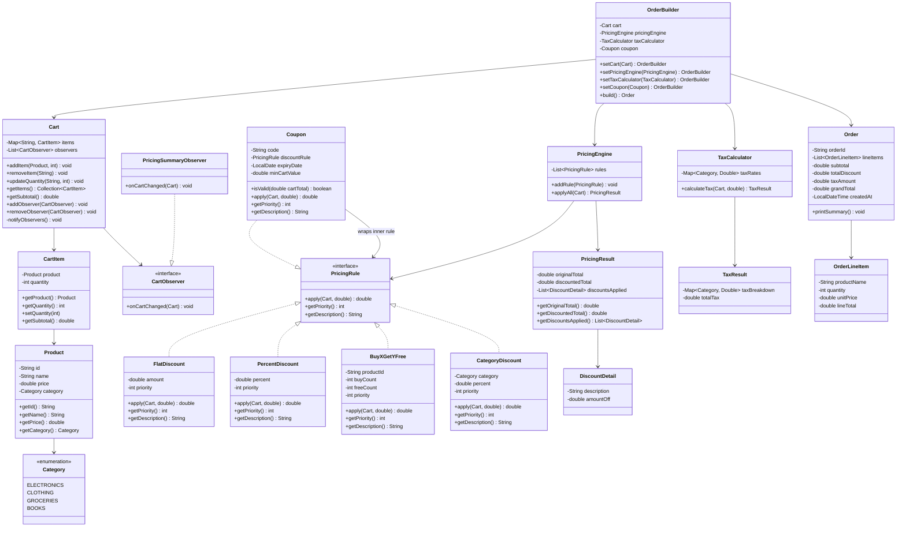

# Low-Level Design: Online Shopping Cart with Pricing Rules

## 1. Problem Statement

Design an online shopping cart system that supports:
- Adding and removing products with quantities
- Multiple pricing rule types (flat discount, percentage discount, buy-X-get-Y-free, category discount)
- Coupon application with validation (expiry date, minimum cart value)
- Tax calculation with configurable rates per category
- Checkout that produces a detailed order with line-item breakdowns
- Rule priority and stacking logic so discounts compose predictably

The design must demonstrate **Strategy**, **Decorator**, **Observer**, and **Builder** patterns.

---

## 2. Requirements

### 2.1 Functional Requirements

| # | Requirement |
|---|-------------|
| FR-1 | Add a product to the cart with a given quantity |
| FR-2 | Remove a product or reduce its quantity |
| FR-3 | View the cart with per-item subtotals |
| FR-4 | Apply a coupon code (validated for expiry and minimum cart value) |
| FR-5 | Calculate the cart total after all pricing rules |
| FR-6 | Support **flat discount** (e.g., $10 off) |
| FR-7 | Support **percentage discount** (e.g., 15% off) |
| FR-8 | Support **buy X get Y free** (e.g., buy 2 get 1 free) |
| FR-9 | Support **category discount** (e.g., 20% off Electronics) |
| FR-10 | Apply tax with configurable per-category rates |
| FR-11 | Checkout: convert cart into an order with full breakdown |
| FR-12 | Multiple discounts can stack; priority determines application order |

### 2.2 Non-Functional Requirements

| # | Requirement |
|---|-------------|
| NFR-1 | Open/Closed Principle -- add new pricing rules without modifying engine |
| NFR-2 | Single Responsibility -- each rule class owns one discount type |
| NFR-3 | Deterministic totals -- same cart + rules always produce the same price |
| NFR-4 | Thread-safe cart modifications (in a concurrent environment) |

---

## 3. Core Entities

### 3.1 Category
Enum representing product categories. Used by `CategoryDiscount` and `TaxCalculator` for targeted logic.

### 3.2 Product
Immutable value object: id, name, base price, category.

### 3.3 CartItem
Mutable association between a `Product` and a quantity inside a cart. Exposes `getSubtotal()` = price x quantity.

### 3.4 Cart
Aggregate root that holds a map of `productId -> CartItem`. Provides `addItem`, `removeItem`, `getItems`, `getSubtotal`. Maintains a list of `CartObserver` listeners and notifies them on every mutation.

### 3.5 PricingRule (abstract / interface)
**Strategy pattern entry point.** Each concrete rule implements `double apply(Cart cart, double runningTotal)` and carries a `priority` (lower number = applied first).

### 3.6 Coupon
A special pricing rule wrapper. Contains code, discount amount/percent, expiry date, and minimum cart value. Validates itself before delegating to its inner discount strategy.

### 3.7 PricingEngine
Accepts a list of `PricingRule` objects, sorts them by priority, and applies them sequentially. The output of one rule becomes the input of the next -- this is the **Decorator-style chaining**.

### 3.8 TaxCalculator
Calculates tax per line item using a configurable `Map<Category, Double>` of tax rates. Applied after all discounts.

### 3.9 Order
Immutable result of checkout. Contains line items, discount breakdown, tax breakdown, and the grand total.

### 3.10 OrderBuilder
**Builder pattern.** Assembles an `Order` step by step: sets cart snapshot, applies discounts via PricingEngine, calculates tax, and builds the final immutable Order.

---

## 4. Design Patterns in Detail

### 4.1 Strategy Pattern -- PricingRule Hierarchy

The Strategy pattern lets us define a family of discount algorithms, encapsulate each one, and make them interchangeable. The `PricingEngine` holds a collection of strategies and does not know (or care) which concrete type it is invoking.

**Participants:**
- **Strategy interface:** `PricingRule` with method `apply(Cart, double) -> double`
- **Concrete strategies:** `FlatDiscount`, `PercentDiscount`, `BuyXGetYFree`, `CategoryDiscount`
- **Context:** `PricingEngine` iterates through strategies in priority order

**Why Strategy?**
Adding a new rule (e.g., "loyalty points discount") requires only a new class implementing `PricingRule`. No changes to `PricingEngine`, `Cart`, or any existing rule.

### 4.2 Decorator Pattern -- Layered Price Computation

Each pricing rule takes a running total and returns a (possibly reduced) total. Rules are chained:

```
basePrice --> CategoryDiscount --> PercentDiscount --> FlatDiscount --> Coupon --> TaxCalculator
```

This is the Decorator concept applied functionally: each layer wraps the previous result, adding its own transformation. The `PricingEngine` orchestrates this pipeline.

**Decorator chain walkthrough:**
1. Start with cart subtotal (sum of price x qty for every item).
2. `CategoryDiscount` (priority 1): reduces price for items in the target category.
3. `PercentDiscount` (priority 2): takes a percentage off the running total.
4. `FlatDiscount` (priority 3): subtracts a fixed amount from the running total.
5. `Coupon` (priority 4): applies coupon discount after validation.
6. `TaxCalculator`: adds tax on the post-discount total.

The running total flows through each decorator, and each one only modifies its own concern.

### 4.3 Observer Pattern -- Cart Change Notifications

When the cart contents change (item added, removed, quantity updated), interested parties need to react -- for example, recalculating suggested discounts or updating a UI counter.

**Participants:**
- **Subject:** `Cart` maintains a `List<CartObserver>`
- **Observer interface:** `CartObserver` with `onCartChanged(Cart cart)`
- **Concrete observers:** `PricingSummaryObserver` (recalculates totals), `InventoryObserver` (checks stock)

### 4.4 Builder Pattern -- OrderBuilder

Constructing an `Order` involves multiple steps that must happen in sequence (snapshot cart, apply discounts, compute tax, assemble line items). The Builder pattern lets us separate this construction logic from the `Order` representation.

**Builder steps:**
1. `setCart(cart)` -- snapshot current cart items
2. `applyDiscounts(pricingEngine)` -- run all pricing rules
3. `applyTax(taxCalculator)` -- compute per-category tax
4. `build()` -- return immutable `Order`

---

## 5. Class Diagram



---

## 6. Rule Priority and Stacking Logic

### 6.1 Priority System

Each `PricingRule` returns a `priority` integer. Lower numbers are applied first. This establishes a deterministic order:

| Priority | Rule Type | Rationale |
|----------|-----------|-----------|
| 1 | CategoryDiscount | Narrows discount to specific items first |
| 2 | BuyXGetYFree | Adjusts effective quantities before percentage math |
| 3 | PercentDiscount | Percentage off the already-reduced total |
| 4 | FlatDiscount | Fixed amount subtracted from remaining total |
| 5 | Coupon | Customer-facing promotional code, applied last |

### 6.2 Stacking Rules

1. **Sequential application:** Each rule receives the running total output by the previous rule, not the original subtotal. This means discounts compound.
2. **Floor at zero:** No rule may produce a negative total. If a discount exceeds the remaining total, the total becomes 0.00.
3. **Category discounts are item-level:** `CategoryDiscount` computes the saving for matching items and subtracts it from the running total. All other rules operate on the aggregate total.
4. **BuyXGetYFree is item-level:** It identifies the cheapest qualifying items and removes their price from the running total.
5. **Coupon validation:** A coupon checks `minCartValue` against the original subtotal (before discounts), not the running total.

### 6.3 Example Walkthrough

Cart contents:
- Laptop (Electronics): $1000 x 1
- T-Shirt (Clothing): $50 x 3

Rules applied:
1. **CategoryDiscount** (10% off Electronics, priority 1): saves $100 on Laptop. Running total: $1150 -> $1050.
2. **BuyXGetYFree** (buy 2 get 1 free on T-Shirt, priority 2): saves $50 (cheapest free). Running total: $1050 -> $1000.
3. **PercentDiscount** (5% off everything, priority 3): saves $50. Running total: $1000 -> $950.
4. **FlatDiscount** ($20 off, priority 4): saves $20. Running total: $950 -> $930.
5. **Coupon** (extra $30 off, min cart $200, priority 5): valid ($1150 >= $200), saves $30. Running total: $930 -> $900.

Tax (8% on Electronics, 5% on Clothing):
- Electronics tax: ($1000 - $100) * 0.08 = $72.00
- Clothing tax: ($150 - $50) * 0.05 = $5.00
- Total tax: $77.00

**Grand total: $900.00 + $77.00 = $977.00**

---

## 7. Key Flows

### 7.1 Add Item to Cart

```
User -> Cart.addItem(product, qty)
  Cart -> checks if product already in items map
    Yes -> increment quantity
    No  -> create new CartItem, put into map
  Cart -> notifyObservers()
    -> PricingSummaryObserver.onCartChanged(cart)
       -> recalculates and logs running total
```

### 7.2 Apply Discounts and Checkout

```
User -> OrderBuilder.setCart(cart)
     -> OrderBuilder.setPricingEngine(engine)
     -> OrderBuilder.setTaxCalculator(taxCalc)
     -> OrderBuilder.setCoupon(coupon)       [optional]
     -> OrderBuilder.build()

  build():
    1. Snapshot cart items into OrderLineItems
    2. Compute subtotal from cart
    3. If coupon present, add coupon's inner rule to engine
    4. PricingEngine.applyAll(cart) -> PricingResult
       - Sort rules by priority
       - For each rule: runningTotal = rule.apply(cart, runningTotal)
       - Record DiscountDetail for each rule
    5. TaxCalculator.calculateTax(cart, discountedTotal) -> TaxResult
    6. grandTotal = discountedTotal + totalTax
    7. Assemble and return immutable Order
```

### 7.3 Coupon Validation

```
Coupon.apply(cart, runningTotal):
  1. Check expiryDate >= today -> if expired, return runningTotal unchanged
  2. Check cart.getSubtotal() >= minCartValue -> if below, return unchanged
  3. Delegate to inner discountRule.apply(cart, runningTotal)
  4. Ensure result >= 0
  5. Return result
```

---

## 8. Extensibility Points

| Extension | How to Add |
|-----------|------------|
| New discount type (e.g., tiered pricing) | Implement `PricingRule` interface, assign priority |
| New tax jurisdiction | Add entries to `TaxCalculator` rate map |
| Persistence | Serialize `Order` -- it is already immutable |
| Async notifications | Implement `CartObserver` that publishes to a message queue |
| Undo/redo cart changes | Store cart state snapshots via Memento pattern |
| Currency support | Wrap `double` with `Money` value object (recommended for production) |

---

## 9. Edge Cases and Error Handling

| Scenario | Handling |
|----------|----------|
| Discount exceeds cart total | Floor at $0.00 -- never go negative |
| Expired coupon | `Coupon.isValid()` returns false; discount is skipped silently |
| Coupon on empty cart | `minCartValue` check fails; coupon not applied |
| Remove item not in cart | `Cart.removeItem()` is a no-op, logs warning |
| Quantity set to zero | Equivalent to removing the item entirely |
| Duplicate coupon codes | Only one coupon can be set on `OrderBuilder` at a time |
| BuyXGetYFree with insufficient quantity | Rule returns running total unchanged if qty < buyCount + freeCount |
| Unknown category tax rate | Default to 0% tax |

---

## 10. Thread Safety Considerations

- `Cart.items` should be a `ConcurrentHashMap` or access should be synchronized.
- Observer notification should happen outside the lock to avoid deadlocks.
- `Order` is fully immutable once built -- safe to share across threads.
- `PricingRule` implementations are stateless and inherently thread-safe.
- `PricingEngine.applyAll()` creates a local running total, so concurrent calls on different carts are safe.

---

## 11. Testing Strategy

| Test Category | What to Verify |
|---------------|----------------|
| Unit: FlatDiscount | Subtracts exact amount; floors at zero |
| Unit: PercentDiscount | Correct percentage off running total |
| Unit: BuyXGetYFree | Free items deducted; no effect if qty too low |
| Unit: CategoryDiscount | Only matching category items discounted |
| Unit: Coupon | Expired coupon skipped; min-value enforced |
| Integration: PricingEngine | Rules applied in priority order; stacking correct |
| Integration: OrderBuilder | Full checkout produces accurate Order totals |
| Edge: Empty cart checkout | Order with $0.00 totals, no errors |
| Edge: All discounts exceed total | Grand total floors at $0.00 + tax |

---

## 12. Summary

This design separates concerns cleanly:

- **Strategy** keeps each pricing rule self-contained and independently testable.
- **Decorator-style chaining** in `PricingEngine` lets discounts layer without coupling.
- **Observer** decouples cart mutation from side effects.
- **Builder** ensures `Order` construction is step-by-step and the result is immutable.

The priority system makes stacking deterministic, and the coupon validation layer prevents misuse. New discount types can be added without touching any existing class.
