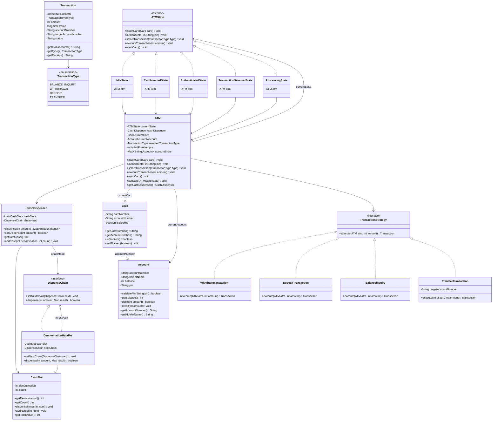
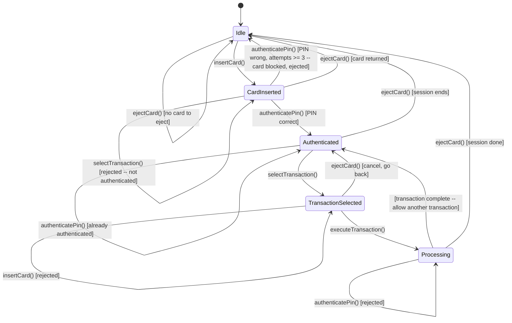

# Design an ATM System -- Low-Level Design Walkthrough

## Table of Contents

1. [Problem Statement](#1-problem-statement)
2. [Requirements](#2-requirements)
3. [Core Entities](#3-core-entities)
4. [Class Diagram](#4-class-diagram)
5. [State Diagram](#5-state-diagram)
6. [The Core Pattern: State](#6-the-core-pattern-state)
7. [Chain of Responsibility: Cash Dispensing](#7-chain-of-responsibility-cash-dispensing)
8. [Strategy Pattern: Transaction Types](#8-strategy-pattern-transaction-types)
9. [Cash Dispensing Algorithm](#9-cash-dispensing-algorithm)
10. [API / Method Contracts](#10-api--method-contracts)
11. [Detailed State Transitions](#11-detailed-state-transitions)
12. [Concurrency and Thread Safety](#12-concurrency-and-thread-safety)
13. [Extension Points](#13-extension-points)
14. [Common Interview Follow-ups](#14-common-interview-follow-ups)

---

## 1. Problem Statement

Design an object-oriented ATM system that allows a user to:
- Insert a bank card and authenticate with a PIN.
- Check account balance.
- Withdraw cash with correct denomination breakdown.
- Deposit cash into the account.
- Transfer funds between accounts.
- Receive a printed receipt for any transaction.

The system must handle incorrect PINs (with a lockout after three failed
attempts), insufficient funds, insufficient cash in the ATM, and invalid
operations in a given state (e.g., trying to withdraw without authenticating
first).

This problem tests two patterns in combination: **State** for the ATM
lifecycle and **Chain of Responsibility** for the denomination-based cash
dispensing. A secondary **Strategy** pattern cleanly separates the different
transaction types.

---

## 2. Requirements

### Functional Requirements

| # | Requirement | Priority |
|---|-------------|----------|
| FR-1 | Accept a bank card and read card number | Must |
| FR-2 | Authenticate the user via 4-digit PIN | Must |
| FR-3 | Lock the account after 3 consecutive failed PIN attempts | Must |
| FR-4 | Display account balance (Balance Inquiry) | Must |
| FR-5 | Withdraw cash in denominations of 2000, 500, 200, 100 | Must |
| FR-6 | Use greedy denomination selection (highest first) | Must |
| FR-7 | Reject withdrawal if amount exceeds account balance | Must |
| FR-8 | Reject withdrawal if ATM does not have enough physical cash | Must |
| FR-9 | Deposit cash into the account | Must |
| FR-10 | Transfer funds from one account to another | Must |
| FR-11 | Print a receipt after each completed transaction | Must |
| FR-12 | Eject the card and return to idle after session ends | Must |
| FR-13 | Allow the user to perform multiple transactions in one session | Should |
| FR-14 | Reject amounts not divisible by the smallest denomination (100) | Must |

### Non-Functional Requirements

| # | Requirement |
|---|-------------|
| NFR-1 | Single-threaded correctness first; thread safety as an extension |
| NFR-2 | Open/Closed Principle -- new transaction types and denominations must not modify existing classes |
| NFR-3 | All monetary values stored as integers to avoid floating-point drift |
| NFR-4 | State transitions must be deterministic and auditable |

---

## 3. Core Entities

### 3.1 Card

Represents a physical bank card. Holds:
- `cardNumber` -- the unique identifier printed on the card.
- `accountNumber` -- links to the underlying bank account.
- `isBlocked` -- whether the card has been locked out.

The card is a passive data carrier. It does not hold a PIN; the PIN lives
in the `Account` for security.

### 3.2 Account

The bank account that holds the customer's money. Has:
- `accountNumber` -- unique identifier.
- `balance` -- current balance in the smallest currency unit (e.g., rupees or cents).
- `pin` -- hashed PIN for verification.
- `holderName` -- name of the account owner.

Provides:
- `validatePin(String pin)` -- returns true if the given PIN matches.
- `getBalance()` -- returns the current balance.
- `debit(int amount)` -- subtracts amount (fails if insufficient funds).
- `credit(int amount)` -- adds amount.

### 3.3 Transaction

Records every completed operation. Fields:
- `transactionId` -- UUID.
- `type` -- enum: BALANCE_INQUIRY, WITHDRAWAL, DEPOSIT, TRANSFER.
- `amount` -- the monetary amount involved (0 for balance inquiries).
- `timestamp` -- when the transaction occurred.
- `accountNumber` -- the primary account.
- `targetAccountNumber` -- for transfers, the recipient account.
- `status` -- SUCCESS or FAILED.

### 3.4 CashDispenser

Manages the physical cash inside the ATM. Internally maintains a chain of
`DispenseChain` handlers, one per denomination. The chain is ordered from
highest denomination to lowest: 2000 -> 500 -> 200 -> 100.

Provides:
- `dispense(int amount)` -- kicks off the chain to break the amount into notes.
- `canDispense(int amount)` -- checks whether the chain can fulfil the amount.
- `getTotalCash()` -- returns the sum of all notes across all denominations.
- `addCash(int denomination, int count)` -- restocks a specific denomination.

### 3.5 CashSlot (Denomination Holder)

A single slot inside the ATM holding notes of one denomination. Fields:
- `denomination` -- face value of the note (2000, 500, 200, 100).
- `count` -- how many notes of this denomination are available.

### 3.6 DispenseChain (Chain of Responsibility Handler)

Each link in the chain is responsible for one denomination. It:
1. Calculates how many notes of its denomination are needed.
2. Caps that at the number of notes actually available.
3. Dispenses those notes and passes the **remainder** to the next handler.
4. If no next handler exists and a remainder is left, the dispense fails.

### 3.7 ATMState (Interface)

The contract for every ATM state. Methods:

| Method | Description |
|--------|-------------|
| `insertCard(Card)` | Handle card insertion |
| `authenticatePin(String pin)` | Handle PIN entry |
| `selectTransaction(TransactionType)` | Handle the user choosing what to do |
| `executeTransaction(int amount)` | Perform the chosen transaction |
| `ejectCard()` | Return the card and end the session |

Each concrete state decides independently whether to carry out the action,
reject it, or trigger a state transition.

### 3.8 ATM (Context)

The central machine. Holds:
- `currentState` -- reference to the active `ATMState` implementation.
- `cashDispenser` -- the `CashDispenser` for physical cash.
- `currentCard` -- the card currently inserted (null when idle).
- `currentAccount` -- the authenticated account (null until PIN verified).
- `selectedTransactionType` -- what the user wants to do.
- `failedPinAttempts` -- counter for PIN lockout logic.
- `accountStore` -- a map of account numbers to `Account` objects (simulating a bank DB).

Exposes `setState(ATMState)` so states can trigger transitions.

---

## 4. Class Diagram



Key relationships:
- `ATM` **delegates** every user action to `currentState`.
- Each concrete state holds a back-reference to the ATM so it can read
  context and call `setState()`.
- `CashDispenser` **composes** a chain of `DenominationHandler` objects
  linked via the Chain of Responsibility pattern.
- `TransactionStrategy` implementations are selected at runtime based on
  the `TransactionType` the user picks.

---

## 5. State Diagram



The machine starts in **Idle**. The only way out of Idle is to insert a card.
After authentication the user can perform multiple transactions in one session.
Each completed transaction returns to the **Authenticated** state so the user
can choose another operation or eject the card.

---

## 6. The Core Pattern: State

### Why State Pattern?

Without the State pattern the ATM class would be riddled with conditionals:

```
if (state == IDLE) {
    // reject everything except insertCard
} else if (state == CARD_INSERTED) {
    // only allow PIN entry or eject
} else if (state == AUTHENTICATED) {
    ...
```

Every new state (e.g., "OutOfService", "LowCash") means editing every method.
The State pattern fixes this:

1. **Open/Closed Principle** -- adding a new state is adding a class, not
   editing existing ones.
2. **Single Responsibility** -- each state class owns exactly the behaviour
   for that phase of the ATM lifecycle.
3. **Testability** -- each state can be unit-tested in isolation by mocking
   the ATM context.

### How It Works Here

```
User enters PIN  --->  ATM.authenticatePin("1234")
                            |
                            v
                       currentState.authenticatePin("1234")
                            |
                +-----------+-----------+
                |                       |
          IdleState              CardInsertedState
      "No card inserted.       Validates PIN against account.
       Insert card first."     If OK --> setState(AuthenticatedState)
                               If wrong --> increment attempts
                               If attempts >= 3 --> block card, eject
```

### State Transition Table

| Current State | Action | Guard Condition | Next State |
|---------------|--------|-----------------|------------|
| Idle | insertCard | card not blocked | CardInserted |
| Idle | insertCard | card is blocked | Idle (rejected) |
| Idle | any other action | -- | Idle (rejected) |
| CardInserted | authenticatePin | PIN correct | Authenticated |
| CardInserted | authenticatePin | PIN wrong, attempts < 3 | CardInserted |
| CardInserted | authenticatePin | PIN wrong, attempts >= 3 | Idle (card blocked + ejected) |
| CardInserted | ejectCard | -- | Idle |
| CardInserted | any other action | -- | CardInserted (rejected) |
| Authenticated | selectTransaction | -- | TransactionSelected |
| Authenticated | ejectCard | -- | Idle |
| Authenticated | any other action | -- | Authenticated (rejected) |
| TransactionSelected | executeTransaction | -- | Processing |
| TransactionSelected | ejectCard | -- | Authenticated (cancel selection) |
| Processing | (transaction completes) | -- | Authenticated |
| Processing | ejectCard | -- | Idle (end session) |
| Processing | any other action | -- | Processing (rejected) |

---

## 7. Chain of Responsibility: Cash Dispensing

### The Problem

When a user withdraws 4700, the ATM must break it down into physical notes:
2x2000 + 1x500 + 1x200. But the breakdown depends on what notes are actually
available in the machine. If the ATM is out of 2000-notes, it falls back to
500s, and so on.

### Why Chain of Responsibility?

A naive approach uses nested if-else blocks for each denomination. Adding a new
denomination (say 50-rupee notes) means editing the dispensing logic everywhere.

Chain of Responsibility makes each denomination a self-contained handler:
1. Each handler knows its own denomination and note count.
2. Each handler dispenses as many of its notes as possible.
3. Each handler passes the **remainder** to the next handler in the chain.
4. If the chain ends with a non-zero remainder, the dispense fails.

Adding a new denomination is adding a handler and inserting it into the chain.
Zero changes to existing handlers.

### Chain Structure

```
[2000-handler] ---> [500-handler] ---> [200-handler] ---> [100-handler] ---> null

Amount: 4700

Step 1: 2000-handler
  - needed = 4700 / 2000 = 2
  - available = 5 (enough)
  - dispense 2 notes of 2000
  - remainder = 4700 - 4000 = 700
  - pass 700 to next

Step 2: 500-handler
  - needed = 700 / 500 = 1
  - available = 10 (enough)
  - dispense 1 note of 500
  - remainder = 700 - 500 = 200
  - pass 200 to next

Step 3: 200-handler
  - needed = 200 / 200 = 1
  - available = 8 (enough)
  - dispense 1 note of 200
  - remainder = 200 - 200 = 0
  - pass 0 to next (or stop)

Result: {2000: 2, 500: 1, 200: 1}
Total notes: 4
```

### Edge Case: Insufficient Notes

```
Amount: 3000
ATM has: 2000 x 1, 500 x 1, 200 x 2, 100 x 0

Step 1: 2000-handler -> dispense 1, remainder = 1000
Step 2: 500-handler  -> dispense 1, remainder = 500
Step 3: 200-handler  -> dispense 2, remainder = 100
Step 4: 100-handler  -> has 0 notes, remainder = 100
Result: FAIL (remainder > 0). Rollback all dispensed notes.
```

The chain naturally handles the "can we or can't we" question. If the final
remainder is 0, success. Otherwise, no notes leave the machine.

---

## 8. Strategy Pattern: Transaction Types

### Why Strategy?

The ATM supports four operations: balance inquiry, withdrawal, deposit, and
transfer. Each has very different logic. Without Strategy, the `ProcessingState`
would contain a large switch statement:

```
switch (type) {
    case WITHDRAWAL: // 30 lines of withdrawal logic
    case DEPOSIT:    // 20 lines of deposit logic
    case TRANSFER:   // 25 lines of transfer logic
    ...
}
```

With Strategy, each transaction type is its own class implementing
`TransactionStrategy`. The `ProcessingState` simply calls
`strategy.execute(atm, amount)` and the right logic runs.

### Strategy Selection

A factory maps `TransactionType` to the correct strategy:

```
BALANCE_INQUIRY -> new BalanceInquiry()
WITHDRAWAL      -> new WithdrawTransaction()
DEPOSIT         -> new DepositTransaction()
TRANSFER        -> new TransferTransaction(targetAccountNumber)
```

### Individual Strategies

**BalanceInquiry**: Reads `account.getBalance()`, creates a Transaction
record with amount = 0, prints the balance.

**WithdrawTransaction**:
1. Check `account.getBalance() >= amount`.
2. Check `cashDispenser.canDispense(amount)`.
3. Call `cashDispenser.dispense(amount)` to get the denomination breakdown.
4. Call `account.debit(amount)`.
5. Create a Transaction record.
6. Print the denomination breakdown.

**DepositTransaction**:
1. Call `account.credit(amount)`.
2. Update ATM cash reserves.
3. Create a Transaction record.

**TransferTransaction**:
1. Check `account.getBalance() >= amount`.
2. Look up the target account.
3. Call `account.debit(amount)`.
4. Call `targetAccount.credit(amount)`.
5. Create a Transaction record.

---

## 9. Cash Dispensing Algorithm

The dispenser uses a **greedy** algorithm: always try the largest denomination
first, then fall back to smaller ones. This minimises the total number of
notes dispensed.

### Pseudocode

```
function dispense(amount):
    result = empty map
    remainder = amount

    for each handler in chain (2000, 500, 200, 100):
        if remainder <= 0:
            break
        notesNeeded = remainder / handler.denomination
        notesAvailable = handler.cashSlot.count
        notesToDispense = min(notesNeeded, notesAvailable)

        if notesToDispense > 0:
            result[handler.denomination] = notesToDispense
            remainder -= notesToDispense * handler.denomination

    if remainder > 0:
        return FAILURE  // cannot dispense this amount
    else:
        // commit: actually decrement note counts
        for each (denomination, count) in result:
            cashSlot[denomination].dispenseNotes(count)
        return result
```

### Why Two-Phase (Check Then Commit)?

The `canDispense()` method does a dry run without modifying note counts.
Only after confirming feasibility does `dispense()` actually decrement
the counts. This prevents partial dispensing on failure.

### Denomination Table

| Denomination | Typical ATM Load | Notes |
|-------------|------------------|-------|
| 2000 | 50 notes | High value, dispensed first |
| 500 | 100 notes | Most commonly dispensed |
| 200 | 80 notes | Bridges gaps left by 500s |
| 100 | 100 notes | Smallest unit, handles remainders |

The smallest denomination (100) determines the minimum withdrawal unit.
Any amount not divisible by 100 is rejected before the chain is invoked.

---

## 10. API / Method Contracts

### ATM (public surface)

| Method | Precondition | Postcondition |
|--------|-------------|---------------|
| `insertCard(Card)` | ATM is idle, card is not blocked | State moves to CardInserted |
| `authenticatePin(String)` | Card is inserted | Account is authenticated or attempts incremented |
| `selectTransaction(TransactionType)` | User is authenticated | State moves to TransactionSelected |
| `executeTransaction(int amount)` | Transaction type is selected | Transaction executes, state returns to Authenticated |
| `ejectCard()` | Card is inserted | Card returned, state goes to Idle |

### CashDispenser

| Method | Precondition | Postcondition |
|--------|-------------|---------------|
| `canDispense(int amount)` | amount > 0 and divisible by 100 | Returns true if chain can fulfil amount |
| `dispense(int amount)` | canDispense(amount) is true | Notes decremented, returns denomination map |
| `getTotalCash()` | -- | Returns total value of all notes in machine |
| `addCash(int denom, int count)` | Valid denomination | Note count for that denomination increases |

### Account

| Method | Precondition | Postcondition |
|--------|-------------|---------------|
| `validatePin(String)` | -- | Returns true if PIN matches |
| `debit(int amount)` | balance >= amount | Balance reduced by amount, returns true |
| `credit(int amount)` | amount > 0 | Balance increased by amount |
| `getBalance()` | -- | Returns current balance |

---

## 11. Detailed State Transitions

### Scenario 1: Happy Path -- Withdrawal

```
1. ATM is in IdleState.
2. User inserts card.                -> state -> CardInsertedState
3. User enters PIN "1234".
   - account.validatePin("1234") -> true
   - failedPinAttempts = 0
   - state -> AuthenticatedState
4. User selects WITHDRAWAL.          -> state -> TransactionSelectedState
5. User enters amount 4700.
   - account.getBalance() = 50000. OK.
   - cashDispenser.canDispense(4700)? Yes.
   - cashDispenser.dispense(4700) -> {2000:2, 500:1, 200:1}
   - account.debit(4700). Balance now 45300.
   - Print receipt:
     "Withdrawal: 4700
      2000 x 2 = 4000
       500 x 1 =  500
       200 x 1 =  200
      Remaining balance: 45300"
   - state -> AuthenticatedState (ready for next transaction)
6. User ejects card.                 -> state -> IdleState
```

### Scenario 2: Wrong PIN with Lockout

```
1. ATM is in IdleState.
2. User inserts card.                -> state -> CardInsertedState
3. User enters PIN "0000".
   - account.validatePin("0000") -> false
   - failedPinAttempts = 1
   - "Incorrect PIN. 2 attempts remaining."
   - state stays CardInsertedState
4. User enters PIN "1111".
   - failedPinAttempts = 2
   - "Incorrect PIN. 1 attempt remaining."
5. User enters PIN "2222".
   - failedPinAttempts = 3
   - "Too many failed attempts. Card has been blocked."
   - card.setBlocked(true)
   - Card ejected.
   - state -> IdleState
```

### Scenario 3: Insufficient Funds

```
1. User authenticated, balance = 3000.
2. User selects WITHDRAWAL, enters 5000.
   - account.getBalance() = 3000 < 5000
   - "Insufficient funds. Available balance: 3000."
   - Transaction not executed.
   - state -> AuthenticatedState
```

### Scenario 4: ATM Cannot Dispense Amount

```
1. User authenticated, balance = 100000.
2. User selects WITHDRAWAL, enters 7300.
   - 7300 % 100 != 0? No, 7300 is divisible by 100.
   - cashDispenser.canDispense(7300)?
     Chain runs: 2000x3=6000, remainder 1300.
     500x2=1000, remainder 300. 200x1=200, remainder 100.
     100x1=100, remainder 0. -> Yes.
   - Dispensed.
3. User selects WITHDRAWAL, enters 350.
   - 350 % 100 != 0. -> "Amount must be a multiple of 100."
   - Rejected immediately.
```

### Scenario 5: Balance Inquiry then Transfer

```
1. User authenticated.
2. User selects BALANCE_INQUIRY.
   - "Your current balance is: 50000"
   - state -> AuthenticatedState
3. User selects TRANSFER, target account "ACC-002", amount 10000.
   - account.getBalance() >= 10000? Yes.
   - targetAccount found? Yes.
   - account.debit(10000). Balance now 40000.
   - targetAccount.credit(10000).
   - "Transferred 10000 to ACC-002. Your balance: 40000."
   - state -> AuthenticatedState
4. User ejects card. -> IdleState
```

---

## 12. Concurrency and Thread Safety

For interview depth, mention these points:

1. **Synchronized state transitions** -- wrap `setState()` and account
   mutations in a `synchronized` block or use `ReentrantLock`. Two threads
   must never see the ATM in an inconsistent state.

2. **Account-level locking** -- when performing transfers, lock both accounts
   in a consistent order (e.g., by account number) to avoid deadlocks.

3. **CashDispenser atomicity** -- the two-phase check-then-commit must be
   atomic. Use a lock so that between `canDispense()` and `dispense()`,
   no other thread can modify note counts.

4. **Card insertion guard** -- only one card can be in the machine at a time.
   The physical slot enforces this, but in code we check `currentCard == null`
   before accepting a new card.

5. **PIN attempt counter** -- must be atomic. Use `AtomicInteger` or synchronize
   the read-check-increment sequence.

In most LLD interviews, mentioning awareness of these issues is sufficient.
Full implementation is rarely expected.

---

## 13. Extension Points

### Add a New Denomination

1. Create a new `CashSlot` with the denomination (e.g., 50).
2. Create a new `DenominationHandler` wrapping that slot.
3. Insert it into the chain at the correct position (after 100).
4. No existing handler is modified.

### Add a New Transaction Type (e.g., Bill Payment)

1. Create `BillPaymentTransaction implements TransactionStrategy`.
2. Add `BILL_PAYMENT` to the `TransactionType` enum.
3. Register it in the strategy factory.
4. No existing strategy or state class is modified.

### Add an OutOfService State

1. Create `OutOfServiceState implements ATMState`.
2. Every method prints "ATM is currently out of service."
3. A maintenance action transitions in and out of this state.
4. No existing state class is modified.

### Add Mini-Statement (Last N Transactions)

1. Maintain a `List<Transaction>` per account.
2. Create a new `MiniStatementTransaction` strategy.
3. It reads the last N transactions and prints them.
4. Hooks into the existing strategy framework.

### Add Card Retention on Fraud Detection

1. In `CardInsertedState`, after blocking the card, instead of ejecting it,
   call a `retainCard()` method that swallows the card.
2. Log the incident for the bank.
3. Transition to a `CardRetainedState` that only allows an admin override.

---

## 14. Common Interview Follow-ups

**Q: Why use Chain of Responsibility instead of a simple loop for dispensing?**
A: A loop works for the basic case, but Chain of Responsibility lets each
denomination handler be a self-contained unit with its own rules. For example,
one handler could enforce a "no more than 10 notes of this type per transaction"
rule without touching any other handler. It also makes it trivial to reorder
or insert new denominations. In an interview, demonstrating the pattern shows
deeper design thinking.

**Q: What if the greedy algorithm fails but a non-greedy solution exists?**
A: Example: withdraw 600 with only 500x1 and 200x2. Greedy picks 500 first,
leaving 100 with no way to make it. A smarter algorithm would pick 200x3.
In practice, ATMs stock denominations that avoid this (100 fills any gap).
If this is a real concern, replace greedy with dynamic programming. The Chain
of Responsibility structure still works -- each handler just needs smarter
logic.

**Q: Who owns the PIN -- the Card or the Account?**
A: The Account. A card is a physical token that identifies which account to
access. The PIN is a secret the bank stores (hashed) alongside the account.
If the card is reissued, the account and PIN remain the same.

**Q: How do you handle the ATM running low on cash?**
A: After each withdrawal, check `cashDispenser.getTotalCash()`. If below a
threshold, transition to a `LowCashState` that still allows balance inquiries
and transfers but rejects withdrawals. Notify the bank for restocking.

**Q: How do you prevent the "time-of-check to time-of-use" bug in withdrawals?**
A: The `canDispense()` and `dispense()` calls must be atomic. In the code, we
use synchronization on the cash dispenser. Alternatively, `dispense()` can be
a single method that both checks and commits, returning a failure code instead
of using a separate check step.

**Q: Can a user do multiple transactions without re-entering the PIN?**
A: Yes. After a transaction completes, the state goes back to `Authenticated`,
not `Idle`. The user can select another transaction or eject the card. This
matches real-world ATM behaviour.

**Q: What SOLID principles are at play?**
A:
- **S** -- Each state class has one responsibility: behaviour for that ATM phase.
  Each strategy class has one responsibility: logic for that transaction type.
  Each chain handler has one responsibility: dispensing its denomination.
- **O** -- New states, strategies, and denominations are added without modifying
  existing classes.
- **L** -- Any `ATMState` implementation can be substituted through the interface.
- **I** -- `ATMState` has 5 focused methods. `DispenseChain` has 2.
  `TransactionStrategy` has 1.
- **D** -- `ATM` depends on the `ATMState` abstraction, not on concrete states.
  `CashDispenser` depends on the `DispenseChain` abstraction, not on concrete
  handlers.

**Q: How does this design handle receipt printing?**
A: Each `TransactionStrategy` returns a `Transaction` object. The `Transaction`
has a `getReceipt()` method that formats the details. The ATM calls this after
every successful execution and prints it. The receipt logic lives in the
`Transaction` class, keeping it separate from the state and strategy classes.

---

*This walkthrough covers the design reasoning. See `code.md` for the complete,
compilable Java code.*
