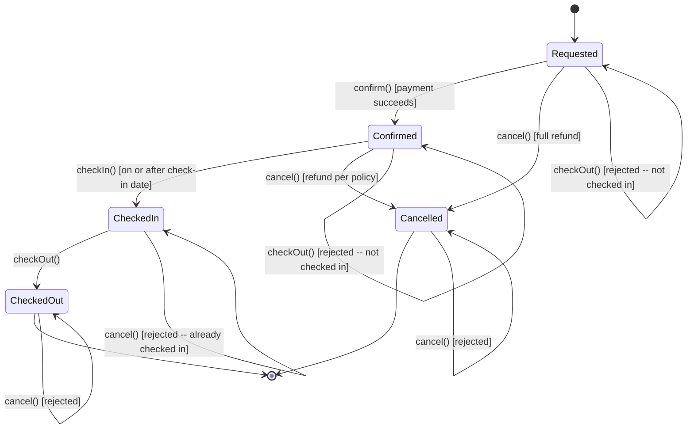

# Design a Hotel Booking System -- Low-Level Design Walkthrough

## Table of Contents

1. [Problem Statement](#1-problem-statement)
2. [Requirements](#2-requirements)
3. [Core Entities](#3-core-entities)
4. [Class Diagram](#4-class-diagram)
5. [State Diagram -- Reservation Lifecycle](#5-state-diagram----reservation-lifecycle)
6. [The Core Patterns](#6-the-core-patterns)
7. [Supporting Patterns](#7-supporting-patterns)
8. [API / Method Contracts](#8-api--method-contracts)
9. [Key Challenge: Availability and Double-Booking Prevention](#9-key-challenge-availability-and-double-booking-prevention)
10. [Detailed Scenarios](#10-detailed-scenarios)
11. [Concurrency and Thread Safety](#11-concurrency-and-thread-safety)
12. [Extension Points](#12-extension-points)
13. [Common Interview Follow-ups](#13-common-interview-follow-ups)

---

## 1. Problem Statement

Design an object-oriented hotel booking system that allows guests to:
- Search for available rooms by date range, room type, and maximum price.
- Book a room for a given date range.
- Check in and check out of a reservation.
- Make a payment for the reservation.
- Cancel a reservation and receive a refund according to a tiered policy.

The system must prevent double-booking (two confirmed reservations for the
same room on overlapping dates) and correctly manage the full reservation
lifecycle from request through check-out or cancellation.

This problem tests two patterns simultaneously. The **State pattern** manages
the reservation lifecycle (REQUESTED, CONFIRMED, CHECKED_IN, CHECKED_OUT,
CANCELLED), while the **Strategy pattern** enables swappable pricing
algorithms (weekday, weekend, seasonal, dynamic).

---

## 2. Requirements

### Functional Requirements

| # | Requirement | Priority |
|---|-------------|----------|
| FR-1 | Search available rooms by date range, room type, and maximum price | Must |
| FR-2 | Check real-time availability of a specific room for a date range | Must |
| FR-3 | Create a reservation for a guest, room, and date range | Must |
| FR-4 | Confirm a reservation after payment is processed | Must |
| FR-5 | Check in a guest (only on or after the check-in date) | Must |
| FR-6 | Check out a guest (only on or after the check-in date) | Must |
| FR-7 | Cancel a reservation with tiered refund policy | Must |
| FR-8 | Calculate room price using configurable pricing strategies | Must |
| FR-9 | Prevent double-booking of the same room for overlapping dates | Must |
| FR-10 | Notify relevant parties on booking, cancellation, and check-in events | Should |

### Non-Functional Requirements

| # | Requirement |
|---|-------------|
| NFR-1 | Single-threaded correctness first; thread safety as an extension |
| NFR-2 | Open/Closed Principle -- new room types, pricing strategies, and states added without modifying existing code |
| NFR-3 | All monetary values stored as integers (cents) to avoid floating-point drift |
| NFR-4 | Date range overlap detection must be O(n) per room at worst, with indexing as an optimisation |

### Cancellation Refund Policy

| Window | Refund |
|--------|--------|
| More than 48 hours before check-in | 100% refund |
| 24 to 48 hours before check-in | 50% refund |
| Less than 24 hours before check-in | 0% refund |

---

## 3. Core Entities

### 3.1 DateRange

A value object representing a half-open interval `[checkIn, checkOut)`. A
guest checking in on Jan 5 and checking out on Jan 8 occupies the room for
nights of Jan 5, 6, and 7. The check-out date itself is free for a new
guest to check in.

Key method: `overlaps(DateRange other)` returns true if the two ranges share
at least one night. The overlap formula is:
`this.checkIn < other.checkOut && other.checkIn < this.checkOut`

Also provides `getNightCount()` for pricing calculations.

### 3.2 RoomType (Enum)

```
SINGLE  -- one bed, one guest, base price
DOUBLE  -- two beds or one large bed, up to 2 guests
SUITE   -- premium room with separate living area, highest price
```

### 3.3 Room (Abstract Class) and Subclasses

Abstract base class with common fields: `roomId`, `roomNumber`, `roomType`,
`basePricePerNight` (in cents). Concrete subclasses:

- **SingleRoom** -- capacity 1, basic amenities.
- **DoubleRoom** -- capacity 2, includes extra bed or larger bed.
- **SuiteRoom** -- capacity 4, includes living area, minibar, premium amenities.

Each subclass can override `getDescription()` to provide type-specific
details. The Factory pattern creates these based on `RoomType`.

### 3.4 Guest

Represents a hotel guest. Fields: `guestId`, `name`, `email`, `phone`.
Used as the "who" in a reservation.

### 3.5 Reservation

The central entity. Fields:
- `reservationId` -- unique identifier.
- `guest` -- who made the booking.
- `room` -- which room.
- `dateRange` -- when.
- `totalPrice` -- computed at creation time via the pricing strategy.
- `state` -- the current `ReservationState` object.
- `createdAt` -- timestamp for refund calculations.

All user actions (confirm, checkIn, checkOut, cancel) are delegated to
`state`, which decides whether the action is valid and what transition
to make. This is the State pattern in action.

### 3.6 Payment

Represents a payment or refund transaction. Fields: `paymentId`,
`reservationId`, `amount`, `paymentType` (CHARGE or REFUND), `timestamp`.
Kept simple since payment gateway integration is outside LLD scope.

### 3.7 Hotel

The aggregate root. Holds the list of rooms and the list of reservations.
Provides room search and availability checking. Delegates booking logic to
`BookingService`.

### 3.8 BookingService

The main service orchestrating searches, bookings, check-in/check-out, and
cancellations. Coordinates between Hotel, Reservation, PricingStrategy, and
the notification system.

---

## 4. Class Diagram

```mermaid
classDiagram
    direction TB

    class DateRange {
        -LocalDate checkIn
        -LocalDate checkOut
        +overlaps(DateRange other) boolean
        +getNightCount() int
        +getCheckIn() LocalDate
        +getCheckOut() LocalDate
    }

    class RoomType {
        <<enumeration>>
        SINGLE
        DOUBLE
        SUITE
    }

    class Room {
        <<abstract>>
        #String roomId
        #int roomNumber
        #RoomType roomType
        #int basePricePerNight
        +getRoomId() String
        +getRoomNumber() int
        +getRoomType() RoomType
        +getBasePricePerNight() int
        +getCapacity() int*
        +getDescription() String*
    }

    class SingleRoom {
        +getCapacity() int
        +getDescription() String
    }

    class DoubleRoom {
        +getCapacity() int
        +getDescription() String
    }

    class SuiteRoom {
        +getCapacity() int
        +getDescription() String
    }

    class RoomFactory {
        +createRoom(int roomNumber, RoomType type, int basePrice)$ Room
    }

    class Guest {
        -String guestId
        -String name
        -String email
        -String phone
        +getGuestId() String
        +getName() String
        +getEmail() String
    }

    class ReservationState {
        <<interface>>
        +confirm(Reservation res) void
        +checkIn(Reservation res) void
        +checkOut(Reservation res) void
        +cancel(Reservation res) void
        +getStateName() String
    }

    class RequestedState {
        +confirm(Reservation res) void
        +checkIn(Reservation res) void
        +checkOut(Reservation res) void
        +cancel(Reservation res) void
    }

    class ConfirmedState {
        +confirm(Reservation res) void
        +checkIn(Reservation res) void
        +checkOut(Reservation res) void
        +cancel(Reservation res) void
    }

    class CheckedInState {
        +confirm(Reservation res) void
        +checkIn(Reservation res) void
        +checkOut(Reservation res) void
        +cancel(Reservation res) void
    }

    class CheckedOutState {
        +confirm(Reservation res) void
        +checkIn(Reservation res) void
        +checkOut(Reservation res) void
        +cancel(Reservation res) void
    }

    class CancelledState {
        +confirm(Reservation res) void
        +checkIn(Reservation res) void
        +checkOut(Reservation res) void
        +cancel(Reservation res) void
    }

    class Reservation {
        -String reservationId
        -Guest guest
        -Room room
        -DateRange dateRange
        -int totalPrice
        -ReservationState state
        -LocalDateTime createdAt
        +confirm() void
        +checkIn() void
        +checkOut() void
        +cancel() void
        +setState(ReservationState state) void
        +getState() ReservationState
    }

    class PricingStrategy {
        <<interface>>
        +calculatePrice(Room room, DateRange dateRange) int
    }

    class WeekdayPricingStrategy {
        +calculatePrice(Room room, DateRange dateRange) int
    }

    class WeekendPricingStrategy {
        -double weekendMultiplier
        +calculatePrice(Room room, DateRange dateRange) int
    }

    class SeasonalPricingStrategy {
        -Map~Month, Double~ seasonMultipliers
        +calculatePrice(Room room, DateRange dateRange) int
    }

    class DynamicPricingStrategy {
        -Hotel hotel
        -double highOccupancyThreshold
        +calculatePrice(Room room, DateRange dateRange) int
    }

    class Payment {
        -String paymentId
        -String reservationId
        -int amount
        -PaymentType type
        -LocalDateTime timestamp
    }

    class PaymentType {
        <<enumeration>>
        CHARGE
        REFUND
    }

    class BookingObserver {
        <<interface>>
        +onReservationCreated(Reservation res) void
        +onReservationCancelled(Reservation res) void
        +onGuestCheckedIn(Reservation res) void
        +onGuestCheckedOut(Reservation res) void
    }

    class EmailNotificationObserver {
        +onReservationCreated(Reservation res) void
        +onReservationCancelled(Reservation res) void
        +onGuestCheckedIn(Reservation res) void
        +onGuestCheckedOut(Reservation res) void
    }

    class Hotel {
        -String hotelId
        -String name
        -List~Room~ rooms
        -List~Reservation~ reservations
        +addRoom(Room room) void
        +searchAvailableRooms(DateRange range, RoomType type, int maxPrice) List~Room~
        +isRoomAvailable(Room room, DateRange range) boolean
        +addReservation(Reservation res) void
        +getReservations() List~Reservation~
    }

    class BookingService {
        -Hotel hotel
        -PricingStrategy pricingStrategy
        -List~BookingObserver~ observers
        +searchAvailable(DateRange range, RoomType type, int maxPrice) List~Room~
        +createReservation(Guest guest, Room room, DateRange range) Reservation
        +confirmReservation(String reservationId) void
        +checkIn(String reservationId) void
        +checkOut(String reservationId) void
        +cancelReservation(String reservationId) int
        +addObserver(BookingObserver observer) void
    }

    Room <|-- SingleRoom
    Room <|-- DoubleRoom
    Room <|-- SuiteRoom
    Room --> RoomType

    ReservationState <|.. RequestedState
    ReservationState <|.. ConfirmedState
    ReservationState <|.. CheckedInState
    ReservationState <|.. CheckedOutState
    ReservationState <|.. CancelledState

    PricingStrategy <|.. WeekdayPricingStrategy
    PricingStrategy <|.. WeekendPricingStrategy
    PricingStrategy <|.. SeasonalPricingStrategy
    PricingStrategy <|.. DynamicPricingStrategy

    BookingObserver <|.. EmailNotificationObserver

    Reservation --> Guest
    Reservation --> Room
    Reservation --> DateRange
    Reservation --> ReservationState

    Payment --> PaymentType

    Hotel --> Room
    Hotel --> Reservation

    BookingService --> Hotel
    BookingService --> PricingStrategy
    BookingService --> BookingObserver

    RoomFactory --> Room : creates
```



Key relationships:
- **Reservation** delegates lifecycle actions to its **ReservationState**.
- **BookingService** uses a **PricingStrategy** to compute prices and
  notifies **BookingObserver** instances on key events.
- **Hotel** owns the room inventory and reservation list, providing the
  availability query that underpins double-booking prevention.
- **RoomFactory** creates concrete Room subclasses from a RoomType enum.

---

## 5. State Diagram -- Reservation Lifecycle



The reservation starts in **Requested** when created. Payment confirmation
moves it to **Confirmed**. On the check-in date, front desk moves it to
**CheckedIn**. On departure, **CheckedOut**. Cancellation is possible from
**Requested** (full refund always) or **Confirmed** (tiered refund policy).
Once **CheckedIn**, cancellation is no longer allowed -- the guest is already
using the room.

**CheckedOut** and **Cancelled** are terminal states. No further transitions
are possible.

---

## 6. The Core Patterns

### 6.1 State Pattern -- Reservation Lifecycle

#### Why State Pattern?

Without it, every method on Reservation would contain:

```
if (status == REQUESTED) { ... }
else if (status == CONFIRMED) { ... }
else if (status == CHECKED_IN) { ... }
// ...
```

This creates the same problems as always:
1. **Violates Open/Closed** -- adding a "WAITLISTED" state means editing
   every method.
2. **Shotgun surgery** -- changing check-in rules requires finding and
   updating the CONFIRMED branch in multiple methods.
3. **Hard to test** -- cannot unit-test the rules for one state without
   constructing the entire switch logic.

#### How It Works Here

```
Front desk calls  --->  reservation.checkIn()
                              |
                              v
                        state.checkIn(reservation)
                              |
                  +-----------+-----------+
                  |                       |
           RequestedState          ConfirmedState
        "Cannot check in.        Validates date.
         Not yet confirmed."     If OK --> setState(CheckedInState)
                                 If early --> "Too early to check in."
```

Each state is a self-contained unit:

- **RequestedState**: Only `confirm()` and `cancel()` are meaningful.
  `confirm()` transitions to `ConfirmedState`. `cancel()` transitions to
  `CancelledState` with full refund. Check-in and check-out are rejected.
- **ConfirmedState**: `checkIn()` validates the date and transitions to
  `CheckedInState`. `cancel()` calculates the tiered refund and transitions
  to `CancelledState`. Re-confirmation and check-out are rejected.
- **CheckedInState**: Only `checkOut()` is valid, transitioning to
  `CheckedOutState`. Everything else is rejected.
- **CheckedOutState**: Terminal state. All actions rejected.
- **CancelledState**: Terminal state. All actions rejected.

#### State Transition Table

| Current State | Action | Guard Condition | Next State |
|---------------|--------|-----------------|------------|
| Requested | confirm | payment processed | Confirmed |
| Requested | cancel | -- | Cancelled (full refund) |
| Requested | checkIn | -- | Requested (rejected) |
| Requested | checkOut | -- | Requested (rejected) |
| Confirmed | checkIn | current date >= check-in date | CheckedIn |
| Confirmed | checkIn | current date < check-in date | Confirmed (rejected) |
| Confirmed | cancel | -- | Cancelled (tiered refund) |
| Confirmed | confirm | -- | Confirmed (rejected) |
| Confirmed | checkOut | -- | Confirmed (rejected) |
| CheckedIn | checkOut | -- | CheckedOut |
| CheckedIn | cancel | -- | CheckedIn (rejected) |
| CheckedIn | confirm | -- | CheckedIn (rejected) |
| CheckedIn | checkIn | -- | CheckedIn (rejected) |
| CheckedOut | * | -- | CheckedOut (rejected) |
| Cancelled | * | -- | Cancelled (rejected) |

### 6.2 Strategy Pattern -- Pricing

#### Why Strategy Pattern?

Hotels change their pricing algorithm frequently: weekday rates differ from
weekends, holidays carry surcharges, and dynamic pricing adjusts to
occupancy. Hard-coding any single algorithm means rewriting the booking
service whenever the business changes pricing rules.

The Strategy pattern externalises the algorithm behind a `PricingStrategy`
interface. The `BookingService` holds a reference to the active strategy
and calls `calculatePrice(room, dateRange)` at reservation time.

#### Implementations

| Strategy | Logic |
|----------|-------|
| WeekdayPricingStrategy | `basePricePerNight * nightCount` -- flat rate |
| WeekendPricingStrategy | Applies a multiplier (e.g., 1.25x) to Friday and Saturday nights, base rate for others |
| SeasonalPricingStrategy | Applies per-month multipliers (e.g., 1.5x in December, 0.8x in February) summed per night |
| DynamicPricingStrategy | Checks hotel occupancy for the date range; if above a threshold, applies a surge multiplier |

Switching from weekday to seasonal pricing is a single setter call:
`bookingService.setPricingStrategy(new SeasonalPricingStrategy(multipliers))`.
No existing code is modified.

---

## 7. Supporting Patterns

### 7.1 Observer Pattern -- Notifications

When a reservation is created, cancelled, or a guest checks in/out, various
systems need to react: send a confirmation email, update housekeeping, notify
the front desk, log analytics.

Define a `BookingObserver` interface:

```
BookingObserver
  + onReservationCreated(Reservation) : void
  + onReservationCancelled(Reservation) : void
  + onGuestCheckedIn(Reservation) : void
  + onGuestCheckedOut(Reservation) : void
```

Implementations:
- **EmailNotificationObserver** -- sends confirmation/cancellation emails.
- **HousekeepingObserver** -- triggers room cleaning on check-out.
- **AnalyticsObserver** -- logs events for business intelligence.

The `BookingService` maintains a list of observers and notifies them at the
appropriate points. Adding a new notification channel is one new class and
one `addObserver()` call. Zero changes to existing code.

### 7.2 Factory Pattern -- Room Creation

`RoomFactory.createRoom(roomNumber, type, basePrice)` returns the correct
Room subclass based on the `RoomType` enum. This centralises room
construction logic so that the hotel setup code does not need to know
about `SingleRoom`, `DoubleRoom`, or `SuiteRoom` directly.

When a new room type is added (e.g., `PENTHOUSE`), only the factory and
a new subclass are needed.

---

## 8. API / Method Contracts

### BookingService (public surface)

| Method | Precondition | Postcondition |
|--------|-------------|---------------|
| `searchAvailable(DateRange, RoomType, int maxPrice)` | Valid date range, type can be null (all types) | Returns list of rooms matching criteria with no conflicting reservations |
| `createReservation(Guest, Room, DateRange)` | Room is available for the date range | Reservation created in REQUESTED state, price calculated, observers notified |
| `confirmReservation(reservationId)` | Reservation exists and is in REQUESTED state | Payment processed, state moves to CONFIRMED |
| `checkIn(reservationId)` | Reservation exists and is in CONFIRMED state, current date >= check-in date | State moves to CHECKED_IN, observers notified |
| `checkOut(reservationId)` | Reservation exists and is in CHECKED_IN state | State moves to CHECKED_OUT, observers notified |
| `cancelReservation(reservationId)` | Reservation exists and is in REQUESTED or CONFIRMED state | State moves to CANCELLED, refund calculated and returned |

### Hotel

| Method | Precondition | Postcondition |
|--------|-------------|---------------|
| `searchAvailableRooms(DateRange, RoomType, int)` | Valid date range | Returns filtered list of available rooms |
| `isRoomAvailable(Room, DateRange)` | Room belongs to hotel | Returns true if no active reservation overlaps the date range |
| `addReservation(Reservation)` | Room is available (caller must check) | Reservation stored |

### Reservation

| Method | Precondition | Postcondition |
|--------|-------------|---------------|
| `confirm()` | -- | Delegates to state; may transition or reject |
| `checkIn()` | -- | Delegates to state; may transition or reject |
| `checkOut()` | -- | Delegates to state; may transition or reject |
| `cancel()` | -- | Delegates to state; may transition or reject |

---

## 9. Key Challenge: Availability and Double-Booking Prevention

### The Problem

Two guests must never hold confirmed reservations for the same room on
overlapping dates. This is the core invariant of the system.

### The Solution: Date Range Overlap Detection

When checking availability, the system iterates over all **active**
reservations (REQUESTED or CONFIRMED -- not CANCELLED or CHECKED_OUT) for
the given room and checks if any reservation's date range overlaps with the
requested range.

```
isRoomAvailable(room, requestedRange):
    for each reservation in activeReservations:
        if reservation.room == room:
            if reservation.dateRange.overlaps(requestedRange):
                return false
    return true
```

The overlap check uses the half-open interval formula:
`rangeA.checkIn < rangeB.checkOut && rangeB.checkIn < rangeA.checkOut`

### Why Half-Open Intervals?

A guest checking out on Jan 8 frees the room for a new guest checking in
on Jan 8. If we used closed intervals `[Jan 5, Jan 8]`, two adjacent
bookings would appear to conflict on Jan 8. The half-open `[Jan 5, Jan 8)`
convention avoids this naturally.

### Optimisation Notes

For a small hotel (50-200 rooms), iterating all reservations per room is
fast enough. For a large chain with millions of reservations:

1. **Index by room**: maintain a `Map<RoomId, List<Reservation>>` to avoid
   scanning unrelated rooms.
2. **Sort by date**: keep each room's reservation list sorted by check-in
   date, enabling binary search for overlap detection.
3. **Database-level constraint**: in a real system, use a database exclusion
   constraint (e.g., PostgreSQL range types with `EXCLUDE USING gist`)
   combined with transactional isolation.

For an LLD interview, the in-memory linear scan with proper overlap logic
is the expected answer.

---

## 10. Detailed Scenarios

### Scenario 1: Happy Path -- Book, Check In, Check Out

```
1. Guest searches for a Double room, Jan 10-13, max $200/night.
   - Hotel returns Room 201 (Double, $150/night).
2. Guest creates reservation for Room 201, Jan 10-13.
   - Price calculated: 3 nights * $150 = $450.
   - Reservation R-001 created in REQUESTED state.
   - EmailNotificationObserver sends booking request email.
3. Guest confirms reservation (payment processed).
   - State transitions: REQUESTED -> CONFIRMED.
   - Payment record created: $450 CHARGE.
4. Jan 10: Guest checks in.
   - State transitions: CONFIRMED -> CHECKED_IN.
   - EmailNotificationObserver sends check-in confirmation.
5. Jan 13: Guest checks out.
   - State transitions: CHECKED_IN -> CHECKED_OUT.
   - HousekeepingObserver triggers room cleaning.
```

### Scenario 2: Cancellation with Full Refund

```
1. Guest books Room 101 for Jan 20-22. Confirmed. Price: $300.
2. On Jan 15 (5 days = 120 hours before check-in), guest cancels.
   - 120 hours > 48 hours -> 100% refund.
   - Refund amount: $300.
   - Payment record: $300 REFUND.
   - State transitions: CONFIRMED -> CANCELLED.
   - Room 101 is now available for Jan 20-22 again.
```

### Scenario 3: Cancellation with Partial Refund

```
1. Guest books Room 101 for Jan 20-22. Confirmed. Price: $300.
2. On Jan 18 at 6 PM (30 hours before check-in), guest cancels.
   - 30 hours is between 24 and 48 hours -> 50% refund.
   - Refund amount: $150.
   - Payment record: $150 REFUND.
   - State transitions: CONFIRMED -> CANCELLED.
```

### Scenario 4: Late Cancellation -- No Refund

```
1. Guest books Room 101 for Jan 20-22. Confirmed. Price: $300.
2. On Jan 19 at 6 PM (6 hours before check-in), guest cancels.
   - 6 hours < 24 hours -> 0% refund.
   - Refund amount: $0.
   - State transitions: CONFIRMED -> CANCELLED.
```

### Scenario 5: Double-Booking Prevention

```
1. Guest A books Room 101 for Jan 10-15. Confirmed.
2. Guest B searches for rooms Jan 12-14.
   - Room 101 is NOT returned -- overlaps with Guest A's reservation.
3. Guest B searches for rooms Jan 15-18.
   - Room 101 IS returned -- Jan 15 check-in does not overlap with
     Guest A's [Jan 10, Jan 15) range.
4. Guest B books Room 101 for Jan 15-18. Confirmed.
```

### Scenario 6: Invalid State Transitions

```
1. Guest books Room 101. Reservation in REQUESTED state.
2. Guest tries to check in.
   - REJECTED: "Cannot check in. Reservation is not confirmed."
3. Guest confirms reservation. State -> CONFIRMED.
4. Guest tries to confirm again.
   - REJECTED: "Reservation is already confirmed."
5. Guest checks in. State -> CHECKED_IN.
6. Guest tries to cancel.
   - REJECTED: "Cannot cancel. Guest has already checked in."
```

---

## 11. Concurrency and Thread Safety

For interview depth, mention these points:

1. **Synchronised availability check + reservation creation** -- the
   "check-then-act" on room availability must be atomic. Without
   synchronisation, two threads could both see a room as available and
   create conflicting reservations. Use `synchronized(room)` or a
   `ReentrantLock` per room.

2. **Reservation state transitions** -- each `setState()` call should be
   synchronised on the reservation to prevent concurrent confirm and cancel
   operations from corrupting the state.

3. **Read-heavy optimisation** -- availability searches are far more
   frequent than bookings. A `ReadWriteLock` allows concurrent searches
   while exclusive-locking for reservation creation.

4. **Database-level locking** -- in a production system, optimistic locking
   with version columns or pessimistic row-level locks (SELECT FOR UPDATE)
   prevent double-booking at the persistence layer.

In most LLD interviews, mentioning awareness of the check-then-act race
condition and proposing synchronisation at the room level is sufficient.

---

## 12. Extension Points

### Add a New Room Type (e.g., Penthouse)

1. Create `PenthouseRoom extends Room`.
2. Add `PENTHOUSE` to `RoomType` enum.
3. Update `RoomFactory` to handle the new type.
4. No changes to Reservation, BookingService, or any State class.

### Add a New Pricing Strategy (e.g., Loyalty Discount)

1. Create `LoyaltyPricingStrategy implements PricingStrategy`.
2. Apply a percentage discount based on the guest's booking history.
3. Set it on the BookingService: `service.setPricingStrategy(new LoyaltyPricingStrategy(...))`.
4. No changes to any existing strategy or service code.

### Add a Waitlisted State

1. Create `WaitlistedState implements ReservationState`.
2. When a room is fully booked, create the reservation in WAITLISTED state.
3. On cancellation of an existing booking, promote the waitlisted
   reservation to REQUESTED.
4. No existing state classes are modified.

### Add a New Notification Channel (e.g., SMS)

1. Create `SmsNotificationObserver implements BookingObserver`.
2. Register it: `bookingService.addObserver(new SmsNotificationObserver())`.
3. No changes to BookingService or existing observers.

### Add Group Booking

1. Allow a reservation to hold multiple rooms.
2. Change `Reservation.room` to `List<Room>`.
3. Availability check iterates over all rooms in the group.
4. Pricing sums across all rooms.

---

## 13. Common Interview Follow-ups

**Q: Why use the State pattern instead of a status enum with if-else?**
A: The State pattern encapsulates the rules for each lifecycle stage in its
own class. Adding a new state (e.g., WAITLISTED) means adding one class,
not editing every method. Each state can be unit-tested independently. It
also eliminates the risk of forgetting to handle a state in one of the
methods -- the compiler enforces that every state implements every action.

**Q: How do you prevent a race condition on booking?**
A: The availability check and reservation creation must be atomic. In memory,
synchronise on the room object. In a database, use SELECT FOR UPDATE or
an exclusion constraint on the room_id + date_range columns. The key insight
is that "check then act" must be a single critical section.

**Q: Why Strategy for pricing and not just a method parameter?**
A: Pricing rules are complex and change independently of booking logic.
A Strategy object can be configured, composed (e.g., a composite strategy
that applies seasonal + dynamic), and swapped at runtime. A method parameter
would force the caller to know the algorithm, violating separation of
concerns.

**Q: How does the cancellation refund work?**
A: The `CancellationPolicy` calculates hours remaining until check-in. More
than 48 hours gets 100%, 24--48 hours gets 50%, under 24 hours gets 0%.
This is computed at cancellation time, not at booking time, so the refund
is always based on the actual cancellation moment.

**Q: What happens if a guest does not show up?**
A: This is a "no-show" scenario. A scheduled job could run after check-in
date + a grace period (e.g., 24 hours). If the reservation is still in
CONFIRMED state, transition it to a NO_SHOW state (an extension of the
current state machine) and apply the no-show penalty (typically no refund).

**Q: Can you compose multiple pricing strategies?**
A: Yes. Create a `CompositePricingStrategy` that holds a list of strategies
and applies them in sequence (e.g., first calculate the seasonal base, then
apply a dynamic surge on top). This follows the Composite + Strategy
combination.

**Q: What are the SOLID principles at play?**
A:
- **S** -- Each state class handles rules for one lifecycle stage. Each
  pricing strategy handles one algorithm.
- **O** -- New states, strategies, room types, and observers are added
  without modifying existing classes.
- **L** -- Any ReservationState or PricingStrategy implementation can be
  substituted through the interface.
- **I** -- Interfaces are focused: ReservationState has 4 methods,
  PricingStrategy has 1, BookingObserver has 4.
- **D** -- BookingService depends on PricingStrategy and BookingObserver
  abstractions, not concrete implementations.

---

*This walkthrough covers the design reasoning. See `code.md` for the
complete, compilable Java code.*
