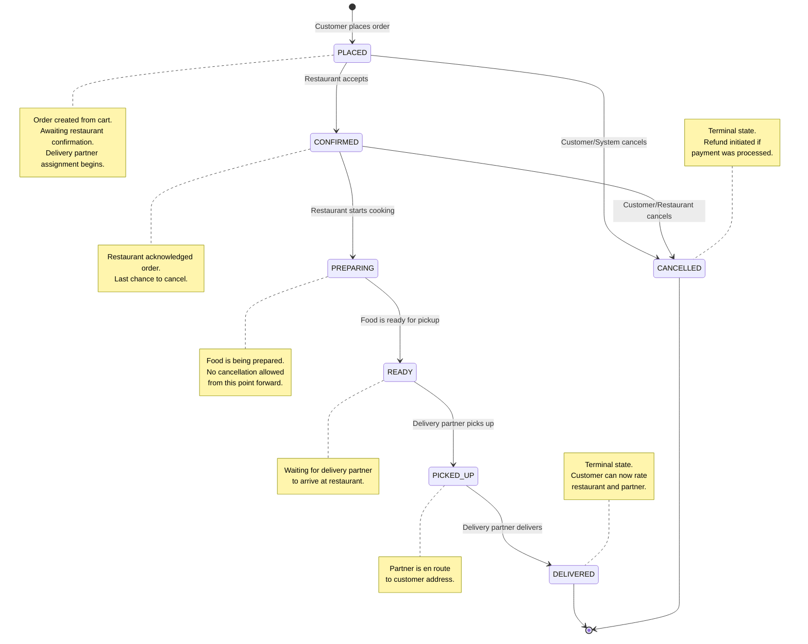

# Low-Level Design: Food Ordering System (Uber Eats)

## Table of Contents

1. [Problem Statement](#1-problem-statement)
2. [Requirements](#2-requirements)
3. [Entity Identification](#3-entity-identification)
4. [Class Diagram](#4-class-diagram)
5. [State Diagram: Order Lifecycle](#5-state-diagram-order-lifecycle)
6. [Design Patterns](#6-design-patterns)
7. [Design Decisions and Rationale](#7-design-decisions-and-rationale)
8. [Core Algorithms](#8-core-algorithms)
9. [Flow Walkthroughs](#9-flow-walkthroughs)
10. [Concurrency Considerations](#10-concurrency-considerations)
11. [Extension Handling](#11-extension-handling)
12. [Summary](#12-summary)

---

## 1. Problem Statement

Design an object-oriented system for a food ordering and delivery platform similar to
Uber Eats. The system must support customers browsing restaurants, viewing menus, adding
items to a cart, placing orders, assigning delivery partners, tracking order status
through its full lifecycle, and rating restaurants and delivery partners after completion.

This is a classic LLD interview problem -- especially relevant at Uber -- that tests
your ability to:
- Model a multi-actor domain (customer, restaurant, delivery partner)
- Design a complex state machine for order lifecycle management
- Apply the Strategy pattern for interchangeable delivery assignment algorithms
- Implement the Observer pattern for real-time notifications to all parties
- Use the Builder pattern to construct complex Order objects from cart contents
- Handle concurrency for delivery partner assignment (race conditions)

---

## 2. Requirements

### 2.1 Functional Requirements

| # | Requirement | Priority |
|---|-------------|----------|
| FR-1 | Customers can browse a catalog of restaurants | Must |
| FR-2 | Each restaurant has a menu with categorized items, prices, and availability | Must |
| FR-3 | Customers can add/remove items to/from a shopping cart | Must |
| FR-4 | A cart is associated with exactly one restaurant (single-restaurant ordering) | Must |
| FR-5 | Customer can place an order from the cart contents | Must |
| FR-6 | System assigns an available delivery partner to each order | Must |
| FR-7 | Order progresses through states: PLACED -> CONFIRMED -> PREPARING -> READY -> PICKED_UP -> DELIVERED | Must |
| FR-8 | An order can be CANCELLED from PLACED or CONFIRMED state only | Must |
| FR-9 | All parties (customer, restaurant, delivery partner) receive notifications on status changes | Must |
| FR-10 | Customer can track the current status of their order | Must |
| FR-11 | Customer can rate the restaurant (1-5 stars) after delivery | Should |
| FR-12 | Customer can rate the delivery partner (1-5 stars) after delivery | Should |
| FR-13 | Delivery partner can accept or reject an assignment | Should |
| FR-14 | System supports multiple delivery assignment strategies | Should |
| FR-15 | Order contains itemized breakdown with subtotal, delivery fee, and tax | Should |

### 2.2 Non-Functional Requirements

- The design must be extensible: adding new delivery assignment strategies, payment
  methods, or promotion systems should not require rewriting core classes.
- Order state transitions must be deterministic and validated -- illegal transitions
  must be rejected.
- The system should follow SOLID principles throughout.
- Delivery partner assignment must handle concurrent requests safely.
- Notification delivery should not block the order processing pipeline.

---

## 3. Entity Identification

Working through the problem domain, we identify these core entities:

### 3.1 Core Entities

| Entity | Responsibility |
|--------|---------------|
| **Customer** | Registered user who browses restaurants, places orders, and rates services |
| **Restaurant** | A food establishment with a menu; accepts/prepares orders |
| **Menu** | Collection of MenuItems belonging to a restaurant, organized by category |
| **MenuItem** | A single dish or item with name, description, price, category, and availability flag |
| **Cart** | Temporary holding area for a customer's selected items from one restaurant |
| **CartItem** | An item in the cart: references a MenuItem with a chosen quantity |
| **Order** | A confirmed request for food delivery; the central entity linking customer, restaurant, and delivery partner |
| **OrderItem** | A snapshot of a purchased item (name, price, quantity) frozen at order time |
| **DeliveryPartner** | A courier who picks up food from restaurants and delivers to customers |
| **Rating** | A 1-5 star review left by a customer for a restaurant or delivery partner |

### 3.2 Service/Manager Entities

| Entity | Responsibility |
|--------|---------------|
| **OrderService** | Orchestrates the order lifecycle: place, assign partner, advance states, cancel |
| **NotificationService** | Observer hub that dispatches status-change notifications to all relevant parties |
| **RatingService** | Manages submission and retrieval of ratings for restaurants and delivery partners |
| **RestaurantService** | Handles restaurant catalog browsing and menu lookups |
| **DeliveryAssignmentStrategy** | Strategy interface for selecting the best delivery partner for an order |

### 3.3 State-Related Entities

| Entity | Responsibility |
|--------|---------------|
| **OrderState** (interface) | Declares the contract for handling state-specific transitions |
| **PlacedState** | Order just placed; can transition to CONFIRMED or CANCELLED |
| **ConfirmedState** | Restaurant accepted the order; can transition to PREPARING or CANCELLED |
| **PreparingState** | Food is being prepared; can transition to READY |
| **ReadyState** | Food is ready for pickup; can transition to PICKED_UP |
| **PickedUpState** | Delivery partner has the food; can transition to DELIVERED |
| **DeliveredState** | Terminal state -- food delivered to customer |
| **CancelledState** | Terminal state -- order was cancelled |

---

## 4. Class Diagram

```mermaid
classDiagram
    class Customer {
        -String id
        -String name
        -String email
        -String phone
        -String deliveryAddress
        +getId() String
        +getName() String
        +getDeliveryAddress() String
    }

    class Restaurant {
        -String id
        -String name
        -String address
        -String cuisineType
        -Menu menu
        -double latitude
        -double longitude
        -boolean isOpen
        +getId() String
        +getName() String
        +getMenu() Menu
        +isOpen() boolean
        +getLocation() double[]
    }

    class Menu {
        -String restaurantId
        -List~MenuItem~ items
        +addItem(MenuItem) void
        +removeItem(String) void
        +getItemsByCategory(String) List~MenuItem~
        +getAvailableItems() List~MenuItem~
        +getItem(String) MenuItem
    }

    class MenuItem {
        -String id
        -String name
        -String description
        -double price
        -String category
        -boolean available
        +getId() String
        +getName() String
        +getPrice() double
        +isAvailable() boolean
        +setAvailable(boolean) void
    }

    class Cart {
        -String customerId
        -String restaurantId
        -Map~String, CartItem~ items
        +addItem(MenuItem, int) void
        +removeItem(String) void
        +updateQuantity(String, int) void
        +getItems() List~CartItem~
        +getTotal() double
        +clear() void
        +isEmpty() boolean
        +getRestaurantId() String
    }

    class CartItem {
        -MenuItem menuItem
        -int quantity
        +getMenuItem() MenuItem
        +getQuantity() int
        +setQuantity(int) void
        +getSubtotal() double
    }

    class Order {
        -String id
        -Customer customer
        -Restaurant restaurant
        -List~OrderItem~ items
        -DeliveryPartner deliveryPartner
        -OrderState currentState
        -OrderStatus status
        -double subtotal
        -double deliveryFee
        -double tax
        -double totalAmount
        -LocalDateTime placedAt
        -LocalDateTime deliveredAt
        -List~OrderStatusObserver~ observers
        +getId() String
        +getStatus() OrderStatus
        +getCustomer() Customer
        +getRestaurant() Restaurant
        +getTotalAmount() double
        +confirm() void
        +startPreparing() void
        +markReady() void
        +pickUp() void
        +deliver() void
        +cancel() void
        +assignDeliveryPartner(DeliveryPartner) void
        +addObserver(OrderStatusObserver) void
        +notifyObservers() void
    }

    class OrderItem {
        -String itemName
        -double priceAtOrder
        -int quantity
        +getItemName() String
        +getPriceAtOrder() double
        +getQuantity() int
        +getSubtotal() double
    }

    class DeliveryPartner {
        -String id
        -String name
        -String phone
        -double latitude
        -double longitude
        -boolean available
        -double averageRating
        -int totalDeliveries
        +getId() String
        +getName() String
        +isAvailable() boolean
        +setAvailable(boolean) void
        +getLocation() double[]
        +getAverageRating() double
        +updateRating(double) void
        +distanceTo(double, double) double
    }

    class OrderStatus {
        <<enumeration>>
        PLACED
        CONFIRMED
        PREPARING
        READY
        PICKED_UP
        DELIVERED
        CANCELLED
    }

    class OrderState {
        <<interface>>
        +confirm(Order) void
        +startPreparing(Order) void
        +markReady(Order) void
        +pickUp(Order) void
        +deliver(Order) void
        +cancel(Order) void
    }

    class PlacedState {
        +confirm(Order) void
        +cancel(Order) void
    }

    class ConfirmedState {
        +startPreparing(Order) void
        +cancel(Order) void
    }

    class PreparingState {
        +markReady(Order) void
    }

    class ReadyState {
        +pickUp(Order) void
    }

    class PickedUpState {
        +deliver(Order) void
    }

    class DeliveredState
    class CancelledState

    class DeliveryAssignmentStrategy {
        <<interface>>
        +assignPartner(Order, List~DeliveryPartner~) DeliveryPartner
    }

    class NearestPartnerStrategy {
        +assignPartner(Order, List~DeliveryPartner~) DeliveryPartner
    }

    class HighestRatedStrategy {
        +assignPartner(Order, List~DeliveryPartner~) DeliveryPartner
    }

    class LeastBusyStrategy {
        +assignPartner(Order, List~DeliveryPartner~) DeliveryPartner
    }

    class OrderStatusObserver {
        <<interface>>
        +onStatusChange(Order, OrderStatus, OrderStatus) void
    }

    class CustomerNotificationObserver {
        +onStatusChange(Order, OrderStatus, OrderStatus) void
    }

    class RestaurantNotificationObserver {
        +onStatusChange(Order, OrderStatus, OrderStatus) void
    }

    class DeliveryPartnerNotificationObserver {
        +onStatusChange(Order, OrderStatus, OrderStatus) void
    }

    class OrderBuilder {
        -Customer customer
        -Restaurant restaurant
        -List~OrderItem~ items
        -double deliveryFee
        -double taxRate
        +setCustomer(Customer) OrderBuilder
        +setRestaurant(Restaurant) OrderBuilder
        +addItemsFromCart(Cart) OrderBuilder
        +setDeliveryFee(double) OrderBuilder
        +setTaxRate(double) OrderBuilder
        +build() Order
    }

    class OrderService {
        -DeliveryAssignmentStrategy assignmentStrategy
        -List~DeliveryPartner~ deliveryPartners
        -Map~String, Order~ orders
        +placeOrder(Customer, Cart, Restaurant) Order
        +assignDeliveryPartner(Order) void
        +confirmOrder(String) void
        +startPreparing(String) void
        +markReady(String) void
        +pickUp(String) void
        +deliver(String) void
        +cancelOrder(String) void
        +setAssignmentStrategy(DeliveryAssignmentStrategy) void
        +getOrder(String) Order
    }

    class RatingService {
        -Map~String, List~Rating~~ restaurantRatings
        -Map~String, List~Rating~~ partnerRatings
        +rateRestaurant(String, String, int, String) Rating
        +rateDeliveryPartner(String, String, int, String) Rating
        +getRestaurantAvgRating(String) double
        +getPartnerAvgRating(String) double
    }

    class Rating {
        -String id
        -String reviewerId
        -String targetId
        -int stars
        -String comment
        -RatingType type
        -LocalDateTime createdAt
        +getStars() int
        +getComment() String
    }

    class RatingType {
        <<enumeration>>
        RESTAURANT
        DELIVERY_PARTNER
    }

    %% Relationships
    Restaurant "1" --> "1" Menu
    Menu "1" --> "*" MenuItem
    Cart "1" --> "*" CartItem
    CartItem --> MenuItem
    Order "1" --> "*" OrderItem
    Order --> Customer
    Order --> Restaurant
    Order --> DeliveryPartner
    Order --> OrderState
    OrderState <|.. PlacedState
    OrderState <|.. ConfirmedState
    OrderState <|.. PreparingState
    OrderState <|.. ReadyState
    OrderState <|.. PickedUpState
    OrderState <|.. DeliveredState
    OrderState <|.. CancelledState
    DeliveryAssignmentStrategy <|.. NearestPartnerStrategy
    DeliveryAssignmentStrategy <|.. HighestRatedStrategy
    DeliveryAssignmentStrategy <|.. LeastBusyStrategy
    OrderStatusObserver <|.. CustomerNotificationObserver
    OrderStatusObserver <|.. RestaurantNotificationObserver
    OrderStatusObserver <|.. DeliveryPartnerNotificationObserver
    Order --> OrderStatusObserver
    OrderService --> DeliveryAssignmentStrategy
    OrderService --> OrderBuilder
    Rating --> RatingType
```



---

## 5. State Diagram: Order Lifecycle

The order lifecycle is the heart of this system. Every order begins in the PLACED state
and must follow a strictly defined path to reach one of two terminal states: DELIVERED
or CANCELLED. No shortcuts, no skipped states.



### 5.1 Transition Rules

| From State | To State | Trigger | Who Triggers |
|------------|----------|---------|--------------|
| PLACED | CONFIRMED | Restaurant accepts the order | Restaurant / Auto-confirm |
| PLACED | CANCELLED | Cancel request | Customer or System (timeout) |
| CONFIRMED | PREPARING | Restaurant starts cooking | Restaurant |
| CONFIRMED | CANCELLED | Cancel request | Customer or Restaurant |
| PREPARING | READY | Food preparation complete | Restaurant |
| READY | PICKED_UP | Partner arrives and picks up | Delivery Partner |
| PICKED_UP | DELIVERED | Partner delivers to customer | Delivery Partner |

### 5.2 Cancellation Policy

Cancellation is only permitted while the restaurant has not begun preparing food.
Once the state reaches PREPARING, the order is committed -- this prevents waste of
ingredients and labor. This is a deliberate business rule, not a technical limitation.

- **PLACED**: Full refund, no penalty.
- **CONFIRMED**: Full refund, but the restaurant is notified of the cancellation.
- **PREPARING or later**: Not cancellable. Customer must contact support for exceptions.

---

## 6. Design Patterns

### 6.1 State Pattern -- Order Lifecycle Management

**Problem**: An order has seven possible states, each with its own rules about which
transitions are legal. Encoding this with if-else chains leads to a maintenance nightmare.

**Solution**: The State pattern encapsulates each state as a separate class implementing
the `OrderState` interface. The `Order` object delegates all transition calls to its
current state. Each state class only permits its own valid transitions and throws an
`IllegalStateException` for anything else.

**Why it fits**: The order lifecycle has clearly defined states with distinct behavior.
Adding a new state (e.g., `REFUNDING`) means creating one new class -- no existing
state classes need modification.

```
Order.confirm() --> currentState.confirm(this)
    If currentState is PlacedState  --> set state to ConfirmedState, notify observers
    If currentState is anything else --> throw IllegalStateException
```

**Key implementation details**:
- Each concrete state class provides meaningful implementations only for its valid
  transitions. All other methods throw `IllegalStateException` with a clear message.
- The state objects are stateless singletons -- they carry no instance data and can
  be safely shared across orders.
- State transitions update both the `OrderState` reference and the `OrderStatus` enum
  on the Order, so the enum serves as a queryable snapshot while the State object
  handles behavior.

### 6.2 Strategy Pattern -- Delivery Partner Assignment

**Problem**: Different situations call for different partner assignment logic. During
peak hours you might want the nearest partner (minimize wait time). For premium orders
you might want the highest-rated partner. The algorithm must be interchangeable at
runtime without touching the OrderService.

**Solution**: The Strategy pattern defines a `DeliveryAssignmentStrategy` interface
with a single method: `assignPartner(Order, List<DeliveryPartner>)`. Concrete
implementations encapsulate different algorithms:

| Strategy | Algorithm | Best For |
|----------|-----------|----------|
| **NearestPartnerStrategy** | Computes Haversine distance from each available partner to the restaurant; picks the closest | Default -- minimizes pickup time |
| **HighestRatedStrategy** | Sorts available partners by average rating descending; picks the top-rated | Premium orders or VIP customers |
| **LeastBusyStrategy** | Sorts available partners by total active deliveries ascending; picks the one with fewest | Load balancing during peak hours |

**Why it fits**: The assignment algorithm is a single responsibility that varies
independently of the OrderService. New strategies (e.g., `CostOptimalStrategy`,
`AIRecommendedStrategy`) can be added without modifying any existing code.

**Runtime switching**:
```
orderService.setAssignmentStrategy(new NearestPartnerStrategy());  // normal hours
orderService.setAssignmentStrategy(new LeastBusyStrategy());       // peak hours
```

### 6.3 Observer Pattern -- Multi-Party Notifications

**Problem**: When an order's status changes, three distinct parties need to know:
the customer (track order), the restaurant (prepare/hand off food), and the delivery
partner (navigate to pickup/dropoff). Hardwiring these notifications into the Order
class creates tight coupling and makes it impossible to add new notification channels
(SMS, push, email) without modifying Order.

**Solution**: The Observer pattern defines an `OrderStatusObserver` interface. The
Order maintains a list of observers and calls `notifyObservers()` after every state
transition. Each party has its own observer implementation:

| Observer | Notifications Sent |
|----------|--------------------|
| **CustomerNotificationObserver** | "Order confirmed!", "Your food is being prepared", "Driver picked up your order", "Your food has arrived!" |
| **RestaurantNotificationObserver** | "New order received!", "Delivery partner assigned", "Order picked up by driver" |
| **DeliveryPartnerNotificationObserver** | "New delivery assigned", "Food is ready for pickup", "Delivery confirmed" |

**Why it fits**: Notifications are a cross-cutting concern that should not pollute the
core order logic. The Observer pattern allows:
- Adding new observer types (e.g., `AnalyticsObserver`, `SurgeDetectionObserver`)
  with zero changes to Order.
- Each observer can use its own delivery mechanism (push notification, SMS, email)
  independently.
- Observers can be added/removed dynamically per order.

### 6.4 Builder Pattern -- Order Construction

**Problem**: An Order object is complex. It requires a customer, restaurant, a list of
order items (snapshotted from cart contents), calculated subtotal, delivery fee, tax,
and total. Constructing this with a multi-parameter constructor is error-prone and
unreadable.

**Solution**: The `OrderBuilder` provides a fluent API to assemble an Order step by step:

```
Order order = new OrderBuilder()
    .setCustomer(customer)
    .setRestaurant(restaurant)
    .addItemsFromCart(cart)
    .setDeliveryFee(5.99)
    .setTaxRate(0.08)
    .build();
```

**Why it fits**: The builder enforces completeness (validate before build), calculates
derived fields (subtotal, tax, total), and makes the construction process self-documenting.
It also decouples order creation from the Cart implementation -- the builder handles the
transformation from CartItems to OrderItems (snapshotting prices at order time).

---

## 7. Design Decisions and Rationale

### 7.1 Single-Restaurant Cart Constraint

**Decision**: A cart may contain items from only one restaurant at a time.

**Rationale**: Multi-restaurant orders require splitting into sub-orders, coordinating
multiple delivery partners, and handling partial failures -- all of which dramatically
increase complexity. Uber Eats, DoorDash, and Grubhub all enforce single-restaurant
carts. For an LLD interview, this keeps the design clean while being realistic.

**Implementation**: The `Cart.addItem()` method checks whether the new item belongs to
the same restaurant as existing items. If the restaurant differs, it throws an exception
or prompts the user to clear the cart first.

### 7.2 Price Snapshotting in OrderItem

**Decision**: When an order is placed, item prices are copied into `OrderItem` objects
rather than referencing the live `MenuItem`.

**Rationale**: Menu prices change frequently. If an order references a live MenuItem,
the price could change after the order is placed, creating billing disputes. Snapshotting
the price at order time ensures the customer pays exactly what they saw when they ordered.

### 7.3 Stateless State Objects

**Decision**: Each `OrderState` implementation is stateless and can be reused as a
singleton across all orders.

**Rationale**: State objects contain only transition logic, not order-specific data.
The Order itself holds all mutable state. This eliminates memory overhead from creating
new state objects for each order.

### 7.4 Delivery Partner Assignment Timing

**Decision**: Delivery partner assignment happens after order placement, not after food
is ready.

**Rationale**: Assigning early gives the partner time to travel to the restaurant while
food is being prepared. This overlaps travel time with cook time, reducing total delivery
time. This is how Uber Eats operates in practice -- you see "Finding your driver" moments
after placing the order.

### 7.5 Observer Notification is Asynchronous (Conceptually)

**Decision**: While the code implementation is synchronous for simplicity, the design
assumes notifications would be dispatched asynchronously in production.

**Rationale**: Notification delivery (push, SMS, email) involves network I/O and
third-party services. Blocking the order state machine on notification delivery would
create unacceptable latency. In production, observers would enqueue messages to a
message broker (Kafka, SQS) for async processing.

---

## 8. Core Algorithms

### 8.1 Nearest Delivery Partner Algorithm

The default delivery assignment strategy computes the straight-line distance between
each available delivery partner and the restaurant using the Haversine formula:

```
distance = 2 * R * arcsin(sqrt(
    sin^2((lat2-lat1)/2) +
    cos(lat1) * cos(lat2) * sin^2((lon2-lon1)/2)
))
```

Where R = 6371 km (Earth's radius).

**Steps**:
1. Filter delivery partners to those with `available == true`.
2. Compute distance from each partner's current location to the restaurant's location.
3. Sort by distance ascending.
4. Return the nearest partner.
5. If no partner is available, throw `NoAvailablePartnerException`.

**Time complexity**: O(n) where n = number of available partners.

### 8.2 Order Total Calculation

```
subtotal    = SUM(orderItem.priceAtOrder * orderItem.quantity)  for each item
tax         = subtotal * taxRate
totalAmount = subtotal + deliveryFee + tax
```

The delivery fee can be flat or distance-based. For this design we use a flat fee
passed into the builder.

### 8.3 Rating Aggregation

```
newAverage = ((oldAverage * totalRatings) + newRating) / (totalRatings + 1)
```

This running average avoids storing and re-summing all historical ratings.

---

## 9. Flow Walkthroughs

### 9.1 Complete Order Flow (Happy Path)

```
1. Customer browses restaurants via RestaurantService.getAllRestaurants()
2. Customer selects a restaurant and views its menu
3. Customer adds items to cart:
     cart.addItem(menuItem1, 2)
     cart.addItem(menuItem2, 1)
4. Customer places order:
     orderService.placeOrder(customer, cart, restaurant)
       --> OrderBuilder constructs Order with OrderItems (prices snapshotted)
       --> Order is created in PLACED state
       --> Observers attached (customer, restaurant, partner notifications)
       --> Restaurant notified: "New order received!"
       --> Cart is cleared
5. System assigns delivery partner:
     orderService.assignDeliveryPartner(order)
       --> Strategy selects best available partner
       --> Partner marked as unavailable
       --> Partner notified: "New delivery assigned!"
6. Restaurant confirms order:
     orderService.confirmOrder(orderId)
       --> PlacedState.confirm() called
       --> State transitions to CONFIRMED
       --> Customer notified: "Order confirmed by restaurant!"
7. Restaurant starts preparing:
     orderService.startPreparing(orderId)
       --> ConfirmedState.startPreparing() called
       --> State transitions to PREPARING
       --> Customer notified: "Your food is being prepared!"
8. Food is ready:
     orderService.markReady(orderId)
       --> PreparingState.markReady() called
       --> State transitions to READY
       --> Partner notified: "Food is ready for pickup!"
       --> Customer notified: "Your food is ready!"
9. Partner picks up food:
     orderService.pickUp(orderId)
       --> ReadyState.pickUp() called
       --> State transitions to PICKED_UP
       --> Customer notified: "Driver picked up your food!"
10. Partner delivers food:
      orderService.deliver(orderId)
        --> PickedUpState.deliver() called
        --> State transitions to DELIVERED
        --> Partner marked as available again
        --> Customer notified: "Your food has arrived!"
11. Customer rates:
      ratingService.rateRestaurant(customerId, restaurantId, 5, "Great food!")
      ratingService.rateDeliveryPartner(customerId, partnerId, 4, "Fast delivery")
```

### 9.2 Cancellation Flow

```
1. Order is in PLACED or CONFIRMED state.
2. Customer requests cancellation:
     orderService.cancelOrder(orderId)
       --> currentState.cancel() called
       --> State transitions to CANCELLED
       --> If delivery partner was assigned: partner marked available again
       --> Customer notified: "Order cancelled."
       --> Restaurant notified: "Order cancelled by customer."
3. If order is in PREPARING or later:
     --> cancel() throws IllegalStateException
     --> Customer must contact support
```

---

## 10. Concurrency Considerations

### 10.1 Delivery Partner Assignment Race Condition

**Problem**: Two orders placed simultaneously might both select the same delivery partner
if assignment is not synchronized.

**Solution**: The `assignDeliveryPartner()` method in OrderService must be synchronized
(or use optimistic locking in a database-backed implementation). The strategy method
itself is stateless, but marking a partner as unavailable is a critical section.

```java
synchronized (partnerAssignmentLock) {
    DeliveryPartner partner = strategy.assignPartner(order, getAvailablePartners());
    partner.setAvailable(false);
    order.assignDeliveryPartner(partner);
}
```

### 10.2 State Transition Thread Safety

**Problem**: Concurrent calls to advance an order's state could cause double transitions.

**Solution**: State transition methods on the Order should be synchronized. The State
pattern helps here because each state class knows exactly which transitions are legal,
so even concurrent calls that both pass validation will result in a clear winner (the
first to acquire the lock) and a clear loser (gets an IllegalStateException).

### 10.3 Cart Modification During Order Placement

**Problem**: A customer modifying their cart while `placeOrder()` is in progress could
result in an inconsistent order.

**Solution**: The OrderBuilder snapshots cart contents (copies items to OrderItems) at
the start of order creation. After snapshotting, cart modifications do not affect the
order. The cart is cleared upon successful order placement.

---

## 11. Extension Handling

### 11.1 Adding a New Delivery Strategy

1. Create a new class implementing `DeliveryAssignmentStrategy`.
2. Implement `assignPartner()` with the new logic.
3. Inject it into OrderService via `setAssignmentStrategy()`.
4. No existing code needs modification -- pure Open/Closed Principle.

### 11.2 Adding a New Notification Channel

1. Create a new class implementing `OrderStatusObserver`.
2. Register it with orders via `order.addObserver()`.
3. The new observer handles its own delivery mechanism (SMS, push, webhook).
4. No changes to Order or existing observers.

### 11.3 Adding Payment Processing

1. Create a `PaymentService` with a `PaymentStrategy` interface.
2. Implement concrete strategies: `CreditCardPayment`, `WalletPayment`, `CashOnDelivery`.
3. Integrate into `OrderService.placeOrder()` -- charge before transitioning from PLACED.
4. The Order class gains a `paymentStatus` field.

### 11.4 Adding Promotions/Discounts

1. Create a `PromotionService` with promotion rules.
2. Apply promotions in the OrderBuilder before calculating totals.
3. OrderItem or Order gains a `discountAmount` field.
4. The builder handles the math; no changes to the state machine.

### 11.5 Adding Scheduled Orders

1. Add an optional `scheduledTime` field to Order.
2. Create a `ScheduledState` that sits before PLACED.
3. A scheduler triggers the transition from SCHEDULED to PLACED at the right time.
4. The State pattern makes this a one-class addition.

### 11.6 Adding Multi-Restaurant Orders

1. Create an `OrderGroup` that contains multiple Order objects.
2. Each sub-order follows the same state machine independently.
3. The OrderGroup coordinates timing (deliver all at once vs. as-ready).
4. This is a Composite pattern layered on top of the existing design.

---

## 12. Summary

| Aspect | Choice | Rationale |
|--------|--------|-----------|
| Order lifecycle | State Pattern | Clean state transitions, easy to add new states, illegal transitions caught at compile time |
| Partner assignment | Strategy Pattern | Algorithms vary independently, swappable at runtime, easy to A/B test |
| Notifications | Observer Pattern | Decouples notification logic from order logic, supports multiple channels |
| Order construction | Builder Pattern | Complex object with many fields, fluent API, validates completeness |
| Price model | Snapshot at order time | Prevents billing disputes from price changes after ordering |
| Cart constraint | Single restaurant | Matches real-world platforms, avoids multi-order coordination complexity |
| Assignment timing | At order placement | Overlaps partner travel with food preparation, reduces total delivery time |
| Cancellation window | Only before PREPARING | Prevents food waste, clear policy boundary |

### Key Interview Talking Points

1. **State machine is the core**: The order lifecycle state machine is the most
   critical piece. Get this right and everything else falls into place.

2. **Delivery assignment is the differentiator**: Uber built its business on efficient
   matching. The Strategy pattern lets you discuss algorithm tradeoffs fluently.

3. **Three-party coordination**: Unlike typical e-commerce, food delivery involves
   three active parties. The Observer pattern keeps them all in sync without coupling.

4. **Real-time tracking**: The state machine combined with observers provides the
   foundation for real-time order tracking -- a feature customers depend on.

5. **Price integrity**: Snapshotting prices at order time is a subtle but critical
   design decision that shows you think about data consistency.

6. **Concurrency matters**: Delivery partner assignment is a concurrent operation.
   Discussing the race condition and your solution shows systems thinking.
