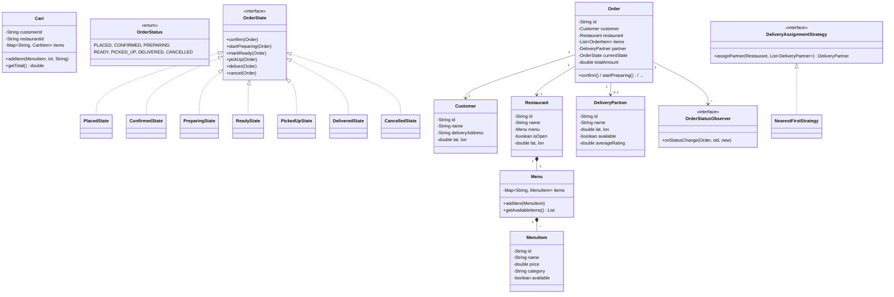

# Design Food Ordering System -- LLD Interview Script (90 min)

> Simulates an actual low-level design / machine coding interview round.
> You must write compilable, runnable Java code on a whiteboard or shared editor.

---

## Opening (0:00 - 1:00)

> "Thanks! I'll be designing and implementing a Food Ordering System like Swiggy or DoorDash. The key challenges are the order lifecycle (state machine), delivery partner assignment, and handling edge cases like restaurant going offline. Let me clarify the requirements."

---

## Requirements Gathering (1:00 - 5:00)

> **You ask:** "Should I model the complete flow: customer browses menu, adds to cart, places order, restaurant confirms, delivery partner picks up, delivers?"

> **Interviewer:** "Yes, the full end-to-end flow."

> **You ask:** "How should I handle delivery partner assignment? Nearest available? Highest rated?"

> **Interviewer:** "Show me a pluggable strategy. Implement at least nearest-available."

> **You ask:** "Should orders have status tracking with notifications?"

> **Interviewer:** "Yes. I want to see a state machine for order status and some notification mechanism."

> **You ask:** "Should I handle concurrent order processing? Multiple orders at the same time?"

> **Interviewer:** "Design for it conceptually. Single-threaded demo is fine."

> **You ask:** "What about the restaurant side -- can restaurants reject orders or go offline?"

> **Interviewer:** "Yes. Handle the restaurant-offline scenario gracefully."

> **You ask:** "Should I support a rating system?"

> **Interviewer:** "Basic rating for delivery partners. Show the model, doesn't need to be elaborate."

> "Great. The scope is: a full food ordering system with menu management, cart, order state machine, Strategy pattern for delivery assignment, Observer for notifications, and Builder for order construction. I'll also handle restaurant offline and delivery partner availability."

---

## Entity Identification (5:00 - 10:00)

> "Let me identify all the entities."

**Entities I write on the board:**

1. **Customer** -- id, name, email, phone, deliveryAddress, lat/lon
2. **Restaurant** -- id, name, address, cuisineType, menu, isOpen, lat/lon
3. **MenuItem** -- id, name, price, category, available
4. **Menu** -- restaurantId, map of MenuItems
5. **CartItem** -- menuItem, quantity
6. **Cart** -- customerId, restaurantId (single-restaurant constraint), items
7. **OrderStatus** (enum) -- PLACED, CONFIRMED, PREPARING, READY, PICKED_UP, DELIVERED, CANCELLED
8. **OrderState** (interface) -- State pattern for order lifecycle
9. **PlacedState, ConfirmedState, PreparingState, ReadyState, PickedUpState, DeliveredState, CancelledState** -- concrete states
10. **OrderItem** -- snapshot of menu item at order time (price frozen)
11. **Order** -- id, customer, restaurant, items, deliveryPartner, state, totals
12. **DeliveryPartner** -- id, name, lat/lon, available, rating
13. **DeliveryAssignmentStrategy** (interface) -- Strategy for partner assignment
14. **NearestFirstStrategy** -- assigns closest available partner
15. **OrderStatusObserver** (interface) -- Observer for notifications
16. **OrderBuilder** -- Builder pattern for constructing orders from carts

> "Relationships: Restaurant HAS-A Menu, Menu HAS-MANY MenuItems, Cart HAS-MANY CartItems, Order HAS-MANY OrderItems + HAS-A DeliveryPartner. Order delegates state transitions to OrderState."

---

## Class Diagram (10:00 - 15:00)

> "Let me sketch the class diagram."



---

## Implementation Plan (15:00 - 17:00)

> "Implementation order, bottom-up:"

1. **Customer, Restaurant, MenuItem, Menu** -- core entities
2. **CartItem, Cart** -- shopping cart with single-restaurant constraint
3. **OrderStatus enum + OrderState interface** -- state machine
4. **7 concrete state classes** -- one per status
5. **OrderItem, Order** -- with observer support
6. **DeliveryPartner + DeliveryAssignmentStrategy** -- Strategy pattern
7. **OrderStatusObserver** -- Observer for notifications
8. **OrderBuilder** -- builds Order from Cart
9. **OrderService** -- orchestrator
10. **Main demo** -- full flow

---

## Coding (17:00 - 70:00)

### Step 1: Core Entities (17:00 - 24:00)

> "Starting with Customer and Restaurant."

```java
public class Customer {
    private final String id;
    private final String name;
    private final String email;
    private final String phone;
    private String deliveryAddress;
    private double latitude;
    private double longitude;

    public Customer(String id, String name, String email, String phone,
                    String address, double lat, double lon) {
        this.id = id;
        this.name = name;
        this.email = email;
        this.phone = phone;
        this.deliveryAddress = address;
        this.latitude = lat;
        this.longitude = lon;
    }

    // getters, setDeliveryAddress...
}

public class Restaurant {
    private final String id;
    private final String name;
    private final String cuisineType;
    private final Menu menu;
    private final double latitude;
    private final double longitude;
    private boolean isOpen;

    public Restaurant(String id, String name, String address,
                      String cuisineType, double lat, double lon) {
        this.id = id;
        this.name = name;
        this.cuisineType = cuisineType;
        this.latitude = lat;
        this.longitude = lon;
        this.menu = new Menu(id);
        this.isOpen = true;
    }

    public boolean isOpen() { return isOpen; }
    public void setOpen(boolean open) { this.isOpen = open; }
    public Menu getMenu() { return menu; }
    // other getters...
}
```

> "MenuItem and Menu:"

```java
public class MenuItem {
    private final String id;
    private final String name;
    private final String description;
    private double price;
    private final String category;
    private boolean available;

    public MenuItem(String id, String name, String description,
                    double price, String category) {
        this.id = id;
        this.name = name;
        this.description = description;
        this.price = price;
        this.category = category;
        this.available = true;
    }

    public void setAvailable(boolean available) { this.available = available; }
    public boolean isAvailable() { return available; }
    // getters...
}

public class Menu {
    private final String restaurantId;
    private final Map<String, MenuItem> items; // itemId -> MenuItem

    public Menu(String restaurantId) {
        this.restaurantId = restaurantId;
        this.items = new LinkedHashMap<>();
    }

    public void addItem(MenuItem item) { items.put(item.getId(), item); }
    public MenuItem getItem(String id) { return items.get(id); }

    public List<MenuItem> getAvailableItems() {
        return items.values().stream()
                .filter(MenuItem::isAvailable)
                .collect(Collectors.toList());
    }

    public void displayMenu() {
        System.out.println("\n===== MENU =====");
        items.values().stream()
             .collect(Collectors.groupingBy(MenuItem::getCategory))
             .forEach((cat, itemList) -> {
                 System.out.println("--- " + cat + " ---");
                 itemList.forEach(i -> System.out.println("  " + i));
             });
    }
}
```

---

### Step 2: Cart (24:00 - 30:00)

> "The cart enforces a single-restaurant constraint -- you can't order from two restaurants in one cart."

```java
public class CartItem {
    private final MenuItem menuItem;
    private int quantity;

    public CartItem(MenuItem menuItem, int quantity) {
        if (quantity <= 0) throw new IllegalArgumentException("Quantity must be positive");
        this.menuItem = menuItem;
        this.quantity = quantity;
    }

    public double getSubtotal() { return menuItem.getPrice() * quantity; }
    public void setQuantity(int q) { this.quantity = q; }
    public MenuItem getMenuItem() { return menuItem; }
    public int getQuantity() { return quantity; }
}

public class Cart {
    private final String customerId;
    private String restaurantId;
    private final Map<String, CartItem> items; // menuItemId -> CartItem

    public Cart(String customerId) {
        this.customerId = customerId;
        this.items = new LinkedHashMap<>();
    }

    public void addItem(MenuItem menuItem, int quantity, String restaurantId) {
        // Enforce single-restaurant constraint
        if (this.restaurantId != null && !this.restaurantId.equals(restaurantId)) {
            throw new IllegalStateException(
                "Cart has items from another restaurant. Clear cart first.");
        }
        if (!menuItem.isAvailable()) {
            throw new IllegalStateException(menuItem.getName() + " is unavailable.");
        }

        this.restaurantId = restaurantId;

        CartItem existing = items.get(menuItem.getId());
        if (existing != null) {
            existing.setQuantity(existing.getQuantity() + quantity);
        } else {
            items.put(menuItem.getId(), new CartItem(menuItem, quantity));
        }
    }

    public double getTotal() {
        return items.values().stream().mapToDouble(CartItem::getSubtotal).sum();
    }

    public List<CartItem> getItems() { return new ArrayList<>(items.values()); }
    public void clear() { items.clear(); restaurantId = null; }
    public boolean isEmpty() { return items.isEmpty(); }
    public String getRestaurantId() { return restaurantId; }
    public String getCustomerId() { return customerId; }
}
```

> "The single-restaurant constraint prevents mixed-restaurant orders. If the user wants to order from a new restaurant, they must clear the cart first. This mirrors how Swiggy and Zomato work."

---

### Step 3: Order State Machine (30:00 - 44:00)

> "This is the heart of the system. I'm using the State pattern with default methods to make illegal transitions throw exceptions automatically."

```java
public enum OrderStatus {
    PLACED("Order placed"),
    CONFIRMED("Restaurant confirmed"),
    PREPARING("Food being prepared"),
    READY("Ready for pickup"),
    PICKED_UP("Driver picked up"),
    DELIVERED("Delivered"),
    CANCELLED("Cancelled");

    private final String description;
    OrderStatus(String desc) { this.description = desc; }
    public String getDescription() { return description; }
}
```

```java
public interface OrderState {
    default void confirm(Order o) {
        throw new IllegalStateException("Cannot confirm in " + getStateName());
    }
    default void startPreparing(Order o) {
        throw new IllegalStateException("Cannot start preparing in " + getStateName());
    }
    default void markReady(Order o) {
        throw new IllegalStateException("Cannot mark ready in " + getStateName());
    }
    default void pickUp(Order o) {
        throw new IllegalStateException("Cannot pick up in " + getStateName());
    }
    default void deliver(Order o) {
        throw new IllegalStateException("Cannot deliver in " + getStateName());
    }
    default void cancel(Order o) {
        throw new IllegalStateException("Cannot cancel in " + getStateName());
    }
    String getStateName();
}
```

> "Using default methods in the interface is a key design choice. Each concrete state only overrides the transitions that are valid for it. Invalid transitions automatically throw exceptions with a clear message. This eliminates the risk of forgetting to handle an invalid case."

> "Now the concrete states. I'll write them concisely:"

```java
public class PlacedState implements OrderState {
    @Override
    public void confirm(Order order) {
        System.out.println("  [State] " + order.getId() + ": PLACED -> CONFIRMED");
        order.setCurrentState(new ConfirmedState());
        order.setStatus(OrderStatus.CONFIRMED);
        order.notifyObservers(OrderStatus.PLACED, OrderStatus.CONFIRMED);
    }

    @Override
    public void cancel(Order order) {
        System.out.println("  [State] " + order.getId() + ": PLACED -> CANCELLED");
        order.setCurrentState(new CancelledState());
        order.setStatus(OrderStatus.CANCELLED);
        order.notifyObservers(OrderStatus.PLACED, OrderStatus.CANCELLED);
    }

    @Override
    public String getStateName() { return "PLACED"; }
}

public class ConfirmedState implements OrderState {
    @Override
    public void startPreparing(Order order) {
        System.out.println("  [State] " + order.getId() + ": CONFIRMED -> PREPARING");
        order.setCurrentState(new PreparingState());
        order.setStatus(OrderStatus.PREPARING);
        order.notifyObservers(OrderStatus.CONFIRMED, OrderStatus.PREPARING);
    }

    @Override
    public void cancel(Order order) {
        System.out.println("  [State] " + order.getId() + ": CONFIRMED -> CANCELLED");
        order.setCurrentState(new CancelledState());
        order.setStatus(OrderStatus.CANCELLED);
        order.notifyObservers(OrderStatus.CONFIRMED, OrderStatus.CANCELLED);
    }

    @Override
    public String getStateName() { return "CONFIRMED"; }
}

public class PreparingState implements OrderState {
    @Override
    public void markReady(Order order) {
        System.out.println("  [State] " + order.getId() + ": PREPARING -> READY");
        order.setCurrentState(new ReadyState());
        order.setStatus(OrderStatus.READY);
        order.notifyObservers(OrderStatus.PREPARING, OrderStatus.READY);
    }

    @Override
    public String getStateName() { return "PREPARING"; }
}

public class ReadyState implements OrderState {
    @Override
    public void pickUp(Order order) {
        System.out.println("  [State] " + order.getId() + ": READY -> PICKED_UP");
        order.setCurrentState(new PickedUpState());
        order.setStatus(OrderStatus.PICKED_UP);
        order.notifyObservers(OrderStatus.READY, OrderStatus.PICKED_UP);
    }

    @Override
    public String getStateName() { return "READY"; }
}

public class PickedUpState implements OrderState {
    @Override
    public void deliver(Order order) {
        System.out.println("  [State] " + order.getId() + ": PICKED_UP -> DELIVERED");
        order.setCurrentState(new DeliveredState());
        order.setStatus(OrderStatus.DELIVERED);
        order.setDeliveredAt(LocalDateTime.now());
        // Release delivery partner
        if (order.getDeliveryPartner() != null) {
            order.getDeliveryPartner().setAvailable(true);
        }
        order.notifyObservers(OrderStatus.PICKED_UP, OrderStatus.DELIVERED);
    }

    @Override
    public String getStateName() { return "PICKED_UP"; }
}

// Terminal states -- no valid transitions
public class DeliveredState implements OrderState {
    @Override public String getStateName() { return "DELIVERED"; }
}

public class CancelledState implements OrderState {
    @Override public String getStateName() { return "CANCELLED"; }
}
```

> "Notice that PLACED and CONFIRMED support cancel(), but PREPARING does not -- once the kitchen starts cooking, you can't cancel. DeliveredState and CancelledState are terminal with no overrides. Also, PickedUpState.deliver() releases the delivery partner back to the available pool."

---

### Step 4: OrderItem and Order (44:00 - 51:00)

> "OrderItem is a snapshot -- it freezes the price at order time. If the restaurant changes the price later, it doesn't affect existing orders."

```java
public class OrderItem {
    private final String itemName;
    private final double priceAtOrder; // frozen price
    private final int quantity;

    public OrderItem(String itemName, double priceAtOrder, int quantity) {
        this.itemName = itemName;
        this.priceAtOrder = priceAtOrder;
        this.quantity = quantity;
    }

    public double getSubtotal() { return priceAtOrder * quantity; }
    // getters...
}
```

```java
public class Order {
    private final String id;
    private final Customer customer;
    private final Restaurant restaurant;
    private final List<OrderItem> items;
    private DeliveryPartner deliveryPartner;
    private OrderState currentState;
    private OrderStatus status;
    private final double subtotal;
    private final double deliveryFee;
    private final double tax;
    private final double totalAmount;
    private final LocalDateTime placedAt;
    private LocalDateTime deliveredAt;
    private final List<OrderStatusObserver> observers;

    Order(String id, Customer customer, Restaurant restaurant,
          List<OrderItem> items, double subtotal, double deliveryFee,
          double tax, double totalAmount) {
        this.id = id;
        this.customer = customer;
        this.restaurant = restaurant;
        this.items = Collections.unmodifiableList(items);
        this.subtotal = subtotal;
        this.deliveryFee = deliveryFee;
        this.tax = tax;
        this.totalAmount = totalAmount;
        this.placedAt = LocalDateTime.now();
        this.currentState = new PlacedState();
        this.status = OrderStatus.PLACED;
        this.observers = new ArrayList<>();
    }

    // Delegate state transitions
    public void confirm() { currentState.confirm(this); }
    public void startPreparing() { currentState.startPreparing(this); }
    public void markReady() { currentState.markReady(this); }
    public void pickUp() { currentState.pickUp(this); }
    public void deliver() { currentState.deliver(this); }
    public void cancel() {
        currentState.cancel(this);
        if (deliveryPartner != null) {
            deliveryPartner.setAvailable(true);
            System.out.println("  [Order] Partner " + deliveryPartner.getName() + " released.");
        }
    }

    // Observer management
    public void addObserver(OrderStatusObserver obs) { observers.add(obs); }
    public void notifyObservers(OrderStatus oldS, OrderStatus newS) {
        for (OrderStatusObserver obs : observers) obs.onStatusChange(this, oldS, newS);
    }

    // Delivery partner
    public void assignDeliveryPartner(DeliveryPartner partner) {
        this.deliveryPartner = partner;
        partner.setAvailable(false);
    }

    // Setters used by states
    void setCurrentState(OrderState state) { this.currentState = state; }
    void setStatus(OrderStatus status) { this.status = status; }
    void setDeliveredAt(LocalDateTime time) { this.deliveredAt = time; }

    // Display
    public void displayOrderSummary() {
        System.out.println("\n===== ORDER SUMMARY =====");
        System.out.println("  Order ID:    " + id);
        System.out.println("  Customer:    " + customer.getName());
        System.out.println("  Restaurant:  " + restaurant.getName());
        System.out.println("  Status:      " + status);
        for (OrderItem item : items) System.out.println("    " + item);
        System.out.printf("  Subtotal:    $%.2f%n", subtotal);
        System.out.printf("  Delivery:    $%.2f%n", deliveryFee);
        System.out.printf("  Tax:         $%.2f%n", tax);
        System.out.printf("  TOTAL:       $%.2f%n", totalAmount);
        if (deliveryPartner != null)
            System.out.println("  Driver:      " + deliveryPartner.getName());
    }

    public String getId() { return id; }
    public Customer getCustomer() { return customer; }
    public Restaurant getRestaurant() { return restaurant; }
    public DeliveryPartner getDeliveryPartner() { return deliveryPartner; }
    public OrderStatus getStatus() { return status; }
    public double getTotalAmount() { return totalAmount; }
}
```

---

### Step 5: DeliveryPartner + Assignment Strategy (51:00 - 58:00)

> "DeliveryPartner tracks location, availability, and rating. The Strategy pattern allows pluggable assignment algorithms."

```java
public class DeliveryPartner {
    private final String id;
    private final String name;
    private double latitude;
    private double longitude;
    private boolean available;
    private double averageRating;
    private int totalDeliveries;

    public DeliveryPartner(String id, String name, String phone,
                           double lat, double lon) {
        this.id = id;
        this.name = name;
        this.latitude = lat;
        this.longitude = lon;
        this.available = true;
        this.averageRating = 5.0;
        this.totalDeliveries = 0;
    }

    public double distanceTo(double targetLat, double targetLon) {
        // Haversine formula for real distance
        final double R = 6371.0;
        double dLat = Math.toRadians(targetLat - latitude);
        double dLon = Math.toRadians(targetLon - longitude);
        double a = Math.sin(dLat/2) * Math.sin(dLat/2)
                 + Math.cos(Math.toRadians(latitude))
                 * Math.cos(Math.toRadians(targetLat))
                 * Math.sin(dLon/2) * Math.sin(dLon/2);
        return R * 2 * Math.atan2(Math.sqrt(a), Math.sqrt(1-a));
    }

    public void updateRating(double newRating) {
        averageRating = ((averageRating * totalDeliveries) + newRating)
                        / (totalDeliveries + 1);
        totalDeliveries++;
    }

    public boolean isAvailable() { return available; }
    public void setAvailable(boolean b) { this.available = b; }
    public String getName() { return name; }
    public String getId() { return id; }
    public double getAverageRating() { return averageRating; }
}
```

> "Now the Strategy for assignment:"

```java
public interface DeliveryAssignmentStrategy {
    DeliveryPartner assignPartner(Restaurant restaurant,
                                   List<DeliveryPartner> allPartners);
}

public class NearestFirstStrategy implements DeliveryAssignmentStrategy {
    @Override
    public DeliveryPartner assignPartner(Restaurant restaurant,
                                          List<DeliveryPartner> allPartners) {
        return allPartners.stream()
                .filter(DeliveryPartner::isAvailable)
                .min(Comparator.comparingDouble(
                    p -> p.distanceTo(restaurant.getLatitude(),
                                      restaurant.getLongitude())))
                .orElse(null);
    }
}

public class HighestRatedStrategy implements DeliveryAssignmentStrategy {
    @Override
    public DeliveryPartner assignPartner(Restaurant restaurant,
                                          List<DeliveryPartner> allPartners) {
        return allPartners.stream()
                .filter(DeliveryPartner::isAvailable)
                .max(Comparator.comparingDouble(DeliveryPartner::getAverageRating))
                .orElse(null);
    }
}
```

### Interviewer Interrupts:

> **Interviewer:** "How do you assign delivery partners?"

> **Your answer:** "I use the Strategy pattern. The `DeliveryAssignmentStrategy` interface has one method: `assignPartner(restaurant, allPartners)`. The `NearestFirstStrategy` filters for available partners, then picks the one with the shortest Haversine distance to the restaurant. I also implemented `HighestRatedStrategy` which picks the best-rated available partner. In production, you'd use a weighted combination -- something like `score = 0.7 * (1/distance) + 0.3 * rating`, or a priority queue updated in real-time as partners move. The Strategy pattern makes it trivial to swap algorithms without touching any other code."

---

### Step 6: Observer for Notifications (58:00 - 61:00)

> "Observer pattern decouples order status changes from notification logic."

```java
public interface OrderStatusObserver {
    void onStatusChange(Order order, OrderStatus oldStatus, OrderStatus newStatus);
}

public class CustomerNotificationObserver implements OrderStatusObserver {
    @Override
    public void onStatusChange(Order order, OrderStatus oldStatus,
                                OrderStatus newStatus) {
        System.out.println("  [Notify] SMS to " + order.getCustomer().getName()
                + ": Order " + order.getId() + " is now " + newStatus.getDescription());
    }
}

public class RestaurantDashboardObserver implements OrderStatusObserver {
    @Override
    public void onStatusChange(Order order, OrderStatus oldStatus,
                                OrderStatus newStatus) {
        System.out.println("  [Dashboard] " + order.getRestaurant().getName()
                + ": Order " + order.getId() + " changed to " + newStatus);
    }
}
```

> "Every time a state transition fires, all observers are notified. I can add email, push notification, or analytics observers without touching the Order or State classes."

---

### Step 7: OrderBuilder + OrderService (61:00 - 70:00)

> "The Builder constructs Orders from Carts, calculating fees and taxes."

```java
public class OrderBuilder {
    private static final double TAX_RATE = 0.05;       // 5%
    private static final double DELIVERY_FEE = 2.99;
    private static int orderCounter = 0;

    public Order buildFromCart(Cart cart, Customer customer, Restaurant restaurant) {
        if (cart.isEmpty()) throw new IllegalStateException("Cart is empty");
        if (!restaurant.isOpen()) throw new IllegalStateException(
                restaurant.getName() + " is currently offline.");

        List<OrderItem> orderItems = new ArrayList<>();
        for (CartItem ci : cart.getItems()) {
            orderItems.add(new OrderItem(
                ci.getMenuItem().getName(),
                ci.getMenuItem().getPrice(),
                ci.getQuantity()));
        }

        double subtotal = cart.getTotal();
        double tax = Math.round(subtotal * TAX_RATE * 100.0) / 100.0;
        double total = subtotal + DELIVERY_FEE + tax;

        String orderId = "ORD-" + (++orderCounter);
        return new Order(orderId, customer, restaurant,
                orderItems, subtotal, DELIVERY_FEE, tax, total);
    }
}
```

> "The full OrderService orchestrator:"

```java
public class OrderService {
    private final List<DeliveryPartner> deliveryPartners;
    private final DeliveryAssignmentStrategy assignmentStrategy;
    private final OrderBuilder orderBuilder;
    private final List<Order> allOrders;

    public OrderService(DeliveryAssignmentStrategy strategy) {
        this.deliveryPartners = new ArrayList<>();
        this.assignmentStrategy = strategy;
        this.orderBuilder = new OrderBuilder();
        this.allOrders = new ArrayList<>();
    }

    public void addDeliveryPartner(DeliveryPartner partner) {
        deliveryPartners.add(partner);
    }

    public Order placeOrder(Cart cart, Customer customer, Restaurant restaurant) {
        // Build order from cart
        Order order = orderBuilder.buildFromCart(cart, customer, restaurant);

        // Register observers
        order.addObserver(new CustomerNotificationObserver());
        order.addObserver(new RestaurantDashboardObserver());

        // Assign delivery partner
        DeliveryPartner partner = assignmentStrategy.assignPartner(
                restaurant, deliveryPartners);
        if (partner != null) {
            order.assignDeliveryPartner(partner);
            System.out.println("  Assigned driver: " + partner.getName());
        } else {
            System.out.println("  WARNING: No delivery partner available.");
        }

        allOrders.add(order);
        order.displayOrderSummary();
        return order;
    }
}
```

---

### Step 8: Main Demo (68:00 - 70:00)

```java
public class FoodOrderingDemo {
    public static void main(String[] args) {
        // Setup restaurant
        Restaurant restaurant = new Restaurant("R1", "Tandoori Palace",
                "123 Food St", "Indian", 12.97, 77.59);
        restaurant.getMenu().addItem(new MenuItem("M1", "Butter Chicken",
                "Creamy curry", 12.99, "Main Course"));
        restaurant.getMenu().addItem(new MenuItem("M2", "Naan Bread",
                "Freshly baked", 2.99, "Bread"));
        restaurant.getMenu().addItem(new MenuItem("M3", "Mango Lassi",
                "Yogurt drink", 3.99, "Beverages"));

        // Setup delivery partners
        DeliveryPartner driver1 = new DeliveryPartner("D1", "Raj", "111",
                12.98, 77.60);  // close to restaurant
        DeliveryPartner driver2 = new DeliveryPartner("D2", "Priya", "222",
                13.05, 77.65); // farther

        // Setup customer
        Customer customer = new Customer("C1", "Alice", "alice@email.com",
                "9876543210", "456 Home Ave", 12.95, 77.58);

        // Build service with nearest-first strategy
        OrderService service = new OrderService(new NearestFirstStrategy());
        service.addDeliveryPartner(driver1);
        service.addDeliveryPartner(driver2);

        // Customer builds cart
        Cart cart = new Cart("C1");
        cart.addItem(restaurant.getMenu().getItem("M1"), 2, "R1");
        cart.addItem(restaurant.getMenu().getItem("M2"), 3, "R1");
        cart.addItem(restaurant.getMenu().getItem("M3"), 1, "R1");

        // Place order
        System.out.println("=== PLACING ORDER ===");
        Order order = service.placeOrder(cart, customer, restaurant);

        // Simulate order lifecycle
        System.out.println("\n=== ORDER LIFECYCLE ===");
        order.confirm();
        order.startPreparing();
        order.markReady();
        order.pickUp();
        order.deliver();

        System.out.println("\nFinal status: " + order.getStatus());
    }
}
```

---

## Demo & Testing (70:00 - 80:00)

> "Let me trace the expected output:"

```
=== PLACING ORDER ===
  Assigned driver: Raj
===== ORDER SUMMARY =====
  Order ID:    ORD-1
  Customer:    Alice
  Restaurant:  Tandoori Palace
  Status:      PLACED
    2x Butter Chicken          $25.98
    3x Naan Bread              $8.97
    1x Mango Lassi             $3.99
  Subtotal:    $38.94
  Delivery:    $2.99
  Tax:         $1.95
  TOTAL:       $43.88
  Driver:      Raj

=== ORDER LIFECYCLE ===
  [State] ORD-1: PLACED -> CONFIRMED
  [Notify] SMS to Alice: Order ORD-1 is now Restaurant confirmed
  [Dashboard] Tandoori Palace: Order ORD-1 changed to CONFIRMED
  [State] ORD-1: CONFIRMED -> PREPARING
  [Notify] SMS to Alice: ...
  [State] ORD-1: PREPARING -> READY
  [State] ORD-1: READY -> PICKED_UP
  [State] ORD-1: PICKED_UP -> DELIVERED

Final status: DELIVERED
```

> "Raj was assigned because he's closer to the restaurant (using Haversine distance). Each state transition fires observer notifications. Raj is released back to available when the order is delivered."

### Interviewer Interrupts:

> **Interviewer:** "What if the restaurant goes offline?"

> **Your answer:** "I handle this at two levels:

> **At order placement:** The OrderBuilder checks `restaurant.isOpen()` before building the order. If the restaurant is offline, it throws an IllegalStateException with a clear message. The customer sees 'Tandoori Palace is currently offline' and can choose another restaurant.

> **After order placement:** If the restaurant goes offline AFTER an order is placed but BEFORE confirming it, the order stays in PLACED state. In a production system, I'd add a timeout -- if the restaurant doesn't confirm within X minutes, auto-cancel the order and notify the customer. I'd implement this as a scheduled task that checks for stale PLACED orders:

```java
// Conceptual -- would run on a scheduler
public void cancelStaleOrders(int timeoutMinutes) {
    for (Order order : allOrders) {
        if (order.getStatus() == OrderStatus.PLACED
                && order.getPlacedAt().plusMinutes(timeoutMinutes)
                         .isBefore(LocalDateTime.now())) {
            order.cancel();
            System.out.println("Auto-cancelled stale order: " + order.getId());
        }
    }
}
```

> For mid-preparation offline (very rare), the order would need manual intervention from customer support. The State pattern makes it easy to add a new RESTAURANT_OFFLINE status if needed."

---

## Extension Round (80:00 - 90:00)

### Interviewer asks: "Now add support for scheduled/future orders."

> "Great. This means a customer can place an order now to be delivered at a future time. The key changes are in Order and OrderService."

```java
// New class: ScheduledOrder extends or wraps Order
public class ScheduledOrder {
    private final Order order;
    private final LocalDateTime scheduledFor;
    private boolean activated;

    public ScheduledOrder(Order order, LocalDateTime scheduledFor) {
        this.order = order;
        this.scheduledFor = scheduledFor;
        this.activated = false;
    }

    public boolean isReadyToActivate() {
        // Activate 30 minutes before scheduled time
        return !activated && LocalDateTime.now()
                .isAfter(scheduledFor.minusMinutes(30));
    }

    public void activate() {
        if (activated) throw new IllegalStateException("Already activated");
        this.activated = true;
        // Trigger the normal order flow
        order.confirm();
    }

    public Order getOrder() { return order; }
    public LocalDateTime getScheduledFor() { return scheduledFor; }
}
```

> "In OrderService, I add a scheduledOrders list and a placeScheduledOrder method:"

```java
// Add to OrderService:
private final List<ScheduledOrder> scheduledOrders = new ArrayList<>();

public ScheduledOrder placeScheduledOrder(Cart cart, Customer customer,
                                           Restaurant restaurant,
                                           LocalDateTime scheduledFor) {
    if (scheduledFor.isBefore(LocalDateTime.now().plusMinutes(60))) {
        throw new IllegalArgumentException(
            "Scheduled orders must be at least 60 minutes in the future.");
    }

    // Build order but DON'T assign delivery partner yet
    Order order = orderBuilder.buildFromCart(cart, customer, restaurant);
    order.addObserver(new CustomerNotificationObserver());
    order.addObserver(new RestaurantDashboardObserver());
    allOrders.add(order);

    ScheduledOrder scheduled = new ScheduledOrder(order, scheduledFor);
    scheduledOrders.add(scheduled);

    System.out.println("Scheduled order " + order.getId()
            + " for " + scheduledFor);
    return scheduled;
}

/**
 * Called by a scheduler every few minutes.
 * Activates scheduled orders that are within the preparation window.
 */
public void processScheduledOrders() {
    for (ScheduledOrder so : scheduledOrders) {
        if (so.isReadyToActivate()) {
            // Assign delivery partner at activation time (not at booking time)
            DeliveryPartner partner = assignmentStrategy.assignPartner(
                    so.getOrder().getRestaurant(), deliveryPartners);
            if (partner != null) {
                so.getOrder().assignDeliveryPartner(partner);
            }
            so.activate();
            System.out.println("Activated scheduled order: "
                    + so.getOrder().getId());
        }
    }
}
```

> "Key design decisions for scheduled orders:
> 1. **Delivery partner is assigned at activation time, not booking time** -- assigning hours in advance would waste partner availability.
> 2. **30-minute activation window** -- gives the restaurant enough prep time.
> 3. **Minimum 60 minutes in the future** -- prevents abuse (ordering 5 minutes ahead is just a normal order).
> 4. **Uses the same Order object** -- no separate data model needed. The ScheduledOrder is a wrapper that controls when the order enters the normal lifecycle."

> "Changes: one new class (ScheduledOrder), two new methods in OrderService. Zero modifications to Order, OrderState, or any existing code."

---

## Red Flags to Avoid

1. **No state machine** -- Using a simple status field with if/else transitions. The State pattern makes illegal transitions impossible.
2. **Not freezing prices in OrderItem** -- If menu prices change after ordering, the customer's bill should not change.
3. **No single-restaurant constraint on Cart** -- Allowing mixed-restaurant carts creates impossible delivery scenarios.
4. **Global delivery partner lock** -- Assigning partners should be per-order, not a global synchronized block.
5. **Ignoring restaurant offline** -- Not checking `isOpen()` before placing orders.
6. **Terminal states with transitions** -- DeliveredState and CancelledState must not allow any transitions.
7. **Not releasing delivery partner** -- On delivery or cancellation, the partner must be set back to available.
8. **Tightly coupled notifications** -- Putting email/SMS logic inside the Order class instead of using Observer.

---

## What Impresses Interviewers

1. **State pattern with default methods** -- Using interface default methods for illegal transitions is clean and idiomatic.
2. **Strategy for delivery assignment** -- Showing two strategies (nearest, highest-rated) and explaining a weighted hybrid.
3. **Observer for notifications** -- Clean decoupling of order status from notification channels.
4. **Builder for order construction** -- Separating order creation logic from the Order class itself.
5. **Price snapshot in OrderItem** -- Demonstrating awareness of time-of-order vs current pricing.
6. **Haversine distance** -- Using real distance calculation instead of Euclidean on lat/lon.
7. **Single-restaurant cart constraint** -- Mirrors real-world food ordering apps.
8. **Partner release on delivery/cancel** -- Showing resource management awareness.
9. **Graceful restaurant-offline handling** -- Both at placement and post-placement.
10. **Scheduled orders with deferred partner assignment** -- Extension that shows deep understanding of resource allocation timing.
11. **Running average for ratings** -- `newAvg = (oldAvg * count + newRating) / (count + 1)` without storing all historical ratings.
12. **Seven states, not three** -- PLACED through DELIVERED shows you understand the real complexity of food delivery, not a simplified model.
