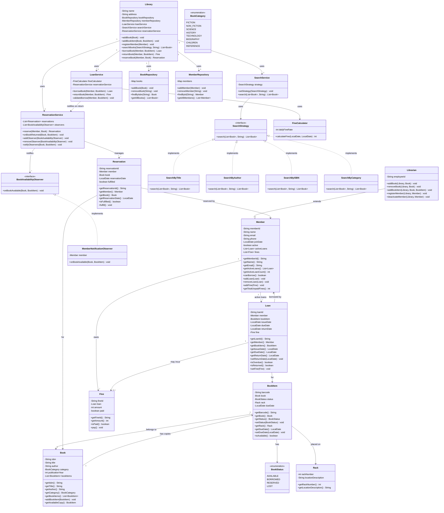

# Low-Level Design: Library Management System

## Table of Contents

1. [Problem Statement](#1-problem-statement)
2. [Requirements](#2-requirements)
3. [Entity Identification](#3-entity-identification)
4. [Class Diagram](#4-class-diagram)
5. [Design Patterns](#5-design-patterns)
6. [Design Decisions and Rationale](#6-design-decisions-and-rationale)
7. [Key Business Rules](#7-key-business-rules)
8. [Core Workflows](#8-core-workflows)
9. [Fine Calculation Logic](#9-fine-calculation-logic)
10. [Reservation and Notification Flow](#10-reservation-and-notification-flow)
11. [Extension Points](#11-extension-points)
12. [Concurrency Considerations](#12-concurrency-considerations)
13. [Summary](#13-summary)

---

## 1. Problem Statement

Design an object-oriented Library Management System that allows librarians to
manage books and members, and allows members to search for, borrow, return, and
reserve books. The system must enforce lending policies (max books per member,
loan duration, late return fines) and notify members when reserved books become
available.

This is a classic LLD interview problem that tests your ability to:
- Distinguish between metadata (Book) and physical copies (BookItem)
- Model multiple actors with different permissions (Member vs Librarian)
- Apply Strategy for pluggable search, Observer for event-driven notification
- Enforce non-trivial business rules (loan limits, fine calculation, reservations)

---

## 2. Requirements

### 2.1 Functional Requirements

| # | Requirement | Priority |
|---|-------------|----------|
| FR-1 | Librarian can add, update, and remove books from the catalog | Must |
| FR-2 | Members can search books by title, author, ISBN, or category | Must |
| FR-3 | Members can borrow available book copies (BookItems) | Must |
| FR-4 | Members can return borrowed books | Must |
| FR-5 | System tracks due dates and calculates fines for late returns | Must |
| FR-6 | Maximum 5 books can be borrowed per member at any time | Must |
| FR-7 | Default loan period is 14 days from the date of borrowing | Must |
| FR-8 | Late return fine is Rs 10 per day past the due date | Must |
| FR-9 | Members can reserve a book that is currently borrowed by someone else | Must |
| FR-10 | When a reserved book is returned, the reserving member is notified | Must |
| FR-11 | A reserved book cannot be borrowed by anyone other than the reserver | Must |
| FR-12 | Librarian can register new members and deactivate existing ones | Should |
| FR-13 | System assigns a unique barcode to each physical book copy | Should |
| FR-14 | Books are placed on racks; each BookItem knows its rack location | Should |

### 2.2 Non-Functional Requirements

| # | Requirement |
|---|-------------|
| NFR-1 | Design must be extensible: adding new search criteria, notification channels, or fine policies should not require modifying existing classes |
| NFR-2 | Repositories abstract data access so the system can switch between in-memory, SQL, or NoSQL storage |
| NFR-3 | All monetary calculations use integer arithmetic (paise or whole rupees) to avoid floating-point errors |
| NFR-4 | SOLID principles throughout, with particular attention to Single Responsibility and Open/Closed |

---

## 3. Entity Identification

### 3.1 Core Entities

| Entity | Responsibility |
|--------|---------------|
| **Library** | Top-level facade: holds the catalog, members, and coordinates all services |
| **Book** | Metadata for a logical book: title, author, ISBN, category, publication year. One Book can have many physical copies. |
| **BookItem** | A single physical copy with a unique barcode, a BookStatus, a rack location, and a reference back to its parent Book. |
| **Member** | A registered library user who can search, borrow, return, and reserve books. Tracks active loans and unpaid fines. |
| **Librarian** | Extends Member with administrative privileges: add/remove books, register/deactivate members. |
| **Loan** | Records a borrowing event: which member, which BookItem, issue date, due date, return date, and associated fine. |
| **Fine** | Represents a monetary penalty for a late return: amount in rupees, the associated Loan, and paid/unpaid status. |
| **Reservation** | Records that a member has reserved a specific Book. When any copy becomes available, the oldest reservation is fulfilled first. |
| **Rack** | Physical location in the library identified by a rack number. A BookItem is placed on a Rack. |
| **BookStatus** | Enum: AVAILABLE, BORROWED, RESERVED, LOST |
| **BookCategory** | Enum: FICTION, NON_FICTION, SCIENCE, HISTORY, TECHNOLOGY, BIOGRAPHY, CHILDREN, REFERENCE |

### 3.2 Service Classes

| Service | Responsibility |
|---------|---------------|
| **LoanService** | Orchestrates borrow and return workflows, delegates fine calculation |
| **SearchService** | Accepts a SearchStrategy and executes it against the catalog |
| **ReservationService** | Manages reservations and triggers notifications when books become available |
| **FineCalculator** | Pure logic: given a due date and return date, computes the fine amount |
| **BookRepository** | Data access layer for Book and BookItem entities |
| **MemberRepository** | Data access layer for Member entities |

### 3.3 Strategy and Observer Interfaces

| Interface | Responsibility |
|-----------|---------------|
| **SearchStrategy** | Defines a single method `search(catalog, query)` for pluggable search algorithms |
| **BookAvailabilityObserver** | Callback interface: `onBookAvailable(Book, BookItem)` -- invoked when a reserved book is returned |

### 3.4 Relationships at a Glance

- **Library** HAS-A BookRepository, MemberRepository, LoanService, SearchService, ReservationService.
- **Book** HAS-MANY BookItems (one logical book, many physical copies).
- **BookItem** HAS-A BookStatus, a Rack reference, and a back-reference to its parent Book.
- **Member** HAS-MANY active Loans (up to 5) and HAS-MANY Fines.
- **Librarian** IS-A Member (inherits borrowing capabilities, adds admin operations).
- **Loan** references one Member and one BookItem.
- **Reservation** references one Member and one Book (not BookItem -- any copy will do).
- **SearchService** HAS-A SearchStrategy (Strategy pattern -- swappable at runtime).
- **ReservationService** HAS-MANY BookAvailabilityObservers (Observer pattern).

---

## 4. Class Diagram



---

## 5. Design Patterns

### 5.1 Strategy Pattern -- Pluggable Search

**Where:** `SearchStrategy` interface and its four implementations: `SearchByTitle`,
`SearchByAuthor`, `SearchByISBN`, `SearchByCategory`.

**Why:** The library supports multiple ways to search for books. Each search
criterion has different matching logic:
- Title search does case-insensitive substring matching.
- Author search does case-insensitive substring matching on a different field.
- ISBN search does exact matching (ISBNs are unique identifiers).
- Category search matches against an enum value.

Without Strategy, the SearchService would need a big if-else chain:

```
// BAD -- violates Open/Closed Principle
if (searchType == "title") { ... }
else if (searchType == "author") { ... }
else if (searchType == "isbn") { ... }
```

With Strategy, the SearchService is completely unaware of which search algorithm
is being used. The client picks a strategy and passes it in:

```
interface SearchStrategy {
    List<Book> search(List<Book> catalog, String query);
}

class SearchByTitle implements SearchStrategy {
    public List<Book> search(List<Book> catalog, String query) {
        return catalog.stream()
            .filter(b -> b.getTitle().toLowerCase().contains(query.toLowerCase()))
            .collect(Collectors.toList());
    }
}
```

**Extensibility:** To add "Search by Publisher" or "Search by Year Range," you
create a new class implementing SearchStrategy. No existing code is modified.
This is the Open/Closed Principle in its purest form.

**Runtime flexibility:** The same SearchService instance can switch strategies
per request. A member might search by title first, then refine by author --
all without instantiating a new service.

### 5.2 Observer Pattern -- Reserved Book Notification

**Where:** `BookAvailabilityObserver` interface and `MemberNotificationObserver`
implementation. The `ReservationService` is the subject (publisher).

**Why:** When a member reserves a book that is currently borrowed, they want to
be notified the moment any copy of that book becomes available. The key
problem: the `LoanService` (which handles returns) should not need to know
about notifications, email systems, or member preferences. It just needs to
say "a book was returned" and let interested parties react.

```
interface BookAvailabilityObserver {
    void onBookAvailable(Book book, BookItem copy);
}

class MemberNotificationObserver implements BookAvailabilityObserver {
    private Member member;

    public void onBookAvailable(Book book, BookItem copy) {
        System.out.println("NOTIFICATION to " + member.getName()
            + ": '" + book.getTitle() + "' is now available. "
            + "Copy barcode: " + copy.getBarcode());
    }
}
```

**Flow:**
1. Member A reserves Book X. ReservationService creates a Reservation and
   registers a `MemberNotificationObserver(A)` for Book X.
2. Member B returns a copy of Book X. LoanService marks it AVAILABLE and
   calls `reservationService.onBookReturned(bookX, copy)`.
3. ReservationService checks if there are pending reservations for Book X.
   If yes, it marks the copy as RESERVED, fulfills the oldest reservation,
   and notifies all observers.
4. Member A receives the notification and can now borrow the reserved copy.

**Extensibility:** To add email notifications, SMS alerts, or push notifications,
create new observer implementations. The ReservationService does not change.

### 5.3 Repository Pattern -- Data Access Abstraction

**Where:** `BookRepository` and `MemberRepository`.

**Why:** The core domain logic (LoanService, SearchService, ReservationService)
should not care whether data is stored in a HashMap, a SQL database, or a
remote microservice. Repositories provide a clean interface:

```
class BookRepository {
    private Map<String, Book> books = new HashMap<>();

    public void addBook(Book book) { books.put(book.getIsbn(), book); }
    public Book findByIsbn(String isbn) { return books.get(isbn); }
    public List<Book> getAllBooks() { return new ArrayList<>(books.values()); }
}
```

In a real system, you would define a `BookRepository` interface and have
`InMemoryBookRepository`, `JpaBookRepository`, etc. For this LLD, the
in-memory version keeps things focused on the domain logic.

**Benefit:** Swapping storage backends (for example, moving from in-memory to
PostgreSQL during productionization) requires only a new Repository
implementation. All service classes continue to work unchanged.

---

## 6. Design Decisions and Rationale

### 6.1 Why Separate Book and BookItem?

This is the single most important modelling decision in this problem.

A library might own 5 copies of "Clean Code" by Robert C. Martin. All five
share the same title, author, ISBN, and category. But each physical copy has
its own barcode, its own status (one might be borrowed, another available),
and its own rack location.

| Concept | What It Represents | Unique By |
|---------|-------------------|-----------|
| **Book** | The intellectual work | ISBN |
| **BookItem** | A physical copy of that work | Barcode |

Without this separation, you would need to duplicate title/author/ISBN across
every copy, violating DRY. Worse, searching "by title" would return 5 identical
results instead of 1 book with 5 available copies.

**Analogy:** This is the same as the `Movie` vs `Show` (screening) distinction
in BookMyShow, or `Product` vs `ProductItem` in an inventory system.

### 6.2 Why Librarian Extends Member?

A Librarian IS-A Member with additional administrative capabilities. Librarians
can borrow books too (they are library members). The inheritance is justified:

- All Member operations (borrow, return, search, reserve) apply to Librarian.
- Librarian adds operations (addBook, registerMember, deactivateMember).
- Liskov Substitution holds: anywhere a Member is expected, a Librarian works.

An alternative is composition (Librarian HAS-A Member), but this forces
delegation for every Member method. Since the IS-A relationship is natural
and Librarian truly IS a specialized Member, inheritance is the cleaner choice.

### 6.3 Why Reservation Is on Book, Not BookItem?

When a member reserves a book, they do not care which specific copy they get.
They want "any copy of Clean Code." Reserving a specific barcode would be
too restrictive -- what if that copy gets lost?

By reserving at the Book level, the system can fulfill the reservation with
whichever copy gets returned first. This is more flexible and matches
real-world library behavior.

### 6.4 Why a Separate FineCalculator Class?

Fine calculation is pure business logic with no side effects: given a due date
and a return date, compute the penalty. Extracting it into its own class:

- Makes it independently testable (unit test with various date combinations).
- Follows Single Responsibility Principle (LoanService orchestrates, FineCalculator computes).
- Makes the fine policy easy to change (swap in a different calculator for
  tiered fines, grace periods, maximum cap, etc.).

### 6.5 Why Not Use State Pattern?

Unlike the Vending Machine problem, a Library Management System does not have
a single object transitioning through well-defined states where each state
changes the allowed operations. A BookItem has a status, but the transitions
are simple enough (AVAILABLE -> BORROWED -> AVAILABLE, or AVAILABLE -> RESERVED)
that a State pattern would be over-engineering. A simple enum and validation
checks in the service layer are sufficient.

---

## 7. Key Business Rules

### 7.1 Borrowing Rules

```
A member can borrow a BookItem IF AND ONLY IF all of the following hold:

1. The member is active (not deactivated).
2. The member has fewer than 5 active loans (MAX_BOOKS_PER_MEMBER = 5).
3. The member has no unpaid fines exceeding Rs 0 (or a configurable threshold).
4. The BookItem's status is AVAILABLE.
5. The BookItem is NOT reserved by a different member.
   - If the BookItem is RESERVED, only the reserving member can borrow it.
```

### 7.2 Return Rules

```
When a member returns a BookItem:

1. Find the active Loan for this member and BookItem.
2. Set the Loan's returnDate to today.
3. If returnDate > dueDate, calculate fine:
      fine = (returnDate - dueDate) * DAILY_FINE_RATE
      DAILY_FINE_RATE = Rs 10 per day
4. If the Book has pending reservations:
      - Mark the BookItem as RESERVED.
      - Notify the reserving member (Observer pattern).
5. Otherwise:
      - Mark the BookItem as AVAILABLE.
6. Remove the Loan from the member's active loans.
```

### 7.3 Reservation Rules

```
A member can reserve a Book IF:

1. The member is active.
2. All copies of the Book are currently BORROWED (none available).
3. The member does not already have an active reservation for this Book.
4. The member does not already have this Book borrowed.

When a reserved copy is returned:
- The copy is marked RESERVED (not AVAILABLE).
- The oldest pending reservation is fulfilled first (FIFO).
- The reserving member is notified.
- The reservation remains valid for a configurable period (e.g., 3 days).
```

### 7.4 Constants Summary

| Constant | Value |
|----------|-------|
| MAX_BOOKS_PER_MEMBER | 5 |
| LOAN_PERIOD_DAYS | 14 |
| DAILY_FINE_RATE | Rs 10 |
| RESERVATION_HOLD_DAYS | 3 |

---

## 8. Core Workflows

### 8.1 Borrow Book Flow

```
Member calls library.borrowBook(member, bookItem)
    |
    v
[1] Is member active?
    |-- No  --> throw "Member account is not active"
    |-- Yes --> continue
    v
[2] Does member have fewer than 5 active loans?
    |-- No  --> throw "Borrow limit reached (max 5)"
    |-- Yes --> continue
    v
[3] Does member have unpaid fines?
    |-- Yes --> throw "Please clear outstanding fines first"
    |-- No  --> continue
    v
[4] Is the BookItem AVAILABLE?
    |-- No, BORROWED --> throw "This copy is already borrowed"
    |-- No, RESERVED --> Is it reserved by THIS member?
    |   |-- Yes --> continue (member can borrow their reserved copy)
    |   |-- No  --> throw "This copy is reserved by another member"
    |-- No, LOST --> throw "This copy is marked as lost"
    |-- Yes --> continue
    v
[5] Create Loan object
    |-- issueDate = today
    |-- dueDate = today + 14 days
    |-- member = the borrower
    |-- bookItem = the copy
    v
[6] Update BookItem status to BORROWED
    |-- Set bookItem.dueDate = loan.dueDate
    v
[7] Add Loan to member's active loans
    v
[8] If this was a reserved copy, mark reservation as fulfilled
    |
    v
[9] Return the Loan object
```

### 8.2 Return Book Flow

```
Member calls library.returnBook(member, bookItem)
    |
    v
[1] Find active Loan for (member, bookItem)
    |-- Not found --> throw "No active loan found for this member and copy"
    |-- Found    --> continue
    v
[2] Set loan.returnDate = today
    v
[3] Is the return late? (today > loan.dueDate)
    |-- No  --> fine = null
    |-- Yes --> fine = FineCalculator.calculate(loan.dueDate, today)
    |           Create Fine object, attach to Loan, add to Member
    v
[4] Remove Loan from member's active loans
    v
[5] Does the Book have pending reservations?
    |-- Yes --> Mark BookItem as RESERVED
    |           Call reservationService.onBookReturned(book, bookItem)
    |           (Observer notifies the reserving member)
    |-- No  --> Mark BookItem as AVAILABLE
    v
[6] Return Fine (or null if on time)
```

### 8.3 Search Flow

```
Member calls library.searchBooks(strategy, query)
    |
    v
[1] SearchService receives the strategy and query
    v
[2] SearchService calls strategy.search(allBooks, query)
    v
[3] Strategy filters the catalog based on its algorithm
    |-- SearchByTitle: case-insensitive substring match on title
    |-- SearchByAuthor: case-insensitive substring match on author
    |-- SearchByISBN: exact match on ISBN
    |-- SearchByCategory: match enum value
    v
[4] Return filtered List<Book>
```

---

## 9. Fine Calculation Logic

### 9.1 Formula

```
if returnDate <= dueDate:
    fine = 0 (no fine)

if returnDate > dueDate:
    overdueDays = returnDate - dueDate (in days)
    fine = overdueDays * DAILY_FINE_RATE
    DAILY_FINE_RATE = 10 (Rs 10 per day)
```

### 9.2 Examples

| Due Date | Return Date | Overdue Days | Fine |
|----------|-------------|--------------|------|
| Jan 15 | Jan 15 | 0 | Rs 0 |
| Jan 15 | Jan 16 | 1 | Rs 10 |
| Jan 15 | Jan 20 | 5 | Rs 50 |
| Jan 15 | Feb 15 | 31 | Rs 310 |

### 9.3 Edge Cases

- **Same-day return:** Due date and return date are the same day -- no fine.
- **Very long overdue:** No maximum cap in the base design. An extension could
  add a cap (e.g., max Rs 500 per book) by swapping in a CappedFineCalculator.
- **Lost book:** If a book is never returned, the system could schedule a job
  that marks loans overdue past a threshold (e.g., 90 days) as LOST and charges
  a replacement fee. This is an extension, not part of the core design.

---

## 10. Reservation and Notification Flow

### 10.1 Sequence of Events

```
TIME    ACTION
  |
  |  1. Member A borrows the only copy of "Effective Java"
  |     BookItem status: BORROWED
  |
  |  2. Member B wants "Effective Java" but no copy is available
  |     Member B calls library.reserveBook(memberB, effectiveJava)
  |     ReservationService creates Reservation(memberB, effectiveJava)
  |     ReservationService registers MemberNotificationObserver(memberB)
  |
  |  3. Member C also reserves "Effective Java"
  |     ReservationService creates Reservation(memberC, effectiveJava)
  |     ReservationService registers MemberNotificationObserver(memberC)
  |
  |  4. Member A returns the copy
  |     LoanService processes the return
  |     LoanService calls reservationService.onBookReturned(book, copy)
  |
  |  5. ReservationService finds oldest pending reservation -> Member B
  |     Marks BookItem as RESERVED
  |     Fulfills Member B's reservation
  |     Notifies Member B via observer: "Effective Java is available!"
  |
  |  6. Member B borrows the reserved copy
  |     (Member B was the reserver, so the RESERVED check passes)
  |
  |  7. Member B returns the copy later
  |     ReservationService finds next reservation -> Member C
  |     Marks BookItem as RESERVED, notifies Member C
  v
```

### 10.2 Why Observer and Not Direct Call?

The LoanService's job is to handle the return workflow: update the loan, calculate
fines, change the BookItem status. Notification is a cross-cutting concern. If we
put notification logic directly in LoanService, we would be violating SRP and
coupling the loan logic to the notification mechanism.

With Observer:
- LoanService calls `reservationService.onBookReturned()` -- a single method call.
- ReservationService handles all reservation logic and notifies all observers.
- Adding email, SMS, or push notifications means adding new observer implementations.
- LoanService never changes.

---

## 11. Extension Points

### 11.1 "Add Email/SMS Notifications"

**Impact:** Create new observer implementations.

```
class EmailNotificationObserver implements BookAvailabilityObserver {
    private EmailService emailService;
    private Member member;

    public void onBookAvailable(Book book, BookItem copy) {
        emailService.send(member.getEmail(),
            "Your reserved book '" + book.getTitle() + "' is now available!");
    }
}
```

No changes to ReservationService or LoanService.

### 11.2 "Add Tiered Fine Policy"

**Impact:** Create a new FineCalculator implementation.

For example: Rs 5/day for the first 7 days, Rs 15/day thereafter, capped at
Rs 500. Create a `TieredFineCalculator` and inject it into LoanService.

### 11.3 "Add More Search Criteria"

**Impact:** Create a new SearchStrategy implementation.

```
class SearchByPublicationYear implements SearchStrategy {
    public List<Book> search(List<Book> catalog, String query) {
        int year = Integer.parseInt(query);
        return catalog.stream()
            .filter(b -> b.getPublicationYear() == year)
            .collect(Collectors.toList());
    }
}
```

No changes to SearchService.

### 11.4 "Add a Waiting List with Priority"

**Impact:** Extend ReservationService to support priority-based ordering
(e.g., premium members get priority). The Reservation class gains a priority
field, and the fulfillment logic sorts by priority before FIFO.

### 11.5 "Add Inter-Library Loan"

**Impact:** Add a `RemoteLibraryAdapter` that implements a common BookSource
interface. SearchService can search across multiple libraries by composing
multiple strategies.

---

## 12. Concurrency Considerations

### 12.1 Race Condition: Two Members Borrow the Same Copy

If two members simultaneously try to borrow the last available copy of a book,
both might pass the "is available?" check before either updates the status.

**Solution:** Synchronize the borrow operation on the BookItem:

```
public Loan borrowBook(Member member, BookItem item) {
    synchronized (item) {
        validateBorrow(member, item);  // checks status == AVAILABLE
        item.setStatus(BookStatus.BORROWED);
        // ... create and return Loan
    }
}
```

Locking on the individual BookItem (not on the entire service) keeps the lock
granularity fine: two members borrowing different books are never blocked.

### 12.2 Race Condition: Return and Reserve Simultaneously

If a book is returned at the same time another member tries to reserve it,
the system must ensure the reservation sees the correct state. The return
operation should atomically update the BookItem status and process reservations
within the same synchronized block.

### 12.3 Fine Calculation Is Naturally Thread-Safe

FineCalculator is a pure function with no mutable state. It takes dates in and
returns an integer out. Multiple threads can call it concurrently with no issues.

---

## 13. Summary

### Design Pattern Recap

| Pattern | Where Applied | Benefit |
|---------|--------------|---------|
| Strategy | SearchStrategy interface with four implementations | Pluggable search criteria without modifying SearchService |
| Observer | BookAvailabilityObserver for reserved book notifications | Decouples return logic from notification mechanisms |
| Repository | BookRepository, MemberRepository | Abstracts data access, enables storage backend swap |
| Facade | Library class orchestrating all services | Single entry point simplifies client interaction |

### Entity Model Recap

| Entity | Key Distinction |
|--------|----------------|
| Book vs BookItem | Metadata vs physical copy -- the most critical modelling decision |
| Member vs Librarian | IS-A inheritance -- Librarian extends Member with admin powers |
| Loan vs Reservation | Loan = active borrowing; Reservation = future intent for any copy |
| Fine | Separated from Loan for independent tracking and payment |

### Key Takeaways for the Interview

1. **Start with Book vs BookItem.** This is the first thing the interviewer
   expects. If you model only "Book" without distinguishing copies, the design
   will not work.

2. **Enforce business rules in the service layer.** The borrow-validation
   checklist (active member, under limit, no fines, copy available, not
   reserved by others) should be in LoanService, not scattered across entities.

3. **Strategy for search is a natural fit.** The interviewer will ask "how do
   you add a new search type?" Your answer: "Create a new SearchStrategy
   implementation. Nothing else changes."

4. **Observer for notifications is clean.** The interviewer will ask about
   reservations. Walk through the full flow: reserve, return triggers observer,
   member gets notified, reserved copy cannot be taken by someone else.

5. **FineCalculator as a separate class shows SRP.** Do not bury fine logic
   inside LoanService or Loan. Extract it. This also makes it trivially
   testable.

6. **Know your numbers.** Max 5 books, 14-day loan, Rs 10/day fine. These are
   constants that should be defined once and referenced everywhere.

7. **Mention concurrency.** Even if the interviewer does not ask, briefly
   mention that borrowing the same copy concurrently is a race condition
   solved by synchronizing on the BookItem.
