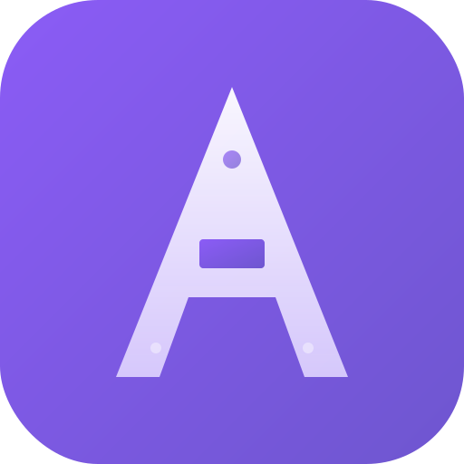

<p align="center">
  
</p>

<h1 align="center">Architex</h1>

<p align="center">
  <strong>The interactive engineering laboratory where you build architectures, simulate production traffic, inject failures, and learn from what breaks.</strong>
</p>

<p align="center">
  <a href="#getting-started"></a>
  <a href="#tech-stack"></a>
  <a href="#tech-stack"></a>
  <a href="#tech-stack"></a>
  <a href="#license"></a>
</p>

<p align="center">
  
  
  
  
</p>

<!-- Replace with an actual screenshot or GIF of the application -->
<p align="center">
  
</p>

---

## What is Architex?

Architex is a 1,300+ file Next.js platform with **13 interactive modules** covering the full spectrum of software engineering interviews --- from algorithms and data structures to system design, distributed consensus, and security. Unlike static study guides or passive video courses, Architex lets you **build real architectures on an interactive canvas, simulate production traffic through them, inject chaos events, and learn from what breaks.**

The platform features a **10-stage simulation engine** with 30+ chaos event types, 240+ algorithm implementations with step-by-step playback, 50+ animated data structure engines, FSRS-5 spaced repetition, AI-powered design review via Claude, and 12+ diagram export formats (Mermaid, PlantUML, Terraform, Draw.io, Excalidraw, and more).

**The gap nobody fills:** Interactive, scored system design practice with real-time simulation feedback. The market has content platforms (explain), code judges (test algorithms), and diagram tools (draw). Nobody offers all four: *simulation + education + interactive canvas + open source.*

> *"Architex is the only platform where engineers don't just study system design --- they build architectures, simulate production traffic, inject failures, and learn from what breaks, across 13 interactive modules from algorithms to distributed consensus to security, all open source."*

---

## Features

### Simulation Engine (the moat)

The core differentiator is a **production-grade simulation engine** that no competitor has replicated:

- **10-stage tick pipeline** --- traffic generation, BFS propagation, amplification, pressure calculation, issue detection, edge flow tracking, metrics collection, frame recording, cost modeling, and time-travel
- **30+ chaos events** across 10 categories: infrastructure, network, data corruption, traffic spikes, dependency failures, application bugs, security incidents, resource exhaustion, external outages, cache poisoning
- **Cascade engine** with circuit breakers, retries, and fallback propagation
- **Time-travel debugger** --- frame-by-frame recording with O(1) seek
- **Narrative engine** --- 20 causal templates that produce human-readable failure explanations
- **What-If engine** --- clone any topology, apply modifications, and run comparative simulations
- **Live cost model** --- per-node cost tracking during simulation across ~75 component types
- **Architecture diff** --- hot-reload topology changes without restarting simulation

### AI Infrastructure

- **Claude integration** with singleton client, concurrency queue (max 3 parallel), IndexedDB response cache, automatic retry, and cost tracking
- **Socratic tutor** --- 4-phase questioning (assess, challenge, guide, reinforce) with frustration detection
- **Design reviewer** --- 8 static analysis rules enriched by Claude, with auto-fix action suggestions
- **Architecture generator** --- 8 reference architectures plus Claude free-form generation
- **Progressive hint system** --- 4-tier hints with credit budget management
- **Interview scorer** --- 8-dimension evaluation with letter grade mapping
- **Diagram serializer** --- converts canvas state to AI-readable text for contextual analysis

### Learning System

- **FSRS-5 spaced repetition** --- state-of-the-art algorithm with 99.6% superiority over SM-2 and 20-30% fewer reviews
- **Walkthrough player** --- 4 checkpoint types (MCQ, click-class, fill-blank, order-steps) across 10 patterns with 30 checkpoints
- **30+ achievements** across 4 rarity tiers
- **Streak system and XP** tracking
- **Daily challenges** with adaptive difficulty scaling
- **Cross-module concept mapping** via knowledge graph

### Export System

12+ export formats: **Mermaid**, **PlantUML**, **Terraform**, **Draw.io**, **Excalidraw**, **C4**, **PNG**, **SVG**, **PDF**, **GIF**, **JSON**, **Shareable URL**

---

## Modules

| # | Module | What It Teaches | Key Visualizations | Status |
|---|--------|----------------|--------------------|--------|
| 1 | **System Design** | HLD architecture, scalability, reliability | React Flow canvas with 75+ node types, live simulation, chaos injection | Complete |
| 2 | **LLD / Design Patterns** | 36 GoF patterns, SOLID, UML | Class diagrams, sequence diagrams, state machines with A* edge routing | Complete |
| 3 | **Algorithms** | 240+ implementations across 8 categories | Graph traversal, DP tables, sorting races, tree animations | Complete |
| 4 | **Data Structures** | 50+ engines with step-by-step playback | B-Tree, Skip List, Bloom Filter, HyperLogLog, CRDTs, LSM Tree | Complete |
| 5 | **Database** | Indexing, query planning, transactions, replication | B-Tree internals, LSM compaction, MVCC, ARIES recovery, ER diagrams | Complete |
| 6 | **Distributed Systems** | Consensus, consistency, coordination | Raft, Paxos, CRDTs, vector clocks, gossip protocol, consistent hashing | Complete |
| 7 | **Networking** | Protocols, packet lifecycle, DNS, TLS | TCP state machine, TLS 1.3 handshake, ARP simulation, packet journey | Complete |
| 8 | **Operating Systems** | Scheduling, memory, synchronization | 6 CPU scheduling algorithms, page replacement, deadlock detection | Complete |
| 9 | **Concurrency** | Threading, synchronization, async patterns | Thread lifecycle, event loop, dining philosophers, producer-consumer | Complete |
| 10 | **Security** | Auth, encryption, attack vectors | OAuth flows, JWT internals, AES/DH, certificate chains, OWASP attacks | Complete |
| 11 | **ML Design** | Neural networks, pipelines, experimentation | Neural net trainer, CNN visualizer, A/B testing, multi-armed bandits | Complete |
| 12 | **Interview Prep** | Timed practice, scoring, review | Challenge catalog, AI scoring, FSRS review, progress dashboard | Complete |
| 13 | **Knowledge Graph** | Cross-module concept relationships | Force-directed concept graph with module bridges | Partial |

---

## Tech Stack

| Layer | Technology |
|-------|-----------|
| **Framework** | [Next.js 16](https://nextjs.org/) (App Router) |
| **UI** | [React 19](https://react.dev/), [TypeScript 5](https://www.typescriptlang.org/) |
| **Styling** | [Tailwind CSS 4](https://tailwindcss.com/), [Radix UI](https://www.radix-ui.com/) primitives, [CVA](https://cva.style/) |
| **State** | [Zustand 5](https://zustand-demo.pmnd.rs/) (12 stores), [Zundo](https://github.com/charkour/zundo) (undo/redo), [TanStack Query 5](https://tanstack.com/query) |
| **Canvas** | [React Flow](https://reactflow.dev/) (@xyflow/react), SVG, Canvas2D |
| **Layout** | [Dagre](https://github.com/dagrejs/dagre) (hierarchical auto-layout), custom A* orthogonal edge routing |
| **Animation** | [Motion](https://motion.dev/) (motion/react) |
| **Database** | [Drizzle ORM](https://orm.drizzle.team/), PostgreSQL via [Neon](https://neon.tech/) serverless |
| **Local Storage** | [Dexie](https://dexie.org/) (IndexedDB) for offline-first caching |
| **AI** | [Anthropic Claude](https://www.anthropic.com/) SDK |
| **Auth** | [Clerk](https://clerk.com/) (optional, conditional loading) |
| **Typography** | [Geist](https://vercel.com/font) (Sans + Mono) |
| **Icons** | [Lucide React](https://lucide.dev/) |
| **Panels** | [react-resizable-panels](https://github.com/bvaughn/react-resizable-panels) |
| **Code Highlighting** | [Prism React Renderer](https://github.com/FormidableLabs/prism-react-renderer) |
| **Command Palette** | [cmdk](https://cmdk.paco.me/) |
| **Compression** | [lz-string](https://github.com/pieroxy/lz-string) (URL state sharing) |
| **Workers** | [Comlink](https://github.com/GoogleChromeLabs/comlink) (Web Worker RPC) |
| **Testing** | [Vitest](https://vitest.dev/), [Testing Library](https://testing-library.com/), [Storybook 10](https://storybook.js.org/) |
| **Linting** | ESLint 9, Prettier, Husky + lint-staged |
| **Bundle Analysis** | [@next/bundle-analyzer](https://www.npmjs.com/package/@next/bundle-analyzer) |

---

## Getting Started

### Prerequisites

| Tool | Version | Install |
|------|---------|---------|
| **Node.js** | >= 20 | [nodejs.org](https://nodejs.org/) |
| **pnpm** | >= 9 | `corepack enable && corepack prepare pnpm@latest --activate` |
| **PostgreSQL** | 16 (optional) | Local install or [Neon](https://neon.tech/) cloud |

> **Zero-config mode:** The app runs locally with no environment variables. Database, auth, and AI features activate only when their respective keys are configured.

### Installation

```bash
# Clone the repository
git clone https://github.com/your-org/architex.git
cd architex

# Install dependencies
pnpm install

# Set up environment variables
cp .env.example .env.local
# Edit .env.local with your values (all optional)
```

### Environment Variables

All variables are optional. The app runs with zero config for local development.

| Variable | Description | Required For |
|----------|-------------|--------------|
| `DATABASE_URL` | PostgreSQL connection string (pooled) | DB-backed features |
| `DATABASE_URL_UNPOOLED` | PostgreSQL direct connection (migrations) | DB migrations |
| `NEXT_PUBLIC_CLERK_PUBLISHABLE_KEY` | Clerk authentication publishable key | User auth |
| `CLERK_SECRET_KEY` | Clerk authentication secret key | User auth |
| `ANTHROPIC_API_KEY` | Claude API key (`sk-ant-...`) | AI features |
| `NEXT_PUBLIC_POSTHOG_KEY` | PostHog analytics key | Analytics |
| `NEXT_PUBLIC_POSTHOG_HOST` | PostHog instance URL | Analytics |
| `SENTRY_DSN` | Sentry error tracking DSN | Error tracking |
| `RESEND_API_KEY` | Resend email API key | Transactional email |
| `INNGEST_SIGNING_KEY` | Inngest background jobs key | Background jobs |
| `NEXT_PUBLIC_APP_URL` | Application base URL | OG images, SEO |

### Database Setup

<details>
<summary><strong>Option A: Neon (recommended for quick start)</strong></summary>

1. Sign up at [neon.tech](https://neon.tech/)
2. Create a new project
3. Copy the **pooled** connection string to `DATABASE_URL` in `.env.local`
4. Copy the **direct** connection string to `DATABASE_URL_UNPOOLED`

</details>

<details>
<summary><strong>Option B: Local PostgreSQL</strong></summary>

```bash
# macOS
brew install postgresql@16
brew services start postgresql@16
createdb architex_dev

# Add to .env.local:
# DATABASE_URL=postgresql://localhost:5432/architex_dev
```

</details>

### Push Schema and Seed Data

```bash
# Create all database tables (14 schema files)
pnpm db:push

# Seed content for all modules (20 seed modules)
pnpm db:seed

# Or seed a specific module
pnpm db:seed -- --module=lld
pnpm db:seed -- --module=algorithms
pnpm db:seed -- --module=system-design
pnpm db:seed -- --module=distributed
```

<details>
<summary><strong>All available seed modules</strong></summary>

`lld`, `system-design`, `algorithms`, `data-structures`, `database`, `networking`, `security`, `distributed`, `os`, `ml-design`, `concurrency`, `pattern-walkthroughs`, `pattern-walkthroughs-remaining`, `interview-qa`, `interview-qa-remaining`, `fix-confused-with`, `fix-prediction-prompts`, `quizzes`, `walkthrough-checkpoints`, `content-quality-fixes`, `java-code-gen`

</details>

### Run the Development Server

```bash
pnpm dev
```

Open [http://localhost:3000](http://localhost:3000) to see Architex.

### Other Useful Commands

```bash
# Open the database GUI
pnpm db:studio

# Launch Storybook for component development
pnpm storybook

# Analyze the production bundle
pnpm analyze

# Scaffold a new algorithm implementation
pnpm scaffold:algorithm

# Scaffold a new DB-backed module
pnpm scaffold:db-mode
```

---

## Available Scripts

| Command | Description |
|---------|-------------|
| `pnpm dev` | Start the Next.js development server |
| `pnpm build` | Create an optimized production build |
| `pnpm start` | Start the production server |
| `pnpm lint` | Run ESLint across the codebase |
| `pnpm typecheck` | Run TypeScript type checking (no emit) |
| `pnpm format` | Format all source files with Prettier |
| `pnpm format:check` | Check formatting without writing |
| `pnpm test` | Run Vitest in watch mode |
| `pnpm test:run` | Run Vitest once (CI mode) |
| `pnpm storybook` | Start Storybook on port 6006 |
| `pnpm analyze` | Production build with bundle analysis |
| `pnpm db:generate` | Generate Drizzle migration files |
| `pnpm db:migrate` | Run pending database migrations |
| `pnpm db:push` | Push schema directly to the database |
| `pnpm db:studio` | Open Drizzle Studio (database GUI) |
| `pnpm db:seed` | Seed all content modules |
| `pnpm scaffold:db-mode` | Scaffold a new DB-backed module |
| `pnpm scaffold:algorithm` | Scaffold a new algorithm implementation |

---

## Project Structure

```
architex/
├── src/
│   ├── app/                        # Next.js App Router
│   │   ├── (auth)/                 # Authentication routes
│   │   ├── algorithms/             # Algorithm explorer pages
│   │   ├── api/                    # 20 API route groups
│   │   │   ├── ai/                 #   Claude AI endpoints
│   │   │   ├── challenges/         #   Challenge management
│   │   │   ├── diagrams/           #   Diagram CRUD
│   │   │   ├── evaluate/           #   AI evaluation
│   │   │   ├── review/             #   Design review
│   │   │   ├── simulations/        #   Simulation state
│   │   │   └── ...                 #   14 more route groups
│   │   ├── dashboard/              # User dashboard
│   │   ├── gallery/                # Community gallery
│   │   ├── interviews/             # Interview prep
│   │   ├── modules/                # Module pages
│   │   └── ...
│   │
│   ├── components/                 # React components
│   │   ├── modules/                # 13 interactive module UIs
│   │   │   ├── algorithm/          #   Sorting, graph, DP visualizers
│   │   │   ├── concurrency/        #   Thread lifecycle, philosophers
│   │   │   ├── data-structures/    #   50+ animated DS engines
│   │   │   ├── database/           #   B-Tree, MVCC, query plan UIs
│   │   │   ├── distributed/        #   Raft, CRDT, vector clock UIs
│   │   │   ├── interview/          #   Challenge UI, scoring
│   │   │   ├── lld/                #   UML canvas, walkthroughs
│   │   │   ├── ml-design/          #   Neural net, pipeline builder
│   │   │   ├── networking/         #   TCP, DNS, TLS visualizers
│   │   │   ├── os/                 #   Scheduling, memory, deadlock
│   │   │   ├── security/           #   OAuth, JWT, attack demos
│   │   │   └── ...
│   │   ├── canvas/                 # Canvas infrastructure
│   │   │   ├── nodes/              #   System design + database nodes
│   │   │   ├── edges/              #   Edge types and routing
│   │   │   ├── overlays/           #   Simulation overlays
│   │   │   └── panels/             #   Canvas side panels
│   │   ├── shared/                 # Reusable UI components
│   │   ├── simulation/             # Simulation control UI
│   │   ├── ui/                     # Base UI primitives (Radix)
│   │   └── ...
│   │
│   ├── lib/                        # Core logic (50+ subdirectories)
│   │   ├── simulation/             # Simulation engine (27 files)
│   │   │   ├── simulation-orchestrator.ts   # 10-stage tick pipeline
│   │   │   ├── chaos-engine.ts              # 30+ chaos events
│   │   │   ├── cascade-engine.ts            # Failure propagation
│   │   │   ├── narrative-engine.ts          # Human-readable explanations
│   │   │   ├── what-if-engine.ts            # Comparative simulation
│   │   │   ├── time-travel.ts               # Frame recording + seek
│   │   │   ├── cost-model.ts                # Live cost tracking
│   │   │   ├── metrics-collector.ts         # Percentiles, throughput
│   │   │   ├── pressure-counters.ts         # 35 named counters
│   │   │   └── ...
│   │   ├── algorithms/             # 240+ implementations
│   │   │   ├── sorting/            #   Quick, Merge, Heap, Tim, Radix, ...
│   │   │   ├── graph/              #   BFS, DFS, Dijkstra, Tarjan SCC, ...
│   │   │   ├── tree/               #   BST, AVL, Red-Black, B-Tree, Trie, ...
│   │   │   ├── dp/                 #   LCS, Edit Distance, Knapsack, ...
│   │   │   ├── string/             #   KMP, Rabin-Karp, Boyer-Moore, ...
│   │   │   ├── backtracking/       #   N-Queens, Sudoku, Knight's Tour, ...
│   │   │   └── patterns/           #   Sliding Window, Two Pointers, ...
│   │   ├── data-structures/        # 50+ engines (47 files)
│   │   ├── lld/                    # Patterns, problems, codegen, UML
│   │   ├── ai/                     # Claude client, tutor, reviewer (16 files)
│   │   ├── distributed/            # Raft, Paxos, CRDTs, vector clocks
│   │   ├── database/               # B-Tree viz, MVCC, query plans
│   │   ├── networking/             # TCP, TLS, DNS, ARP, WebSocket
│   │   ├── os/                     # Scheduling, memory, deadlock, sync
│   │   ├── concurrency/            # Philosophers, event loop, mutex
│   │   ├── security/               # OAuth, JWT, AES, DH, attacks
│   │   ├── ml-design/              # Neural nets, CNN, optimizers
│   │   ├── export/                 # 12+ export formats (15 files)
│   │   ├── interview/              # Challenges, scoring, SRS
│   │   ├── knowledge-graph/        # Cross-module concept mapping
│   │   ├── visualization/          # Canvas renderer, Sankey, colors
│   │   ├── fsrs.ts                 # FSRS-5 spaced repetition
│   │   └── ...
│   │
│   ├── stores/                     # Zustand state (12 stores)
│   │   ├── ui-store.ts             #   Module selection, theme, panels
│   │   ├── canvas-store.ts         #   Nodes, edges, selections
│   │   ├── simulation-store.ts     #   Simulation lifecycle + metrics
│   │   ├── editor-store.ts         #   Code editor state
│   │   ├── interview-store.ts      #   Challenge progress, scoring
│   │   ├── progress-store.ts       #   User progress, streaks, XP
│   │   ├── viewport-store.ts       #   Zoom, pan, viewport culling
│   │   └── ...
│   │
│   ├── db/                         # Database layer
│   │   ├── schema/                 #   14 Drizzle schema files
│   │   └── seeds/                  #   20 seed modules
│   │
│   ├── hooks/                      # 34 custom React hooks
│   ├── contexts/                   # React context providers
│   ├── providers/                  # TanStack Query provider
│   ├── types/                      # Shared TypeScript types
│   └── styles/                     # Global styles
│
├── docs/                           # Research and documentation
│   ├── research-findings/          #   50+ agent research outputs
│   ├── demos/                      #   Interactive HTML demos
│   ├── architecture/               #   Architecture decision records
│   ├── design/                     #   Visual design specs
│   ├── guides/                     #   Development guides
│   └── ...
│
├── scripts/                        # Build and scaffold scripts
├── public/                         # Static assets, PWA manifest
└── .storybook/                     # Storybook configuration
```

---

## Architecture

### Module System

Each of the 13 modules follows a consistent architecture:

```
Module
├── Component (ModuleName.tsx)        # Main UI with useModuleName() hook
├── Sub-components (module-name/)     # Module-specific panels, visualizers
├── Logic (lib/module-name/)          # Pure simulation/computation engines
├── Store (stores/*-store.ts)         # Zustand state slice (if needed)
├── Seeds (db/seeds/module-name.ts)   # Database seed data
└── API (app/api/*)                   # Server endpoints (if DB-backed)
```

Modules are lazy-loaded via the `ModuleRenderer` component. Each module exports a React component and a custom hook that encapsulates all module-specific state and logic.

### Simulation Engine

The simulation orchestrator runs a **10-stage tick pipeline** on each frame:

```
 1. Traffic Generation     Synthetic load based on TrafficConfig
 2. BFS Propagation        Requests flow through topology edges
 3. Amplification          Fan-out multipliers at load balancers, queues
 4. Pressure Calculation   35 counters: CPU, memory, queue depth, latency, ...
 5. Issue Detection        Threshold-based alerts from pressure values
 6. Edge Flow Tracking     Requests/sec per edge for particle rendering
 7. Metrics Collection     P50/P95/P99 latency, throughput, error rate
 8. Frame Recording        Snapshot for time-travel (O(1) seek via index)
 9. Cost Modeling          Per-node cloud cost from ~75 component types
10. Time Advance           Wall-clock or accelerated simulation time
```

The **ChaosEngine** injects failures at any point: kill a node, partition a network, corrupt data, spike traffic 10x, or trigger cascading failures through the **CascadeEngine** which models circuit breakers, retry storms, and fallback chains.

### Canvas Rendering

The design canvas uses **React Flow** (@xyflow/react) with:

- **75+ custom node types** --- compute, storage, messaging, ML, security, fintech
- **Dagre hierarchical auto-layout** for initial node positioning
- **A* orthogonal edge routing** that pathfinds around obstacles with bend penalties
- **Particle path cache** for animated data flow on edges
- **Viewport culling** via the viewport store for rendering performance

### AI Integration

Every AI feature is **canvas-aware** through the diagram serializer:

```
Canvas State  -->  serializeDiagramForAI()  -->  Structured Text  -->  Claude  -->  Contextual Response
```

The Socratic tutor sees what you have built and responds to your specific design. The reviewer identifies patterns in your actual topology, not generic examples. This tight coupling between canvas state and AI context is what makes the AI features impossible to replicate with a standalone chatbot.

---

## Research and Documentation

The project includes extensive research compiled from parallel agent runs:

| Document | Description |
|----------|-------------|
| [`ARCHITEX_PRODUCT_VISION.md`](ARCHITEX_PRODUCT_VISION.md) | Product strategy, competitive analysis, full roadmap |
| [`ARCHITEX_INTERVIEW_PREP_SPEC.md`](ARCHITEX_INTERVIEW_PREP_SPEC.md) | 350+ feature designs across 18 interview round types |
| [`LLD_CANVAS_PLAYBOOK.md`](LLD_CANVAS_PLAYBOOK.md) | Technical playbook for canvas, layout, and edge routing |
| [`docs/CONTENT_STRATEGY.md`](docs/CONTENT_STRATEGY.md) | Brand voice, copywriting guide, tone rules |
| [`docs/UI_DESIGN_SYSTEM_SPEC.md`](docs/UI_DESIGN_SYSTEM_SPEC.md) | Visual design system specification |
| [`docs/VISUAL_DESIGN_SPEC.md`](docs/VISUAL_DESIGN_SPEC.md) | Detailed visual design spec (colors, spacing, motion) |
| [`docs/MASTER-EXECUTION-PLAN.md`](docs/MASTER-EXECUTION-PLAN.md) | Phased execution plan with task breakdown |
| [`docs/research-findings/`](docs/research-findings/) | 50+ agent research outputs covering every module |

### Research Agents

The platform design was informed by **parallel research agents**, each covering a specific domain:

- **6 content agents** --- DSA, LLD, HLD, Database/Backend/Concurrency, OS/Net/DevOps/Cloud/Security, Debugging/Testing/Soft Skills
- **6 product vision agents** --- Vision, Competitive Moat, Simulation R&D, AI Features, Retention Science, Codebase Audit
- **10 design agents** --- Information Architecture, Visual Design, Component Architecture, Frontend Stack, Motion/Animation, Responsive/Mobile, Accessibility/i18n, Aesthetic Soul, Micro-interactions, Content/Copy

---

## Contributing

Contributions are welcome. Here is how to get started:

### Development Workflow

1. Fork the repository and create a feature branch
2. Install dependencies: `pnpm install`
3. Run the dev server: `pnpm dev`
4. Make your changes
5. Ensure linting passes: `pnpm lint`
6. Ensure types check: `pnpm typecheck`
7. Format your code: `pnpm format`
8. Run tests: `pnpm test:run`
9. Submit a pull request

### Code Style

- **TypeScript** strict mode --- no `any` unless absolutely necessary
- **Tailwind CSS 4** for all styling --- no inline styles, no CSS modules
- **Zustand** for state management --- thin stores, derived state via selectors
- **Pure logic in `lib/`** --- simulation engines and algorithms are framework-agnostic with zero React dependencies
- **Components in `components/`** --- React-specific UI code
- **Hooks in `hooks/`** --- reusable stateful logic extracted from components

### Commit Messages

Follow the [Conventional Commits](https://www.conventionalcommits.org/) format:

```
feat(simulation): add circuit breaker cascade propagation
fix(canvas): prevent edge routing through overlapping nodes
docs(readme): add contributing guidelines
refactor(stores): extract viewport logic into dedicated store
```

Pre-commit hooks (Husky + lint-staged) automatically run ESLint and Prettier on staged files.

### Pull Request Process

1. Ensure your branch is up to date with `main`
2. Write a clear description of what changed and why
3. Link any related issues
4. Ensure CI checks pass (lint, typecheck, tests)
5. Request review from a maintainer

---

## License

Architex is licensed under the [GNU Affero General Public License v3.0](LICENSE) (AGPL-3.0).

You are free to use, modify, and distribute this software under the terms of the AGPL-3.0. If you modify Architex and make it available over a network, you must also make the source code of your modifications available under the same license.

---

## Acknowledgments

### Research Foundations

The learning system is grounded in published cognitive science and education research:

- **Richard Mayer** --- Cognitive Theory of Multimedia Learning (2001, 2009)
- **John Sweller** --- Cognitive Load Theory (1988)
- **Robert Bjork** --- Desirable Difficulties framework (1994)
- **Allan Paivio** --- Dual Coding Theory (1986)
- **Manu Kapur** --- Productive Failure (2008)
- **Roediger & Karpicke** --- Testing Effect and retrieval practice (2006)
- **FSRS Benchmark** --- Free Spaced Repetition Scheduler evaluation (2024)
- **Sailer & Homner** --- Gamification meta-analysis (2019)
- **Duolingo Engineering Blog** --- Streak and retention optimization research (2024)

### Open Source

Architex is built on the shoulders of exceptional open source projects: [Next.js](https://nextjs.org/), [React](https://react.dev/), [React Flow](https://reactflow.dev/), [Zustand](https://github.com/pmndrs/zustand), [Drizzle ORM](https://orm.drizzle.team/), [Radix UI](https://www.radix-ui.com/), [Tailwind CSS](https://tailwindcss.com/), [Motion](https://motion.dev/), [Vitest](https://vitest.dev/), [Storybook](https://storybook.js.org/), [Lucide](https://lucide.dev/), and [many more](package.json).

---

<p align="center">
  <strong>Build it. Simulate it. Break it. Learn from it.</strong>
</p>
