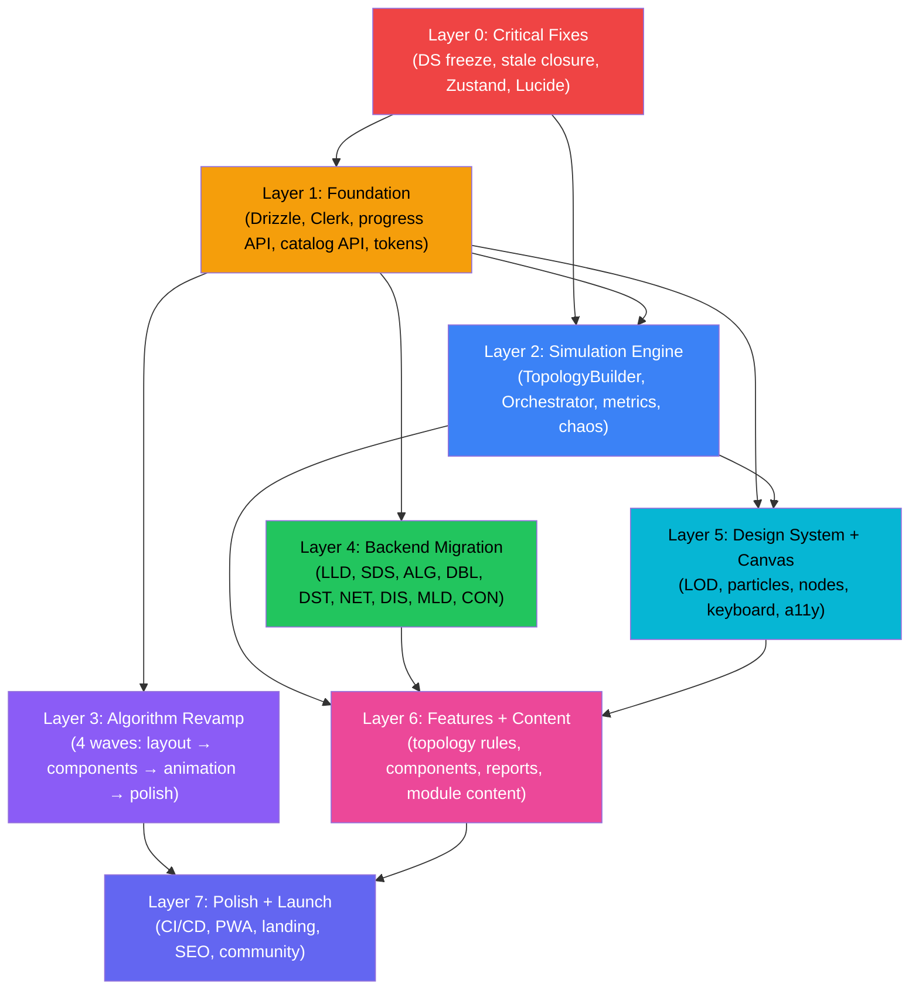

# ARCHITEX MASTER EXECUTION PLAN

```
═══════════════════════════════════════════════════════════════════
  ARCHITEX MASTER PLAN — QUICK REFERENCE
═══════════════════════════════════════════════════════════════════

  DOCUMENTS ANALYZED:   24 (11 backend + 7 UI/design + 7 architecture)
  TOTAL RECOMMENDATIONS: ~340 raw items extracted
  AFTER DEDUP:          ~87 unique actions
  ESTIMATED SESSIONS:   7 (Sessions 3-9, continuing from prior work)
  ESTIMATED TIME:       6-8 weeks

  TOP 5 PRIORITIES (by WSJF score):
    1. Run Drizzle migrations                    (score 13.0)
    2. Fix DS module browser freeze              (score  7.5)
    3. Build generic progress API                (score  7.5)
    4. Fix 500 renders/sec Zustand selector bug  (score  7.0)
    5. Activate Clerk auth                       (score  6.5)

  START WITH: Session 3 — "Critical Fixes + Foundation"
═══════════════════════════════════════════════════════════════════
```

**Generated:** 2026-04-13
**Method:** 4 parallel AI agents read all 24 analysis documents (~19,000 lines), extracted patterns, deduplicated, and scored by WSJF.
**Prior work:** Sessions 1-2 completed 856/1,157 tracked tasks (74%). This plan covers everything remaining.

---

## TABLE OF CONTENTS

1. [Executive Summary](#1-executive-summary)
2. [Documents Analyzed](#2-documents-analyzed)
3. [Common Patterns](#3-common-patterns-across-all-documents)
4. [Duplicates Eliminated](#4-duplicates-eliminated)
5. [Prioritized Recommendations (WSJF)](#5-prioritized-recommendations-wsjf)
6. [Layered Execution Plan](#6-layered-execution-plan)
7. [Session Breakdown](#7-session-breakdown)
8. [Dependency Graph](#8-dependency-graph)

---

## 1. EXECUTIVE SUMMARY

Architex is 74% task-complete but functionally incomplete in its flagship feature: the simulation engine is entirely unwired (2,000 lines of library code connected to nothing), 3 of 13 modules are effectively empty (Security, ML Design, Concurrency), and 15 wireframe screens are unbuilt. The 24 analysis documents converge on one insight: **build shared infrastructure once (DB, auth, progress API), then fill modules in parallel**. The backend docs have near-perfect consensus — same table pattern, same API pattern, same caching strategy across all 11 modules. The UI docs split cleanly into "do now" (REVAMP-FINAL) and "do someday" (stitch-reimagine). The most impactful single action is wiring the simulation engine; the highest ROI action is running Drizzle migrations (1 hour of work that unblocks everything).

---

## 2. DOCUMENTS ANALYZED

### Backend Migration (11 documents, ~8,700 lines)

| # | Document | Key Finding |
|---|----------|-------------|
| 1 | `algorithm-backend-analysis.md` | 83 algorithm configs (125 KB) → DB; engine stays client-side (27,470 lines) |
| 2 | `concurrency-backend-analysis.md` | 11 demos (33.5 KB) → generic concepts table; small enough to keep inline |
| 3 | `data-structures-backend-analysis.md` | 43 DS (138 KB) → dedicated ds_catalog table; DS_CATALOG barrel causes freeze |
| 4 | `database-backend-analysis.md` | 100 questions + 20 modes (131 KB) → 4 dedicated tables |
| 5 | `distributed-backend-analysis.md` | 11 simulations (52 KB) → generic concept_catalog; triple source-of-truth problem |
| 6 | `lld-backend-analysis.md` | 36 patterns + 33 problems (686 KB!) → 7 tables; biggest bundle savings |
| 7 | `ml-design-backend-analysis.md` | 3 pipelines (40 KB) → experiments table; daily challenges |
| 8 | `networking-backend-analysis.md` | 10 protocols (150 KB) → 7 tables; deep-dive content is rich |
| 9 | `os-concepts-backend-analysis.md` | 6 concepts (12 KB) → too small for DB; keep inline until >20 items |
| 10 | `security-backend-analysis.md` | 13 topics (66 KB) → P3 priority; keep inline for now |
| 11 | `system-design-backend-analysis.md` | Templates + chaos catalogs (678 KB) → 6 tables; second-biggest savings |

### UI/Design (7 documents, ~4,200 lines)

| # | Document | Key Finding |
|---|----------|-------------|
| 12 | `ALGORITHM-REVAMP-FINAL.md` | THE implementation spec: 4-wave plan (Layout → Components → Animation → Polish) |
| 13 | `algorithm-stitch-polish.md` | Pixel audit: 16 missing, 16 broken/ugly, 14 should-add items in current UI |
| 14 | `algorithm-stitch-reimagine.md` | Aspirational vision: semantic zoom, "You Are The Algorithm", Time Microscope concept |
| 15 | `algorithm-ui-spec.md` | Pixel-exact YAML specs: every component dimension, color, animation, a11y attribute |
| 16 | `algorithm-stitch-prompts.md` | 8 Google Stitch prompts for generating mockup screenshots |
| 17 | `database-visual-language.md` | Canonical SVG specs: node shapes, edge styles, operation-color map for all DB modes |
| 18 | `PLAYWRIGHT-AUDIT-RESULTS.md` | 3 bugs fixed, 10 remaining (celebration text, loading skeleton, keyboard shortcuts) |

### Architecture & General (7 documents, ~4,900 lines)

| # | Document | Key Finding |
|---|----------|-------------|
| 19 | `database-module.md` | 4,305-line monolith, 6 orphaned React Flow files to delete |
| 20 | `UI_DESIGN_SYSTEM_SPEC.md` | Linear/Figma-inspired specs: 22 new files, keyboard context, optimistic updates |
| 21 | `VISUAL_DESIGN_SPEC.md` | Pixel specs: 15 node mockups, 8 category colors, LOD system, edge particles |
| 22 | `PAPERDRAW_VS_ARCHITEX_ANALYSIS.md` | Gap: 107 vs 35 components, 741 AI topology rules, 35 pressure counters |
| 23 | `content-style-guide.md` | 6-section template: Hook → Analogy → UML → Code → Tradeoffs → Summary |
| 24 | `OS_CONTENT_GUIDE.md` | 8-section template with WHY steps + grading rubric (min 18/32 to ship) |
| 25 | `DS-MODULE-ANALYSIS.md` | Root cause: 24,000 lines loaded synchronously → 3-15s freeze |

---

## 3. COMMON PATTERNS ACROSS ALL DOCUMENTS

### Pattern A: Universal Backend Consensus (all 11 backend docs)

Every backend document independently reaches the same 8 conclusions:

1. **Keep ALL engine logic client-side.** Zero documents recommend moving computation to the server. Simulations run in <100ms, are real-time/interactive, and must stay in the browser.

2. **User progress → existing `progress` table.** All 11 modules write to localStorage via Zustand persist. All 11 recommend the same migration: move to the `progress` table (userId + moduleId + conceptId + score) that already exists in `src/db/schema/progress.ts` but has never been migrated.

3. **Catalog/content → database.** 10 of 11 modules (all except OS Concepts at 12 KB) recommend moving their catalog data to a DB. The common shape: `id, moduleId, name, description, difficulty, category, content(JSONB), sortOrder, createdAt, updatedAt`.

4. **ISR-cached public API + auth-gated progress API.** Every document recommends: public catalog endpoints with ISR 1-24 hours (no auth), user progress endpoints with Clerk auth (no cache).

5. **Clerk auth is prerequisite.** Configured but commented out. All progress APIs require it.

6. **Drizzle migrations never run.** 8 table schemas exist in `src/db/schema/`, zero have been migrated to the database.

7. **SWR/React Query replaces static imports.** Replace `import { CATALOG } from ...` with `useSWR("/api/{module}/catalog")` + skeleton loading.

8. **localStorage as offline fallback.** 8 of 11 docs recommend dual-write: instant localStorage + async POST to API.

### Pattern B: Universal UI Consensus (all 7 UI/design docs)

1. **CSS variables only** — never hardcode colors
2. **Spring physics via motion/react** — never CSS transitions for complex animations
3. **`useReducedMotion()` fallback** — every animation has one
4. **Zustand primitive selectors** — never `(s) => ({ x: s.x, y: s.y })`
5. **Glassmorphism aesthetic** — `backdrop-filter: blur(12px) saturate(150%)`
6. **Split god components** — sidebar (2,000+ lines) → 3 focused sub-components

### Pattern C: Infrastructure Prerequisites (all 24 docs)

Every document, regardless of category, depends on these 3 items:
1. Drizzle migrations (creates tables)
2. Clerk auth (enables user-scoped data)
3. Generic progress API (enables cross-module tracking)

---

## 4. DUPLICATES ELIMINATED

| Recommendation | Found In | Merged Into |
|---------------|----------|-------------|
| "Move catalog to DB" | 10 backend docs | ONE task: Generic catalog API + per-module seed scripts |
| "Move progress to DB" | 11 backend docs | ONE task: Generic progress API |
| "Run Drizzle migrations" | 11 backend docs + infra audit | ONE task: `pnpm drizzle-kit generate && pnpm drizzle-kit migrate` |
| "Activate Clerk auth" | 11 backend docs | ONE task: Uncomment ClerkProvider + middleware + webhook |
| "Add loading skeletons" | UI spec + algorithm revamp + Playwright audit | ONE task: Skeleton loading component in design system |
| "Fix Zustand selectors" | Audit bugs + UI spec + design docs | ONE task: Replace object-creating selectors with primitives |
| "Add reduced motion" | All 7 UI docs | ONE task: `useReducedMotion()` hook + CSS fallbacks |
| "Fix celebration text" | Playwright audit + algorithm revamp | ONE task: Context-aware celebration messages |
| "Add design tokens" | UI spec + visual spec + algorithm spec + DB visual lang | ONE comprehensive task: shadows, typography, spacing, motion |
| "Split sidebar component" | Revamp + polish + reimagine | ONE task: AlgorithmPanel → Picker + Config + Description |
| "Float transport bar" | Revamp + polish | ONE task: Extract PlaybackTransport to canvas bottom |
| "Keyboard shortcut system" | UI spec + algorithm revamp | ONE task: Keyboard context system + shortcut sheet |
| "SWR replace static imports" | 11 backend docs | ONE task: useCatalog/useProgress hook pattern |
| "Seed script infrastructure" | 11 backend docs | ONE task: `src/db/seeds/{module}.ts` + `pnpm db:seed` |

**Raw items: ~340 → After dedup: ~87 unique actions**

---

## 5. PRIORITIZED RECOMMENDATIONS (WSJF)

**Scoring: (Impact × 2 + Urgency) / Effort** — higher = do first.

### Tier 1: Do NOW (Score ≥ 6.0)

| # | Action | Impact | Effort | Urgency | Score | Layer |
|---|--------|--------|--------|---------|-------|-------|
| 1 | Run Drizzle migrations | 4 | 1 | 5 | **13.0** | 1 |
| 2 | Fix DS module browser freeze (lazy imports) | 5 | 2 | 5 | **7.5** | 0 |
| 3 | Build generic progress API | 5 | 2 | 5 | **7.5** | 1 |
| 4 | Fix 500 renders/sec Zustand selector bug | 5 | 2 | 4 | **7.0** | 0 |
| 5 | Activate Clerk auth | 4 | 2 | 5 | **6.5** | 1 |
| 6 | Fix stale closure in DesignCanvas.onConnect | 5 | 1 | 4 | **14.0** | 0 |
| 7 | Fix JSON.parse crash in onDrop | 5 | 1 | 4 | **14.0** | 0 |
| 8 | Fix style tag injection in DataFlowEdge | 4 | 1 | 4 | **12.0** | 0 |
| 9 | Bound metricsHistory array (memory leak) | 4 | 1 | 4 | **12.0** | 0 |
| 10 | Fix Lucide barrel import (~500KB) | 4 | 1 | 3 | **11.0** | 0 |

### Tier 2: Do This Week (Score 4.0–5.9)

| # | Action | Impact | Effort | Urgency | Score | Layer |
|---|--------|--------|--------|---------|-------|-------|
| 11 | Split algorithm sidebar god component | 4 | 2 | 3 | **5.5** | 3 |
| 12 | Float transport bar to canvas bottom | 4 | 2 | 3 | **5.5** | 3 |
| 13 | Build SWR data hooks pattern | 4 | 2 | 4 | **6.0** | 1 |
| 14 | Generic catalog API route | 5 | 3 | 4 | **4.7** | 1 |
| 15 | Design system tokens (shadows/typography/spacing) | 4 | 3 | 3 | **3.7** | 1 |
| 16 | Skeleton loading component | 3 | 1 | 3 | **9.0** | 1 |
| 17 | Error boundary improvements | 3 | 2 | 3 | **4.5** | 1 |
| 18 | Dual-write localStorage/API hook | 4 | 2 | 3 | **5.5** | 1 |
| 19 | Seed script infrastructure | 3 | 2 | 4 | **5.0** | 1 |

### Tier 3: Do This Sprint (Score 2.5–3.9)

| # | Action | Impact | Effort | Urgency | Score | Layer |
|---|--------|--------|--------|---------|-------|-------|
| 20 | Wire simulation engine (TopologyBuilder + Orchestrator) | 5 | 5 | 5 | **3.0** | 2 |
| 21 | Simulation metrics pipeline | 5 | 4 | 4 | **3.5** | 2 |
| 22 | Simulation visual state mapping | 4 | 3 | 4 | **4.0** | 2 |
| 23 | Chaos integration UI | 4 | 3 | 3 | **3.7** | 2 |
| 24 | Capacity planner UI | 3 | 3 | 3 | **3.0** | 2 |
| 25 | Mount ExportDialog + TemplateGallery | 3 | 1 | 3 | **9.0** | 2 |
| 26 | Algorithm UI Wave 1 (layout revolution) | 4 | 3 | 3 | **3.7** | 3 |
| 27 | Algorithm UI Wave 2 (components) | 4 | 3 | 3 | **3.7** | 3 |
| 28 | Database visual language implementation | 3 | 3 | 2 | **2.7** | 5 |
| 29 | LOD system (3 zoom tiers) | 4 | 4 | 3 | **2.75** | 5 |
| 30 | Edge particle system | 3 | 3 | 2 | **2.7** | 5 |
| 31 | Node anatomy (data-rich with 5+ metrics) | 4 | 3 | 3 | **3.7** | 5 |
| 32 | Keyboard context system | 4 | 3 | 3 | **3.7** | 5 |
| 33 | Accessibility basics (roles, labels, skip links) | 4 | 3 | 4 | **4.0** | 5 |

### Tier 4: Do This Month (Score 1.5–2.4)

| # | Action | Impact | Effort | Urgency | Score | Layer |
|---|--------|--------|--------|---------|-------|-------|
| 34 | Backend migration: LLD content to DB (686 KB savings) | 4 | 3 | 2 | **3.3** | 4 |
| 35 | Backend migration: System Design content (509 KB) | 4 | 3 | 2 | **3.3** | 4 |
| 36 | Backend migration: Algorithms catalog (125 KB) | 3 | 2 | 2 | **4.0** | 4 |
| 37 | Backend migration: Data Structures catalog (72 KB) | 3 | 2 | 2 | **4.0** | 4 |
| 38 | Backend migration: Database modes + challenges (131 KB) | 3 | 3 | 2 | **2.7** | 4 |
| 39 | Backend migration: Networking protocols (74 KB) | 3 | 3 | 2 | **2.7** | 4 |
| 40 | Topology-aware simulation rules (PaperDraw parity) | 5 | 5 | 3 | **2.6** | 6 |
| 41 | 25+ new system design component types | 4 | 4 | 2 | **2.5** | 6 |
| 42 | Post-simulation report generation | 4 | 3 | 2 | **3.3** | 6 |
| 43 | Cross-module integration bridges | 3 | 4 | 2 | **2.0** | 6 |
| 44 | Landing page + onboarding | 3 | 3 | 2 | **2.7** | 6 |
| 45 | SEO programmatic pages (270+) | 3 | 3 | 2 | **2.7** | 6 |

### Tier 5: Backlog (Score < 1.5 or very large effort)

| # | Action | Impact | Effort | Urgency | Score | Layer |
|---|--------|--------|--------|---------|-------|-------|
| 46 | Security module full content (227 tasks) | 3 | 5 | 1 | **1.4** | 6 |
| 47 | ML Design module full content (222 tasks) | 3 | 5 | 1 | **1.4** | 6 |
| 48 | Concurrency module remaining (249 tasks) | 3 | 5 | 1 | **1.4** | 6 |
| 49 | Interview engine AI integration | 4 | 5 | 2 | **2.0** | 6 |
| 50 | 35 innovation features | 3 | 5 | 1 | **1.4** | 7 |
| 51 | CI/CD pipeline | 3 | 3 | 2 | **2.7** | 7 |
| 52 | PWA + service worker | 2 | 3 | 1 | **1.7** | 7 |
| 53 | 17 Inngest background jobs | 3 | 4 | 1 | **1.75** | 7 |
| 54 | 13 email templates (Resend) | 2 | 3 | 1 | **1.7** | 7 |
| 55 | Community gallery + collaboration | 3 | 4 | 1 | **1.75** | 7 |
| 56 | Semantic zoom (aspirational) | 4 | 5 | 1 | **1.8** | 7 |
| 57 | "You Are The Algorithm" interactive welcome | 3 | 3 | 1 | **2.3** | 7 |

---

## 6. LAYERED EXECUTION PLAN

### Layer 0: CRITICAL FIXES (do before anything else)

Things that are **broken** and blocking development or causing crashes/freezes.

| # | Fix | Files | Effort | Unblocks |
|---|-----|-------|--------|----------|
| 0.1 | Fix DS module browser freeze — dynamic import hook, split barrel into per-DS lazy imports, lazy-load visualizers, extract DS_CATALOG | `src/components/modules/DataStructuresModule.tsx`, `src/lib/data-structures/index.ts` | M | DS module usable |
| 0.2 | Fix stale closure in `DesignCanvas.onConnect` — edges captured in closure | `src/components/canvas/DesignCanvas.tsx` | S | Edge connections work |
| 0.3 | Fix JSON.parse crash in `onDrop` — add try-catch | `src/components/canvas/DesignCanvas.tsx` | S | Drag-drop stable |
| 0.4 | Fix style tag injection in DataFlowEdge — move to CSS module or global | `src/components/edges/DataFlowEdge.tsx` | S | Render perf |
| 0.5 | Fix 500 renders/sec — Zustand selectors creating new object references | Multiple store consumers | M | UI performance |
| 0.6 | Fix Lucide barrel import in ComponentPalette — tree-shake | `src/components/panels/ComponentPalette.tsx` | S | -500KB bundle |
| 0.7 | Bound metricsHistory array — add circular buffer or max length | `src/stores/simulation-store.ts` | S | No memory leak |
| 0.8 | Fix celebration text — "Sorted!" → context-aware messages | `src/components/canvas/overlays/SortCelebration.tsx` | S | Correct UX |
| 0.9 | Delete 6 orphaned React Flow database component files | `src/components/nodes/db-*.tsx` (6 files) | S | Clean codebase |

**Estimated effort: 1-2 days. Zero dependencies.**

---

### Layer 1: FOUNDATION (shared infrastructure — build once, use everywhere)

Everything else depends on these items.

| # | Task | Files | Effort | Unblocks |
|---|------|-------|--------|----------|
| 1.1 | Run Drizzle migrations — `pnpm drizzle-kit generate && pnpm drizzle-kit migrate` | `drizzle.config.ts`, `src/db/schema/*.ts` | S | All DB-dependent work |
| 1.2 | Create `src/db/index.ts` — Neon database client (doesn't exist yet) | `src/db/index.ts` | S | All API routes |
| 1.3 | Activate Clerk auth — uncomment ClerkProvider in layout, add middleware, set up webhook for user sync to `users` table | `src/app/layout.tsx`, `src/middleware.ts`, `src/app/api/webhooks/clerk/route.ts` | M | All auth-gated APIs |
| 1.4 | Generic progress API — `GET/POST /api/progress?moduleId=X` using existing progress table | `src/app/api/progress/route.ts` | M | All 11 modules' progress tracking |
| 1.5 | Generic catalog API — `GET /api/catalog?moduleId=X` for simple modules (<50 items) | `src/app/api/catalog/route.ts` | M | Concurrency, Distributed, Security, OS modules |
| 1.6 | SWR data hooks — `useCatalog(moduleId)`, `useConceptDetail(moduleId, id)`, `useProgress(moduleId)` | `src/hooks/use-catalog.ts`, `src/hooks/use-progress.ts` | M | All modules using API data |
| 1.7 | Dual-write hook — `usePersistWithSync()` writes localStorage + async POST | `src/hooks/use-persist-with-sync.ts` | M | Offline-first UX |
| 1.8 | Skeleton loading component — reusable shimmer for all loading states | `src/components/ui/skeleton.tsx` | S | All data-loading UIs |
| 1.9 | Design system tokens — add to globals.css: 5 shadows, 6-step typography scale, motion tokens | `src/styles/globals.css`, `src/lib/constants/motion.ts` | M | All UI work |
| 1.10 | Seed script infrastructure — `src/db/seeds/{module}.ts` pattern + `pnpm db:seed` | `src/db/seeds/`, `package.json` | M | Backend migration |
| 1.11 | Error boundary improvements — wrap each module | `src/components/shared/ErrorBoundary.tsx` | S | Crash resilience |

**Estimated effort: 1 week. Dependencies: Layer 0 must be done first.**

---

### Layer 2: SIMULATION ENGINE WIRING (the flagship feature)

The #1 feature gap. 2,000 lines of library code exist but none is connected to the UI.

| # | Task | Files | Effort | Unblocks |
|---|------|-------|--------|----------|
| 2.1 | TopologyBuilder — extract graph structure from canvas nodes/edges into SimTopology | `src/lib/system-design/topology-builder.ts` | M | Orchestrator |
| 2.2 | SimulationOrchestrator — core class with start/pause/resume/stop/reset lifecycle | `src/lib/system-design/orchestrator.ts` | L | Everything simulation |
| 2.3 | processTick() core loop — traffic gen → request routing through graph → queuing model at each node | Inside orchestrator | L | Simulation runs |
| 2.4 | Wire orchestrator to simulation-store — play() builds topology and starts orchestrator | `src/stores/simulation-store.ts` | M | Play button works |
| 2.5 | Metrics pipeline — MetricsCollector output → store → 5 chart components | `src/stores/simulation-store.ts`, chart components | M | Metrics visible |
| 2.6 | Visual state mapping — node utilization % → border color (green/amber/red) | `src/components/nodes/BaseNode.tsx` | M | Nodes show health |
| 2.7 | Edge animation — speed/width proportional to throughput during simulation | `src/components/edges/DataFlowEdge.tsx` | M | Edges show traffic |
| 2.8 | ChaosPanel UI — inject/remove chaos events during simulation | `src/components/panels/ChaosPanel.tsx` | M | Chaos testing |
| 2.9 | CapacityPlannerPanel — input form + "Apply to Canvas" + real-time cost | `src/components/panels/CapacityPlannerPanel.tsx` | M | Capacity planning |
| 2.10 | Mount ExportDialog — add trigger button, wire to toolbar | `src/components/canvas/DesignCanvas.tsx` | S | Export works |
| 2.11 | Mount TemplateGallery — add trigger button, wire to toolbar | `src/components/canvas/DesignCanvas.tsx` | S | Templates work |
| 2.12 | Console logging — timestamped simulation events in BottomPanel console tab | `src/components/panels/BottomPanel.tsx` | S | Debugging visible |
| 2.13 | Undo/redo keyboard shortcuts — wire zundo to Cmd+Z/Cmd+Shift+Z | `src/hooks/use-keyboard-shortcuts.ts` | S | Undo works |

**Estimated effort: 2-3 weeks. Dependencies: Layer 0 items 0.2-0.4, 0.5, 0.7.**

---

### Layer 3: ALGORITHM VISUALIZER REVAMP (the most-designed module)

4 waves from ALGORITHM-REVAMP-FINAL.md. Most components already exist but need restructuring.

| Wave | Tasks | Effort |
|------|-------|--------|
| **Wave 1: Layout Revolution** | Split AlgorithmPanel → Picker + Config + Description; float PlaybackTransport to canvas bottom (wire TimelineScrubber); unify 8 empty states into AlgorithmWelcome; fix ColorMap height 120→400px; add text labels to ViewToggle | M |
| **Wave 2: Components** | Toolbar: 3 visible + overflow menu; step description: visual links to active bars; Properties panel → LiveDashboard during playback; bottom panel: 4 tabs (remove dead tabs); Race mode: prominent button in transport | M |
| **Wave 3: Animation** | Per-algorithm choreography configs (graph/tree/DP); sound for non-sorting algorithms; celebration for all types (fix "Sorted!" bug); animated number transitions on counters | M |
| **Wave 4: Polish** | Loading skeletons on switch; tooltips everywhere; keyboard shortcut sheet (Cmd+/); mobile layout with bottom tab bar; remove dead code | M |

**Estimated effort: 2 weeks. Dependencies: Layer 1 item 1.9 (design tokens).**

---

### Layer 4: BACKEND MIGRATION (per module, parallelizable)

Move content from frontend to DB. Build seed scripts, update components to fetch via SWR.

| Priority | Module | Content Size | New Tables | Bundle Savings | Effort |
|----------|--------|-------------|------------|----------------|--------|
| P1 | LLD | 686 KB | 7 tables (patterns, problems, demos, quiz, sequences, state machines, relations) | ~686 KB | L |
| P1 | System Design | 678 KB | 6 tables (chaos_events, topology_rules, issue_types, costs, narratives, pressures) | ~509 KB | L |
| P1 | Algorithms | 125 KB | 7 tables (algorithms, prerequisites, scores, review_cards, learning_paths, path_algorithms, sample_inputs) | ~177 KB | L |
| P2 | Database Design | 131 KB | 4 tables (challenges, modes, mode_content, progress) | ~131 KB | M |
| P2 | Data Structures | 138 KB | 4 tables (ds_catalog, attempts, user_state, challenges) | ~90 KB | M |
| P2 | Networking | 150 KB | 7 tables (protocol_catalog, deep_dive, srs_cards, api_comparison, qualitative, scenarios, dns_zone) | ~74 KB | M |
| P2 | Distributed | 52 KB | 1 table (concept_catalog, generic) | ~52 KB | S |
| P3 | ML Design | 40 KB | 3 tables (experiments, daily_challenges, completions) | ~15 KB | M |
| P3 | Concurrency | 33.5 KB | Use generic concepts table | ~34 KB | S |
| Skip | OS Concepts | 12 KB | None (too small) | 0 | — |
| Skip | Security | 66 KB | None (P3, keep inline) | 0 | — |

**Total bundle savings: ~1.8 MB raw content moved to API**

**Estimated effort: 2-3 weeks (parallelizable across modules). Dependencies: Layer 1 items 1.1-1.6, 1.10.**

---

### Layer 5: DESIGN SYSTEM + CANVAS POLISH

Implement the visual specs from UI_DESIGN_SYSTEM_SPEC.md and VISUAL_DESIGN_SPEC.md.

| # | Task | Source Doc | Effort |
|---|------|-----------|--------|
| 5.1 | Database visual language — SVG specs for B-Tree, Hash Index, LSM-Tree, Query Plan, ER | `database-visual-language.md` | M |
| 5.2 | LOD system — 3 zoom tiers (full >60%, simplified 30-60%, dot <30%) with 5% hysteresis | `VISUAL_DESIGN_SPEC.md` | M |
| 5.3 | Edge particle system — throughput-encoded particles (1-8), latency-encoded speed | `VISUAL_DESIGN_SPEC.md` | M |
| 5.4 | Node anatomy — 3-zone BaseNode (header 32px, body auto, footer 24px), 3 sizes, 6 states | `VISUAL_DESIGN_SPEC.md` | M |
| 5.5 | 8 category colors — compute blue, storage green, messaging orange, etc. | `VISUAL_DESIGN_SPEC.md` | S |
| 5.6 | Keyboard context system — global/canvas/panel/dialog/text-input scoping | `UI_DESIGN_SYSTEM_SPEC.md` | M |
| 5.7 | Command palette expansion — modes (> commands, # templates, @ nodes, / settings) | `UI_DESIGN_SYSTEM_SPEC.md` | M |
| 5.8 | Smart alignment guides — magenta dashed lines at 5px snap threshold | `UI_DESIGN_SYSTEM_SPEC.md` | M |
| 5.9 | Auto-layout via dagre — 4 algorithms, 500ms animated transitions | `UI_DESIGN_SYSTEM_SPEC.md` | M |
| 5.10 | Accessibility — VoiceOver roles/labels, focus management, skip links, high contrast | `UI_DESIGN_SYSTEM_SPEC.md` | L |

**Estimated effort: 2 weeks. Dependencies: Layer 1 item 1.9, Layer 2 items 2.6-2.7.**

---

### Layer 6: FEATURES + COMPETITIVE PARITY

New capabilities that differentiate Architex from PaperDraw and competitors.

| # | Task | Source | Effort |
|---|------|--------|--------|
| 6.1 | Topology-aware simulation rules — profile signatures, 50 initial profiles, Claude API for new topologies | PaperDraw analysis | L |
| 6.2 | 25+ new component types — services, network containers, fintech, data engineering, AI/LLM | PaperDraw analysis | L |
| 6.3 | Post-simulation reports — auto-generated markdown with incident timeline, root cause, recommendations | PaperDraw analysis | M |
| 6.4 | Formal issue taxonomy — 50+ named issue types (not just metric thresholds) | PaperDraw analysis | M |
| 6.5 | Expand pressure counters to 20+ per component | PaperDraw analysis | M |
| 6.6 | Real-time cost calculator (always visible) | PaperDraw analysis | M |
| 6.7 | Cross-module integration bridges | Research finding #15 | L |
| 6.8 | Landing page (Linear-style dark + Stripe animations + product-as-hero) | Phase 9 prompt | M |
| 6.9 | Onboarding flow — 90 seconds to first "aha" moment | Research finding #15 | M |
| 6.10 | SEO programmatic pages (270+ targeting every system design keyword) | Phase 9 prompt | L |
| 6.11 | Fill Security module content (227 tasks) | Module plan | XL |
| 6.12 | Fill ML Design module content (222 tasks) | Module plan | XL |
| 6.13 | Fill Concurrency remaining content (249 tasks) | Module plan | XL |

**Estimated effort: 4-6 weeks. Dependencies: Layers 1-2 for simulation, Layer 4 for backend.**

---

### Layer 7: POLISH + LAUNCH

| # | Task | Effort |
|---|------|--------|
| 7.1 | CI/CD pipeline (GitHub Actions) | M |
| 7.2 | PWA + service worker + offline support | M |
| 7.3 | 17 Inngest background jobs | L |
| 7.4 | 13 email templates (Resend) | M |
| 7.5 | Community gallery + collaboration | L |
| 7.6 | Performance optimization (PER epic, 15 tasks) | M |
| 7.7 | Documentation (DOC epic, 15 tasks) | M |
| 7.8 | Billing + monetization (BIL epic, 8 tasks) | M |
| 7.9 | Innovation features (prioritized subset of 35) | XL |

**Estimated effort: 2-4 weeks. Dependencies: Everything above.**

---

## 7. SESSION BREAKDOWN

### Session 3: "Critical Fixes + Foundation"

**Goal:** Fix everything broken, set up shared infrastructure that all future work depends on.

| Task | From Layer | Agent Slot |
|------|-----------|------------|
| Fix DS module freeze (lazy imports, barrel split) | 0.1 | Agent 1 |
| Fix stale closure, JSON.parse crash, style injection | 0.2-0.4 | Agent 2 |
| Fix Zustand selectors (500 renders/sec) | 0.5 | Agent 3 |
| Fix Lucide barrel, bound metricsHistory, celebration text, delete orphans | 0.6-0.9 | Agent 4 |
| Run Drizzle migrations, create db/index.ts | 1.1-1.2 | Agent 5 |
| Activate Clerk auth (provider, middleware, webhook) | 1.3 | Agent 5 |
| Generic progress API + catalog API + SWR hooks | 1.4-1.6 | Agent 6 |
| Dual-write hook, skeleton component, design tokens, seed infrastructure, error boundaries | 1.7-1.11 | Agent 7 |

**Agent count: 7 parallel**
**Estimated time: 1 session (6-10 hours)**
**Output: Zero broken features, full backend infrastructure ready**

---

### Session 4: "Simulation Engine — Make It Work"

**Goal:** The Play button actually runs a simulation. Metrics appear. Chaos works.

| Task | From Layer | Agent Slot |
|------|-----------|------------|
| TopologyBuilder + SimulationOrchestrator | 2.1-2.2 | Agent 1 |
| processTick() + request routing + wire to store | 2.3-2.4 | Agent 2 |
| Metrics pipeline (collector → store → charts) | 2.5 | Agent 3 |
| Visual state mapping (node colors, edge animation) | 2.6-2.7 | Agent 4 |
| ChaosPanel + CapacityPlannerPanel | 2.8-2.9 | Agent 5 |
| Mount ExportDialog + TemplateGallery + console logging + undo/redo | 2.10-2.13 | Agent 6 |

**Agent count: 6 parallel**
**Estimated time: 1-2 sessions**
**Output: Working simulation, chaos engineering, capacity planning, export, templates**

---

### Session 5: "Algorithm Visualizer Revamp"

**Goal:** The algorithm module goes from "works" to "world-class."

| Task | From Layer | Agent Slot |
|------|-----------|------------|
| Wave 1: Split sidebar, float transport, unify empty states | 3 | Agent 1 |
| Wave 2: Toolbar, step description, live properties, bottom panel, race mode | 3 | Agent 2 |
| Wave 3: Choreography configs, sound, celebration, animated counters | 3 | Agent 3 |
| Wave 4: Skeletons, tooltips, keyboard shortcuts, mobile, dead code removal | 3 | Agent 4 |
| Fix remaining 10 Playwright issues | 3 | Agent 4 |

**Agent count: 4 parallel**
**Estimated time: 1 session**
**Output: Polished algorithm visualizer matching REVAMP-FINAL spec**

---

### Session 6: "Backend Migration — All Modules"

**Goal:** Move all catalog content to DB, wire all modules to API.

| Task | From Layer | Agent Slot |
|------|-----------|------------|
| LLD: 7 tables + seed + API routes + SWR | 4 | Agent 1 |
| System Design: 6 tables + seed + API routes + SWR | 4 | Agent 2 |
| Algorithms: 7 tables + seed + API routes + SWR | 4 | Agent 3 |
| Database Design: 4 tables + seed + API routes + SWR | 4 | Agent 4 |
| Data Structures: 4 tables + seed + API routes + SWR | 4 | Agent 5 |
| Networking: 7 tables + seed + API routes + SWR | 4 | Agent 6 |
| Distributed + ML Design + Concurrency (smaller modules) | 4 | Agent 7 |

**Agent count: 7 parallel**
**Estimated time: 1-2 sessions**
**Output: All content in DB, ~1.8 MB bundle reduction, CMS-ready**

---

### Session 7: "Design System + Canvas Polish"

**Goal:** Implement the visual design spec. Professional-grade canvas experience.

| Task | From Layer | Agent Slot |
|------|-----------|------------|
| LOD system + edge particle system | 5.2-5.3 | Agent 1 |
| Node anatomy + category colors + 6 visual states | 5.4-5.5 | Agent 2 |
| Keyboard context system + command palette expansion | 5.6-5.7 | Agent 3 |
| Smart alignment guides + auto-layout (dagre) | 5.8-5.9 | Agent 4 |
| Accessibility: roles, labels, focus management, skip links, high contrast | 5.10 | Agent 5 |
| Database visual language SVG implementation | 5.1 | Agent 6 |

**Agent count: 6 parallel**
**Estimated time: 1 session**
**Output: Canvas matches VISUAL_DESIGN_SPEC, accessible, keyboard-navigable**

---

### Session 8: "Competitive Features + Content"

**Goal:** Match PaperDraw's simulation depth. Fill empty modules.

| Task | From Layer | Agent Slot |
|------|-----------|------------|
| Topology-aware rules (50 profiles + Claude API) | 6.1 | Agent 1 |
| 25+ new component types | 6.2 | Agent 2 |
| Post-simulation reports + issue taxonomy | 6.3-6.4 | Agent 3 |
| Pressure counters + cost calculator | 6.5-6.6 | Agent 4 |
| Security module content | 6.11 | Agent 5 |
| ML Design module content | 6.12 | Agent 6 |
| Concurrency module content | 6.13 | Agent 7 |

**Agent count: 7 parallel**
**Estimated time: 2 sessions**
**Output: Simulation competitive with PaperDraw, all 13 modules have real content**

---

### Session 9: "Launch Preparation"

**Goal:** Everything needed to ship publicly.

| Task | From Layer | Agent Slot |
|------|-----------|------------|
| Landing page + onboarding flow | 6.8-6.9 | Agent 1 |
| SEO programmatic pages | 6.10 | Agent 2 |
| CI/CD pipeline + PWA | 7.1-7.2 | Agent 3 |
| Cross-module bridges + community gallery | 6.7, 7.5 | Agent 4 |
| Performance + documentation | 7.6-7.7 | Agent 5 |

**Agent count: 5 parallel**
**Estimated time: 1 session**
**Output: Ship-ready product**

---

## 8. DEPENDENCY GRAPH



**Parallelism opportunities:**
- Layers 2, 3, 4, 5 can run partially in parallel after Layer 1
- Layer 3 (Algorithm Revamp) is independent of Layer 2 (Simulation)
- Layer 4 (Backend Migration) is independent of Layers 2, 3, 5
- Layer 5 depends on Layer 2 for visual state specs, but keyboard/a11y work is independent

---

## CONFLICT RESOLUTIONS

### Resolved: Table naming (generic vs module-specific)

**Conflict:** Concurrency proposes generic `concepts` table; Algorithms proposes dedicated `algorithms` table; LLD proposes 7 dedicated tables.

**Resolution:** Hybrid approach. Generic `concepts` table (with `moduleId` column) for modules with <50 items and simple metadata: Concurrency (11), Distributed (11), Security (13), OS (6). Dedicated tables for modules with complex schemas: Algorithms (83 items + complexity fields), DS (43 + visual config), LLD (36 patterns + 33 problems), Database Design (20 modes + 100 questions), Networking (10 protocols + deep-dive content).

### Resolved: API route structure

**Conflict:** Some docs propose `/api/{module}/progress`, others propose `/api/progress?moduleId=X`.

**Resolution:** One generic endpoint: `GET/POST /api/progress?moduleId=X`. The `progress` table is identical for all modules. Module-specific endpoints only for catalog data that needs module-specific query params.

### Resolved: Algorithm visualizer layout (keep sidebar vs eliminate it)

**Conflict:** REVAMP-FINAL keeps the 3-column layout with a polished sidebar. Reimagine eliminates the sidebar entirely for full-screen canvas.

**Resolution:** REVAMP-FINAL is the implementation spec (do now). Reimagine is the long-term vision (do later, if validated by user testing). The sidebar stays but gets split into 3 focused sub-components.

### Resolved: Content migration threshold

**Conflict:** OS Concepts says "keep inline until >20 items" (12 KB). Security says P3. Algorithms says "highest-impact change."

**Resolution:** No conflict — these are correctly calibrated to module size. Threshold: >50 KB or >20 items → migrate. Below that → keep inline. OS (12 KB, 6 items) and Security (66 KB, 13 items) stay inline. Everything else migrates.

---

## APPENDIX: TECH STACK RULES (Non-Negotiable)

From cross-referencing all 24 documents, these rules appear 3+ times and are treated as non-negotiable:

1. **CSS variables only** — never hardcode colors (UI spec, visual spec, algorithm spec, DB visual lang)
2. **Spring physics via motion/react** — never CSS transitions for complex animations (all 7 UI docs)
3. **`useReducedMotion()` fallback** — every animation has one (all 7 UI docs)
4. **Zustand primitive selectors** — never `(s) => ({ x: s.x, y: s.y })` (audit, UI spec, REVAMP-FINAL)
5. **ISR caching** — 1h for catalogs, 24h for detail content (all 11 backend docs)
6. **Content stays client-side** — engine code, simulations, algorithms (all 11 backend docs)
7. **Content style** — Hook → Analogy → UML → Code → Tradeoffs → Summary (content guide, OS guide)
8. **Clerk for auth** — no custom auth (all 11 backend docs)
9. **Drizzle for DB** — PostgreSQL via Neon (all 11 backend docs + infra audit)
10. **shadcn/ui + Radix** — prefer over custom components (UI spec, REVAMP-FINAL)
