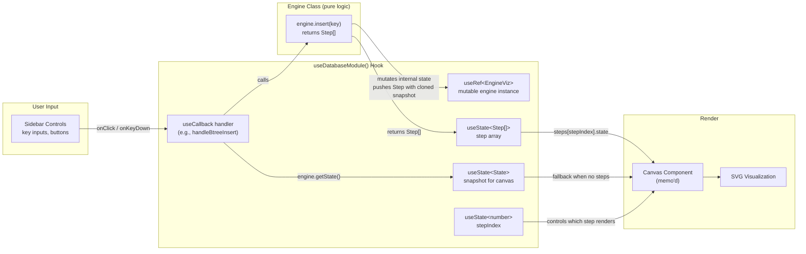
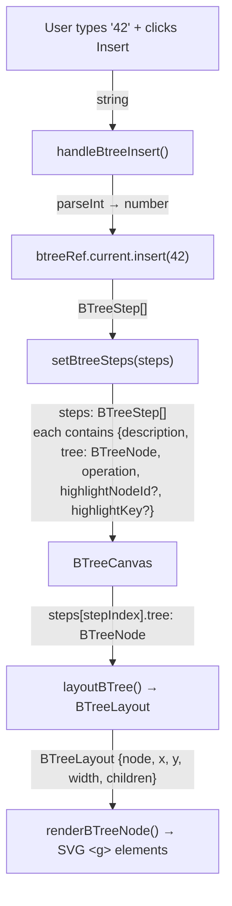
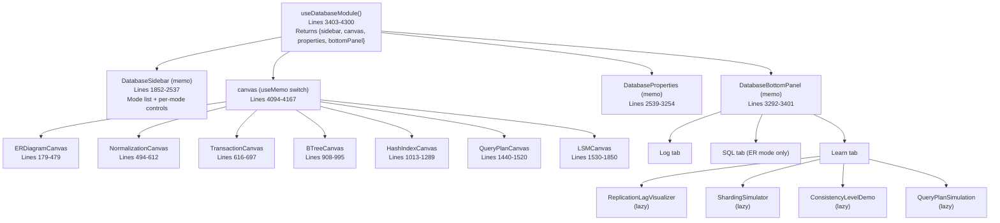
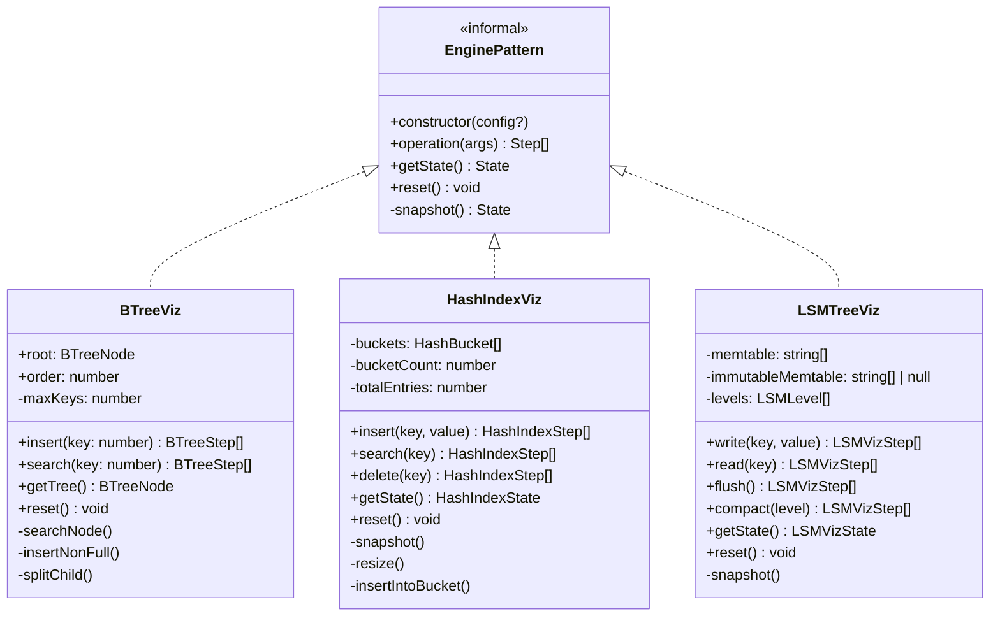

# Database Module Architecture

## Module overview

The Database Design Lab is an interactive learning module within the Architex platform that teaches database internals through visualization. Users select a mode from the sidebar, interact with controls (insert keys, write SQL, configure isolation levels), and watch step-by-step animations of the underlying data structures and algorithms.

### 7 modes

| Mode | What it teaches | Interaction model |
|------|----------------|-------------------|
| **ER Diagram Builder** | Entity-relationship modeling, cardinality, weak entities | Drag entities, add attributes, generate SQL |
| **Normalization** | Functional dependencies, candidate keys, 1NF-BCNF, 3NF decomposition | Enter relation + FDs, click Analyze |
| **Transaction Isolation** | Dirty reads, non-repeatable reads, phantom reads, serializable | Select level, step through timeline |
| **B-Tree Index** | B-Tree insert, search, node splitting | Insert/search integer keys, step through |
| **Hash Index** | Hash tables, collision chaining, dynamic resizing | Insert/search/delete string keys |
| **Query Plans** | SeqScan, IndexScan, HashJoin, Sort, Aggregate, Filter, Limit | Enter SQL, view cost-annotated tree |
| **LSM-Tree** | Memtable, immutable memtable, SSTable levels, flush, compaction | Write/read keys, manual flush/compact |

### Target audience

Computer science students and software engineers preparing for system design interviews who want to understand database internals visually rather than through textbook definitions.

---

## File map

All 24 files that make up the Database module:

### Core module (1 file)

| File | Role | Lines |
|------|------|-------|
| `src/components/modules/DatabaseModule.tsx` | Monolith: hook, sidebar, 7 canvases, properties panel, bottom panel | ~4305 |

### Engine classes (8 files)

| File | Role | Exports |
|------|------|---------|
| `src/lib/database/types.ts` | Shared type definitions (EREntity, ERAttribute, ERRelationship, FunctionalDependency, IsolationLevel, TransactionOp) | Types only |
| `src/lib/database/btree-viz.ts` | B-Tree engine: insert, search with step traces | `BTreeViz`, `BTreeNode`, `BTreeStep` |
| `src/lib/database/hash-index-viz.ts` | Hash index engine: insert, search, delete with step traces | `HashIndexViz`, `HashBucket`, `HashIndexState`, `HashIndexStep` |
| `src/lib/database/lsm-viz.ts` | LSM-Tree engine: write, read, flush, compact with step traces | `LSMTreeViz`, `LSMLevel`, `LSMVizState`, `LSMVizStep` |
| `src/lib/database/normalization.ts` | Normalization engine: closure, candidate keys, normal form, 3NF decomposition | `computeClosure`, `findCandidateKeys`, `determineNormalForm`, `decomposeTo3NF` |
| `src/lib/database/transaction-sim.ts` | Transaction isolation simulator: generates step traces for each level | `simulateIsolation`, `simulateWriteSkew`, `simulateLostUpdate`, `TransactionStep` |
| `src/lib/database/query-plan.ts` | SQL query plan generator: heuristic-based EXPLAIN output | `generateQueryPlan`, `QueryPlanNode` |
| `src/lib/database/er-to-sql.ts` | ER-to-SQL converter: entities + relationships -> CREATE TABLE | `generateSQL` |

### Additional library files (3 files)

| File | Role | Exports |
|------|------|---------|
| `src/lib/database/schema-converter.ts` | Dual converter: ER -> SQL and ER -> MongoDB schemas | `erToSQL`, `erToNoSQL`, `SQLResult`, `MongoCollection`, `NoSQLResult` |
| `src/lib/database/sample-er-diagrams.ts` | 3 pre-built ER examples (E-commerce, Social Media, Library) | `SAMPLE_ER_DIAGRAMS`, `SampleERDiagram` |
| `src/lib/database/index.ts` | Barrel export aggregating all engine exports | Re-exports everything |

### Learn panel components (4 files)

| File | Role | Loading |
|------|------|---------|
| `src/components/modules/database/ReplicationLagVisualizer.tsx` | Interactive replication lag visualization | Lazy-loaded via `React.lazy()` |
| `src/components/modules/database/ShardingSimulator.tsx` | Sharding strategy simulator | Lazy-loaded via `React.lazy()` |
| `src/components/modules/database/ConsistencyLevelDemo.tsx` | Consistency level comparison demo | Lazy-loaded via `React.lazy()` |
| `src/components/modules/database/QueryPlanSimulation.tsx` | Interactive query plan simulation | Lazy-loaded via `React.lazy()` |

### Tests (1 file)

| File | Role |
|------|------|
| `src/lib/database/__tests__/schema-converter.test.ts` | Unit tests for the schema converter |

### Orphaned React Flow components (6 files, UNUSED)

| File | Role | Status |
|------|------|--------|
| `src/components/canvas/nodes/database/EntityNode.tsx` | React Flow node for ER entities | Not imported anywhere |
| `src/components/canvas/nodes/database/WeakEntityNode.tsx` | React Flow node for weak entities | Not imported anywhere |
| `src/components/canvas/nodes/database/RelationshipDiamond.tsx` | React Flow relationship diamond | Not imported anywhere |
| `src/components/canvas/nodes/database/index.ts` | Barrel for node components | Not imported anywhere |
| `src/components/canvas/edges/database/CrowsFootEdge.tsx` | React Flow crow's foot edge | Not imported anywhere |
| `src/components/canvas/edges/database/index.ts` | Barrel for edge components | Not imported anywhere |

These were built for a React Flow-based ER diagram mode that was replaced by a hand-rolled SVG canvas. See DBL-177 for cleanup plans.

---

## Data flow diagram

The central architectural pattern: user input flows through an engine class that produces step arrays, which drive a canvas visualization.



### Type flow at each stage



---

## State management pattern

### Why `useState` + `useRef`, not Zustand

The Database module uses React-local state (`useState`) rather than the platform's Zustand stores because:

1. **No cross-module sharing** -- No other module needs to read B-Tree or Hash Index state.
2. **No persistence needed** -- State is ephemeral; resetting on mode switch is expected behavior.
3. **High-frequency updates** -- Step playback ticks every 800ms; Zustand's selector-based re-renders would add unnecessary overhead for state that only this module reads.
4. **Co-located lifecycle** -- All state is created, used, and cleaned up within `useDatabaseModule()`.

### The `useRef` + `useState` sync pattern

Engine classes (BTreeViz, HashIndexViz, LSMTreeViz) are **mutable objects** held in `useRef`. React does not re-render when a ref changes. The pattern to trigger re-renders after engine mutation is:

```
1. User clicks "Insert"
2. Handler calls engine.insert(key)     ← mutates ref, NO re-render
3. Handler calls setState(engine.getState())  ← triggers re-render
4. Handler calls setSteps(returnedSteps)      ← triggers re-render
5. Canvas reads steps[stepIndex].state and renders SVG
```

This is implemented consistently for all three class-based engines:

```ts
// src/components/modules/DatabaseModule.tsx

// Step 1: Ref holds the mutable engine
const btreeRef = useRef(new BTreeViz(3));                    // line 3724

// Step 2: State holds the serializable snapshot
const [btreeTree, setBtreeTree] = useState<BTreeNode>(       // line 3725
  btreeRef.current.getTree(),
);
const [btreeSteps, setBtreeSteps] = useState<BTreeStep[]>([]); // line 3728

// Step 3: Handler mutates ref, then syncs state
const handleBtreeInsert = useCallback(() => {                 // line 3759
  const steps = btreeRef.current.insert(key);  // mutate ref
  setBtreeSteps(steps);                        // sync steps → re-render
  setBtreeTree(btreeRef.current.getTree());    // sync tree → re-render
}, [btreeKeyInput, log]);
```

### Playback timer pattern

Step-through animation uses `setInterval` stored in a `useRef`:

```ts
const btreeTimerRef = useRef<ReturnType<typeof setInterval> | null>(null);

// Play: start interval that increments stepIndex
const handleBtreePlay = useCallback(() => {
  setIsBtreePlaying(true);
  btreeTimerRef.current = setInterval(() => {
    setBtreeStepIndex((prev) => {
      if (prev >= btreeSteps.length - 1) {
        clearInterval(btreeTimerRef.current!);
        setIsBtreePlaying(false);
        return prev;
      }
      return prev + 1;
    });
  }, 800);
}, [btreeSteps.length]);
```

Timers are cleaned up in three places:
1. **On unmount** -- `useEffect` cleanup (lines 3736-3740)
2. **On mode switch** -- `handleSelectMode` clears all timer refs (lines 4064-4091)
3. **On reset** -- Each mode's reset handler clears its own timer

---

## Component architecture

All components live in a single file (`DatabaseModule.tsx`). They are organized as:



### Canvas component pattern

Every canvas component follows the same structure:

1. **Props:** Receives `state`, `steps`, `stepIndex`, and optional highlight info.
2. **Step description bar:** Shows operation badge (color-coded), description text, and step counter.
3. **SVG visualization:** Renders the data structure using SVG `<rect>`, `<text>`, `<line>`, `<polygon>` elements.
4. **Layout function:** A pure function that computes x/y positions for nodes (e.g., `layoutBTree()`, `layoutPlanTree()`).
5. **Recursive render function:** A pure function that converts layout objects to SVG React elements.

---

## Learn panel architecture

The Learn panel is a tab in the bottom panel (`DatabaseBottomPanel`, line 3292) that provides four interactive sub-components for deeper exploration of database concepts.

### Lazy loading

All four components are loaded via `React.lazy()` at the top of DatabaseModule.tsx (lines 68-71):

```ts
const ReplicationLagVisualizer = lazy(() => import("@/components/modules/database/ReplicationLagVisualizer"));
const ShardingSimulator = lazy(() => import("@/components/modules/database/ShardingSimulator"));
const ConsistencyLevelDemo = lazy(() => import("@/components/modules/database/ConsistencyLevelDemo"));
const QueryPlanSimulation = lazy(() => import("@/components/modules/database/QueryPlanSimulation"));
```

### Suspense boundary

The Learn tab wraps all four components in a single `Suspense` boundary (lines 3358-3366):

```tsx
<Suspense fallback={<div className="py-4 text-center text-xs text-foreground-subtle">Loading...</div>}>
  <div className="flex flex-col gap-6">
    <ReplicationLagVisualizer />
    <ShardingSimulator />
    <ConsistencyLevelDemo />
    <QueryPlanSimulation />
  </div>
</Suspense>
```

All four components load together when the Learn tab is first clicked. They are independent -- each manages its own internal state and does not share state with the main mode engine or with each other.

### Learn panel files

| Component | File |
|-----------|------|
| ReplicationLagVisualizer | `src/components/modules/database/ReplicationLagVisualizer.tsx` |
| ShardingSimulator | `src/components/modules/database/ShardingSimulator.tsx` |
| ConsistencyLevelDemo | `src/components/modules/database/ConsistencyLevelDemo.tsx` |
| QueryPlanSimulation | `src/components/modules/database/QueryPlanSimulation.tsx` |

---

## Cross-module bridges

The Database module is self-contained -- it does not share state with other Architex modules. However, the platform provides two connection points:

1. **Activity bar** -- The Database module is registered as `"database"` in the `ModuleType` union (`src/stores/ui-store.ts`). The activity bar icon switches `activeModule` to `"database"`, which causes `useModuleContent()` in `src/app/page.tsx` to return the database hook's panels.

2. **Command palette** -- The module is registered in `src/components/shared/command-palette.tsx` so users can switch to it via `Cmd+K` > "Database".

There are no runtime data bridges between the Database module and other modules (Algorithms, Distributed Systems, etc.). Each module operates on independent state.

---

## Engine class hierarchy

The three class-based engines share an informal interface (not enforced via TypeScript `interface` or `abstract class`):



### Non-class engines

Three modes use standalone functions instead of classes:

- **Normalization** -- `computeClosure()`, `findCandidateKeys()`, `determineNormalForm()`, `decomposeTo3NF()` are pure functions that take inputs and return results. No step arrays.
- **Transaction Isolation** -- `simulateIsolation(level)` returns a pre-built `TransactionStep[]` array. No mutable state.
- **Query Plans** -- `generateQueryPlan(sql)` returns a `QueryPlanNode` tree. No step arrays.

These modes do not use the `useRef` pattern because they have no mutable state to maintain between operations.
