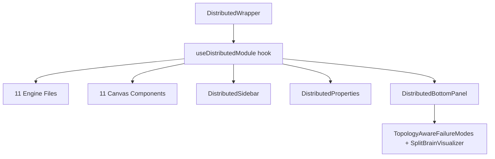

# Distributed Systems Module

## Overview

The distributed systems module provides 11 interactive simulations that teach core distributed systems concepts. Each simulation has a step-by-step engine, a canvas visualization, interactive controls, and a properties panel with educational content.

### Simulations

| # | Simulation | Engine Style | What It Teaches |
|---|---|---|---|
| 1 | Raft Consensus | Stateful class | Leader election, log replication, fault tolerance |
| 2 | Consistent Hashing | Stateful class | Hash ring, virtual nodes, key distribution |
| 3 | Vector Clocks | Stateful class | Causality tracking, concurrent event detection |
| 4 | Gossip Protocol | Stateful class | Epidemic-style information dissemination |
| 5 | CRDTs | Stateful class | Conflict-free replicated data types (G-Counter, PN-Counter, LWW-Register, OR-Set) |
| 6 | CAP Theorem | Stateful class | Consistency, availability, partition tolerance tradeoffs |
| 7 | Two-Phase Commit | Pure function | Atomic commit protocol with coordinator and participants |
| 8 | Saga Pattern | Pure function | Choreography-based distributed transactions with compensation |
| 9 | MapReduce | Pure function | Parallel processing: split, map, shuffle, reduce, output |
| 10 | Lamport Timestamps | Stateful class | Scalar logical clocks for event ordering |
| 11 | Paxos | Pure function | Consensus with Prepare/Promise/Accept/Accepted phases |

## Architecture



All 11 canvas visualizations, controls panels, and properties panels are currently embedded inline in a single file (`DistributedModule.tsx`). The engine logic is cleanly separated into individual files under `src/lib/distributed/`.

## File Inventory

### Engine Files (`src/lib/distributed/`)

| File | Lines | Purpose |
|---|---|---|
| `raft.ts` | 893 | Raft consensus: leader election, log replication, heartbeats |
| `cap-theorem.ts` | 603 | CAP theorem: partition simulation, consistency vs availability modes |
| `crdt.ts` | 582 | CRDTs: G-Counter, PN-Counter, LWW-Register, OR-Set implementations |
| `consistent-hash.ts` | 319 | Consistent hashing: hash ring, virtual nodes, key lookup |
| `vector-clock.ts` | 233 | Vector clocks: causality tracking, concurrent event detection |
| `paxos.ts` | 227 | Paxos: prepare/promise/accept/accepted phases |
| `lamport-timestamps.ts` | 198 | Lamport timestamps: scalar logical clock ordering |
| `two-phase-commit.ts` | 156 | 2PC: coordinator-driven atomic commit |
| `map-reduce.ts` | 151 | MapReduce: word-count split/map/shuffle/reduce pipeline |
| `saga.ts` | 122 | Saga pattern: choreography with compensation steps |
| `gossip.ts` | 312 | Gossip protocol: epidemic dissemination, convergence |
| `index.ts` | 86 | Barrel file: re-exports all types and classes |

### UI Files

| File | Lines | Purpose |
|---|---|---|
| `src/components/modules/DistributedModule.tsx` | 4904 | God file: all 11 canvases, controls, properties, hook, sidebar |
| `src/components/modules/distributed/TopologyAwareFailureModes.tsx` | 521 | Learn panel: topology-aware failure mode visualizer |
| `src/components/modules/distributed/SplitBrainVisualizer.tsx` | 494 | Learn panel: split-brain scenario visualizer |

### Orphaned Visualizers (NOT currently used)

| File | Lines | Purpose |
|---|---|---|
| `src/components/visualization/distributed/RaftVisualizer.tsx` | 391 | Standalone Raft visualizer (not wired in) |
| `src/components/visualization/distributed/ConsistentHashRingVisualizer.tsx` | 244 | Standalone hash ring visualizer (not wired in) |
| `src/components/visualization/distributed/VectorClockDiagram.tsx` | 252 | Standalone vector clock diagram (not wired in) |

### Tests

| File | Location |
|---|---|
| `raft.test.ts` | `src/__tests__/lib/distributed/` |
| `consistent-hash.test.ts` | `src/__tests__/lib/distributed/` |
| `gossip.test.ts` | `src/__tests__/lib/distributed/` |
| `cap-theorem.test.ts` | `src/__tests__/lib/distributed/` |
| `two-phase-commit.test.ts` | `src/__tests__/lib/distributed/` |
| `paxos.test.ts` | `src/__tests__/lib/distributed/` |
| `distributed-systems.test.ts` | `src/lib/distributed/__tests__/` |

Note: Tests are split across two directories. See DIS-133 for the consolidation plan.

## Data Flow

```
User clicks "Step" or "Play"
  → handler in useDistributedModule hook
    → engine.step() or simulateXxx() called
      → returns events/steps array
        → setState updates (nodes, messages, events, stepIndex)
          → React re-renders canvas with new state
```

For stateful simulations (Raft, Gossip, etc.), the engine instance is held in a `useRef` and mutated via method calls. For pure-function simulations (Saga, 2PC, MapReduce, Paxos), the full step array is generated on init and the UI steps through it by index.

## Known Issues

1. **God file**: `DistributedModule.tsx` is 4904 lines containing all 11 canvases, controls, properties, the hook, and sidebar logic. See DIS-024 for the plan to split it into per-simulation components.

2. **Orphaned visualizers**: Three standalone visualizer components exist in `src/components/visualization/distributed/` but are not used by the module. The active visualizations are embedded in `DistributedModule.tsx`. See DIS-025 for the integration plan.

3. **Progress tracking incomplete**: `MODULE_FEATURES.distributed` in `src/lib/progress/module-progress.ts` only lists 6 of 11 simulations (missing: two-phase-commit, saga, map-reduce, lamport-timestamps, paxos).

4. **Test location split**: Tests are in two directories (`src/__tests__/lib/distributed/` and `src/lib/distributed/__tests__/`). See DIS-133 for the consolidation plan.

## Adding a New Simulation

See the [CONTRIBUTING.md](../../../CONTRIBUTING.md#how-to-add-a-new-distributed-simulation) guide for the full step-by-step process and checklist.
