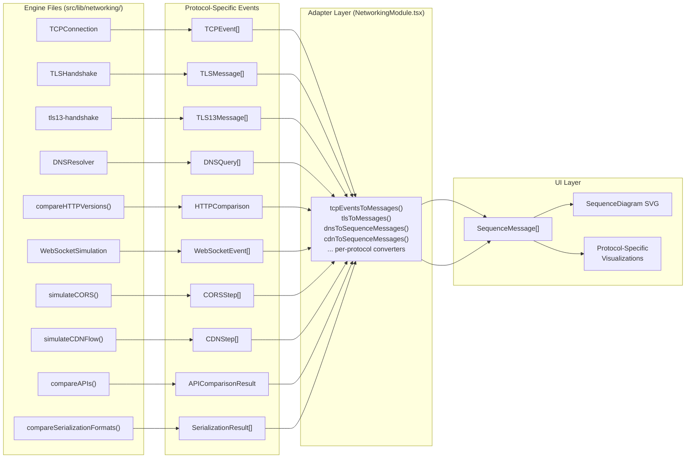

# Networking & Protocols Engine

This directory contains the protocol simulation engines that power the Networking module in Architex. Each engine file models a real networking protocol, producing structured event timelines that the UI renders as interactive sequence diagrams and visualizations.

## Architecture



### Data flow summary

1. **Engine** -- A class or function that simulates a protocol, producing an ordered array of protocol-specific event objects.
2. **Events** -- Each engine defines its own event type (e.g., `TCPEvent`, `TLSMessage`, `CORSStep`), but all share the common fields: `tick` (or equivalent ordering), `from`, `to`, and `description`.
3. **Adapter** -- Converter functions in `NetworkingModule.tsx` (e.g., `tcpEventsToMessages()`) transform protocol-specific events into the universal `SequenceMessage` type.
4. **UI** -- The `SequenceDiagram` component and protocol-specific visualizations consume `SequenceMessage[]` to render interactive step-by-step animations.

## File Inventory

| File | Purpose |
|------|---------|
| `index.ts` | Barrel export -- re-exports all engines, types, and helpers from a single entry point. |
| `tcp-state-machine.ts` | Full TCP connection lifecycle: 3-way handshake, data transfer with SEQ/ACK, 4-way teardown, and packet loss retransmission (RFC 793/9293). |
| `tls-handshake.ts` | TLS 1.3 (1-RTT), TLS 1.3 0-RTT resumption, and TLS 1.2 (2-RTT) handshake simulation with cipher suite negotiation and certificate verification. |
| `tls13-handshake.ts` | Structured TLS 1.3 handshake sequence data with plaintext/encrypted region indicators, color coding metadata, and RTT bracket definitions for visualization. |
| `dns-resolution.ts` | Recursive DNS resolution chain (stub resolver -> recursive -> root -> TLD -> authoritative) with A/AAAA/CNAME/MX/NS record types and TTL caching. |
| `http-comparison.ts` | Side-by-side simulation of HTTP/1.1 (HOL blocking), HTTP/2 (multiplexed streams), and HTTP/3 (QUIC transport) loading the same resources. |
| `websocket-lifecycle.ts` | Full WebSocket lifecycle: HTTP upgrade handshake, bidirectional message exchange, ping/pong heartbeat, and graceful close (RFC 6455). |
| `cors-simulator.ts` | CORS request flow simulation: same-origin check, simple requests, preflight (OPTIONS) with Access-Control headers, and credential handling. |
| `cdn-flow.ts` | CDN request lifecycle: cache hit, cache miss (edge -> shield -> origin), stale-while-revalidate, and cache purge propagation. |
| `api-comparison.ts` | Side-by-side comparison of REST, GraphQL, and gRPC for identical operations, showing payload sizes, latency, and qualitative trade-offs. |
| `serialization-comparison.ts` | Comparison of JSON, Protocol Buffers, MessagePack, and Avro for the same data object, measuring size, speed, and feature differences. |

## Shared Patterns

All protocol engines produce event objects that share a common shape, even though each engine defines its own TypeScript type:

```ts
{
  tick: number;        // Monotonically increasing step counter (ordering)
  from: string;        // Sender endpoint (e.g., "client", "server", "browser")
  to: string;          // Receiver endpoint
  description: string; // Human-readable explanation of this step
  // ... plus protocol-specific fields (segment, segment flags, record type, etc.)
}
```

This shared shape is what makes the universal `SequenceMessage` adapter possible -- every engine's events can be mapped to the same UI type regardless of protocol-specific details.

### Engine styles

Engines come in two styles:

- **Class-based** (`TCPConnection`, `TLSHandshake`, `DNSResolver`, `WebSocketSimulation`): Stateful simulations where you call methods like `connect()`, `sendData()`, `close()` and the class accumulates events internally.
- **Function-based** (`compareHTTPVersions()`, `simulateCORS()`, `simulateCDNFlow()`, `compareAPIs()`, `compareSerializationFormats()`): Pure functions that take configuration and return a complete result in one call.

## The SequenceMessage Adapter

The `SequenceMessage` interface (defined in `NetworkingModule.tsx`) is the universal UI type that all protocol events convert into:

```ts
interface SequenceMessage {
  from: string;          // Display name of the sender column
  to: string;            // Display name of the receiver column
  label: string;         // Short label on the arrow (e.g., "SYN seq=1000")
  description: string;   // Detailed explanation shown in the step panel
  highlighted?: boolean; // Whether this message is visually emphasized
  fromState?: string;    // State annotation for the sender (e.g., "SYN_SENT")
  toState?: string;      // State annotation for the receiver (e.g., "LISTEN")
}
```

Each protocol has a dedicated converter function that maps its events to `SequenceMessage[]`:

| Protocol | Converter | Location |
|----------|-----------|----------|
| TCP | `tcpEventsToMessages()` | `NetworkingModule.tsx` |
| TLS 1.3 | `tls13ToSequenceMessages()` | `tls13-handshake.ts` |
| TLS 1.2 | `tlsToMessages()` | `NetworkingModule.tsx` |
| DNS | `dnsToSequenceMessages()` | `dns-resolution.ts` |
| CDN | `cdnToSequenceMessages()` | `cdn-flow.ts` |
| Others | Inline in `messages` useMemo | `NetworkingModule.tsx` |

Some protocols (DNS, CDN, TLS 1.3) export their converter directly from the engine file. Others (TCP, TLS 1.2) have their converter defined in `NetworkingModule.tsx`. When adding a new protocol, prefer exporting the converter from the engine file to keep `NetworkingModule.tsx` lean.

## Adding a New Protocol

See the full contributor guide: **[How to Add a New Protocol Simulation](../../../docs/guides/adding-a-protocol.md)**

The guide covers the complete 7-step process: creating an engine file, updating the barrel export, adding the Protocol union member, registering in the PROTOCOLS array, adding switch cases for messages/columns/canvas, writing tests, and the verification checklist.
