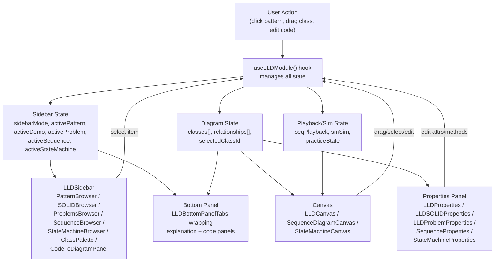
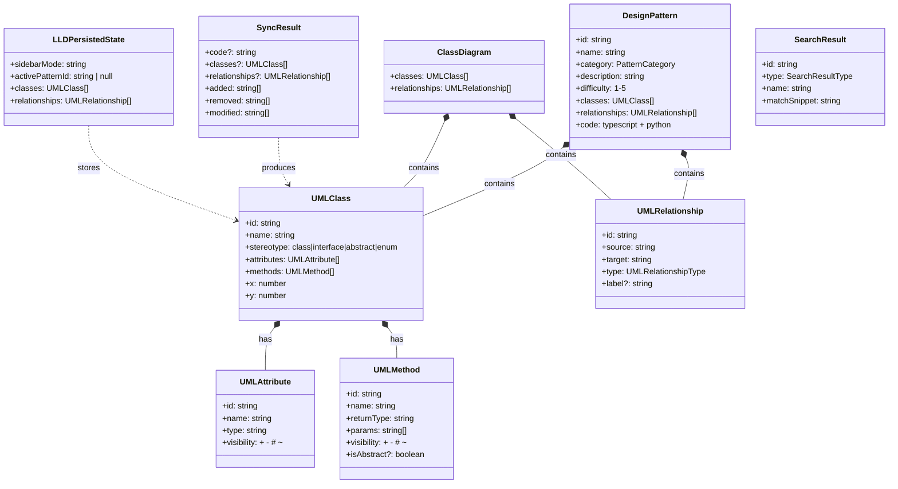

# LLD Module Architecture Overview

## Data Flow

## Component Tree

All components live in `architex/src/components/modules/LLDModule.tsx` (6690 lines). The file exports a single `useLLDModule()` hook that returns `{ sidebar, canvas, properties, bottomPanel }`.

```mermaid
graph TD
    useLLDModule["useLLDModule() hook"]

    subgraph Sidebar
        LLDSidebar
        PatternBrowser
        SOLIDBrowser
        ProblemsBrowser
        SequenceBrowser
        StateMachineBrowser
        ClassPalette
        CodeToDiagramPanel
        PracticeModeSetup
    end

    subgraph Canvas
        LLDCanvas
        UMLClassBox
        UMLEdge
        RelationshipDefs
        RelationshipTypePicker
        ZoomToolbar
        SequenceDiagramCanvas
        SequencePlaybackToolbar
        StateMachineCanvas
        SimToast
        SimTransitionPanel
    end

    subgraph Properties
        LLDProperties
        LLDSOLIDProperties
        LLDProblemProperties
        SequenceProperties
        StateMachineProperties
    end

    subgraph BottomPanel
        LLDBottomPanelTabs
        LLDBottomPanel
        LLDSOLIDBottomPanel
        LLDProblemBottomPanel
        SequenceBottomPanel
        StateMachineBottomPanel
        GeneratedCodePanel
        PracticeAssessment
        PracticeTimerBar
        PatternQuiz
        SOLIDQuiz
        PatternBehavioralSimulator["PatternBehavioralSimulator<br/>(separate file)"]
        SequenceDiagramLatencyOverlay["SequenceDiagramLatencyOverlay<br/>(separate file)"]
    end

    useLLDModule --> LLDSidebar
    useLLDModule --> LLDCanvas
    useLLDModule --> LLDProperties
    useLLDModule --> LLDBottomPanelTabs
```

## File Responsibility Table

| Looking for... | Check this file |
|---|---|
| Type definitions (UMLClass, DesignPattern, etc.) | `lib/lld/types.ts` |
| Barrel exports for all LLD utilities | `lib/lld/index.ts` |
| Class diagram CRUD (add/remove/update class, attr, method, rel) | `lib/lld/class-diagram-model.ts` |
| Design pattern data (all 20+ patterns) | `lib/lld/patterns.ts` |
| SOLID principle demos (before/after diagrams) | `lib/lld/solid-demos.ts` |
| LLD practice problems | `lib/lld/problems.ts` |
| OOP concept demos | `lib/lld/oop-demos.ts` |
| Sequence diagram examples | `lib/lld/sequence-diagram.ts` |
| State machine examples | `lib/lld/state-machine.ts` |
| Diagram to TypeScript code generation | `lib/lld/codegen/diagram-to-typescript.ts` |
| Diagram to Python code generation | `lib/lld/codegen/diagram-to-python.ts` |
| Code to diagram parsing (reverse engineering) | `lib/lld/codegen/code-to-diagram.ts` |
| Bidirectional diagram/code sync | `lib/lld/bidirectional-sync.ts` |
| localStorage persistence (save/load/clear) | `lib/lld/persistence.ts` |
| Cross-content search (patterns, SOLID, problems) | `lib/lld/search.ts` |
| All UI components (~30 components, main hook) | `components/modules/LLDModule.tsx` |
| Pattern behavioral simulator | `components/modules/lld/PatternBehavioralSimulator.tsx` |
| Sequence latency overlay | `components/modules/lld/SequenceDiagramLatencyOverlay.tsx` |

## Data Model Relationships

## Where is X? Quick Reference

| Question | Answer |
|---|---|
| Where does the main hook live? | `useLLDModule()` at the bottom of `LLDModule.tsx` (line ~5627) |
| How do I add a new pattern? | Add a `DesignPattern` object to `DESIGN_PATTERNS` in `patterns.ts`. Use `scripts/scaffold-pattern.ts` to generate the skeleton. |
| How does code generation work? | `generateTypeScript()` / `generatePython()` in `codegen/diagram-to-*.ts` take `UMLClass[]` + `UMLRelationship[]` and output source code strings. |
| How does reverse parsing work? | `parseTypeScript()` / `parsePython()` in `codegen/code-to-diagram.ts` take source code strings and return `ParseResult { classes, relationships, warnings }`. |
| How does bidirectional sync work? | `SyncManager` in `bidirectional-sync.ts` tracks prev diagram/code snapshots and computes minimal diffs on each sync. |
| Where is diagram state persisted? | `persistence.ts` uses `localStorage` under key `architex-lld-state`. Use `saveLLDState()` / `loadLLDState()` / `clearLLDState()`. |
| How does search work? | `searchLLDContent(query)` in `search.ts` does case-insensitive substring matching across patterns, SOLID, problems, sequences, and state machines. |
| Where are undo/redo implemented? | Inside `useLLDModule()` in `LLDModule.tsx` using `undoStackRef` / `redoStackRef` with snapshot-based approach. |
| How does the canvas handle zoom/pan? | `useSVGZoomPan()` custom hook in `LLDModule.tsx` (line ~198) manages transform state via pointer events and wheel. |
| Where are relationship types rendered? | `RelationshipDefs` (SVG marker defs) + `UMLEdge` in `LLDModule.tsx`. |
| How does URL deep-linking work? | `useLLDModule()` reads/writes `?lld=pattern:singleton` URL params. See `computeLLDParam()` and the mount-time `useEffect`. |
| Where are SOLID quizzes? | `SOLIDQuiz` component + `SOLID_QUIZ_QUESTIONS` array in `solid-demos.ts`. |
| How does practice mode work? | `practiceState` in `useLLDModule()` tracks timer, hints, submission. `PracticeTimerBar`, `PracticeModeSetup`, and `PracticeAssessment` are the UI components. |
| Where is the sequence playback? | `seqPlayback` state + `SequencePlaybackToolbar` + auto-advance `useEffect` in `useLLDModule()`. |
| Where is state machine simulation? | `smSim` state + `SimToast` + `SimTransitionPanel` + `smSimFireTransition()` in `useLLDModule()`. |
