# Architex -- Complete Wireframe Specifications

> **Purpose:** Blueprint-level wireframe specs for every screen in the Architex platform. Intended as the source of truth for Figma mockup creation.
>
> **Design system tokens referenced throughout:**
> - Primary: `#6C5CE7` (Electric Indigo)
> - Secondary: `#00CEC9` (Teal Accent)
> - Surface: `#1E1E2E` (Dark) / `#FFFFFF` (Light)
> - Text Primary: `#E0E0E0` (Dark) / `#1A1A2E` (Light)
> - Danger: `#FF6B6B`
> - Success: `#00B894`
> - Warning: `#FDCB6E`
> - Border Radius: 8px (cards), 12px (modals), 24px (buttons pill)
> - Font: Inter (UI), JetBrains Mono (code)
> - Spacing unit: 4px base grid

---

## Table of Contents

1. [Landing Page (Public)](#1-landing-page-public)
2. [Home Dashboard (Logged In)](#2-home-dashboard-logged-in)
3. [Module Selection](#3-module-selection)
4. [System Design Editor](#4-system-design-editor)
5. [Algorithm Visualizer](#5-algorithm-visualizer)
6. [Data Structure Explorer](#6-data-structure-explorer)
7. [LLD Studio](#7-lld-studio)
8. [Database Lab](#8-database-lab)
9. [Distributed Systems Playground](#9-distributed-systems-playground)
10. [Interview Challenge Screen](#10-interview-challenge-screen)
11. [Interview Results Screen](#11-interview-results-screen)
12. [Template Gallery](#12-template-gallery)
13. [Template Detail / Preview](#13-template-detail--preview)
14. [Learning Path View](#14-learning-path-view)
15. [Profile / Progress](#15-profile--progress)
16. [Settings](#16-settings)
17. [Collaboration Session](#17-collaboration-session)
18. [Community Gallery](#18-community-gallery)
19. [Share / Export Dialog](#19-share--export-dialog)
20. [Command Palette (Overlay)](#20-command-palette-overlay)
21. [Onboarding Flow](#21-onboarding-flow)
22. [Keyboard Shortcut Sheet](#22-keyboard-shortcut-sheet)

---

## 1. Landing Page (Public)

### Purpose
Convert visitors into registered users. Communicate the platform's breadth (12 modules, AI integration, collaboration, interview prep, gamification).

### Layout Structure

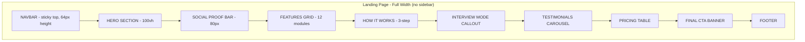

### Section-by-Section Specification

#### 1A. Navbar (Sticky, 64px)
- **Left:** Architex logo (icon + wordmark, 32px height). Clicking logo scrolls to top.
- **Center:** Nav links -- `Features` | `Modules` | `Pricing` | `Community` | `Docs`. Each is a smooth-scroll anchor. Active link gets underline accent in Primary color.
- **Right:** `Log In` (ghost button, 36px height) + `Start Free` (filled Primary button, 36px height, pill shape).
- **Behavior:** Background transparent at top, transitions to `surface/90% opacity + blur(12px)` on scroll past 100px. Z-index 1000.
- **Responsive (tablet):** Hamburger menu replaces center links. Logo + hamburger + `Start Free` button visible. Hamburger opens full-screen overlay with vertical links + login.
- **Responsive (mobile):** Same as tablet. `Start Free` button text shortens to `Start`. Font sizes reduce from 14px to 13px.

#### 1B. Hero Section (100vh minus navbar)
- **Layout:** Two-column, 55/45 split.
- **Left column (text):**
  - Badge pill: `"NEW: AI Interview Coach Now Available"` -- small, 12px font, teal background, top of column.
  - H1 headline: `"Master System Design Through Interactive Simulation"` -- 56px, bold, line-height 1.15. Keywords "System Design" in gradient text (Primary to Secondary).
  - Subtitle: `"12 learning modules, real-time simulation, AI feedback, and collaborative design -- the engineering platform that teaches by doing."` -- 20px, muted text, max-width 540px.
  - CTA row: `"Start Building Free"` (Primary filled, 48px height, 180px width) + `"Watch Demo"` (ghost with play icon, 48px height). 16px gap between buttons.
  - Trust line: `"Join 25,000+ engineers from"` followed by 5 grayscale company logos inline (Google, Meta, Amazon, Netflix, Stripe). Logos 24px height, 60% opacity.
- **Right column (visual):**
  - Animated hero illustration: Isometric view of a system design canvas with components (load balancer, databases, services) gently floating/connecting. Subtle particle effects on connections. 3D perspective, ~500x400px bounding box.
  - Alternative for static: screenshot of the System Design Editor with a glass-morphism frame and subtle shadow.
- **Responsive (tablet):** Stack vertically. Text column full width, visual column below at 80% width centered. H1 reduces to 40px. CTAs stack vertically at full width.
- **Responsive (mobile):** H1 reduces to 32px. Subtitle to 16px. Visual reduces to 90% viewport width. Company logos wrap to second line or reduce to 3.

#### 1C. Social Proof Bar (80px)
- **Layout:** Horizontal strip, centered content, light divider lines top and bottom.
- **Content:** 4 stats in a row: `"25K+ Engineers"` | `"55+ Templates"` | `"12 Modules"` | `"4.9/5 Rating"`. Each stat: number in 28px bold, label in 14px muted, separated by thin vertical dividers.
- **Responsive (mobile):** 2x2 grid instead of 4-inline.

#### 1D. Features Grid
- **Section header:** `"Everything You Need to Master System Design"` -- 40px, centered. Subtitle: `"From fundamentals to FAANG-level interviews"` -- 18px, muted, centered.
- **Grid:** 3 columns x 4 rows = 12 cards (one per module).
- **Each card (280px width, ~200px height):**
  - Icon (40px, teal) -- unique per module (e.g., circuit board for distributed systems, database cylinder for DB lab).
  - Module name: 18px bold.
  - One-liner description: 14px muted, 2 lines max.
  - Difficulty badge: pill label (`Beginner` green / `Intermediate` yellow / `Advanced` red), bottom-right.
  - Hover: card lifts 4px (shadow increase), border-left becomes 3px Primary.
- **Responsive (tablet):** 2 columns x 6 rows. Card width 100%.
- **Responsive (mobile):** 1 column, full width cards. Horizontal scroll alternative with snap points.

#### 1E. How It Works (3-Step)
- **Layout:** Horizontal 3-column with numbered circles connected by a dashed line.
- **Step 1:** Circle with `"1"`, icon (user + plus), title `"Choose Your Path"`, description `"Pick from 12 modules or follow curated learning paths tailored to your experience level."` 
- **Step 2:** Circle with `"2"`, icon (play button), title `"Build & Simulate"`, description `"Design systems on an interactive canvas with real-time metrics, AI assistance, and component simulation."`
- **Step 3:** Circle with `"3"`, icon (trophy), title `"Level Up"`, description `"Earn XP, complete challenges, get AI feedback, and track your progress toward interview readiness."`
- **Connector:** Dashed line with animated dots traveling left-to-right between circles.
- **Responsive (mobile):** Vertical stack, connector becomes vertical dashed line on left side.

#### 1F. Interview Mode Callout
- **Layout:** Full-width card with dark gradient background (Primary to dark). Two-column: text left, screenshot right.
- **Left:** Badge `"INTERVIEW PREP"`, H2 `"Ace Your Next System Design Interview"`, bullet points: `"Timed challenges mirroring real interviews"`, `"AI evaluator scores your design"`, `"Compare against reference architectures"`, `"Personalized improvement plan"`. CTA: `"Try a Practice Interview"` (white filled button).
- **Right:** Screenshot of Interview Challenge Screen (timer, canvas, requirements panel) with a subtle glow border.

#### 1G. Testimonials Carousel
- **Layout:** Centered carousel, showing 1 card at a time on mobile, 3 on desktop.
- **Each card:** Avatar (48px circle), name, title + company, star rating (5 stars), quote text in italics, max 3 lines.
- **Controls:** Left/right arrow buttons (40px circles) on sides. Dot indicators below.
- **Auto-advance:** Every 5 seconds, pausable on hover.

#### 1H. Pricing Table
- **Layout:** 3-column comparison table.
- **Columns:** `Free` | `Pro ($12/mo)` | `Team ($25/user/mo)`.
- **Pro column:** Visually elevated (larger, primary border, "Most Popular" badge).
- **Rows:** Feature comparison with check/cross icons. Key features: Modules access, AI credits, Interview mode, Collaboration, Export formats, Priority support.
- **Each column footer:** CTA button. Free: `"Get Started"`. Pro: `"Start Pro Trial"`. Team: `"Contact Sales"`.
- **Responsive (mobile):** Horizontal scroll with snap, or accordion-style toggle between plans.

#### 1I. Final CTA Banner
- **Layout:** Full-width, gradient background, centered text.
- **Content:** H2 `"Start Designing Systems Today"`, subtitle `"Free forever for individuals. No credit card required."`, `"Create Free Account"` button (white filled, 52px height).

#### 1J. Footer
- **Layout:** 4-column grid over dark background.
- **Columns:** `Product` (links: Features, Modules, Pricing, Changelog) | `Learn` (Docs, Tutorials, Blog, Community) | `Company` (About, Careers, Contact, Press) | `Legal` (Privacy, Terms, Cookies).
- **Bottom bar:** Logo left, social icons center (GitHub, Twitter/X, Discord, LinkedIn), copyright right.

### Navigation
- **From:** Direct URL, search engine, referral link.
- **To:** Sign up (modal or `/signup`), Log in (`/login`), any anchor section, Docs (external).

### Empty State
Not applicable (static marketing page).

### Loading State
- Skeleton: Navbar loads immediately (SSR). Hero text appears first, illustration fades in after 200ms. Below-fold sections lazy-load with fade-up animation on scroll (IntersectionObserver).

---

## 2. Home Dashboard (Logged In)

### Purpose
Central hub after login. Surface learning progress, recent work, AI-powered recommendations, and quick actions. Reduce time-to-value.

### Layout Structure

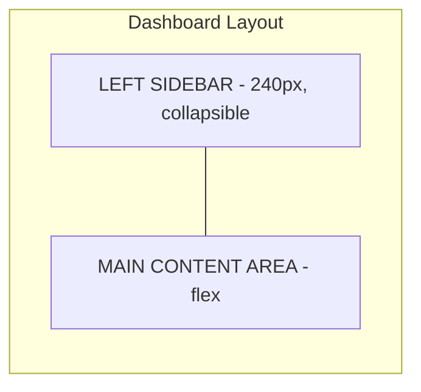

#### Global Shell (applies to all logged-in screens)
- **Left Sidebar (240px, collapsible to 64px icon-only):**
  - Top: Architex logo (collapses to icon-only).
  - User avatar (32px) + name + level badge. Collapsed: avatar only.
  - Nav items (each 40px row, icon + label):
    - `Dashboard` (home icon)
    - `Modules` (grid icon)
    - `Templates` (layout icon)
    - `Learning Paths` (route icon)
    - `Interview Prep` (timer icon)
    - `Community` (users icon)
    - Divider line
    - `Recent Designs` -- expandable sub-list showing last 5 designs with truncated names
    - Divider line
    - `Settings` (gear icon)
    - `Help` (question-circle icon)
  - Bottom: Collapse/expand toggle button (chevron). Keyboard shortcut `[` to toggle.
  - Active nav item: Primary background at 12% opacity, left 3px border accent, text in Primary color.
- **Top Bar (56px, spans main content area):**
  - Left: Breadcrumb trail (e.g., `Dashboard`).
  - Center: Search bar (400px max, 36px height, rounded, placeholder `"Search designs, templates, modules... (Cmd+K)"`). Clicking opens Command Palette overlay.
  - Right: Notification bell (with red dot badge if unread), theme toggle (sun/moon icon), user avatar dropdown (Profile, Settings, Log Out).
- **Responsive (tablet):** Sidebar collapses to icon-only by default. Top bar search becomes icon-only (opens Command Palette on click).
- **Responsive (mobile):** Sidebar becomes off-canvas drawer (hamburger toggle in top-left). Top bar: hamburger, logo centered, avatar right.

#### Dashboard Main Content

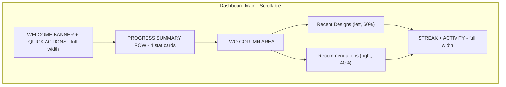

#### 2A. Welcome Banner + Quick Actions (Full Width)
- **Layout:** Card with gradient left edge, 120px height.
- **Left side:** `"Good morning, {firstName}!"` (24px), subtitle: `"You're on a {N}-day streak. Keep it up!"` (14px muted). If streak is 0: `"Start a new streak today!"`.
- **Right side:** 4 quick-action buttons (icon + label, 36px height, ghost style):
  - `"New Design"` (plus icon) -- opens System Design Editor with blank canvas.
  - `"Continue Learning"` (play icon) -- opens last active module.
  - `"Practice Interview"` (timer icon) -- opens Interview Challenge Screen.
  - `"Browse Templates"` (search icon) -- opens Template Gallery.
- **Responsive (mobile):** Text stacks above buttons. Buttons become 2x2 grid.

#### 2B. Progress Summary Row (4 Stat Cards)
- **Layout:** 4 equal-width cards in a row, each ~160px height.
- **Card 1 - Level:** Large level number (48px bold), circular XP progress ring around it (Primary color), `"Level {N}"` label, `"{X}/{Y} XP to next"` subtitle.
- **Card 2 - Streak:** Flame icon (animated if active), `"{N} Days"` large, `"Current Streak"` label, small calendar showing last 7 days as dots (green = active, gray = inactive).
- **Card 3 - Modules:** Pie chart or segmented progress bar, `"{N}/12 Modules"` large, `"In Progress"` label, subtitle shows next recommended module.
- **Card 4 - Interview Ready:** Gauge meter (0-100), `"{N}% Ready"` large, `"Interview Score"` label, color-coded (red < 40, yellow 40-70, green > 70).
- **Responsive (tablet):** 2x2 grid.
- **Responsive (mobile):** Horizontal scroll with snap. Cards at 280px min-width.

#### 2C. Recent Designs (Left Column, 60%)
- **Header row:** `"Recent Designs"` (20px bold) + `"View All"` link (right-aligned, Primary color).
- **List:** 5 most recent designs as cards (full width of column, 80px height each).
  - **Each card:** Thumbnail preview (64x48px, rounded corners, left side) | Design name (16px bold) | Module badge (e.g., "System Design", "LLD") | Last edited timestamp (`"2 hours ago"`) | 3-dot menu (Rename, Duplicate, Delete, Share).
  - Hover: subtle background highlight, 3-dot menu becomes visible.
  - Click: opens that design in its respective editor.
- **Empty state:** Illustration of empty canvas + `"No designs yet"` + `"Create your first design"` button (Primary).

#### 2D. AI Recommendations (Right Column, 40%)
- **Header:** `"Recommended for You"` (20px bold) + sparkle/AI icon.
- **Content:** 3-4 recommendation cards stacked vertically (full column width, ~100px height each).
  - **Each card:** Icon (left), title (16px bold), reason text (13px muted, e.g., `"Based on your progress in Caching"`), action button (`"Start"` or `"Continue"`).
  - Types of recommendations:
    - Module suggestion: `"Try Distributed Systems next"`
    - Template: `"Practice: Design a URL Shortener"`
    - Interview challenge: `"Your weakest area: Database Design"`
    - Article/concept: `"Read: CAP Theorem Deep Dive"`
- **Empty state (new user):** `"Complete your first module to get personalized recommendations"` + `"Explore Modules"` button.

#### 2E. Streak + Activity Section (Full Width)
- **Layout:** Two sections side by side (50/50).
- **Left - Activity Calendar:** GitHub-style contribution heatmap for the last 12 weeks. Each cell = 1 day. Color intensity = activity level (0-4 scale). Tooltip on hover: `"Jan 15: 3 designs, 45 min"`. Legend below: `"Less"` [light] to `"More"` [dark].
- **Right - Weekly Goals:** Progress bars for weekly goals. E.g., `"Complete 3 modules this week [2/3]"`, `"Practice 1 interview [0/1]"`, `"Earn 500 XP [340/500]"`. Each bar shows percentage fill in Primary color.
- **Responsive (mobile):** Stack vertically.

### Navigation
- **From:** Login, any sidebar link, logo click.
- **To:** Any sidebar destination, clicking a design opens its editor, quick actions route to respective screens.

### Loading State
- Skeleton screens: gray pulsing rectangles matching each card's shape. Stat numbers show as `"--"`. Recent designs show 5 skeleton rows. Recommendations show 3 skeleton cards.

---

## 3. Module Selection

### Purpose
Browse all 12 learning modules. Show progress, difficulty, prerequisites, and estimated completion time.

### Layout Structure
Uses the global shell (sidebar + top bar). Main content area:

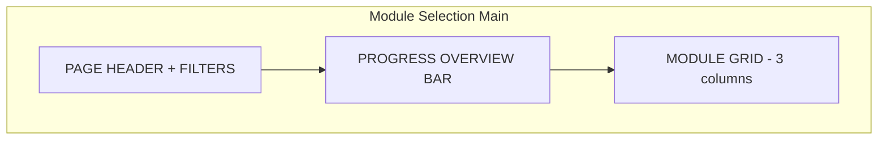

#### 3A. Page Header + Filters
- **Title:** `"Learning Modules"` (28px bold).
- **Subtitle:** `"Master system design from fundamentals to advanced distributed systems"` (16px muted).
- **Filter row (below title, 48px):**
  - **Difficulty filter:** Segmented control with `All` | `Beginner` | `Intermediate` | `Advanced`. Default: `All`.
  - **Status filter:** Segmented control with `All` | `Not Started` | `In Progress` | `Completed`.
  - **Sort:** Dropdown -- `Recommended` (default) | `Difficulty` | `Progress` | `Alphabetical`.

#### 3B. Progress Overview Bar (Full Width Card)
- **Layout:** Horizontal bar, 64px height.
- **Left:** `"Overall Progress"` label + `"{N}/12 Modules Complete"`.
- **Center:** Segmented progress bar showing all 12 modules as equal segments. Each segment colored: gray (not started), Primary at 50% opacity (in progress), Primary solid (complete). Hover on segment shows module name tooltip.
- **Right:** `"Estimated {N} hours remaining"` text.

#### 3C. Module Grid (3 Columns)
- **12 module cards, each ~360px width, ~320px height:**

Each card structure:
- **Top section (160px):** Gradient background unique to module (each module has its own color pair). Module icon centered (48px, white). Module number in top-left corner (`"01"`, 14px, white, semi-transparent).
- **Bottom section (160px, white/surface background):**
  - Module name: 18px bold (e.g., `"System Design Fundamentals"`).
  - Description: 14px muted, 2-line clamp.
  - Meta row: Difficulty badge (pill) | `"{N} lessons"` | `"~{N}h"` estimated time.
  - Progress bar: Full width, 4px height, shows percentage complete. Label: `"{N}% complete"` right-aligned above bar.
  - **Bottom action area:**
    - Not started: `"Start Module"` button (Primary outline).
    - In progress: `"Continue"` button (Primary filled) + `"Lesson {N}/{M}"` label.
    - Completed: Green checkmark badge + `"Review"` button (ghost).
- **Hover:** Card lifts 4px, shadow deepens. Cursor pointer.
- **Click:** Navigates to that module's content (lessons list, or directly to last lesson in progress).

**The 12 Modules (for reference):**
1. System Design Fundamentals
2. API Design
3. Database Design
4. Caching Strategies
5. Load Balancing
6. Message Queues
7. Distributed Systems
8. Consistent Hashing
9. LLD & Design Patterns
10. Algorithm Visualization
11. Data Structures
12. Interview Preparation

- **Prerequisite indicator:** If a module has a prerequisite not yet completed, show a lock icon overlay and tooltip: `"Complete '{Module Name}' first"`. Card is slightly dimmed (60% opacity). Clicking still navigates but shows a warning modal.

### Responsive
- **Tablet (768px):** 2 columns.
- **Mobile (375px):** 1 column, full-width cards. Filter row becomes horizontal scroll.

### Empty State (New User)
All modules show `"Not Started"` state. A pulsing highlight/arrow points to Module 1 or the recommended starting module. A dismissible banner at top: `"Welcome! We recommend starting with System Design Fundamentals."`.

### Loading State
12 skeleton cards with pulsing gradient backgrounds and gray text lines.

---

## 4. System Design Editor

### Purpose
The core canvas where users build system architecture diagrams with drag-and-drop components, real-time metrics simulation, and AI assistance. This is the most complex screen.

### Layout Structure

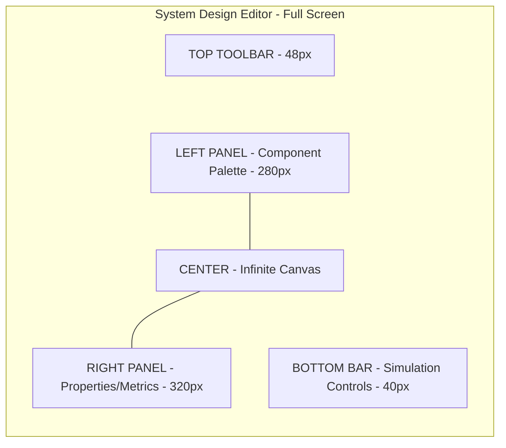

#### 4A. Top Toolbar (48px, Full Width)
- **Left cluster:**
  - Back arrow (returns to Dashboard or previous screen).
  - Design title (editable inline, 16px bold, click to edit, shows pencil icon on hover). Truncated at 200px with ellipsis.
  - Save status indicator: `"Saved"` (green dot) | `"Saving..."` (animated spinner) | `"Unsaved changes"` (yellow dot). Auto-saves every 30 seconds.
- **Center cluster:**
  - Zoom controls: `-` button, zoom percentage display (e.g., `"100%"`), `+` button. Dropdown on percentage: `50%` | `75%` | `100%` | `125%` | `150%` | `Fit to Screen`.
  - Undo/Redo buttons (with Cmd+Z / Cmd+Shift+Z tooltips).
- **Right cluster:**
  - `"Simulate"` toggle button (teal, with play icon). When active: pulsing border, metrics panel auto-opens.
  - `"AI Assist"` button (sparkle icon, Primary). Opens AI chat drawer.
  - Share button (share icon). Opens Share/Export dialog.
  - Collaborators avatars (up to 3 shown, +N overflow). Clicking opens collaboration panel.
  - 3-dot menu: `Export` | `Duplicate` | `Templates` | `Settings` | `Keyboard Shortcuts`.

#### 4B. Left Panel -- Component Palette (280px, Collapsible)
- **Toggle:** Vertical tab on the right edge of panel, click or `Cmd+1` to toggle.
- **Search bar (top):** `"Search components..."` (32px height, full width of panel).
- **Category accordion sections (each expandable/collapsible):**

  **Clients (collapsed by default):**
  - Web Browser, Mobile Client, Desktop Client, IoT Device

  **Networking:**
  - Load Balancer, API Gateway, CDN, DNS, Reverse Proxy, Firewall

  **Compute:**
  - Web Server, Application Server, Worker, Serverless Function, Container, VM

  **Storage:**
  - SQL Database (PostgreSQL, MySQL icons), NoSQL Database (MongoDB, Cassandra, Redis, DynamoDB icons), Object Storage (S3), File System, Data Warehouse

  **Messaging:**
  - Message Queue (Kafka, RabbitMQ, SQS icons), Event Bus, Pub/Sub, Stream Processor

  **Caching:**
  - In-Memory Cache (Redis, Memcached), CDN Cache, Application Cache, Browser Cache

  **Infrastructure:**
  - Monitoring, Logging, Service Mesh, Config Server, Service Registry

  **Custom:**
  - Generic Service, Text Annotation, Group/Zone, External System

- **Each component item:** Icon (24px) + name (14px). Drag to canvas to place. Double-click to add at canvas center.
- **Scrollable** within panel. Sticky search bar.

#### 4C. Center -- Infinite Canvas
- **Background:** Subtle dot grid pattern (dots every 20px, 1px, 10% opacity). Grid snaps components to nearest 20px.
- **Interactions:**
  - **Pan:** Hold space + drag, or middle-mouse drag, or two-finger trackpad.
  - **Zoom:** Cmd+scroll, pinch on trackpad, or toolbar controls.
  - **Select:** Click component. Multi-select: Shift+click or drag selection box.
  - **Move:** Drag selected component(s). Hold Shift to constrain to axis.
  - **Connect:** Hover over component edge, connection handle (small circle) appears. Drag from handle to another component to create connection arrow.
  - **Connection arrows:** Directed (arrow head). Click arrow to select. Properties panel shows: label (editable), line style (solid/dashed/dotted), protocol label (HTTP, gRPC, TCP, WebSocket), data flow direction, estimated throughput.
  - **Right-click context menu** on canvas: `Paste` | `Select All` | `Fit to Screen` | `Add Annotation` | `Add Zone`.
  - **Right-click context menu** on component: `Edit Properties` | `Duplicate` | `Delete` | `Copy` | `Group` | `Bring to Front` | `Send to Back`.
  - **Minimap:** Bottom-right corner, 160x120px, shows overview of entire canvas with viewport rectangle. Click to navigate. Toggle with `Cmd+M`.

- **Component rendering on canvas:**
  - Each component: rounded rectangle (120x80px default), icon top center, name below, optional subtitle (e.g., "PostgreSQL", "us-east-1"). Selection: blue dashed border with 8 resize handles.
  - Group/Zone: dashed rounded rectangle, label in top-left. Components can be dragged into zones. Zone has colored background at 5% opacity.

#### 4D. Right Panel -- Properties & Metrics (320px, Collapsible)
- **Toggle:** Vertical tab on the left edge, or `Cmd+2`.
- **Two tabs at top:** `Properties` | `Metrics`.

**Properties tab (when a component is selected):**
- Component icon + name (editable text field, 18px).
- Type label (read-only, e.g., "SQL Database").
- **Configuration section:**
  - Technology dropdown (e.g., for SQL Database: PostgreSQL, MySQL, Aurora, CockroachDB).
  - Region/Zone text field.
  - Instance type / sizing dropdown.
  - Replicas: number stepper (1-100).
  - Custom key-value pairs: `+ Add Property` button. Each pair: text key + text value + delete icon.
- **Connections section:**
  - List of incoming/outgoing connections with target name, protocol, and throughput field.
- **Notes section:**
  - Multiline text area for freeform notes about this component.
- **Delete button** at bottom (danger red, with confirmation).

**Properties tab (when nothing selected):**
- `"Select a component to view its properties"` message with pointer illustration.

**Metrics tab (visible when simulation is running):**
- **System-level metrics (always visible):**
  - Total QPS: large number with sparkline.
  - p50 / p95 / p99 latency: three values with color coding (green/yellow/red).
  - Availability: percentage with uptime indicator.
  - Estimated cost: monthly cost estimate with breakdown link.
- **Component-level metrics (when component selected):**
  - CPU utilization: gauge chart.
  - Memory usage: gauge chart.
  - Connections: current/max.
  - Throughput: requests/sec with mini line chart (last 60s simulated).
  - Error rate: percentage with color coding.
  - Queue depth (for message queues): bar indicator.

#### 4E. Bottom Bar -- Simulation Controls (40px)
- **Left:** `"Simulation"` label + status indicator (green dot = running, gray = stopped).
- **Center:**
  - Play/Pause button (toggle).
  - Speed control: `0.5x` | `1x` | `2x` | `5x` | `10x` (segmented control).
  - Scenario dropdown: `Normal Load` | `Peak Traffic (10x)` | `Database Failure` | `Network Partition` | `Gradual Ramp` | `Custom...`.
- **Right:**
  - `"Reset"` button (clears simulation state).
  - Time elapsed: `"00:00:00"` counter.
  - Notification area: Shows simulation events as they occur (e.g., "Cache miss rate increasing", "DB connection pool exhausted") as toast-like chips that auto-dismiss after 5s.

#### AI Assist Drawer (Slides in from Right, Overlays Part of Canvas)
- **Triggered by:** `"AI Assist"` button or `Cmd+I`.
- **Width:** 400px, overlays right panel.
- **Top:** `"AI Assistant"` header + close X button.
- **Chat area:** Message bubbles. User messages right-aligned (Primary background), AI messages left-aligned (surface). Scrollable.
- **Input area:** Text field + send button. Suggestions as chips above input: `"Identify bottlenecks"` | `"Suggest improvements"` | `"Estimate capacity"` | `"Explain this architecture"`.
- **AI can:** Highlight components on canvas, suggest additions, annotate with warnings, generate metrics estimates, answer questions about the design.

### Responsive
- **Tablet:** Left panel collapses to icon-only (40px). Right panel collapses by default, accessible via toggle. Bottom bar reduces to Play/Pause + scenario only.
- **Mobile:** Not optimized for mobile. Show message: `"System Design Editor works best on desktop. Open on a larger screen for the full experience."` with `"View Read-Only"` option that shows a static preview.

### Empty State (New Design)
- Canvas shows a centered prompt card: `"Start by dragging components from the palette, or choose a template"`. Two buttons: `"Browse Templates"` | `"Start from Scratch"` (dismisses card). Palette is open by default. Right panel shows Tips section with 3 quick tips.

### Loading State
- Toolbar loads immediately. Canvas shows centered spinner (`"Loading your design..."`). Left and right panels show skeleton content.

---

## 5. Algorithm Visualizer

### Purpose
Visualize algorithms step-by-step with animated data structure rendering, synchronized code panel, and complexity analysis.

### Layout Structure

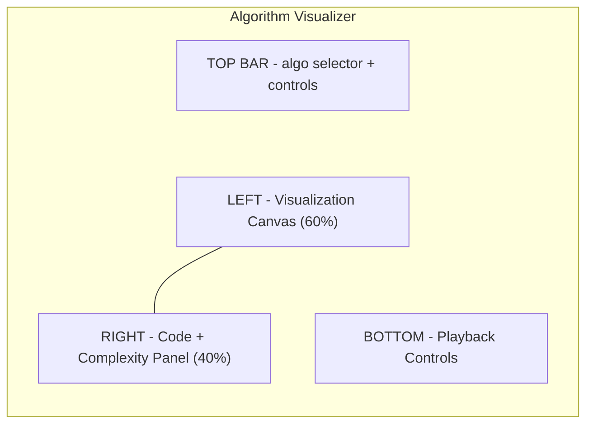

#### 5A. Top Bar (48px)
- **Left:** Back arrow + `"Algorithm Visualizer"` title.
- **Center:** Algorithm selector dropdown (280px):
  - Categories: `Sorting` | `Searching` | `Graph` | `Tree` | `Dynamic Programming` | `String`.
  - Currently selected algorithm name displayed (e.g., `"Merge Sort"`).
  - Dropdown shows categories with sub-items. Each item: name + difficulty badge + estimated time.
- **Right:** Input configuration button (gear icon, opens input config popover) + `"Reset"` button + speed indicator.

#### 5B. Visualization Canvas (Left, 60%)
- **Array visualizations:** Horizontal bars of varying height, each labeled with value. Color-coded: default (gray), comparing (yellow), swapping (red), sorted (green), pivot (purple). Bars animate smoothly when swapping positions.
- **Graph visualizations:** Nodes as circles with value labels, edges as lines. Visited nodes change color. Current node has a pulsing border. BFS uses blue, DFS uses orange for traversal highlighting.
- **Tree visualizations:** Top-down tree layout. Nodes as circles, edges as lines. Highlights: current node (yellow border), visited (green fill), target (red border).
- **DP visualizations:** Table/grid where cells fill in as computed. Color gradient from cold (blue) to hot (red) for value magnitude. Current cell has pulsing highlight.
- **Annotations:** Floating labels showing variable values, pointer positions, recursion depth. Connected to relevant data by thin leader lines.
- **Step indicator:** Top-left of canvas: `"Step {N} of {M}"` with a thin progress bar.

#### 5C. Code Panel (Right Top, 60% of Right Column)
- **Tab bar:** `Code` | `Pseudocode` | `Explanation`.
- **Code tab:** Syntax-highlighted code (JetBrains Mono, 13px). Current executing line highlighted with yellow background and left gutter arrow. Previous lines have green left gutter dot (executed). Upcoming lines are normal.
- **Line numbers** on left gutter.
- **Language selector** dropdown in tab bar: `Python` | `JavaScript` | `Java` | `C++` | `Go`.
- **Pseudocode tab:** Simplified pseudocode with the same line-highlighting behavior.
- **Explanation tab:** Human-readable step-by-step explanation. Current step shown in bold, previous steps dimmed, upcoming steps visible but muted.

#### 5D. Complexity Panel (Right Bottom, 40% of Right Column)
- **Header:** `"Complexity Analysis"`.
- **Time complexity:** `"O(n log n)"` in large text (24px, bold). Breakdown: `"Best: O(n log n)"` | `"Average: O(n log n)"` | `"Worst: O(n^2)"` for the current algorithm.
- **Space complexity:** `"O(n)"` in large text.
- **Live counters (during playback):**
  - Comparisons: `"{N}"` with real-time increment animation.
  - Swaps/Assignments: `"{N}"`.
  - Recursive calls: `"{N}"`.
  - Memory used: `"{N} cells"`.
- **Mini chart:** Line graph showing operations count vs. input size for different complexities (n, n log n, n^2) with the current algorithm's line highlighted.

#### 5E. Playback Controls (Bottom Bar, 48px)
- **Layout:** Centered control cluster.
- **Controls (left to right):**
  - `|<<` (jump to start).
  - `<` (step back one).
  - Play/Pause toggle (large, 40px).
  - `>` (step forward one).
  - `>>|` (jump to end / run to completion).
- **Speed slider:** Labeled `"Speed"`, range from 0.25x to 4x, default 1x. Current value shown.
- **Progress bar:** Full width, thin, shows progress through algorithm steps. Clickable to jump to any step. Shows step markers for key events (e.g., partitions in quicksort).
- **Right side:** `"Auto"` toggle -- when on, runs continuously at selected speed. When off, requires manual stepping.

#### Input Configuration Popover (from gear icon)
- **Array algorithms:** Input size slider (5-100), input type radio (`Random` | `Nearly Sorted` | `Reversed` | `Few Unique` | `Custom`). Custom shows editable text field for comma-separated values.
- **Graph algorithms:** Node count, edge count, weighted toggle, directed toggle, or select from preset graphs.
- **Tree algorithms:** Tree type (BST, AVL, Heap), node count, or custom insert sequence.
- `"Generate"` button applies new input and resets visualization.

### Responsive
- **Tablet:** Code panel moves to bottom (collapsible tab). Visualization takes full width. Complexity panel becomes a floating overlay.
- **Mobile:** Visualization full-screen. Code panel accessible via bottom sheet (swipe up). Playback controls at bottom. Complexity panel in expandable section within bottom sheet.

### Empty State
- Default algorithm (Merge Sort with 10 random elements) pre-loaded and paused at Step 0. Welcome overlay: `"Press Play or Step Forward to begin"`.

### Loading State
- Canvas shows skeleton bars/circles. Code panel shows skeleton lines. Controls disabled with spinner.

---

## 6. Data Structure Explorer

### Purpose
Interactive exploration of data structures with animated insert/delete/search operations, step-by-step breakdowns, and comparison views.

### Layout Structure

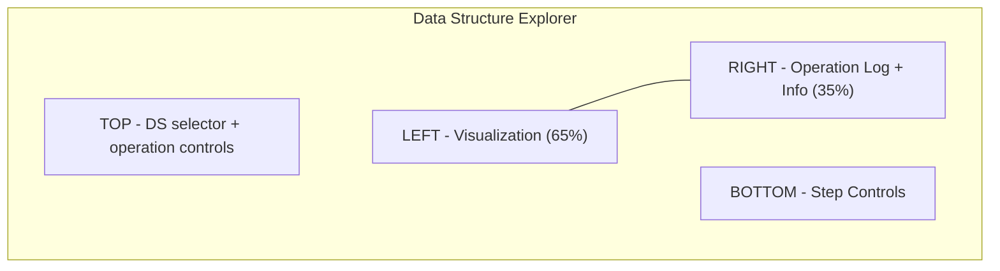

#### 6A. Top Bar (56px)
- **Left:** Back arrow + `"Data Structure Explorer"` title.
- **Center:** Data structure selector -- large segmented control or dropdown:
  - `Array` | `Linked List` | `Stack` | `Queue` | `Hash Table` | `Binary Search Tree` | `AVL Tree` | `Red-Black Tree` | `Heap` | `Trie` | `Graph` | `B-Tree`.
  - Active DS has filled background.
- **Right:** `"Compare"` toggle (enables side-by-side comparison of two DS) + `"Reset"` button.

#### 6B. Operation Controls (Below Top Bar, 48px)
- **Layout:** Horizontal row of operation buttons + value input.
- **Value input field:** Numeric text field (120px width), labeled `"Value"`.
- **Operation buttons** (vary by data structure):
  - Common: `Insert` | `Delete` | `Search` | `Clear`.
  - Array specific: `Insert at Index` (with index field) | `Sort`.
  - BST specific: `Insert` | `Delete` | `Search` | `Traverse` (dropdown: Inorder, Preorder, Postorder, Level-order).
  - Hash Table specific: `Put(key, value)` (two input fields) | `Get(key)` | `Remove(key)`.
  - Stack: `Push` | `Pop` | `Peek`.
  - Queue: `Enqueue` | `Dequeue` | `Peek`.
- **Each operation button:** Outlined style, becomes filled with teal while executing animation.
- **Batch operations:** `"Batch Insert"` button opens modal with comma-separated input.

#### 6C. Visualization Canvas (Left, 65%)
- **Rendering by type:**
  - **Array:** Horizontal row of cells. Each cell shows value, index below. Highlighted cells: accessing (yellow), comparing (orange), inserting (green flash), removing (red flash).
  - **Linked List:** Horizontal chain of node boxes with arrow connectors. Each node: value + next pointer. Head/tail labeled. New node appears with fade-in, removed node fades out with broken arrow animation.
  - **Stack:** Vertical stack of elements (bottom-up). Push animation: element drops from above. Pop animation: top element lifts off.
  - **Queue:** Horizontal line. Enqueue animation: element enters from right. Dequeue animation: element exits from left.
  - **Hash Table:** Grid of buckets (vertical list). Each bucket shows index and chained elements. Hash function visualization: `"hash(42) = 42 % 8 = 2"` shown above as animation.
  - **BST/AVL/RB Tree:** Top-down tree. Rotations animate smoothly. AVL balance factors shown at each node. RB tree nodes colored red/black. Insertion path highlighted step-by-step.
  - **Heap:** Tree view (top) + array view (bottom) synchronized. Swap animations mirror in both views.
  - **Trie:** Multi-way tree with characters on edges. Search highlights path character by character.
  - **B-Tree:** Multi-element nodes with splitting animation.
  - **Graph:** Force-directed layout. Nodes draggable. Edges labeled with weights if applicable.

- **Annotations on canvas:**
  - Variable pointers (arrows labeled `head`, `tail`, `current`, `parent`, etc.).
  - Step explanation text (16px, positioned near active operation area, e.g., `"Comparing 42 with node 35, going right"`).

#### 6D. Operation Log + Info Panel (Right, 35%)
- **Two tabs:** `Operations` | `Info`.

**Operations tab:**
- Scrollable log of all operations performed, newest at top.
- Each entry: timestamp (relative, e.g., `"12s ago"`), operation name + value (e.g., `"Insert(42)"`), result (e.g., `"Added at index 3"`, `"Not found"`), step count.
- Clicking a log entry replays that operation's animation.

**Info tab:**
- DS name and illustration.
- **Time Complexity Table:**
  | Operation | Average | Worst |
  |-----------|---------|-------|
  | Insert    | O(...)  | O(...)|
  | Delete    | O(...)  | O(...)|
  | Search    | O(...)  | O(...)|
- **Space Complexity:** `"O(n)"`.
- **Use Cases:** Bulleted list of real-world applications.
- **Comparison notes** (if compare mode active): Side-by-side complexity table for both selected DS.

#### 6E. Step Controls (Bottom, 40px)
- Same playback controls as Algorithm Visualizer: `|<<`, `<`, Play/Pause, `>`, `>>|`, speed slider.
- `"Auto-animate"` toggle: When on, each operation auto-animates. When off, user must step through manually.
- Step counter: `"Step {N}/{M}"`.

### Responsive
- **Tablet:** Info panel moves below visualization (stacked). Operation controls scroll horizontally.
- **Mobile:** Visualization full-width. Operation buttons become dropdown menu. Info panel in bottom sheet. Step controls pinned to bottom.

### Empty State
- Default data structure (BST) loaded with 5 pre-inserted nodes. Welcome message: `"Try an operation! Enter a value and click Insert."`. Value field pre-focused.

### Loading State
- DS selector shows as skeleton tabs. Canvas blank with centered spinner. Info panel shows skeleton text.

---

## 7. LLD Studio

### Purpose
Build low-level design diagrams: class diagrams, sequence diagrams, and state machines. Includes pattern library and code generation.

### Layout Structure

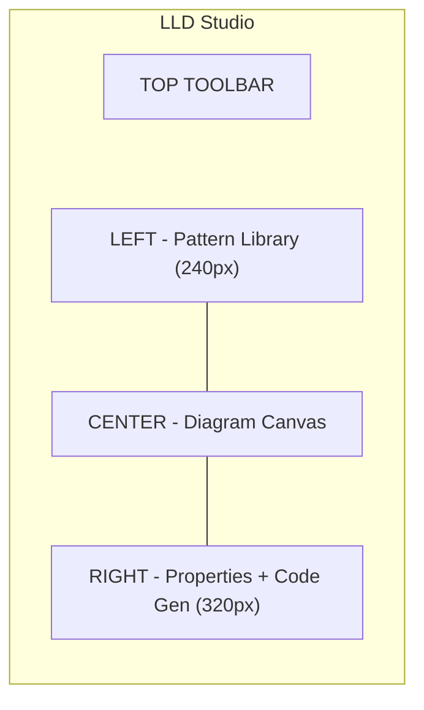

#### 7A. Top Toolbar (48px)
- **Left:** Back arrow + design name (editable) + save indicator.
- **Center:** Diagram type selector (segmented control): `Class Diagram` | `Sequence Diagram` | `State Diagram` | `Component Diagram`. Switching type changes the palette and canvas rendering.
- **Right:** `"AI Review"` button (sparkle icon) | `"Generate Code"` button (code icon, opens code panel) | Share | 3-dot menu.

#### 7B. Pattern Library (Left Panel, 240px)
- **Search bar:** `"Search patterns..."`.
- **Accordion sections:**

  **Creational Patterns:**
  - Singleton, Factory Method, Abstract Factory, Builder, Prototype.

  **Structural Patterns:**
  - Adapter, Bridge, Composite, Decorator, Facade, Flyweight, Proxy.

  **Behavioral Patterns:**
  - Chain of Responsibility, Command, Iterator, Mediator, Memento, Observer, State, Strategy, Template Method, Visitor.

  **SOLID Principles** (reference, not draggable):
  - Each principle with expand-for-explanation.

- **Each pattern item:** Icon + name + difficulty dot (green/yellow/red).
- **Drag to canvas:** Drops the pattern's class structure (e.g., dragging Observer creates Subject and Observer abstract classes with their relationship).
- **Click (don't drag):** Opens pattern detail popover: description, UML diagram, sample code, use cases.

#### 7C. Diagram Canvas (Center)
- **Class Diagram mode:**
  - Classes rendered as UML class boxes: name compartment (bold, centered), attributes compartment (- private, + public, # protected), methods compartment (with return types and parameters).
  - Relationships: solid line (association), dashed line (dependency), diamond (aggregation/composition), triangle (inheritance), dashed triangle (implementation).
  - Add class: double-click canvas or `+` button floating at bottom-right.
  - Edit class: double-click the class box opens inline editing.
  - Connect: drag from class edge, choose relationship type from radial menu.

- **Sequence Diagram mode:**
  - Vertical lifelines for each actor/object.
  - Horizontal message arrows (solid = sync, dashed = return, half-arrow = async).
  - Activation boxes on lifelines.
  - Combined fragments (alt, loop, opt) as labeled rectangles around groups of messages.
  - Add actor: `+` button at top of canvas.
  - Add message: click on source lifeline, drag to target.

- **State Diagram mode:**
  - Rounded rectangles for states. Filled circle for initial state, bullseye for final.
  - Arrows for transitions, labeled with `event [guard] / action`.
  - Composite states (nested state machines).

#### 7D. Properties + Code Gen Panel (Right, 320px)
- **Two tabs:** `Properties` | `Generated Code`.

**Properties tab (class selected):**
- Class name field (editable).
- Stereotype dropdown: `<<interface>>` | `<<abstract>>` | `<<enum>>` | none.
- Attributes list: Each row: visibility dropdown (+/-/#/~) | type field | name field | delete icon. `+ Add Attribute` button.
- Methods list: Same format. Each row: visibility | return type | name | parameters (comma-separated) | delete. `+ Add Method` button.
- Relationships section: List of connected classes with relationship type dropdown.

**Generated Code tab:**
- Language selector: `Java` | `Python` | `TypeScript` | `C#` | `Go`.
- Syntax-highlighted code output generated from the diagram.
- `"Copy"` button + `"Download"` button.
- `"Regenerate"` button (in case user changed diagram).
- AI enhancement: `"Improve with AI"` button -- AI adds method bodies, documentation, and missing patterns.

### Responsive
- **Tablet:** Pattern library collapsed to icon-only. Properties panel hidden by default (toggle).
- **Mobile:** Read-only view message similar to System Design Editor.

### Empty State
- Canvas centered prompt: `"Create your first class or drag a design pattern from the library"`. Three starter buttons: `"Start with Observer Pattern"` | `"Start with Factory Pattern"` | `"Blank Canvas"`.

### Loading State
- Toolbar and panel structures load immediately (skeleton). Canvas shows spinner.

---

## 8. Database Lab

### Purpose
Design database schemas with ER diagrams, learn normalization through interactive exercises, analyze query plans, and visualize indexing.

### Layout Structure

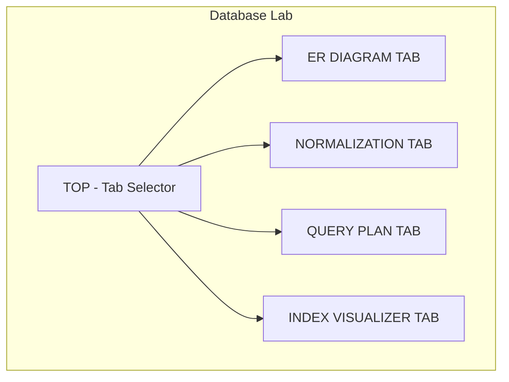

#### 8A. Top Bar (48px)
- **Left:** Back arrow + `"Database Lab"` title + design name (editable).
- **Center:** Primary tab bar: `ER Diagram` | `Normalization` | `Query Plan` | `Index Visualizer`. Active tab has bottom border accent.
- **Right:** `"AI Assist"` button | Save indicator | Share.

#### 8B. ER Diagram Tab
- **Left panel (260px) -- Entity Palette:**
  - `"+ New Table"` button (Primary, full width).
  - List of existing tables as collapsible items. Each shows: table name, row count estimate, icon for table type (fact/dimension).
  - Clicking a table in list selects it on canvas and scrolls to it.
  - `"+ New Enum"` button for enum types.
  - `"Import SQL"` button (parse CREATE TABLE statements).

- **Canvas (center):**
  - Tables rendered as boxes: header row (table name, colored by type: blue for entity, green for junction), column rows (each: column name, data type, constraints icons -- PK key, FK chain, NN exclamation, UQ fingerprint, IDX lightning).
  - Relationships: crow's foot notation lines between tables. Labels: `1:1`, `1:N`, `M:N`. Relationship lines are draggable (anchor adjustable).
  - **Add column:** Click `+` row at bottom of table.
  - **Add relationship:** Drag from FK column to PK column of another table.
  - Same pan/zoom controls as System Design Editor.

- **Right panel (300px) -- Table Properties:**
  - Table name (editable).
  - Columns list: Each row: name | type dropdown (VARCHAR, INT, BIGINT, TEXT, BOOLEAN, TIMESTAMP, JSON, UUID, etc.) | constraints checkboxes (PK, FK, NOT NULL, UNIQUE, DEFAULT) | delete. `+ Add Column` button.
  - Indexes section: List of indexes. Each: name, columns (multi-select), type (B-Tree, Hash, GIN, GiST), unique toggle. `+ Add Index`.
  - Constraints section: CHECK constraints as editable text.
  - SQL Preview: Live-updated CREATE TABLE statement.

#### 8C. Normalization Tab
- **Layout:** Left is interactive exercise area (65%), right is reference panel (35%).
- **Exercise area:**
  - Shows a denormalized table with sample data.
  - Task instruction: e.g., `"Identify functional dependencies and normalize to 3NF"`.
  - Interactive tools: Click to identify FDs (select determinant columns, then dependent columns). Split table button (creates new tables by selecting columns).
  - Step indicator: `"Step 1: Identify Candidate Keys" > "Step 2: Find Partial Dependencies" > "Step 3: Split to 2NF" > "Step 4: Find Transitive Dependencies" > "Step 5: Split to 3NF"`.
  - Validation: `"Check Answer"` button. Green highlights for correct splits, red for incorrect.
- **Reference panel:**
  - Current normal form definitions.
  - Hint system: `"Show Hint"` button (uses AI credits). Progressive hints (first hint is vague, second is more specific).

#### 8D. Query Plan Tab
- **Top:** SQL query input area (multi-line, syntax-highlighted, 120px height). `"Analyze"` button.
- **Main area:** Visual query plan tree (similar to PostgreSQL EXPLAIN output but graphical).
  - Each node: operation type (Seq Scan, Index Scan, Hash Join, Nested Loop, Sort, Aggregate), estimated rows, estimated cost, actual time (if available).
  - Node width proportional to cost.
  - Color coding: red for expensive operations, yellow for medium, green for efficient.
  - Click node for detail panel: filter conditions, output columns, buffers.
- **Bottom panel (collapsible):** Text EXPLAIN output, comparison view (before/after adding index).

#### 8E. Index Visualizer Tab
- **Left (50%):** Visual representation of B-Tree index structure. Animated: shows how a query traverses the tree from root to leaf to find a value. Shows page I/O count.
- **Right (50%):** Configuration panel:
  - Table selector dropdown.
  - Index selector dropdown (shows existing indexes on selected table).
  - Operation: `"Search for value"` (with value input) | `"Range scan"` (with min/max) | `"Insert"` (shows tree rebalancing).
  - Playback controls for animation.
  - Stats: Page reads, tree depth, selectivity, estimated I/O.

### Responsive
- **Tablet:** Panels collapse. Single-tab view with toggle navigation.
- **Mobile:** Read-only mode. Show schema in list format. Interactive tools not available.

### Empty State
- ER Diagram: Centered prompt `"Create your first table or import a SQL schema"`. Quick-start buttons: `"Start with E-Commerce Schema"` | `"Start with Social Media Schema"` | `"Blank"`.
- Other tabs: Require at least one table. Show `"Create tables in the ER Diagram tab first"`.

### Loading State
- Tab bar loads immediately. Canvas shows spinner. SQL import shows progress bar with parsing status.

---

## 9. Distributed Systems Playground

### Purpose
Interactive simulations of distributed systems concepts: consensus algorithms (Raft), consistent hashing, CAP theorem exploration, and failure scenarios.

### Layout Structure

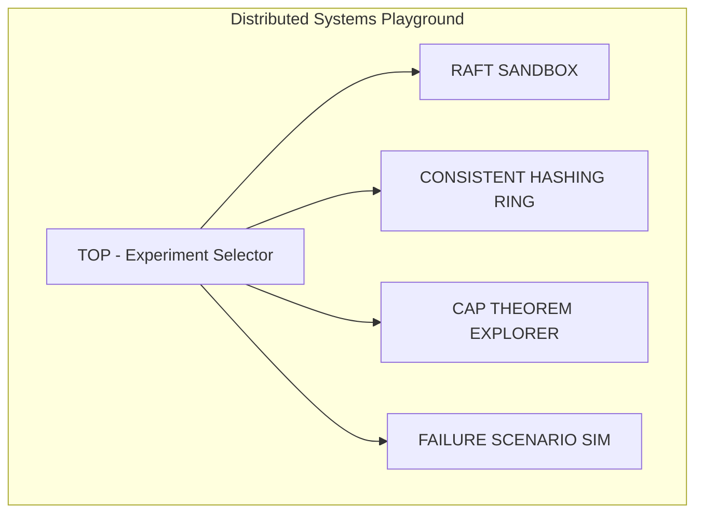

#### 9A. Top Bar (56px)
- **Left:** Back arrow + `"Distributed Systems Playground"` title.
- **Center:** Experiment selector (large segmented control): `Raft Consensus` | `Consistent Hashing` | `CAP Explorer` | `Failure Scenarios`.
- **Right:** `"Reset Experiment"` button | `"AI Explain"` button.

#### 9B. Raft Consensus Sandbox

- **Canvas (70% left):**
  - 5 server nodes arranged in a circle (pentagon layout). Each node is a labeled box showing:
    - Server ID (e.g., `S1`).
    - Current state: `Follower` (gray) | `Candidate` (yellow) | `Leader` (green).
    - Current term number.
    - Log entries as small stacked colored blocks.
    - Commit index indicator.
  - Message arrows between nodes: `RequestVote` (dashed), `AppendEntries` (solid), `VoteGranted` (green), `VoteRejected` (red). Messages animate as they travel between nodes.
  - Network partition visualization: Red dashed line separating nodes into groups.

- **Control Panel (30% right):**
  - **Scenario controls:**
    - `"Trigger Election"` button -- force a new election.
    - `"Kill Node"` dropdown (select node) -- simulates crash.
    - `"Revive Node"` dropdown.
    - `"Create Partition"` -- drag to define partition line.
    - `"Heal Partition"` button.
    - `"Client Request"` button -- submit a log entry to leader.
  - **Speed control:** Slider from `Slow (educational)` to `Fast (realistic)`.
  - **State display:**
    - Current leader, current term.
    - Election timeout values per node.
    - Committed vs uncommitted entries count.
  - **Event log:** Scrollable list of events: `"S3 started election for term 4"`, `"S1 voted for S3"`, `"S3 became leader"`, etc.

#### 9C. Consistent Hashing Ring

- **Canvas (70% left):**
  - Large circle (hash ring) filling most of the canvas.
  - Server nodes positioned on the ring as labeled circles (colored). Each physical node shows N virtual nodes as smaller dots of the same color.
  - Data keys positioned on the ring as diamond markers with labels.
  - Arrows from each key to its assigned server (clockwise traversal).
  - When adding/removing a server, animation shows key reassignment -- keys that move are highlighted, keys that stay are unchanged.

- **Control Panel (30% right):**
  - **Servers:** List of current servers. `"+ Add Server"` button. Each server row: name, color swatch, virtual node count (editable stepper), delete icon.
  - **Keys:** `"+ Add Key"` button (auto-generates or custom name). List of keys with their assigned server shown.
  - **Virtual nodes slider:** Global setting 1-256, shows how ring distribution changes.
  - **Stats:**
    - Distribution chart: Bar chart showing number of keys per server.
    - Standard deviation of distribution.
    - Keys moved on last operation (highlighted in chart).
  - **Scenarios:** `"Add server (see key migration)"` | `"Remove server"` | `"Demonstrate hotspot"`.

#### 9D. CAP Explorer

- **Layout:** Interactive diagram with scenario panels.
- **Center:** CAP triangle diagram (large). Three corners labeled `Consistency`, `Availability`, `Partition Tolerance`. Three edges labeled with database systems that prioritize those two properties:
  - CA edge: `"Traditional RDBMS (PostgreSQL, MySQL)"`.
  - CP edge: `"MongoDB, HBase, Redis Cluster"`.
  - AP edge: `"Cassandra, DynamoDB, CouchDB"`.
  - Movable point on the triangle: user drags to adjust priority weighting. System updates recommendations based on position.

- **Scenario Panel (below):**
  - Three toggle switches: `"Network Partition Active"` | `"Write Request Incoming"` | `"Read Request Incoming"`.
  - Scenario outcome panel: shows what happens under the selected conditions. E.g., `"With network partition active and a write request: CP system rejects the write (unavailable). AP system accepts the write (inconsistent reads possible)."`.
  - Animated visualization: shows two data centers with a partition line, requests flowing, responses showing.

#### 9E. Failure Scenario Simulator
- **Canvas:** Shows a distributed system diagram (3-5 services, load balancer, database replicas, message queue).
- **Failure injection panel (right):**
  - Failure type buttons: `"Network Latency"` (slider: 0-5000ms) | `"Service Crash"` (select service) | `"Database Failover"` | `"Message Queue Backlog"` | `"Split Brain"` | `"Cascading Failure"`.
  - `"Inject Failure"` button.
  - `"Observe"` mode: Shows request flow with timing, retries, circuit breaker activation, failover sequence.
  - Metrics dashboard: Success rate, latency p99, error count, recovery time.

### Responsive
- **Tablet:** Control panel moves to bottom (collapsible panel). Visualization full-width.
- **Mobile:** Simplified view. Raft shows node states as a list with text descriptions. Hashing ring simplified to linear representation. Full interactivity not available; view-only mode with pre-recorded scenarios.

### Empty State
- Default to Raft sandbox with 5 nodes in initial state (all Followers, no leader elected). Prompt: `"Click 'Trigger Election' to start, or wait for timeout."`.

### Loading State
- Simulation engine loading spinner: `"Initializing distributed simulation..."` with progress bar.

---

## 10. Interview Challenge Screen

### Purpose
Timed system design challenge mimicking real interview conditions. Presents requirements, provides constrained canvas, tracks time, and offers limited hints.

### Layout Structure

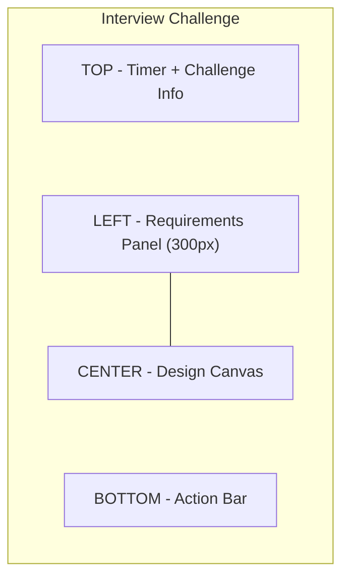

#### 10A. Top Bar (56px, High Contrast)
- **Left:** Challenge title: e.g., `"Design a URL Shortener"` (20px bold). Difficulty badge: `"Medium"` (yellow pill).
- **Center:** TIMER -- large, prominent countdown: `"32:15"` (32px, monospace font, white on dark background). Starts at 45:00 (or configurable). Color changes: green (> 15 min), yellow (5-15 min), red (< 5 min, pulsing). Pause button (only in practice mode, not mock interview mode).
- **Right:** `"Hints"` button with remaining count badge (e.g., `"3"` in a circle). `"Submit"` button (Primary filled, 44px height). `"Give Up"` text button (muted, with confirmation).

#### 10B. Requirements Panel (Left, 300px, Collapsible)
- **Toggle:** Collapse to 40px icon strip, or keyboard `Cmd+R`.
- **Challenge description (scrollable):**
  - **Functional Requirements (header, bold):**
    - Bulleted list: e.g., `"Generate short URLs from long URLs"`, `"Redirect short URL to original"`, `"Custom aliases (optional)"`, `"URL expiration"`.
    - Each requirement has a checkbox -- user can check off addressed requirements.
  - **Non-Functional Requirements (header, bold):**
    - E.g., `"100M URLs/day"`, `"Low latency redirects (< 100ms)"`, `"99.99% availability"`, `"URL length <= 7 characters"`.
  - **Constraints:**
    - `"Read-heavy (100:1 ratio)"`, `"Global users"`, `"No single point of failure"`.
  - **Evaluation Criteria (collapsible):**
    - Scalability (25%), Reliability (25%), API Design (20%), Data Model (15%), Trade-offs (15%).
    - Each criterion shows as a mini progress bar that fills based on AI real-time analysis (if enabled) or stays empty until submission.

- **Hints section (bottom of panel):**
  - `"Hint 1/3"` button. Each hint reveals progressively:
    - Hint 1: General direction (e.g., `"Consider base62 encoding for short URLs"`).
    - Hint 2: Component suggestion (e.g., `"Think about caching the most popular redirects"`).
    - Hint 3: Architecture hint (e.g., `"Use consistent hashing for horizontal scaling"`).
  - Each used hint deducts from final score (noted in small text).
  - `"Ask AI"` (costs 2 hints worth): Opens a limited AI chat for one question.

#### 10C. Design Canvas (Center)
- Same infinite canvas as System Design Editor (Section 4C) but with:
  - **Reduced component palette:** Floating mini-palette (collapsible toolbar on left edge with icons only, no full panel). Components grouped by icon: Clients, Compute, Storage, Networking, Caching, Messaging.
  - **No simulation controls** (simulation available only after submission in results screen).
  - **No AI Assist button** (hints are the only help).
  - **Notes tool:** Sticky notes that can be placed on canvas for writing trade-offs, calculations, estimates.
  - **Text tool:** For adding labels, annotations, throughput numbers.
  - **Estimation scratch pad:** Floating calculator panel (toggle with `Cmd+E`): Quick capacity estimation with fields for DAU, read/write ratio, storage per record, retention period. Auto-calculates QPS, storage, bandwidth.

#### 10D. Bottom Action Bar (48px)
- **Left:** Checklist summary: `"Requirements addressed: 4/6"` (green for checked, with small progress bar).
- **Center:** Component count: `"{N} components"` | `"{M} connections"`.
- **Right:** `"Save Draft"` button (ghost) | `"Submit Design"` button (Primary filled, large). Submit triggers confirmation modal: `"Are you sure? You cannot modify after submission."` with `Cancel` and `Confirm Submit` buttons.

### Responsive
- **Tablet:** Requirements panel becomes top collapsible panel (60px when collapsed showing title and timer). Canvas fills remaining space.
- **Mobile:** Not recommended. Show message: `"Interview challenges are best experienced on desktop."` with option to `"Read Requirements Only"`.

### Empty State
- Challenge loads with requirements populated. Canvas is empty. Timer starts (or shows `"Press Start when ready"` if in practice mode with manual start). Brief 3-second overlay: `"Read the requirements carefully. Plan before you build."`.

### Loading State
- Challenge prompt loads first (requirements panel). Canvas shows `"Preparing your canvas..."` spinner. Timer shows `"--:--"` until ready.

---

## 11. Interview Results Screen

### Purpose
Post-submission detailed analysis of the interview challenge. AI-generated feedback, score breakdown, comparison with reference architecture, and improvement plan.

### Layout Structure

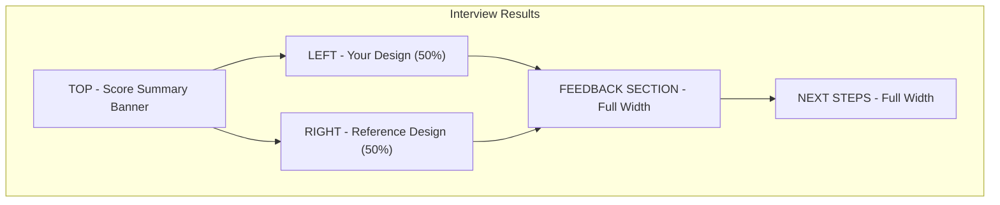

#### 11A. Score Summary Banner (120px, Full Width)
- **Layout:** High-impact banner with gradient background.
- **Center:** Overall score as large circular gauge: `"78/100"` (64px font inside a radial progress ring). Score color: red (0-39), yellow (40-69), green (70-100).
- **Left of gauge:** Challenge name + difficulty + time taken (`"Completed in 38:24"`).
- **Right of gauge:** 5 scoring criteria as horizontal mini-bars:
  - Scalability: 85/100 (green bar).
  - Reliability: 72/100 (green bar).
  - API Design: 80/100 (green bar).
  - Data Model: 65/100 (yellow bar).
  - Trade-offs Discussion: 55/100 (yellow bar).
  - Each bar: label left, filled bar center, score right.
- **Bottom of banner:** `"Hints used: 1/3 (-5 points)"` | `"Time bonus: +3 points"` (penalties and bonuses).

#### 11B. Design Comparison (Split View)

- **Left -- Your Design (50%):**
  - Read-only canvas preview of submitted design. Zoom/pan controls. Components annotated with colored markers:
    - Green badge: `"Strong choice"` (e.g., cache layer).
    - Yellow badge: `"Acceptable"` (e.g., single DB without replica).
    - Red badge: `"Missing"` or `"Concern"` (e.g., no rate limiter).
  - **Annotations:** AI-generated callout bubbles pointing to specific components or missing areas. Each callout: 2-3 sentence explanation. E.g., on a single database: `"Consider adding read replicas for a 100:1 read/write ratio. This would improve read latency and reduce load on primary."`.

- **Right -- Reference Design (50%):**
  - Read-only canvas showing the expert reference architecture for this challenge. Same visual style.
  - `"Toggle Overlay"` button: Overlays reference on top of user's design at 50% opacity to see differences.
  - Components present in reference but missing in user's design highlighted with dashed red outlines.
  - Components in user's design not in reference shown as blue outlines (acceptable alternatives).

- **Divider:** Draggable split handle between the two views. Default 50/50.

#### 11C. AI Feedback Section (Full Width, Below Comparison)
- **Layout:** Card with tabs.
- **Tabs:** `Detailed Feedback` | `Improvement Suggestions` | `Trade-offs Analysis`.

**Detailed Feedback tab:**
- Structured text sections:
  - `"What you did well"` (green left border): Bulleted list of strengths.
  - `"Areas for improvement"` (yellow left border): Bulleted list with specific suggestions.
  - `"Critical gaps"` (red left border): Missing components or concepts that would fail in production.
  - `"Estimation Review"`: Comparison of user's estimates vs expected ranges.

**Improvement Suggestions tab:**
- Prioritized list of 5-7 specific improvements.
- Each suggestion: Title, explanation, impact level (High/Medium/Low), estimated effort to learn the concept, link to relevant module/lesson.

**Trade-offs Analysis tab:**
- Table of key decisions:
  | Decision | User's Choice | Alternative | Trade-off |
  |----------|--------------|-------------|-----------|
  | Database | SQL (PostgreSQL) | NoSQL (DynamoDB) | SQL offers strong consistency but may need sharding at scale |
  | Caching | Redis | Memcached | Redis supports richer data types; Memcached is simpler |

#### 11D. Next Steps Section (Full Width)
- **Layout:** Three action cards side by side.
- **Card 1:** `"Retry This Challenge"` -- Redo with a fresh timer. Shows personal best score.
- **Card 2:** `"Related Challenge"` -- Suggested next challenge based on weaknesses. E.g., `"Design a Rate Limiter"` (addresses the missing rate limiter).
- **Card 3:** `"Study Materials"` -- Links to specific modules/lessons for weak areas. E.g., `"Review: Database Replication (Module 3, Lesson 4)"`.
- **Below cards:** `"Return to Dashboard"` link + `"Share Results"` button (generates shareable image of score breakdown).

### Responsive
- **Tablet:** Comparison views stack vertically (your design top, reference bottom). Feedback tabs remain horizontal.
- **Mobile:** Score banner becomes compact (score large, criteria list below). Designs become swipeable carousel. Feedback is scrollable.

### Empty State
- Not applicable (always loaded with submission data).

### Loading State
- Score banner shows `"AI is analyzing your design..."` with animated progress bar (10 steps: parsing components, analyzing connections, evaluating scalability, etc.). Each step checks off with green checkmark. Expected time: 5-10 seconds.

---

## 12. Template Gallery

### Purpose
Browse, search, and filter 55+ pre-built system design templates. Organized by category with rich previews.

### Layout Structure

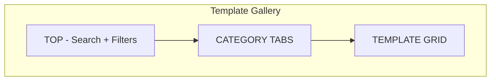

#### 12A. Page Header + Search (Full Width)
- **Title:** `"Template Gallery"` (28px bold).
- **Subtitle:** `"55+ ready-to-use system design templates. Learn from real architectures."` (16px muted).
- **Search bar (prominent, 400px, 44px height):** `"Search templates..."`. Searches template names, descriptions, tags. Results filter in real-time (debounced 200ms).
- **View toggle (right of search):** Grid icon | List icon. Default: Grid.
- **Sort dropdown:** `Popularity` (default) | `Newest` | `Difficulty` | `Alphabetical`.

#### 12B. Category Tabs (Horizontal Scroll)
- **Pill-style horizontal scroll tabs:**
  - `All (55)` | `Social Media (8)` | `E-Commerce (7)` | `Messaging (6)` | `Storage (5)` | `Streaming (5)` | `Search (4)` | `Infrastructure (4)` | `Finance (4)` | `Real-Time (4)` | `Gaming (3)` | `IoT (3)` | `ML/AI (2)`.
  - Count in parentheses. Active tab: filled Primary background, white text.
  - Horizontal scroll with fade edges on overflow.

#### 12C. Template Grid
- **Grid view (default):** 3 columns on desktop, 2 on tablet, 1 on mobile.
- **Each template card (360px width, ~300px height):**
  - **Preview thumbnail (top 60% of card, ~180px):** Miniature rendering of the system design canvas. Static image (generated from actual template data). Dark background, colored component nodes visible. On hover: subtle zoom animation (1.02x scale).
  - **Info section (bottom 40%):**
    - Template name: 16px bold (e.g., `"Twitter/X Timeline Architecture"`).
    - Category badge: pill (e.g., `"Social Media"`, colored).
    - Difficulty badge: `Beginner` (green) | `Intermediate` (yellow) | `Advanced` (red).
    - Description: 13px muted, 2-line clamp (e.g., `"Fan-out on write vs. fan-out on read, timeline cache, celebrity handling"`).
    - Meta row: Component count icon + `"{N} components"` | Heart icon + `"{N} likes"` | Fork icon + `"{N} forks"`.
  - **Hover overlay:** Semi-transparent overlay with two buttons:
    - `"Preview"` (opens Template Detail/Preview screen).
    - `"Open in Editor"` (opens in System Design Editor with template loaded).
  - **Click (not on buttons):** Opens Template Detail/Preview.

- **List view:**
  - Full-width rows (80px height each).
  - Each row: Small thumbnail (64x48px) | Name (16px bold) | Category badge | Difficulty badge | Description (1 line) | Component count | Likes | `"Preview"` button | `"Open"` button.

- **Pagination / Infinite scroll:**
  - Load 12 templates initially. Infinite scroll loads 12 more. Scroll sentinel at bottom triggers load. Skeleton cards appear while loading.
  - Filter/search changes reset scroll position.

### Responsive
- **Tablet:** 2-column grid. Search bar full width. Category tabs scroll.
- **Mobile:** 1-column. Cards full-width. Thumbnail height reduces to 120px. List view becomes default (more efficient on small screens).

### Empty State
- When search/filter yields no results: Illustration of empty box + `"No templates match your search"` + `"Try different keywords or browse all categories"` + `"Clear Filters"` button.

### Loading State
- 6 skeleton cards (3x2 grid) with pulsing gray rectangles for thumbnails and text lines. Category tabs show as skeleton pills.

---

## 13. Template Detail / Preview

### Purpose
Read-only detailed view of a template before opening it in the editor. Shows the full diagram, description, components used, learning notes, and community stats.

### Layout Structure

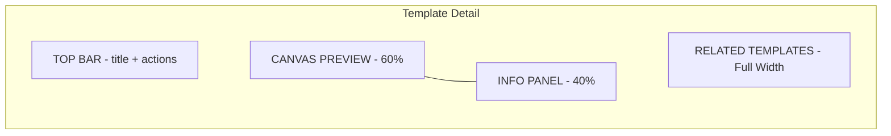

#### 13A. Top Bar (56px)
- **Left:** Back arrow (returns to Template Gallery) + breadcrumb: `"Templates > Social Media > Twitter Timeline"`.
- **Right:** `"Open in Editor"` button (Primary filled, prominent, 44px height) + `"Fork to My Designs"` button (outline) + `"Like"` button (heart icon, toggleable, count displayed) + Share icon.

#### 13B. Canvas Preview (Left, 60%)
- **Read-only rendering** of the template's system design canvas. Pan and zoom enabled. No editing.
- **Interactive tooltips:** Hovering over any component shows a tooltip with: component name, type, technology, and a brief explanation of its role in this architecture (e.g., `"Redis Cache: Stores pre-computed timelines for fast read access. Handles fan-out-on-write results."`).
- **Zoom controls:** Bottom-right floating controls. `"Fit to View"` button auto-zooms to show entire diagram.
- **Component highlight mode:** Toggle button `"Highlight Data Flow"` -- when active, animates arrows to show request flow path through the system. Different colors for different flows (read path = blue, write path = green).

#### 13C. Info Panel (Right, 40%)
- **Tabs:** `Overview` | `Components` | `Learning Notes` | `Discussion`.

**Overview tab:**
- Template name (24px bold).
- Author: Avatar + name + `"Architex Team"` or community username.
- Category + Difficulty + Date published.
- Description: Full multi-paragraph description of the architecture (scrollable).
- Tags: Clickable pills (e.g., `#caching`, `#fan-out`, `#timeline`, `#redis`).
- Stats: Likes, Forks, Views.

**Components tab:**
- Sorted list of all components in the template.
- Each component: icon, name, type, technology. Clicking a component highlights it on the canvas (scrolls/zooms to it).
- Summary stats: `"{N} components, {M} connections"`.

**Learning Notes tab:**
- AI-generated or author-written educational content:
  - `"Key Concepts"`: Bullet points of concepts demonstrated.
  - `"Design Decisions"`: Why specific choices were made with trade-off analysis.
  - `"Interview Tips"`: How to discuss this design in an interview context.
  - `"Further Reading"`: Links to relevant modules and external resources.

**Discussion tab:**
- Community comments thread. Each comment: avatar, username, timestamp, text, upvote/downvote. Reply nesting (1 level). `"Add Comment"` text area at top.

#### 13D. Related Templates (Full Width, Below)
- **Header:** `"Related Templates"` (20px bold).
- **Horizontal scroll row** of 4-6 template preview cards (same as gallery cards but smaller, 280px width). Scroll arrows on edges.

### Responsive
- **Tablet:** Stack: Canvas on top (full width, 50vh), Info panel below (full width, scrollable). Related templates below.
- **Mobile:** Canvas full width (with pinch zoom). Info panel below as full-width scrollable. Tabs become accordion sections.

### Empty State
- Not applicable (always loaded with template data).

### Loading State
- Top bar loads immediately. Canvas shows centered spinner. Info panel shows skeleton text. `"Open in Editor"` button disabled until loaded.

---

## 14. Learning Path View

### Purpose
Visual roadmap showing topic dependencies as a skill tree. Users can see their progress, choose next topics, and understand prerequisites at a glance.

### Layout Structure

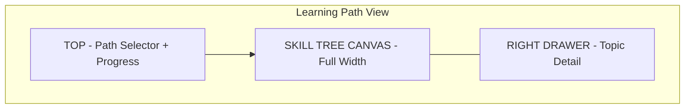

#### 14A. Top Bar + Path Selector (80px)
- **Left:** Back arrow + `"Learning Paths"` title.
- **Center:** Path selector dropdown (280px):
  - `"System Design Interview Prep"` (default).
  - `"Frontend System Design"`.
  - `"Backend Fundamentals"`.
  - `"Distributed Systems Deep Dive"`.
  - `"Database Mastery"`.
  - `"Custom Path"` (user-created).
- **Right:** Overall path progress: `"42% Complete"` with linear progress bar (200px wide). `"Estimated {N} hours remaining"`.

#### 14B. Skill Tree Canvas (Full Width, Full Height Remaining)
- **Layout:** Horizontal scrollable skill tree, flowing left to right.

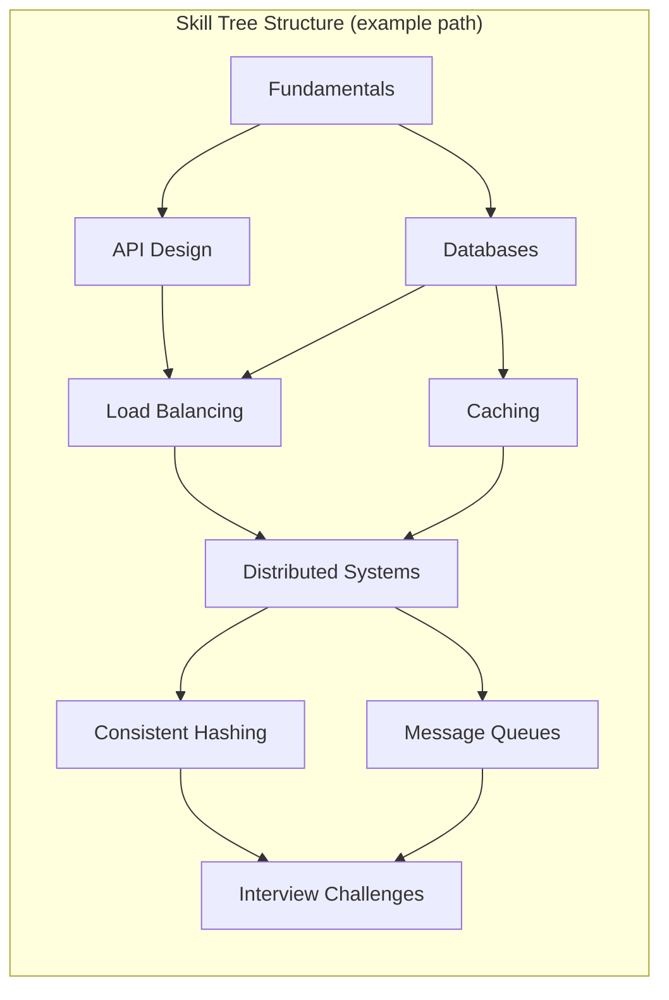

- **Node rendering:**
  - Each node is a card (180px wide, 100px tall) with:
    - Topic icon (top, 32px).
    - Topic name (14px bold, centered).
    - Progress bar (thin, bottom of card).
    - Lesson count: `"4/6 lessons"`.
  - **Node states:**
    - **Locked:** Grayscale, lock icon overlay, 40% opacity. Prerequisites not met.
    - **Available:** Full color border (glowing Primary outline), no fill. Next recommended node has a pulsing animation.
    - **In Progress:** Filled at partial opacity, progress bar showing percentage. Color: Primary.
    - **Completed:** Fully filled with checkmark badge, green accent.

- **Edges (connections):**
  - Arrows between nodes showing prerequisite relationships.
  - Completed edges: solid green line.
  - Available edges: solid Primary line.
  - Locked edges: dashed gray line.

- **Interaction:**
  - **Click node:** Opens right drawer with topic detail.
  - **Double-click node:** Navigates to that module/lesson directly (if available).
  - **Pan:** Drag canvas. Two-finger scroll.
  - **Zoom:** Pinch or Ctrl+scroll.
  - **Minimap:** Bottom-right (120x80px), same as editor minimap.

- **Current position indicator:** A user avatar marker on the node they should tackle next, with a pulsing ring.

#### 14C. Topic Detail Drawer (Right, 360px, Slides In)
- **Triggered by:** Clicking any node in the skill tree.
- **Content:**
  - Topic name (24px bold) + difficulty badge + estimated time.
  - Description: 2-3 sentences.
  - **Lessons list:** Ordered list of lessons within this topic. Each lesson: number, title, duration, completion status (checkmark or empty circle). Clicking a lesson navigates to it.
  - **Prerequisites:** List of required topics with their completion status.
  - **Skills gained:** Badges/tags that completing this topic earns.
  - **Related challenges:** Interview challenges that test this topic's concepts.
  - **Action button:** `"Start Topic"` (if not started) | `"Continue"` (if in progress) | `"Review"` (if completed).
- **Close:** X button or click outside drawer.

### Responsive
- **Tablet:** Skill tree uses vertical layout (top to bottom instead of left to right). Drawer becomes bottom sheet (50% screen height).
- **Mobile:** Skill tree becomes a vertical list (roadmap style, no graph layout). Each topic as a card in a scrollable list. Connections shown as vertical line on left (like a timeline). Drawer becomes full-screen overlay.

### Empty State (Custom Path)
- When creating a custom path: `"Build your custom learning path"` + UI to drag topics from a sidebar list into a path order. Guided setup: `"Select topics you want to learn, and we'll figure out the prerequisites."`.

### Loading State
- Skill tree skeleton: gray node placeholders connected by gray lines. Drawer shows skeleton text.

---

## 15. Profile / Progress

### Purpose
Comprehensive view of user's learning progress, achievements, XP history, and activity patterns.

### Layout Structure

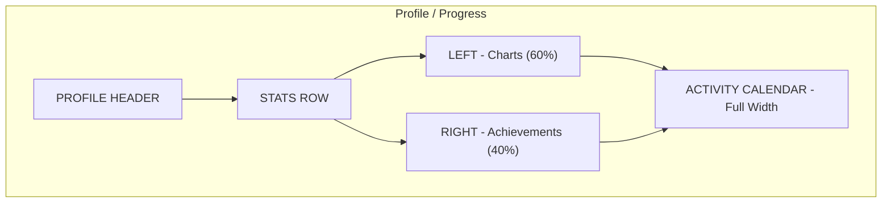

#### 15A. Profile Header (160px)
- **Layout:** Full-width card with gradient background.
- **Left:** Avatar (80px circle, editable with hover overlay camera icon) + name (24px bold) + username (16px muted, `"@username"`) + member since date.
- **Center-right:** Level display: Large level number inside circular XP ring (120px diameter). Ring fills as XP approaches next level. Label: `"Level {N}"`. Below ring: `"{X} / {Y} XP to Level {N+1}"` with thin progress bar.
- **Far right:** `"Edit Profile"` button (ghost) + `"Share Profile"` button (icon).

#### 15B. Stats Row (4 Stat Cards, Full Width)
- Same style as dashboard (Section 2B) but with more detail:
- **Card 1 - Total XP:** Large number (e.g., `"12,450 XP"`). Sparkline showing XP earned per week (last 12 weeks).
- **Card 2 - Streak:** Current streak days + best streak ever. `"Current: 14 days / Best: 42 days"`.
- **Card 3 - Designs Created:** Total count + breakdown (System Design, LLD, Database, etc.).
- **Card 4 - Interview Score:** Average score across all attempts + total attempts + improvement trend arrow (up/down).

#### 15C. Charts Section (Left, 60%)
- **Tab bar:** `Progress` | `XP History` | `Time Spent`.

**Progress tab:**
- Radar chart (spider chart) showing proficiency across 12 modules. Each axis is a module. Values 0-100. Fill area colored in Primary at 20% opacity. This gives a visual "shape" of strengths and weaknesses.
- Below radar chart: Table showing each module's completion percentage, last accessed, and a small sparkline.

**XP History tab:**
- Line chart showing XP earned over time (selectable range: Last 7 Days, 30 Days, 3 Months, All Time). Tooltip on data points shows: date, XP earned, source (e.g., "Completed Module 3: +200 XP").
- Below chart: XP breakdown by source: Modules, Interview Challenges, Community Contributions, Streaks. Shown as horizontal stacked bar.

**Time Spent tab:**
- Bar chart showing hours spent per week (last 12 weeks). Stacked by activity type (Learning, Building, Interview Practice). Toggle to see by module.
- Summary: `"Total: {N} hours / Average: {M} hours/week"`.

#### 15D. Achievements Section (Right, 40%)
- **Header:** `"Achievements"` + `"{N}/{M} Unlocked"`.
- **Grid:** 4 columns of achievement badges (64x64px each).
- **Each badge:**
  - Unlocked: Full color icon with name below. Hover tooltip: description + date earned + XP reward.
  - Locked: Grayscale with `"?"` overlay. Hover tooltip: description + progress toward unlocking.
- **Example achievements:**
  - `"First Design"` -- Create your first system design.
  - `"Speed Demon"` -- Complete an interview challenge in under 20 minutes.
  - `"Streak Master"` -- Maintain a 30-day streak.
  - `"Full Stack"` -- Complete all 12 modules.
  - `"Community Star"` -- Get 100 likes on a shared design.
  - `"Pattern Pro"` -- Use all 23 GoF patterns in designs.
  - `"Consistency Conqueror"` -- Ace the CAP theorem quiz.
  - `"Debug King"` -- Identify all bottlenecks in 5 simulation scenarios.
- **`"View All Achievements"` link** at bottom.

#### 15E. Activity Calendar (Full Width)
- **GitHub-style heatmap:** 52 weeks (1 year) of daily activity. Each cell represents one day.
- **Color scale:** 0 activity (empty/lightest gray), 1 (light Primary), 2-3 (medium), 4+ (dark Primary).
- **Hover tooltip:** Date + activity summary (e.g., `"Mar 15: 2 designs, 1 challenge, 45 min"`).
- **Month labels** above columns. Day-of-week labels on left (Mon, Wed, Fri).
- **Summary below:** `"Active {N} days in the past year. Longest streak: {M} days."`.

### Responsive
- **Tablet:** Charts and Achievements stack vertically (full width). Stats row becomes 2x2 grid.
- **Mobile:** Single column layout. Charts use full width. Achievement grid becomes 3 columns. Activity calendar horizontal scrollable.

### Empty State (New User)
- All stats at zero. Charts show empty state messages (e.g., radar chart says `"Complete your first module to see your skill profile"`). Achievements section shows all badges as locked with motivational message: `"Start earning achievements by exploring the platform!"`.

### Loading State
- Profile header loads from cached user data (fast). Charts show skeleton with pulsing chart area. Achievement grid shows skeleton circles.

---

## 16. Settings

### Purpose
Configure application preferences, account details, AI settings, collaboration options, and keybindings.

### Layout Structure

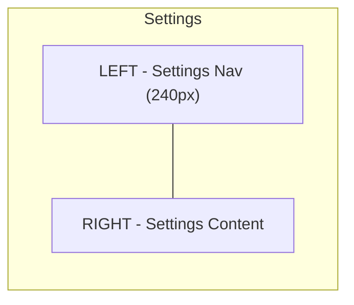

#### 16A. Settings Navigation (Left, 240px)
- Vertical list of settings categories:
  - `General` (selected by default)
  - `Appearance`
  - `Editor`
  - `Keyboard Shortcuts`
  - `AI Assistant`
  - `Collaboration`
  - `Export & Import`
  - `Notifications`
  - `Account`
  - `Billing` (if on paid plan)
- Active category: Primary text + left accent bar + light background.
- Clicking navigates right panel content.

#### 16B. Settings Content (Right, Remaining Width)

**General Settings:**
- Language: Dropdown (`English`, `Spanish`, `Japanese`, `Korean`, etc.).
- Region: Dropdown for date/time format.
- Default module on login: Dropdown (Dashboard, Last Active, etc.).
- Tutorial tips: Toggle (show/hide in-app tips).
- Telemetry: Toggle with link to privacy policy.

**Appearance Settings:**
- Theme: Three visual cards to select from -- `Light` | `Dark` | `System`. Each shows a preview thumbnail. Active has Primary border.
- Accent color: 8 color swatches in a row (Primary default, plus teal, red, orange, green, blue, purple, pink). Clicking changes global accent.
- Font size: Slider (`Small` | `Medium (default)` | `Large`). Live preview text below slider.
- Code font: Dropdown (`JetBrains Mono` | `Fira Code` | `Source Code Pro` | `Cascadia Code`).
- Canvas grid: Toggle (show/hide) + dot size slider.
- Reduced motion: Toggle (disables animations for accessibility).

**Editor Settings:**
- Auto-save interval: Dropdown (`Off` | `15 seconds` | `30 seconds (default)` | `1 minute`).
- Snap to grid: Toggle (default on).
- Grid size: Number input (10-50px, default 20).
- Default zoom level: Dropdown (50-200%, default 100%).
- Connection style: Radio (`Straight` | `Curved (default)` | `Orthogonal`).
- Show minimap: Toggle (default on).
- Undo history limit: Number input (default 100).

**Keyboard Shortcuts:**
- Embedded version of the Keyboard Shortcut Sheet (Screen 22). Searchable table.
- Each shortcut row: Action name | Current binding | `"Edit"` button (opens key capture input) | `"Reset"` button.
- `"Reset All to Defaults"` button at bottom.
- `"View Full Shortcut Sheet"` link opens Screen 22 as modal.

**AI Assistant Settings:**
- AI model preference: Radio (`Standard` | `Advanced (uses more credits)`).
- AI suggestions: Toggle (proactive suggestions while designing).
- AI feedback detail level: Slider (`Brief` | `Standard` | `Detailed`).
- AI code generation language: Dropdown (`Python` | `Java` | `TypeScript` | `Go` | `C#`).
- Credits remaining: Display with progress bar. `"Buy More"` link.
- AI history: `"Clear AI History"` button with confirmation.

**Collaboration Settings:**
- Default sharing permission: Radio (`View Only` | `Can Edit` | `Can Comment`).
- Real-time cursor sharing: Toggle (default on).
- Notification on collaborator join: Toggle (default on).
- Collaboration cursor color: Color picker (auto-assigned by default).

**Export & Import Settings:**
- Default export format: Dropdown (`PNG` | `SVG` | `PDF` | `JSON` | `Terraform` | `Mermaid`).
- Export quality: Dropdown (`Standard` | `High (2x)` | `Ultra (4x)`).
- Include annotations in export: Toggle.
- Import: `"Import Design"` button (accepts JSON, .architex files). File picker.

**Notifications:**
- Email notifications: Toggle per category (Weekly summary, New features, Community activity, Collaboration invites).
- In-app notifications: Toggle per category.
- Push notifications: Toggle (if PWA).

**Account:**
- Email (editable with verification).
- Password: `"Change Password"` button (opens modal).
- Connected accounts: Google, GitHub (connect/disconnect buttons).
- Two-factor authentication: Toggle with QR code setup flow.
- `"Download My Data"` button (GDPR export).
- `"Delete Account"` button (danger, with multi-step confirmation).

**Billing:**
- Current plan card: Plan name, price, renewal date.
- Usage: AI credits used/total, designs created, collaborators count.
- `"Upgrade Plan"` or `"Manage Subscription"` button.
- Invoice history: Table (date, amount, status, download link).

### Responsive
- **Tablet:** Settings nav becomes horizontal tab bar at top (scrollable). Content below full width.
- **Mobile:** Settings nav becomes a list screen. Clicking a category navigates to a full-screen settings page. Back arrow returns to category list.

### Empty State
Not applicable (settings always have defaults).

### Loading State
- Settings nav loads immediately. Content shows skeleton form fields. Saved preferences populate as they load.

---

## 17. Collaboration Session

### Purpose
Real-time shared editing of a design with multiple users. Shows live cursors, avatars, presence, and has integrated chat.

### Layout Structure

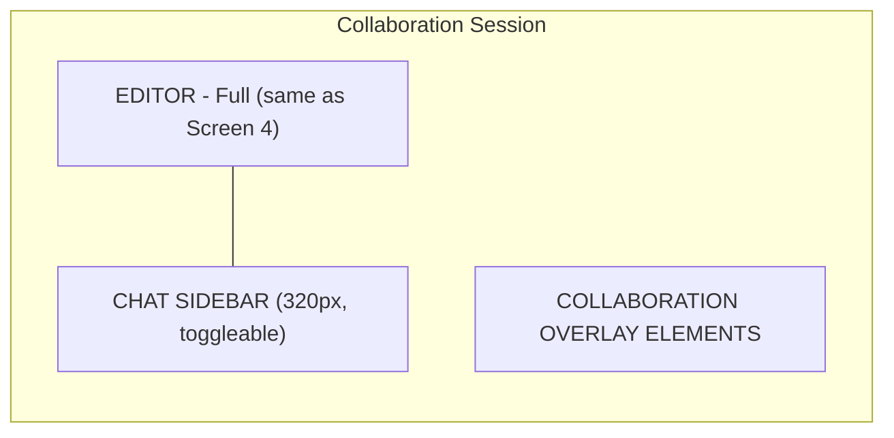

#### 17A. Base Editor
- Same as System Design Editor (Screen 4) with all features.

#### 17B. Collaboration Overlay Elements (Layered on Top of Editor)

- **Collaborator cursors:** Each connected user has a colored cursor on the canvas. Cursor shows: colored pointer arrow + username label (12px, colored background matching cursor, rounded pill, positioned below pointer). Cursor movement is smoothly interpolated (50ms updates).
  - Colors auto-assigned from a palette of 8 distinct colors.
  - When a collaborator selects a component, their colored selection border is visible to all users.

- **Presence bar (top, integrated into toolbar):**
  - Avatars of all connected users (32px circles, colored border matching cursor color). Active users have solid ring, idle (>5 min) have dashed ring.
  - Overflow: `"+3"` chip if more than 5 users.
  - Clicking an avatar: options dropdown -- `"Follow"` (your view follows their cursor), `"Message"` (opens chat with @mention).
  - `"Invite"` button (opens invite dialog: email input, permission dropdown, generate link).

- **Component locking indicators:**
  - When a user is editing a component's properties, other users see a lock icon + username label on that component. They can view but not edit that component until the lock releases (auto-releases after 10s of inactivity on the component or when user deselects).

- **Change highlights:**
  - When a collaborator adds/moves/deletes a component, a brief colored flash (matching their cursor color) around the affected area. Auto-dismisses after 2s.

#### 17C. Chat Sidebar (320px, Right Side, Toggleable)
- **Toggle:** Chat icon button in toolbar + `Cmd+Shift+C`.
- **Header (48px):** `"Chat"` title + participant count + minimize/close button.
- **Messages area (scrollable):**
  - Each message: Avatar (24px) + username (bold, colored) + timestamp + message text.
  - System messages: `"Alice joined"`, `"Bob left"`, `"Charlie is editing Load Balancer"`. Gray, italic.
  - @mention support: Typing `@` shows user picker. Mentioned user gets notification.
  - Emoji reactions: Click-and-hold on message shows emoji picker. Reactions shown as small pills below message.
- **Input area (bottom):**
  - Text field (full width, 40px, multi-line expandable). Placeholder: `"Type a message..."`.
  - Send button (Primary icon button).
  - Attachment button: Share a screenshot of current canvas view.
- **Unread indicator:** Red badge on chat toggle button showing unread count.

#### Invite Dialog (Modal)
- **Email input:** Text field + `"Send Invite"` button. Sends email with link.
- **Shareable link:** Generated URL + `"Copy"` button. Permission dropdown next to link: `View Only` | `Can Edit`.
- **Current participants list:** Avatar + name + role (Owner/Editor/Viewer) + remove button.

### Responsive
- **Tablet:** Chat becomes bottom sheet (swipe up). Collaborator avatars overflow to dropdown at 3+.
- **Mobile:** View-only mode for collaborators. Chat accessible via full-screen overlay. No editing from mobile during collaboration.

### Empty State (Waiting for Others)
- Editor works normally for the host. Banner at top: `"You're the only one here. Invite collaborators to start a session."` with `"Invite"` button.

### Loading State
- Editor loads normally. `"Connecting to collaboration session..."` toast while WebSocket establishes. Collaborator cursors appear one by one as connections establish.

---

## 18. Community Gallery

### Purpose
Browse and discover public designs shared by the community. Social features: upvotes, comments, forking.

### Layout Structure

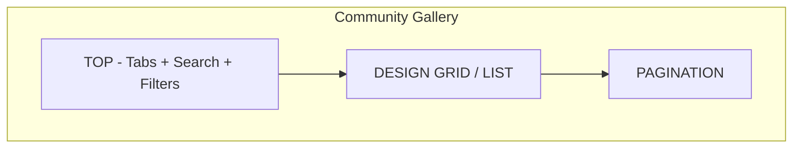

#### 18A. Top Section (120px Total)
- **Title:** `"Community Gallery"` (28px bold).
- **Subtitle:** `"Explore system designs shared by the community"` (16px muted).
- **Tabs:** `Trending` | `Newest` | `Most Liked` | `Most Forked` | `Following`. Active tab has bottom accent.
- **Search bar (right of tabs, 300px):** `"Search community designs..."`.
- **Filters button (right of search):** Opens filter dropdown:
  - Category: checkboxes for system types (same as template categories).
  - Difficulty: checkboxes.
  - Time range: `All Time` | `This Week` | `This Month` | `This Year`.

#### 18B. Design Grid
- **3 columns on desktop, 2 tablet, 1 mobile.**
- **Each card (~360px width, ~380px height):**
  - **Preview image (top, 200px):** Canvas screenshot. Hover: subtle zoom.
  - **Author row:** Avatar (28px) + username + `"Follow"` button (small, ghost). Time: `"2 hours ago"`.
  - **Title:** 18px bold.
  - **Description:** 14px muted, 2-line clamp.
  - **Tags:** 2-3 pills (e.g., `#microservices`, `#kafka`, `#caching`).
  - **Action row (bottom):**
    - Upvote button: Triangle up icon + count (e.g., `"142"`). Filled Primary if user has upvoted.
    - Comment icon + count (e.g., `"23"`).
    - Fork icon + count (e.g., `"45"`).
    - Bookmark icon (toggle). Save for later.
    - Share icon (opens share options).
  - **Click card:** Opens a detail view similar to Template Detail (Screen 13) but for community content, including full comment thread.

#### 18C. Pagination
- Infinite scroll (load 12 more on scroll). Alternative: `"Load More"` button.
- Spinner/skeleton cards during load.

### Responsive
- **Tablet:** 2 columns. Filters in a slide-out panel instead of dropdown.
- **Mobile:** 1 column. Cards full-width. Preview image height 160px.

### Empty State
- **No designs yet (new platform):** `"Be the first to share a design!"` + `"Share Your Design"` button.
- **No results for filter:** `"No designs match your filters"` + `"Clear Filters"`.
- **Following tab with no follows:** `"Follow other designers to see their work here"` + `"Explore Trending"` button.

### Loading State
- 6 skeleton cards in grid. Tab bar active. Search functional.

---

## 19. Share / Export Dialog

### Purpose
Multi-purpose dialog for exporting designs in various formats and generating share links. Accessed from any editor.

### Layout Structure
- **Modal dialog:** Centered, 640px wide, variable height (max 80vh, scrollable).
- **Overlay:** Dark backdrop (50% opacity), click-outside-to-close.

#### 19A. Dialog Header (48px)
- `"Share & Export"` title (20px bold) + close X button (top right).

#### 19B. Tab Bar
- Two tabs: `Export` | `Share`.

#### 19C. Export Tab

- **Format selection grid** (2 columns of format cards, each 100px):
  - `PNG` (image icon) -- Raster image.
  - `SVG` (vector icon) -- Vector image.
  - `PDF` (document icon) -- Print-ready document.
  - `JSON` (code icon) -- Raw design data, re-importable.
  - `Mermaid` (diagram icon) -- Mermaid code block.
  - `Terraform` (infra icon) -- Infrastructure-as-code stub.
  - `Draw.io` (app icon) -- Compatible format.
  - `Clipboard` (copy icon) -- Copy image to clipboard.
  - Selected format has Primary border and checkmark.

- **Export options (below format grid, vary by format):**
  - PNG/SVG:
    - Scale: `1x` | `2x` | `4x` (radio).
    - Background: `Transparent` | `White` | `Dark` (radio).
    - Include annotations: Toggle.
    - Include metrics: Toggle.
  - PDF:
    - Page size: `A4` | `Letter` | `Custom`.
    - Orientation: `Landscape` | `Portrait`.
    - Include cover page: Toggle.
    - Include component list: Toggle.
  - JSON:
    - Pretty print: Toggle.
    - Include simulation data: Toggle.
  - Mermaid:
    - Diagram type: `flowchart` | `C4 diagram`.
    - Code preview: Readonly code block.
  - Terraform:
    - Cloud provider: `AWS` | `GCP` | `Azure`.
    - Preview: Readonly code block.

- **Export button (bottom right):** `"Export as {format}"` (Primary filled). Triggers download.

#### 19D. Share Tab

- **Share link section:**
  - Generated URL in read-only field with `"Copy"` button.
  - Permission dropdown next to URL: `View Only` (default) | `Can Fork` | `Can Edit`.
  - Expiration dropdown: `Never` | `24 hours` | `7 days` | `30 days`.
  - Password protect: Toggle + password field (when on).
  - `"Regenerate Link"` text button (invalidates old link).

- **Invite by email section:**
  - Email input field + `"Invite"` button. Can add multiple emails (chips).
  - Permission dropdown: `View` | `Edit` | `Comment`.
  - Sends email notification with link.

- **Embed code section:**
  - Toggle: `"Enable Embedding"`.
  - When enabled: `<iframe>` code block with copy button.
  - Size options: `Small (400x300)` | `Medium (640x480)` | `Large (800x600)` | `Custom (WxH inputs)`.
  - Preview: Mini preview of how embed looks.

- **Social sharing section:**
  - Row of social buttons: Twitter/X, LinkedIn, Copy Link. Each opens respective share dialog/copies formatted text.
  - Share preview card (Open Graph): Shows how the shared link will look (title, description, thumbnail).

### Responsive
- **Tablet:** Modal width 90vw. Format grid wraps as needed.
- **Mobile:** Modal becomes full-screen bottom sheet (slides up from bottom). Format selection becomes vertical list. Tabs remain at top.

### Empty State
Not applicable (dialog always has content).

### Loading State
- Share link shows `"Generating..."` while link is created (< 1 second). Embed preview shows spinner.

---

## 20. Command Palette (Overlay)

### Purpose
Quick-access command interface (a la VS Code Cmd+K). Search across designs, templates, modules, actions, and settings from anywhere in the app.

### Layout Structure
- **Overlay modal:** Centered horizontally, positioned in upper third of screen. Width: 600px. Max height: 480px.
- **No backdrop** (or very light 20% backdrop). Dismisses on Escape, click-outside, or selecting a result.

#### 20A. Search Input (56px)
- Large search field, auto-focused on open.
- Placeholder: `"Type a command or search..."`.
- Left icon: magnifying glass (20px).
- Right: Keyboard hint `"ESC to close"` (muted, 12px).
- **Prefix behavior:**
  - `>` prefix: Filters to commands/actions only.
  - `@` prefix: Filters to user designs only.
  - `#` prefix: Filters to templates.
  - No prefix: Searches everything.
- **Typing behavior:** Results update in real-time (debounced 100ms). Fuzzy matching.

#### 20B. Results Area (Scrollable, Below Input)
- **Grouped results** with section headers:

**Recent (if no search query):**
- Last 5 opened designs. Each: icon + name + type + timestamp.

**Designs (section header):**
- Matching designs by name. Each result: canvas mini-icon + design name + module type tag.

**Templates (section header):**
- Matching templates. Each: template icon + name + category tag.

**Modules (section header):**
- Matching modules/lessons. Each: module icon + module/lesson name + progress.

**Actions (section header):**
- Matching actions/commands. Each: action icon + name + keyboard shortcut (right-aligned, gray pill).
- Example actions:
  - `"New System Design"` (Cmd+N).
  - `"Open Settings"` (Cmd+,).
  - `"Toggle Dark Mode"` (Cmd+Shift+D).
  - `"Export as PNG"` (Cmd+Shift+E).
  - `"Invite Collaborator"`.
  - `"Start Interview Challenge"`.
  - `"Open Keyboard Shortcuts"` (Cmd+/).
  - `"Clear Canvas"`.
  - `"Fit to Screen"` (Cmd+0).
  - `"Zoom In"` / `"Zoom Out"`.

- **Keyboard navigation:**
  - Up/Down arrows: Move selection highlight.
  - Enter: Execute selected result (navigate to design, run command, open template).
  - Tab: Cycle through groups.

- **Each result row (40px):** Icon (20px) | Name (14px) | Metadata (12px muted, right side) | Shortcut pill (if action).
- **Selected row:** Light Primary background highlight.

#### 20C. Footer (32px)
- **Left:** Tips: `"Type > for commands, @ for designs, # for templates"`.
- **Right:** `"Enter to select"` | `"Esc to close"`.

### Responsive
- **Tablet:** Width 90vw (max 600px). Same behavior.
- **Mobile:** Full-width (100vw), positioned at top of screen (like a mobile search overlay). Results list takes remaining screen height. Footer hidden.

### Empty State
- **No search query:** Shows recent items + suggested actions (`"New Design"`, `"Browse Templates"`, `"Settings"`).
- **No matching results:** `"No results for '{query}'"` + `"Try a different search term"`.

### Loading State
- Results show `"Searching..."` text briefly (< 200ms). No skeleton needed due to speed.

---

## 21. Onboarding Flow

### Purpose
Guided 5-step tutorial overlay for first-time users. Appears on top of the System Design Editor canvas on first visit.

### Layout Structure
- **Overlay system:** Dark backdrop (60% opacity) with spotlight cutouts highlighting specific UI areas. Tutorial card floating near the spotlighted area.

#### Step Progression

```mermaid
graph LR
    S1["Step 1: Welcome"] --> S2["Step 2: Component Palette"] --> S3["Step 3: Canvas Basics"] --> S4["Step 4: Properties"] --> S5["Step 5: Simulate"]
```

#### Step 1: Welcome
- **Spotlight:** None (full overlay).
- **Card position:** Centered on screen.
- **Card content (480px wide, ~280px tall):**
  - Architex logo animation (brief).
  - `"Welcome to Architex!"` (24px bold).
  - `"Let's build your first system design in 2 minutes."` (16px).
  - User name from signup: `"Ready, {firstName}?"`.
  - `"Let's Go!"` button (Primary filled, large).
  - `"Skip Tutorial"` text button (muted, bottom).
  - Progress dots: 5 dots, first filled.

#### Step 2: Component Palette
- **Spotlight:** Left panel (Component Palette) with cutout in the dark overlay.
- **Card position:** To the right of the palette (arrow pointing left toward palette).
- **Card content:**
  - `"Component Palette"` (20px bold).
  - `"Drag components from here onto the canvas. Try dragging a 'Web Server' now!"` (14px).
  - Animated hand cursor illustration dragging a component.
  - **Interaction required:** User must drag a component onto the canvas to proceed. Once dropped, auto-advance with green checkmark flash.
  - `"Next"` button (disabled until action completed) + `"Skip"` text.
  - Progress: 2/5.

#### Step 3: Canvas Basics
- **Spotlight:** Center canvas (full canvas area highlighted).
- **Card position:** Top-center of canvas (arrow pointing down).
- **Card content:**
  - `"Your Design Canvas"` (20px bold).
  - `"Pan: Hold Space + Drag. Zoom: Cmd + Scroll. Connect: Drag from component edges."` (14px).
  - Three mini illustrations: pan, zoom, connect (side by side).
  - `"Try connecting your Web Server to the component palette's Load Balancer. Drag one out first!"` (14px).
  - **Interaction required:** Create a connection between two components.
  - `"Next"` button + `"Skip"`.
  - Progress: 3/5.

#### Step 4: Properties Panel
- **Spotlight:** Right panel (Properties).
- **Card position:** To the left of the panel.
- **Card content:**
  - `"Component Properties"` (20px bold).
  - `"Click any component to see its properties here. Configure technology, replicas, and more."` (14px).
  - `"Click your Web Server to see its properties."` (14px).
  - **Interaction required:** Click a component. Properties panel populates.
  - `"Next"` button + `"Skip"`.
  - Progress: 4/5.

#### Step 5: Simulate & AI
- **Spotlight:** Top toolbar (Simulate button + AI Assist button).
- **Card position:** Below toolbar.
- **Card content:**
  - `"Simulate & Get AI Help"` (20px bold).
  - `"Click 'Simulate' to see live metrics. Click 'AI Assist' for intelligent suggestions."` (14px).
  - `"You're all set! Explore the platform and build amazing designs."` (14px bold).
  - `"Finish Tutorial"` button (Primary filled, large). Triggers confetti animation.
  - `"Explore Templates"` secondary button.
  - Progress: 5/5.

#### Onboarding Card Design (Consistent Across Steps)
- **Width:** 420px.
- **Border radius:** 12px.
- **Background:** Surface color with 2px Primary border.
- **Shadow:** Large drop shadow (0 8px 32px rgba(0,0,0,0.3)).
- **Arrow:** CSS triangle pointing toward spotlight area.
- **Transition:** Cards slide in from the side nearest the spotlight area (200ms ease-out).

### Responsive
- **Tablet:** Cards reduce to 360px width. Spotlights adjust to collapsed panel positions.
- **Mobile:** Onboarding not shown (mobile gets a simplified "tour" as a carousel of screenshots instead).

### Empty State
Not applicable.

### Loading State
- Onboarding loads after editor is fully ready. Brief delay (500ms after editor load) before Step 1 appears.

---

## 22. Keyboard Shortcut Sheet

### Purpose
Comprehensive, searchable reference of all keyboard shortcuts. Accessible as a modal overlay from any screen.

### Layout Structure
- **Modal:** Centered, 720px wide, max 80vh tall (scrollable).
- **Trigger:** `Cmd+/` or `?` (when not in a text field), or from Settings > Keyboard Shortcuts > "View Full Sheet", or from 3-dot menu in any editor.

#### 22A. Header (56px)
- `"Keyboard Shortcuts"` title (24px bold).
- Search input (240px, right of title): `"Search shortcuts..."`. Filters in real-time.
- Close X button (top right).

#### 22B. Shortcut Content (Scrollable)

Organized in category sections, each with a header and a two-column table:

**General:**
| Action | Shortcut |
|--------|----------|
| Command Palette | `Cmd + K` |
| Search | `Cmd + F` |
| Save | `Cmd + S` |
| Undo | `Cmd + Z` |
| Redo | `Cmd + Shift + Z` |
| Settings | `Cmd + ,` |
| Keyboard Shortcuts | `Cmd + /` |
| Toggle Sidebar | `[` |
| Toggle Dark Mode | `Cmd + Shift + D` |
| Close Modal/Panel | `Esc` |

**Canvas Navigation:**
| Action | Shortcut |
|--------|----------|
| Pan | `Space + Drag` |
| Zoom In | `Cmd + =` |
| Zoom Out | `Cmd + -` |
| Fit to Screen | `Cmd + 0` |
| Minimap Toggle | `Cmd + M` |
| Select All | `Cmd + A` |
| Deselect | `Esc` |

**Components:**
| Action | Shortcut |
|--------|----------|
| Delete Selected | `Delete` or `Backspace` |
| Duplicate | `Cmd + D` |
| Copy | `Cmd + C` |
| Paste | `Cmd + V` |
| Group | `Cmd + G` |
| Ungroup | `Cmd + Shift + G` |
| Bring to Front | `]` |
| Send to Back | `Shift + ]` |
| Lock Component | `Cmd + L` |

**Editor Panels:**
| Action | Shortcut |
|--------|----------|
| Toggle Component Palette | `Cmd + 1` |
| Toggle Properties Panel | `Cmd + 2` |
| Toggle AI Assistant | `Cmd + I` |
| Toggle Chat (Collab) | `Cmd + Shift + C` |
| Toggle Requirements (Interview) | `Cmd + R` |
| Estimation Pad | `Cmd + E` |

**Simulation:**
| Action | Shortcut |
|--------|----------|
| Toggle Simulation | `Cmd + Enter` |
| Step Forward | `Right Arrow` (when sim focused) |
| Step Back | `Left Arrow` |
| Reset Simulation | `Cmd + Shift + R` |

**Algorithm Visualizer:**
| Action | Shortcut |
|--------|----------|
| Play/Pause | `Space` |
| Step Forward | `Right Arrow` |
| Step Backward | `Left Arrow` |
| Jump to Start | `Home` |
| Jump to End | `End` |
| Speed Up | `Shift + Right Arrow` |
| Speed Down | `Shift + Left Arrow` |

**Export:**
| Action | Shortcut |
|--------|----------|
| Export as PNG | `Cmd + Shift + E` |
| Share | `Cmd + Shift + S` |

#### 22C. Footer (40px)
- `"Customize shortcuts in Settings"` link (navigates to Settings > Keyboard Shortcuts).
- `"Print"` button (opens print-friendly version).
- OS toggle: `"Mac"` / `"Windows"` -- switches between Cmd/Ctrl notation.

#### Shortcut Display Format
- Each shortcut key rendered as a styled keyboard key cap: rounded rectangle, subtle shadow, monospace font. E.g., `Cmd` + `K` rendered as two separate key caps with `+` between them.

### Responsive
- **Tablet:** Modal width 90vw. Two-column table still works.
- **Mobile:** Full-screen overlay. Single-column layout (action stacked above shortcut). Search prominently placed. Categories as collapsible accordions.

### Empty State
- **Search yields no results:** `"No shortcuts matching '{query}'"`.

### Loading State
- Instant (all data is local/static).

---

## Appendix: Global Patterns

### Navigation Map

```mermaid
graph TD
    LP["Landing Page"] -->|Sign Up / Log In| HD["Home Dashboard"]
    HD --> MS["Module Selection"]
    HD --> TG["Template Gallery"]
    HD --> LP2["Learning Path View"]
    HD --> IC["Interview Challenge"]
    HD --> CG["Community Gallery"]
    HD --> PP["Profile / Progress"]
    HD --> SE["Settings"]
    
    MS --> SDE["System Design Editor"]
    MS --> AV["Algorithm Visualizer"]
    MS --> DSE["Data Structure Explorer"]
    MS --> LS["LLD Studio"]
    MS --> DL["Database Lab"]
    MS --> DSP["Distributed Systems Playground"]
    
    TG --> TD["Template Detail"]
    TD --> SDE
    
    IC --> IR["Interview Results"]
    IR --> IC
    IR --> MS
    
    SDE --> CS["Collaboration Session"]
    SDE --> SED["Share / Export Dialog"]
    
    CG --> TD
```

### Consistent Patterns Across All Screens

**Toast Notifications (Bottom-Right, Stacked):**
- Success: Green left border, check icon.
- Error: Red left border, alert icon.
- Info: Blue left border, info icon.
- Auto-dismiss: 5 seconds. Manual dismiss: X button.
- Max 3 visible at once. Stack upward.

**Confirmation Dialogs:**
- Centered modal, 400px wide.
- Title + description + two buttons (Cancel ghost, Confirm filled).
- Destructive confirmations: Confirm button in Danger red.
- Extra-destructive (delete account): Type confirmation text.

**Error Pages:**
- 404: Illustration of lost astronaut + `"Page not found"` + `"Go Home"` button.
- 500: Illustration of broken server + `"Something went wrong"` + `"Try Again"` + `"Report Issue"`.
- Offline: Illustration of disconnected plug + `"You're offline"` + `"Some features may be unavailable"`.

**Accessibility:**
- All interactive elements are keyboard navigable.
- Focus rings: 2px Primary outline on focus-visible.
- Screen reader labels on all icon-only buttons.
- Color contrast: WCAG AA minimum (4.5:1 for text).
- Reduced motion: Respects `prefers-reduced-motion`.

**Loading Patterns:**
- Skeleton screens preferred over spinners for content areas.
- Spinners used for point-actions (button loading, modal loading).
- Progress bars for deterministic operations (file upload, AI analysis).
- Optimistic UI for quick actions (like, bookmark, save).

**Responsive Breakpoints:**
- Desktop: 1440px+ (full layout).
- Small Desktop: 1024-1439px (minor adjustments).
- Tablet: 768-1023px (sidebar collapse, 2-column grids).
- Mobile: 375-767px (single column, bottom sheets, off-canvas panels).
