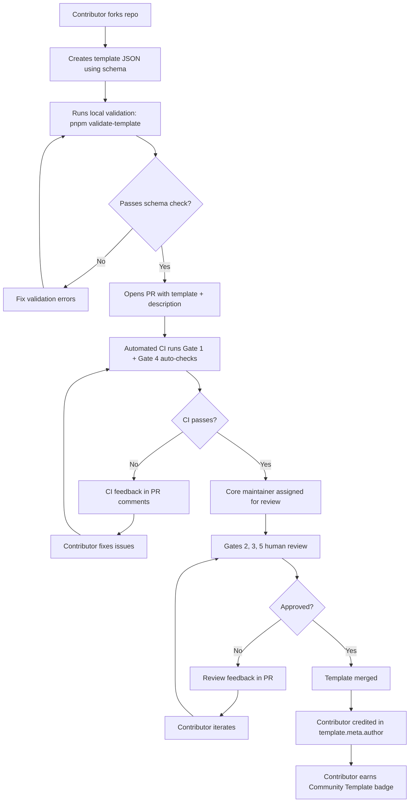
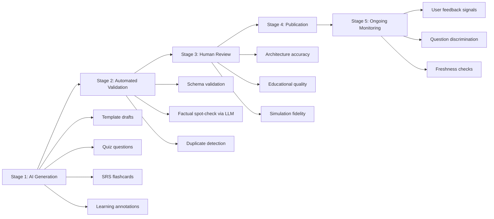

# Content Pipeline Specification for Architex

> Complete specification for content creation, template management, learning content structure, and AI-assisted authoring across all 12 Architex modules.

---

# TABLE OF CONTENTS

1. [Content Management System Selection](#1-content-management-system-selection)
2. [Content Architecture Overview](#2-content-architecture-overview)
3. [Template Creation Pipeline (55+ System Design Templates)](#3-template-creation-pipeline)
4. [Template Format Specification (JSON Schema)](#4-template-format-specification)
5. [Template Quality Assurance Process](#5-template-quality-assurance-process)
6. [Community Template Submission Workflow](#6-community-template-submission-workflow)
7. [Template Categories and Tagging System](#7-template-categories-and-tagging-system)
8. [Template Difficulty Rating System](#8-template-difficulty-rating-system)
9. [Learning Content Structure](#9-learning-content-structure)
10. [Concept Prerequisite Graph](#10-concept-prerequisite-graph)
11. [Spaced Repetition Content (SRS/FSRS)](#11-spaced-repetition-content)
12. [Quiz and Assessment Design](#12-quiz-and-assessment-design)
13. [Content Versioning Strategy](#13-content-versioning-strategy)
14. [AI-Assisted Content Creation Pipeline](#14-ai-assisted-content-creation-pipeline)
15. [Content Freshness and Update Tracking](#15-content-freshness-and-update-tracking)
16. [Implementation Roadmap](#16-implementation-roadmap)

---

# 1. CONTENT MANAGEMENT SYSTEM SELECTION

## Decision: Hybrid Git-Based + Structured JSON Approach

After evaluating the landscape of CMS options for Next.js in 2025-2026, the recommendation is a **hybrid approach** combining local Markdown/MDX for explanatory content with structured JSON for interactive templates and simulation configs.

### Why NOT a Traditional Headless CMS

| Option | Verdict | Reason |
|--------|---------|--------|
| Sanity | Rejected | Overkill for template-heavy content; GROQ adds complexity; ongoing SaaS cost |
| Contentful | Rejected | Pricing scales poorly with 55+ templates each having hundreds of fields |
| Strapi | Rejected | Self-hosted overhead; REST/GraphQL adds latency for client-side content |
| Payload CMS | Considered | Good code-first approach, but adds server dependency for what is offline-first |
| Contentlayer | Rejected | Unmaintained since Stackbit acquisition by Netlify; Next.js App Router issues |

### Chosen Stack

| Layer | Tool | Purpose |
|-------|------|---------|
| Explanatory content | **Velite** + MDX | Type-safe Markdown/MDX pipeline with Zod schema validation. Actively maintained Contentlayer successor. Handles lesson text, concept explanations, and documentation |
| Template definitions | **Structured JSON** files in `/templates/` | Validated at build time with JSON Schema + Zod. Each template is a self-contained JSON file with nodes, edges, simulation config, learning annotations |
| Quiz/assessment data | **JSON** files in `/content/quizzes/` | Structured question banks per concept with Zod validation |
| SRS card data | **JSON** files in `/content/srs/` | Flashcard definitions linked to concepts |
| Prerequisite graph | **Single JSON** file `/content/graph/prerequisite-graph.json` | DAG of concept dependencies |
| Build pipeline | **Velite** build step | Transforms all content into typed, importable data at build time |

### Rationale

1. **Offline-first** -- all content ships with the app, no runtime CMS dependency
2. **Type safety** -- Zod schemas catch content errors at build time, not runtime
3. **Git-native** -- every content change is versioned, reviewable via PR, and auditable
4. **Zero SaaS cost** -- no CMS subscription for a platform targeting individual developers
5. **AI-friendly** -- JSON templates are trivially parseable by LLMs for generation and review
6. **Community-friendly** -- contributors submit templates via GitHub PRs, same as code

---

# 2. CONTENT ARCHITECTURE OVERVIEW

## Directory Structure

```
content/
  templates/
    system-design/
      tier-1/
        url-shortener.template.json
        twitter-fanout.template.json
        uber-dispatch.template.json
        ...
      tier-2/
        discord-elixir.template.json
        spotify-recs.template.json
        ...
      tier-3/
        distributed-kv-store.template.json
        message-queue.template.json
        ...
      tier-4/
        ticket-booking.template.json
        ...
    design-patterns/
      creational/
        singleton.template.json
        factory-method.template.json
        ...
      structural/
      behavioral/
      modern/
    lld-problems/
      parking-lot.template.json
      elevator-system.template.json
      ...
    algorithms/
      sorting/
      graph/
      ...
  lessons/
    foundations/
      estimation/
        estimation-framework.mdx
        reference-numbers.mdx
      caching/
        caching-strategies.mdx
        eviction-policies.mdx
      ...
    distributed-systems/
      consistent-hashing.mdx
      raft-consensus.mdx
      ...
  quizzes/
    foundations/
      caching-quiz.json
      cap-theorem-quiz.json
      ...
    system-design/
      url-shortener-quiz.json
      ...
  srs/
    concepts/
      consistent-hashing.srs.json
      database-sharding.srs.json
      circuit-breaker.srs.json
      ...
  graph/
    prerequisite-graph.json
    concept-catalog.json
  metadata/
    content-freshness.json
    review-schedule.json
```

## Content Types Summary

| Content Type | Format | Count (initial) | Authoring Method |
|-------------|--------|-----------------|------------------|
| System design templates | JSON | 55+ | AI-generated draft + human review |
| Design pattern templates | JSON | 33+ | Manual + AI assist |
| LLD problem templates | JSON | 20+ | Manual |
| Algorithm visualizations | JSON | 100+ | Manual (step-list pattern) |
| Concept lessons | MDX | 150+ | Existing (already written) + AI expansion |
| Quiz question banks | JSON | 500+ questions | AI-generated + human review |
| SRS flashcards | JSON | 300+ cards | AI-generated + human curation |
| Prerequisite graph | JSON | 1 (200+ edges) | Manual curation |

---

# 3. TEMPLATE CREATION PIPELINE

## Strategy: Three-Phase Approach

Creating 55+ high-quality system design templates is the single largest content challenge. The strategy uses a tiered approach that matches effort to educational value.

### Phase 1: AI-Generated Drafts (Week 1-2)

Use Claude Sonnet to generate structured JSON template drafts for all 55 systems.

**Prompt pattern for each template:**

```
Given the following system architecture: {system_name}

Generate a structured template with:
1. All major components as nodes (services, databases, caches, queues, CDNs, load balancers)
2. All connections as edges with protocol labels (HTTP, gRPC, async, WebSocket)
3. Simulation configuration (QPS defaults, latency distributions, failure modes)
4. Learning annotations for each node explaining WHY it exists
5. 3-5 key trade-off decisions with alternatives
6. Real-world reference (which company, what scale)

Output format: {JSON schema reference}
```

**What AI generates well:**
- Standard component layouts for well-documented architectures (Netflix, Uber, Twitter)
- Correct protocol labels and data flow directions
- Reasonable default QPS and latency numbers (cross-referenced with benchmarks file 21)
- Learning annotation text for common components

**What AI generates poorly (requires human intervention):**
- Novel architectural choices unique to specific companies
- Simulation edge cases and failure cascade sequences
- Accurate cost modeling numbers
- Visual layout coordinates (nodes overlap; needs manual arrangement)
- Subtle trade-off nuances that distinguish senior from junior understanding

### Phase 2: Expert Human Review and Enhancement (Week 2-4)

Each AI-generated template goes through human review:

1. **Architecture accuracy** -- verify components match published engineering blog posts
2. **Simulation fidelity** -- tune default parameters to match real-world benchmarks
3. **Visual layout** -- manually position nodes for pedagogical clarity (data flows left-to-right, tiers top-to-bottom)
4. **Learning annotations** -- add "interview tip" and "common mistake" annotations
5. **Chaos scenarios** -- define 3-5 failure injection points per template
6. **Step-by-step walkthrough** -- define the "Learn" mode sequence (which nodes to reveal in what order)

**Estimated effort per template:**
- Tier 1 (10 templates): 4-6 hours each (highest educational value, most detail)
- Tier 2 (6 templates): 3-4 hours each
- Tier 3 (14 templates): 2-3 hours each (infrastructure components are simpler)
- Tier 4 (25 templates): 1-2 hours each (lower priority, less detail initially)

**Total estimated effort:** ~150-200 hours across all 55 templates.

### Phase 3: Community Expansion (Ongoing)

After launch, the community contributes additional templates and improvements to existing ones. See Section 6 for the community workflow.

---

# 4. TEMPLATE FORMAT SPECIFICATION

## System Design Template JSON Schema

```json
{
  "$schema": "https://json-schema.org/draft/2020-12/schema",
  "title": "ArchitexSystemDesignTemplate",
  "description": "Complete specification for an interactive system design template",
  "type": "object",
  "required": ["meta", "nodes", "edges", "simulation", "learning"],
  "properties": {

    "meta": {
      "type": "object",
      "required": ["id", "name", "slug", "version", "tier", "difficulty", "category", "tags", "author", "description", "estimatedTime"],
      "properties": {
        "id": {
          "type": "string",
          "pattern": "^tpl_[a-z0-9_]+$",
          "description": "Unique template identifier (e.g., tpl_uber_dispatch)"
        },
        "name": {
          "type": "string",
          "description": "Display name (e.g., 'Uber Dispatch System')"
        },
        "slug": {
          "type": "string",
          "pattern": "^[a-z0-9-]+$",
          "description": "URL-safe slug for SEO routes (e.g., 'uber-dispatch-system')"
        },
        "version": {
          "type": "string",
          "pattern": "^\\d+\\.\\d+\\.\\d+$",
          "description": "Semantic version (MAJOR.MINOR.PATCH)"
        },
        "tier": {
          "type": "integer",
          "enum": [1, 2, 3, 4],
          "description": "1=Classic Interview, 2=Modern, 3=Infrastructure, 4=Advanced"
        },
        "difficulty": {
          "type": "object",
          "required": ["level", "score", "interviewLevel"],
          "properties": {
            "level": { "enum": ["beginner", "easy", "medium", "hard", "expert"] },
            "score": { "type": "integer", "minimum": 1, "maximum": 10 },
            "interviewLevel": {
              "type": "string",
              "description": "Which FAANG level expects this (e.g., 'L4-L5', 'L5-L6', 'L6+')"
            }
          }
        },
        "category": {
          "type": "string",
          "enum": [
            "social-media", "messaging", "streaming", "e-commerce",
            "ride-sharing", "food-delivery", "search", "storage",
            "infrastructure", "fintech", "gaming", "ml-systems",
            "real-time", "collaboration", "iot", "devops"
          ]
        },
        "tags": {
          "type": "array",
          "items": { "type": "string" },
          "description": "Searchable tags (e.g., ['geospatial', 'real-time', 'websockets', 'surge-pricing'])"
        },
        "concepts": {
          "type": "array",
          "items": { "type": "string" },
          "description": "Concept IDs from prerequisite graph that this template teaches"
        },
        "prerequisites": {
          "type": "array",
          "items": { "type": "string" },
          "description": "Concept IDs the user should know before attempting this template"
        },
        "author": {
          "type": "object",
          "properties": {
            "name": { "type": "string" },
            "github": { "type": "string" },
            "type": { "enum": ["core", "community", "ai-generated"] }
          }
        },
        "description": {
          "type": "string",
          "maxLength": 300,
          "description": "One-paragraph summary for search and SEO"
        },
        "estimatedTime": {
          "type": "integer",
          "description": "Estimated completion time in minutes for interview mode"
        },
        "references": {
          "type": "array",
          "items": {
            "type": "object",
            "properties": {
              "title": { "type": "string" },
              "url": { "type": "string", "format": "uri" },
              "type": { "enum": ["engineering-blog", "paper", "book", "video", "course"] }
            }
          },
          "description": "Source material (engineering blogs, papers, books)"
        },
        "realWorldScale": {
          "type": "object",
          "properties": {
            "company": { "type": "string" },
            "dau": { "type": "string" },
            "qps": { "type": "string" },
            "dataVolume": { "type": "string" }
          },
          "description": "Real-world scale numbers for estimation practice"
        },
        "createdAt": { "type": "string", "format": "date" },
        "updatedAt": { "type": "string", "format": "date" },
        "contentHash": {
          "type": "string",
          "description": "SHA-256 hash of template content for cache invalidation"
        }
      }
    },

    "nodes": {
      "type": "array",
      "items": {
        "type": "object",
        "required": ["id", "type", "label", "position"],
        "properties": {
          "id": {
            "type": "string",
            "pattern": "^n_[a-z0-9_]+$"
          },
          "type": {
            "type": "string",
            "enum": [
              "client", "mobile-client", "web-client",
              "load-balancer", "api-gateway", "cdn",
              "service", "microservice", "worker",
              "sql-database", "nosql-database", "cache",
              "message-queue", "event-bus", "stream",
              "object-storage", "file-storage",
              "search-engine", "ml-model",
              "external-service", "dns",
              "monitoring", "logging",
              "firewall", "waf",
              "custom"
            ],
            "description": "Component type determines icon, default behavior, and simulation properties"
          },
          "label": {
            "type": "string",
            "description": "Display label (e.g., 'User Service')"
          },
          "position": {
            "type": "object",
            "properties": {
              "x": { "type": "number" },
              "y": { "type": "number" }
            },
            "description": "Canvas coordinates for React Flow"
          },
          "config": {
            "type": "object",
            "description": "Node-type-specific configuration",
            "properties": {
              "technology": { "type": "string", "description": "e.g., 'PostgreSQL', 'Redis', 'Kafka'" },
              "replicas": { "type": "integer", "minimum": 1 },
              "shards": { "type": "integer", "minimum": 1 },
              "capacityQps": { "type": "integer", "description": "Max QPS before saturation" },
              "latencyP50Ms": { "type": "number" },
              "latencyP99Ms": { "type": "number" },
              "failureRate": { "type": "number", "minimum": 0, "maximum": 1 },
              "costPerMonth": { "type": "number", "description": "Estimated cloud cost in USD" },
              "custom": { "type": "object", "description": "Any node-type-specific properties" }
            }
          },
          "simulation": {
            "type": "object",
            "properties": {
              "processingTimeMs": {
                "type": "object",
                "properties": {
                  "distribution": { "enum": ["constant", "normal", "exponential", "pareto"] },
                  "mean": { "type": "number" },
                  "stddev": { "type": "number" }
                }
              },
              "queueCapacity": { "type": "integer" },
              "failureModes": {
                "type": "array",
                "items": {
                  "type": "object",
                  "properties": {
                    "type": { "enum": ["crash", "slow", "partition", "corrupt", "oom", "disk-full"] },
                    "probability": { "type": "number" },
                    "recoveryTimeMs": { "type": "number" },
                    "description": { "type": "string" }
                  }
                }
              }
            }
          },
          "learning": {
            "type": "object",
            "properties": {
              "revealOrder": {
                "type": "integer",
                "description": "Order in which this node appears during Learn mode walkthrough (1-based)"
              },
              "explanation": {
                "type": "string",
                "description": "WHY this component exists (1-3 sentences)"
              },
              "interviewTip": {
                "type": "string",
                "description": "What to mention about this component in an interview"
              },
              "commonMistake": {
                "type": "string",
                "description": "What candidates commonly get wrong about this component"
              },
              "alternatives": {
                "type": "array",
                "items": {
                  "type": "object",
                  "properties": {
                    "name": { "type": "string" },
                    "tradeoff": { "type": "string" }
                  }
                },
                "description": "Alternative technology choices and their trade-offs"
              },
              "conceptIds": {
                "type": "array",
                "items": { "type": "string" },
                "description": "Concepts from the prerequisite graph this node teaches"
              }
            }
          },
          "style": {
            "type": "object",
            "properties": {
              "width": { "type": "number" },
              "height": { "type": "number" },
              "color": { "type": "string" },
              "icon": { "type": "string" },
              "group": { "type": "string", "description": "Visual grouping (e.g., 'backend-services', 'data-layer')" }
            }
          }
        }
      }
    },

    "edges": {
      "type": "array",
      "items": {
        "type": "object",
        "required": ["id", "source", "target"],
        "properties": {
          "id": {
            "type": "string",
            "pattern": "^e_[a-z0-9_]+$"
          },
          "source": { "type": "string", "description": "Source node ID" },
          "target": { "type": "string", "description": "Target node ID" },
          "label": { "type": "string", "description": "Edge label (e.g., 'gRPC', 'async', 'HTTP/2')" },
          "protocol": {
            "enum": ["http", "https", "grpc", "websocket", "tcp", "udp",
                     "async-queue", "async-pubsub", "async-stream",
                     "database-query", "cache-query", "dns-lookup",
                     "file-read", "file-write", "custom"]
          },
          "direction": {
            "enum": ["unidirectional", "bidirectional", "request-response"]
          },
          "simulation": {
            "type": "object",
            "properties": {
              "throughputQps": { "type": "integer" },
              "latencyMs": { "type": "number" },
              "payloadSizeBytes": { "type": "integer" },
              "retryPolicy": {
                "type": "object",
                "properties": {
                  "maxRetries": { "type": "integer" },
                  "backoffStrategy": { "enum": ["none", "fixed", "exponential", "jitter"] }
                }
              }
            }
          },
          "learning": {
            "type": "object",
            "properties": {
              "revealOrder": { "type": "integer" },
              "explanation": { "type": "string" },
              "dataFlowDescription": { "type": "string", "description": "What data flows along this edge" }
            }
          },
          "style": {
            "type": "object",
            "properties": {
              "animated": { "type": "boolean" },
              "color": { "type": "string" },
              "strokeWidth": { "type": "number" },
              "dashed": { "type": "boolean" }
            }
          }
        }
      }
    },

    "simulation": {
      "type": "object",
      "description": "Global simulation configuration for this template",
      "properties": {
        "defaultTrafficProfile": {
          "type": "object",
          "properties": {
            "readQps": { "type": "integer" },
            "writeQps": { "type": "integer" },
            "peakMultiplier": { "type": "number" },
            "burstDuration": { "type": "integer", "description": "Burst duration in seconds" }
          }
        },
        "chaosScenarios": {
          "type": "array",
          "items": {
            "type": "object",
            "properties": {
              "id": { "type": "string" },
              "name": { "type": "string" },
              "description": { "type": "string" },
              "difficulty": { "enum": ["easy", "medium", "hard"] },
              "events": {
                "type": "array",
                "items": {
                  "type": "object",
                  "properties": {
                    "timestamp": { "type": "integer", "description": "Seconds into simulation" },
                    "targetNode": { "type": "string" },
                    "failureType": { "type": "string" },
                    "duration": { "type": "integer" }
                  }
                }
              },
              "expectedBehavior": { "type": "string", "description": "What should happen if system is designed well" },
              "learningObjective": { "type": "string" }
            }
          }
        },
        "scalingScenarios": {
          "type": "array",
          "items": {
            "type": "object",
            "properties": {
              "name": { "type": "string", "description": "e.g., '10x traffic spike'" },
              "trafficMultiplier": { "type": "number" },
              "bottleneck": { "type": "string", "description": "Which component saturates first" },
              "solution": { "type": "string", "description": "How to address the bottleneck" }
            }
          }
        },
        "costEstimate": {
          "type": "object",
          "properties": {
            "monthly": { "type": "number" },
            "perMillionRequests": { "type": "number" },
            "breakdown": {
              "type": "array",
              "items": {
                "type": "object",
                "properties": {
                  "component": { "type": "string" },
                  "cost": { "type": "number" },
                  "unit": { "type": "string" }
                }
              }
            }
          }
        }
      }
    },

    "learning": {
      "type": "object",
      "description": "Educational content embedded in the template",
      "properties": {
        "overview": {
          "type": "string",
          "description": "2-3 paragraph overview of the system and why it is interesting"
        },
        "keyInsight": {
          "type": "string",
          "description": "The single most important architectural insight (displayed prominently)"
        },
        "learningObjectives": {
          "type": "array",
          "items": {
            "type": "object",
            "properties": {
              "id": { "type": "string" },
              "bloomLevel": {
                "enum": ["remember", "understand", "apply", "analyze", "evaluate", "create"],
                "description": "Bloom's taxonomy level"
              },
              "objective": { "type": "string" },
              "assessedBy": {
                "type": "string",
                "description": "How we verify the user learned this (quiz ID, challenge, etc.)"
              }
            }
          }
        },
        "tradeoffs": {
          "type": "array",
          "items": {
            "type": "object",
            "properties": {
              "decision": { "type": "string" },
              "optionA": { "type": "string" },
              "optionB": { "type": "string" },
              "chosen": { "type": "string" },
              "reasoning": { "type": "string" },
              "interviewFollowUp": { "type": "string" }
            }
          },
          "description": "Key architectural trade-off decisions in this system"
        },
        "walkthrough": {
          "type": "array",
          "items": {
            "type": "object",
            "properties": {
              "step": { "type": "integer" },
              "title": { "type": "string" },
              "narration": { "type": "string" },
              "highlightNodes": { "type": "array", "items": { "type": "string" } },
              "highlightEdges": { "type": "array", "items": { "type": "string" } },
              "annotation": { "type": "string" }
            }
          },
          "description": "Step-by-step guided walkthrough for Learn mode"
        },
        "interviewScript": {
          "type": "object",
          "properties": {
            "requirements": {
              "type": "array",
              "items": { "type": "string" },
              "description": "What the interviewer would expect the candidate to clarify"
            },
            "expectedComponents": {
              "type": "array",
              "items": { "type": "string" },
              "description": "Components the candidate should include"
            },
            "deepDiveQuestions": {
              "type": "array",
              "items": {
                "type": "object",
                "properties": {
                  "question": { "type": "string" },
                  "goodAnswer": { "type": "string" },
                  "greatAnswer": { "type": "string" }
                }
              }
            },
            "scalingQuestions": {
              "type": "array",
              "items": { "type": "string" }
            }
          }
        }
      }
    },

    "interview": {
      "type": "object",
      "description": "Interview challenge configuration",
      "properties": {
        "problemStatement": { "type": "string" },
        "hints": {
          "type": "array",
          "items": {
            "type": "object",
            "properties": {
              "tier": { "enum": [1, 2, 3] },
              "text": { "type": "string" },
              "pointCost": { "type": "integer" },
              "relatedNode": { "type": "string" }
            }
          }
        },
        "scoringRubric": {
          "type": "object",
          "properties": {
            "functionalRequirements": { "type": "integer", "description": "Max points" },
            "apiDesign": { "type": "integer" },
            "dataModel": { "type": "integer" },
            "scalability": { "type": "integer" },
            "reliability": { "type": "integer" },
            "tradeoffAwareness": { "type": "integer" }
          }
        },
        "referenceSolution": {
          "type": "string",
          "description": "Structured reference for AI evaluation (compressed Mermaid or node/edge list)"
        }
      }
    }
  }
}
```

## Example: Minimal Template (URL Shortener)

```json
{
  "meta": {
    "id": "tpl_url_shortener",
    "name": "URL Shortener (TinyURL / Bitly)",
    "slug": "url-shortener",
    "version": "1.0.0",
    "tier": 3,
    "difficulty": { "level": "easy", "score": 3, "interviewLevel": "L3-L4" },
    "category": "infrastructure",
    "tags": ["hashing", "base62", "read-heavy", "caching", "analytics", "redirects"],
    "concepts": ["hashing", "base62-encoding", "read-write-ratio", "caching", "database-indexing"],
    "prerequisites": ["http-basics", "database-fundamentals", "caching-basics"],
    "author": { "name": "Architex Core", "github": "architex-dev", "type": "core" },
    "description": "Design a URL shortening service handling 100M+ URLs with sub-10ms redirect latency. Covers key generation, read-heavy caching, and analytics.",
    "estimatedTime": 25,
    "references": [
      { "title": "System Design Interview Ch. 8", "url": "https://bytebytego.com", "type": "book" }
    ],
    "realWorldScale": {
      "company": "Bitly",
      "dau": "600M clicks/month",
      "qps": "~230 read QPS avg, 23 write QPS",
      "dataVolume": "~400M URLs"
    },
    "createdAt": "2026-04-09",
    "updatedAt": "2026-04-09"
  },
  "nodes": [
    {
      "id": "n_client",
      "type": "web-client",
      "label": "Client",
      "position": { "x": 0, "y": 200 },
      "learning": {
        "revealOrder": 1,
        "explanation": "Users interact via browser or API to create short URLs and get redirected."
      }
    },
    {
      "id": "n_lb",
      "type": "load-balancer",
      "label": "Load Balancer",
      "position": { "x": 200, "y": 200 },
      "config": { "technology": "Nginx / AWS ALB" },
      "learning": {
        "revealOrder": 2,
        "explanation": "Distributes traffic across stateless API servers. Round-robin sufficient here.",
        "interviewTip": "Mention this handles SSL termination too."
      }
    },
    {
      "id": "n_api",
      "type": "service",
      "label": "URL Service",
      "position": { "x": 400, "y": 200 },
      "config": { "replicas": 3, "capacityQps": 50000 },
      "learning": {
        "revealOrder": 3,
        "explanation": "Stateless service handling two endpoints: POST /shorten and GET /{shortCode}",
        "commonMistake": "Making this stateful -- it should be stateless for horizontal scaling."
      }
    },
    {
      "id": "n_cache",
      "type": "cache",
      "label": "Redis Cache",
      "position": { "x": 400, "y": 50 },
      "config": { "technology": "Redis", "capacityQps": 100000, "latencyP50Ms": 1 },
      "learning": {
        "revealOrder": 5,
        "explanation": "Caches hot short-URL to long-URL mappings. 80/20 rule: 20% of URLs get 80% of traffic.",
        "interviewTip": "Always mention the cache hit ratio and eviction policy (LRU).",
        "alternatives": [
          { "name": "Memcached", "tradeoff": "Simpler but no persistence; Redis can persist cache warmup state" }
        ]
      }
    },
    {
      "id": "n_db",
      "type": "sql-database",
      "label": "MySQL / PostgreSQL",
      "position": { "x": 600, "y": 200 },
      "config": { "technology": "MySQL", "replicas": 3, "shards": 4 },
      "learning": {
        "revealOrder": 4,
        "explanation": "Stores short_code -> long_url mappings. Simple schema, read-heavy workload.",
        "commonMistake": "Not discussing how to shard. Hash on short_code for even distribution.",
        "alternatives": [
          { "name": "DynamoDB", "tradeoff": "Auto-scaling but higher per-request cost at scale" },
          { "name": "Cassandra", "tradeoff": "Better write throughput but eventual consistency on reads" }
        ]
      }
    }
  ],
  "edges": [
    {
      "id": "e_client_lb", "source": "n_client", "target": "n_lb",
      "protocol": "https", "direction": "request-response",
      "learning": { "revealOrder": 1, "dataFlowDescription": "User sends shorten request or redirect request" }
    },
    {
      "id": "e_lb_api", "source": "n_lb", "target": "n_api",
      "protocol": "http", "direction": "request-response"
    },
    {
      "id": "e_api_cache", "source": "n_api", "target": "n_cache",
      "protocol": "cache-query", "direction": "request-response",
      "learning": { "revealOrder": 2, "dataFlowDescription": "Check cache first on redirect (cache-aside pattern)" }
    },
    {
      "id": "e_api_db", "source": "n_api", "target": "n_db",
      "protocol": "database-query", "direction": "request-response",
      "learning": { "revealOrder": 3, "dataFlowDescription": "Cache miss: query DB, then backfill cache" }
    }
  ],
  "simulation": {
    "defaultTrafficProfile": {
      "readQps": 2300,
      "writeQps": 230,
      "peakMultiplier": 3,
      "burstDuration": 60
    },
    "chaosScenarios": [
      {
        "id": "cs_cache_failure",
        "name": "Cache Failure",
        "description": "Redis cluster goes down. All reads hit database directly.",
        "difficulty": "easy",
        "events": [
          { "timestamp": 30, "targetNode": "n_cache", "failureType": "crash", "duration": 60 }
        ],
        "expectedBehavior": "Database handles increased load. Latency spikes from ~2ms to ~50ms. No data loss.",
        "learningObjective": "Understand why cache is an optimization, not a requirement for correctness."
      }
    ]
  },
  "learning": {
    "overview": "A URL shortener is one of the simplest yet most instructive system design problems. It covers read-heavy workloads, key generation strategies, caching, and database sharding -- all fundamental concepts that appear in harder problems.",
    "keyInsight": "The read-to-write ratio (100:1) is the dominant factor. Design for reads first -- caching layer is critical.",
    "learningObjectives": [
      { "id": "lo_base62", "bloomLevel": "understand", "objective": "Explain base62 encoding and why it is used over MD5/SHA for short codes" },
      { "id": "lo_read_heavy", "bloomLevel": "apply", "objective": "Design a cache layer for a read-heavy system using the 80/20 rule" },
      { "id": "lo_key_gen", "bloomLevel": "analyze", "objective": "Compare key generation strategies: hash vs counter vs pre-generated range" }
    ],
    "tradeoffs": [
      {
        "decision": "Key generation strategy",
        "optionA": "Hash the long URL (MD5/SHA then base62)",
        "optionB": "Auto-incrementing counter with base62 encoding",
        "chosen": "Counter with base62",
        "reasoning": "Hash collisions require checking; counter is simpler and collision-free. Use range allocation for distributed counters.",
        "interviewFollowUp": "What if you need to support custom aliases?"
      }
    ]
  }
}
```

---

# 5. TEMPLATE QUALITY ASSURANCE PROCESS

## Five-Gate Review Pipeline

Every template (whether AI-generated, manually created, or community-submitted) passes through five gates before publication.

### Gate 1: Schema Validation (Automated)

```
velite build  -->  Zod schema validates every .template.json
                   Checks: required fields, ID uniqueness, node/edge
                   reference integrity, concept IDs exist in graph
```

- Runs in CI on every PR
- Blocks merge if any template fails validation
- Checks that all node IDs referenced in edges actually exist
- Checks that all concept IDs referenced exist in the prerequisite graph

### Gate 2: Architecture Accuracy Review (Human)

Reviewer checklist:
- [ ] Components match published engineering blog references
- [ ] Data flow directions are correct (no reversed arrows)
- [ ] Protocol labels are accurate (not everything is "HTTP")
- [ ] Scale numbers are within an order of magnitude of reality
- [ ] No critical components are missing (e.g., a chat system without WebSocket mention)
- [ ] Technology choices are defensible (not arbitrary)

### Gate 3: Educational Quality Review (Human)

Reviewer checklist:
- [ ] Every node has a non-trivial `learning.explanation`
- [ ] At least 3 trade-off decisions are documented with reasoning
- [ ] Learn mode walkthrough follows a logical pedagogical sequence
- [ ] Interview tips reflect actual FAANG interview expectations
- [ ] Common mistakes are genuinely common (not obscure gotchas)
- [ ] Learning objectives align with Bloom's taxonomy levels
- [ ] Difficulty rating matches the prerequisite count and node count

### Gate 4: Simulation Fidelity Check (Human + Automated)

- Default QPS numbers cross-referenced with benchmarks file (research/21-benchmarks-real-world-numbers.md)
- Latency distributions use appropriate statistical models
- Chaos scenarios have realistic failure modes (not contrived)
- At least one chaos scenario per template
- Automated test: run simulation for 60s at default traffic, verify no nodes exceed capacity without expected bottleneck

### Gate 5: Visual and UX Review (Human)

- [ ] Node layout is readable (not overlapping, logical flow direction)
- [ ] Edge labels are not occluded
- [ ] Color coding follows Architex design system
- [ ] Template renders correctly at common viewport sizes
- [ ] Learn mode walkthrough animation sequence works without visual glitches

## Review Cadence

| Template Source | Required Reviewers | SLA |
|----------------|-------------------|-----|
| Core (Tier 1) | 2 human reviewers + all 5 gates | 5 business days |
| Core (Tier 2-4) | 1 human reviewer + all 5 gates | 3 business days |
| Community (new) | 1 core maintainer + all 5 gates | 10 business days |
| Community (update) | 1 core maintainer + gates 1, 3 | 5 business days |

---

# 6. COMMUNITY TEMPLATE SUBMISSION WORKFLOW

## Submission Process



## Contributor Guide

### Getting Started

1. Copy the template skeleton from `/content/templates/_skeleton.template.json`
2. Fill in all required fields following the schema
3. Use the Architex Template Builder (a dedicated UI within the platform) to visually create and export templates
4. Run `pnpm validate-template content/templates/your-template.template.json`
5. Open a PR

### Template Builder Tool

A built-in tool within Architex that lets contributors:
- Drag and drop components onto the canvas
- Configure node properties via a sidebar form
- Draw edges between components
- Fill in learning annotations inline
- Export the complete template as a validated JSON file
- Preview the Learn mode walkthrough before submitting

### Incentives for Contributors

| Contribution | Reward |
|-------------|--------|
| Template accepted | "Community Author" badge on profile + credit in template |
| 5+ templates accepted | "Template Expert" badge + featured on contributors page |
| Template reaches 1000 views | "Popular Author" badge |
| Significant improvement to Tier 1 template | "Core Contributor" badge |

### Licensing

All community-submitted templates are licensed under the same open-source license as the platform (MIT). Contributors agree to this via a CLA (Contributor License Agreement) bot on their first PR.

---

# 7. TEMPLATE CATEGORIES AND TAGGING SYSTEM

## Primary Category Taxonomy (Mutually Exclusive)

Each template has exactly ONE primary category:

| Category | Description | Example Templates |
|----------|-------------|-------------------|
| `social-media` | Social networks, feeds, content sharing | Twitter, Instagram, Reddit, TikTok |
| `messaging` | Real-time communication | WhatsApp, Slack, Discord |
| `streaming` | Audio/video content delivery | Netflix, YouTube, Spotify, Zoom |
| `e-commerce` | Buying/selling/marketplace | Amazon, Ticketmaster, Airbnb |
| `ride-sharing` | Location-based dispatch | Uber, Lyft |
| `food-delivery` | Three-sided marketplace | DoorDash, UberEats |
| `search` | Search and discovery | Google Search, Autocomplete |
| `storage` | File/object storage and sync | Dropbox, Google Drive, S3 |
| `infrastructure` | Internal platform components | KV Store, Message Queue, Cache, Rate Limiter |
| `fintech` | Payments and financial systems | Stripe, Stock Exchange |
| `gaming` | Game backends and real-time | Leaderboard, Gaming Backend |
| `ml-systems` | ML infrastructure and serving | Feature Store, Recommendation Engine |
| `real-time` | Location/presence/monitoring | Nearby Friends, Metrics/Monitoring |
| `collaboration` | Multi-user editing/interaction | Google Docs, Figma |
| `iot` | Sensor data and edge computing | IoT Platform |
| `devops` | CI/CD, deployment, operations | CI/CD Pipeline, Feature Flags |

## Tag System (Non-Exclusive)

Tags are freeform but drawn from a controlled vocabulary. Each template has 3-10 tags.

### Concept Tags (WHAT the template teaches)
`consistent-hashing`, `sharding`, `replication`, `caching`, `rate-limiting`, `load-balancing`, `pub-sub`, `event-sourcing`, `cqrs`, `saga-pattern`, `circuit-breaker`, `geospatial`, `websockets`, `grpc`, `cdn`, `e2e-encryption`, `idempotency`, `fan-out`, `inverted-index`, `bloom-filter`, `lsm-tree`, `crdt`, `consensus`, `vector-clocks`

### Technology Tags (WHAT tech the reference implementation uses)
`redis`, `kafka`, `postgresql`, `mysql`, `cassandra`, `dynamodb`, `elasticsearch`, `s3`, `nginx`, `envoy`, `kubernetes`, `erlang`, `golang`, `java`, `python`

### Pattern Tags (HOW the system is structured)
`read-heavy`, `write-heavy`, `real-time`, `batch-processing`, `stream-processing`, `microservices`, `monolith`, `event-driven`, `request-response`, `serverless`, `peer-to-peer`

### Scale Tags (HOW big)
`startup-scale`, `mid-scale`, `large-scale`, `hyperscale`

---

# 8. TEMPLATE DIFFICULTY RATING SYSTEM

## Multi-Dimensional Difficulty Model

Difficulty is not a single number. It is computed from multiple signals.

### Difficulty Dimensions

| Dimension | Weight | Measurement |
|-----------|--------|-------------|
| **Concept count** | 25% | How many distinct concepts does the template cover? |
| **Node count** | 15% | More components = more complex design |
| **Prerequisite depth** | 25% | How many concepts must the user already know? |
| **Trade-off complexity** | 20% | How many non-obvious design decisions exist? |
| **Scaling challenge** | 15% | How hard is it to scale from 1x to 1000x? |

### Computed Difficulty Score

```typescript
function computeDifficulty(template: Template): DifficultyRating {
  const conceptScore = Math.min(template.meta.concepts.length / 8, 1);   // 8+ concepts = max
  const nodeScore = Math.min(template.nodes.length / 20, 1);             // 20+ nodes = max
  const prereqScore = Math.min(template.meta.prerequisites.length / 6, 1); // 6+ prereqs = max
  const tradeoffScore = Math.min(template.learning.tradeoffs.length / 5, 1); // 5+ = max
  const scalingScore = template.simulation.scalingScenarios.length > 0
    ? Math.min(template.simulation.scalingScenarios.length / 3, 1)
    : 0.5; // default

  const weighted =
    conceptScore * 0.25 +
    nodeScore * 0.15 +
    prereqScore * 0.25 +
    tradeoffScore * 0.20 +
    scalingScore * 0.15;

  const score = Math.ceil(weighted * 10); // 1-10

  const level =
    score <= 2 ? 'beginner' :
    score <= 4 ? 'easy' :
    score <= 6 ? 'medium' :
    score <= 8 ? 'hard' :
    'expert';

  const interviewLevel =
    score <= 3 ? 'L3-L4' :
    score <= 5 ? 'L4-L5' :
    score <= 7 ? 'L5-L6' :
    'L6+';

  return { level, score, interviewLevel };
}
```

### Interview-Level Mapping

| Score | Level | FAANG Level | Example |
|-------|-------|-------------|---------|
| 1-2 | Beginner | New Grad | Simple cache, Rate limiter (single server) |
| 3-4 | Easy | L3-L4 | URL shortener, Unique ID generator |
| 5-6 | Medium | L4-L5 | Twitter feed, Chat system |
| 7-8 | Hard | L5-L6 | Uber dispatch, Netflix streaming |
| 9-10 | Expert | L6+ | Google Search, Stock exchange, TikTok feed |

---

# 9. LEARNING CONTENT STRUCTURE

## Four-Part Content Structure Per Concept

Every concept in the Architex curriculum follows a consistent four-part structure aligned with Bloom's taxonomy.

### Part 1: Explanation (Remember + Understand)

**Format:** MDX file with embedded diagrams
**Location:** `/content/lessons/{module}/{concept}.mdx`

Structure:
1. **Hook** -- a motivating question or real-world scenario (1-2 sentences)
2. **Core explanation** -- the concept explained simply (3-5 paragraphs)
3. **Diagram** -- Mermaid diagram or embedded interactive component
4. **Worked example** -- step through a concrete scenario
5. **Key takeaways** -- bullet list of 3-5 must-remember points

**MDX Frontmatter schema (Velite/Zod validated):**

```yaml
---
id: "concept_consistent_hashing"
title: "Consistent Hashing"
module: "distributed-systems"
bloomLevel: "understand"
estimatedReadTime: 8
difficulty: 5
prerequisites:
  - "concept_hashing_basics"
  - "concept_distributed_systems_fundamentals"
concepts:
  - "consistent-hashing"
  - "virtual-nodes"
  - "hash-ring"
relatedTemplates:
  - "tpl_distributed_kv_store"
  - "tpl_uber_dispatch"
lastReviewed: "2026-04-01"
needsUpdate: false
---
```

### Part 2: Interactive Demo (Apply + Analyze)

**Format:** React component referenced from the MDX
**Rendered inline in the lesson page**

Each concept that has a visual representation gets a dedicated interactive component:
- Consistent hashing: interactive hash ring with add/remove nodes
- Rate limiting: animated token bucket with configurable rate
- Caching: cache-aside pattern with hit/miss visualization
- Database sharding: visual shard map with query routing

These are not templates -- they are focused, single-concept interactive demos.

### Part 3: Quiz (Analyze + Evaluate)

**Format:** JSON question bank
**Location:** `/content/quizzes/{module}/{concept}-quiz.json`

See Section 12 for quiz format specification.

### Part 4: Practice Problem (Evaluate + Create)

**Format:** Reference to a system design template in interview mode
**The user applies the concept by designing a system that uses it**

Example: After learning consistent hashing, the practice problem is "Design a Distributed Key-Value Store" (which requires consistent hashing for partitioning).

---

# 10. CONCEPT PREREQUISITE GRAPH

## Graph Structure

The prerequisite graph is a DAG (Directed Acyclic Graph) where each node is a concept and each edge represents a "requires" relationship.

**Location:** `/content/graph/prerequisite-graph.json`

### Schema

```json
{
  "concepts": [
    {
      "id": "concept_hashing_basics",
      "name": "Hashing Fundamentals",
      "module": "foundations",
      "difficulty": 2,
      "lessonPath": "foundations/hashing-basics",
      "quizPath": "foundations/hashing-basics-quiz",
      "srsCardIds": ["srs_hash_function_types", "srs_collision_resolution"],
      "templateIds": ["tpl_url_shortener"],
      "masteryThreshold": 0.7,
      "estimatedLearningHours": 1
    }
  ],
  "edges": [
    {
      "from": "concept_hashing_basics",
      "to": "concept_consistent_hashing",
      "strength": "required",
      "description": "Consistent hashing builds directly on hash function concepts"
    },
    {
      "from": "concept_consistent_hashing",
      "to": "concept_database_sharding",
      "strength": "recommended",
      "description": "Sharding strategies often use consistent hashing for partition assignment"
    }
  ]
}
```

### Edge Strength Levels

| Strength | Meaning | UX Treatment |
|----------|---------|-------------|
| `required` | Must understand before attempting the next concept | Locks the next concept until mastery threshold reached |
| `recommended` | Strongly recommended but not strictly necessary | Shows warning: "You may want to review X first" |
| `related` | Enhances understanding but not necessary | Shows as "See also" link |

### Concept Modules (Top-Level Groupings)

```
foundations (40 concepts)
  estimation, api-design, networking, databases, caching,
  load-balancing, message-queues, oop-solid, design-patterns

distributed-systems (25 concepts)
  replication, partitioning, consistent-hashing, consensus,
  distributed-transactions, rate-limiting, unique-ids

advanced (20 concepts)
  event-sourcing, cqrs, stream-processing, search-systems,
  geospatial, database-internals

system-design-patterns (15 concepts)
  fan-out, saga, circuit-breaker, outbox, cdc, back-pressure

interview-meta (10 concepts)
  requirement-gathering, estimation, api-design-process,
  trade-off-discussion, scaling-narrative
```

### Total: ~110 concepts, ~200 edges

---

# 11. SPACED REPETITION CONTENT

## FSRS Card Format

Each concept produces 2-5 SRS cards. Cards are designed to test recall of the most interview-critical aspects.

**Location:** `/content/srs/concepts/{concept-id}.srs.json`

### Card Schema

```json
{
  "conceptId": "concept_consistent_hashing",
  "cards": [
    {
      "id": "srs_consistent_hashing_definition",
      "type": "flashcard",
      "front": "What problem does consistent hashing solve that naive modular hashing does not?",
      "back": "When a server is added or removed, consistent hashing only remaps K/N keys (where K = total keys, N = total servers), while modular hashing remaps almost all keys. This avoids a thundering herd cache miss on topology changes.",
      "difficulty": 3,
      "tags": ["consistent-hashing", "distributed-systems"],
      "bloomLevel": "understand"
    },
    {
      "id": "srs_consistent_hashing_vnodes",
      "type": "flashcard",
      "front": "Why do we use virtual nodes in consistent hashing, and how many are typical?",
      "back": "Virtual nodes (150-200 per physical node is typical) solve the uneven distribution problem that occurs with too few points on the hash ring. They ensure each physical node is responsible for roughly equal portions of the keyspace.",
      "difficulty": 4,
      "tags": ["consistent-hashing", "virtual-nodes"],
      "bloomLevel": "analyze"
    },
    {
      "id": "srs_consistent_hashing_use_case",
      "type": "scenario",
      "prompt": "You have a distributed cache with 5 nodes. Node 3 fails. Approximately what percentage of keys need to be remapped?",
      "answer": "Approximately 20% (1/N where N=5). Only the keys that were assigned to node 3 need remapping to the next node on the ring.",
      "difficulty": 5,
      "tags": ["consistent-hashing", "failure-handling"],
      "bloomLevel": "apply"
    },
    {
      "id": "srs_consistent_hashing_compare",
      "type": "comparison",
      "prompt": "Compare consistent hashing vs rendezvous hashing. When would you use each?",
      "answer": "Consistent hashing: better for large clusters (1000+ nodes) with frequent topology changes. Rendezvous (HRW): simpler implementation, O(N) per lookup but better distribution with fewer virtual nodes. Use rendezvous for smaller clusters (<50 nodes) or when simplicity matters.",
      "difficulty": 7,
      "tags": ["consistent-hashing", "rendezvous-hashing", "trade-offs"],
      "bloomLevel": "evaluate"
    }
  ]
}
```

### Card Types

| Type | Description | Example |
|------|-------------|---------|
| `flashcard` | Classic front/back recall | "What is the CAP theorem?" |
| `scenario` | Given a situation, what happens? | "Database A has 3 replicas. One goes down. What is the read quorum?" |
| `comparison` | Compare two related concepts | "Cache-aside vs read-through: when to use each?" |
| `diagram-recall` | Describe or sketch a diagram from memory | "Draw the Raft leader election flow" |
| `calculation` | Back-of-envelope estimation | "Estimate QPS for a system with 10M DAU, 5 actions/day" |
| `debug` | Identify the flaw in a design | "This design has a single point of failure. Where?" |

### FSRS Integration

Each card tracks:
```typescript
interface CardState {
  cardId: string;
  difficulty: number;     // FSRS difficulty parameter (1-10)
  stability: number;      // FSRS stability (days until ~90% forgetting probability)
  retrievability: number; // Current estimated retrievability (0-1)
  lastReview: Date;
  nextReview: Date;
  reviewCount: number;
  lapseCount: number;     // Times the user forgot
  rating: 1 | 2 | 3 | 4; // Again, Hard, Good, Easy
}
```

### Card Generation Strategy

| Source | Method | Volume |
|--------|--------|--------|
| Tier 1 concepts (critical interview topics) | Manually written + expert-reviewed | ~150 cards |
| Tier 2 concepts (important but less tested) | AI-generated + human review | ~200 cards |
| Template-specific cards (per system design) | AI-generated from template learning annotations | ~300 cards |
| Community-contributed | Submitted via PR, same review process as templates | Ongoing |

---

# 12. QUIZ AND ASSESSMENT DESIGN

## Question Format Specification

**Location:** `/content/quizzes/{module}/{concept}-quiz.json`

### Schema

```json
{
  "quizId": "quiz_caching_strategies",
  "conceptId": "concept_caching_strategies",
  "title": "Caching Strategies Assessment",
  "estimatedTime": 10,
  "passingScore": 0.7,
  "questions": [
    {
      "id": "q_cache_aside_01",
      "type": "multiple-choice",
      "bloomLevel": "remember",
      "difficulty": 2,
      "stem": "In a cache-aside (lazy loading) pattern, what happens on a cache miss?",
      "options": [
        { "id": "a", "text": "The cache automatically fetches from the database", "correct": false },
        { "id": "b", "text": "The application queries the database and then populates the cache", "correct": true },
        { "id": "c", "text": "The request fails with a cache miss error", "correct": false },
        { "id": "d", "text": "The load balancer redirects to a different cache node", "correct": false }
      ],
      "explanation": "In cache-aside, the application is responsible for all cache management. On a miss, the app queries the DB, gets the result, writes it to cache, and returns it to the caller.",
      "commonDistractor": "Option A describes read-through caching, not cache-aside.",
      "relatedConcept": "concept_cache_aside"
    },
    {
      "id": "q_cache_invalidation_01",
      "type": "scenario-based",
      "bloomLevel": "analyze",
      "difficulty": 6,
      "stem": "You have a cache-aside pattern with a 5-minute TTL. A user updates their profile, but for the next 5 minutes, other users see the old profile. What are two ways to fix this?",
      "rubric": [
        { "point": "Write-through or write-behind to update cache on write", "weight": 1 },
        { "point": "Explicit cache invalidation on write (delete key after DB write)", "weight": 1 },
        { "point": "Pub/sub notification to invalidate cache across instances", "weight": 0.5 },
        { "point": "Reduce TTL (acknowledged as a trade-off, not a real fix)", "weight": 0.25 }
      ],
      "maxPoints": 2,
      "explanation": "The two primary solutions are: (1) invalidate/delete the cache key when the profile is updated, forcing the next read to fetch fresh data, or (2) use write-through caching to update the cache synchronously on every write."
    },
    {
      "id": "q_cache_design_01",
      "type": "design-choice",
      "bloomLevel": "evaluate",
      "difficulty": 7,
      "stem": "You are designing a leaderboard for a game with 10M players. Reads are 1000x more frequent than writes. Which caching strategy would you choose and why?",
      "options": [
        {
          "id": "a",
          "text": "Cache-aside with Redis sorted sets",
          "correct": true,
          "reasoning": "Redis sorted sets natively support leaderboard operations (ZADD, ZRANGE, ZRANK). Cache-aside is appropriate because the leaderboard can tolerate slight staleness and reads dominate."
        },
        {
          "id": "b",
          "text": "Write-through with Memcached",
          "correct": false,
          "reasoning": "Memcached lacks sorted set support, requiring the application to sort in memory. Write-through adds write latency unnecessarily for a read-heavy workload."
        },
        {
          "id": "c",
          "text": "Write-behind with DynamoDB Accelerator",
          "correct": false,
          "reasoning": "DAX is DynamoDB-specific and does not natively support sorted set operations needed for efficient leaderboard queries."
        }
      ],
      "explanation": "The key insight is matching the data structure (sorted set) to the access pattern (rank queries). Redis sorted sets give O(log N) insert and O(log N + M) range queries -- ideal for leaderboards."
    }
  ]
}
```

### Question Types

| Type | Bloom Level | AI-Generatable? | Volume Target |
|------|------------|-----------------|---------------|
| `multiple-choice` | Remember, Understand | High quality from AI | 3-5 per concept |
| `true-false-explain` | Understand | High quality from AI | 1-2 per concept |
| `scenario-based` | Apply, Analyze | Medium quality (needs human review) | 1-2 per concept |
| `design-choice` | Evaluate | Low quality (needs human authoring) | 1 per concept |
| `estimation` | Apply | Medium quality from AI | 1 per relevant concept |
| `diagram-completion` | Create | Not AI-generatable (interactive) | 1 per template |

### AI-Generated Question Quality Protocol

1. **Generate** 10 questions per concept using Claude Sonnet with the prompt:
   ```
   Generate 10 quiz questions for the concept "{concept_name}" at varying
   Bloom's taxonomy levels. For each question, provide:
   - The question stem
   - 4 options (for MC) with exactly 1 correct
   - Why each wrong option is wrong (common misconception it tests)
   - An explanation of the correct answer
   - Difficulty rating 1-10

   Avoid: trivial questions, ambiguous stems, "all of the above",
   questions that test memorization of specific numbers.
   ```

2. **Filter** automatically: reject questions where the correct answer is the longest option, where options are not parallel in structure, or where the stem contains the answer.

3. **Human review**: each question reviewed by someone who has passed the relevant concept assessment. Reviewer rates: accept / revise / reject.

4. **A/B test**: track question discrimination index (do high-performing users get it right and low-performing users get it wrong?). Remove questions with discrimination index < 0.2.

---

# 13. CONTENT VERSIONING STRATEGY

## Semantic Versioning for Templates

Each template follows semantic versioning: `MAJOR.MINOR.PATCH`

| Change Type | Version Bump | Example |
|------------|-------------|---------|
| Breaking change to node/edge structure | MAJOR | Removed a core component, renamed node IDs |
| New feature (added nodes, chaos scenarios, learning annotations) | MINOR | Added a new chaos scenario, added trade-off documentation |
| Bug fix (typo, wrong latency number, layout fix) | PATCH | Fixed Redis latency from 100ms to 1ms |

### Migration Strategy

When a template MAJOR version changes:
1. Old version preserved at `/content/templates/archive/v{old}/{template}.json`
2. User progress (completion, scores) tied to template version
3. Migration script maps old concept mastery to new version where possible
4. Users see a notification: "This template has been significantly updated. Review the changes?"

## Content Freshness Tracking

**Location:** `/content/metadata/content-freshness.json`

```json
{
  "entries": [
    {
      "contentId": "tpl_uber_dispatch",
      "contentType": "template",
      "lastReviewedDate": "2026-04-01",
      "lastUpdatedDate": "2026-04-01",
      "reviewCycle": 90,
      "nextReviewDate": "2026-07-01",
      "status": "current",
      "reviewNotes": "Verified against Uber 2025 engineering blog update on H3 migration from S2.",
      "assignedReviewer": "github:architex-dev"
    },
    {
      "contentId": "concept_consistent_hashing",
      "contentType": "lesson",
      "lastReviewedDate": "2026-03-15",
      "lastUpdatedDate": "2026-03-15",
      "reviewCycle": 180,
      "nextReviewDate": "2026-09-15",
      "status": "current",
      "reviewNotes": "Stable concept, unlikely to change. Semi-annual review sufficient."
    }
  ]
}
```

### Review Cadence by Content Type

| Content Type | Review Cycle | Trigger for Immediate Review |
|-------------|-------------|------------------------------|
| System design templates (Tier 1) | 90 days | Company publishes new architecture blog |
| System design templates (Tier 2-4) | 180 days | Technology referenced becomes deprecated |
| Concept lessons | 180 days | Foundational understanding changes (rare) |
| Quiz questions | 365 days | Discrimination index drops below 0.2 |
| SRS cards | 365 days | Multiple user reports of incorrect answer |
| Benchmark numbers | 90 days | New hardware generation or cloud pricing change |

### Git-Based Audit Trail

All content changes are tracked in Git. The build pipeline generates a changelog per template:

```
CHANGELOG for tpl_uber_dispatch:
- v1.2.0 (2026-07-01): Added H3 geospatial index as alternative to S2 cells
- v1.1.1 (2026-05-15): Fixed surge pricing latency from 500ms to 50ms
- v1.1.0 (2026-04-15): Added chaos scenario: driver service partition
- v1.0.0 (2026-04-09): Initial release
```

---

# 14. AI-ASSISTED CONTENT CREATION PIPELINE

## Four-Stage Pipeline: Generate, Validate, Review, Publish



### Stage 1: AI Generation

**Model selection:** Claude Sonnet for all content generation (best price-performance for technical accuracy).

**Template Generation Prompt (system design):**
```
You are creating a system design template for the Architex learning platform.

System: {system_name}
Reference material: {engineering_blog_urls}
Scale: {company_scale_numbers}

Output a JSON template following this exact schema: {schema}

Requirements:
1. Include 8-20 nodes depending on system complexity
2. Every node MUST have a learning.explanation (1-3 sentences, WHY it exists)
3. Every node with alternatives MUST list 1-2 alternatives with trade-offs
4. Include 3-5 architectural trade-off decisions
5. Include 2-3 chaos scenarios with realistic failure modes
6. Use real-world latency numbers (Redis: ~1ms, PostgreSQL: ~5-50ms, S3: ~50ms)
7. Include a step-by-step walkthrough with 8-15 steps
8. Position nodes in a logical left-to-right flow

Do NOT:
- Invent scale numbers (use the provided reference or say "estimated")
- Use generic explanations ("this service handles requests")
- Skip the learning annotations
```

**Quiz Generation Prompt:**
```
Generate {count} quiz questions for the concept "{concept_name}".

Context: {concept_lesson_text}
Target audience: Software engineers preparing for FAANG system design interviews.

Question distribution:
- 2 questions at Bloom's "remember" level (definition recall)
- 2 questions at Bloom's "understand" level (explain in own words)
- 2 questions at Bloom's "apply" level (use concept in a scenario)
- 2 questions at Bloom's "analyze" level (compare alternatives)
- 1 question at Bloom's "evaluate" level (design decision)

For each question provide:
- stem (clear, unambiguous)
- 4 options (parallel structure, no "all of the above")
- correct answer with explanation
- why each distractor is wrong (what misconception it targets)
- difficulty 1-10

The WRONG answers should target common misconceptions, not be obviously wrong.
```

**SRS Card Generation Prompt:**
```
Generate {count} spaced repetition flashcards for "{concept_name}".

Include a mix of:
- Definition recall (what is X?)
- Scenario cards (given situation Y, what happens?)
- Comparison cards (X vs Y: when to use each?)
- Calculation cards (estimate Z given these assumptions)

Each card should test ONE atomic piece of knowledge.
The answer should be 2-4 sentences (enough to fully answer, concise enough to review quickly).
```

### Stage 2: Automated Validation

Run automatically on all AI-generated content:

1. **Schema validation** -- Zod parse on every generated JSON
2. **Factual spot-check** -- Run a second LLM call (different model, e.g., Haiku) asking: "Is the following technically accurate? Flag any errors." This catches ~60-70% of factual mistakes
3. **Duplicate detection** -- Cosine similarity check against existing content (reject if > 0.85 similarity to an existing question)
4. **Readability check** -- Flesch-Kincaid score between 30-60 (technical but not impenetrable)
5. **Bias check** -- Ensure MC options are balanced in length, correct answer position is randomized

### Stage 3: Human Review

**Review interface** (built into Architex admin panel):
- Side-by-side view: AI-generated content | reference material
- One-click approve/revise/reject per item
- Inline editing for minor fixes
- Bulk operations for reviewing batches of 20-50 quiz questions

**Reviewer qualifications:**
- Template review: must have passed the relevant system design challenge at Hard level
- Quiz review: must have scored 80%+ on the concept's existing quiz
- SRS review: any core contributor

### Stage 4: Publication

Approved content is merged via PR. The CI pipeline:
1. Validates all schemas
2. Rebuilds the Velite data layer
3. Runs simulation smoke tests on new templates
4. Deploys to staging for visual review
5. Deploys to production after 24-hour staging soak

### Stage 5: Ongoing Monitoring

After publication, track:

| Signal | Threshold | Action |
|--------|-----------|--------|
| Quiz question accuracy reports | 3+ reports | Flag for review |
| SRS card "Again" rate > 70% | Sustained for 7 days | Card may be poorly worded |
| Template user satisfaction < 3.5/5 | 10+ ratings | Flag for improvement |
| Quiz discrimination index < 0.2 | 100+ attempts | Remove or rewrite question |
| Concept mastery completion rate < 30% | 50+ attempts | Content may be too hard or unclear |

---

# 15. CONTENT FRESHNESS AND UPDATE TRACKING

## Technology Change Monitoring

Track external signals that indicate content needs updating:

| Signal Source | Check Frequency | Example Trigger |
|--------------|----------------|-----------------|
| Engineering blog RSS feeds (Netflix, Uber, Meta, etc.) | Weekly | Netflix publishes post about new CDN architecture |
| GitHub release notes for referenced technologies | Weekly | Redis 8.0 released with breaking changes |
| Cloud provider pricing pages | Monthly | AWS S3 pricing changes |
| Conference talks (QCon, Strange Loop, etc.) | Quarterly | New consensus algorithm presented |
| User-submitted "outdated content" reports | Real-time | User flags that Cassandra section is wrong |

## Staleness Score

Each content item gets a computed staleness score:

```typescript
function stalenessScore(item: ContentItem): number {
  const daysSinceReview = daysBetween(item.lastReviewedDate, today());
  const reviewCycleDays = item.reviewCycle;

  // 0 = just reviewed, 1 = due for review, >1 = overdue
  const cycleStaleness = daysSinceReview / reviewCycleDays;

  // Bonus staleness if referenced technology has had a major release
  const techStaleness = item.referencedTechnologies
    .map(tech => hasRecentMajorRelease(tech) ? 0.5 : 0)
    .reduce((a, b) => a + b, 0);

  // Bonus staleness if users have reported issues
  const reportStaleness = item.userReports.length * 0.2;

  return cycleStaleness + techStaleness + reportStaleness;
}
```

**Dashboard view:** Content items sorted by staleness score, with items scoring > 1.0 highlighted in amber and > 2.0 highlighted in red.

---

# 16. IMPLEMENTATION ROADMAP

## Phase 1: Foundation (Weeks 1-4)

| Task | Effort | Output |
|------|--------|--------|
| Set up Velite + Zod content pipeline | 3 days | Build system that validates all content at compile time |
| Define JSON Schema for templates | 2 days | Published schema file + validation scripts |
| Create template skeleton + contributor guide | 1 day | `_skeleton.template.json` + CONTRIBUTING.md |
| Build prerequisite graph (initial 50 concepts) | 3 days | `prerequisite-graph.json` with core concepts |
| AI-generate draft templates for all 55 systems | 5 days | 55 draft JSON files (not yet reviewed) |
| Create Velite MDX pipeline for existing lesson content | 3 days | Existing 100+ Markdown files accessible as typed data |

**Phase 1 delivers:** Content infrastructure that validates, builds, and serves all content types.

## Phase 2: Core Content (Weeks 5-10)

| Task | Effort | Output |
|------|--------|--------|
| Human review + enhance 10 Tier 1 templates | 50 hours | 10 production-quality templates |
| Human review + enhance 6 Tier 2 templates | 20 hours | 6 production-quality templates |
| Human review + enhance 14 Tier 3 templates | 35 hours | 14 production-quality templates |
| AI-generate + review quiz questions (5 per concept, 50 concepts) | 20 hours | 250 reviewed quiz questions |
| AI-generate + review SRS cards (3 per concept, 50 concepts) | 15 hours | 150 reviewed SRS cards |
| Build admin review interface | 5 days | Internal tool for reviewing AI-generated content |

**Phase 2 delivers:** 30 production-ready templates, 250 quiz questions, 150 SRS cards.

## Phase 3: Expansion + Community (Weeks 11-16)

| Task | Effort | Output |
|------|--------|--------|
| Review remaining 25 Tier 4 templates | 40 hours | Full 55-template library |
| Expand prerequisite graph to 110 concepts | 10 hours | Complete concept graph |
| Build Template Builder tool (visual editor for community contributions) | 10 days | In-app template creation tool |
| Set up community submission pipeline (CLA bot, review queue, badges) | 3 days | Automated PR review pipeline |
| AI-generate remaining quiz questions + SRS cards | 10 hours | Full question/card bank |
| Implement content freshness monitoring | 3 days | Staleness dashboard + alerts |
| Implement question discrimination tracking | 2 days | Analytics on quiz question quality |

**Phase 3 delivers:** Complete 55+ template library, community contribution system, quality monitoring.

## Phase 4: Continuous Improvement (Ongoing)

- Process community template submissions (target: 5/month)
- Quarterly content freshness reviews
- Expand to additional template categories (ML systems, blockchain, etc.)
- Add more question types (interactive diagram completion questions)
- Refine difficulty ratings based on user performance data
- A/B test quiz questions and retire underperforming ones

---

# APPENDIX A: CONTENT COST ESTIMATES

## AI Generation Costs

| Content Type | Tokens per Item | Items | Total Tokens | Cost (Claude Sonnet) |
|-------------|----------------|-------|-------------|---------------------|
| Template drafts | ~4,000 output | 55 | ~220K output | ~$3.30 |
| Quiz questions (10 per concept) | ~2,000 output | 110 concepts | ~220K output | ~$3.30 |
| SRS cards (4 per concept) | ~800 output | 110 concepts | ~88K output | ~$1.32 |
| Factual spot-check (Haiku) | ~500 output | 1,500 items | ~750K output | ~$3.75 |
| **Total AI generation cost** | | | | **~$12** |

AI content generation cost is negligible. The real cost is human review time (~200 hours).

## Human Review Cost Estimates

| Task | Hours | Rate (if contracted) | Cost |
|------|-------|---------------------|------|
| Tier 1 template review (10) | 50 | $100/hr (senior eng) | $5,000 |
| Tier 2-4 template review (45) | 95 | $75/hr | $7,125 |
| Quiz question review (1,100) | 30 | $50/hr | $1,500 |
| SRS card review (440) | 15 | $50/hr | $750 |
| **Total** | **190 hours** | | **$14,375** |

If done by the founder/core team, the cost is opportunity cost of ~190 hours.

---

# APPENDIX B: BLOOM'S TAXONOMY MAPPING FOR SYSTEM DESIGN

| Bloom Level | System Design Application | Content Type | Example |
|------------|--------------------------|-------------|---------|
| **Remember** | Recall definitions, protocols, data structures | SRS flashcard, MC quiz | "What does CAP theorem stand for?" |
| **Understand** | Explain why a component is needed | Lesson explanation, SRS card | "Explain why consistent hashing is better than mod-N hashing for distributed caches" |
| **Apply** | Use a concept in a given scenario | Scenario quiz, estimation problem | "Estimate the storage needed for a URL shortener with 100M URLs" |
| **Analyze** | Compare alternatives, identify bottlenecks | Trade-off quiz, design-choice question | "Compare fan-out-on-write vs fan-out-on-read for a social media feed" |
| **Evaluate** | Judge whether a design is good, justify decisions | AI interview deep-dive, design review | "Is this chat system design adequate for 1M concurrent users? What would you change?" |
| **Create** | Design a complete system from requirements | Template challenge (interview mode) | "Design a ride-sharing service like Uber" |

---

# APPENDIX C: SOURCES AND REFERENCES

Content pipeline and CMS:
- [Best Next.js Headless CMS Platforms in 2026](https://prismic.io/blog/best-nextjs-headless-cms-platforms)
- [Headless CMS 2026: Contentful vs Strapi vs Sanity vs Payload](https://dev.to/pooyagolchian/headless-cms-2026-contentful-vs-strapi-vs-sanity-vs-payload-compared-25mh)
- [Contentlayer has been Abandoned - What are the Alternatives?](https://www.wisp.blog/blog/contentlayer-has-been-abandoned-what-are-the-alternatives)
- [Migrating from Contentlayer to Content Collections](https://dub.co/blog/content-collections)
- [Velite: Turns Markdown/MDX/YAML/JSON into app data layer](https://github.com/zce/velite)
- [Refactoring ContentLayer to Velite](https://www.mikevpeeren.nl/blog/refactoring-contentlayer-to-velite)

Spaced repetition and FSRS:
- [FSRS: A modern, efficient spaced repetition algorithm](https://github.com/open-spaced-repetition/free-spaced-repetition-scheduler)
- [Spaced Repetition Systems Have Gotten Way Better](https://domenic.me/fsrs/)
- [Content-aware Spaced Repetition](https://www.giacomoran.com/blog/content-aware-sr/)
- [LECTOR: LLM-Enhanced Concept-based Test-Oriented Repetition](https://www.arxiv.org/pdf/2508.03275)

AI content generation:
- [Exploring the potential of LLM to enhance teaching plans through simulation](https://www.nature.com/articles/s41539-025-00300-x)
- [LLM-as-a-Judge vs Human-in-the-Loop Evaluations](https://www.getmaxim.ai/articles/llm-as-a-judge-vs-human-in-the-loop-evaluations-a-complete-guide-for-ai-engineers/)
- [Analysis of LLMs for educational question classification and generation](https://www.sciencedirect.com/science/article/pii/S2666920X24001012)
- [Large language models in education: systematic review](https://www.sciencedirect.com/science/article/pii/S2666920X25001699)

AI diagram generation:
- [Comparison: LLMs for Creating Software Architecture Diagrams](https://icepanel.io/blog/2025-08-18-comparison-llms-for-creating-software-architecture-diagrams)
- [DiagramGPT by Eraser](https://www.eraser.io/diagramgpt)
- [DiagrammerGPT: Two-stage text-to-diagram generation](https://diagrammergpt.github.io/)
- [AI-Assisted Architecture in 2025](https://sprint2scale.com/ai-assisted-architecture-in-2025-how-llms-are-transforming-software-design/)

Bloom's taxonomy in engineering:
- [Bloom's Taxonomy - ASU Learning and Teaching Hub](https://lth.engineering.asu.edu/reference-guide/blooms-taxonomy/)
- [Applying Bloom's taxonomy in transdisciplinary engineering design education](https://link.springer.com/article/10.1007/s10798-020-09621-x)

Content versioning:
- [Content Versioning Deep Dive](https://caisy.io/blog/content-versioning-deep-dive)
- [How To Manage Version Control In eLearning Development](https://elearningindustry.com/version-control-in-elearning-development-manage)

Interactive learning:
- [LiaScript: Open Markdown dialect for interactive courses](https://liascript.github.io/)
- [Evolution of Interactive Learning Design 2026](https://softchalk.com/2025/11/what-to-look-for-in-2026-the-evolution-of-interactive-learning-design)
